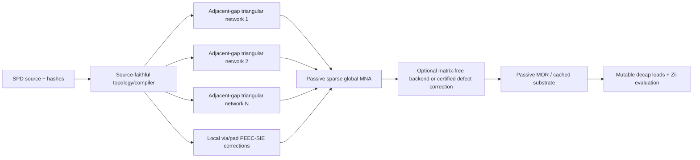

# Evaluation Solver Deep-Research Decision Record

- Date: 2026-08-04
- Status: research decision record; not a production-solver claim
- Scope: Evaluation Analysis accuracy and responsiveness only; De-cap Distribution is out of scope

## Executive decision

The current rectangular cavity-mode evaluator reproduces the overall PowerSI
trend, but its absolute impedance and resonance amplitudes are not sufficiently
accurate for sub-milliohm work. Increasing the modal order alone is not a
solution: on the loaded six-rail benchmark, the PowerSI magnitude RMS error
worsened from `3.1874 dB` at mode index 6 to `3.5387 dB` at index 8 and
`4.0106 dB` at index 12.

The selected production direction is therefore:

1. compile the actual SPD conductor artwork and connectivity into an auditable
   electrical topology;
2. solve every adjacent conductor gap with a nonuniform Delaunay/Voronoi
   triangular surface network;
3. replace or defect-correct the corresponding core blocks with local PEEC/SIE
   models around via, pad, anti-pad, spreading, and tightly coupled terminals;
4. stamp all subdomains and vertical interconnects into one passive sparse MNA
   system, then eliminate internal interfaces by Schur/Kron reduction;
5. correlate retrospectively against the present PowerSI dataset, then validate
   a frozen candidate against newly generated or otherwise unseen data;
6. use a matrix-free operator only in one nonoverlapping role: either as the
   backend for a nonlocal block, or as a certified defect correction
   `R = A_reference - A_core` on identical unknowns and boundary conditions;
7. apply passive model-order reduction such as PRIMA only after the fixed
   substrate model has passed validation and every frequency-dependent block has
   a passive descriptor realization, keeping mutable decap branches outside only
   when their complete attachment-port subspace is preserved.

The proposed `matrix-free residual operator` is a conditional accelerator, not
the primary field model. A uniform whole-board FFT/BEM discretization and an
unqualified layer transfer-matrix product are rejected for this geometry.



## Evidence boundary

PowerSI Touchstone data is comparison-only. No coefficient, dielectric value,
via inductance, sheet resistance, or correction factor may be fitted to the
PowerSI response. The `Dk=3.4` case below is the SPD source-table 100 kHz clamp,
not a PowerSI calibration.

| Item | Evidence |
|---|---|
| SPD | `S4LB002-2Para_260729_1_injected.spd` |
| SPD SHA-256 | `40cb44b2376f59d6b606eb9b4d138204fe51b2dc6b3332d3b7c0e7d4202866d2` |
| SPD size | `1,116,717,287` bytes |
| PowerSI reference | `S4LB002-2Para_260729_1_injected_073026_100913_33216_S.s92p` |
| Touchstone SHA-256 | `c5fca21da6f3b1f1e097ac6fc4c2c4f40a44201617502a9e5bf864e2a5fe7a11` |
| Touchstone size | `303,974,090` bytes |
| Reference ports | 92 |
| VQPS no-decap ports | 10 total, five per site |
| Imported design scale | 11,050 decaps; 44,560 bumps |
| Production Maximum preset | max index 12, 169 rectangular modes |

The no-decap VQPS ports are especially useful because their low-frequency
response separates bulk plane capacitance and conductor/interconnect R/L from
decap model uncertainty. However, all ten VQPS ports, both sites, and loaded
`/0` and `/1` rails were inspected during this research. This dataset is
therefore a retrospective external comparison set, not a blind holdout. A true
blind test requires newly generated PowerSI/measurement data or a source and
port set that was not used in method selection.

## What the experiments established

### Current cavity solver

- The loaded six-configuration PowerSI magnitude RMS error was
  `3.1874 / 3.5387 / 4.0106 dB` for modal indices `6 / 8 / 12`.
- The VQPS low-band equivalent capacitance was underestimated by approximately
  `39.6%` to `53.0%`. The mode-6 sweep covered all ten VQPS ports; the completed
  mode-12 subset did not remove the error.
- This is evidence of a model-form error, not merely modal truncation. Raising
  the mode count can converge the disclosed rectangular model while moving it
  farther from the actual-artwork reference.
- The current solver already includes rectangular finite-area sinc averaging.
  Actual circular/pad shapes, exact self/near source correction, actual copper
  boundaries, inter-plane coupling, and distributed via/pad return paths remain
  necessary before modal-order convergence can be treated as physical
  convergence.

### Actual-artwork adjacent Maxwell-capacitance prototype

The source-artwork capacitance prototype produced the following four
retrospective two-port VQPS cases. Floating nonselected conductors were Schur
reduced and only source-proven adjacent dielectric gaps were used.

| Source dielectric interpretation | Four-case RMS error | Four-case maximum error | Interpretation |
|---|---:|---:|---|
| SPD stack `Dk=3.3` | `13.21%` to `14.66%` | `15.26%` to `17.11%` | source stack case |
| Source-table 100 kHz clamp `Dk=3.4` | `10.61%` to `12.12%` | `12.69%` to `14.59%` | source sensitivity, not fit |

This is a material improvement over the current low-band capacitance error, but
it is not yet a full impedance solver. Nonadjacent opening coupling was disabled
because the SPD did not prove the opening fill thickness/permittivity.

### Uniform FFT/BEM prototype

At a 100 um pitch, the exact-artwork prototype required a `998 x 998` grid and
approximately `3,718,679` to `3,749,956` pulse unknowns across 16 surfaces. Its
estimated FFT workspace was `1,273,608,000` bytes (`1.274 GB`, `1.186 GiB`),
before a full iterative solution. The resource gate correctly stopped the run;
the 50 um refinement was not attempted.

This result rejects the uniform whole-area discretization, not FFT acceleration
itself. Sparse nonuniform geometry should be the primary discretization, with
FFT/NUFFT used only for a structured far-field residual if justified.

For scale, one dense `complex128` matrix at `N=10,834` requires
`N^2 x 16 = 1,878,008,896` bytes (`1.749 GiB`). Three such work arrays require
about `5.25 GiB`, excluding factorization overhead. Dense assembly is therefore
not a viable production path.

### Full-network source graph prototype

The experimental compiler found 2,088 matching node records, 1,598 vias, and
1,016 traces. It intentionally failed closed before solving because:

- polygon-to-conductor contact connectivity was not yet compiled;
- all 1,016 retained traces lacked usable source width for electrical stamping;
- DGND component connectivity, shared-pad terminal identity, and solid-filled
  microvia evidence were therefore not proven end to end.

The prototype consequently reported 490 electrical components instead of the
100 topology components and emitted no impedance metric. This is the first
implementation blocker. Improving the field kernel before fixing the compiler
would only solve the wrong network more accurately.

## Method selection

| Method | Decision | Intended role | Main reason |
|---|---|---|---|
| Nonuniform Delaunay/Voronoi triangular surface network | Adopt | primary layer-domain solver | actual artwork, local refinement, sparse passive stamps |
| Local PEEC/SIE | Adopt locally | nonoverlapping via/pad/anti-pad/spreading and mutual replacement/correction | resolves localized 3-D inductive/resistive physics without double stamping |
| Global sparse MNA + interface Schur reduction | Adopt | authoritative layer/via composition | preserves arbitrary topology and explicit shared DOFs |
| Matrix-free spectral operator | Conditional GO | nonlocal backend, or certified `A_reference - A_core` correction | avoids dense blocks only if nonoverlap, symmetry, and passivity are retained |
| Spectral Ewald + NUFFT | Conditional | implementation of the residual far field | fast nonuniform evaluation with controllable truncation |
| H2 matrix compression | Fallback | residual/operator compression | geometry-agnostic alternative if Ewald structure is unsuitable |
| Uniform full-area FFT/BEM | Reject | none | millions of mostly unnecessary unknowns on the real design |
| Generic ACA/FMM alone | Research only | comparison/fallback | speed does not by itself guarantee passivity |
| Full-board PEEC/MoM/BEM | Reject globally | local or offline oracle | excessive global memory/runtime at required geometric detail |
| 3-D FEM | Reference only | independent golden cases | too expensive for interactive repeated decap evaluation |
| FDTD | Reject for product core | none | thin, multiscale MLO geometry gives an unfavorable grid/time step |
| Vector fitting | Restricted | compact constitutive/reference models | not a field solver; requires explicit passivity enforcement |
| PRIMA | Adopt after validation and passive realization | passive substrate MOR with preserved attachment-port subspace | preserves passivity for a faithful finite-dimensional descriptor substrate |

## Layer-by-layer network composition

Solving `Top-L01`, `L01-L02`, and subsequent adjacent gaps independently is
valid and parallelizable if each subproblem exposes the same physical interface
unknowns used by the global network. The authoritative merge is not a scalar
sum. For a partitioned complex admittance matrix,

```text
[Ie]   [Yee Yei] [Ve]
[Ii] = [Yie Yii] [Vi]

Yreduced = Yee - Yei * inv(Yii) * Yie
```

the internal interface `i` is eliminated by a Schur/Kron complement. In
implementation, `inv(Yii)` means a sparse solve, not explicit inversion.
Adjacent-gap extraction can run in multiple processes, but the subdomain stamps
must be assembled into one global passive MNA system before reduction.

Ownership must be explicit. Each dielectric-gap subdomain owns its transverse
field and dielectric `G/C` contribution. Each physical copper sheet owns its
surface `R/L` operator exactly once, even when it bounds two adjacent gaps; the
shared copper is an interface degree of freedom, not two copied sheets. Each
via, pad, anti-pad, and local correction is also stamped exactly once. A
synthetic multilayer acceptance case must match a monolithic reference and prove
that no sheet impedance or local correction is duplicated.

A local PEEC/SIE model must either replace the corresponding triangular-core
local block or enter as `A_local,exact - A_local,core`. It must never be added as
an unqualified second via/spreading/near-field contribution.

A matrix product is valid only after defining compatible chain/ABCD or wave-port
bases. A Redheffer star product or cascaded S-parameter construction can be used
for explicitly defined wave-port networks. The arbitrary branched PDN, shared
vias, floating copper, and many shunt decaps do not form a single chain, so a
unqualified transfer-matrix multiplication is not the general solution.

## Matrix-free operator specification and falsification gate

The following modal split is a pilot/oracle for accelerating the existing modal
formulation. It must not be added unmodified on top of a triangular PDE network,
because that network already represents the resolved spectrum. For a triangular
core, either use matrix-free execution to apply a nonlocal reference block, or
define a defect correction `R = A_reference - A_triangle` on the same unknowns,
materials, ports, and boundaries and verify that partition directly.

For the modal pilot, the retained low-order dynamic modes and finite-area port
integrals remain explicit. Only the omitted high-order remainder is
accelerated:

```text
Gfull = Glow,exact + Rhigh
Rhigh*x ~= (Rnear,finite-area,exact - Rnear,grid)*x
           + Rall,Ewald-NUFFT*x
```

Here the gridded Ewald/NUFFT term includes its approximate near contribution,
so the exact near block replaces rather than duplicates it. An implementation
whose far operator explicitly excludes the near list may omit that subtraction,
but must prove the two partitions are algebraically equivalent.

Required construction rules:

1. use the exact finite-area near kernel and symmetric pair corrections;
2. use adjoint spread/interpolate operators so the discrete far operator remains
   reciprocal to numerical tolerance;
3. subtract every explicitly retained low mode and every core contribution from
   the accelerated operator exactly once;
4. keep the Neumann `k=0` term in the explicit low block. The mean-zero Green
   function satisfies `-laplacian(G) = delta - 1/area`; the uniform-background
   term cannot be silently dropped;
5. use even reflection only when it actually represents the rectangular
   Neumann boundary; slots and irregular external boundaries remain in the
   artwork-domain sparse model;
6. verify the Hermitian part of the resulting port admittance/impedance for
   passivity at every validation frequency;
7. monitor GMRES/Krylov iteration growth and preconditioner stability as the
   mesh is refined.

For a representative 73 mm dimension with `epsilon_r=3.3`, the prior bound for
a quasi-static tail beginning after index 12 was about `0.47%` modewise at
1 GHz. A preliminary `0.1%` modewise target moves the exact dynamic cutoff to
approximately 419 radially retained modes, or the conservative square cutoff
`m=28` (`29 x 29 = 841` modes), before applying a static residual. These are
pilot bounds, not production defaults.

The residual is promoted only if a small direct problem proves all of the
following over the full band and mesh refinement sequence:

- direct-modal versus residual matvec error is below the allocated error budget;
- reciprocity and charge conservation are maintained;
- the Hermitian energy/passivity check does not develop negative eigenvalues
  beyond roundoff-scaled tolerance;
- no low-mode double counting or `k=0` drift occurs;
- Krylov iterations remain bounded enough to meet the performance gate.

If any condition fails, retain the sparse triangular core and evaluate H2 or a
localized direct tail instead. Matrix-free acceleration must never be enabled
merely because it is faster on one case.

## Validation and promotion gates

PowerSI remains an untouched comparison-only reference, but the current 92-port
dataset is not blind because both sites have already influenced this research.
The existing site split may be used as a disclosed regression partition only.
A candidate must be frozen before it is evaluated on newly generated or
otherwise unseen PowerSI/measurement data; without such data, results must be
reported as non-blind correlation.

| Category | Proposed gate |
|---|---:|
| Development-set `|Z|` RMS | `<= 1.00 dB` |
| Held-out `|Z|` RMS | `<= 1.25 dB` |
| Full-band `|Z|` maximum | `<= 2.00 dB` |
| Phase RMS / maximum | `<= 7 deg / 15 deg` |
| Dominant resonance shift | `<= 10%` |
| Sub-1 mOhm complex error RMS | `<= 100 uOhm` |
| Sub-1 mOhm complex error p95 | `<= 200 uOhm` |
| Maxwell-C median / per-element error | `<= 10% / 20%` |
| Canonical/local-EM via L diagonal / mutual error | `<= 15% / 25%` |
| Port-domain reciprocity | `<= 0.1 uOhm` |
| Scaled matrix reciprocity / backward residual | `<= 1e-10` |

Additional hard gates are source-hash identity, frequency convergence, mesh
convergence, passive-MOR convergence, charge conservation, and nonnegative
Hermitian energy within a scale-aware numerical tolerance. No candidate may
improve the development site while worsening the held-out site beyond its gate.

The full-board 92-port Touchstone response cannot uniquely identify an internal
via self/mutual-L decomposition. The via-L gate therefore applies only to a
canonical structure with an independent local EM/extraction oracle; the
full-board response remains an end-to-end impedance gate.

The all-92-port reference audit observed a maximum S-to-Z transform condition
number of approximately `1.4574e6`. Validation must therefore report transform
conditioning and compare consistent S, Y, and Z views where practical; an
ill-conditioned low-frequency transform must not be mistaken for physical
nonpassivity or used as a fitting target.

The following are proposed engineering targets, not achieved measurements:

- after substrate-cache creation, six selected rails complete within 120 s;
- peak solver memory remains within 4 GiB;
- the UI event-loop heartbeat remains at or below 250 ms during load, compile,
  solve, cancellation, and result rendering.

## UI and execution architecture

The v0.17.0 operational work already suppresses BLAS oversubscription, prepares
documents in workers, coalesces progress events, protects cancellation races,
and renders the board in stages. The new solver must preserve that separation:

- SPD parsing, geometry compilation, subdomain extraction, factorization, and
  frequency sweeps run outside the GUI thread;
- independent adjacent-gap extraction uses bounded process-level parallelism;
- the compiled fixed substrate is immutable and hash-addressed;
- decap changes stamp only mutable branches and reuse the substrate cache;
- progress is reported by named phases with monotonic work units, not by a flood
  of per-element callbacks;
- cancellation is cooperative at compilation, mesh, factorization, frequency,
  and MOR checkpoints, and stale worker results are discarded by generation ID;
- results are rendered incrementally, while controls that would invalidate the
  active generation are disabled with a visible reason.

## Implementation sequence

1. **Topology/compiler:** add polygon contact, trace-width provenance or a
   fail-closed source rule, DGND connectivity, shared-pad terminals, and
   microvia-fill evidence; create deterministic graph certificates.
2. **Layer-domain core:** create adaptive Delaunay/Voronoi meshes on the actual
   artwork, with convergence indicators and passive R/L/G/C stamps.
3. **Local 3-D correction:** replace the rectangular finite-port approximation
   with source-proven actual pad/circular shapes where needed, and apply PEEC/SIE
   via, pad, anti-pad, spreading, skin/proximity, and mutual blocks only as a
   nonoverlapping replacement or `exact - core` correction.
4. **Global composition:** assemble adjacent gaps and vertical connections into
   sparse MNA and eliminate internal interfaces with sparse Schur solves.
5. **Correlation and blind validation:** regress retrospectively on all ten VQPS
   ports, all 92 ports, and the selected VTRIP/VINT/VCPU rails; then freeze the
   candidate before evaluating newly generated or otherwise unseen reference
   data.
6. **Acceleration decision:** run the matrix-free operator falsification suite;
   use H2/local direct alternatives if it fails.
7. **Passive MOR and product integration:** build a cached fixed substrate,
   first realize tabulated dielectric/copper, skin-effect, and nonlocal
   frequency dependence as a passive causal descriptor; leave decap branches
   mutable only while preserving their complete attachment-port subspace,
   preserve cancellation/progress/UI heartbeat, and enable the solver only
   behind an experimental accuracy option until every promotion gate passes.

## Current blockers and nonclaims

- The research prototypes are not production-enabled and are not evidence that
  the evaluator already meets the proposed gates.
- The source topology compiler is incomplete, so no full-network prototype
  impedance result has been accepted.
- The exact-artwork result is a capacitance benchmark, not a complete R/L/G/C
  or loaded-decoupling validation.
- The PowerSI data confirms comparison error; it is not a calibration input and
  cannot prove the correctness of an unmeasured internal decomposition.
- This record changes documentation only. It does not change v0.17.0 solver
  behavior, application version, installer, or release assets.

## Research artifacts

The numerical values in this record were summarized from the following local,
hash-bound research artifacts. They are intentionally not production inputs:

- `vqps_current_solver_baseline.json`
- `vqps_bulk_capacitance_benchmark.json`
- `fft_bem_capacitance_benchmark.json`
- `full_multinet_loaded_hybrid_benchmark.json`

The production modeling boundary and already shipped validation results remain
documented in [Evaluation Accuracy and Modeling Boundary](EVALUATION_ACCURACY.md).

## Review status

The architecture and matrix-free proposal received multiple internal
algorithm-review passes. No Claude review result is included in this revision.
The next revision should record Claude findings as accepted, rejected, or
requiring experiment, with a concrete reason and evidence for each disposition.

## Primary references

- J. Y. Choi and M. Swaminathan, ["Modeling of Power/Ground Planes Using
  Triangular Elements"](https://doi.org/10.1109/TCPMT.2013.2277659), IEEE
  TCPMT, 2014. A public author copy is also available from
  [Georgia Tech](https://epsilon.ece.gatech.edu/publications/2014/Triangle.pdf).
- K.-B. Wu et al., ["Delaunay-Voronoi Modeling of Power-Ground Planes With
  Source Port Correction"](https://doi.org/10.1109/TADVP.2008.920326), IEEE
  Transactions on Advanced Packaging, 2008.
- M. Kollia and A. C. Cangellaris, ["A Domain Decomposition Approach for
  Efficient Electromagnetic Analysis of the Power Distribution Network of
  Packaged Electronic Systems"](https://doi.org/10.1109/TEMC.2010.2045380),
  IEEE TEMC, 2010.
- J. H. Kim and M. Swaminathan, ["Modeling of Multilayered Power Distribution
  Planes Using Transmission Matrix Method"](https://doi.org/10.1109/TADVP.2002.803258),
  IEEE Transactions on Advanced Packaging, 2002.
- F. De Paulis, Y.-J. Zhang, and J. Fan, ["Signal/Power Integrity Analysis for
  Multilayer Printed Circuit Boards Using Cascaded S-Parameters"](https://doi.org/10.1109/TEMC.2010.2072784),
  IEEE TEMC, 2010.
- F. D. Quesada Pereira et al., ["Integral Equation Analysis of Multiport
  H-Plane Microwave Circuits by Using 2D Rectangular Cavity Green's Functions
  Accelerated by the Ewald Method"](https://doi.org/10.1049/mia2.12308), IET
  Microwaves, Antennas & Propagation, 2023.
- J. Trinkle and A. Cantoni, ["Impedance Expressions for Unloaded and Loaded
  Power Ground Planes"](https://doi.org/10.1109/TEMC.2008.919036), IEEE TEMC,
  2008.
- Z. L. Wang et al., ["Convergence Acceleration and Accuracy Improvement in
  Power Bus Impedance Calculation With a Fast Algorithm Using Cavity Modes"](https://doi.org/10.1109/TEMC.2004.842205),
  IEEE TEMC, 2005.
- A. E. Ruehli, ["Equivalent Circuit Models for Three-Dimensional
  Multiconductor Systems"](https://doi.org/10.1109/TMTT.1974.1128204), IEEE
  T-MTT, 1974.
- J. R. Phillips and J. K. White, ["A Precorrected-FFT Method for
  Electrostatic Analysis of Complicated 3-D Structures"](https://doi.org/10.1109/43.662670),
  IEEE TCAD, 1997.
- A. H. Barnett, J. Magland, and L. af Klinteberg, ["A Parallel Nonuniform Fast
  Fourier Transform Library Based on an Exponential of Semicircle Kernel"](https://doi.org/10.1137/18M120885X),
  SIAM Journal on Scientific Computing, 2019.
- D. Lindbo and A.-K. Tornberg, ["Spectral Accuracy in Fast Ewald-Based Methods
  for Particle Simulations"](https://doi.org/10.1016/j.jcp.2011.08.022),
  Journal of Computational Physics, 2011.
- W. Hackbusch and S. Borm, ["Data-Sparse Approximation by Adaptive
  H2-Matrices"](https://doi.org/10.1007/s00607-002-1450-4), Computing, 2002.
- L. Ying, G. Biros, and D. Zorin, ["A Kernel-Independent Adaptive Fast
  Multipole Algorithm in Two and Three Dimensions"](https://doi.org/10.1016/j.jcp.2003.11.021),
  Journal of Computational Physics, 2004.
- A. Odabasioglu, M. Celik, and L. T. Pileggi, ["PRIMA: Passive Reduced-Order
  Interconnect Macromodeling Algorithm"](https://doi.org/10.1109/43.712097),
  IEEE TCAD, 1998.
