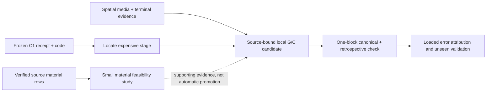
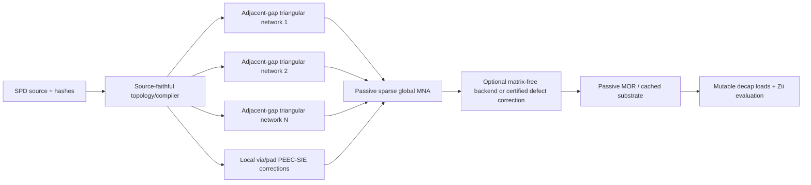

# Evaluation Solver Deep-Research Decision Record

> Historical research record. The original v0.22.0 proposal described a
> hybrid layer-surface/modal composition. Current production Layerwise instead
> uses terminal-complete global-Y Device-port Zii alone and stamps no legacy
> modal add-on; current validation is recorded separately.

- Date: 2026-08-04
- Status: synthesized research decision record; not a production-solver claim
- Scope: Evaluation Analysis accuracy and responsiveness only; De-cap Distribution is out of scope
- Independent review input: Claude branch
  `claude/pdn-analysis-algorithm-research-dojd6i`, commit
  [`26d7698`](https://github.com/yunhyok/probe-card-mlo-pdn/commit/26d76982ec6965c744f062dd6213e04a9fd94a51)
- Synthesis rule: a proposal is promoted only when source-only physics,
  nonoverlapping ownership, numerical conditioning, and an independent
  validation path are all defined

<a id="current-checkpoint-2026-09-06"></a>
## Astra HQ checkpoint — 2026-09-06 (SPD Decap PI Evaluator v0.23.1)

**07:37 KST result, 2026-09-10:** the conditional L25-only magnetic response
is numerically insufficient: residual3.2536/info1 and adapted physics18/23.
Its apparent reference-error change63.41% to54.60% is not an accepted gain.
Next examine source-owned complete return-current coordinates Pg+Cpsi,
using the existing R/H/tree lift and its transpose; freezing the R-minimum
contact current shape would omit magnetic redistribution. See the
[supervision record](evaluation-research/ASTRA_STEP5_SUPERVISION_2026-09-07.md)
for actual metrics, the derived identity, and the remaining global scope.

**07:20 KST update, 2026-09-10:** actual latest R-only physical diagnosis
`75985361…` improves 18/23 to 19/23 gates; full KCL and power closure still
fail, and no accuracy acceptance changes. The bounded L25 self+mutual run
`fb737651…` is now executing. The retained and added physics ownership,
HQ-corrected current-vector dimension, timings and remaining scope are recorded
in the [supervision record](evaluation-research/ASTRA_STEP5_SUPERVISION_2026-09-07.md).

**06:11 KST next discriminator, 2026-09-10:** use the explicit L25 current
block for a bounded changed-physics self+mutual10MHz response, preserving
current Y/U/D/NtD and source ownership. Auxiliary R+jw*Lself supports flexible
preconditioning; fullL appears only in true actions. This provides an actual
conditional response sooner than repeating completed local P17/Green controls,
without claiming complete global return or electromagnetic coverage. Proposed
6 fullL/6 NtD/4 M within600s/720s/32GiB; implementation remains disabled in review.
The old1MHz centroid-versus-three-point Lq difference1.5946% remains explicit.

**05:58 KST result, 2026-09-10:** flexible field continuation c81140d9…
reduces true residual94.4879% to0.000220726182650 with4 outer directions.
Raw info1 and original tolerance failure remain. Raw PowerSI error changes
only63.45055% to63.41180%; ordinary-transpose stationary error is63.41076%.
This supports the preconditioner, while leaving the physical-accuracy problem
unresolved. Do not extend unchanged-model iterations. Revisit the common
current/charge representation and missing physics. The run costs189.172s/
25.343GB private under the external210s/32GiB guard; end-to-end180s internal
compliance was not established. No standalone speed or physical acceptance.

**05:42 KST preregistration, 2026-09-10:** generalize the positive Schur
direction with an arbitrary-RHS preconditioner: one L02 solve, then joint/L25
Schur correction, retaining the inhomogeneous contact lift `-D*r_g`.
Use flexible gcrotmk m4/k0/maxiter1, inner GMRES restart4/maxiter1, within
4 M/28 B1/4 R/24 Q/6 true A actions and 180s/210s/32GiB bounds.
Require >=20% true residual improvement from the saved optimized warm field
and <=2x L02 residual growth; preserve inverse and identity gates. No extra
cycle or info-code reinterpretation. The unchanged physical-model error
near 63.4% is still the primary unresolved issue. Full details are in the
[supervision record](evaluation-research/ASTRA_STEP5_SUPERVISION_2026-09-07.md).

**05:21 KST positive screen, 2026-09-10:** L25/joint Schur correction
`b148569d…` passes the preregistered gates in 56.078s/10.773GB private,
using 4 Arnoldi actions. Optimized true-global residual falls 52.4059% to
0.004004416643 and the L02 outside norm falls 9.7872%. The optimized raw
PowerSI comparison remains 63.45055% and unvalidated (source 63.65262%).
This supports a bounded flexible full-field experiment, not a claim that
physical-model accuracy or broadband runtime is solved. A saved-direction
success must first be generalized to a defined arbitrary-RHS preconditioner.

**05:03 KST result, 2026-09-10:** cached joint residual back-substitution
`b81bd537…` repairs native/L14/L04 contact equations, but moves the dominant
defect to L25. It took 33.547s/5.518GB private, one B1 and one true NtD action.
Unit residual is 5.542711x initial; optimal one-direction reduction is only
0.253082%, and an additional saved-only two-direction fit gives 0.260746%.
This identifies the next coupling to treat, not physical accuracy progress.
Assess a bounded L25/joint Schur correction before any long continuation;
measure L02 and other outside effects as part of the same discriminator.

If the reduced Schur screen succeeds, an inner Krylov solve must not be
silently treated as a fixed linear inverse inside the old transformed outer
operator. An installed option already supports variable right preconditioning:
SciPy 1.18.1 `gcrotmk` passes `M` to its FGMRES right-preconditioner path
(`_gcrotmk.py`, inspected locally). Its
[official API documentation](https://docs.scipy.org/doc/scipy/reference/generated/scipy.sparse.linalg.gcrotmk.html)
also permits a preconditioner that varies between iterations. This is a
conditional algorithm option, not a new dependency, implementation, or runtime
claim; first complete the bounded saved-state Schur discriminator.

**04:41 KST finding, 2026-09-10:** internal trace reconstruction `e14e7a76…`
finished in 24.031s/3.333GB private without refactorization or NtD replay.
The actual projected joint inverse residual is 7.201e-13, yet the combined
primal residual ratio is 5.07975 and H-lambda-minus-E-g/g is 0.848392.
This separates a small measured inverse residual from the final equation
defect; it does not establish H-model error or an additive forward-error
budget. Inspect coarse correction and off-block L02 coupling before choosing
another global iteration. Original numerical and physical failures remain.

The saved-only support check (0.219s) then located all but 2.186e-16A L2
of the H-lambda-minus-E-g defect on the 20 known L02 off-block trace rows.
The next bounded discriminator is one cached joint residual back-substitution,
followed by one true MNA action of the repaired direction. The algebra is
`delta_K=B1((r_primal-P_primal*z)_K)`, with zero update outside K; it retains
the outside response while correcting its joint coupling. This is consistent
with block triangular correction, whose role in approximate block
factorization is described in the
[PETSc Schur factorization documentation](https://petsc.org/main/manualpages/PC/PCFieldSplitSetSchurFactType/).
It is not an exact Schur solve or a convergence guarantee. No PETSc dependency
or new factorization is needed for this saved-direction experiment.

**04:18 KST decision, 2026-09-10:** the joint cache is valid but its measured
one-step global direction is ineffective: unit31.2158x residual, optimized
0.0204116% norm reduction,97.2916% of unit residual squared in L04 contacts
(`a620e7e1…`,63.579s/24.740GB private). Do not equate a valid factor with an
effective global preconditioner or launch a long continuation. Reconstruct
the missing internal auxiliary trace with three cached B1 actions and saved
coarse identities; no factor or NtD replay. This separates residual evidence,
not additive forward-error attribution or physical-model accuracy.

**04:05 KST numerical preparation, 2026-09-10:** joint native/L14/L04 factor
and persisted public L/U cache passed (result `4eb346b9…`,cache `b95162dc…`),
LU81.720s,total133.625s,16.880GB sampled private. Fixed B1 is required because
the uncorrected inverse fails the original2e-8 gate. Next measure one actual
saved10MHz residual with cached factors, preserving the true exact NtD and all
physics. No new global convergence, model accuracy or speed acceptance.

**03:59 KST discriminator, 2026-09-10:** qualified L25 self-L on the new10MHz
field gives fixed-field derivative+0.701607+j1.240073mOhm, magnitude1.424792mOhm
(result `66e50c33…`,2.188s/156.5MB private). This is materially large against
the raw1.016482mOhm gap, but no finite changed-model response has been solved.
Preserve all numerical/physical failures and missing mutual/return/proximity
terms; do not add this derivative to Z or select self-only physics. A coupled
auxiliary factor cache is being prepared to avoid repeated setup in the next
actual-field experiments.

**03:47 KST decision, 2026-09-10:** actual10MHz physical diagnosis passes18/23
conditions; global KCL, L04 contact KCL and power closure still fail. Post-freeze
saved-reference comparison measures63.65262225% raw complex error and
63.41173998% stationary-functional error; neither is an accepted accuracy
result. A3.166micro-ohm power defect cannot bound the1.016482mOhm reference gap
or prove that it is all physical-model error. Joint native/L14/L04 auxiliary
assembly and an independent four-block identity check passed; factor/solve
remain unmeasured. Stop generic iteration extensions and review the cheapest
existing magnetic/return/proximity discriminator. Full-band accuracy and speed
remain unmet; details and receipts are in the [supervision record](evaluation-research/ASTRA_STEP5_SUPERVISION_2026-09-07.md).

**03:25 KST result, 2026-09-10:** actual10MHz right-LGMRES completed four
inner24/outer3 cycles in865.75s external/29.772GB private, but failed the
original numerical criterion: info4, residual0.00841369, maximum eliminated
current defect2.594mA. Result `5fa0b4fa…`/guard `c05235fc…` preserve the failure.
Raw Z=0.638331+j0.136044mOhm and stationary J=0.640775+j0.139026mOhm
remain unvalidated; successive stationary variation is not an error bound.
Do not extend the same iterations. Next recover and physically diagnose the
actual10MHz field, then assess stronger native/L14 coupling in the auxiliary
preconditioner without changing the true physical model.100MHz is assembled
only. Existing accepted1MHz accuracy and all physical-model gaps remain.

**02:55 KST decision, 2026-09-10:** stop generic1MHz iterations following the
two-state stationary-output probe; its variation ratio8.891595e-6 is not an
error bound. Actual10/100MHz operators are now assembled from saved source
dispersion, terminations, native/composite RL, rebuilt L02 cellGC and matched
L04 delta/U/D. Result `7efcd3d9…` reports30.344s/1.415GB private and exact
finite/termination baseline reproduction; retainedGC relative difference is
7.4485e-18. Partial ownership was corrected after a failed first control and
all failed artifacts remain. Fixed sheetDC resistance is an explicit model
limit; no magnetic/proximity/skin extension or new response is claimed. Next:
frequency-specific auxiliary preconditioner and a bounded10MHz true-NtD solve.

**Current decision, 2026-09-10 after 02:00 KST:** finish output-level diagnosis
before spending more on a scalar residual threshold. Original-NtD right-LGMRES
ended at 2.654079347e-6/info4 in 842.297s; the final port change was only
0.00398228 micro-ohm. One saved-field recovery and a 31.407s physical diagnostic
now measure all 23 original criteria: 19 pass; global KCL is 0.830734 microamp
and physical power mismatch is 1.402198 nano-ohm at 1A, so both KCL/power pairs
still fail. Local sheet/contact/constitutive/work checks pass. The diagnostic
retains every failure and makes no forward-error-bound claim. Raw, unvalidated
1MHz reference error is 25.98577635%, versus the accepted baseline26.18268398%;
the 0.19690763pp difference is not a validated improvement. Assess a minimal
output-oriented residual discriminator and the much larger remaining physical
model gap rather than automatically extending Krylov work.

**Preceding numerical work:** bounded restart12x2 reduced true residual
219.8893 to 0.05037717, in 318.797s/26.926GB private. The residual now lies mainly
in native (71.3%) and L02 (22.7%) scaled equations. Test one saved-field restart24x2
continuation to distinguish a short-Krylov limitation from persistent slow modes.
That continuation completed at 0.0002098647154 in 505.469s/27.661GB private,
supporting a bounded restart48x2 continuation toward true convergence.
That run ended at 9.537136238e-6 in 882.266s/29.133GB private. The final cycle
improved only about 2.4x. The next discriminator is fresh-vector fixed-right
LGMRES rather than another increase in restart length; restart loss is not yet
proven as the cause. Keep original NtD, B1 and
1e-9 acceptance unchanged. No new physical Z or PowerSI accuracy has been accepted.

**23:37 KST preceding decision, 2026-09-09:** original-NtD one-action result
`73b2ae82…`/guard `8db1f233…` (128.625s/25.804GB private) measures an optimized
true-residual ratio0.941640719, a5.835928% reduction at unchanged restart6.
The preceding auxiliary reduced only0.00799054%. Preconditioner3.629s and
true action4.073s are measured costs, not a convergence forecast. HQ verified
saved vectors `5b33db63…`. This warrants at most two restart12 right-GMRES
cycles to measure the trend, with original NtD and fixed B1 unchanged.

Interpretation of trace01's1.413e-7 defect: it is a single saved-field current
equation discrepancy, not a full matrix-norm error or a measured port-Z error.
Its1e-7 internal boundary was not derived from a final PI accuracy requirement.
The observed9.393nA L2/3.032nA maximum-row differences do not establish an
unacceptable practical PI error. Preserve the diagnostic failure while judging
next experiments by true circuit convergence and final port response.

**23:30 KST preceding decision, 2026-09-09:** exactly one residual correction
passes the original factor gates. Helper `349abe08…`, frozen `3c01ed5c…`,
result `e0b494be…`, guard `406ea640…`: 98.093s/15.165GB private, exit0.
Corrected N/T residuals are 2.626e-10/3.850e-10, reference/public parity
1.430e-9/6.759e-10. Raw inverse gates remain failed. HQ verified the saved
arrays. Sol accepted one bounded true-MNA action measurement using this fixed
B1 on every native solve, with the scaled matrix retained; it is running.
This is a numerical inverse improvement, not a new physical response.

**23:27 KST preceding decision, 2026-09-09:** raw auxiliary factor01 preserves
exit1: 3.860e-8/3.843e-8 normal/ordinary-T residuals exceed the unchanged 2e-8
criterion. Public-factor parity remains 4.506e-15/1.155e-15. Frozen `5b234507…`,
diagnostic `c6ab690e…`, failure `2e25d4a7…`, guard `0caa1d36…` record
74.094s/15.140GB private. Saved residual diagnosis `8ea8a812…` shows native
row71609 (98,017 terms) dominates; normwise backward error is about 2.5e-15.
Re-summing all 34 high-degree rows (`7207a525…`) does not improve the result.
This warrants one fixed residual correction B1=2B-BAB, not a relaxed gate or
raw-B global run. The new bounded probe preserves raw and corrected N/T data.

**23:04 KST preceding decision, 2026-09-09:** the saved H is separately qualified
for auxiliary use only (`dee4b3af…`); the original trace failure remains intact.
Native+hybrid-H static01 has 2,455,688 rows/10,930,714 nonzeros, with all contacts
and twenty explicit L02 links preserved. Frozen `0c8e32bf…`, result `c786147c…`,
artifact `32d4c9f0…`, external guard `101a5859…`; 9.516s/728,649,728B private,
exit0, HQ saved-artifact checks pass. This establishes assembly cost only.
An isolated factor/probe and then a fixed-restart residual/action comparison
must establish usefulness while exact full-R ContactNtD supplies every true action.
No physical H replacement, global Krylov extension or new board accuracy result.

**22:46 KST preceding decision, 2026-09-09:** trace01 `d2ba043b…` preserves a failed
physical-equivalence gate (`bf94a73d…`/`8cee8c63…`): raw H-lambda relative defect
1.41308e-7 versus 1e-7. Structural checks and the other eleven field checks pass;
shared-current difference is 3.0724e-9 and energy differences about 4.67e-11.
Actual internal cost is 43.469s/1.893GB, with no external guard. The saved H has
1,698,803 gauged rows and 7,860,127 nonzeros. Saved-only decomposition `75c6f180…`
shows raw defect L2 9.39257e-9A aligned 0.999986 with scattered shared-current
error; constant-row and remaining arithmetic terms are only 3.80e-11/3.34e-11A.
Do not blame sparse summation alone or loosen the failed gate. A separately
qualified approximate auxiliary may be tested as a preconditioner while the
original full-R NtD remains authoritative. No physical replacement or new Z.

**21:54 KST preceding decision, 2026-09-09:** static cells01 `fddf240b…` establishes
local full-R hybrid coefficients for all 1,589,827 conditional L04 cells.
Frozen `cd925c92…`, NPZ `8f51d808…`; internal 9.750s/501.7MB, no external guard.
The inherited RH/Rw/row/weight roundoff ratios remain below one; large restricted
weights (maximum magnitude 1301.0) are preserved. HQ's two-cell check `d6ab5891…`
also verifies mixed-to-trace reconstruction, current, energy and complex MNA
equivalence. This is local evidence only. Next assemble the exact trace graph
and verify it against saved full-R fields, with the original contact gauge and
no new factorization. Global conditioning and board accuracy remain unmeasured.

**21:34 KST preceding decision, 2026-09-09:** preflight02 `eeadffce…` completed under
32GiB (`85ca57ba…`, 108.609s/25.236GB), but the optimal one-step norm reduction
was only 0.00799054%; a unit step worsened the norm by a factor of 5.396659.
The saved action aligns with the residual by only 0.0126414 in the complex
Euclidean inner product. No global continuation is justified by this test.
Saved exact L04 current yields 0.000474274W with full R versus 0.112114W with
diag(R), a factor of 236.389935; this identifies a weakness without proving
complete failure attribution. The next candidate is reuse of exact L02 local
hybrid elimination, preserving restricted exterior fluxes and contact identity.

[Dobrev et al., algebraic hybridization](https://arxiv.org/pdf/1801.08914),
Section 3.2, derives a trace system by eliminating local mixed variables.
This supports investigating an equivalent representation that retains local
mass couplings. It does not establish performance for this complex PDN or its
thin triangles. Here the implementation path comes from the existing L02
full/restricted coefficient routines, with local and saved-field checks still
required before an L04 assembled operator is accepted.

**21:00 KST preceding decision, 2026-09-09:** native public-factor compaction has
actual evidence: result `cc764850…`, guard `d94ce6e8…`, diagnostic `4f0875c7…`.
The same two complex RHS gave N/T solution parity 2.599e-15/1.490e-15 and original
scaled-matrix residual 4.822e-9/4.814e-9. Deleting only the SuperLU object reduced
observed memory by 11,696,123,904B to 1,118,584,832B. Cost is slower two-RHS
inverse action: 1.391/1.528s versus 0.234/0.282s. This permits a bounded compact
preflight02 candidate, not a convergence or accuracy claim. Keep the exact NtD,
three other factors and full primal/MNA coupling unchanged; measure the true
stalled-field residual before any global solve. No tolerance or memory-cap change.

**20:43 KST preceding decision, 2026-09-09:** sheet-aware preflight01 `bc2f8bfe…`
passed all four factors and its three-mode coarse checks (condition38172.16,
mode error4.504e-11). Its32GiB guard stopped it at86.782s/35.398GB private;
`a173a7b8…` and diagnostic `34121e38…` preserve that outcome. No residual/action
vectors or numerical result were produced. The next isolated probe tests copying
the public native-factor L/U/permutations and releasing the SuperLU owner, using
the installed public triangular solve. Actual parity and post-release memory
must support that change; no cap-only replay or new physics simplification.

**20:08 KST preceding decision, 2026-09-09:** the saved native+L04 auxiliary was
assembled once in10.031s/775MB private (`ae45f216…`) and its isolated scaled LU
passed in60.578s/12.808GB private (`fcf48774…`,guard `6ed6ca72…`). Factorization
took57.413s and one solve0.140s; its probe residual6.724e-9 satisfies the stated
2e-8 factor gate. This establishes bounded one-block cost only. Next measure
the full preconditioner on the actual stopped restart6 residual, replacing the
old native LU and preserving all20 L02 off-block couplings. No new global solve
before this evidence; no spectral equivalence, broadband, or accuracy claim.

The preflight uses the following Astra-derived mapping, independently checked
by Sol. Let `L=B diag(R04)^-1 B.T` have the same L04 root removed, and let `E`
select its independent contact nodes. The auxiliary primal matrix is
`P=[[A',U E.T],[E U.T,L+E D E.T]]`, retaining all U entries in its action.
With `K=[[I,-U],[0,-E D]]`, the corresponding MNA preconditioner is
`K.T P_approx_inverse K-diag(0,D)`. Ordinary transpose applies throughout.
For `P_scaled=S P S`, physical inverse application is
`S P_scaled_approx_inverse (S rhs)`. The enlarged native factor is the block
approximation; the20 L02 links remain in the full action and both transforms.
Three primal layer-constant modes receive an enlarged-native harmonic correction.
The measured residual direction comes from the stopped restart6, with an optimal
complex least-squares scalar reported diagnostically; it cannot establish global
convergence by itself.

The diagonal-mass Schur direction is supported by
[Batista, Hu and Zikatanov, section2.1, equation9](https://par.nsf.gov/servlets/purl/10163554).
Their analysis assumes shape-regular simplices. It does not establish a uniform
bound for the skinny board mesh, complex PDN equations, or the mapping above.

**19:42 KST preceding decision, 2026-09-09:** coupled01's Z=0 preconditioner stalled
at219.889 scaled residual, with99.9993983% residual squared in L04 contact rows.
HQ stopped it after468.922s; stable restart6 `e0950b0c…` has no physical or accuracy
acceptance. Preserve NtD qualifier03 `a583a96e…` and the original failed02 receipt.
Next assess a sheet-aware primal auxiliary containing native+all gauged L04 nodes,
with diagonal RT0 R only in the preconditioner. Sol independently verified the
inverse mapping; real-mesh suitability, factor fill/cost and residual reduction
remain unproven. No identical global retry or new magnetic/adaptive branch.

**19:16 KST preceding decision, 2026-09-09:** use all38278 L04 contacts through the
saved exact NtD, with the ten verified source-path replacements. Circuit bridge
`1583612f…` is accepted. NtD probe02's saved q/dual/KCL evidence satisfies the
original reader's physical criteria; preserve its exit1 and qualify the saved
diagnostics rather than repeating the action. The new symmetric full-contact MNA
driver is under Sol review. Three sheet constants and two real/imaginary current
directions are preconditioning only, not a physical contact-space truncation.
The next outcome is a physically validated actual1MHz complex Z comparison.
No broadband, holdout, complete electromagnetic model or fast-solve claim follows.

**18:24 KST retained baseline, 2026-09-09:** hybrid field `960e767c…` is now accepted
by original residual9.9914003e-10 and all16 fd28 physical gates. Right correction
`7341e700…` took70.093s/24.628GB private from a completed failed final field;
1757.515s across all eight hybrid global attempts is the relevant recorded total,
excluding isolated diagnostics. Same-fd28 saved-field replay is reproducibility,
not a new independent derivation. Actual comparison `2049cf10…` only improves
the existing1MHz development error26.240030%→26.182684%; the original goal is open.
New accepted return currents `89b0b547…` put96.2777% of the1A return through
the24834 other G-port edges. Join `fe8e063f…` links all26790 first posts without
assigning port currents to73 deeper composite Vias. L14 current readback and
descriptor02 `e9064559…` are complete. The actual h128 projection `2c86ce01…`
and action `b7aa36d5…` completed in261.234s and13.531s. The large frozen-current
sensitivity0.00008843+j0.01211172ohm is dominated by L14/L25, so omitted-path
cancellation and current redistribution matter. Full h64 projection `f3cb2bea…`
and action `7ed771ea…` are complete in650.625s and54.062s. Total sensitivity
changes0.00252545% between128/64um, with all three pair changes below0.008%.
This diagnostic needs no h32 refinement. All finite-current/scalar-L arrays
are saved once; qualification `52f77a11…` gives exact accepted finite-power
closure and corrects I²L metadata to joules without another field readback.
L04 current ranking `55850314…` selects an already documented source component.
Reuse September8 ledger `96c7396b…`/`6e5886f8…`, review `3b144bee…` and hidden-pad
material paths. Current rebind `2cf4dcb6…` is qualified by `dd9ae151…`; the
post-save print failure remains preserved. Trace cache `55048499…`, flat union
`52d6e2ef…` and pad domain `0eeaffc3…` now preserve one component and all38278
strictly covered drill supports, with tiny artwork/pad coverage residues recorded.
Aggregation `6c03c997…`/`5c2fd3bd…` now binds all76166 source currents onto those
exact supports;390 are singletons and37888 doubletons. The physical component
sum (~4.48e-14A) remains separate from aggregation roundoff, without correction.
Next evaluate a conditional fixed-contact minimum-Joule current lift using the
existing complete closed-stream space. A spanning-tree lift must report the
saved component compatibility residue, not silently alter currents. The ensuing
mesh is approximately2.126M triangles; the comparable L02 workflow cost1437s.
Mesh driver `bd40ca85…` stopped on MESH_TRIANGLE_DEGENERATE after947.890s,
with3.968GB external private peak. Raw CDT `ec2850aa…` preserves1589829 triangles;
there is no qualified mesh. Saved-only diagnostic `7b950d8e…` isolates two
positive-area triangles at nearly coincident ring563 boundary vertices; the
second has Jacobian condition3.394e10. The negative signed determinant describes
orientation, not zero geometric area. Native area-gate relaxation is not justified.
A local vertex-coalescence witness, maximum1.474e-10um onto an existing vertex,
is the bounded next check; preserve exact source/raw CDT and expose any geometry
change, without repeating CDT or claiming exact-source acceptance.
Local witness01 `79c75cf7…` exceeded its60s cooperative limit at110.687s/2.988GB
during an unnecessary unprepared all-contact coverage scan; no qualified
witness or mesh continuation followed. Replace that scan with ring-local
and spatially selected contact checks, retaining the limit and failure record.
Witness02 `3e097e70…`/external `6e498b27…` passes in5.531s/2.874GB private.
Its exact10-occurrence/five-triangle map removes only the two original bad rows;
remaining minimum0.006032677um² passes both original area gates. Local ring/patch
symdiff is2.157321433e-11um², max vertex move1.473493696e-10um. One nearby contact
is covered before/after and38277 are spatially disjoint. Sol independently
reproduces changed-domain `8dbfbb75…`, same bounds and32422 holes. This releases
preparation of one saved-CDT continuation, not an accepted mesh or current field.
Mesh02 `81631267…` failed after774.750s/6.535GB private because the wrapper
incorrectly rejected the native operator's legitimate second stiffness call.
Failure `6884c1f8…`/guard `c741aab5…` remain. Saved checkpoint `6f2f396f…`
already passed native mesh/contact validation and contains1448429 nodes and
2125719 triangles. Saved-only qualifier `510e5673…`/result `b0bfb679…`/guard
`1749c8d8…` passed RT0 requirements in3.032s/250.2MB, without CDT/coverage/P1 rerun.
Stream `65c48fe1…`/result `3e5417fa…`/guard `016bd303…` then completed in41.547s/
3.684GB private;644870 unknowns factor in1.141s. Fixed-drive minimum Joule is
0.000474273954W; ordinary bilinear q^T Rq is0.000469788210−j0.000018659347ohm*A².
This flags omitted L04 resistance as material; it is not additive finite deltaZ
or a new accuracy result. Projection `dfabd258…`/result `6f623766…`/guard `8f5bb053…`
completed in197.687s/795.3MB. New three-pair cross `b792101c…`/result `1a23bb9d…`/
guard `5d8e4ddf…` completed in19.062s/698.9MB. Its added bilinear
-6.824930375e-9+j2.755657400e-10J opposes the old cross; combined cross becomes
-4.897290484e-9+j2.614920166e-10J. Off-diagonal negativity is permissible;
neither that sum nor its jomega conversion is a finite circuit response.
Sol reviewed saved provenance, pair sums and scope without rerun. End the local
diagnostic, no h64/h32. No numeric worker remains; review the minimal actual
coupled-Z route using saved L04 currents/dual potentials, including ownership and
redistribution constraints. Geometry approximation and original1MHz/1A provenance remain.
Actual adaptivity is partial: L02/L04 constrained CDT/refinement0 has no common
position-dependent target size; L25 uses local longest-edge DC gap refinement,
but6 steps/20k new nodes stop at10.99298% gap/P1 rather than1%. Existing local
refinement deserves reuse, but boundary-only stream assumptions require changes.
The next meaningful outcome is same-model1/10/100MHz complex-Z error and runtime,
with separate frequency-dependent operators and solutions. Keep the small
26.466013→26.240030→26.182684% gain distinct from the23.762889% magnetic candidate.
Repeating source inventory or exception-path verification would add no evidence.
Keep fixed-current bilinear sensitivity separate from a finite circuit response;
source-square/target-centre interpolation is not full Galerkin integration.
First-post identity and dissipation fractions are not full-return or magnetic-error
bounds. Source-segment currents, magnetic self ownership and finite feedback remain open.
See the [current HQ evidence table](evaluation-research/ASTRA_STEP5_SUPERVISION_2026-09-07.md).

### Historical execution records

Present-tense process statements below record their individual checkpoint, not the current state.

**13:12 KST decision, 2026-09-09:** see the
[current HQ evidence table](evaluation-research/ASTRA_STEP5_SUPERVISION_2026-09-07.md).
The actual combined L02/L14/L25 Y/R/B operator and seven original source
categories are saved and validated for assembly. After the first LGMRES stopped
at info12, continuation `832841f9…`/field `c7360f92…` passed info0, final residual
8.98338e-10 and every physical gate. Independent source replay `28965a25…`
accepts this conditional field only. Frozen comparison `bb0e8daa…` finds a small
26.466013%→26.240030% error reduction, not the original accuracy goal. Actual
current measurement `3be7738c…` still routes about96.44% of the1A return through
the24,834 other G-port edges. This is not a missing-magnetic-error bound.
Full-cell hybrid coefficients and their stated-scope independent review are complete.
Exact source-ring classification plus terminal replay `f5b6874b…` permits an
explicit insulating lateral boundary for the same conditional finite-2D model.
The42 excluded owners were already handled by40 composite-leg owners and two
inherited leaves, rather than a new missing-terminal problem. Neither this
boundary decision nor algebraic condensation establishes full3D accuracy.
The restricted conditional hybrid Y/R/B assembly `604a44f1…`/`5ab5ba38…`
completed in22.547s/2.898GB with all source terms and reconstructable cell
potential/current maps. The3,782,134-variable iterative solve will use the
actual P1 transfer `01e66347…` to avoid a fresh full mixed LU. A single connected
potential graph and no empty mixed rows are checked; these are not a solve.
Final physical validator `fd28d5a3…` now independently replays actual local RT0
resistance, reconstructed cell/face currents and the original circuit terms.
Its transferred-old-field check `35c73efb…` passes local equations and source
arithmetic, and correctly rejects unsolved global continuity, saved-global
cell KCL and both physical/matrix power closure in16.532s.
The tiny normalized backward error alone is insufficient: this unsolved
field has backward error1.89e-11 but maximum physical KCL0.0148281A.
The first hybrid solve `ae0fb71e…` stopped at info20/residual9.05503e-4
after427.391s/23.184GB; physical validation was not reached. Saved field
`9fd9fae3…` is unvalidated, with remaining residual dominated by L02 traces.
The next numerical change must address that block; a short SGS-only probe
`1aa456b5…` established cost and transpose symmetry but did not contract its
Euclidean residual. It is not sufficient evidence for another full run.
Actual restricted-transfer diagnosis `c28f1214…` instead found94,983 zero
columns and a0.176722 relative Frobenius difference between the actual
Galerkin operator and the old auxiliary P1 block. The full-face energy
identity did not establish equality after exterior condensation. Saved
Galerkin pack `fc12864c…`/`c8b0455c…` uses761,791 remaining columns; a single
endpoint graph with38,856 identity anchors establishes their independence.
This corrects the auxiliary problem only. It neither changes the physical
operator nor guarantees convergence of the next candidate. Small-component
graph03 `58042d13…` is source-pinned and independently source-reviewed.
Batched exact inverse `46f7ec6e…` avoids the first small-block sparse-LU memory
failure (4GiB cooperative cap). It uses89.8MB sparse storage and0.012s per
application, but the actual residual ratio2.2124 increases. Keep that smoother
disabled. Wrapper `d56c3cfc…` ran the actual Galerkin/Jacobi continuation
from field `9fd9fae3…`, PID31288, in341.297s/21.116GB within600s/24GiB.
The G factor/probe passes in7.266s, but info20/final residual5.03053e-5 fails
the unchanged1e-9 gate. Unvalidated field `7a259482…` and diagnostic `3ad844ac…`
are preserved; no physical validator or accuracy comparison was reached.
Next prepare SGS-before/Galerkin/transpose-SGS-after. Its ordinary-transpose
symmetry and compatibility with the three balanced sheet modes are checked
algebraically and in the actual injected class with nonunit P/G row scales.
Sol independently reviewed the source; preflight `183f3ac0…` and source
`7cba1d70…` are frozen. Released wrapper `0324a899…` completed its actual
600s/24GiB run11:47:10–11:54:36KST, PID42376, in445.406s/21.614GB.
Factors/coarse/transpose checks pass, but info20/residual2.98181e-6 fails1e-9.
Unvalidated field `1a8efde7…` and diagnostic `08f0a9e1…` are retained.
No physical validator or reference comparison was called. Isolated probe
`561175a0…`, PID7840, result `612770df…`, passes for the actual1,694,809-row/
7,917,807-nnz conditional L02 principal-block COLAMD factor in13.531s/11.798GB.
LU has78,176,765 nonzeros; first factor/probe9.779s, single solve0.250s,
solve residual9.07e-14 and inverse transpose symmetry3.61e-13. Its cost was
not measured by the old failed full mixed LU. Sol completed the replacement
for Galerkin/SGS; root reviewed source/preflight `52e51e48…` and released
`c1ab14f8…`. Actual PID42928 stopped at the external24GiB memory guard
after65.844s:25,770,201,088B,397,312B over. All factors/coarse checks passed
and callback2 residual reached2.26518e-7, but no final field/physical acceptance.
Released inner8 follow-up `87366a4f…` also hit the memory guard at90.172s/
25,866,141,696B (external `5fb05c75…`), falsifying the estimated capacity.
Installed SciPy retains finished vs/zs basis references until the next restart.
Deleting only those after their final use passed14-callback bitwise parity,
final solution and outer-vector equality for both storage modes. Sol accepted
disabled `276f4c91…`/preflight `fe46002b…`; released `e42a44d4…`, PID38244,
completed250.734s/25,198,362,624B, within24GiB by571,441,152B. It fixes the
observed lifetime resource issue but info20/final1.20793999e-9 still fails1e-9.
No physical validator or reference comparison was reached. The final20th
update improved residual2.38x before the outer-limit return. Sol accepted
one four-cycle continuation `59192b9e…`, PID6672, now running from completed
final `d5bd9859…` only under180s/24GiB, same equations and every gate.
Disabled source `2737c253…`/preflight `82053e7d…` are saved; no callback promotion.
The continuation subsequently stopped at66.578s/25,166,741,504B with info4/
final1.26737e-9. Same left continuation is rejected. Actual arithmetic replay
`c90e061e…` leaves both whole residuals effectively unchanged despite more
accurate selected-row sums. Right correction `91e79248…`, PID19156, now solves
A M z=b−Ax0, x=x0+Mz, with fixed M, original absolute target and all final gates.
The19-variable complex noncommuting check passes at5.19e-13 with3 callbacks;
actual four-cycle/180s/24GiB acceptance is pending.
Source inventory04 plus actual4005 delta `9140efec…`/result `4b34dcac…`
reconcile G25,812=21,787 endpoint complements+4005 saved L02 contact joins+
20 existing composite legs. Delta runtime0.671s/observed1.561GB is cooperative,
not externally guarded. The20 composite joins are now also saved in `01cfbb2c…`/
`b47b6031…`, with40 unique legs and93 Vias/5 ideal traces each exactly once
(0.672s/observed1.612GB cooperative). Every port leg1 contains one TOP–L02 Via.
Electrode geometry, source-current assembly and global magnetic closure remain open.
The actual previous full combined
direct LU exceeded its 24GiB guard at 197.047s, before producing a field.
Preserve the accepted field; do not repeat that resource failure,
the two failed GMRES100 runs, or blind local FMM expansions. Evaluate the
converged R/G/C and magnetic candidates separately. The latest
23.7628886591% magnetic candidate is a different model and remains unchanged.
Local P17 and G current-space work is available but does not certify broadband
accuracy, complete global magnetic coupling or a fast production solver.
Next assess the smallest actual coupled L02 RT0/P0 source-G/C insertion and
its boundary/resource contract, reusing L25 assembly patterns. Fixed-load
recovery and additional L02 R-only tuning are not the next accuracy claim.

**05:10 KST update, 2026-09-09:** incremental14 actiona88bfe63… is complete
in418.391s with sampled peak private4,447,072,256B. It reused all old7 columns;
the new7 columns independently reproduce reverse magnetic cross terms within
2.19e-15. The14-space energy rule gap1.433010e-4 fails5e-5. Nevertheless, its
100MHz four-contact admittance rule difference is only1.323854e-5, whereas
the7-to14 current-space change in that same observable is4.173153%. This
supports prioritizing current enrichment and physical G assembly over blind
quadrature escalation; neither number is a board accuracy result.

Saved-action diagnostic`astra-fourteen-closed-response-01` takes0.594s.
Its100MHz four-contact omitted-force/retained-current R-Frobenius ratio is
0.325836; it is restricted to omitted currents satisfying Dv=0, exterior
flux0 and Q14^T Rv=0. This does not cover every closed current or certify
14-space sufficiency. Source-based14 pair attribution and strict action QA
are assigned under Sol. Actual G residual-volume assembly remains pending.
The05 hourly messenger execution completed; board error remains unchanged.

**05 KST report input, 2026-09-09:** targeted seven-current correctiona3f465db…
completed53.062s with sampled peak private649,760,768B. The1040 newly integrated
touching geometry groups cover92,332 new pairs (150,584 total replacements).
The updated7-space Jacobi27/XG31 difference is1.999686e-5, below5e-5; both
directions of every full-affine reference pass refinement/reciprocity gates.
All-member last-step L1 contribution is4.11539e-7 in updated7 energy. This is
empirical numerical agreement only; unrestricted fine-action difference is
2.15856e-4 and remains a separate diagnostic.

Updated closed witnesses7174858a… preserve the old7 and add all7 independent
closed directions. The14-current R Gram differs from identity7.89e-13;
new closed integrated-current relative residual is1.46e-13. Their two-rule
agreement improves to3.16143e-4, while the100MHz omitted-force diagnostic stays
0.510449. Thus numerical integration improvement has not removed the need for
current enrichment. Incremental14 FMM is now running under600s/24GiB guards:
only the new7 columns per rule are computed, with all old actions and self/near
blocks reused and actual reverse cross-direction checks. Full14 acceptance
and local7-to14 response changes remain pending.

G ownership048491fd…/strict0809f67a… covers978 post owners plus the retained
whole source artwork and1691 trace residues, but that residual is still WKB,
not a current mesh. Sol is constructing an actual source-clipped two-post
neighborhood (ordinal1208696,130x450.4um window), with all400 r30 side triangles
matched to cells on both sides and cut continuations retained. No completed
G current operator or board response is claimed yet.

**Latest, 2026-09-09 04:23 KST:** seven-current full action0c7305ad… completed
in442.406s under the external guard, sampled peak private4,350,021,632B.
All12546 fine rows and both independently evaluated cross directions are
saved. The old5 matrices reproduce within3.04e-15, but the expanded7-space
Jacobi27/XG31 updated-energy difference is0.190550%, failing0.005%.
HQ review8f60e377… rebuilds geometry incidence/R/terminal maps, affine sources,
all self/near projections and scatter;64 self/256 pair point-block checks per
rule and16 all-source targets per current also pass. The review independently
recovers both the failed7-space metric and unrestricted R-dual action difference
0.204670%. Earlier saved-arithmetic-only review01 remains diagnostic.

Closed-complement diagnosticb4172c8f… reuses the saved actions and takes0.328s
(external1.0s). It constructs Dv=0, zero-exterior, R-orthogonal-to-Q7 test
currents; KKT≤5.02e-15, R-orthogonality≤1.82e-13 and Riesz energy identity
≤1.21e-11. Under unit modal forcing of local R+jwL7, omitted closed-force
R-dual norms are0.014836/0.143163/0.510470 at1/10/100MHz. These are residual
sensitivity diagnostics, not actual AC-current or board errors. The two-rule
witness difference is0.515583%. Prioritize meaningful current-space/return
completion while attributing the vertical-current quadrature gap; no new
FMM or exact integral is prescribed by this diagnostic alone.

**Current checkpoint, 2026-09-09 04 KST:** targeted replacement now covers58,252
unique unordered pairs. Canonical group correction6db19ad7… reuses1536 new
ordered full-affine references over40,928 members; finalization takes24.031s
with sampled peak private1,059,450,880B. The five-current Jacobi27/XG31
updated-energy difference falls0.132242%→0.00162432%, below the0.005% empirical
rule-agreement gate. This is neither an absolute integral bound nor a current
space or board-accuracy certificate. Independent reviewe29a74d9… actually
recomputes all40,928 point pairs; its missing updated-energy/producer-result
pin is now covered by addendum3cff19f8… (0.046s), without repeating that work.

Basis-independent registry29beacba… stores5304 self blocks and58,252 pair maps
to4762 full4x4 reference records. It reconstructs both corrected old5 matrices
within3.04e-15. Seven-basis extensiona13d8339…/strict review433de3e7… retains
the raw old5 and adds two actual TOP-to-r20-lower transport columns; independent
cell R, terminal maps, divergence and both KKT systems pass. New full-fine
FMM action computation is running under600s/24GiB guards, saving all12546 test
rows for these seven currents so complement analysis can reuse the work.

G ownershipb8910339… confirms all978 r30 pads already belong to DGND artwork;
only the outside-artwork residue of1691 source traces is additional copper
(2,860,511.54136um²). The representative bridge is partitioned into artwork
and trace-only owners with zero union discrepancy/overlap. Actual conforming
artwork/residue neighborhood assembly remains in progress. Host memory was
measured as68,374,552,576B total physical, not the earlier512GB workstation
assumption. Conditional1MHz board error remains23.7628886591%; the new3D
candidate still has no qualified10/100MHz board response.

**2026-09-09 follow-up, targeted full-affine pair correction:**
All1292 leading touching pairs qualify in35.265s (result8f9b6611…); previously
qualified208 pairs are reused. In the corrected q3 energy metric, the q2/q3
difference drops from38.026% before pair replacement to6.5794%. Non-touch
attribution1a89ccc3… compares matrices against the saved non-touch difference,
correcting review02's full-minus-non-touch comparison. k32/64/128 leave baseline
energy norms0.7902%/0.5161%/0.2448%; these are sampled signed differences, not bounds.

Then1934 leading non-touch pairs qualify in48.172s (result921693f6…,
arrays98fa35e6…, driverf1c4ab70…), retaining all1292 prior touching corrections.
The same q2/q3 point blocks are removed and the qualified full affine pair is
added once. Remaining corrected-energy difference is0.569466%; on the original
q3 metric it is0.561396%. Point-subtraction replay agrees to1.207e-17; local
forward/reverse change and reciprocity are4.314e-6/8.918e-9. The summed last new
reference change is5.243e-7 in the original energy metric. Global5e-5 still FAILS.
No claim of a true integral bound, field convergence or board improvement follows.
Next assess verified geometric reuse for remaining near pairs and complete far
integration; do not repeat the large uncompressed FMM point-growth experiment.

The selected P-network vertical/lateral metric9cd7cfdf… has5643 coordinates,
87363 sparse entries and producer time2.703s (3.114s external). Its978 posts
and933 bridges are each owned once, including vertical/lateral cross terms.
Independent numerical readback77995a2d… agrees in random complex energy to2.581e-15.
HQ found its ACCEPT label lacked executable numerical assertions. Fresh gated
reviewd566833a… now passes all933 edge/978 post owner maps, shared-post translated
cell geometry, sparse reconstruction, positive component metrics and a new complex
owned-cell energy (relative1.363e-16). Review02 remains a numeric diagnostic.
Lower remains ungrounded and complementary
fine/charge/circulation/G/return spaces remain. Board1MHz23.7628886591% is unchanged.

Independent non-touch review5505c1fa… rebuilds every1934 q2/q3 pair and the
touching-corrected baseline; composition agrees4.359e-17. Eight worst refs at
twice the order change the assembled original-energy matrix by4.294e-14.
It accepts local correction only and explicitly retains global STOP.

Ordered rigid reuseac61f159…/stricta723e510… verifies all416525 pair geometries
against10222 representatives (max192 members), all-member fit8.439e-15 and
16 same-order full-affine Green covariance checks2.105e-13. Reuse31002c1a… then
extends existing refs to5927 touching and11397 non-touch pairs in3.359s, with
no new Green integration. Updated-energy rule difference becomes0.475824%,
still above5e-5. Plain3R-box hierarchy is not a complete cost solution inside
this mesh: a32-cell leaf census leaves7.752M near pairs and1616 far blocks.

The next numerical change improves quadrature and native-call memory rather
than growing the old15-channel point cloud. Polynomial check880915c3… confirms
collapsed Gauss-Jacobi has total degree2q-1 atq^3 positive points, whereas the
old Legendre-Duffy rule has degree2q-3. A14-point Xiao-Gimbutas degree5 rule is
also checked. Sources are [Basix](https://raw.githubusercontent.com/FEniCS/basix/main/cpp/basix/quadrature.cpp)
and [SciPy](https://docs.scipy.org/doc/scipy/reference/generated/scipy.special.roots_jacobi.html).
Actual near-pair tests show polynomial degree alone does not replace singular
correction. Full-joint comparisond554d516… completes195.688s with74256 XG and
143208 Jacobi points,3 Cartesian channels per call and all17324 pair corrections.
External guardba86dc9c… records peak private4,112,846,848B and working set
4,081,815,552B. FMM totals are43.078s/149.531s, direct16-target error2.477e-14,
raw corrected symmetry8.179e-16 maximum. Updated-energy differences are0.066038%
for XG14/oldLegendre27 and0.071188% for Jacobi27/XG14;5e-5 still fails.
Both rules have degree5, so this is not higher-degree convergence. HQ strict
review62f8c3ae… independently reconstructs all5304 own point blocks and17324
pair blocks with affine coefficients, all propagated rigid maps/rawH projections,
and actual updated-energy metrics. Earlier reviews01/02 only recombine saved
arrays and remain diagnostics. Degree7 qualification856eb24f…/independenta70650a4…
passes all120 monomials. Full31-point comparison5d578017… then completes164.656s,
peak private4,243,718,144B (guard08b21e51…), but differs from Jacobi27 by0.132242%
in its updated energy;5e-5 still fails. Fresh HQ review04 reconstructs the new
source/self/pair terms and confirms the same difference. Next attribute this
difference by actual uncorrected touching/near pair and congruent geometry group;
do not increase FMM point count again without locating the remaining error.

Local retarded-vector cost has a separate analytic bound5f075e3f…/review6e839bfd…:
`L(k)=L(0)-i*k*1e-7*M^T*M+E`, with `M_j=integral J_j` and
`||R^-1/2 E R^-1/2|| <= 1e-7*k^2*D*V*sigma/2`. This follows from the exponential
remainder and Cauchy-Schwarz, for any current subspace on this single-owned Cu
volume. With actual V6.184924e-13m3 and bounding diameter2.617728e-4m, the
`omega*E` bound is1.3313753e-6 at100MHz, so local vector-frequency dependence
needs no repeated FMM there. The same1GHz bound1.3313753e-3 fails5e-5.
This does not bound static integration, scalar charge, external interactions,
physical-space completeness or the full port solve. Board error remains unchanged.

**2026-09-09 02시 report, transport basis and remaining near error:**
Actual TOP-to-r20-lower lifta644574c…/independent6b17350b… passes in0.516s.
Its484 TOP/96 lower faces carry outward-1/+1A; all other exterior fluxes are
zero only for this basis column. Cell quadrature gives0.861067254mOhm and agrees
with the owned CSR to1.259e-16. The R_ib cross contribution is-2.5753e-5Ohm;
omitting it would change the minimization. No lower-cut grounding is imposed.

Full-joint static probe interruption64a4c3e… preserves q2/q3 matrices. q2 takes
40.860s, q3 completes225.469s cumulative, and the matrix spectral change is1.6986%.
Direct point FMM checks pass<=4.169e-14, so this is integration error. The q4
stage is stopped after the owned process reaches46.87GB private/30.24GB working
memory, above the24GiB experiment budget. No q4 matrix or completed producer
receipt is claimed. No larger uncompressed repeat is prescribed.

Direct touching-pair attributionc1845a59… takes21.281s without FMM. It covers
all416525 unordered touching current-cell pairs. With the q3 magnetic-energy
metric protecting weak modes, the q2/q3 change is38.026%, versus1.699% relative
to the largest matrix scale. Touching and non-touching signed changes have
norms32.539% and6.417%; these norms are not additive.208 pairs account for90%
of the empirical touching-pair L1 estimator,1292 for99%. The estimator is not a
continuous-integral bound. Next qualify the leading actual pair integrals and
attribute nearby non-touching pairs, while combining the vertical/lateral owned
Joule metric. Board1MHz error23.7628886591% is unchanged; no new3D10/100MHz Z.

**2026-09-09 01:45KST, next assembly prerequisites:**
Separated Galerkin sampled refinementd57bec54… uses actualTrace463597 paired
with463602,463835 and464061 (axial650um, off-axis596um, far13.0mm). It compares
two-sided n8/q3 source weights against n10/n12/q4 at1kHz/1MHz/100MHz. On the
R-whitened five-lift current block, n8→n12 changes4.280e-9; the independent
two-charge block changes5.968e-7. Explicit reversed first-pair pairing agrees
within2.005e-14. Total24.468s. This is sampled mutual integration convergence,
not an independent exact continuous-integral oracle or a self/near qualification.

Lower-contact census622f7388… and independent topology review21621048… establish
96 exact contact triangles and192 complement triangles on the existing post
bottom. Source96gon boundary mismatch is only1.913e-14um; polygon XOR1.307e-13um2.
An earlier exact-floating-equality classification mislabelled157 triangles as
partial and is rejected. No mesh change is needed. The next transport lift uses
the actual r20 lower-via contact; whole-r30-bottom injection would be a different
fixture. The full-joint five-lift static self-replaced matrix probe is running
to measure the remaining inter-cell quadrature error before adding near work.

**2026-09-09 01:30KST, physical assembly and separated-source compression:**
Homogeneous-Cu projection8343a9f8… and strict reviewdceb70d3… now reconstruct
the projected affine coefficients correctly. All12546 face currents remain free;
KKT1.292e-15, R-projector idempotence9.607e-16 and pointwise reconstruction3.034e-16
pass. This does not delete exterior/contact charge or impose unlike-material continuity.
The earlier stale-coefficient attempt02 remains rejected.

Actual933-edge/978-post Joule assemblyd1257d9c… has4665 lift coordinates and67725
CSR entries. All888 shared posts include the cross terms of their incident fields.
Independent review3c5ff104… reconstructs the source graph, local exact mass and
single-owned cell energy to1.283e-15. Runtime3.062s; only the five local lifts per
edge are represented. Vertical/contact and complementary spaces still remain.

Separated-source experiment5e3f87ef… retains9 actual current test modes and2
independent charges. Tensor Chebyshev anterpolation maps178092 q3 source points
to512 points in2.016s; the full experiment including q4 and analytic-static checks
takes29.125s. Every frequency/radius/mode-group norm is gated separately over
1kHz/1MHz/100MHz and26 directions at3R/5R/50mm. Maximum n8 real-kernel error
5.724e-6; stable imaginary/tail error4.538e-11. n4/n6 fail at9.383e-3/2.306e-4.
The original integrated monopole is retained explicitly. This is sampled source
compression, not a uniform Green bound, near replacement or Galerkin qualification.
The q3/q4 arrays are byte-identical to diagnostic01; only its aggregate gate was
tightened. Independent review281cc4f3… had already checked the same split arrays.

The construction follows tensor kernel interpolation described in
[Fong and Darve,2009](https://mc.stanford.edu/cgi-bin/images/f/fa/Darve_bbfmm_2009.pdf).
The present bounded outgoing-kernel experiment is our verification, not a theorem
about all frequencies inferred from that paper's non-oscillatory FMM benchmarks.
Next test two-sided Galerkin compression and actual vertical contact lifts.
No new board response: conditional1MHz error remains23.7628886591%.

**2026-09-09 01시 report, uniform outer rule and substantive independent checks:**
Strict touching review1baa51ca… reconstructs34–50-source ownership, actual
analytic-near/q3-far subtraction, signed global rows and every patch estimate.
Eight worst pairs at twice the saved order change the assembled tested rows
by at most7.876e-7. New adaptive-target checkb5a3a797… compares12 high-error
patch targets to complete analytic-static/direct-regular reference: maximum
channel-norm error1.732e-5 and direct point-FMM difference1.124e-14.

Saved static discriminator8859917a… then shows touching replacement makes
uniform q8→q16 row changes4.483e-7(vector fine)/6.862e-6(scalar fine), in1.906s
without new FMM or pair integration. Actual full-retarded uniform run22729902…
uses1600 q8 targets and the same178092 q3 sources. It passes in86.453s including
22.016s of direct-reference checks; FMM55.047s and near correction8.313s.
Previous adaptive near correction was175.594s. The165 static pair references
are cached, so this is not a whole-product or cold-start benchmark.

Every uniform target is compared to exact-inner static plus directly summed
regular point remainder; maximum channel-norm error1.014e-5. Maximum row
change versus the saved adaptive result is7.060e-6; same-outer source error is
1.383e-5. A Taylor/Cauchy bound on the fixed point-source regular kernel's
difference between positive quadratic-exact outer rules is at most1.894e-5
on the tested row scales. It neither bounds retarded source quadrature nor
discards propagation. The full outgoing term remains in the actual action.

The all-face div-free projection draft copied unprojected affine coefficients
and hardcoded PASS without numerical gates. Astra rejected it; Sol is directly
replacing it with reconstructed fields, Hermitian metric checks and an actual
sparse KKT receipt. Luna is restricted to bounded mechanical work for now.
Next source-wide task is a single-owned Joule metric for933 actual P bridges
and978 posts with shared-post cross terms between the5-mode joint lifts.
No new board solve has run. Conditional1MHz23.7628886591% remains unchanged;
new3D10/100MHz board responses and physical current/skin convergence remain.

**2026-09-09 00:40KST, touching-pair subtraction resolves the selected outer gate:**
Saved attribution0816ee8d… localized the depth5→7 changes. Its61-parent90%
selection leaves scalar L1 tail9.285e-5, above the fixed5e-5 gate. Astra instead
selected95/128 parents with each untouched channel tail<=1.25e-5. This uses
34704 new targets and all178092 source points; adaptive bf848831… completed
235.281s, including57.156s FMM and175.594s near correction. Fine vector/scalar
row changes9.634e-5/1.183e-4 and patch L1 estimates1.366e-4/4.463e-4 remain STOP.

Replacing only the already-qualified static self diagonal did not resolve
the coupled error: scalar change worsened to3.660e-4, exposing cancellation
with touching neighbors. Actual source adjacency gives only34–50 touching
entities per tested observer. Discriminator2d32cf05… independently integrates
81 vector and84 scalar forward/reverse pairs in6.531s, reusing self blocks;
all165 pass their fixed5e-5 pair gates. It subtracts each selected source's
actual static point representation (analytic within radius3, original q3
point quadrature beyond it) and adds the high-order pair reference once.
All retarded remainder and all other sources remain. No new FMM is run.

Canonical3e65b705… reuses those exact pair arrays and takes6.078s to retain
patch-level evidence. Final fine vector/scalar row changes3.157e-6/1.349e-5
and summed absolute last-patch estimates9.474e-6/3.199e-5 pass5e-5. This is
a selected-row integration result, not a rigorous full-operator error bound:
pair-reference uncertainty, new-target source accuracy and physical field
convergence remain separate. Sol is independently reviewing the actual
subtraction, ownership, scaling and higher-order pair samples. Do not launch
another automatic global outer-depth increment after this passed diagnostic.

Shared-interface coordinate98acb3fd… has5 independent area-normalized trace
modes on32 actual matched triangles. Strict interior-lift review8e3780a4…
now checks four zero-net lifts and a constant lift balanced on the two declared
TOP electrode regions, including full R_ib stationarity<=5.50e-15. This
defines basis columns, not zero physical exterior flux; complementary charge,
circulation, lower-contact and exterior spaces remain necessary. Astra's
current assessment is that the physics checks are now useful, but repeated
preflight/schema-only reviews delayed actual response work. Prioritize
physical current-space/source continuation and global response assembly.
Conditional board1MHz error23.7628886591% remains unchanged; the new3D
candidate still has no10/100MHz board response. Hourly reporting remains ACTIVE.

**2026-09-09 00시 report, mixed source action and unresolved outer integration:**
Mixed action7f7b3eb0… retains178092 source points from all5304 current cells
and9180 charge supports. Source-radius3 exact static near replaces identical
static point near in the full outgoing FMM; finite coincident -ik is restored
once. Maximum matched-target error is1.084e-5 versus complete analytic-static
plus directly summed regular remainder. Strict saved review4fd67e56… rebuilds
source/target geometry, all305781 near memberships, corrections and metrics.
Its0 coincident pairs did not exercise the diagonal term.

Composite outer430821f1… does exercise two actual source coincidences; the
largest direct-reference difference is2.917e-5. All three outer refinement
levels share one FMM call. At128 positive longest-edge pieces per target,
fine-current vector/charge last changes2.869e-4/4.515e-4 still fail5e-5.
The134.829s run is retained as STOP; this is not a converged operator. Sol
is attributing saved local integration errors before selective refinement.
Separately, actual adjacent traces463597/463598 show in991f77da… that naive
zero extension of7 local gradient seeds causes jumps across32 future shared
faces. Local seed validity does not establish a conforming global lift; use
common interface fluxes or constraint-preserving extension/preconditioning.
Conditional board1MHz23.7628886591% and this candidate's10/100MHz gap remain.

**2026-09-08 23:45KST, complete self diagonal and full-source integration gate:**
All-self bc5cef31… completes5304 current4x4 blocks and9180 scalar diagonals.
Run01 reached its240s budget after3869 accepted supports; run02 reused that
exact pinned prefix and finished the remaining supports in104.109s. Strict
review e273d416… verifies the unchanged prefix, every block's mass-normalized
reciprocity/energy, and six highest-last-change supports at twice their final
outer order. Maximum sampled vector/scalar change is1.18e-6/3.35e-6. The
earlier schema-only review is not independent numerical verification.

Actual5304-cell FAR35d203be…/review c1af3c31… qualifies all143208 source
points and identical point-near subtraction. Its0.54% q2→q3 far-row change is
diagnostic, not integral convergence. Full-source analytic static rows736e14dd…
include every source on two complete global RT0 rows and two charge rows.
At q8→16 the smooth density passes, but fine-current vector/charge changes
8.97e-5/1.297e-3 fail5e-5. Preserve this195.766s STOP. The charge-face outer
integral dominates; a point-FMM pass cannot repair it. Mixed all-source point
action with analytic static near replacement is running, followed by local
outer subdivision. Board1MHz23.7628886591% and the new3D10/100MHz gap remain.

**2026-09-08 23:20KST, outgoing FMM adapter and complete pair census:**
The large negative-real-zk action04 has a measured5.48% error; dimensionless
coordinates do not fix it. Positive-k conjugation matches the same saved real
density at8.87e-16. General complex-density adapter
`conj(hfmm3d(zk=+k, charges=conj(q)))` result e46bbf93… passes1k/1M/100MHz
with maximum full/real/imaginary errors1.05e-15/1.16e-15/1.08e-15; saved
independent direct-subset review c14a43b2… agrees at9.91e-15. This qualifies
the point-kernel convention, not an entire near/far volume operator.

Strict current-space review af031ef6… reconstructs physical mass and full-Rib
stationarity. Pair census eecf7faa… retains all9180 charge supports and all5304
current cells; independent shared-vertex incidence verifies every touching
pair is in the correction set. The conservative radius2 rule has12.70M
ordered vector near pairs and28.67M scalar near pairs. This is a treatment
partition, not a proven quadrature tolerance or a reason to omit interactions.
Actual scalar self/near9-support control8bd9965a… passes5e-5 in0.703s, with
saved scope review95100d12…. Full actual self-diagonal assembly has started;
near correction cost and omitted-space residual remain before a field solve.
Conditional board1MHz23.7628886591% and the new3D10/100MHz gap are unchanged.

**2026-09-08 22:55KST, efficient actual joint and singular/far kernels:**
Boundary-only mesh322b6ded… removes unnecessary interior cutting planes:
5304 rather than8064 tetrahedra, same64 source mates, worst affine condition
279.14 rather than6808.71. Independent saved surface unionsc535b5b4… differ
by0 at z=0/25um and at most2.731e-14um² at z=55/75um; the bridge volume is
unchanged. This resolves an earlier reviewer runtime-path failure, not a
scientific geometry failure. New current-space44fe27c9… takes0.704s and keeps
12546 fine face currents/3876 exterior charge supports with76194 mass entries.
Fourteen energy-scaled initial seeds have full-Rib stationarity1.144e-14 and
orthonormality1.33e-15. The transport diagonal R increases0.094–0.135% versus
the old mesh; no numerical result is silently transferred between meshes.

Selected actual selfd2b12c07… and face/edge/vertex-near paire1cc6e3e… pass the
fixed5e-5 mass-normalized quadrature/reciprocity gate in0.297/0.625s. These are
static singular blocks, not complete near coverage or retarded field results.
Small actual far control0464879f… uses hfmm3d zk=-k over1kHz/1MHz/100MHz,
preserves the -ik term and has q3→q5 change3.143e-6. It may use an internal
direct path. The approximately54k-point follow-up reached a gate STOP; retain
per-frequency diagnostics before selecting a numerical remedy. No relaxed
imaginary-channel gate or claimed FMM scalability. The conditional board1MHz
error23.7628886591% and this candidate's10/100MHz validation gap are unchanged.

**2026-09-08 22:28KST, source joint and corrected energy extensions:**
The933 actual power traces and978 selected posts form45 chains. Bridge/source
union150cef66… and strict review5aadfe85… preserve single material ownership.
Conforming joint6cea92e1… has8064 tetrahedra and64 exactly shared internal faces;
its sparse physical RT0 metric9a4974ec… passes independent quadrature and
constant-current reproductionfa10983a…. The32 exposed bridge-top faces remain
external, not electrodes. A global assembly owns each of978 posts once; the
overlapping two-post joint templates cannot contribute independent summed R.

Three transport liftsf530c60a…/strict reviewd0ebc565… optimize individual face
currents under aggregate patch totals. Astra rejected boundary-seed01 because
its fixed-boundary KKT omitted R_ib j_b. Corrected95a690b2…/strict128d6c4e…
includes the full interior row of R, with relative stationarity2.319e-13 and
energy orthogonality2.481e-15. Eight boundary extensions and three rotational
loops supplement transport seeds; fourteen seeds are not a convergence claim.
All fine exterior current/charge states remain available.

Source Node recoverya69ddd57… verifies3912 full records with documented
Contact default1. Cached all-net lower-via census24b32dde… inspects24919
candidates in14s and finds exactly one same-endpoint DR-0203_60 continuation
toL03 at each of1956 pads, no foreign contact or unsupported candidate. The
solid-candidate barrel contact area is1255.7400812um²; this is neither the full
L02 pad area nor a reason to close its lower cut. Independent review is pending.
Official Patch/Shape documentation identifies metal artwork, not a dielectric
outline; no finite dielectric extent follows from the pkgshape name.

Next reuse the accepted FMM3D runtime for full-complex tetrahedral far Green
applications, keeping quadrature and FMM errors separate and exact self/near
ownership explicit. Do not reuse the old2D centroid operator as a3D result.
The latest conditional board1MHz error remains23.7628886591%; this candidate
has no new10/100MHz board response. Research-only, no product or release change.

**2026-09-08 21:35KST, inherited widths and actual cut supports:**
Source Trace-section recovery f58a446f… (4.797s) verifies its accepted full
section hash and3755 selected record hashes. All48 conductor layer blocks are
pinned:33 specify Width,15 use the documented100um Signal default. The global
217153 omitted trace widths therefore require layer inheritance; casefolded
source attributes contain no EndingWidth/Thickness/Conductivity overrides.
The34 selected missing L02 widths inherit23um and stay outside the Device bbox.
This research overlay does not mutate the large cache or product parser.

Linked1956-instance geometry f6655f84…/review1cb3dd2b… and evidence-complete
other-TOP pad/via census3df9e475…/reviewee4d3692… qualify saved geometry only.
The latter retains24930 candidates and finds no additional side contacts;
evidence-incomplete01 remains rejected. TOP cut support d0e18560… (7.25s),
independently accepted by0a416eff…, maps62232 source-union contact intervals
to192 shared template side faces. Its4553037.432055599um² area differs from
the source union by6.79e-7um². Intervals define actual clipped polygons, not
scaled uncut triangles. Contact and complement B/charge rows both remain
retained until a neighboring conductor is assembled; this is not a conforming
volume remesh or a field solve. L02 trace review4d25904d… accepts the width
overlay and961 contacts through other raw node IDs.

Next assemble the selected Device TOP power-chain union and opposing mates.
Its933 actual traces all have horizontal130x45um geometry, so reuse one bridge
template. Other TOP power nodes/artwork, ground external endpoints and lower
interfaces remain in the global physical scope. The latest conditional board
1MHz error23.7628886591% is unchanged; this3D candidate has no new10/100MHz
board response. These geometry checks do not establish accuracy improvement.

**2026-09-08 21:00KST, actual pad/via geometry and retained TOP contacts:**
Template0b6a1507… (0.078s) forms a single same-copper union of source-sized
TOP r50um/z0–25, first-via r20um/z25–55 and L02 regular-pad r30um/z55–75.
Its2592 tetrahedra have positive volume,4224 conforming internal faces and
1920 boundary faces. Circle area deficit is0.0713794%; outward area closure
is2.38e-17. Terra independently accepts the saved geometry. Whole exposed TOP
is a declared ideal electrode candidate;1152 side/interface faces and288 lower
faces remain unpartitioned/retained. This is not a field-space convergence test.
Reuse the one template by translation; replicating2592 field cells for each of
1956 pins would already create5,069,952 tetrahedra before the rest of the board.
The product direction remains geometry/contact-aware initial current spaces
with global coupling, not automatic uniform mesh replication.

All-net cached TOP trace census91f1fa71… (2.5s; independentd1da7311…) checks
9397 candidates and finds2030 intersecting traces.1830/107/19 pads have2/1/0
side trace contacts; no unresolved, foreign-net or nonincident-node contact is
found, and flat/round endcap side sets agree. Three full hash-verified artwork
assets (414,829B) then giveb3c1eb99… (3.593s; independent1a3ba56c…).36 ground
pads also contact source artwork, including all19 with no trace contact.
Thus every selected pad has a traced or artwork side connection. The combined
area4,553,037.4321um2 counts overlaps once. Other source pad/via overlaps and
lower-layer interfaces remain; no zero-flux isolation or new board accuracy
claim follows. Actual-board1MHz23.7628886591% is unchanged.

**2026-09-08 20:33KST, source PadStack semantics and boundary recovery:**
Installed official Sigrity2025.1 format documentation establishes positional
OuterRadius then optional InnerRadius. The historical cache field
`drill_diameter_pm` actually doubles OuterRadius. A tiny parser counterexample
ade21d0f… proves that an explicit inner radius can be lost by that projection.
Bounded source recovery8862633b… then restores all98 full PadStack blocks in
64KiB; every block hash matches its accepted cache record. Independent81c2c20f…
accepts the saved collection. All98 omit InnerRadius;97 specify Material and no
other attributes occur. DR-0102_60 has outer radius20um and regular pads60um;
DUT has regular pads100um with no offset. This supersedes the source-field gap.
The official blank-plating “Solid Via” convention is admissible for a declared
source-model candidate, not a manufactured bore/fill measurement. Do not subtract
the40um outer-diameter footprint as an empty cylinder or take60um as barrel size.

Metadata scanaa5c8c4c… reads47,772,160 bytes in1.485s, skipping large Shape,
Node, Trace and Via sections. Manual saved readback962b61b1… confirms that the actual
Outline, CutOutline and DielectricBlock sections are empty. The separate
OuterBoxSize belongs to Wave3D settings. Neither it nor metal artwork bounds
establishes a PowerSI lateral dielectric boundary. Preserve this remaining
model uncertainty while advancing actual source conductor/contact assembly.
No new board solve or accuracy result follows;1MHz error remains23.7628886591%.

**2026-09-08 19:55KST, actual Device source-pad recovery:** Cached joins
a755ffc2… (1.609s) recover all978P/978G pin-to-first-via/source-node rows.
The first ledger conservatively withheld physical pin identity. Auditing the
actual parser/anchor/cache chain closes that hypothesis under the accepted
compiler contract: a nonempty incident via is directly at the raw pin node;
trace-first contacts cannot acquire it. Unique(via,first-edge) inversion plus
endpoint/net/vertex checks recovers1956 TOP DUT100um circles in46a6adee…
(1.000s). Independent164299e4… accepts this scope; no raw-SPD revalidation or
equipotential contact-area prescription is implied. Preserve the first ledger.

Saved group mapd1704635… (0.031s), checked by Sol, uses one P/G electrical
port with one floating common potential and one global KCL. The978 source
branch pairs are provenance, not978 isolated current-return pairs; pad currents
remain free. Virtual work error is1.11e-16 for a witness with three nonzero
branch current sums but zero whole-port sum. No board field is solved here.
Actual1MHz23.7628886591% error and10/100MHz validation gaps remain unchanged.

**2026-09-08, higher profiles and actual trace neighborhood:** One bounded
six-profile increment0bce5002… passes space/Fourier qualification and Terra's
scope-limited review. Cross Green9c20ba03… completes within32.000s external
guard/203,034,624 sampled bytes. Field541026b0… (48 currents plus10 contact/common
unknowns,0.859s) gives100MHz Z=0.00651027173031+j0.0318061886851 ohm.
42-to48 changes complex Z0.438245%, resistance1.73323%, current14.7706%.
At1MHz/10MHz complex Z changes are1.402e-7/1.833e-5 relative. New-test residual
over Cu electric field is0.150286; current quadrature difference1.0514e-8.
Independent6c63f3fd… accepts saved58 algebra and exact regional-mass work;
interface6.4346% still keeps physical STOP. Decimal60 independent saved-system
review02 (02421386…) passes the fixed1e-10 gate: current/Z drift is at most
2.084e-15/3.687e-16. Review01's vacuous condition-scaled gate was rejected and
preserved. This checks solve arithmetic, not assembly or physics. This is not
transverse/longitudinal/contact convergence and does not justify automatic p growth.

Cached-source neighborhoodd59b1c5d… (3.391s; independently reviewed) binds
Trace463597 to DUT100um endpads, two neighboring TOP traces, and two vias on the
same power net to layer L02(DGND). Layer label is not electrical net identity.
Both previously qualified conditional DGND domain variants cover only1125 of
5850um2=19.2308% below the130x45um trace. The old full-width rectangular return
was explicitly a control and is demonstrably not this source geometry.
The600x400um clipped views are display windows, not new electromagnetic boundaries;
existing trace-end, pad-tessellation and drill-policy conditions remain.

Astra now prioritizes the actual selected Device P/N terminal/source binding and
return geometry over another automatic thickness/width p increment. Tiny1MHz
profile changes on this control cannot explain or bound the unchanged actual-board
1MHz23.7628886591% error. No new board result or gap attribution is claimed.

**2026-09-08, source-current redistribution discriminator executed:** The saved36
operator projected to32 material-conforming directions (84ad12c2…, independent
d419fe29…) changes ABF electric field by3.0–3.16%, but100MHz terminal Z by at
most5.215e-10 relative on this short control. Enforced continuity is not a check
of accuracy, and this small port sensitivity does not transfer to a board.

Six closed Cu redistribution curls (3503459b…,0.735s) add local z-odd Jx and two
distinct z/y-even Jx profiles on each Cu prism. Independent514662b1… accepts
mass, divergence, boundary flux, moments, self/interlayer Green and Fourier
against an independent current-moment Taylor calculation. None carries terminal
flux. New cross Green1eef9f66… completes31.187s (external guard32.293s,
205,922,304 sampled bytes); q14-to20 static difference5.183e-9.

The42-current,8-contact-charge,2-common-potential field0fd925a7… completes0.609s.
At100MHz Z=0.00639743342240+j0.0317195238202 ohm. Relative to the new result,
36-to42 changes complex Z8.67108%, resistance29.9127% and current mass54.8607%.
Complex Z changes at1MHz/10MHz are0.0102269%/0.797265%. Exact regional
polynomial mass owns loss and material RMS; cell averages are stored separately.
Quadrature current difference1.008e-8, body-work discrepancy2.234e-10 and
algebra/contact/KCL/reciprocity/passivity/DC gates pass. Interface jumps still
reach6.4403%, so physical STOP remains. Sol's saved52 equation review is pending.

Condition number1.793e10 triggered stored-equation precision audit56927f86…:
60-decimal LU at1kHz/1MHz/10MHz/100MHz changes Z by at most2.629e-15 and
current mass by2.028e-14. This checks solve roundoff, not assembly error.
Specified mode removals leave100MHz Z differences1.39–7.25% from all six;
neither thickness nor width redistribution can be dropped on this evidence.
Their contributions are coupled and are not separable measured physical errors.
One bounded higher-profile residual/terminal test is next; no automatic expansion
or spatial-convergence approval. Actual board1MHz complex error remains
23.7628886591%, with no new10/100MHz board calculation.

**2026-09-08 18:24KST, source-property finite terminal executes with interface STOP:**
The saved18-tetra130x45x75um control now includes TOP25/ABF30/L0220 properties,
36 regional real-J directions,8 independent contact charges and2 common potentials.
Contact algebra2900ab09… passes. New scalar kernelsa3e0164e… complete56.938s
(guard58.799s/232,710,144bytes); independent7f7460cd… accepts saved normalization,
moments, ownership, paired quadrature and full leading -ik. Internal interface
faces are not covered by the external polarization-vector Gaussian test.

Finite-field46039335… completes0.609s. At1kHz Z=0.004363148179285+
j3.40071497113e-7 ohm, resistance/DC difference1.389e-11. At100MHz
Z=0.00448379040905+j0.0337714795561 ohm. Equations, pair KCL, noncontact neutrality,
reciprocity, passivity, DC approach and quadrature checks pass, but interface
normal-current jumps are5.3–6.3% on their own trace scale: STOP physical promotion.
Current quadrature change is at most1.852e-8. Total charge including independent
contact densities is reported separately, not forced neutral. Body-only power
gap below9.61e-10 is not an external-source radiation certificate.

The first field01 computed all cases but failed final numpy-bool JSON serialization;
its arrays/logs/partial result are preserved. Canonical02 converts gate booleans
centrally. Sol reviews saved46-equation fields. Next quantify terminal-Z sensitivity
to the material-interface constraint by projecting the same saved36 operator into
32 total-current-conforming directions; do not treat imposed trace continuity as
independent accuracy. The circuit is pair-isolated with an ideal deembedded far
short and vacuum potential reference at infinity, with no redundant far KCL/gauge.
The ABF prism/L02 return rectangle are declared controls; actual board remains unmet.

**2026-09-08 17:57KST, transport-directed two-current result:** mass/closed-boundary
qualification51cdc236…(0.172s) and independent9db18dc1… accept the two new
directions; normalized Schur eigenvalues0.59449/0.63915,168 exact parity witnesses.
The two RT0 columns63dcf75f… complete under the guard127.766s/218,501,120bytes;
q10/q14 static difference6.188e-8. Field5d918e89… completes1.266s for six primary
frequencies and both quadrature orders. At100MHz Z=0.00103666640587+
j0.0154244621751 ohm:72-to74 complex Z changes1.59499%, resistance5.07136%,
and current mass-L2 48.9077%. The omitted two test equations have a0.6450
residual relative to the resistive field norm. At10MHz Z changes0.80422%.
Quadrature current difference is at most5.729e-8; spatial convergence is still
unqualified. This demonstrates why the inactive136-space comparison was blind.

Corrected72 independent review23893613… accepts equations/DC/sign only;
saved74 review is in progress. No further automatic homogeneous expansion.
Move to a finite source-property TOP25/ABF30/L0220 return/contact problem with
explicit circuit constraints, and retain the material-interface failure as a
separate unresolved criterion. Actual source assembly and PowerSI validation
remain outstanding; no board number changed.

**2026-09-08 17:45KST, corrected terminal Green and inactive enrichment:**
The first terminal driver omitted the leading -ik term: the frozen scalar tails
start at Taylor order2. That original driver/result f67f3e5d… and the enriched
attempt01 that exposed the mismatch are preserved and superseded for retarded
physics. Corrected72 result9a3ab802… completes0.844s, restoring vector total-current
and scalar all-ones terms explicitly. At1kHz the resistance/DC difference is
1.7084e-10; at100MHz Z=0.000984093279388+j0.0156653659027 ohm. Contact equations
and admittance reciprocity pass their algebraic checks. Body-only radiation
leaves a2.2313e-4 normalized power difference; no external-source certificate.

Existing136 terminal reuse32388709… completes3.672s. Full-vector Fourier Green
reproduces the corrected72 system below2e-16. At100MHz the complex Z change is
3.44e-15 and current change is of quadrature-noise size. This is NOT convergence:
the old64 polynomial currents were selected for imposed-H eddy excitation and
are inactive in this symmetric whole-end transport problem. Confirm component
parity independently, then qualify only two transport-adapted closed curls,
Ay=L0 phi0(x)phi1(z) and Az=L0 phi0(x)phi1(y), where phi0=1-s² and
phi1=s(1-s²). Require actual rank, boundary/divergence/mean and excitation checks
before at most two new RT0 Green columns. Do not start automatic enrichment.
Sol independently reviews the corrected72 saved equations. Source multi-layer
return and the actual1kHz–100MHz board objective remain unmet; the last actual
conditional1MHz complex error is23.7628886591%.

**2026-09-08 17:26KST, historical first terminal (superseded above):** primary
[Omar/Jiao2013](https://engineering.purdue.edu/~djiao/publications/SaadImp.pdf)
defines independent contact charge and a prescribed contact potential, rather
than retaining the scattering charge-current relation on contacts. Equations
12–13 and22–28 were inspected visually. The new f67f3e5d… diagnostic uses the
frozen48tet Cu box,72 currents and16 contact charges. Its contact potentials
are face averages, an explicit variation from the paper's centroid collocation.
At1kHz Z=0.000671253566149+j1.61101106639e-7 ohm, with resistance matching
L/(sigma A) to1.707e-10 relative. Contact potentials and equations close below
3.3e-16 and6.04e-15; ordinary-transpose admittance reciprocity is below1.16e-14.
At100MHz Z=0.000982776180281+j0.0156653657400 ohm. This is a coarse ideal
potential-terminal response, not a converged finite-return or board result.
Body-current far radiation alone gives a4.466e-4 port-power discrepancy at100MHz;
an explicit external circuit lead is absent, so no closed-source radiation
approval is claimed. Sol is independently reviewing saved algebra and DC signs.

Next reuse the already qualified136-current mass/Green/Fourier space for the
same terminal excitation and compare complex Z. No new basis or Green batch.
The previous C.H projected-field Fourier readback bfab050c… completed0.954s,
confirming power closure3.319e-13; that still does not qualify material-interface
field accuracy. A new periodic imposed-H profile would not by itself solve the
transport-terminal gap, so it is not substituted for this contact-charge work.

**2026-09-08 17:03KST, weak response exposes an interface failure:** saved-field
decomposition a4e42189… completes0.094s, reconstructing currents, charge and
reported losses below1.04e-15. The Cu/ABF normal-current jump normalized by its
own interface traces is16.1–34.1%, despite the small global body metric. ABF
electric fields change4.17–4.36% between72 and80 spaces, and the old ABF loss
exceeds the new by4.85–5.52% of the new value. This explicitly rejects interface
promotion of the otherwise power/reciprocity-consistent80 calculation.
Sol's independent trial/test work review bd714e95… accepts the saved algebra
and retains that limitation. The first observable launch had a bracket syntax
error (log01, no field executed); corrected02 is the canonical result.

A bounded twelve-solve projection experiment8c7aea68… then completes0.093s
using the saved80 operator. Conjugate C.H testing of the normal-conforming C
trial space preserves physical work and normal continuity, but finite-space
reaction reciprocity differs1.42–1.47e-5. Bilinear C.T testing preserves reaction
reciprocity and continuity but loses3.68% physical power at1kHz. Neither is an
accuracy oracle; dielectric fields differ about7–8% from the80 approximation.
Radiation in this diagnostic is extracted from the saved operator real part;
direct Fourier readback remains a check before accepting its physical figures.
Next select an existing source-bound boundary/terminal observable and matched
reference, not another homogeneous basis batch. Board accuracy remains unmet.

**2026-09-08 16:55KST, material work defect isolated:** the saved136-field
independent review d070006d… accepts the stated algebra/power scope. The material
trial/test experiment1d972858… completed1.266s with all18 fields preserved
(fields180524ff…, helper00a19017…). Exact integer maps reconstruct the old72
Petrov operator as D.T A80 C to6.69e-16. The untested residual's physical work
reproduces the old power defect, with maximum scaled discrepancy1.315e-10.
The different real80-current Galerkin approximation closes physical power
to4.57e-12 overall,2.23e-13 for Cu/ABF; Cu/ABF reciprocity is below1.48e-15.
This diagnoses and corrects a discrete work-space defect without averaging.

Interface accuracy remains unqualified: the body-scaled total-normal-current
jump is1.733e-5 to2.933e-5 for Cu/ABF. The total current mass change is only
about1e-5 despite the previous large power error, so a dominant global norm
cannot certify weaker dielectric response. Next decompose saved per-material
loss and interface trace errors, while Sol reviews the saved projection/work
identities independently. Do not solve another homogeneous enrichment batch.
The original72 material STOP remains valid; finite terminals, source-solid
assembly and actual1kHz–100MHz board/PowerSI accuracy are still unmet.

**2026-09-08 16:37KST,136 field and first material coupling executed:**
New RT0 cross cd2f2aa2… completes125.859s (external126.748s,222,695,424bytes,
normal exit). Static q10/q14 difference is1.142e-7 and the normalized minimum
eigenvalue0.00103919.136-current q14 field fd70c918… completes2.656s. At100MHz,
124-to-136 current mass-L2 changes9.652715%, loss+0.8850528%, and the main
complex magnetic dipole0.5103157%; actual q10/q14 current differs7.886e-9.
Power closure is≤2.673e-11. Sol's bounded mass/polynomial review accepts its
scope; the136 saved-field independent review is next. Preserve unresolved
continuum/space accuracy. This closes the planned single enrichment batch,
not the board accuracy goal; do not automatically enlarge the basis again.

The real-total-U test/material-weighted-J source diagnostic95342078… then
completed3.063s with **STOP_MATERIAL_COUPLING_DIAGNOSTIC**. Equal Cu reproduces
the frozen72-current solution to3.14e-15, but the mixed Cu/ABF complex drive
fails physical power by25.3986% at1kHz and1.19413% at100MHz. Backward errors
remain≤5.32e-16 and scaled conditions about1269–1296. Charge neutrality and
positive driven loss pass, which plainly does not validate the coupling.
Bilinear reaction reciprocity also differs by about0.15%. No matrix averaging
or selective omission of the failing complex drive is permitted.

Next isolate trial/test-space error from linear algebra using the same kernels.
Two separated real contrast-current regions have80 independent coordinates:
25 global closed directions and55 charge directions, eight additional interface
directions versus the common-total-U72 space (rank actually checked). Reconstruct
the saved72 operator as D.T A80 C with real test map D and material-weighted
source map C. Test whether its omitted work residual accounts for the measured
power defect. A later80-space solve must separately report total-normal-current
continuity; an energy-conserving discretization alone is not interface accuracy.
No new interface field or this residual-work check has yet run.

**2026-09-08 16:29KST, one bounded order/shape batch:** independent124-field
review f7257b50… now accepts saved equations, charge, dipole and power; its
q10/q14 current mass difference is1.24839e-8. The136-current mass02 d9e0ce8a…
completed in0.531s. An independent monomial/tensorq11/tetraq10 reconstruction
in85d46cb3… checks full mass to7.73e-15 and saved cell moments to5.35e-16.
All12 new Schur directions are independent (eigenvalues0.39976–1.13332).
The first producer01 failed SPD. Wrong bubble derivative, Ax-curl coefficient
and zeroed old47-current cross terms were corrected; divergence is now actually
differentiated and all input hashes are checked. The old charge-current mass
cross is nonzero, up to0.18589 after diagonal normalization: a closed new current
has zero charge, not zero mass overlap with every old charge-carrying current.
Sol began the correction; Astra completed it and executed02. Preserve01 failure
592b8601… and its driver. The fixed producer is0f80eeae…; its numerical values
were recomputed, not copied from Astra's preliminary diagnosis.

Polynomial self/cross85d46cb3… completed1.735s, angular refinement1.98e-15,
positive normalized static matrix and independent rational-moment Fourier
error below9.37e-15. Exact monomial-to-Legendre moments avoid spurious weak-mode
constant terms; no eigenvalue/coordinate clipping is used. Only six new RT0
columns are now integrating (guard300s/24GiB);136-frequency fields are prepared.
The next total-current material test is prepared but unexecuted: frozen48-box
kernels, equal-Cu reproduction followed by an aligned Cu/ABF control interface.
Real U=gamma E test functions and source J=(1-jw eps0/gamma)U have distinct
roles; physical power is reconstructed from J and E. Its formulation is checked
against [Henry et al., equations1–9](https://arxiv.org/pdf/2108.10690), not a
claim that a biological-tissue validation proves copper-board accuracy.

**2026-09-08 16:00KST, axial and mirrored field executed:** the two-column
RT0 cross integral e5faf3e6… completed in127.844s. The external guard observed
129.779s,216,731,648bytes peak sampled private memory and normal exit. Static
q10-to-q14 refinement is3.94304e-8. The122-current q14 field7700be77… completed
in1.969s; independent saved-array review d2311532… reconstructs cross/tails,
ordering, equations, charge, reaction and power without another solve. At100MHz
the new Hy-sector modes change Ex/Ey loss by2.59670/0.05726% (new denominator).
The different drive responses reflect incomplete trial-space symmetry.

The actual48-tetra xy swap represents the physical current isometry to2.49e-15.
Qualifier c49b620e… reuses magnetic columns to add the two mirrored currents,
with direct mass/moment checks. It explicitly retains the frozen charge-energy
covariance failure2.73404e-6: only current/magnetic reuse is qualified, not full
operator symmetry. The failed full-symmetry attempt remains preserved.
The124-current q14 field e1214855… is now executed (2.000s), with final backward
error3.84e-16 and power closure1.04e-11. Its saved-field independent review is
in progress. At100MHz both drives give loss5.60471483884695e-16W; versus120,
current mass-L2 changes13.8948%, loss2.594905%, and the main complex magnetic
dipole1.235025%. The q10/q14 current difference is only1.249e-8. These are
trial-space diagnostics; neither reaction nor magnetic dipole is port Z.

The next bounded experiment adds three polynomial families, each with two
gauge-independent Hy curls and their xy mirrors (124-to-136 currents). It tests
axial order and transverse shape together, preserving the same material and
charge operator. Terra implements mass qualification under Sol; Astra prepares
only new Green columns. New field execution waits for mass acceptance. This
is one observable-stability check, not a commitment to repeated global basis
growth. Material-junction and explicit-port controls remain required next.
**Assessment:** numerical error attribution has improved, but small-control
progress has not yet delivered board accuracy. The last conditional board
1MHz complex error remains23.7628886591%; no new board comparison has run.

**2026-09-08 15:20KST, minimal axial-current qualification:** two additional
closed currents now give122 total/75 closed/47 unchanged charge coordinates.
Mass producer285dd000… completed in0.375s. Astra's independent monomial-curl,
tensorq10 and tetraq10 reconstruction37970da1… checks the saved cell moments
(2.03e-15 relative), full mass(1.92e-15 diagonal-scaled), old-to-new cross
(9.36e-16), and Poisson current(9.55e-16 mass-norm). The new Schur eigenvalues
are0.65258/0.92592. The omega-zero loss deficit improves by only2e-11–6e-11
transversely, so independence does not imply a useful low-frequency effect.

Failed initial mass rund9995448… preserves the insufficientq6 Duffy mass rule;
q6 remains sufficient for cell moments. Revised mass usesq8 tetra versus exact
tensorq12, and old-bubble crosses use exact tensor quadrature. Review01's
relative normalization of exact-zero quantities was invalid; review02 copied
corrected direct metrics and review03 omitted saved-array comparisons. None is
the final independent acceptance. Review04 failed syntax before writing a
receipt. Sol encountered model capacity; Astra completed the bounded independent
review above instead of replaying the producer. Sol recovery was requested.

New two-column polynomial Greena0f2b2e4… completed in0.500s: static angular
refinement1.01e-15, positive normalized self matrix, and exact-rational moment
Fourier comparison below5.64e-15. It ran after reading the subsequently downgraded
review02, so promotion was held until the independent mass check above. No
numerical replay was needed. RT0-to-new2 cross integration is now actually
running under300s/24GiB guard, reusing the frozen120 block. The122-coordinate
field is prepared but unexecuted. Only the Hy symmetry sector is enriched;
neither3D convergence nor a new board/PowerSI accuracy result is claimed.

**2026-09-08 14:39KST, enriched finite-frequency control executed:**
`astra-box-enriched-q18-field-01/result.json` (eb2eca82…) completes the120-current
homogeneous control at all six1kHz–100MHz frequencies in1.609s. It retains finite
material admittance, boundary charge, static/cosine-retarded magnetic and
electric operators, and the same continuum Green operator's transverse-Fourier
radiative term. The preceding72-coordinate reproductioncba91f5f… agrees with
the frozen48-tetra field within1.08e-15; independent reviewb7b640c7… accepts it.
The enriched final backward error is at most4.95e-15 and power closure5.27e-12.
Independent saved-field review2e5c9ba0… accepts modal/charge/reaction/power
reconstruction. Its scope is discrete algebra, not continuum convergence.

Cross integratione8eb961b… now passes: q14-to-q18 diagonal-scaled change7.34e-9,
static normalized minimum eigenvalue0.00104072. The first combined q10/q14/q18
run hit its290s internal deadline; q10/q14 were preserved and reused. The
q18-only continuation completed in208.032s (external209.879s, sampled private
memory693,739,520bytes). Cross review84a9f97a… reconstructs the real tails and
accepts the frozen bundle. Its superseded rejection mistakenly compared the
saved real tail with a complex reconstruction; it did not require a producer
rerun. The independent80-digit Fourier addendumaee0765f… accepts the weak
bubble transform and scale, including an amplitude near1.58e-102.

The enriched loss at1kHz is2.87114943860796e-25W versus the exact omega-to-zero
leading scale2.87123603216367e-25W. The latter remains a limit coefficient, not
an exact full1kHz reference. At100MHz the new loss is5.45927781738629e-16W.
Changing cross quadrature q14 to q18 changes the actual current mass-norm L2 by
at most3.12e-9 (HQ calculation from saved modal currents), so cross integration
is not the present dominant uncertainty. **Space convergence is still open:**
the16-per-axis stream families omit general axial variation and3D closed modes.
Sol is qualifying two minimal axial-varying curl modes and their gauge relation
before any new frequency solve. No new material-junction, terminal, board or
PowerSI comparison has run. The product accuracy goal is still unmet.

**2026-09-08 14:01KST, enrichment and magnetic integration:** the combined
RT0+48 polynomial-current space51c06b1d… completed in1.203s. Independent
review59d2fe76… reconstructs its monomial mass/RHS, cell moments and direct
projection separately from the producer's Schur solve. The48/384 meshes now
have120/528 coordinates; bubble Schur minimum eigenvalues0.01036/0.00977 exceed
the measured-error rank thresholds. Their transverse omega-to-zero loss
deficits are3.01611e-5/2.97364e-5. Polynomial coefficient reviewb008a3ca… also
reproduces the earlier16-mode energy independently within1.56e-15.

The new rectangular bubble self-Green integral95cdd1c2… completed in2.859s.
An exact polynomial correlation reduces the box-pair integral to three regular
Duffy pyramids. Static/moment angular refinement differs by at most7.36e-15;
the independent scalar Gaussian reference agrees within3.53e-16. However,
projecting the saved48/384 cell-average Green matrices onto these bubbles has
matrix errors29.583/11.418%, so that shortcut is rejected as an exact enrichment.
RT0-to-bubble cross integrals remain required before a finite-frequency solve.

Norm-level moment success also hid a weak-radiation failure:26 diagonal entries
of `-Im(K)` are negative at every frequency. Quadrature roundoff dominates tiny
multipoles, and some true coordinate radiation starts at k^19, beyond the
degree8 Taylor representation. Preserve01; its producer PASS never tested weak
radiation. Follow-up `astra-box-polynomial-radiation-02` (ef8f1543…) uses the
same outgoing Green operator's sphere-Fourier identity and spherical-Bessel
Legendre transforms. All48 individual coordinate losses are positive over
1kHz–100MHz; diagonal-scaled sphere refinement is at most3.80e-14. This changes
the numerical representation of the imaginary self block, without clipping
eigenvalues or dropping radiation. Dense-Gram cancellation in near-null linear
combinations remains a limitation; this is not a universal passivity certificate.
Independent self/radiation review is now supplemented by the80-digit transform
and scale acceptanceaee0765f… . The failed first follow-up's
normalizer underflow is preserved separately. No enriched finite-frequency
field, material junction, port or board calculation has run yet.

**2026-09-08 13:39KST, basis error isolated:** the384-tetra scalar kernel
bundle `astra-constant-current-box-kernels-01` completed in96.015s (sampled
private memory190,607,360bytes). Its480-coordinate full-retarded field completed
in26.938s; independent saved-physics review19b371f7… reconstructs equations,
extinction, absorption, radiation and48-to384 comparisons. The preceding48-tetra
scalar representation reproduces the frozen vector-current field within4.38e-9.
These are verified formulation/integration results. The48-to384 field still
changes57.799–69.168% and absorption19.150–33.407%, so convergence is unestablished.

An independent continuum limit now identifies approximation-space error:
`astra-box-eddy-poisson-limit-01/result.json` (1081ca3f…) solves the uniform
magnetic-source omega-to-zero limit as a rectangular Dirichlet Poisson problem.
The one-dimensional series has relative truncation bound4.25e-14, checked
against a separately bounded double-sine series. The6/48/384 closed-current
spaces underestimate its eddy loss coefficient by85.612/43.837/15.662%; their
true transverse-current L2 projection errors are92.527/66.210/39.576%.
The6-tetra loop space misses one transverse excitation combination completely.
Review2e1e5bbb… accepts the analytical construction and recomputes the saved
response eigenvalues; its executable does not independently reconstruct the
series or all RT0 projections.

`astra-box-eddy-polynomial-basis-01/result.json` (85252d66…) uses the same
boundary problem with even Legendre stream-function bubbles. Sixteen modes
reduce transverse loss-coefficient deficit to3.02099e-5 and current L2 error
to0.00549635; the axial square-section test gives1.50841e-6 and0.00122817.
The three axial sources are tested separately, with exact polynomial quadrature
and an order-plus-four check. This is evidence for choosing the approximation
space carefully. It is not a finite-frequency skin solution, mixed-axis3D
current/charge basis, port-Z result or product timing benchmark. Independent
review35960584… accepts the construction; exact-integral addendumb008a3ca…
subsequently accepts independent monomial integration of1/4/16 modes.

**Product direction:** uniform6-to48-to384 refinement is a small-shape research
control, not the full-board product architecture. Keep common reference physics
over1kHz–100MHz; compare port complex-Z absolute/relative error, resonance and
design-decision stability. A geometry/contact/thickness/gap/frequency-aware
initial representation with0–2 adaptive passes is a target, never a forced
convergence label. Validated high-order or internal-boundary representations
remain candidates. Reuse geometry, mesh, frequency-independent operators,
multi-RHS solves and valid decap-only circuit retermination. Judge speed by
comparable cold-start and same-board reevaluation at matched accuracy/hardware.
The independent task `PI 해석 논문·방법론 조사` is evaluating primary literature;
its recommendations are not yet implemented or validated by this project.
No3072-tetra producer is launched. The latest conditional actual-board1MHz
complex error remains23.7628886591%; no new PowerSI improvement is established.

**2026-09-08 13:01KST, first finite3D refinement executed:** kernel bundle
dec12738… completed in72.844s with independent acceptance49a7c997… . Unrestricted
192-coordinate field6dc817b9… and homogeneous-current72-coordinate fieldf0bb57c4…
completed in4.406/4.437s, passing their algebra, power and radiation gates.
However, the unrestricted48-vs6-tetra field L2 difference is86.244–90.970%, and
absorption changes by74.381–92.352% relative to the new result. This is evidence
that the two meshes have not established physical convergence. The exact real
homogeneous-current subspace removes internal normal jumps and bulk divergence
without materially changing absorption; it retains finite conductivity and the
full retarded kernels. The100MHz material decay length is6.52um against a12.5um
tetrahedral z extent. Continue with384tets and independent saved-field review.
No board or PowerSI improvement is established by these local results.

**2026-09-08 12:11KST, first coupled finite-3D field executed:**
`astra-3d-current-charge-field-02` (result484d6f46…) completed six frequencies
in0.515s on the frozen100x100x25um source-copper control. Its24 real broken-RT0
currents retain volume and face charge, with an integer loop and23 omega-scaled
charge-range coordinates. Maximum scaled condition87.625, backward2.78e-16,
reciprocal incident reaction8.98e-17, transverse-radiation error3.24e-15 and
extinction/absorption/radiation closure4.06e-11 were measured. These are
discrete-equation checks; mesh/skin/material-interface/port and board accuracy
remain unqualified. Independent review69ffe0d9… verifies the saved field/radiation;
review5450eeed… independently reconstructs the incident RHS and extinction,
closing the first review's missing-RHS caveat without rerunning the solver.

Run01 failed the complex[1,i] power check. At1kHz its artificial power
-2.5448838e-28W was reproduced by the antisymmetric part of the raw scalar
quadrature. Run02 explicitly adopts the symmetric two-orientation Galerkin rule
before projection: average the observer/source and source/observer integrals.
This changes the numerical quadrature; it is not an exact rearrangement of01.
Raw orientation disagreements and01 remain preserved. Symmetry alone does not
prove integration accuracy or passivity. Static-vector reviewcc61f9a0…,
retarded-vector review99479517… and neutral-retarded-scalar reviewf98e5502…
accept their respective narrow frozen primitives; no old board solve was rerun.

Source inventorydaed9082… confirms95 source layers and selected trace/via/plane
records. Review3d86e166… distinguishes source dimensions from solver conventions:
declared foil/trace extrusion is possible, but etched sidewalls/endcaps, via
fill/plating and the lateral dielectric boundary are not source-certified by
the checked records. Absence from this cache/parser contract does not establish
absence from the unopened original SPD or PowerSI project. Cadence's historical
[November2013 extraction note](https://www.cadence.com/content/dam/cadence-www/global/en_US/documents/tools/ic-package-design-analysis/sigrity-resources/sigrity-powersi-extraction-best-practices-an.pdf)
describes translated plating and padstack plating data (pp5,11). It does not
establish this source's contents or the reference run's current version/settings.
The50-face/32-cycle common-total-current material basis
passes source/equal/near-equal construction checks without dividing by material
contrast. Its complex material restriction is retained as an alternative, not
silently substituted for the real current space used in this field diagnostic.

**2026-09-08 executed reference-control checkpoint:** independent review
14dcc30f… accepts the source-material25/30/20um joint TM control. A distinct
explicit volume-current/contrast-charge Fourier Green solver now passes all12
producer controls across1kHz–100MHz; independent review79ee7eb1… accepts
resultfd9bd4e… . At the final128/256cells per layer, maximum componentwise port error
is2.52042e-4, per-material electric-field L2 error6.10671e-3, inner-charge error
5.50797e-5 and recovered-port Poynting closure6.14809e-5. The latter is a
discretization test of the recovered boundary derivative, unlike the exact
variational P1 power identity in the first TM control.

The numerical diagnosis matters for choosing a3D formulation: splitting charge
and current alone did not preserve the weak low-frequency response. A50-digit
small-system oracle restored convergence. Float64 then required exact incident
charge subtraction and a stable retarded magnetic identity. For normal-current
hats v, with distributional trace B, Q=<v,Gv>, M0=<v,v>, and
W=<dG/dz_surface,v>,
`L=(M0+k0^2 Q+B.T P B-B.T W-W.T B)/kx^2`.
Assembling its loop/range blocks directly removes a cancellation of O(Q) terms
while retaining the small `k0^2 Q` contribution. This is an exact rearrangement,
not a propagation approximation. Total-normal-current conformity is instead a
new physically conforming trial/test restriction and is identified as such.
The independently accepted Maxwell and integral controls do not qualify finite board
edges, vias/pads,3D singular/near quadrature, actual source ports or board-wide
PowerSI agreement. The main accuracy objective therefore remains unmet.

This checkpoint supersedes the operational plan and blanket research stop in
the earlier pause below. It preserves every consumed execution and its scientific
status. The original source-only objective and product accuracy gates remain.

**User priority correction,2026-09-08:** establish a physically consistent
reference calculation model and verify its complex response over1kHz–100MHz
before physical reduction or region-dependent fidelity is considered. The
near-decap/far-plane example was illustrative, not a requested selection policy.
The present layer-specific experiments isolate causes; they are not a validated
adaptive or reduced global model. Completing one layer's implementation does
not justify leaving other like-kind planes ideal in the final reference model.

The reference contract must identify actual PWR/GND source conductors and contacts,
apply common rules for R, internal/external magnetic terms, intra/interlayer
mutual coupling, G/C and return paths, and justify any omitted physics physically.
Then verify source ownership/interface continuity, numerical convergence and
PowerSI complex response. KCL and power closure alone cannot validate omitted
physics. Sparse matrices, source-current actions and converged block solves may
implement the same equations now; differing mesh sizes do not by themselves
imply different physics. Physical RL replacement or fidelity reduction is a
later optimization against an already validated reference response and an
explicit allowable error. No new generic reduction framework is requested.

The user expects likely execution on a512GB RAM/Threadripper workstation.
Laptop24GiB/time limits are local operational guards, not physical-model design
limits. Lower memory is not a primary research objective. CPU parallelism,
larger memory and possible GPU acceleration should serve accurate reference
calculations once their actual bottlenecks are known. Workstation access and
GPU hardware remain unconfirmed; this does not block defining the physics.

| Preserved experiment | Actual plane-physics scope | What remains unverified |
| --- | --- | --- |
| L25 internal magnetic-coupling conditional run | L14 distributed DC R; L25 R plus intra-L25 magnetic self/mutual terms; remaining native plane simplifications retained | Common finite-plane physics and interlayer magnetic coupling across the board; this model's10/100MHz accuracy |
| Finite L02-only run | L02 distributed DC R and its projected existing G/C owners on the corrected native baseline | Other planes retain native simplifications; this is separate from the L25 run |
| L02/L04 preparation | Source-contact metadata and local geometry controls | No joint field yet; eventual two-ground-layer control is still incomplete board physics |

Existing retained/projected G/C owners do not establish complete global G/C
coverage. The11.1606% self-only error does not justify selecting that incomplete
physics instead of the23.7629% intra-L25 coupled result. Preserve both as
experiments and select the reference physics from source-based validity.

The current L25 RT0 magnetic helper makes this limitation explicit in code:
`apply_astra_l25_rt0_magnetic.py::_geometry` accepts2D triangle vertices and
sets every FMM source z-coordinate to zero; its action carries two in-plane
current components. Reuse of the FMM runtime does not itself supply a multilayer
magnetic model. Source layer heights, cross-layer near interactions and the
plane/via current interface require their own reference-model qualification.

Existing finite-thickness physics should be reused: `mfdm.py` already provides
the two-face coth/csch matrix, `tri_fem_sheet.py` its common-mode combination,
and `tri_fem_stack.py::_layer_impedance` coupled face/gap terms. Their presence
does not certify their application to this board's source geometry. New material
control0c1fa243… (driverdd8a7c8d…) uses the accepted L04 thickness20um and
conductivity59.59MS/m, explicitly assuming mu_r=1. It checks24 source-frequency
and face-excitation cases against an independently solved1D diffusion boundary
problem and32-point volume current/power integrals. Maximum relative boundary
voltage/current/power errors are1.583e-12/8.550e-16/7.711e-13. The existing
two-face and common-mode kernels pass. Independent review13bb0084… accepts
the control with a scope correction: common mode means the symmetric
two-face split K0=K1=Ktotal/2, not a one-face excitation. The immutable producer
receipt is preserved; the separate review records this wording correction.
Pytest is unavailable in this runtime, so these are direct assertion controls,
not a claim that the existing pytest suites ran.

For this uniform-slab control, skin depths at1MHz/10MHz/100MHz are65.20/20.62/
6.52um, and common-mode resistance at100MHz is1.40736 times its DC value.
Neither this ratio nor the delta=t crossing10.627MHz predicts board error or
selects which plane physics to omit. The equal-current common mode is one
restricted excitation of the full face matrix. This control does not cover
lateral field variation, trace/pad edges, plane/via interfaces or global coupling.

The [MFEM paper](https://epsilon.ece.gatech.edu/publications/2009/jaeyoung_ectc.pdf)
discusses negligible penetration for its30um copper examples above100MHz;
that does not establish our20um reference model across1kHz–100MHz.
[MIT's diffusion discussion](https://web.mit.edu/6.013_book/www/chapter14/14.9.html)
also makes geometry and current redistribution relevant even when skin depth
exceeds thickness. Thickness/skin-depth comparison alone is not a shielding gate.

**Reference composition decision,2026-09-08:** the existing gap, sheet and via
kernels cannot be added into a global reference without a common field-domain
partition. The [magnetic ownership review](evaluation-research/ASTRA_MAGNETIC_ENERGY_OWNERSHIP_REVIEW_2026-09-08.md)
identifies conductor-volume diffusion, dielectric-gap magnetic energy and
zero-thickness free-space partial inductance separately. A global external-field
operator must own each physical interaction once. Its overlapping gap term or
native heuristic via L must be replaced, not added again. Retaining a local core
requires a verified exact-minus-core action on identical current unknowns.
Owner IDs alone cannot establish this field-energy partition. Because B.T@1=0,
matching the adjacent-gap projection B.T@Z@B does not determine common/exterior
magnetic response; adding jωℓ11.T leaves that test unchanged.

The saved G/C coverage audit4545b8bc… (drivereb249149…,2.281s) exposes a second
reference gap without rerunning geometry or the solver. Cached metadata contains
48 physical conductor layers,42 retained artwork layers and371 artwork assets.
The36 saved partials exactly match adjacent physical pairs for which both layers
have retained artwork. Eleven of47 physical gaps are excluded. L03/L05/L07/L17/
L19/BOTTOM have no retained artwork entries; retained L04/L06/L18 therefore have
no adjacent partial. In particular, L04's missing C terms follow the absent L03/
L05 artwork entries, not a same-NET filter. Saved CSCs contain1,790 positive
same-NET island coupling edges. Missing retained artwork is not absent copper.
An additional read-only query of the pinned raw trace table finds14,295/17,981/
14,365/9,036/9,030 traces on L03/L05/L07/L17/L19, respectively:64,707 existing
source traces across those five layers. BOTTOM has zero trace rows in that table;
its pad/other-conductor coverage is not determined by that count.

The real caller uses `capacitance_model_from_project(island_resolved=True)` and
`extract_sparse_adjacent_gap_island_capacitance`, whose area-overlap law explicitly
omits nonadjacent openings/fringing. The bulk extractor's same-NET skip is not
this execution path. Dielectric dispersion multiplies those same C entries by
jω·εr(ω)·(1−j tanδ)/εr_nominal; it cannot restore absent spatial interactions.
Consequently, the accepted L02 G/C projection conserves the original included
owners but does not qualify a complete global electric-field model. Qualification
must account for source trace/pad/conductor geometry, same-layer and nonadjacent
electric fields as well as retained plane overlaps. This audit does not quantify
their port-error contribution. Independent review6485f387… accepts in5.204s,
confirming the source counts, every saved pair, all1,790 same-NET edges, exact
CSC symmetry and relative Maxwell row-sum residual9.718e-16. It also independently
confirms the64,707 raw signal-trace rows. No source geometry or solver was rerun.

The reference must therefore be defined by coupled conductor currents, electric
charge/potential and material interfaces, with one consistent electromagnetic
boundary problem across the participating source geometry. A general integral
formulation is reopened for evaluation; the old blanket rejection of full-board
PEEC/MoM/BEM on cost is superseded by the user's reference-first and512GB target.
This is an algorithm investigation decision, not acceptance of an unimplemented
full-wave solver. The existing static Laplace FMM alone neither supplies electric
charge/dielectric interfaces nor establishes that retardation may be omitted.

[Retarded PEEC work](https://research.ibm.com/publications/three-dimensional-interconnect-analysis-using-partial-element-equivalent-circuits)
includes dielectric and propagation effects; its board examples show that a
quasistatic approximation needs validation. The [full-wave surface-PEEC formulation](https://iris.uniroma1.it/retrieve/dfc65a91-52cf-48b2-b848-33506d4a0264/Murro_Efficient%20Computation_2021.pdf)
represents both interior and exterior media using equivalent surface currents.
That formulation differs from a local high-frequency surface-impedance
approximation. Our inference is to compare volume-current and general surface
representations against the required source interfaces before selecting a
discretization. Reusing the two-face slab kernel remains conditional on its
lateral/junction validity; its24 passing material controls do not settle this.
No homogeneous ε, nearest-return plane, perfect shielding or k=0 simplification
is adopted merely because its current implementation is convenient.

**Next algorithm qualification candidate:** a volume-current/charge integral
reference with explicit conductive and dielectric domains. Keep a general surface
formulation as an alternative requiring its own low-frequency qualification.
This ordering follows the1kHz endpoint and unresolved source junctions, not a
claim that all surface methods fail. The specific [S-PEEC-DI paper](https://ltu.diva-portal.org/smash/get/diva2%3A1939597/FULLTEXT01.pdf)
reports accuracy loss below tens of kilohertz. [Separate current/charge PEEC work](https://research.ibm.com/publications/solving-low-frequency-em-ckt-problems-using-the-peec-method)
addresses low-frequency conditioning, while the [volume Cell-Method formulation](https://www.research.unipd.it/handle/11577/3317795)
includes conductor/dielectric domains and current-divergence constraints. These
are formulation precedents, not reproduced accuracy evidence for our board.

Energy ownership depends on the representation: a resolved volume-current
Green operator already includes internal and external magnetic contributions,
with Ohmic material response integrated over the same conductor volume. In that
case the existing two-face/cylinder internal impedances are control oracles,
not extra stamps. A boundary representation instead eliminates the interior
problem through its qualified surface operator. Do not mix both representations
for the same current support. Likewise, an orthogonal plane/vertical-wire pair
can have exactly zero direct magnetic cross term in a homogeneous isotropic
kernel; any zero must follow the basis and medium, not a layer-name exclusion.
Finite-thickness, edge, junction, dielectric and propagation convergence remain
requirements of the first new joint reference control. No new whole-board run
is justified before this coupled operator and source boundary are concrete.

For the next derivation, the explicit nonmagnetic candidate uses exp(+jωt),
vacuum-background outgoing Green function Gk(r,r')=exp(−jk0|r−r'|)/(4π|r−r'|),
and source-domain contrast current J=κE, κ=σ+jω(ε−ε0). Copper's source Ohmic
law and dielectric complex-permittivity tables define their respective domains;
μ=μ0 is an explicit assumption to qualify, not an inferred source measurement.
With A=μ0∫GkJ and Φ=(1/ε0)∫Gkρ, solve J/κ+jωA+∇Φ=E_impressed together
with divJ+jωρ=s. This is the proposed reference problem, not a claim that the
existing RT0 or global-MNA implementation already discretizes it. Charge includes
material-interface contributions; forcing a shared contrast-current normal
across dissimilar media would incorrectly remove those charges. All relevant
source conductors, including other nets affecting the selected ports, need
coverage or a physical exclusion bound. The35-layer selected-net census is
not that bound. Dielectric polarization/current scaling, charge neutrality/gauge,
source-mounted port attachment and singular self/near integration must be
specified before the first implementation. Do not take κ=0 through a reciprocal
material matrix at DC, or replace propagation by k0=0 without qualification.

**Current accuracy evidence,2026-09-08:** the conditional intra-L25 magnetic1MHz
run converged and passed independent numerical/comparison review. Complex error
is23.7629% versus26.4660% R-only and11.1606% self-only. Final-current3point
quadrature and415-tail diagnostics are complete; their scope is not finite-Z
accuracy certification. L02 contact/trace/pad-domain evidence and the20-junction
ideal-sheet discriminator are now independently reviewed. The latter changes
the original ideal-sheet1MHz Z by only1.617e-11ohm; it is not an ablation of the
latest L25 FMM model and does not establish finite-L02 irrelevance. Pad-domain
result91e16302…/reviewac4f8ba2… retain a1.36019e-12um2 pad boundary residue and
post-result checkpoint failure; all hashed geometry was saved, with strict drill
coverage. L02 mesh preflight01 reached its2400.454s external time bound after
CDT completed; no mesh/stiffness result was saved. Peak private memory was
1,787,793,408B, so this was a runtime failure rather than a memory stop.
The exact shell/hole-index retry02 saved the full mesh/stiffness at1437.094s:
1,439,614nodes,2,127,824triangles,8,421,202 stiffness entries and1,054 matching
original-predicate controls. Its cleanup wait required supervised termination;
the nonclean guard remains evidence. Independent saved-artifact review69019084…
accepted the exact pinned recovery tuple, including area error4.892e-13 and
sampled direct stiffness error6.331e-16. This is mesh feasibility only.
G/C mass01 failed its first clipped-element moment gate. Owner0's isolated
controls show the same integral becomes stable with the cut centroid as its
coordinate origin:112 positive clipped elements pass unchanged gates and an
independent degree-2 oracle(max relative mass difference2.069e-14). No physical
input, overlap density, mesh, or acceptance threshold changes. Applied centroid
conditioning let mass02 pass owners0–1634, but owner1635's elongated triangle3
still failed the first-moment identity at96.156s/1.618GB. Its1.076e-8um2 error
exceeds the unchanged7.027e-9um2 gate; no mass artifact was accepted.
An affine mapping to the parent unit triangle, using the same pinned moment
kernel and absolute-determinant scaling, passes both saved failures and12
translated/orientation/multipart-hole controls. Bounded source controls pass
112/112 owner0 cuts and458/458 owner1635 cuts in its first8192 bbox candidates;
maximum independent physical degree-2 mass discrepancy is6.769e-13 relative.
Applied reference conditioning passed the old rejection during mass03. The run
was then stopped deliberately at658.235s/1.649GB for measured avoidable work:
every disjoint non-covered candidate was intersected with the41,150-coordinate
source polygon. Four256-triangle windows prove prepared-intersects filtering
skips only zero-area cuts and retains identical hit cuts. In three sparse-hit
windows the full intersections cost0.734–0.861s versus0.0021–0.0122s including
the predicate and filtered intersections. This is a local cost measurement,
not a full-run speed claim. Run03 is an efficiency STOP, not a numerical failure
or automatic timeout. The disjoint-filter run04 now completes in236.281s
external/2.095GB, producing1,041,341 local masses and4,862,069 CSC entries.
Result7ba47f40…/NPZ920dc895… preserve all2064 source owners; total-C relative
error is1.540e-15 and maximum owner-area error5.815e-14. Independent review
67268152… passes raw reconstruction(1.038e-16 relative), local PSD, all source
bindings and12 independent geometric spots(8.849e-16 maximum mass discrepancy)
in5.516s/772.7MB. Board assembly01 then passes the original equipotential gates
in9.531s/1.394GB with1,613,662 potentials; full recollapse is1.715e-12 relative
against the unchanged2e-12 limit. Independent assembly review6d29d818… accepts
the reconstructed source mapping and recollapse without another factorization.
The first finite L02-only1MHz solve then completes92.125s external/14.517GB,
with physical KCL5.317e-11A and positive sheet Joule0.515045micro-ohm.
Resulta491c951…/field40ff6697… pass independent field review816ba18a… in
14.032s/1.997GB; its matrix assembly is identical to the accepted assembly01.
The post-freeze comparisonea206695… gives Z=0.00010283511141939381-
j0.0006051973181319971ohm. Against the corrected native ideal baseline,
|DeltaZ|=2.585579micro-ohm and complex error76.103232% becomes75.785783%:
only0.417130% of that baseline's remaining complex gap is removed. Magnitude
error slightly worsens(-2.428670 to-2.430604dB), while phase error improves.
This is a conditional L02-only discriminator on the native baseline, separate
from the23.7629% L14/L25 magnetic result. It does not bound L02's effect in that
expanded model. Saved L02 contact/G-C census0cfdfd2d… is independently accepted
(review9e240b9b…). All76,139 native L02 branches,20 composite paths and2,064
G/C owner external aliases avoid both split L14/L25 anchors, so exact native
prefix indices suffice; rebuilding their whole endpoint maps was unnecessary.
Original and full-FMM composite paths remain bypasses, while corrected ideal
has40 explicit legs. Complete contact-current L2 change is8.4654% for full FMM
and0.230609% for corrected ideal, relative to the original native drive.

One real fixed-sheet LU then compares all three source drives in15.031s/4.543GB
(result3592a41d…, field31f80025…). The complex epsilon-zero derivatives are
373.787885-j1.715744,373.846331-j1.717085 and372.855068-j7.235144micro-ohm,
respectively. Source-weighted G-inverse drive changes are0.058911% and2.849851%.
Independent no-LU review6606d388… accepts the saved KCL, G/C projection and
direct triangle energies conditionally. Its explicit numerical limitation is
uniform quotient-residual balancing over38,856 contacts: the20 inactive
original/FMM junction supports receive at most about1.1e-16A total absolute
RHS adjustment. Input junction currents stay zero; this is not a new physical
connection. The frozen run is retained without another LU. These derivatives
are neither finite-step extrapolations nor FMM response/error bounds.

The next saved-field census4c7b7e62… now locates the large finite-step feedback:
L04 DGND active71610 finite-via half-sum throughput rises9.498453micro-A to
0.959623472A. L02 net current aggregated at each contact falls1.001707734A to
0.212269964A, although its individual incident-branch throughput rises to
1.999910893A because opposing local branch currents cancel at shared contacts.
All1,323 ranked groups/1,545 source components are covered with76,139 contact
remaps and20-to40 legs; total finite-via power matches the accepted board field
within1.2e-17ohm. Run03 costs1.500s/350.5MB; runs01/02 retain their subsecond
and1.015s schema/order guard failures. Independent reviewd4723906… accepts
all source groups, current mappings and power. Ten recovered first legs directly
join L04 to L02 contacts; the remaining dominant routing uses intermediate
vertical paths. No unqualified zero-direct-edge statement is justified.
This supports inspecting L04 and the connected ground-plane model before more
L02 magnetic work. A single finite plane can displace current into another
remaining ideal plane; its small isolated response is not physical irrelevance.
No full-band or product accuracy promotion is justified.

**Algorithm decision after the L04 redistribution,2026-09-08:** prioritize
joint finite-conductor coverage and a measured sparse block solve. The existing
L02 source matrix and independently accepted field provide a numerical oracle
without another geometry/model change. Benchmark native-complement and sheet
principal-block LU preconditioning with the full cross-couplings retained,
zero initial guess and at most100 GMRES inner steps under300s/24GiB. Check
physical branch KCL and the saved response; a convergence failure is useful
cost evidence and does not authorize extending the budget automatically.
The first actual benchmark now supplies that failure:100 inner steps,
83.109s/12.918GB, KCL4.322717e-7A above1e-7A despite Z agreement2.75038e-11
relative. Factors take15.406s combined, but this is not an accepted speedup.
Field21520463…/diagnostic135dbb35…/review2e583d00… preserve the rejection.
Saved-error analysis93056ba9… finds a near-constant sheet voltage error; its
mean-removed Euclidean norm fraction0.00261657 is diagnostic, not an energy or
convergence bound. Examine an operator-derived harmonic common mode before
another bounded test; retain zero initial guess and all source physics.

The harmonic-mode preflight01 is now rejected before GMRES,30.547s/12.308GB.
Diagnostic e2d9555a… and independent review8d2aa3b7… retain the strict
action-consistency failure2.920812e-10>1e-10. The saved25MB mode permits a
no-factor investigation: diagnosis8b888ce9… rebuilds the identical assembly in
11.531s/1.695GB and locates the main difference in finite-via CSC versus direct
branch-current evaluation, maximum4.60248e-10A. Symmetric scaling contributes
another rounding difference. Alpha differs by3.50632e-15, or3.28129e-8 relative;
the absolute-product sum ratio1.000129 excludes large dot-product cancellation
for this mode. These measurements do not invalidate the physical model or
justify weakening the final KCL gate. The next numerical candidate evaluates
both the Krylov operator and harmonic correction through the same accepted
source-current actions while retaining the fixed CSC block factors. Keep the
original CSC/source differences visible and require a new small control and
bounded preflight before any100-step solve.

The source-action route passed preflightfbc38983… in33.547s/12.621GB,
including actual callback linearity5.646e-16 and reciprocity2.481e-18 relative.
Actual run94a8b74c… then converged in80 inner steps,102.625s/13.598GB, with
physical KCL4.9191e-11A, CSC residual1.17449e-10A and relative accepted-Z
difference5.08367e-11. Independent no-factor reviewe7830d4d… accepts fielddd1cd35a…:
triangle action agrees within1.283e-13 relative and full-field L2 difference
from the accepted direct solve is3.261e-10. It preserves and supersedes the
earlier wrong-runtime blocked review61787f81…. This resolves the bounded test, but does
not supply a speedup: the accepted monolithic run took92.125s/14.517GB.
The observed peak decreases about6.3%, while total time increases11.4%; these
are individual runs with diagnostic overhead, not benchmark medians. Keep this
as a numerical candidate for joint assembly and resume source qualification;
do not replace the product solver or count it as another accuracy improvement.

The cached L04 inventoryc86cf341… completes5.016s/1.020GB and passes independent
final review1759b05d…. Equal76,166 source/compiled via-owner counts conceal different sets:
20 L04-touching segments sit outside the native boundary and20 non-L04 segments
sit inside. Every exceptional composite is already among the20 recovered L02
paths. The ten outside paths contain5/7/12 owners in total, withtwo L04-touching
owners each; their L04 midpoint lies inside an existing L02 first leg. This
allows reuse of the ordered source ledger while preventing duplicate stamps.
No target alias occurs in the36 native G/C tables. That is source representation
evidence, not a physical zero-capacitance conclusion.

Cached path-split result17ca350b… and independent review79d48106… qualify ten
endpoint remaps and ten further L02-first-leg splits from the same93 source
via owners. Sixty floating-midpoint Schur controls over1kHz–100MHz restore the
old paths with maximum relative difference1.13663e-16. This is series-path
equivalence only: a joint attachment would have50 legs instead of40 only after
conductor qualification. Via1497311 retains its previously reviewed
OUT_OF_SCOPE compiler label and exact source R/L; five ideal trace bridges
remain ideal. Failed audit01 and the corrected02 are both retained.

Source geometry materially changes the interpretation. Diagnostic328687c7…
reads only the named3.15MB cached-bundle asset and verifies289 island identities:
all ten native L04 endpoints have fully covered60um pads and40um drill supports,
whereas the ten hidden midpoints have zero artwork overlap. Local trace
diagnosticcd568cd7… then finds positive pad overlap at all ten hidden sites,
using60 candidate traces with exact source endpoints and flat width bodies.
Each pad touches five or six traces; overlap area is583.743–977.857um2, while
the drill supports touch none. Therefore neither automatic sheet attachment
from the layer name nor isolation from artwork-only checks is justified.
Full trace-to-artwork connectivity, pad material and contact policy remain open;
combined review449ae8e8… verifies the two diagnostic receipts and independently
recomputes all60 saved local trace/pad overlaps. Artwork overlap values remain
the frozen producer's measurements; this review does not rerun the source
artwork geometry. None of these results certifies a joint circuit or another
accuracy improvement.

Local continuationfb62a6d0… now verifies a connected pad→trace→artwork path
at all ten hidden sites:26 of the58 pad-contacting traces reach nine original
L04 islands, giving one or three witnesses per site. The20.532s/420.5MB run
stores all289 unmodified source-island WKBs in cachee8536def… for reuse.
Its scope is local polygon connectivity under the inherited circle/flat-cap
convention. Independent review405a0b4c… recomputes all26 bridges from the cached
289 islands, with maximum relative area difference3.237e-16. The complete source-contact ledger,
conductor union, contact coalescence and drill electrode policy remain open.

The accepted redistribution source ledger4c7b7e62… (reviewd4723906…) contains
1,498 distinct DGND source components and2,573 islands across33 layers:
20 explicitly DGND-named layers,12 OTHER_POWER-named layers and TOP. This count
comes from each component's net field, not the layer label or current ranking.
Its inherited `contact_status=complete` is metadata, not finite-domain contact
qualification. L02/L04 is therefore a staged joint control, not the complete
ground model. Small currents on other still-ideal grounds do not bound their
effect after simultaneous finite-ground replacement; maintain this full source
scope before selecting further reductions or claiming broadband completion.

The same accepted ledger maps the selected PWR net
`adc_vdd_075_vtrip_sram/0` to47 source components/156 islands on L14, L20,
L21, L25 and TOP, including two DGND-named layers. Together these two nets have
1,545 distinct components/2,729 islands on35 layers. This is the selected rail's
retained topology census, not a census or exclusion proof for every other net
that may couple electromagnetically. Both PWR and GND therefore require source-net
membership in the reference contract.

L04 contact-input run96c7396b… now freezes all76,166 touching source vias in
9,993,208-byte NPZ6e5886f8…; guard009b5fe5… completes8.031s/434.9MB with clean
exit. The three row categories contain76,136 ordinary singletons,10 remapped
existing first-leg endpoints and20 source vias at10 hidden midpoints. All38,278
distinct XY groups, four pad/drill definitions, original/expanded branch indices,
junction-array/contact ordinals and289 cached island identities are checked.
Frozen driverca3f25ed… passed Sol's independent static and full dry review before
execution. Saved-artifact review3b144bee… accepts all rows, actual keep-array
remapping, exception source records and cached identities. No joint field or geometry
union is implied by this source-input ledger.

The literature supports the scope but supplies no production accuracy promise.
[Cadence's PowerSI datasheet](https://www.cadence.com/en_US/home/resources/datasheets/cadence-sigrity-powersi-ds.html)
describes simultaneous plane/signal treatment and adaptive meshes, consistent
with avoiding an uncontrolled ideal-ground bypass. The2009
[multilayer FEM paper](https://epsilon.ece.gatech.edu/publications/2009/jaeyoung_ectc.pdf)
couples plane-pair admittances and treats apertures, but requires common mesh
nodes across layers; that global mesh requirement and its planar approximation
prevent treating it as an immediate replacement for the present source model.
The2008 [Wu/Cangellaris domain-decomposition study](https://experts.illinois.edu/en/publications/a-finite-element-domain-decomposition-methodology-for-electromagn/)
uses independently discretized subdomains, field continuity at openings and
Krylov reduction. Only its published abstract was checked here; low-frequency
resistance, source ownership and applicability to this board still need proof.
These are candidate numerical approaches, not fitted parameters or new gates.

**Primary band clarified by the user2026-09-07:1kHz–100MHz.**1GHz remains a useful
secondary diagnostic and must not dominate priorities or negate in-band progress.
The four DC-sheet points leave1kHz–1MHz sparsely tested. Reuse the saved source
slice and existing numerical basis for minimum additional low-frequency samples,
then judge the main band before further high-frequency work. This changes research
priority, not any frozen validation gate or reference-derived model parameter.
Exact reference samples at1/10/100kHz have now been extracted with the existing
92-port S-to-Z path and exact1MHz control. Saved-source input and both native/
two-sheet1MHz assembly controls pass. Low-band run01 remains STOP at the1e−7A
physical KCL gate. The saved-array diagnosis found floating via-stamp cancellation.
Native02 completed all1/10/100kHz points in50.954s/4.956GiB; a same-LU source-current
correction reduced1kHz KCL1.50959e−7→1.05795e−10A. Other points needed no correction,
and all conventional CSC residuals also pass. Independent review has no P1/P2.
No physical input or original gate changed. Two-sheet branch-action assembly02
passes the saved1MHz control without LU. Shadow03 completed all three expanded
sheet low-band points in192.766s/14.176GiB using the accepted native baselines.
Complex relative errors at1/10/100kHz improve0.09131/0.89537/8.75179% to
0.02492/0.24333/2.37860%; actual/comparison independent reviews both ACCEPT P1/P2=0.
Six primary-band decade anchors still do not constitute continuous-band validation;
the remaining1/10/100MHz errors29.39/65.10/86.83% govern the next algorithm decision.
The next bounded discriminator computes the finite100MHz response of source-sigma/
thickness symmetric two-face internal sheet impedance, using the existing kernel
and fixed DC sheets. Assembly02 passes12.859s/no LU; the100MHz solve completed
70.875s/13.939GiB with independent ACCEPT P1/P2=0. Zdd is0.854939+j2.008138mΩ,
DC-sheet delta17.25154+j705.01083µΩ and CSC KCL9.653e−11A.
The symmetric face-current assumption is conditional, and no external magnetic
return or proximity model is added. This does not extrapolate the earlier derivative.
The frozen100MHz comparison now gives80.2338% complex relative error, down from
86.8263% for DC sheets; magnitude/phase errors are−13.77794dB/−13.45317°.
Independent numerical and comparison reviews both ACCEPT with no P1/P2.
The remaining error is substantial. Saved-field finite-via census keeps the
observed L02 DGND group near1.003A in half-sum absolute throughput, while L14/L25
change1.40927→1.35152A and0.18880→0.17240A. These are not unique return currents.
L02 has491 source islands,38,662 traces and20µm copper. Its76,181 whole-layer
source vias differ from76,139 native incident links:40 owners are present in20
contracted series links outside the group; two lower L02–L03 branches have no
compiled owner. Targeted source records show no other via/endpoint trace at
their L03 ends and no L03 DGND artwork asset, consistent with leaf pruning.
This does not prove magnetic irrelevance or source-contact completeness.
The saved P1 current-coordinate probe has now completed diagnostics in4.734s:
both sheets STOP at the original1e−10 F*i-to-J gate, with5.0688e−9/2.02784e−10
global relative discrepancies. Joule and saved-G comparisons pass; normalized
Cartesian current coordinates agree near1e−16. Shared-edge normal-current jump
RMS is39.5293/3.64475A/m, so this does not certify a conforming magnetic basis.
The RT0/P0 analytic bar now passes the existing coupled SeriesBranchBlock in
2-cell,8-cell and reversed-winding forms:4/3ohm with1.6653e−16 relative error,
exact cell KCL/+x current reconstruction and independent ACCEPT P1/P2=0.
This is synthetic DC algebra only. Source preparation recovered L25
owner/cell areas from saved six-entry mass groups with1.83076e−16 constant-C error.
All175 electrodes have closed16-edge interior rims around14 equipotential triangles;
none is an outer mesh boundary. The saved dual topology has539,641 free cells,
175 electrodes and544,687 unique current facets. All350 native vias retain their
R/L/count and endpoint direction; four GC owners remain bound to original nodes.
Source-cell sparse R assembly completed3.141s/284.64MB with1,653,453 nnz;
all local SPD gates pass and three complex currents reproduce independent
all-cell degree-2 quadrature energy within2.00342e−14. The actual local source-electrode
DC comparison now completes2.6785s with one LU per formulation: P1=0.320505mohm,
RT0=0.645733mohm. Physical residuals and gap identity pass, but the wide conditional
bracket prevents a convergence or replacement claim. Saved-field localization
places90.00985% of the gap in79 cells;132 free/free edges are selected for one
bounded refinement. Its actual13.2163s solve is independently accepted:
P1=0.348040512mohm, RT0=0.561331590mohm, gap contracts34.4180% but remains61.2834%
of P1. A bounded10-pass adaptive qualification is now prepared, allowing exact
midpoints on both electrode and natural boundary segments while preserving the
same polygonal domain and nested fields. Its target is gap/P1≤1%, with20,000 new
nodes/240s/24GiB and weak-contraction stops. After a preserved pre-LU midpoint
roundoff STOP and an exact-rational fallback check, the55.385s run finishes three
steps at P1=0.371831868mohm, RT0=0.461697909mohm, gap/P1=24.1685%; the next step
would exceed the20,000-node cap. Target unmet; independent saved-field review accepts
the completed steps. Longest-edge marking from the same initial pair completes
six steps110.0116s/4.294GB peak private, reaching P1=0.392070701mohm and
RT0=0.435170972mohm with10.99298% gap/P1 and19,684 new nodes; the next step again
exceeds the cap. All six saved steps are independently accepted, but no1% qualification.
Astra/Sol choose one conditional closed-loop board1MHz discriminator before any
further single-pair refinement: retain L14 P1/native via R/L/owner totals, transfer
source G/C to the last mesh and couple L25 RT0/P0. Refined G/C transfer is now
independently accepted:91.1299s,2793 original parents/42417 children, scalar C
error1.130e−13. Integration code and small mixed/negative-passivity checks pass.
The actual board1MHz RT0/P0 run completed27.8854s/16.015GiB with one16.8996s LU
and no corrections. Zdd is0.551514432716−j0.588800824107mohm, physical KCL
6.613e−11A and power closure2.796e−14ohm; all seven category passivity checks pass.
The separately frozen comparison is independently accepted: complex relative error
29.388963%→26.466013%, magnitude−0.057322dB and phase−15.254341degrees.
This removes9.94574% of the previous P1 reference gap. Independent saved L25 field
review accepts constitutive/KCL/GC/source bindings and energy; full L14 KCL remains
the frozen run's check. It combines changed mesh and P0 G/C discretization; it is neither
an isolated magnetic correction nor a broadband/convergence claim.
Source geometry transfer of four G/C owners onto432 children completes11.834s,
preserving scalar capacitance within1.13e−13; independent review accepts it.
It reuses unchanged cells and clips changed cells against exact saved source
geometry; further refinement requires a fresh transfer. Synthetic RT0/P0 RC-strip
controls also pass the derived boundary solution and refinement checks, independently
reviewed; the later real-board RT0 frequency result is recorded above. The scalar/linear triangle1/R inner
kernel also passes nine bounded cases and dimensional/orientation/scale controls.
Four-triangle partial-L controls pass independent rectangular self/mutual references.
Three actual source shapes exposed a slow sliver: the original64-point STOP is
retained and256-point refinement passes. A derived same-triangle three-edge
closed integral now matches those saved results within2.97514e−7 and independent
edge quadrature within3.27917e−15; independent code/receipt review accepts it.
Two actual shared-edge sliver mutual pairs also pass64/128-point, raw reciprocity,
winding and local energy gates. This advances kernel preparation, not the
measured primary-band Device accuracy.
The changed P0 voltage discretization is not an arbitrary-P1-response identity;
the board RT0/P0 result above does not include an external magnetic operator.
The next canonical accelerator probe keeps these RT0 unknowns and tests matched
auxiliary-grid scatter/gather plus exact-minus-grid near interactions. Its grid
kernel is explicitly an approximation to Galerkin integration; near replacement
does not guarantee global positive energy. Source cost already constrains this
route: a3.7317s saved-geometry count finds at least43.874M distinct triangle pairs
within128µm for a64µm pitch, despite only474MB for five padded complex buffers.
The coarser128/256µm pitches raise that lower bound to110.720M/314.803M.
Do not launch source-wide scalar near-pair quadrature. The maintained FMM3D2.1.0
Windows wheel was subsequently found and installed in an isolated research path.
Its2048-point four-channel direct check passes3–5e−12 in0.354s, including1/(4πr)
normalization and inverse-length scaling. Luna's canonical now uses this library
with matched RT0 quadrature and exact-minus-quadrature near corrections; the FFT
draft stays inactive. The1,737,531-point source-cost attempt was manually stopped
around4min without a numeric result or reliable native-phase peak-memory sample.
A Python-thread watchdog did not interrupt the native extension; an external
process guard now passes a GIL-held timeout control in0.531s. Guarded65,536-point
subset runs complete:4 densities/eps1e−8 costs11.9366s and3.414GB sampled peak,
while1 density/eps1e−5 costs2.1310s and.724GB with6.74e−9 sampled direct error.
These are two combined settings, not isolated scaling factors; full scale remains
unproved. FMM precision does not certify triangle quadrature or self/near terms.
The saved1MHz RT0 field has a useful integration property: an exact affine-moment
decomposition reproduces Joule energy within1.07e−15 and measures2.088e−7 relative
L2 variation around triangle means. A planar Schur bound gives.03482µΩ for the
1MHz magnetic directional-error contribution from omitting only that variation.
Independent stable degree2 quadrature/Hermitian decomposition and Schur-bound
review now accepts this result. It does not bound centroid quadrature, omitted
return geometry, finite response or PowerSI error. The eight-triangle FMM/RT0
near/far canonical also completes10.819s: final matrix/energy differences versus
the finite-triangle oracle are4.287e−14/3.576e−15; exact16→32 differs1.825e−6.
Nonzero far interactions remain, and omitting the near subtraction fails materially.
This closes the small canonical check, not source-scale magnetic qualification.
The next actual calculation uses the saved board current and exact triangle self
terms to measure all four sequential real FMM channels. Off-triangle near quadrature
remains explicitly provisional until checked. The next finite-response target keeps
the existing mixed unknowns/B/G/C/contact and reuses a freshly built R-only LU as a
Krylov preconditioner for R+jωL; same-operator residual correction is not that solver.
Source return/owner composition proceeds in parallel. A roughly60min work cycle
should yield an actual board result or one measured technical blocker and an
immediate alternative; it is not a promised completion deadline or a new user gate.

**22:20KST actual magnetic control:** The next work cycle produced a finite board
result. On identical source geometry/B/G/C/contacts/native via RL, a freshly solved
alpha0 exactly reproduces the prior RT0 field SHA; alpha1 adds exact same-triangle
Lself and solves new currents/voltages. Zdd becomes0.631203203−j0.493375705mohm,
delta79.688770+j95.425119µohm. The frozen post-run comparison gives26.4660%→11.1606%
complex relative error, removing57.8305% of the prior gap. Phase improves−15.2543°→
−6.39425°; magnitude slightly worsens−0.05732→−0.11791dB. Both actual solves finish
57.578s with17.330GB external sampled private peak; alpha1 KCL8.64e−11A,
constitutive1.78e−16V and power closure2.75e−14ohm pass. This is a same-triangle-only
ablation: intertriangle/interlayer mutual and magnetic return remain absent.
Its improvement must not be adopted as a complete physical model or mesh-independent
accuracy result. Actual/comparison hashes are36d293fa18b32f88a195d71a20934fe678e1b3cec49eed6cdd39f2cb0ce687ab
and8e7bd5868dc3f8545705bc9e5f5c369dc439c6e974c51e7784cd7d3ab37b27f6.

Full saved-q magnetic quadrature now has actual cost evidence:579177 centroids,
four sequential real channels, eps1e−5 finish70.109s/4.436GB;1737531 three-point
locations finish235.281s/19.338GB. Their provisional magnetic directions differ
about0.48%. Lowering only point precision to1e−3 gives121.156s/13.295GB and a
5.47nanohm change in the saved direction; all-point channel differences are
5.55e−6..1.64e−5. Even that three-point footprint cannot coexist with the17.2GB LU
under24GiB. The finite candidate therefore uses centroid RT0 evaluation plus exact
self and shared-edge correction, followed by a three-point final-field check after
releasing LU. It retains all current unknowns and does not apply the old fixed-field
affine bound to arbitrary Krylov currents.

**22:38:42KST execution checkpoint:** Sol accepted the final changed-operator solver
SHA `92d7e006484f35e84dc9623b61f3585f2847cc6a4d3f689091e25cf920413d51`.
The actual full candidate is now running in
`outputs/research/astra-l25-fmm-magnetic-board-1mhz-01`, owned PID36640, with an
external2400s/24GiB watchdog. Its fresh17.061s R-only LU exactly reproduces the
prior alpha0 Z before any magnetic iteration; the first magnetic action takes60.104s.
Voltage, current and complete Lq will be checkpointed before acceptance gates.
No full alpha1 result is available at this checkpoint; the self-only11.1606%
comparison remains separately scoped.

**23:05KST outcome:** The first full run exited1 after1571.375s and26 magnetic
actions, with21,673,050,112B externally observed private peak. Its24step projected
residual is5.70390e-6. Final JSON serialization then failed on a NumPy boolean;
there is no accepted result. Complete v/q/Lq were already saved in31,678,193B
`unvalidated-field.npz`, SHA `f3371a128cc654f52261590b31cbbff3f480d59c77842afbaad0617e5bf280f0`.
Recovery completed by reassembling the source and checking these arrays without
another LU/FMM. Receipt SHA `c49646045b99df2462e22f7fb6c1a40c6c42450c523220b078143d49baf2d618`
remains unvalidated: KCL6.61721e-11A and constitutive5.40893e-8V pass, but power
closure3.86230e-10ohm fails the original relative gate. Original GMRES info was
not serialized and stays null/unknown, never inferred from the iteration count.
Independent review `613d91f1413e6faf720501a7f26506251c1d8e139bfa6cc0bf4f09247ae9a31f`
accepts warm-start use only; no PowerSI comparison is promoted from this field.
The producer now normalizes every gate to built-in bool and tests complete point
serialization. The continuation reuses the saved initial field, changes
only the preconditioner to exact-self sparse LU, and retains full physical gates.
Its R-only/self-preconditioned tiny Schur tests both pass. The3point full-field
check remains deferred until a converged finite field exists.

**23:23:22KST continuation launch:** run02 actually started as owned PID19552,
under the same2400s/24GiB guard. Frozen solver SHA
`e88c3edc31b023cfcb8fd7046713bf8268824d3ecce0cad8805cb88366b25554`
uses the recovered c496 field only as its initial guess. Fresh exact-self LU
takes24.30896s and reproduces the frozen self-only control Z exactly, with
KCL8.64174e-11A and constitutive1.77503e-16V. Full operator, source and physical
acceptance gates are unchanged. This is an active solve, not a final result.

**23:49KST run02 outcome:** All physical gates now pass: KCL8.40835e-11A,
constitutive8.54315e-10V, power closure5.04119e-13ohm and backward upper5.05442e-18.
However, GMRES info1 and the24step residual1.02042e-8 miss the original1e-9 target,
so status remains STOP. The JSON serialization failure does not recur.
Result SHA `74907c2b9c59b89d19d8f6e41108fa26d35faf030d213872f2baa9d585ff8189`
and full unvalidated field SHA `92d6a0ce9a455f61599ae8aae505bdfa0d4a23d7c764283e702030d439213ca9`
are independently accepted only for continuation. External elapsed1581.859s,
private peak21,853,544,448B. Preserve this STOP and continue the identical physical
operator from its saved field; do not compare this unaccepted point as an accuracy gain.

The selected350-via mutual-only ablation is now independently approved. The exact
rewired350 scalar RL stamps are removed once and replaced by their signed dense
coupled block; every native R/L diagonal remains unchanged. Thus adding only
offdiagonal mutual does not require inventing a new self/return owner. Full return
and other sheet/via mutual remain outside this conditional experiment. The helper
reuses the existing board assembly and solve, with branch-orientation/energy tiny
checks and a zero-mutual saved-field control. No additional baseline board LU.
Actual execution started23:50:37KST/PID40272 under240s/24GiB, after run02 released
memory. Its zero-mutual nodal matrix is exactly equal to the original selected
stamps; current/injection differences are3.47e-18/6.94e-18A. It completes48.678s
worker/49.563s external, one36.285s LU and18,293,985,280B peak private.
Zdd is0.554913902-j0.577256089mohm, a3.399469+j11.544735micro-ohm change.
Physical KCL4.66387e-11A, constitutive5.10128e-14V and power closure8.37342e-15ohm
pass. Result `561bfe4f3d63b7bd08eb5909f01fca1372382dc7f0bd3c5ce725d212d9ee8d5c`
and field `9145bbc0b3a5850fc46bdd207e65824e74c0e1406c6e9d7d6c4fc9b4d7346dc8`
receive independent ACCEPT (`edd7f21ea7af2228a7a3c90398b0b83b358836a6aa0097338bd9006140628512`).
The frozen1MHz comparison `f2091c72e5c3f94456f92e6693399ce3cef818466746ff4a4e6af752764c14ae`
reduces complex relative error26.466013% to25.122201%, closing5.07750% of the prior
reference gap. Magnitude worsens from-0.057322 to-0.122537dB while phase improves
from-15.254341 to-14.512058degrees. This is a small isolated improvement, not the
dominant remaining accuracy remedy or a complete magnetic/return result.

**23:52:55KST:** Full FMM run03 actually starts as PID24792 from the run02 field,
using identical frozene88/2c88 solver/operator and original acceptance gates.
It does not use the separately via-modified board. Fresh exact-self LU24.13387s
reproduces the control exactly;3point checking still waits for final convergence.

**2026-09-08 00:23KST outcome:** Run03 now completes with GMRES info0 after14
iterations, residual8.80805983e-10 and all10 original gates passing. Worker elapsed
983.005s, external984.140s and peak private21,853,724,672B; PID24792 is reaped.
KCL8.41074222e-11A, constitutive1.05476919e-10V, power closure4.55194715e-14ohm
and backward upper9.46175303e-19 pass without changing physics or thresholds.
Zdd=0.0008134569497492327-j0.0005753452913787627ohm.
Result SHA `40a0f959f2b5ada9251a175cb14460e86bca0c04e6afd9e7d0b7a3c03aeb92d8`,
field SHA `e095cb5743f69d2b8af744507ff8cdfd5cf5237be308fcf3480a9aab82f6890c`,
independent review SHA `0639523b03f4c3d45d8ce13ecf7a33e1d0ba890450d786c79532d19a17f826d3`.
The independent review reconstructs source maps, KCL, constitutive and power
from the frozen arrays without another LU/FMM. Frozen comparison
[receipt](evaluation-research/astra_l25_fmm_magnetic_1mhz_comparison_2026-09-08.json),
SHA `7b6ce80cf39f300bd7a21b1864aaf33284d9ca55cf840dfdc6ed9a96bd1225ba`,
finds1MHz complex relative errors26.466013% R-only,11.160581% self-only and
23.762889% full conditional L25 magnetic. The full result closes10.21357% of the
R-only reference gap but worsens magnitude to+1.776170dB; phase is-3.652701deg.
Thus self-only improvement was not a full-physics qualification, and convergence
does not establish sufficient accuracy across the primary1kHz-100MHz band.

The final-current3point action check then completes247.025s/19,659,067,392B,
external248.312s, with all604,031 current unknowns and601,143 shared-edge
replacements retained. Result SHA `348ea223815c6e508aeca44204598a828f378d0cc60d551cb6d69634345576b1`
and independent review `6d425eb02596f53c3402a3b56207c8ca122e7f0ce140493355b816420c9bf004`
agree on a1.59456397% action-norm difference and max|jwDeltaLq|4.99716e-6V.
This is a frozen-current quadrature diagnostic, not a finite port correction,
triangle convergence certificate or PSD proof.

The frozen415 shared-edge refinement tails were separately recomputed at order128
in5.902s/104,378,368B;16 still exceed1e-3. Tail result SHA
`50301e0477d3ab684344bdaff9ae925b90d35b790594c2c017cc35411cb47f96` and checkpoint
`0914453542b02692bcc2259576eaea85c992bb269c1f21ecdb074933df11891b` remain diagnostic.
Applying only their block differences to the accepted final currents yields
jw qT DeltaL q=(5.82446e-17,-7.04503e-17)ohm and max|jwDeltaLq|9.62305e-12V
(receipt `50b3b8524efb7c66e56e6cc841e458e46cb7efa4b5d268336246c3d915560d42`).
These observed small changes are not a finite-response/error bound. No order256
or changed-board solve is justified solely by this tail diagnostic. The next
source candidate is active349710 on L02:491 source islands, one pinned artwork
and76,139 incident via owners. Its ordered island/contact ledger, trace unions
and42 nonincident source-via exceptions must be explicit before a distributed
return model; the observed near1A throughput does not prove a unique return.

**L02 source-bound follow-up:** native non-via audit04 completes0.828s with
KCL1.64058e-13A. All491 source islands plus the exact saved finite-via quotient
alias map to active349710. It has no direct termination, Device or gauge touch,
but partial0 contains2064 source C edges to1696 external active nodes. These
cannot be omitted when expanding the76,139-via boundary. Their source row is
island150e4b6e…, not the extra finite-via alias. Non-via receipt SHA
`d58c3f55566a3299f94db68ba48d5b56123a2ea38c72a3cf13585080750442b2`.
The exact owner/asset ledger then completes0.734s, SHA
`69fb96a75b7bbe8a73d6704b237043272b7b1ca2da8c35880894205f606982b8`:
TOP-to-L02 separation30um, nominal epsilon3.3, total original C5.909971854nF,
25 TOP assets and one L02 asset. Geometry weights/contact ownership remain
separate work; metadata counts are not a ready-to-solve distributed model.

Exact source overlap preparation now completes22.875s/455,475,200B, with all2064
positive valid owner polygons and six direct whole-polygon area comparisons at0
difference. Result SHA `3ee62248ceae6d54a2d182a615c882b2e270d8752b166408fcc1441a9549fb46`,
packed WKB `7ce1575f8b03380aff3a549f347bbafe9bc0fd85d47fe4039383de9bcaa6d920`,
independent review `3f135214d73478b0d32173b1580e0812b4966634a80231be6d8596d1c59caebb`.
The original native C/overlap-area density is retained; this does not fit or
estimate new capacitance. The target island has7018 holes and763687 coordinates,
so contact and mesh sizing must precede any full factorization. There are33026
distinct native external active nodes on the finite-plus-G/C boundary; do not
materialize its17.451GB dense complex Schur interface. G/C mass transfer, contact
ownership, the conforming current space and a finite L02 response remain open.

The L02 ordered contact-input extraction completed26.609s, external28.031s,
with567,627,776B peak private memory and exit0. Receipt
`98bce62fde03d676e43d121207d00bb5ed840552bf8fd02793ae6732ab8bffd2`
and NPZ `c5c0dab9ac22d750aeecf3a4290c2b9ef9285bcf7ed33a5d8a7a2775c8430984`
preserve all76,139 native via owners/directions,491 island WKBs, four exact
pad/drill definitions and42 excluded source rows. There are38,836 exact XY
groups:1,533 single and37,303 double owners. Coincidence is not a noncoincident
pad union or a physical electrode. Independent contact-input review now accepts
all76,139 compiled link/owner/node/R/L joins, raw rows and491 redecoded WKBs
(review `666463b00303314583df7c6413c803d417b01d94f680e96c9b0696ab0fb7499c`).
The38,662 exact trace input rows completed3.171s and independently passed raw
row/width/endpoint/hash replay; review SHA
`c59620526e4e9fe13b750dee825265c3431b4f638c395e27bfd2591f22951b7a`.
They use25/60/100um widths in30,626/2,283/5,753 rows. Footprint-to-artwork
coverage is next, with endcap alternatives explicit; no trace or pad union is
silently inferred from the native single-node quotient.

Trace coverage completed20.235s/233.914MB, independently accepted in review
`8b3d42c3833c31a21d0a028e1123be8ed4829a13db7413e1e63e13f215468a0b`.
Flat bodies touch0/1/2 source islands in3,334/34,142/1,186 rows;8,052 square
endcap envelopes are covered by one island. The conditional flat-trace/artwork
union then completed28.203s/1.396GB as one valid Polygon with33,166 holes and
846,577 coordinates (WKB `b99d76360170a0e3c80dde1a84982fd5d6c5658e2bdc9cc0c261123c8bdb0e26`).
Strict GEOS covers is false for all491 original islands; direct missing area
totals3.7424e-10um2. Those boundary residues remain explicit, without repair.

A targeted0.953s check reveals a distinct topology question: all42 excluded
regular pads overlap this flat domain, but the40 owners in20 contracted links
have zero drill-polygon overlap and centers outside. Their pad overlaps are
583.74–977.86um2; the two leaf pads/drills are fully covered. Receipt
`5e18de3bba96b07870175058852aacd5ac2c937c8ffe946bd95518899e337587`
alone did not certify the original-artwork-only cause. The full original-artwork
pad/drill classification now completes17.234s/842.236MB: all76,139 native owners
have exactly one positive-area island contact, whereas40 excluded owners have
none (two excluded leaf pads/drills do). Thus the40 new pad contacts require
trace bodies. Result5431d8f0… and independent review10ae9931… also retain zero
noncoincident pad interior overlaps and8,503 integer-verified tangencies; these
do not authorize electrode merging. Full footprint coverage remains separate.
Flat domain review362f1329… and excluded-via review707ed47c… accept their
conditional polygon results and explicitly retain boundary residues.
These20 composites contain
3–12 total via owners each, and compiled owner order is alphabetically sorted.
Recover source paths, original endpoint orientation and complete R/L before any
L02 junction split. A new pad-induced connection is a topology correction and
cannot be silently folded into the original-Y recollapse claim.

Source paths03 (e534da4f…) and independent review3ae31ad5… now accept all20
active composites,93original via owners and5exact ideal trace bridges. Native
path fingerprints, exact endpoint bindings and R/L sums pass. The next finite
response discriminator connects only their20 recovered L02 midpoints to the
existing ideal L02 quotient. This isolates topology from sheet spreading R.
Assembly04 (4d0c1441…) passes1.891s: free-midpoint elimination relative1.316e-15,
saved native source-current KCL4.291e-11A and changed-stamp comparison2.581e-13.
All other finite/G-C/termination contributions and two excluded leaves remain.
Actual modified solve01 (24b60736…) completes11.531s/4.889GB, with source/CSC
KCL5.472e-11/5.152e-11A and power closure3.172e-14ohm. The frozen comparison
(1a4527da…) finds |DeltaZ|1.61695e-11ohm,2.6163e-8 of the original reference
gap; the original ideal-sheet complex error changes76.103230442%→76.103232431%.
This does not replace the later finite-sheet/magnetic candidate or establish
a strict numerical bound. Independent actual-field review658b1374… accepts
all branch/G-C/termination KCL,20split-pair losses and comparison arithmetic. The
conditional20-junction correction alone cannot explain the large original
gap at this development point; finite L02 conductor/contact work continues.

The source nominal-C formula with epsilon0, epsilon_r3.3 and30um separation
independently reproduces all2,064 original C values from the new overlap areas,
maximum relative difference8.468e-15. Receipt
`3cc4234ea565004029c974b88d8ed4c5c15ea492e574c4c0e83753429a90b382`
checks the native source geometry/formula consistency, not fringing or EM accuracy.

While the full solve runs, a separate0.569s source check composes all350 L25 axial
via filaments with their original native scalar-L diagonals. The175 same-axis
upper/lower segment pairs are disjoint and use the finite zero-spacing mutual
limit, not a singular self approximation. The350x350 spectrum is positive:
1.20191e-10..1.42242e-9H, or0.647577..7.162215 after native-diagonal scaling.
Result SHA is `b41c39863399dc74b65ddbf2413c2fd670120ebe325f37e5d5fa3045ed0a2d09`.
This checks only compatibility of that declared filament subset; native internal/
external diagonal ownership, plated-barrel profiles and full return remain open.
No via block was stamped into the running board model.

For strictly planar sheet Jxy and straight axial via Jz under the scalar static
Green kernel, their dot product makes sheet-via mutual identically zero. This
restricted-basis deduction agrees with the perpendicular-conductor rule in the
[official PEEC definition](https://2024.help.altair.com/2024/flux/Flux/Help/english/UserGuide/English/topics/NotionDinductancePartielle.htm).
It does not cover pad/curved/volume currents. Future magnetic ownership work should
therefore prioritize planar return-sheet coupling and via-via coupling rather
than evaluating an identically zero restricted component.
All601143 shared-edge pairs have now been integrated in182.607s with adaptive
orders16/32/64;415 pairs still exceed the1e−3 last-refinement diagnostic at64.
The saved-q correction is−0.731820−j10.205577µohm, while order8→selected changes
only0.000422+j0.004903µohm. Other geometric near pairs remain uncorrected: this
is a conditional approximate operator, not source-wide quadrature qualification.
The new mixed FMM driver has a passing coupled RL/RC nodal-Schur self-check and
awaits final Sol/operator review before its first source solve.

**2026-09-07 actual-response result:** D115b saved-source native assembly and
both1 MHz states completed in1578.875 s. Source-mounted Zdd is
`1.2185166643-j295.756112977 ohm`, versus the exact existing PowerSI point
`0.9719243614-j247.301295898 ohm`: +1.554153392 dB,19.5935% complex relative
error. The actual two-port Trace311318 shadow changes Zdd by48.3546 micro-ohm
against a48.4554 ohm gap. Even its passive diagonal-response influence ceiling
is only0.79419 ohm. This isolated trace is not the dominant1 MHz remedy.
The [current Astra evaluation](evaluation-research/ASTRA_STEP5_SUPERVISION_2026-09-07.md)
records the receipts, power-bound premises and numerical limits. The subsequent
source-mounted10/100/1000 MHz diagnostic completed in1198.938 s, with magnitude
errors+1.64434/+2.24124/−1.19604 dB. It did not repeat1 MHz/unloaded or fit native
inputs to PowerSI. This AON rail has0 own mounted decaps. A new loaded development
case, `ADC_VDD_075_VTRIP_SRAM/0`(421 source-enabled caps, port18), was selected
by source population outside the frozen holdouts, before inspecting its reference.
It completed in1306.781 s with12.3 GiB peak private. Its1/10/100/1000 MHz magnitude
errors are−2.42867/−22.54743/−21.26195/−20.79063 dB; complex errors76.10–92.58%.
This confirms a large current loaded development-case gap. It is not an updated
W6 score or a broadband/unseen validation. The case is distinct from held-out
`ADC_VDD_055_VTRIP/0`. Native receipt SHA is
`e2c1f16ce4ff3998445e09c6cde2d1b23cdbc4d2c5e102e32c5f3d915e51790d` and comparison
SHA is`3c3574ca191afb54f928a3851fbdfbaa7e512434544ca4d464a2a14b84212bac`.

All421 source-mounted components use401-point sampled complex impedance models,
valid1kHz–1GHz. The native evaluator chooses those samples ahead of the RLC
fallback. Do not describe this case as an ideal-capacitor or simple-RLC model.
Current native compilation represents each connected artwork island as one
physical node, so it does not resolve distributed lateral sheet voltage/R/L
inside that island. This code fact motivates prioritizing a source-bound
multi-terminal sheet/contact replacement on the loaded Device-to-component route,
with exact owner exclusion and preserved via R/L plus external G/C. It does not
prove that this missing class accounts for the whole measured error. Assess the
candidate's actual Device response impact before further local refinement; retain
the separate AON field/C investigation and do not fit parameters to PowerSI.

**Executed L14 discriminator:** the conditional source-derived centerline DC
Trace-R global shadow completed in91.953s/6.33GB with all other native terms
preserved. Its1MHz Device change is0.437478+j0.0232705µΩ. Comparing only after
freezing the result reduces the PowerSI complex gap from618.032272 to617.606993µΩ
(0.068812%). Luna/Terra and Sol accepted the conditional numerical/source checks.
This particular DC Trace-R model is insufficient to explain the gap; distributed
sheet resistance, return/magnetic physics and high-frequency behavior remain open.
The exact source plane/trace union has8179 holes. Its fixed sheet FEM checkpoint
passed the original coverage/contact/degeneracy guards and independent saved-array
verification with1660 shared via electrodes. The original mesh process ended
uncleanly after saving; the independently verified checkpoint is not a clean-exit
claim. Source-owned P1 current projection, degree2 G/C assembly and the
finite-resistance global discriminator are complete, with the mixed result below.

A saved-field current census now distinguishes inter-island net injection from
total via throughput: L14 has2.003411A summed absolute via current, although its
110 island net-injection magnitudes sum to0.368A. At the original1MHz field,
L02 DGND also carries about1A throughput, while L13 finite/GC throughput is small.
This supports evaluating the L14 sheet and inspecting the actual L02 return route;
it does not rule out induced magnetic surface currents on L13 or assign a unique
physical return plane. Do not select a sole return merely by nearest layer.

The fixed full-L14 sheet discriminator now completed with the exact source-area
P1 projection of224 original GC owners and all2110 via currents. Its ideal-limit
derivative is1.608289−j0.009223mΩ, versus0.5626µΩ for trace-centerline-only R.
Two-gauge and independent triangle-energy checks pass. This motivates a finite
source-resistance global comparison; the derivative is not an epsilon=1 response
or an accuracy improvement. The executed assembly preserves degree2 P1 GC moments
as well as the already-verified first-order current RHS.

**Finite source resistance result:** the903945-DOF global sheet shadow completed
two points in28.047s, peak private6.34GiB. At epsilon1, Device Zdd is
`0.000167756494-j0.000576350595 ohm`, a change of67.445+j29.409µΩ. The separate
[frozen-result comparison](evaluation-research/astra_l14_sheet_r_shadow_comparison_2026-09-07.json)
reduces the complex gap from618.032 to545.012µΩ(11.815%), while magnitude error
worsens from−2.42867 to−2.62525dB. This is a mixed development-point outcome,
not overall accuracy improvement. The finite epsilon.01 slope differs30.41%
from epsilon0, so the sensitivity is not a finite-step convergence result.
All native external terms are retained; actual sheet Joule contribution is only
28.026µΩ after redistribution. Independent triangle-gradient integration matches
that power to8.08e−10 relative. Next inspect the saved redistribution across
source layers/components before choosing another physical term; do not fit the
sheet resistance or add a nearest-layer return solely to improve this point.
No new inductance was added, yet the imaginary Device response changed by
+29.409µΩ through the expanded circuit. This directly illustrates why converting
an imaginary response gap to `delta(Im Z)/omega` does not identify a missing
inductance parameter: redistribution of current can change that response too.

**Observed redistribution selects the next experiment:** the saved ε1 current
field shows same-net L25 finite-via throughput `0.5*sum(abs(I))` rising from
2.3575µA to0.905959A while L25 remains ideal equipotential. Of the39.576755µΩ
increase in all finite-via Joule loss,35.732575µΩ occurs outside the L14 boundary.
The L14 local derivative at ε1 is22.341416−j4.311819µΩ, only1.414754% of the
ε0 derivative magnitude. These are field observations, not a unique loop, a
finite-change bound, or proof that sheet resistance explains the measured gap.
The immediate follow-up is a conditional L14+L25 DC comparison preserving all
other original terms. The L25 source audit is complete:350 via ends form175
shared contacts on one32µm copper polygon with2072holes,534422coordinates,
and no source traces. The saved535149-node/542091-triangle mesh passed independent
area/stiffness checks(9.90e−14/4.22e−16 relative); the post-checkpoint helper hung
and was terminated, with no mesh replay or clean-exit claim. Corrected drive02
fixes mixed via orientation and lexical contact order, closing original G/C KCL
within2.73e−14A. Four G/C owners and retained3/11-owner partitions are pinned;
the two-sheet wrapper passed independent review. Mass02 completed189.013s/3.57GiB
with1079330 intersections and4 separate checkpoints, scalar C/Y/M1 closure1.13e−13.
Attempt01 stopped on a hash pin before geometry; the exclusive checkpoint-path
collision and insufficient between-owner-only budget checks were fixed before02.
Actual two-sheet assembly-only passed7.80s with1436468 DOF, preserving the original
operator on recollapse to1.17e−14relative(G/C-only6.60e−14). Independent saved-mass
numeric review and the new epsilon1 LU subsequently completed as recorded below.
The actual two-sheet epsilon1 result subsequently completed62.718s/13.71GiB:
Zdd=`0.0005137583675450426-j0.0005849760442531394 ohm`. Original complex gap
618.032272→238.666974µΩ(61.382765% reduction), magnitude error−2.428670→−0.366399dB,
complex relative error29.3890%, phase error−17.0901°. Independent mass numeric
review is now ACCEPT with no P1/P2; all1,079,330 local Gram groups and full weighted
GC reconstruction were checked. This closes the provisional numerical condition,
not physical contact/mesh convergence or broadband/unseen validation. All11050
native sampled-model terminations and36 gap-dispersion stamps were then recovered
from the pinned saved scenario, reproducing1MHz exactly/1.44e−16relative without
geometry replay. The three higher-frequency solves now completed193.906s/14.12GiB
with those per-gap scales. At10/100/1000MHz, magnitude errors are−8.30413/−16.75537/
−20.46949dB and complex relative errors65.10/86.83/90.53%. Original complex gaps
decrease29.69/4.96/0.43%, respectively;10/100MHz phase errors worsen. Thus the DC
replacement's partial low-frequency benefit does not close the high-frequency
gap. All four saved fields reproduce their recorded Device Zdd, and independent
comparison review has no P1/P2. Comparison SHA is
`042da3f43f7671763d745409f283d5bb4c4e5635ca1f3708e9749799ec2ff793`;
review SHA is`5ed7c6138d7bcaeab91eac28f7e56a24338afa326ac206a71151e5b7b0f32e56`.
This remains four conditional development points, not dense-band/unseen accuracy.
Native plated-barrel fallback and conditional drill-radius sheet electrodes are
stated separately. L20/L21 throughput after composition was checked, falling from
0.352955/0.333814A to0.284899/0.231502A; these are not unique-route currents.
Next assess magnetic/return and internal conductor impedance against source and
existing code before automatically adding more DC meshes. The available pair/stack kernels require matched
meshes and do not already supply arbitrary multiconductor magnetic coupling.

**AC algorithm boundary checked2026-09-07:** the original
[MFDM paper, pp.441–442](https://epsilon.ece.gatech.edu/publications/2007/04244592.pdf)
neglects conductor field penetration under the assumption that metal thickness
greatly exceeds skin depth. For the saved L14 conductivity59.59MS/m and thickness
20µm, assuming nonmagnetic copperµr=1, `delta=sqrt(1/(pi*f*mu0*sigma))` gives
65.198/20.617/6.520/2.062µm at1/10/100/1000MHz. Thus that particular screening
assumption is not justified for this source at1MHz and is transitional at10MHz.
This is a source-scale inference, not proof of the measured error's cause. A
frequency-dependent series-R formula alone does not validate the omitted
through-conductor field coupling or select the physical return layer.
The [XRL paper, section I](https://arxiv.org/pdf/2409.12375) explicitly addresses
low-frequency surface-impedance accuracy in its MQS R/L formulation. Retain it
as an AC candidate; it does not supply this board's G/C coupling or justify
starting a new global dense backend before the current sparse DC comparison.

The [loaded source-boundary audit](evaluation-research/ASTRA_STEP6E_LOADED_SOURCE_BOUNDARY_2026-09-07.md)
now proves the actual421 unchanged source components and the common L14 route from
450 power contacts and45 Device anchors. The candidate has110 artwork islands,
1732 holes and2110 source/native finite-R/L boundary edges. Its source materials,
adjacent dielectric and geometry are available despite the AON-only ownership
ledger having no SRAM rows. Replacement remains incomplete until contact/geometry,
old dispersive G/C partials and retained/replaced owners are partitioned explicitly.
A separate one-point field observer passed a real native toy-circuit capture
check and pins the existing successful receipt before execution. HQ launched it
at09:07 KST using default permissions: PID28976/session66644, output
`outputs/research/astra-native-loaded-vtrip-field-01`,1800s/24GiB. Native response
completed and exactly reproduced1MHz Zdd. Field export then failed at1044.235s:
a98,831-character node ID made fixed-width Unicode request279GiB; actual peak
private11.18GiB. The numerical point survives but the field NPZ does not.
The fix uses proportional UTF-8 text storage and persists a numeric-only field
before metadata construction. Run02 below supplied the missing field exports.
Ideal-link current splits are not observable from quotient-node voltages alone.

The fixed observer began Run02 at09:35 KST, PID34744/session62679, output
`outputs/research/astra-native-loaded-vtrip-field-02`,1800s/24GiB. It passed the
long-string/proportional-size and real native toy checks; its exact driver bytes
are saved in that run root. Native solve and all three NPZ exports completed;
independent verification passed CRC/non-pickle/mapping,36 original C partials,
Zdd agreement within1.084e−19Ω and power closure2.479e−14Ω. A graceful-stop
watchdog race then interrupted the final JSON write (reason null, exec exit1).
The truncated original is preserved. A separate verified artifact manifest was
recovered without rerun (SHA`a34fbb39eef165724bf0aaaaedd8b5285b25440a07c28f9a202463148afc6d0a`).
Saved C, finite-R/L, alias mappings and evaluated1MHz termination stamps reproduced
the baseline in48.906s, Zdd/full-field errors1.0695e−14/1.0244e−14Ω. The original
reconstruction receipt has an invalid zero RSS sample; the sampler was fixed
without replaying LU. This is saved-field reproduction, not independent proof
of every production numerical guard or a proven24GiB peak for that earlier run.

The110 L14 source-island external injections were extracted from all2110 incident
finite vias and both adjacent original C partials in1.313s. Total KCL error is
4.291e−11A; the main island receives approximately0.184049A from other islands
under the1A drive. This establishes a nonzero native lateral flow hidden by the
equipotential reduction. It does not determine individual ideal trace currents,
certify finite-width contacts, or establish the cause of PowerSI disagreement.

The source-width Trace graph has5707 nodes and10387 finite R edges. Its
conditional epsilon-zero bilinear sensitivity is0.563µΩ, using source dimensions
and conductivity only. This cannot be extrapolated to epsilon one. All804
round-endcap-only contacts are already inside one ideal artwork island, so they
do not add connectivity within this conditional model. A preserved-owner global
epsilon-one comparison is now being prepared under240s/24GiB and at most2 LU;
other finite R/L, all11050 terminations and all36 original G/C partials remain.
All2110 source via barrel/pad disks fit the actual artwork;450 coincident pairs
must share contact geometry. The footprint audit does not certify electrode
potential or current spreading. Main-sheet R and return-path L remain the next
physical candidates, with no accuracy improvement yet established.

### Step 4 continuation: saved basis and replacement boundary

**2026-09-07 follow-up correction:** absence of a saved numeric response is
not absence of physical source inputs. The previous HQ conclusion that the
2x2 response must be externally supplied was premature. The saved D115b
scenario, source geometry/materials and compiled topology have now generated it
through the existing numerical substrate assembly. The exact handoff prohibits
replaying consumed roots and rescanning the raw SPD merely for handoff; it does
not impose a blanket ban on loading a saved scenario or assembling a new
one-frequency response. The broader ban carried in this HQ's briefs was an
operational choice, not a verified user restriction. The user now explicitly
directs feasibility review and actual computation when possible. Preserve
C1/WP2/WP3 statuses, but investigate and execute a new scoped current-solver
1 MHz response job before declaring an external physical-data blocker. This
diagnostic does not promote the full-domain FasterCap model or rerun a consumed
controller.

After the explicit continuation instruction, Astra located the already-saved
D115b `source_plane_ownership_candidate.spdpi` in the W7 materialization-04 root.
The full 925,278,361-byte bundle hash is
`1ecc6cbd18a5234178c98c8ead79f684c278daf21bdb64a789296dd6543cd7bc`.
This changes the earlier *scoped* missing-artifact finding: the old 17dt bundle
indeed lacked ownership, but D115b contains a matching ownership/raw/topology set.
No Dxxx execution, SPD import/compiler, or scenario load was repeated.

`tools/research/query_astra_ownership_basis.py` restored the 74,637,312-byte
ownership SQLite in 1.187 s including bundle verification. Its bytes exactly
match D101 (`be7318143cc12e889fda65ab973c687e83fe104aa4dc638ed515c3c1e0810a2a`),
as do all 14 section-ledger rows. The two saved raw/topology indexes were restored
in 12.406 s with compressed hashes and decoded size bounds checked. New queries
use `outputs/research/astra-step4-basis-01/indexes/`, leaving the Step 3 historical
index intact. Seven source/project/certificate/topology/raw/plane-sheet identity
comparisons agree. Every identity field actually present in the D096 census also
agrees; its missing project-binding field is **not** retroactively repaired.

The 0.360 s replacement-boundary query establishes a more precise limitation:

- The saved ownership boundary has 38,910 GND contacts at L29 and 10 power
  contacts at L30, with 38,926 retained owners, two replaced scopes and zero
  set intersection. `complete` here is the compiled association status, not a
  physical traversal proof for the TOP pins.
- The historical candidate remains 340.221414118 pF. Nine retained couplings
  from the old selected class to external islands total 16.994887089 nF.
  A wholesale two-island replacement must preserve those couplings.
- `materialize_source_plane_patch_shadow_topology_embedding` already performs
  exact old-partial and finite-link replacement, but rejects old-to-retained
  partial escape. The earlier statement that no exclusion seam exists was too
  broad. This is a code/receipt preflight obstruction, not a newly run production
  STOP. Its P7 recipe also fixes frequency to 1 GHz; Step 3's proposed 1 MHz is
  not directly supported by that recipe.
- The saved topology has source-associated finite R/L links, but no numeric
  Maxwell G/C partial matrices or frequency factorization. A current numeric base
  and a physically certified replacement remain necessary. A rank-one G/C
  correction would be narrower than a distributed conductor replacement, but
  reinserting the existing bulk value would again be a no-op.

In parallel, the source trace scale was measured rather than merely scheduling
another audit. Nine unique traces on the already-proven TOP-to-L21 power paths
have nominal isolated uniform-rectangle DC path sums of 7.461481, 5.522304 and
4.204889 mOhm for Node19551/19552/19553. Width, layer thickness and 20 C COPPER
conductivity come from the same-basis raw rows; every reused trace/via edge hash
and endpoint chain was checked. These sums exclude pad overlap, junction
spreading, parallel paths, return current and inductance; they are neither
effective PDN resistance nor a proven bound or PowerSI error attribution.
The saved `trace:` owner namespace query was empty, which is a representation
observation, not proof that every possible trace effect is absent.

`tools/research/probe_astra_source_trace_resistance.py` completed in 0.140 s.
Its first attempt hit the 10 s SQL deadline because an ID-only predicate did not
use the saved net-prefixed index. The corrected query reads only the selected
rail's bounded 266 nodes, 144 traces and 209 vias. This was a query failure, not
a solver or physical-model failure. The result is
`evaluation-research/astra_source_trace_resistance_2026-09-06.json`.

Sol confirmed a source/compiled GND path through the L21→L24→L27→L28 stacked
via chain. The final query ran in 9.421 s and produced
`ACCEPT_SOURCE_RETURN_CONNECTIVITY_ONLY`; Astra verified the final receipt hash
`1dac38826ec05997169c3eef7d77721b045d5c858c29d7bf1a69af0bad08ca33`
and same-basis identities, and Terra reviewed without rerunning. The
[return report](evaluation-research/ASTRA_STEP4_RETURN_PATH_2026-09-06.md)
records source-copper witnesses, compiled node continuity and failed attempts.
The 24 direct L21→L28 vias were only a scoped candidate inventory, not a complete
layer cut; the successful route uses three stacked spans. This confirms
connectivity, not effective return impedance or an accepted shadow solve. The
initial Luna dispatch produced no new implementation; Sol took over after
the subsequent Terra implementation also stalled. Terra independently reviewed
the replacement boundary and trace-scale arithmetic. A source record's existence
or a nearby via does not select a return. Current runtime, W6 accuracy,
C1/WP2/WP3 statuses and product v0.23.1 remain unchanged.

### Step 4 conductor experiment — continued on 2026-09-07

The selected source `Trace311318` is a 60 um long, 50 um wide AON trace on
L06 with 20 um copper. Its two endpoints join `Via336274` and `Via336273`.
The same-basis native graph has exactly these two finite-RL edges at their
common degree-two node 568743, no additional incident edge or rail port, and
no AON artwork on that layer. A local splice can retain both via owners while
splitting this ideal joint and adding the trace owner. This is an isolated
two-terminal experiment, not proof that a full native G/C network can already
be modified there.

Both regular pads retain their source diameter of 60 um. Equipotential
injection electrodes use the 40 um barrel cross sections under the existing
user-confirmed **qualified MLO copper-filled microvia assumption**, as checked
by `classify_via_conductor`. Fill is not a generic SPD-proven manufacturing
flag. The uniform-thickness 2D DC model excludes 3D injection and AC/return
fields. The first real patch run gave 407.253 micro-ohm on 218 nodes, then
`MESH_CROSSES_VOID` at refinement level 1. A separate exact-empty-overlay
predicate experiment also stopped; it accepted no fallback and rejected four
hole/escape controls. No product predicate or threshold was relaxed.

An independent variational calculation bounds the **assumed exact-circle DC
sheet** by 335.626783–553.590924 micro-ohm. Let `L=60 um`, `r=20 um`, `W=50 um`,
and `k=sigma*t=1191.8 S`. Enlarging both electrode regions to cover all copper
at `x<=r` and `x>=L-r` leaves an exact width-W rectangular gap, giving the lower
bound `(L-2r)/(k*W)`. An admissible horizontal unit-current field across
`|y|<=r`, with channel length `ell(y)=L-2*sqrt(r*r-y*y)`, has dissipation
`1/(k*I)`, where

```text
I = integral[-r,r] dy / ell(y)
  = 2L/sqrt(L²-4r²) * atan(sqrt((L+2r)/(L-2r))) - pi/2.
```

The upper bound follows from the minimum-energy principle. This is our
geometry-specific application of the Thomson/Rayleigh principles in
[Doyle and Snell, Random Walks and Electric Networks](https://math.dartmouth.edu/~doyle/docs/walkspdf/walks.pdf),
sections 1.3.5 and 1.4. Independent 32/64-point quadrature agrees to 1e-12
relative. The bounds do not apply to a full PDN, 3D/AC conductor, or necessarily
the different inscribed-polygon FEM domain. Six local MNA solves at 1 MHz
(baseline/lower/upper, each with two gauges) agree with the independent series
formula and pass the existing reciprocity/passivity/residual checks. Both via
RL owners remain unchanged; no point estimate was selected in this experiment.
The executable is `tools/research/probe_astra_trace_dc_bounds.py`, with
`evaluation-research/astra_trace_dc_bounds_2026-09-06.json`; runtime 0.047 s.

The next experiment addressed coordinate representation without bypassing
mesh guards. `probe_astra_dyadic_trace_sheet.py` constructs new 64/128-sided
circle approximations of the same source geometry and snaps each **inward**
onto a dyadic grid of 0.953674 pm in micrometre similarity coordinates. Each
vertex and the entire resulting polygon must remain inside its input polygon;
the measured extra boundary displacement is below 0.921 pm. Source centres,
regular-pad sizes and qualified finite electrodes define the approximation.
Within each mesh sequence the physical electrode approximation stays fixed.

Uniform XY scaling leaves the 2D DC stiffness unchanged because area and
gradient factors cancel. A contact-free rectangle's exact linear-Dirichlet
energy agrees in metre and micrometre coordinates to 1e-11 relative. An earlier
boundary-touching finite-electrode control was correctly rejected as
`CONTACT_BOUNDARY_AMBIGUOUS`; the mathematical control was corrected, not the
guard. This experiment cannot supply an SI-coordinate AC/L operator.

All existing FEM containment/contact/void checks passed for 64-sided levels
0/1/2/3 and 128-sided levels 2/3, at most 22,729 nodes and 44,032 triangles,
in 12.438 s. Last mesh changes were 0.644479% and 0.633014%; the finest
64→128-circle change was 0.097504%, each below the fixed 2% experimental gate.
The finest result is **444.624426 micro-ohm**, with output
`evaluation-research/astra_dyadic_trace_sheet_2026-09-07.json`, SHA-256
`e997be26af4c75c45c2e473e9264237a748fb49516a1db1253056d340d4b84ca`.
This is sampled local DC convergence, not a rigorous pointwise error bound,
general mesher repair, production eligibility attestation, or PowerSI gain.
The earlier STOP remains immutable. Terra's independent read-only review
accepted the DC scaling, containment, refinement arithmetic and limited scope,
with no P1/P2 finding and no rerun.

To separate the two coordinate changes, a 0.047 s ablation filled only the two
previously unexecuted level-1 cells: original floating geometry in micrometre
coordinates still STOPs, and inward-dyadic geometry rescaled to metre doubles
also STOPs, both at `MESH_CROSSES_VOID`. The frozen original-metre STOP and
dyadic-micrometre PASS were reused without execution. Thus neither unit scaling
alone nor inward snapping followed by decimal rescaling is sufficient for this
patch. The result supports using exactly representable subdivisions in the
DC-only similarity experiment; it does not prove a general GEOS root cause.
See `evaluation-research/astra_trace_coordinate_ablation_2026-09-07.json`.

The immediate accuracy dependency is now more specific: obtain the matching
native loaded/unloaded numeric response at the selected Device port and local
branch boundary. A local resistance alone cannot predict its effect on Device
Zii because current can use other paths. The saved topology contains RL links,
but `layerwise_network.py` still constructs dispersive Maxwell partials from
source geometry at substrate assembly (around lines 4047–4146); those partials
are not a persisted factorization. A compatible existing response/factorization
must be found before a full-board comparison can be claimed.

### Step 4 response update and Step 5 local L21 sheet — 2026-09-07

The smallest exact Device-response update for the isolated trace needs only
the matching two-port response, not an invented unit branch current. For
`delta_y = 1/(Zvia + Rtrace) - 1/Zvia`, the complex bilinear rank-one identity is
`Zdd_new = Zdd - delta_y * Zdb * Zbd / (1 + delta_y * Zbb)`.
There is no complex conjugation. Luna implemented this existing-MNA witness
under Sol; Astra caught an initial zero-change test that merely duplicated a
baseline solve. The corrected
[rank-one receipt](evaluation-research/astra_rank_one_branch_update_2026-09-07-02.json)
actually calls the update at R=0 and agrees with a direct solve in its explicitly
synthetic passive RLC environment. The actual source via RL and refined trace R
are used, but its surrounding network is synthetic. The original receipt is
preserved and does not govern the corrected zero-change claim. Terra reviewed
the correction. No board response was inferred from this witness.

The existing W6/mode-12 manifest and report contain aggregate scores and a
450-point impedance hash, not the numeric Device/internal-branch response.
The restored D115b topology likewise stores source-linked RL and ownership,
not numeric Maxwell G/C or a factorization. The precise external input for
this update is a same-source/project/code/profile/port-bound **complex 2x2
response at 1 MHz**, for the Device port and the Via336274 endpoint port,
separately loaded and unloaded; an existing compatible numeric base or
factorization that produces it is equivalent. A Device Zii curve alone lacks
the required transfer term. No old execution or full scenario load was replayed.

A subsequent [W6 archive inventory](evaluation-research/astra_w6_archive_inventory_2026-09-07.json)
read only the ZIP directory and 79,199-byte inner manifest: 380 members contain
geometry, cap models, import/routing, raw-spatial and compiled-topology assets,
plus manifest/scenario, with no `results/` or separate numeric-cache member.
The current `CachedEvaluationMetadata` contract stores samples in hashed
`results/*.json` attachments, not metadata. The 760,815,902-byte scenario payload
was not read. The archive size and known run-manifest hash were checked; its
entire 796 MB hash was not recomputed. Its manifest says v0.23.0, so it is also
not automatically a current e2f219e/D115b numeric basis. This is a scoped cache
absence finding, not a claim about every saved file on the computer.

Step 5 independently completed a source-derived four-terminal L21 DC sheet.
The 274-byte source geometry member has SHA-256
`b0ab5dda526415e8a5373683a3a9612985e3b6f7a2aaae6808fb3ad257beb7d1`:
one positive eight-vertex AON polygon, no holes or other primitives. Same-basis
rows establish exactly four crossings and no AON source traces on L21.
Three DR-2021_60 qualified filled microvias use 20 um barrel electrodes while
their regular copper pads remain present. DR-2128_350 is **not** classified
as filled: its 175 um whole-core-pad electrode remains a separate, explicit
equipotential approximation. Copper is 35 um at 59,590,000 S/m. The complete
floating Y and balanced 3x3 resistance are retained; no current split is chosen.

The first uniform study stopped at 14.39% last refinement change. An interior
seeded unconstrained Delaunay alternative then lost eight face boundary edges
at 10 um and stopped before solving that mesh. Existing FEM containment,
contact and coverage checks were preserved. A small Triangle experiment used
the already-installed, byte-verified 20250106 wheel; it did not execute C1,
install a dependency or alter the product mesher.

**Astra rejected the initial Triangle PASS.** Its apparent area/circle changes
were only 1.24%/1.09%, but at 64-sided electrodes it produced resistances
5.97–34.03% below another admissible FEM estimate. The unchanged eight long
outer edges were frozen by the YY option. Its finest contact Y also has a
positive off-diagonal entry of 847.543 S, contrary to the scalar DC
maximum-principle sign expectation. Its negative transfer-R entry is not by
itself a passivity failure: the balanced resistance still has positive
eigenvalues. Small self-change, residuals and agent agreement were insufficient.
The raw receipt remains immutable; its governing interpretation is STOP.

The discriminator subdivided those straight outer edges **without changing
the domain or its boundary**. Boundary20 has 200 outer segments, with exact
domain/boundary equality checked, and ran in 19.266 s. Area refinement changed
pair resistance by at most 0.444608%; 64-to-128 circle refinement by 0.097632%.
Boundary10 uses 400 outer segments on the same domain and ran one finest mesh
in 8.187 s. Its maximum pair change from boundary20 is **0.00425969%**.
Both have negative off-diagonal Y, positive balanced-R eigenvalues and the
original geometric guards. Terra independently accepted this limited local
DC result; neither nonnested refinement nor the still-unconverged uniform
control supplies a rigorous error bound or general mesher certification.

The [immutable acceptance receipt](evaluation-research/astra_l21_dc_acceptance_2026-09-07.json)
pins all four mesh-result hashes, rechecks matrix signs and balanced
reconstruction, and records all three sampled changes without another mesh
execution. The selected boundary10 pair resistances, in contact-pair order
01/02/03/12/13/23, are 193.729444, 259.223868, 206.413387, 452.940284,
400.111160 and 320.406132 micro-ohm. This is a conditional local DC candidate.
The source native joint has four via-RL owners **and a fifth ideal artwork
link**; spatial G/C attachment is unresolved, so the result cannot replace
the full AC native joint or establish a PowerSI improvement.

**The next discriminator found a larger physical-assumption sensitivity.**
Keep the same outer copper and three 20 um microvia electrodes, but use a
hypothetical concentric core equipotential electrode of radius 75 um instead
of 175 um. These endpoints come from source drill diameter 150 um and pad
diameter 350 um. They do not certify plating thickness, fill or 3D injection;
the result is not a formal bound on the actual core connection.

The new core75 mesh sequence completed in 19.406 s, followed by a distinct
boundary20 finest mesh in 8.375 s. Area/circle/outer-boundary changes are
0.407700%, 0.0245799% and 0.00390130%. Its pair resistances are
355.893910, 408.536646, 350.691914, 735.380964, 680.123095 and 349.353403
micro-ohm: **9.03–83.71% larger** than the pad175 approximation. The difference
of balanced resistance matrices has positive eigenvalues of 14.4460, 158.9655
and 282.3443 micro-ohm, consistent with the declared smaller-electrode family.
The [comparison receipt](evaluation-research/astra_l21_core_electrode_comparison_2026-09-07.json)
pins both source dimensions and all result hashes, checks the unchanged domain,
matrix signs and three sampled changes, and retains the conditional scope.

Independent local circuit algebra with the unchanged native via RL predicts
9.04% and 10.19% changes in the real two driving-point impedances at 1 MHz
between these electrode assumptions. This circuit deliberately lacks the fifth
artwork/G-C attachment and uses constant DC sheet R; it is not Device/PowerSI
evidence. The practical conclusion is to resolve core current injection before
physical promotion. Further sub-percent meshing alone will not resolve this
9–84% model sensitivity. The numerical pad175 acceptance remains conditional.

The [corrected local power-feed composition](evaluation-research/astra_l21_local_power_feed_2026-09-07-02.json)
then connected the pad175 sheet to its four unchanged native via-RL owners.
Sol implemented the final script after Luna's interrupted turn left a JSON
without its executable, with a synthetic source-reference label and compiled
node indices mislabeled as raw SPD Node IDs. That first JSON is preserved as
non-governing evidence. The successor pins the actual L21 source receipt,
boundary10 and ownership evidence, and uses explicit `compiled-node:<index>`
labels. The reference exit 750336 is a power conductor, not an invented GND.

Five small MNA solves (full Y4, coupled R3, exact equipotential-sheet control,
and two reversed-node-order repeats) completed in 0.032 s internally / 0.925 s
shell. At 1 MHz their entire complex 2x2 matrices and native via currents agree
with independent local circuit algebra to roughly 4.2e-15 relative. For
`A = Rsheet + diag(Zmicro)` and `K = [[1,0,0],[0,1,1]]`, the local response is
`Zcore*ones(2,2) + inverse(K*inverse(A)*K.T)`; this solves the right-pair split
instead of prescribing it. Astra additionally eliminated the one circulating
right-pair current directly and matched the saved final MNA result to
4.17e-15 in Z and 5.03e-15 A/A in via currents, without another MNA run.

Right-port unit current divides as 0.4863973+j0.00291159 A through Via336279
and 0.5136027-j0.00291159 A through Via336280. Left-only excitation induces
equal/opposite right-pair loop currents near 4.802e-6-j1.028e-6 A. These are
solutions of the declared local power-feed circuit, not full-board currents.
The real diagonal changes against the ideal-sheet control are 0.193729 and
0.152358 mOhm. Reciprocity, passivity, two gauges and the exact ideal control
pass. The fifth artwork/G-C link remains explicitly excluded only in this
local experiment, and constant DC sheet R is not a 1 MHz AC sheet model.

### Current position and evidence

The objective is source-derived Evaluation Analysis `Zii` with accuracy close to
supplied PowerSI Touchstone data and eventual unseen-design validation.
Distribution is secondary; PowerSI never supplies model parameters.

The historical 35–40% estimate is retired: there is no measured denominator.
Progress is reported by deliverables and acceptance evidence instead:

| Deliverable | Current evidence | Remaining completion criterion |
|---|---|---|
| Existing product and comparison baseline | v0.23.1 already has terminal-complete global-Y Layerwise; the August legacy-default plan is historical. The product baseline records W6-BASE retrospective FAIL (bare macro 1.707111 dB, loaded macro 15.910647 dB, 57 failures). | A source-only candidate must change the physical result and pass the frozen comparison policy; old parser/control PASS does not do this. |
| Source geometry and input feasibility | C0 exact-04 scoped frozen-PSLG PASS; C1 -07 terminal deadline STOP, 1800.062 s, no child receipt or mesh. | Locate the actual time-consuming stage before choosing a new mesher. Triangle API entry and determinism remain unproved. |
| Full-domain material and selected-terminal authority | WP2 PARTIAL: two bindings STOP_NOT_REPRESENTED within the audited parser/source scope, three STOP_UNSEALED. WP3 control-plane PASS, scientific PARTIAL / STOP_NOT_REPRESENTED. | Resolve facts required by the chosen model, or declare a separately justified approximation; never invent source-authored material or physical contact. |
| Candidate physics and generalization | Canonical composition, actual Trace311318 DC sampled refinement, and conditional L21 four-terminal DC refinement now have accepted local evidence. Initial L21 false convergence was rejected and discriminated by exact-domain boundary subdivision. Full P/G/AC replacement and numeric Device transfer remain unresolved. No new board/PowerSI result; unseen evidence remains unknown/not_run. | Source-bound physical replacement/ownership, retrospective improvement, then a frozen candidate on unseen data. |

The two canonical document hashes and the C1/WP3/WP2 receipt sizes/hashes were
reverified against the handoff, without rescanning the 1.1 GB SPD. These receipt
checks verify identity and reported status, not scientific success. The W6 numbers
above are the recorded product baseline, not a new calculation.

### Working checkout and preserved source

- Source checkout, read-only: `C:\Users\User\Documents\ChatGPT\SPD Decap PI Evaluator`,
  `main`, HEAD `e2f219e71d8c8a397009f72242cce10d78cfc7ab`.
- Active checkout: `C:\Users\User\.codex\worktrees\5950\SPD Decap PI Evaluator`,
  branch `codex/astra-evaluation-resume-20260906`, same starting HEAD.
- Only these two documents were copied after verifying a clean destination and
  the handoff SHA-256 values `a268dedc9c9d298dca5930feeddcfc5b1f6fbb819f23fd0b947ece4f747f312a`
  and `a4563530d59897ab279c1978227b4c1d95312fbed3ca2c4844647d0b7394945b`.
  Canonical uncommitted tools/tests remain read-only evidence; they are not
  implicitly copied, executed, or promoted. New deliverables live in the active checkout.

### Direction and immediate execution

The source provenance, physical ownership and comparison gates are necessary.
Requiring the full 16-cell FasterCap input contract before any independent
material/canonical research is not: several facts are representation-specific,
and the August plan explicitly allowed independent low-band/material studies.
Keep the full-board gate; unblock bounded experiments whose inputs are complete.
One owning physical block at a time may enter the product. Parallel research is
not permission to combine several unvalidated corrections.

| Work unit / owner | Input dependency and independent output | Initial work budget / completion / stop |
|---|---|---|
| C1 stage diagnosis / Sol ultra | Read -07 controller receipt and existing helper/controller source; report observed versus unknown stages, complexity, and one recommended bounded successor or mesher alternative. | 20–30 min analysis, no C1 launch. Finish with code/receipt evidence and a falsifiable next measurement. Do not replace Triangle solely because its controller timed out. |
| Material feasibility / Luna max | Read only the hash-verified D103 stackup/material receipt; deduplicate ABF-GL102/EL190T rows and reuse existing interpolation as control. Produce a small source-only passive Debye study with an analytic check and residual/identifiability report. | 20–30 min implementation, tiny experiment under 60 s. No raw SPD, PowerSI, Triangle or FasterCap. A poor source fit is a result; do not add poles/dependencies indefinitely or call it board improvement. |
| Dependency and acceptance decision / Astra xhigh | Review current product error evidence and map the five WP2 facts plus WP3 to candidate-specific requirements. Update this record and the implementation plan. | 20–30 min initial review concurrent with the independent units. Finish with actual missing inputs, scoped assumptions, acceptance/rejection, and one next physics experiment. |
| Canonical loaded-sheet / Sol ultra | Reuse MFDM on a complete synthetic strip; compare open and remotely loaded ports with an analytic lossy transmission line. | 20–30 min implementation, experiment <60 s. Separate discretization error from moving port positions and numerical conditioning; no real-board attribution. |
| Source-bound candidate, then correlation / Astra decision after the above | Choose the minimal useful physical block from evidence; require its geometry/material/port/ownership inputs, independent canonical check and resource bound. | Step 3 executed indexed source lookup and the actual small L21 sheet witness below. Full P/G composition, full-domain/FasterCap and PowerSI sweeps remain gated. |

Budgets are planning estimates, not measured runtimes or an overall completion
forecast. Source-bound full-board completion depends on missing input evidence;
there is no honest finish date yet. Acceptance is by Astra's inspection and one
proportionate check, not agent consensus or repeated validator pipelines.
Long external runs are observed at completion/failure events or >=10 min intervals.
Usage checks are advisory under the user's continue-through-0% instruction;
reset credits are user-only. This research restart is not release authorization.

### Astra evidence review: actual error and input dependencies

The W6 manifest, accuracy sidecar and correlation report were read without
rerunning their consumed audit. Their SHA-256 values match the three identities
in `WORK_EXECUTION_BASELINE.md` A1: `2b14f90e762abc49833518137812e8fc97fcde0e9c145795b7384210cfd9f5de`,
`0d103e0ad47df80641fac0952a35a6eaa56cc9fdb71be24661903e451926e932`,
and `969e40046e3a099d09557ba7500693460362336d76b067962436bd3b5177abc4`.
The sidecar confirms bare macro `1.7071112227372152 dB`, loaded macro
`15.910646842123072 dB`, and 57 failed gates. Its accuracy FAIL is separate from
the correlation report's execution/completeness `release_gate.status=passed`.
The latter is not an accuracy pass or publication permission.

### Astra assessment of the preceding work

**The input-integrity work was appropriate; progress allocation toward the
original accuracy deliverable was not yet adequate.** Source graph closure,
physical-owner accounting, immutable failed-run evidence and refusal to fit
PowerSI are reusable technical achievements. Existing `global_mna.py` and
`surface_patch_plane.py` also explicitly recognize the MFDM common-mode
limitation and reject naive absolute-node composition. Credit these guards;
the unresolved interface is not evidence that the earlier authors ignored it.

The management weakness was allowing input preparation, controller acceptance
and reproducibility work to dominate while a measured accuracy candidate was
still absent. The recorded W6 numerical result remains FAIL. A blanket demand
for the complete full-domain FasterCap contract prevented independent canonical
physics work that did not need those missing facts. Likewise, a controller
timeout cannot identify Triangle as the bottleneck without stage evidence.
These are task decomposition and acceptance problems for HQ to correct, not
grounds for attributing all shortcomings to a particular model.

The correction is executable and scoped: fixed-excitation refinement first,
then a continuous two-launch composition discriminator, with one physical block
and explicit retained/replaced ownership before board comparison. Sol supervises
Luna implementation and Terra review; Astra independently decides acceptance
and algorithm direction. Two early interface proposals were rejected because
a single capacitor, or two disconnected capacitors, cannot validate a continuous
distributed sheet. A diagonal Y entry is also not loaded driving-point admittance;
the remote and internal voltages must be solved or eliminated. Acceptance counts
and small residuals do not substitute for these physical discriminators.

Retain A1's single block `RAIL_REACHABLE_DIELECTRIC_GAP_MAXWELL_GC` on
`ADC_VDD_180_VQPS_SYS_1_AON/0`, L30/L29, as a falsifiable low-band experiment.
The recorded 100 kHz/1 MHz offset is about 1.555 dB and the model/reference
equivalent capacitance ratio about 0.8361. Those are diagnostic values, never
correction factors. They do not explain the loaded macro of 15.911 dB. The next
board-stage deliverable must therefore report the scope of low-band improvement
separately; loaded topology/termination, sheet/return R/L and resonances need
their own subsequent attribution before another block is changed.

The same frozen mode-12 candidate report provides a concrete opposing error
signature (these are existing results, not a new sweep):

| Loaded rail | Signed magnitude error at 10 MHz / 100 MHz | Phase RMS |
|---|---:|---:|
| VTRIP/0 | -27.527 / -25.061 dB | 46.521 deg |
| VINT/0 | -26.860 / -21.370 dB | 42.436 deg |
| VCPU/0 | -25.247 / -22.215 dB | 44.622 deg |

Both sites show the same broad underprediction pattern. Production provenance
explicitly declares uniform potential per artwork equivalence component and
omits secondary-layer lateral spreading, via mutual and local pad/antipad
fields (`layerwise_network.py` around lines 4380–4391). This makes distributed
sheet/return R/L a candidate to investigate, not a proved root cause: port,
termination and branch ownership must also be examined. The existing
`surface_patch_plane.py` / `mfdm.py` already contain differential sheet operators
and finite-port machinery. Reuse them in a bounded canonical loaded/unloaded
experiment before designing another backend. Their local common-potential
nullspace prohibits naive insertion as an absolute-node global-Y block.
This canonical study does not need the real board's missing aperture fill,
the C1 result, or a material fit. It is therefore started independently as
implementation-plan step 1D under Sol ultra, with a small synthetic strip,
remote passive load, analytic reference and bounded refinement. Its outputs are
`study_mfdm_loaded_sheet.py` and `ASTRA_LOADED_SHEET_STUDY_2026-09-06.md`;
Astra reviews it before any real-board use. It cannot close WP2/WP3 or count as
PowerSI improvement.

The five WP2 labels are not five interchangeable missing SPD records:

| WP2 field | What is genuinely required | Independent work that can proceed |
|---|---|---|
| `xy_dielectric_partitions` | For a spatial dielectric oracle, the actual dielectric volumes/interfaces or an explicitly justified fabrication model. The census found no supported binding; conductor artwork alone cannot supply it. | Source-table constitutive study; homogeneous canonical geometries with declared analytic inputs. No native-SPD completeness claim. |
| `conductor_layer_void_fill` | Material inside apertures when those fields/nonadjacent coupling are modeled. A dielectric name in the stack does not prove fill in copper openings. | Existing adjacent-only bulk control or canonical sensitivity with explicit hypothetical fills; neither closes the production binding. |
| `reference_points_and_panel_sides` | Correct assignment of media to the two physical sides. Once interfaces and media are known, reference points are generated geometric witnesses, not necessarily authored SPD inputs. | Design/test the orientation rule on canonical geometry. It remains dependent on the first two rows for real-board interfaces. |
| `outer_truncation_and_closure` | Physical exterior medium/domain plus a stated open-boundary or truncation model. Domain truncation must have an error/convergence argument; infinity must not be silently tied to DGND. | An isolated canonical problem with its own complete boundary conditions. No external room-sized air mesh is intrinsically required by a free-space BEM. |
| `absolute_source_z_transform` | Common units, relative layer order/separation and consistent placement of all coupled objects. A separately anchored asset requires a proven transform. | An isolated model entirely in D103 source-order coordinates can use a declared origin: common translation leaves pairwise distances unchanged. This does not prove how an independently placed via/pad asset aligns. |

The reference-point interpretation follows the
[FasterCap maintainer's input-format explanation](https://www.fastfieldsolvers.com/forum/topic.asp?TOPIC_ID=1070).
The open-boundary formulation uses conductor/dielectric interfaces and a
potential condition at infinity in the
[FasterCap dielectric white paper, sections II–III](https://www.fastfieldsolvers.com/Papers/The_Treatment_of_Dielectrics_in_FasterCap_WP130527_R02.pdf).
The coordinate-origin observation is Astra's mathematical inference from the
distance-based free-space kernel, not a new source-z certificate.

WP3 production-03's certificate was also hash-checked (52,161 bytes,
`581ca0606b103b0ae6c3e4d25d410f31364f6fcfe659e0bcb82af7ba9ccb3310`).
It preserves logical ownership but has `physical_nonconnection_claimed=false`;
both selected pins are `CANNOT_DERIVE` and the physical traversal/geometry flags
are false. Missing proof is not proof of an open circuit. Retain this block on
any source-bound terminal/local-field replacement; it does not block an
unconnected material-law experiment.

**Validation cost decision:** identity, boundary/ownership correctness, finite
outputs, passivity and a discriminating analytic/convergence check stay. Repeating
unchanged 1.1 GB source scans, adding a successor for every wrapper issue, and
three replay hashes before discovering where a run spends 30 minutes do not
advance the physics decision. Do a stage measurement first; test determinism
when a viable mesher path exists. Never reuse a consumed root to do this.



### Accepted restart results

- **Material study: ACCEPT_DIAGNOSTIC / DEFER_PRODUCT_PROMOTION.** Astra
  inspected Luna's source-only script, ran its independent single-pole
  self-check, and completed the sealed-input result/report. The final study
  took 0.0045392 s. The 301 repeated receipt rows reduce to 7 ABF and 3 EL190T
  source knots. Balanced-fit Dk RMSE is 0.0565969 and 0.0395323 respectively.
  ABF's 10-to-20 GHz increase from 3.2 to 3.4 cannot be exactly represented by
  positive Debye relaxation terms. Its fixed-grid design condition is about
  `5.50e13` (loss-emphasis policy `1.09e14`); EL190T is a 6-equation,
  10-coefficient underdetermined fit. Neither establishes a unique physical
  relaxation spectrum. At 100 kHz, below both materials' first source point,
  candidate Df differs substantially from endpoint-clamped interpolation.
  Small differences between two weight policies are not an uncertainty bound.
  See the [material report](evaluation-research/ASTRA_MATERIAL_STUDY_2026-09-06.md)
  and its JSON. Keep the existing product material path and WP2 status; no
  PowerSI parameter, spatial fill or source geometry was inferred.

- **C1 diagnosis: ACCEPT_STATIC.** Astra rechecked the three receipt-pinned
  source hashes, the `call_count` increment after Triangle returns, the empty
  captures, and `_boundary_winding`/its callers. At least
  `(2048 + 2) * 153246 = 314154300` Python loop visits are required for that
  certification path; this is a static lower bound, not an observed -07 timing.
  [Sol's stage diagnosis](evaluation-research/ASTRA_C1_STAGE_DIAGNOSIS_2026-09-06.md)
  justifies deferring a mesher replacement. Its proposed 120 s four-marker
  probe remains unexecuted and conditional: it could locate a new run's cutoff
  stage, not retrospectively prove the cause of the old 1800 s timeout.
  Independent alternative literature remains permitted. The current priority
  is the canonical loaded-sheet follow-up below.

- **Loaded-sheet: ACCEPT_DIAGNOSTIC; convergence gate STOP.** The 12-run
  synthetic study took 0.047 s with at most 32 relative unknowns. At 32 cells,
  its maximum loaded complex error against the analytic reference at the same
  positions was `8.94798e-7` relative (0.895 ppm). The script's separate
  analytic/invalid-input self-check also passed under Astra's execution.
  However, the 16-to-32-cell loaded change reached **5.7636%**, above the
  predeclared 2% limit. The center-cell ports move during refinement; at 10 MHz
  the 32-cell analytic center-port result differs by **6.19294%** from the
  boundary-port result. This is a changed physical excitation, not evidence
  that a tiny matched-reference error establishes fixed-port convergence.
  The [loaded-sheet study](evaluation-research/ASTRA_LOADED_SHEET_STUDY_2026-09-06.md)
  and its JSON retain STOP. The equipotential bulk control differs from the
  boundary-loaded line by up to 198.17% in this synthetic case, supporting
  investigation of distributed sheet physics without attributing W6 errors.
  The maximum Schur cancellation factor is about 44,857 and the first-order
  propagated solver error estimate reaches 58.12%; it is not a certified error
  bound. Independent analytic agreement supports only the sampled canonical
  results, not general numerical stability or product promotion.

  **Follow-up completed:** the
  [fixed-port study](evaluation-research/ASTRA_FIXED_PORT_SHEET_STUDY_2026-09-06.md)
  holds `x=L/8` and `7L/8` exactly on 4/12/36-cell grids (left indices 0/1/4).
  Twelve solves took 0.031 s. Finest loaded analytic error is `6.55570e-7`
  relative (0.656 ppm); 12-to-36-cell change is `5.24461e-6` relative
  (0.000524461%), below the unchanged 2% gate. Status is
  `ACCEPT_CANONICAL_ONLY`; Astra ran the focused self-check successfully.
  Keep the old STOP. The aggregate solve-quality flag is false (3/12 individual
  flags pass), and the first-order estimate reaches 73.59%; no general numerical
  error certificate or real-board accuracy claim follows.

- **Composition follow-up: paired canonical evidence, product STOP.** The
  [current-route audit](evaluation-research/ASTRA_GLOBAL_Y_INTERFACE_AUDIT_2026-09-06.md)
  confirms that the one-frequency supplemental nodal seam is a shadow route;
  current Layerwise does not forward it. Base G/C is always added before the
  supplemental matrix and lacks exact partial owner exclusion. Retained
  Via/termination ownership checks cannot establish nonduplication of plane G/C.
  Two separated local launch pairs can leave two null modes despite dense
  terminal Y appearing structurally connected; source pin positions cannot be
  shifted or tied to an ideal common ground to hide that fact.

  The [four-terminal probe](evaluation-research/astra_surface_global_y_interface_2026-09-06.json)
  actually observed `layer-network Kron block is singular near
  ('P0', 'G0', 'P1', 'G1')` on continuous TOP P/BOT G artwork. A separate
  negative control added the same base G/C through the supplemental seam and
  measured exactly 2x the one-stamp admittance: the declared duplicate owner
  was not rejected. Spatially separated footprints on continuous P/G planes
  also produced the expected `no admissible return mode` STOP. These results
  establish the current representation limits, not physical disconnection of
  a real source board. The successful condensation's reciprocity/passivity is
  separate from the failed absolute-network solve.

  Astra's [small coupled-branch probe](../tools/research/probe_balanced_sheet_branch.py)
  reuses existing `SeriesBranchBlock` and passes on a continuous three-cell
  strip at 2 MHz. With pair incidence B, `Yd=B.T Yterminal B/4` and
  `Zd=solve(Yd,I)`, the existing branch model preserves mutual coupling and two
  gauges. Its loaded full 2 x 2 port impedance agrees with the independent
  composition reference (load the physical mesh before condensation) to
  `2.97182e-10` relative. Reversing node order selects different gauge nodes
  with zero observed response change. Runtime is 0.02073 s; the scaled saddle
  condition estimate is 780.14 and branch impedance condition about `6.83e7`.
  See the [JSON evidence](evaluation-research/astra_balanced_sheet_branch_2026-09-06.json).
  This is a paired-port equivalent circuit only. It preserves the stipulated
  local balanced currents; it supplies neither arbitrary lateral common-mode
  return physics nor a live Layerwise replacement. No extra native plane G/C,
  ideal G0/G1 short or fitted loss is included.

  Terra independently reviewed the paired-branch equations and recorded output
  without rerunning it; Astra also ran the final strengthened nodal-probe
  `--self-check` once (`SELF_CHECK PASS`, shell 1.61036 s). That check pins the
  expected singular failure and the useful negative controls; passing the check
  does not turn the interface's scientific STOP into product acceptance. The
  [Sol supervision record](evaluation-research/ASTRA_STEP2_SUPERVISION_2026-09-06.md)
  records the rejected early proposals, corrected evidence and model roles.

### Available geometry and the next physical decision

Geometry absence is not the current explanation. Astra verified the existing
D104 receipt (19,728 bytes, SHA-256
`bf3d965281f3fd09cf6be26cbd49cca22b4b3085f265ba859349e8091754263b`)
and its actual external WKB files without rerunning D104: cell 0258 is 2,426,237
bytes (`1d894ff46db6fdf1e1662d1ae9d45cbb6676b5d002c0357c27c74f9f1e4835e1`),
cell 0259 is 2,040,201 bytes
(`a438379bf22b47e412b763eebb49c3aae7252c5872d5ac7c31513499108b9053`).
The [audit](evaluation-research/ASTRA_GLOBAL_Y_INTERFACE_AUDIT_2026-09-06.md)
records their external location. These are whole DGND islands spanning
[-49.7,49.7] mm with 2,048/4,679 holes, not a ready small paired launch model.
Their existence does not complete source-terminal/material/ownership binding.

The branch witness selects a minimal route for **already compatible paired
ports**, without a new generic backend. A real source-bound successor must
first determine whether the selected terminal mapping satisfies that contract.
Current product artwork equivalence collapses spatial launches on the same
conductor component, so the successor also needs an actual local terminal
partition and exact native G/C exclusion; forwarding a supplemental matrix
alone is insufficient.
If it does not, retain STOP and investigate actual sheet-current/return physics;
never co-locate pins, add common-mode R/L or split the loop inductance by fitting.
The original [MFDM paper](https://epsilon.ece.gatech.edu/publications/2007/04244592.pdf)
derives relative loop relations for stacked planes; it is not proof that this
implementation supplies arbitrary absolute-terminal return paths. Geometry-based
PEEC is a separately bounded candidate for that missing capability, supported
by [Ruehli's original equivalent-circuit work](https://research.ibm.com/publications/equivalent-circuit-models-for-three-dimensional-multiconductor-systems).
No PEEC plane backend, external field-solver installation or production
promotion was performed by these canonical checks. The next board comparison
must demonstrate an actual physical change, exact prior-term exclusion and
the unchanged retrospective/unseen accuracy gates.

### Step 3 continuation: actual source and conductor-current alternative

The user's resumed instruction opened selected-record compatibility work;
Step 2 numerical experiments were not repeated. Sol supervises Luna's bounded
source work and Terra's independent review. Astra owns the algorithm decision
and independently executed the source discovery and small sheet experiment.
See the [Step 3 report](evaluation-research/ASTRA_STEP3_SOURCE_CANDIDATE_2026-09-06.md).

D096 already records both selected L29/L30 conductors as 20 um COPPER with
conductivity `5.959e7 S/m`, and DR2930 as 30 um ABF-GL102. Astra independently
confirmed the COPPER material using the D103-sealed raw-source byte interval
`[1068993334,1068993428)`: exactly 94 bytes, record SHA-256
`38e968c757cf57074119eb719638729d5e5e5c1f519a7eace30dd991ebf8f437`.
The row specifies 20 C. See the
[exact-record evidence](evaluation-research/astra_source_copper_record_2026-09-06.json).
This confirms an existing source-derived value, not a newly discovered product
default bug. The whole SPD was neither rescanned nor rehashed; no behavior at
other temperatures is inferred. Selected island/reduced-node closures still
do not supply a finite physical pin footprint.

**Executed source discovery:** the D104-named bundle's already-existing raw-v3
SQLite member was streamed into a fresh ignored output in 10.281 s, with its
compressed hash, exact decoded size/hash and SQLite header verified. This did
not build another index, scan the SPD, load the 760 MB scenario JSON, compile
the project, or rerun a consumed audit. Read-only indexed queries found the
three actual 100 um TOP DUT power pads and preserved their source coordinates.
The full AON net has only 266 nodes, 144 traces and 209 vias in this index;
its selected lookup took 0.094 s.

The trace/via-only graph stopped at L21. Instead of treating that as missing
source or a physical open circuit, Astra checked the source plane geometry.
One eight-vertex L21 AON polygon contains all four actual via pad disks in full:
three 140 um pads from L20 and one 350 um pad leading to L28. That last via has
a five-edge literal trace/via path to L30 Node2140545. The 0.078 s
[contact witness](../outputs/research/astra-step3-source-index-01/l21-plane-bridge.json)
supplies a geometric bridge omitted by the first graph. It does not prove the
barrel plating/cross section of every path element, a zero-resistance sheet,
GND return, or the full numerical owner basis.

**Actual sheet experiment:** L21 source copper is 35 um thick, not the selected
L29/L30 pair's 20 um. Two 140 um pads are exactly tangent, so the existing
disjoint equipotential-contact contract cannot accept all four unchanged.
Astra tested the two separate actual pads on the whole small L21 polygon as
an isolated DC conduction subproblem using the existing triangular FEM.
The [recorded result](evaluation-research/astra_l21_sheet_2026-09-06.json) gives
22.2576227987 micro-ohm at level 0 (136 nodes/262 triangles), then
`MESH_CROSSES_VOID` at level 1; numerical work took 0.109 s. The overall result
is `STOP_LOCAL_SHEET_MESH`, not a converged source impedance. The pad-electrode
assumption and 64-sided circle approximation are explicit; other contacts were
not silently merged, shrunk or promoted.

The [bounded boundary diagnosis](evaluation-research/astra_l21_mesh_boundary_2026-09-06.json)
found two failed strict containment predicates, although GEOS reported zero
outside area and zero vertex distance. A source-preserving local translation
did not resolve the failure. Numerical predicate robustness is the working
diagnosis, not a proved physical void crossing. No core guard or geometry was
changed. This bounded local-R diagnosis does not replace the higher-priority
return-path and external/mutual-inductance investigation.

**Remaining source decision:** the two nearby GND DUT pads are the exact nodes
from the immutable WP3 certificate; their traced frontiers are L18 and L20,
not physical L29 pads. New indexed GND queries located those endpoints and
actual deeper via candidates, but proximity never selects a return or proves
current sharing. The upper-plane contacts are verified below; complete L29
return and native G/C owner exclusion remain open. D096 and the restored raw index share the source hash
but differ in compiled-topology/ownership/geometry bindings; old reduced
indices 2854/2859 and the old ledger cannot be transplanted. The restored
historical discovery index is not asserted to be a live-product basis. These limitations
currently preclude the proposed single-frequency whole-network replacement.

**GND contact follow-up completed:** HQ materialized the two existing compressed
source artwork members and exact pad-shape rows locally, avoiding further child
access escalation. Under Sol, Luna preserved the full primitive order and
verified the 60 um disks at Node2452693/L18 and Node2543231/L20 inside same-net
DGND copper, each with a conservative primitive-boundary margin of at least
40.1020 um. This sufficient contact witness is not a general Boolean-union
membership solver. The
[local contact result](../outputs/research/astra-step3-source-index-01/ground-source-01/ground-contact-membership.json)
is 706,078 bytes, SHA-256
`ebd82d0416da2cb2a2d566b5c88e4df52161d997a75b93f24b22ae0026f03ae4`;
its final calculation took 0.703 s. This advances the two WP3 frontiers to
actual upper-plane copper contacts without changing the immutable WP3 status
or proving the complete L29 return. The initial writer failed after successful
calculation; that was an artifact serialization error, not a solver deadline.

**Conductor-current alternative exercised:** Astra reused the existing Neumann
filament kernel for actual Via336239 and three source DGND vias having the same
L21-to-L28 span. Source foil rows give a 912 um outer-face span; the explicitly
declared midplane convention gives 877 um. Axis separations are 3.25 and
4.110961 mm. The [source-coordinate mutual diagnostic](evaluation-research/astra_source_via_mutual_2026-09-06.json)
gives midplane partial coefficients 23.52494/18.63922/18.63922 pH in 0.015 s,
agreeing with independent 32-by-32 Gauss quadrature within `3.99e-15` relative.
It also records inner/outer foil-face alternatives. These describe endpoint
conventions, not physical confidence limits. No filled-via type, inferred
plating/radius/resistance, assigned return/current sharing, self inductance,
plane screening or model fitting was introduced. This is a source-coordinate
coefficient experiment, not a full PEEC block or a PowerSI improvement.

**Coordination correction:** children stalled on external-file read escalation.
Astra interrupted the waiting supervision, requested concrete status, and moved
subsequent independent reviews to the already verified local evidence. MCP use
itself remains authorized; no repeated user permission question is needed.
The overnight mobile reporting route ended at2026-09-07 08:00 Asia/Seoul,
without ending research. The user's subsequent instruction resumes hourly
reports from09:00 in mobile task `01a07696-742c-7020-bf48-8b9ae43ce684`.
Existing heartbeat `hq-9-7-08` was updated in place and verified ACTIVE; no
duplicate automation was created. It reports every hour, including unchanged
status, and reads HQ evidence without repeating experiments.

If the actual terminals are incompatible with the paired contract, retain the
existing global-MNA algebra but investigate conductor-current PEEC branches,
with finite cross sections and mutual impedance, plus disjoint source G/C.
The existing `via_peec.py` explicitly covers only straight vertical circular
vias; it cannot stand in for plane currents, pads or an inferred return.
This is a distinct physical representation, not a fitted split of loop R/L.

[FastHenry2](https://www.fastfieldsolvers.com/fasthenry2.htm) is a possible
bounded R/L oracle using conductor filaments in the magnetoquasistatic regime.
It does not by itself establish the capacitive return of the bare PDN; that
requires the separately owned G/C terms in the circuit composition. The
[official guide, section 1.3.9](https://www.fastfieldsolvers.com/Download/FastHenry_User_Guide.pdf)
also warns that reference-plane node declarations use the nearest mesh node
and may alias distinct contacts on a coarse mesh. Therefore any source-bound
oracle must preserve the actual coordinates/footprints instead of accepting
automatic node snapping. Section 2.4 distinguishes discretization error from
the acceleration method's refinement; both cannot be represented by one PASS.

Only PATH and the two usual Program Files/FastFieldSolvers directories were
checked; no FastHenry executable was found there. This is not a machine-wide
absence claim. No download, installation, FastHenry run, new plane backend or
source-board accuracy result has occurred in this continuation yet.

## Historical pause checkpoint — 2026-09-06 (superseded operational scope)

> Canonical current evidence for this historical record. It supplements, but
> does not rewrite, the 2026-08-04 decision.

- **Authority and objective.** The authoritative checkout is `main` at
  `e2f219e71d8c8a397009f72242cce10d78cfc7ab`. The objective remains
  source-derived algorithms that improve Evaluation Analysis agreement with
  supplied PowerSI Touchstone data. Deterministic/non-regression evidence is
  not an accuracy claim; De-cap Distribution remains secondary and out of
  scope.
- **Historical estimate (retired).** The earlier unmeasured estimate was **35–40%**.
  Geometry/input-feasibility Stage2 is materially advanced: C0 passed only for
  its frozen split-PSLG scope, WP3 production-03 closed its control-plane
  defects but remains `PARTIAL / STOP_NOT_REPRESENTED`, and the native-source
  WP2 census closed two of five blockers as `STOP_NOT_REPRESENTED`. Solver
  candidate evaluation and PowerSI correlation/holdout remain unopened.
- **Ledger boundary.** These D117 files are working ledgers, not current authority until synchronized:
  `docs/evaluation-research/D117_FULL_DOMAIN_INPUT_DECISION_GATE.md`,
  `docs/evaluation-research/D117_WP1_STATIC_RESOURCE_FEASIBILITY.md`, and
  `docs/evaluation-research/D117_WP2_WP3_SOURCE_AUTHORITY_AUDIT.md`. This
  canonical checkpoint intentionally does not link to them.

### Reboot-safe pause and exact resume point

All numerical and source-census work is stopped. The WP2 production census had
already exited normally before the stop signal; no matching auditor process is
running. The following completed roots are immutable and must not be rerun or
reused.

- **C1 `-07` (terminal `STOP`).** Root:
  `D:\SPD-Decap-PI-Evaluator-W7\e2f219e71d8c8a397009f72242cce10d78cfc7ab\260906-d117-cell258-c1-single-call-07`.
  The controller receipt is 42,554 bytes with SHA-256
  `8d5bcabe2b9ab4e93c002f8fc3184eaadde7654bdeb7dda7079c2b11790c5288`;
  the approval and attempt-token hashes are respectively
  `08d2fc2cb940a0baafebfffd4805104f8bd9d5773a351c410076d45b30242f98`
  and `cfaf19fd5247175b82796684fc1cd47d0def0c49f07f994c912d7ce021f23678`.
  The single authorized call ended as `STOP_C1_TRIANGLE_SINGLE_CALL` because
  the 1,800 s controller wall deadline elapsed (`1800.0620000000054` s in the
  receipt). It produced no child receipt or mesh output, so Triangle
  determinism and native feasibility remain `NOT_EVALUATED`; no retry is
  authorized or useful from this root.
- **WP3 production-03 (accepted control-plane evidence).** Root:
  `D:\SPD-Decap-PI-Evaluator-W7\e2f219e71d8c8a397009f72242cce10d78cfc7ab\260906-d117-wp3-selected-pin-source-path-absence-production-03`.
  Its controller receipt SHA-256 is
  `11cc90e066b49a600287d288cbffcde00cd2e1182e7894e5ddeebf3d851576cd`.
  It resolves the prior Unicode-argv and exact-set control-plane defects, but
  the scientific result remains `PARTIAL / STOP_NOT_REPRESENTED`.
- **WP2 native-source census production-01 (terminal
  `STOP_NOT_REPRESENTED`).** Root:
  `D:\SPD-Decap-PI-Evaluator-W7\e2f219e71d8c8a397009f72242cce10d78cfc7ab\260906-d117-wp2-src-xy-auth-00-production-01`.
  Its sole receipt is 6,083 bytes with SHA-256
  `6585a349929273f8524c206af95f54dc61581f066fe02b10c7d3d4f909deaae2`.
  The bounded read-only scan covered all 9,873,038 lines of
  `D:\S4LB002-2Para_260729_1_injected.spd` (1,116,717,287 bytes, SHA-256
  `40cb44b2376f59d6b606eb9b4d138204fe51b2dc6b3332d3b7c0e7d4202866d2`)
  without issues: 48 Shape headers, 339,162 supported native primitives, zero
  unsupported primitives, 95 stackup layers, 6 dielectric models, 1 metal
  model, and 15 material-table rows. Native SPD records do not explicitly
  represent `xy_dielectric_partitions` or `conductor_layer_void_fill`; both are
  therefore `STOP_NOT_REPRESENTED`, not inferred. The other three blockers
  (`reference_points_and_panel_sides`, `outer_truncation_and_closure`, and
  `absolute_source_z_transform`) remain `STOP_UNSEALED`. WP2 remains `PARTIAL`,
  promotion is `NONE`, and numerical execution is `STOP`.

Resume from evidence acquisition and design choice, not another positive-
inference parser or repetition of these runs. In parallel where independent:
(1) locate source-authoritative external records or a documented assumption
contract for the two facts absent from native SPD; (2) seal or explicitly stop
the remaining three WP2 authority facts; and (3) assess a non-Triangle mesher
or smaller nonnumerical feasibility decomposition for C1. Solver, FasterCap,
PowerSI correlation, and any geometry/material inference remain closed until
their prerequisite gates are independently reviewed.

### Immutable artifact evidence

The following roots and files are immutable evidence for the consumed attempts;
they are not solver or PowerSI authorization.

- **C0 exact-03 (consumed `STOP`).** Root:
  `D:\SPD-Decap-PI-Evaluator-W7\e2f219e71d8c8a397009f72242cce10d78cfc7ab\260906-d117-cell258-boundary-clearance-exact-03`.
  Files:
  `D:\SPD-Decap-PI-Evaluator-W7\e2f219e71d8c8a397009f72242cce10d78cfc7ab\260906-d117-cell258-boundary-clearance-exact-03\d117_cell258_boundary_clearance_exact_attempt.json`,
  `D:\SPD-Decap-PI-Evaluator-W7\e2f219e71d8c8a397009f72242cce10d78cfc7ab\260906-d117-cell258-boundary-clearance-exact-03\d117_cell258_boundary_clearance_exact_controller_receipt.json`, and
  `D:\SPD-Decap-PI-Evaluator-W7\e2f219e71d8c8a397009f72242cce10d78cfc7ab\260906-d117-cell258-boundary-clearance-exact-03\d117_cell258_boundary_clearance_exact_hq_approval.json`; the expected
  `D:\SPD-Decap-PI-Evaluator-W7\e2f219e71d8c8a397009f72242cce10d78cfc7ab\260906-d117-cell258-boundary-clearance-exact-03\d117_cell258_boundary_clearance_exact_receipt.json` is absent. The
  census carried a stale embedded helper identity, so exact-03 is consumed and
  cannot be reused.
- **C0 exact-04 (`PASS_C0_FROZEN_PSLG_CLEARANCE_GT_2DELTA`).** Root:
  `D:\SPD-Decap-PI-Evaluator-W7\e2f219e71d8c8a397009f72242cce10d78cfc7ab\260906-d117-cell258-boundary-clearance-exact-04`.
  Files:
  `D:\SPD-Decap-PI-Evaluator-W7\e2f219e71d8c8a397009f72242cce10d78cfc7ab\260906-d117-cell258-boundary-clearance-exact-04\d117_cell258_boundary_clearance_exact_attempt.json`,
  `D:\SPD-Decap-PI-Evaluator-W7\e2f219e71d8c8a397009f72242cce10d78cfc7ab\260906-d117-cell258-boundary-clearance-exact-04\d117_cell258_boundary_clearance_exact_controller_receipt.json`,
  `D:\SPD-Decap-PI-Evaluator-W7\e2f219e71d8c8a397009f72242cce10d78cfc7ab\260906-d117-cell258-boundary-clearance-exact-04\d117_cell258_boundary_clearance_exact_hq_approval.json`, and
  `D:\SPD-Decap-PI-Evaluator-W7\e2f219e71d8c8a397009f72242cce10d78cfc7ab\260906-d117-cell258-boundary-clearance-exact-04\d117_cell258_boundary_clearance_exact_receipt.json`. It executed once:
  153,246 segments, 242,165 records, 375,962 raw visits = 10,711 duplicate +
  153,246 incident + 212,005 nonincident; 212,005 exact pair evaluations and
  848,020 endpoint/exact evaluations; exact 10.904 s, outer 19 s, peak job
  memory 745,152,512 bytes <= 1 GiB. Scope is frozen split PSLG only; raw-source
  clearance, C1, solver, and PowerSI are not promoted.
- **C1 `-04` (consumed `STOP`).** Root:
  `D:\SPD-Decap-PI-Evaluator-W7\e2f219e71d8c8a397009f72242cce10d78cfc7ab\260906-d117-cell258-c1-single-call-04`.
  Files:
  `D:\SPD-Decap-PI-Evaluator-W7\e2f219e71d8c8a397009f72242cce10d78cfc7ab\260906-d117-cell258-c1-single-call-04\d117_cell258_c1_single_call_attempt_token.json`,
  `D:\SPD-Decap-PI-Evaluator-W7\e2f219e71d8c8a397009f72242cce10d78cfc7ab\260906-d117-cell258-c1-single-call-04\d117_cell258_c1_single_call_controller_receipt.json`, and
  `D:\SPD-Decap-PI-Evaluator-W7\e2f219e71d8c8a397009f72242cce10d78cfc7ab\260906-d117-cell258-c1-single-call-04\d117_cell258_c1_single_call_hq_approval.json`. It reached the accepted
  certifier, which rejected the raw Triangle result; this is not a scientific
  pass/fail claim.
- **C1 `-06` (consumed `STOP`).** Root:
  `D:\SPD-Decap-PI-Evaluator-W7\e2f219e71d8c8a397009f72242cce10d78cfc7ab\260906-d117-cell258-c1-single-call-06`.
  Files:
  `D:\SPD-Decap-PI-Evaluator-W7\e2f219e71d8c8a397009f72242cce10d78cfc7ab\260906-d117-cell258-c1-single-call-06\d117_cell258_c1_single_call_attempt_token.json` and
  `D:\SPD-Decap-PI-Evaluator-W7\e2f219e71d8c8a397009f72242cce10d78cfc7ab\260906-d117-cell258-c1-single-call-06\d117_cell258_c1_single_call_hq_approval.json`; no
  `D:\SPD-Decap-PI-Evaluator-W7\e2f219e71d8c8a397009f72242cce10d78cfc7ab\260906-d117-cell258-c1-single-call-06\d117_cell258_c1_single_call_controller_receipt.json` or
  `D:\SPD-Decap-PI-Evaluator-W7\e2f219e71d8c8a397009f72242cce10d78cfc7ab\260906-d117-cell258-c1-single-call-06\d117_cell258_c1_single_call_exact_receipt.json` exist. No receipt exists: those two paths are absent.
  HQ proves configured `wall_seconds=1800`; token + root inventory prove the one-shot was consumed.
  The coordinator observed it reach the configured wall, but immutable artifacts do not prove exact elapsed or Triangle API entry.
  Treat `1800` as configured wall only, not receipt-proven elapsed runtime. The
  `-02`, `-03`, `-04`, and `-06` roots are immutable consumed
  `STOP` attempts; `-05` is an empty tombstone and never reusable.
- **WP3 production-02 (consumed `STOP`).** Root:
  `D:\SPD-Decap-PI-Evaluator-W7\e2f219e71d8c8a397009f72242cce10d78cfc7ab\260906-d117-wp3-selected-pin-source-path-absence-production-02`.
  Files:
  `D:\SPD-Decap-PI-Evaluator-W7\e2f219e71d8c8a397009f72242cce10d78cfc7ab\260906-d117-wp3-selected-pin-source-path-absence-production-02\d117_wp3_selected_pin_source_path_absence_attempt.json`,
  `D:\SPD-Decap-PI-Evaluator-W7\e2f219e71d8c8a397009f72242cce10d78cfc7ab\260906-d117-wp3-selected-pin-source-path-absence-production-02\d117_wp3_selected_pin_source_path_absence_certificate.json`,
  `D:\SPD-Decap-PI-Evaluator-W7\e2f219e71d8c8a397009f72242cce10d78cfc7ab\260906-d117-wp3-selected-pin-source-path-absence-production-02\d117_wp3_selected_pin_source_path_absence_controller_receipt.json`, and
  `D:\SPD-Decap-PI-Evaluator-W7\e2f219e71d8c8a397009f72242cce10d78cfc7ab\260906-d117-wp3-selected-pin-source-path-absence-production-02\d117_wp3_selected_pin_source_path_absence_hq_authorization.json`.
  The certificate is `PARTIAL / STOP_NOT_REPRESENTED`, 52,161 bytes, SHA-256
  `581ca0606b103b0ae6c3e4d25d410f31364f6fcfe659e0bcb82af7ba9ccb3310`; 2 pins,
  44 nodes, 42 edges, 36 vias, 6 traces, 19 padstacks, logical ownership true,
  physical nonconnection false, fallback false. production-01 is an
  authorization tombstone. production-02 stopped because the certificate
  emitted the exact four reversed trace IDs in an order different from the
  wrapper expectation; exact-set-vs-order semantics remains open, not a
  scientific failure or pass.

### Earlier coordinator working-tree observations (2026-09-06 KST)

The reboot-safe pause above supersedes this earlier snapshot wherever their
statuses differ.

- Repository: `C:\Users\User\Documents\ChatGPT\SPD Decap PI Evaluator`, branch
  `main`, HEAD `e2f219e71d8c8a397009f72242cce10d78cfc7ab`.
- Current controller: `C:\Users\User\Documents\ChatGPT\SPD Decap PI Evaluator\tools\research\run_d117_triangle_cell258_c1_single_call_exact_once.py`,
  75,374 bytes, SHA-256
  `a653800ef1f6c204c1ec5dfdcf1bb75e82f6764dcd718ad3ca0e3acbf1061260`.
  Current focused test: `C:\Users\User\Documents\ChatGPT\SPD Decap PI Evaluator\tests\test_d117_triangle_cell258_c1_single_call.py`,
  48,826 bytes, SHA-256
  `3a90e090e41093dbc2c5d2692c5133a2a11bfb457cf5590060e1c6b105cd2516`.
- Exact command: `py -3.12 -m pytest -q tests/test_d117_triangle_cell258_c1_single_call.py tests/test_run_d117_wp3_selected_pin_source_path_absence_once.py`.
  Result: 61 passed / 10 failed in 70.10 s; C1 42/42 pass and WP3 19/29 pass.
  All ten fake-normal failures stopped before mutation at `HQ argv.sha256 mismatch` under the normal Windows pytest temp root containing non-ASCII text; causality/fix remains open. Prior ASCII-basetemp 29/29 is historical evidence only.
- The current narrow nonnumerical C1 remediation makes the deadline predicate
  PASS-only, records `elapsed_seconds`/`deadline_exceeded`, and emits bounded
  ASCII stderr on publication failure. These 42/42 focused-test results are
  control-plane evidence only and do not clear C1 numerical/certifier
  feasibility. WP2 remains `PARTIAL` with exactly five `STOP_UNSEALED` blockers:
  `xy_dielectric_partitions`, `conductor_layer_void_fill`,
  `reference_points_and_panel_sides`, `outer_truncation_and_closure`, and
  `absolute_source_z_transform`.

### What this changes in the research decision

The checkpoint materially advances geometry/input-feasibility evidence. WP3's
control-plane closure is accepted, the full native-source census proves that
two required WP2 facts are not represented, and C1 `-07` proves only that the
current Triangle single-call path exceeded its wall deadline. It does not open
solver candidate evaluation, FasterCap, or PowerSI correlation/holdout, and it
does not promote the frozen split-PSLG C0 scope to raw-source clearance or a
physical solver claim.

### What this does not change

The 2026-08-04 source-only method selection and promotion gates remain
authoritative. C0/C1/WP3 deterministic, non-regression, and control-plane
results cannot be presented as PowerSI accuracy. Distribution remains secondary
and out of scope. No solver/FasterCap/PowerSI work is authorized or claimed;
they remain unopened.

### Next gate

Do not rerun C1 `-07`, WP3 production-03, or the WP2 native-source census.
Acquire or define source-authoritative evidence for the five WP2 facts as
described in the reboot-safe resume point, while independently evaluating a
non-Triangle mesher or a smaller nonnumerical C1 feasibility decomposition.
Only an independently reviewed prerequisite package may authorize a new root.
Aggregate 16-cell authority, solver candidates, and PowerSI correlation remain
later gates. Poll any future long job at >=10 min unless a terminal, failure,
or resource event occurs.

This checkpoint authorizes or claims no runtime/code change, numerical execution,
or release.

## Executive decision

The current rectangular cavity-mode evaluator reproduces the overall PowerSI
trend, but its absolute impedance and resonance amplitudes are not sufficiently
accurate for sub-milliohm work. Increasing the modal order alone is not a
solution: on the loaded six-rail benchmark, the PowerSI magnitude RMS error
worsened from `3.1874 dB` at mode index 6 to `3.5387 dB` at index 8 and
`4.0106 dB` at index 12.

The independent Claude review confirms that model-form error is the primary
diagnosis and usefully adds causal-material, intrinsic via-plane, selected-pair
CIM, perforation-homogenization, regime-specific validation, and adaptive
sampling candidates. Independent re-review accepts those problem statements
but not all claimed outcomes. In particular:

- the `10.61%` to `14.59%` actual-artwork result is a static capacitance result,
  not evidence that a scalar constant-mode transplant produces the same loaded
  `Zii` error;
- a `1.13 GHz` first resonance computed from one `73 mm` bounding rectangle is
  useful context, not proof that every irregular rail/site/load configuration is
  quasi-static over the entire band;
- `5-10x` adaptive-sampling speedup, `30k-150k` layer nodes, a `<= 1 GiB`
  dense CIM factorization, and similar resource figures are hypotheses until
  measured on the named SPD with the final matrix structure.

The historical production direction was as follows. Its adjacent-gap-first scope
and cost-based global-solver exclusion are superseded by the2026-09-08 reference
composition decision above; these rows preserve the earlier reasoning:

1. harden the comparison contract, then compile the actual SPD conductor
   artwork and connectivity into an auditable electrical topology;
2. solve every adjacent conductor gap with a nonuniform Delaunay/Voronoi
   triangular surface network, using analytic cases and a small independent
   CIM/BEM/SIE/FEM oracle set rather than a second full-board production solver;
3. replace or defect-correct the corresponding core blocks with a matched
   intrinsic via-plane or local PEEC/SIE model around via, pad, anti-pad,
   spreading, and tightly coupled terminals;
4. stamp all subdomains, causal/passive constitutive blocks, shared copper
   faces, and vertical interconnects into one passive sparse MNA
   system, then eliminate internal interfaces by Schur/Kron reduction;
5. correlate retrospectively against the present PowerSI dataset, then validate
   a frozen candidate against newly generated or otherwise unseen data;
6. use a matrix-free operator only in one nonoverlapping role: either as the
   backend for a nonlocal block, or as a certified defect correction
   `R = A_reference - A_core` on identical unknowns and boundary conditions;
7. apply passive model-order reduction such as PRIMA only after the fixed
   substrate model has passed validation and every frequency-dependent block has
   a passive descriptor realization, keeping mutable decap branches outside only
   when their complete attachment-port subspace is preserved.

The proposed `matrix-free residual operator` is a conditional accelerator, not
the primary field model. A uniform whole-board FFT/BEM discretization and an
unqualified layer transfer-matrix product are rejected for this geometry.

Two near-term ideas remain valuable as *diagnostic experiments*, not default
solver changes: (a) an actual-artwork low-frequency uniform-admittance bridge
and (b) a source-table-only causal dielectric fit. Both must be isolated behind
research flags, compared against the complete actual-artwork operator, and
removed without changing scenario files if their gates fail.



## Evidence boundary

PowerSI Touchstone data is comparison-only. No coefficient, dielectric value,
via inductance, sheet resistance, or correction factor may be fitted to the
PowerSI response. The `Dk=3.4` case below is the SPD source-table 100 kHz clamp,
not a PowerSI calibration.

| Item | Evidence |
|---|---|
| SPD | `S4LB002-2Para_260729_1_injected.spd` |
| SPD SHA-256 | `40cb44b2376f59d6b606eb9b4d138204fe51b2dc6b3332d3b7c0e7d4202866d2` |
| SPD size | `1,116,717,287` bytes |
| PowerSI reference | `S4LB002-2Para_260729_1_injected_073026_100913_33216_S.s92p` |
| Touchstone SHA-256 | `c5fca21da6f3b1f1e097ac6fc4c2c4f40a44201617502a9e5bf864e2a5fe7a11` |
| Touchstone size | `303,974,090` bytes |
| Reference ports | 92 |
| VQPS no-decap ports | 10 total, five per site |
| Imported design scale | 11,050 decaps; 44,560 bumps |
| Production Maximum preset | max index 12, 169 rectangular modes |

The no-decap VQPS ports are especially useful because their low-frequency
response separates bulk plane capacitance and conductor/interconnect R/L from
decap model uncertainty. However, all ten VQPS ports, both sites, and loaded
`/0` and `/1` rails were inspected during this research. This dataset is
therefore a retrospective external comparison set, not a blind holdout. A true
blind test requires newly generated PowerSI/measurement data or a source and
port set that was not used in method selection.

## What the experiments established

### Current cavity solver

- The loaded six-configuration PowerSI magnitude RMS error was
  `3.1874 / 3.5387 / 4.0106 dB` for modal indices `6 / 8 / 12`.
- The VQPS low-band equivalent capacitance was underestimated by approximately
  `39.6%` to `53.0%`. The mode-6 sweep covered all ten VQPS ports; the completed
  mode-12 subset did not remove the error.
- This is evidence of a model-form error, not merely modal truncation. Raising
  the mode count can converge the disclosed rectangular model while moving it
  farther from the actual-artwork reference.
- The current solver already includes rectangular finite-area sinc averaging.
  Actual circular/pad shapes, exact self/near source correction, actual copper
  boundaries, inter-plane coupling, and distributed via/pad return paths remain
  necessary before modal-order convergence can be treated as physical
  convergence.

### Actual-artwork adjacent Maxwell-capacitance prototype

The source-artwork capacitance prototype produced the following four
retrospective two-port VQPS cases. Floating nonselected conductors were Schur
reduced and only source-proven adjacent dielectric gaps were used.

| Source dielectric interpretation | Four-case RMS error | Four-case maximum error | Interpretation |
|---|---:|---:|---|
| SPD stack `Dk=3.3` | `13.21%` to `14.66%` | `15.26%` to `17.11%` | source stack case |
| Source-table 100 kHz clamp `Dk=3.4` | `10.61%` to `12.12%` | `12.69%` to `14.59%` | source sensitivity, not fit |

This is a material improvement over the current low-band capacitance error, but
it is not yet a full impedance solver. Nonadjacent opening coupling was disabled
because the SPD did not prove the opening fill thickness/permittivity.

### Uniform FFT/BEM prototype

At a 100 um pitch, the exact-artwork prototype required a `998 x 998` grid and
approximately `3,718,679` to `3,749,956` pulse unknowns across 16 surfaces. Its
estimated FFT workspace was `1,273,608,000` bytes (`1.274 GB`, `1.186 GiB`),
before a full iterative solution. The resource gate correctly stopped the run;
the 50 um refinement was not attempted.

This result rejects the uniform whole-area discretization, not FFT acceleration
itself. Sparse nonuniform geometry should be the primary discretization, with
FFT/NUFFT used only for a structured far-field residual if justified.

For scale, one dense `complex128` matrix at `N=10,834` requires
`N^2 x 16 = 1,878,008,896` bytes (`1.749 GiB`). Three such work arrays require
about `5.25 GiB`, excluding factorization overhead. Dense assembly is therefore
not a viable production path.

### Full-network source graph prototype

The experimental compiler found 2,088 matching node records, 1,598 vias, and
1,016 traces. It intentionally failed closed before solving because:

- polygon-to-conductor contact connectivity was not yet compiled;
- all 1,016 retained traces lacked usable source width for electrical stamping;
- DGND component connectivity, shared-pad terminal identity, and solid-filled
  microvia evidence were therefore not proven end to end.

The prototype consequently reported 490 electrical components instead of the
100 topology components and emitted no impedance metric. This is the first
implementation blocker. Improving the field kernel before fixing the compiler
would only solve the wrong network more accurately.

## Method selection

| Method | Decision | Intended role | Main reason |
|---|---|---|---|
| Nonuniform Delaunay/Voronoi triangular surface network | Adopt | primary layer-domain solver | actual artwork, local refinement, sparse passive stamps |
| Actual-artwork uniform-admittance bridge | Diagnostic experiment only | test whether low-band capacitance can be improved before the full core exists | static `C_art` is promising, but scalar `C00` replacement omits `K0n`, per-gap dispersion, floating-conductor, and loaded-network effects |
| Source-table causal dielectric model | Compare constrained candidates | per-gap constitutive block after source-only fit validation | causality is desirable, but a sparse SPD table does not uniquely select Djordjevic-Sarkar over generalized Debye alternatives |
| Intrinsic via-plane / local PEEC-SIE | Adopt as a gated local candidate | nonoverlapping via/pad/anti-pad/spreading and mutual replacement/correction | resolves localized 3-D inductive/resistive physics only when modal split, port normalization, and core ownership match |
| Selected-pair CIM/BEM/SIE/FEM | Experiment as an oracle | small independent kernel cross-checks | circular-port CIM has strong precedent, but it is neither the only oracle nor a production dependency |
| Perforation homogenization | Conditional experiment | periodic or locally stationary interior zones only | can control mesh growth, but exact zones and scale-separation limits must be measured rather than set to an assumed pitch count |
| Global sparse MNA + interface Schur reduction | Adopt | authoritative layer/via composition | preserves arbitrary topology and explicit shared DOFs |
| Adaptive frequency sampling | Conditional experiment after physics validation | choose expensive solve points; never substitute an unchecked interpolant for reported truth | rational uncertainty can guide sampling, but the claimed `5-10x` gain is unmeasured for this PDN |
| Matrix-free spectral operator | Conditional GO | nonlocal backend, or certified `A_reference - A_core` correction | avoids dense blocks only if nonoverlap, symmetry, and passivity are retained |
| Spectral Ewald + NUFFT | Conditional | implementation of the residual far field | fast nonuniform evaluation with controllable truncation |
| H2 matrix compression | Fallback | residual/operator compression | geometry-agnostic alternative if Ewald structure is unsuitable |
| Uniform full-area FFT/BEM | Reject | none | millions of mostly unnecessary unknowns on the real design |
| Generic ACA/FMM alone | Research only | comparison/fallback | speed does not by itself guarantee passivity |
| Full-board PEEC/MoM/BEM | Historical rejection superseded2026-09-08 | Reopened reference candidate; no implementation acceptance yet | Current reference physics and actual512GB-target cost must be assessed before rejecting global scope |
| 3-D FEM | Reference only | independent golden cases | too expensive for interactive repeated decap evaluation |
| FDTD | Reject for product core | none | thin, multiscale MLO geometry gives an unfavorable grid/time step |
| Vector fitting | Restricted | compact constitutive/reference models | not a field solver; requires explicit passivity enforcement |
| PRIMA | Adopt after validation and passive realization | passive substrate MOR with preserved attachment-port subspace | preserves passivity for a faithful finite-dimensional descriptor substrate |

## Layer-by-layer network composition

Solving `Top-L01`, `L01-L02`, and subsequent adjacent gaps independently is
valid and parallelizable if each subproblem exposes the same physical interface
unknowns used by the global network. The authoritative merge is not a scalar
sum. For a partitioned complex admittance matrix,

```text
[Ie]   [Yee Yei] [Ve]
[Ii] = [Yie Yii] [Vi]

Yreduced = Yee - Yei * inv(Yii) * Yie
```

the internal interface `i` is eliminated by a Schur/Kron complement. In
implementation, `inv(Yii)` means a sparse solve, not explicit inversion.
Adjacent-gap extraction can run in multiple processes, but the subdomain stamps
must be assembled into one global passive MNA system before reduction.

Ownership must be explicit. Each dielectric-gap subdomain owns its transverse
field and dielectric `G/C` contribution. Each physical copper sheet owns its
surface `R/L` operator exactly once, even when it bounds two adjacent gaps; the
shared copper is an interface degree of freedom, not two copied sheets. Each
via, pad, anti-pad, and local correction is also stamped exactly once. A
synthetic multilayer acceptance case must match a monolithic reference and prove
that no sheet impedance or local correction is duplicated.

A local PEEC/SIE model must either replace the corresponding triangular-core
local block or enter as `A_local,exact - A_local,core`. It must never be added as
an unqualified second via/spreading/near-field contribution.

A matrix product is valid only after defining compatible chain/ABCD or wave-port
bases. A Redheffer star product or cascaded S-parameter construction can be used
for explicitly defined wave-port networks. The arbitrary branched PDN, shared
vias, floating copper, and many shunt decaps do not form a single chain, so a
unqualified transfer-matrix multiplication is not the general solution.

## Matrix-free operator specification and falsification gate

The following modal split is a pilot/oracle for accelerating the existing modal
formulation. It must not be added unmodified on top of a triangular PDE network,
because that network already represents the resolved spectrum. For a triangular
core, either use matrix-free execution to apply a nonlocal reference block, or
define a defect correction `R = A_reference - A_triangle` on the same unknowns,
materials, ports, and boundaries and verify that partition directly.

For the modal pilot, the retained low-order dynamic modes and finite-area port
integrals remain explicit. Only the omitted high-order remainder is
accelerated:

```text
Gfull = Glow,exact + Rhigh
Rhigh*x ~= (Rnear,finite-area,exact - Rnear,grid)*x
           + Rall,Ewald-NUFFT*x
```

Here the gridded Ewald/NUFFT term includes its approximate near contribution,
so the exact near block replaces rather than duplicates it. An implementation
whose far operator explicitly excludes the near list may omit that subtraction,
but must prove the two partitions are algebraically equivalent.

Required construction rules:

1. use the exact finite-area near kernel and symmetric pair corrections;
2. use adjoint spread/interpolate operators so the discrete far operator remains
   reciprocal to numerical tolerance;
3. subtract every explicitly retained low mode and every core contribution from
   the accelerated operator exactly once;
4. keep the Neumann `k=0` term in the explicit low block. The mean-zero Green
   function satisfies `-laplacian(G) = delta - 1/area`; the uniform-background
   term cannot be silently dropped;
5. use even reflection only when it actually represents the rectangular
   Neumann boundary; slots and irregular external boundaries remain in the
   artwork-domain sparse model;
6. verify the Hermitian part of the resulting port admittance/impedance for
   passivity at every validation frequency;
7. monitor GMRES/Krylov iteration growth and preconditioner stability as the
   mesh is refined.

For a representative 73 mm dimension with `epsilon_r=3.3`, the prior bound for
a quasi-static tail beginning after index 12 was about `0.47%` modewise at
1 GHz. A preliminary `0.1%` modewise target moves the exact dynamic cutoff to
approximately 419 radially retained modes, or the conservative square cutoff
`m=28` (`29 x 29 = 841` modes), before applying a static residual. These are
pilot bounds, not production defaults.

The residual is promoted only if a small direct problem proves all of the
following over the full band and mesh refinement sequence:

- direct-modal versus residual matvec error is below the allocated error budget;
- reciprocity and charge conservation are maintained;
- the Hermitian energy/passivity check does not develop negative eigenvalues
  beyond roundoff-scaled tolerance;
- no low-mode double counting or `k=0` drift occurs;
- Krylov iterations remain bounded enough to meet the performance gate.

If any condition fails, retain the sparse triangular core and evaluate H2 or a
localized direct tail instead. Matrix-free acceleration must never be enabled
merely because it is faster on one case.

## Validation and promotion gates

PowerSI remains an untouched comparison-only reference, but the current 92-port
dataset is not blind because both sites have already influenced this research.
The existing site split may be used as a disclosed regression partition only.
A candidate must be frozen before it is evaluated on newly generated or
otherwise unseen PowerSI/measurement data; without such data, results must be
reported as non-blind correlation.

| Category | Proposed gate |
|---|---:|
| Development-set `|Z|` RMS | `<= 1.00 dB` |
| Held-out `|Z|` RMS | `<= 1.25 dB` |
| Full-band `|Z|` maximum | `<= 2.00 dB` |
| Phase RMS / maximum | `<= 7 deg / 15 deg` |
| Dominant resonance shift | `<= 10%` |
| Sub-1 mOhm complex error RMS | `<= 100 uOhm` |
| Sub-1 mOhm complex error p95 | `<= 200 uOhm` |
| Maxwell-C median / per-element error | `<= 10% / 20%` |
| Canonical/local-EM via L diagonal / mutual error | `<= 15% / 25%` |
| Port-domain reciprocity | `<= 0.1 uOhm` |
| Scaled matrix reciprocity / backward residual | `<= 1e-10` |

Additional hard gates are source-hash identity, frequency convergence, mesh
convergence, passive-MOR convergence, charge conservation, and nonnegative
Hermitian energy within a scale-aware numerical tolerance. No candidate may
improve the development site while worsening the held-out site beyond its gate.

The full-board 92-port Touchstone response cannot uniquely identify an internal
via self/mutual-L decomposition. The via-L gate therefore applies only to a
canonical structure with an independent local EM/extraction oracle; the
full-board response remains an end-to-end impedance gate.

The all-92-port reference audit observed a maximum S-to-Z transform condition
number of approximately `1.4574e6`. Validation must therefore report transform
conditioning and compare consistent S, Y, and Z views where practical; an
ill-conditioned low-frequency transform must not be mistaken for physical
nonpassivity or used as a fitting target.

Before numerical comparison, a hard port-manifest gate must match port name,
index, physical launch, reference conductor, reference impedance,
renormalization, open/terminated status, and driven-observation convention.
The comparison record must also retain the available PowerSI meshing,
material-model, frequency-grid, solver, and convergence settings. Missing
settings are disclosed uncertainty, never implicit permission to tune a source
parameter to the reference.

Claude proposed the following regime-decomposed diagnostics. The diagnostics
are adopted because they localize a failing physical block; their thresholds
remain *investigation targets*, not promotion gates, until reference noise and
transform conditioning show that they are measurable:

| Regime diagnostic | Initial experiment target | Likely owning block |
|---|---:|---|
| No-decap low-band `C_eff` error | `<= 5%` | artwork and dielectric `G/C` |
| Series-resonance resistance floor error | `<= 10%` | copper/via/contact `R(f)` |
| Inductive-slope `L_eff` error | `<= 10%` | via/return/mutual `L(f)` |
| Resonance and antiresonance location error | `<= 5%` | assembled topology and reactive blocks |
| Resonance-Q error | `<= 20%` | distributed conductor and dielectric loss |

Blind validation is procedural: publish the frozen code, parameter, source,
port-manifest, and solver-profile hashes; obtain an unseen reference afterward;
record the predictions before opening that reference; then run the comparison.
The current 92-port file can never be relabeled as blind evidence.

The following are proposed engineering targets, not achieved measurements:

- after substrate-cache creation, six selected rails complete within 120 s;
- peak solver memory remains within 4 GiB;
- the UI event-loop heartbeat remains at or below 250 ms during load, compile,
  solve, cancellation, and result rendering.

## UI and execution architecture

The v0.17.0 operational work already suppresses BLAS oversubscription, prepares
documents in workers, coalesces progress events, protects cancellation races,
and renders the board in stages. The new solver must preserve that separation:

- SPD parsing, geometry compilation, subdomain extraction, factorization, and
  frequency sweeps run outside the GUI thread;
- independent adjacent-gap extraction uses bounded process-level parallelism;
- the compiled fixed substrate is immutable and hash-addressed;
- decap changes stamp only mutable branches and reuse the substrate cache;
- progress is reported by named phases with monotonic work units, not by a flood
  of per-element callbacks;
- cancellation is cooperative at compilation, mesh, factorization, frequency,
  and MOR checkpoints, and stale worker results are discarded by generation ID;
- results are rendered incrementally, while controls that would invalidate the
  active generation are disabled with a visible reason.

## Implementation sequence

1. **Comparison contract and topology/compiler:** freeze the port manifest and
   source/reference hashes; add polygon contact, trace-width provenance or a
   fail-closed source rule, DGND connectivity, shared-pad terminals, copper-face
   ownership, and microvia-fill evidence; create deterministic certificates.
2. **Low-band research bridge:** test a per-gap/multi-net actual-artwork uniform
   admittance against the complete Maxwell-C operator, with scalar `C00` only as
   a deliberately weaker control; compare passive causal dielectric candidates
   against the untouched SPD table. Do not enable either path by default.
3. **Layer-domain core and independent oracle:** create conservative adaptive
   Delaunay/Voronoi stamps on the actual artwork, then cross-check manufactured
   cases and selected small pairs against analytic, CIM/BEM/SIE, or 3-D FEM
   references. CIM is chosen only if it adds useful independence.
4. **Global composition:** assemble adjacent gaps and vertical connections into
   sparse MNA, own each physical copper sheet exactly once, and eliminate
   internal interfaces with sparse Schur solves.
5. **Shared-sheet and local 3-D physics:** add a reciprocal passive two-face
   copper operator only where both faces are real interface degrees of freedom;
   add intrinsic via-plane or PEEC/SIE pad, anti-pad, spreading,
   skin/proximity, and mutual blocks only as a matched replacement or
   `exact - core` correction.
6. **Conditional mesh control:** investigate homogenization only in compiler-
   certified periodic or locally stationary interior regions. Derive the exact
   near-zone size from an a-posteriori error sweep, not an assumed `2-3 pitch`
   rule.
7. **Correlation and blind validation:** regress retrospectively on all ten VQPS
   ports, all 92 ports, and the selected VTRIP/VINT/VCPU rails; then freeze and
   preregister a candidate before evaluating newly generated or otherwise
   unseen reference data.
8. **Acceleration decision:** test adaptive sampling first as a sample selector
   with mandatory anchors and a dense verification sweep. Keep a query/operator
   interface available early, but implement matrix-free Ewald/NUFFT or H2 only
   after measured scale and residual tests justify it.
9. **Passive MOR and product integration:** build a cached fixed substrate,
   realize every frequency-dependent block as a passive causal descriptor, and
   leave decap branches mutable only while preserving their complete
   attachment-port subspace. Preserve cancellation, progress, UI heartbeat, and
   rollback; enable the solver only behind an experimental accuracy option until
   every promotion gate passes.

The code-level change map, feature flags, cache identities, and phase exit tests
are specified separately in
[Evaluation Solver Implementation Plan](EVALUATION_SOLVER_IMPLEMENTATION_PLAN_2026-08-04.md).

## Current blockers and nonclaims

- The research prototypes are not production-enabled and are not evidence that
  the evaluator already meets the proposed gates.
- The source topology compiler is incomplete, so no full-network prototype
  impedance result has been accepted.
- The exact-artwork result is a capacitance benchmark, not a complete R/L/G/C
  or loaded-decoupling validation.
- A scalar actual-artwork `C00` transplant has not proved consistent coupling to
  the retained rectangular high modes; actual masks generally also change
  constant-to-nonconstant and nonconstant-to-nonconstant terms.
- Intrinsic via, two-face copper, and homogenized perforation blocks do not
  become nonoverlapping merely by being described separately. Their interface
  variables, modal split, normalization, and `exact - core` ownership still
  require proof.
- Claude's mesh, dense-CIM, factorization-time, memory, and adaptive-sampling
  figures are unverified forecasts. For example, one `8000 x 8000`
  `complex128` matrix is already `0.954 GiB` before dense factorization
  workspace. Production budgets remain gates, not achieved estimates.
- The PowerSI data confirms comparison error; it is not a calibration input and
  cannot prove the correctness of an unmeasured internal decomposition.
- This record changes documentation only. It does not change v0.17.0 solver
  behavior, application version, installer, or release assets.

## Research artifacts

The numerical values in this record were summarized from the following local,
hash-bound research artifacts. They are intentionally not production inputs:

- `vqps_current_solver_baseline.json`
- `vqps_bulk_capacitance_benchmark.json`
- `fft_bem_capacitance_benchmark.json`
- `full_multinet_loaded_hybrid_benchmark.json`
- `powersi_blas1_mode12/correlation_report.json`

The production modeling boundary and already shipped validation results remain
documented in [Evaluation Accuracy and Modeling Boundary](EVALUATION_ACCURACY.md).

## Review status

Claude's independent document was reviewed from commit `26d7698`, then checked
against the tracked evaluator, local hash-bound reports, primary literature, and
multiple independent Sol algorithm reviews. The resulting disposition is:

| Claude item | Synthesis disposition | Reason / constraint |
|---|---|---|
| C1 model-form diagnosis | **Accept with qualification** | mode growth does not cure correlation, but one bbox resonance estimate does not prove every irregular loaded rail is quasi-static |
| C2 intrinsic via-plane framework | **Revise + experiment** | a strong canonical local candidate only with matched ports, reference planes, modal split, and replacement/defect ownership |
| C3 CIM/BEM gap | **Accept oracle requirement; experiment CIM** | analytic, mesh-refined FEM, and independent SIE are also valid oracles; CIM is not unique truth |
| C4 perforation homogenization | **Experiment only** | permit only compiler-certified periodic/locally stationary interiors; determine exact halo by convergence, not an assumed pitch count |
| C5 causal dielectric | **Accept problem; compare candidates** | the current pointwise interpolation is not a causal realization, but sparse SPD data does not uniquely justify one D-S fit |
| C6 DGND/two-face slab | **Accept problem; gated experiment** | a reciprocal `coth/csch` face matrix is valid only when both physical faces and their ties are explicit DOFs |
| C7 comparison contract | **Accept** | port manifest, S/Y/Z views, conditioning, reference settings, and source-only provenance become hard requirements |
| C8 regime-specific gates | **Accept diagnostics; experiment thresholds** | C/R/L/resonance/Q separation localizes error, but proposed percentages are not yet tied to reference uncertainty |
| C9 adaptive sampling | **Experiment; reject speed promise** | `5-10x` is not measured; AAA is a rational approximant, not by itself a safe expensive-query policy |
| C10 matrix-free priority | **Split decision** | keep physics before acceleration and delay a specific fast method, but design a query/linear-operator interface and run scale pilots early |
| C11 blind preregistration | **Accept** | freeze compiler, material, port, frequency, metric, and code hashes before opening unseen truth |

The `4,139 s` value cited by Claude is a valid older six-rail Maximum-preset
record, while the later `fe35daa` mode-12 report completed in approximately
`224.95 s` with `432/433` refined points. Neither run establishes AFS speedup;
runtime claims must identify the exact code/profile/source hash and be measured
again on the candidate solver.

## Primary references

- J. Y. Choi and M. Swaminathan, ["Modeling of Power/Ground Planes Using
  Triangular Elements"](https://doi.org/10.1109/TCPMT.2013.2277659), IEEE
  TCPMT, 2014. A public author copy is also available from
  [Georgia Tech](https://epsilon.ece.gatech.edu/publications/2014/Triangle.pdf).
- K.-B. Wu et al., ["Delaunay-Voronoi Modeling of Power-Ground Planes With
  Source Port Correction"](https://doi.org/10.1109/TADVP.2008.920326), IEEE
  Transactions on Advanced Packaging, 2008.
- M. Kollia and A. C. Cangellaris, ["A Domain Decomposition Approach for
  Efficient Electromagnetic Analysis of the Power Distribution Network of
  Packaged Electronic Systems"](https://doi.org/10.1109/TEMC.2010.2045380),
  IEEE TEMC, 2010.
- J. H. Kim and M. Swaminathan, ["Modeling of Multilayered Power Distribution
  Planes Using Transmission Matrix Method"](https://doi.org/10.1109/TADVP.2002.803258),
  IEEE Transactions on Advanced Packaging, 2002.
- F. De Paulis, Y.-J. Zhang, and J. Fan, ["Signal/Power Integrity Analysis for
  Multilayer Printed Circuit Boards Using Cascaded S-Parameters"](https://doi.org/10.1109/TEMC.2010.2072784),
  IEEE TEMC, 2010.
- F. D. Quesada Pereira et al., ["Integral Equation Analysis of Multiport
  H-Plane Microwave Circuits by Using 2D Rectangular Cavity Green's Functions
  Accelerated by the Ewald Method"](https://doi.org/10.1049/mia2.12308), IET
  Microwaves, Antennas & Propagation, 2023.
- J. Trinkle and A. Cantoni, ["Impedance Expressions for Unloaded and Loaded
  Power Ground Planes"](https://doi.org/10.1109/TEMC.2008.919036), IEEE TEMC,
  2008.
- Z. L. Wang et al., ["Convergence Acceleration and Accuracy Improvement in
  Power Bus Impedance Calculation With a Fast Algorithm Using Cavity Modes"](https://doi.org/10.1109/TEMC.2004.842205),
  IEEE TEMC, 2005.
- A. E. Ruehli, ["Equivalent Circuit Models for Three-Dimensional
  Multiconductor Systems"](https://doi.org/10.1109/TMTT.1974.1128204), IEEE
  T-MTT, 1974.
- J. R. Phillips and J. K. White, ["A Precorrected-FFT Method for
  Electrostatic Analysis of Complicated 3-D Structures"](https://doi.org/10.1109/43.662670),
  IEEE TCAD, 1997.
- A. H. Barnett, J. Magland, and L. af Klinteberg, ["A Parallel Nonuniform Fast
  Fourier Transform Library Based on an Exponential of Semicircle Kernel"](https://doi.org/10.1137/18M120885X),
  SIAM Journal on Scientific Computing, 2019.
- D. Lindbo and A.-K. Tornberg, ["Spectral Accuracy in Fast Ewald-Based Methods
  for Particle Simulations"](https://doi.org/10.1016/j.jcp.2011.08.022),
  Journal of Computational Physics, 2011.
- W. Hackbusch and S. Borm, ["Data-Sparse Approximation by Adaptive
  H2-Matrices"](https://doi.org/10.1007/s00607-002-1450-4), Computing, 2002.
- L. Ying, G. Biros, and D. Zorin, ["A Kernel-Independent Adaptive Fast
  Multipole Algorithm in Two and Three Dimensions"](https://doi.org/10.1016/j.jcp.2003.11.021),
  Journal of Computational Physics, 2004.
- A. Odabasioglu, M. Celik, and L. T. Pileggi, ["PRIMA: Passive Reduced-Order
  Interconnect Macromodeling Algorithm"](https://doi.org/10.1109/43.712097),
  IEEE TCAD, 1998.
- Y. J. Zhang and J. Fan, ["An Intrinsic Circuit Model for Multiple Vias in an
  Irregular Plate Pair Through Rigorous Electromagnetic
  Analysis"](https://doi.org/10.1109/TMTT.2010.2052956), IEEE T-MTT, 2010.
- R. Rimolo-Donadio et al., ["Physics-Based Via and Trace Models for Efficient
  Link Simulation on Multilayer Structures up to 40
  GHz"](https://doi.org/10.1109/TMTT.2009.2025470), IEEE T-MTT, 2009.
- X. Duan et al., ["Circular Ports in Parallel-Plate Waveguide Analysis With
  Isotropic Excitations"](https://doi.org/10.1109/TEMC.2011.2170998), IEEE
  TEMC, 2012.
- X. Duan, H.-D. Bruns, and C. Schuster, ["Efficient DC Analysis of Power
  Planes Using Contour Integral Method With Circular
  Elements"](https://doi.org/10.1109/TCPMT.2013.2264838), IEEE TCPMT, 2013.
- A. E. Engin, K. Bharath, and M. Swaminathan, ["Multilayered
  Finite-Difference Method (MFDM) for Modeling of Package and Printed Circuit
  Board Planes"](https://doi.org/10.1109/TEMC.2007.893331), IEEE TEMC, 2007.
- A. R. Djordjevic et al., ["Wideband Frequency-Domain Characterization of
  FR-4 and Time-Domain Causality"](https://doi.org/10.1109/15.974647), IEEE
  TEMC, 2001.
- S. De Ridder et al., ["Adaptive Frequency Sampling Using Linear Bayesian
  Vector Fitting"](https://doi.org/10.1049/el.2018.6668), Electronics Letters,
  2019.
- Y. Nakatsukasa, O. Sete, and L. N. Trefethen, ["The AAA Algorithm for
  Rational Approximation"](https://doi.org/10.1137/16M1106122), SIAM Journal on
  Scientific Computing, 2018.
