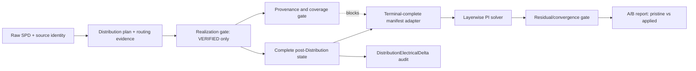

# PI Distribution–Solver 정합성 PRD

**문서 버전:** 0.2
**목표 제품 버전:** SPD Decap PI Evaluator v0.24 (계획 기준)
**상태:** 감독 검토 반영 — 제품 승인 후 구현 가능
**결정 책임:** PI 계산/제품 담당자

## 1. 경영진 결정

동일한 pristine 보드에 대한 수 시간~수일 단위 Gate 2 correlation을 개선의 주 경로로 계속하지 않는다. 현재 증거는 입력 충실도, solver 수렴성, 단일 제한 지점의 무회귀를 보여주지만, Distribution 적용 시나리오의 광대역 정확도는 입증하지 못했다.

다음 릴리스에서는 Distribution과 PI solver 사이에 명시적인 scenario/termination 계약을 추가하고, 대표적인 Distribution 적용 사례 하나를 pristine 대비 A/B로 검증한다. 기존 pristine correlation guard는 회귀 기준으로 유지하며, Distribution으로 변경된 candidate를 pristine으로 가장하도록 완화하지 않는다.

진행 중이던 Gate 2 자동 재시작과 장시간 correlation은 중단한다. 현재 artifact는 역사적 증거로 보존하되, 이 PRD 구현 이후의 코드 통과 증거로 재해석하지 않는다.

## 2. 문제와 현재 증거

### 문제

Distribution은 decap의 `current_net`, `current_rail_id`, enabled/pad/model 상태와 PWR/Via termination topology를 바꿀 수 있다. 반면 현재 PowerSI benchmark는 의도적으로 pristine candidate만 허용한다. 따라서:

- 현 benchmark만으로는 Distribution 적용 결과가 수치적으로 타당한지 판단할 수 없다.
- solver에는 scenario/termination adapter를 통해 간접적으로 상태가 전달되지만, 어떤 변화가 의도된 것인지 하나의 감사 가능한 계약으로 묶여 있지 않다.
- 같은 pristine full correlation을 다시 수행해도 제품 동작에 대한 새 증거가 거의 늘지 않는다.

### 확보된 증거

- Raw-v2 import가 원본 Node, Trace, Via, artwork, contact, identity를 source-bound 형태로 보존한다.
- 260804 VCPU/0, 100 kHz pre/post 결과가 동일하다. 유효 admittance, 814,005 physical surfaces, 759,983 reduced nodes, 1,691,081 finite Via links가 같고, 최대 상대 잔차는 약 `1.73e-17`, Kron 잔차는 `0`이다.
- pristine candidate guard는 `current_net`, `current_rail_id`, `enabled`, `pad_state`, `model_id` 등 Distribution이 바꿀 수 있는 필드를 변경한 candidate에 대해 실패한다.
- strict terminal-complete reuse는 control-plane 보호 장치이며 물리 방정식이나 수치 kernel을 변경하지 않는다. 자세한 내용은 [Gate 2 reuse 보고서](validation/gate2_terminal_complete_reuse.md)를 참조한다.
- 장시간 260804/260729 PowerSI correlation은 완료 전에 중단되었으므로 광대역 정확도는 아직 미검증이다.

## 3. Distribution과 solver의 결합 경계

### 직접 결합(명시해야 함)

1. Distribution이 변경된 decap/rail/net 상태를 가진 scenario를 승격한다.
2. adapter가 해당 상태를 결정론적인 termination manifest와 source/rail mapping으로 변환한다.
3. layerwise solver가 manifest로부터 termination을 구성한다. 따라서 topology 변화에 따른 임피던스 변화는 의도된 결과다.

solver는 이름, 최근접 geometry, 오래된 cache로 Distribution 의도를 추론해서는 안 된다.

### 간접 결합(증명해야 함)

PWR-plane projection과 Via eligibility는 Distribution 후보의 합법성을 결정하지만 layerwise matrix assembly를 직접 수정하지는 않는다. 그러나 합법적인 이동이 vertical return path, decap 위치, termination loading을 바꿀 수 있으므로 solver 입력은 scenario를 통해 간접적으로 달라진다.

현재 filled-Cu/microvia projection은 계획을 위한 가정이며 제조 sign-off가 아니다. Distribution 상태는 `PLANNED`, `REALIZED`, `VERIFIED`, `BLOCKED`로 표준화한다. `PLANNED`는 명시적인 비승격 planning estimator에만 사용할 수 있고, production PI solve에는 source-backed destination copper, Via/contact/artwork coverage와 실제 적용 상태를 갖춘 `VERIFIED` 상태가 필요하다. `UNKNOWN`과 `PARTIAL`은 `BLOCKED`로 취급한다.

`topology delta`는 감사와 설명을 위한 자료이며 solver 입력이 아니다. Solver는 항상 완전한 post-Distribution state와 terminal-complete manifest를 입력으로 받는다.

## 4. 제품 목표

- Distribution 적용 scenario를 source-bound PI 입력으로 취급한다.
- 의도된 topology 변화를 짧고 검토 가능한 delta로 기록한다.
- pristine raw-SPD correlation을 회귀 기준으로 보존한다.
- stale/mixed/incomplete/provenance mismatch termination을 solve 전에 차단한다.
- 반복적인 heavy validation 대신 하나의 고가치 대표 A/B로 판단한다.
- 물리 coverage, provenance, 수렴, 자원 불확실성은 계속 fail-closed로 처리한다.

## 5. 비목표

- 모든 rail/보드의 절대 PowerSI 정확도를 주장하지 않는다.
- layerwise 수치 kernel, modal equation, Kron reduction을 이번 작업에서 교체하지 않는다.
- 제조용 microvia recipe를 생성하지 않으며 projection을 생산 sign-off로 취급하지 않는다.
- Width, Via/contact/artwork, identity, convergence, resource gate를 완화하지 않는다.
- 기존 correlation artifact를 재생성하거나 덮어쓰지 않는다.

## 6. 제안 아키텍처와 최소 작업 흐름

1. **Scenario 계약:** immutable source identity, Distribution plan/policy identity, 변경 전/후 decap 필드와 realization 상태를 정의한다.
2. **Termination adapter:** verified applied state 전체에서 새 manifest를 만들고 stale/partial manifest를 거부한다.
3. **Solver 경계:** 기존 `pristine` 경로를 변경하지 않고 별도의 `distribution_applied` validator/orchestrator를 둔다.
4. **증거 보고서:** A/B metric, 변경 rail/decap 수, topology count, provenance hash, residual, resource envelope를 저장한다.
5. **집중 테스트:** 대표 applied-Distribution A/B 하나를 추가하고 기존 raw-source/VCPU 검증을 유지한다.

## 7. 기능 요구사항

- **FR-1 — Separated evaluation paths:** `pristine`은 기존 mutable-field 완전 동일성 guard를 그대로 사용한다. `distribution_applied`는 그 guard를 완화하거나 우회하지 않고, 별도의 immutable-source + canonical expected-delta + complete post-apply-state validator/orchestrator를 사용한다. 모든 결과에 mode와 validator identity를 기록하며 불일치는 solve 전에 차단한다.
- **FR-2 — Source binding:** raw SPD SHA-256, normalized source identity, plan/policy identity, candidate identity를 applied 결과에 묶는다.
- **FR-3 — Canonical electrical delta:** `DistributionElectricalDelta`는 plan/policy/source identity, 변경된 decap의 before/after 상태, rail/net/landing/contact/layer/Via-template 변화, topology ownership ledger, realization/assumption 상태와 canonical hash를 포함한다. applied mode에서 delta가 비어 있으면 canonical no-op임을 증명해야 한다.
- **FR-4 — Complete fresh manifest:** applied mode는 전체 post-Distribution termination inventory에서 manifest를 재구성한다. Manifest payload의 `scenario_state_sha256`, `source_sha256`, `termination_inventory_sha256`, plan/policy identity를 현재 요청과 각각 대조하고, 하나라도 불일치하면 solve 전에 차단한다. Solver는 topology delta가 아닌 완전한 manifest만 소비한다.
- **FR-5 — Comparable A/B:** static substrate/geometry/compiler, solver profile, frequency grid와 resource envelope를 동일하게 유지한다. Termination-bound source-model identity는 complete manifest 변화에 따라 달라져야 하며, 그 차이는 complete manifest hash로만 설명되어야 한다.
- **FR-6 — No hidden fallback:** strict mode에서 terminal-complete reuse 불일치가 발생하면 독립 mode-12 fallback 전에 실패한다.
- **FR-7 — Realization gate:** vertical immutable-XY projection과 filled-Cu/microvia 추정은 planning-only다. Production solver manifest에는 source-backed destination copper, Via/contact/artwork coverage와 실제 적용 상태가 필요하다. `PLANNED`, `UNKNOWN`, `PARTIAL`, `BLOCKED` 상태는 production PI solve와 promotion을 차단한다.
- **FR-8 — Global rebuild:** termination 하나가 변경되어도 complete manifest와 해당 immutable board-group network를 다시 구성한다. 영향 rail 목록은 감사 정보일 뿐 수치적 국소성을 가정하지 않으며 선택된 모든 rail의 결과를 유지·검증한다.

## 8. Fail-closed 요구사항

다음 중 하나라도 발생하면 승격/평가를 중단한다.

- Trace Width가 누락/무효이거나 `+` continuation이 source-bound가 아님
- Via, contact, plane, artwork coverage가 불완전함
- MLO/vertical-path evidence가 unknown이거나 policy/provenance가 불일치함
- 변경된 scenario를 `pristine`으로 요청함
- applied mode에 완전한 state/topology delta가 없음
- realization 상태가 `VERIFIED`가 아니거나 projection을 실제 연결로 승격함
- manifest/source/candidate/solver identity가 기록값과 다름
- residual, convergence, termination-Kron gate 실패
- memory/CPU/time 한도 초과
- 다른 artifact를 덮어쓸 가능성

## 9. 수용 기준과 지표

1. 코드 변경 후 새 code identity에서 bounded pristine replay와 no-op applied case가 결정론적으로 동등하다.
2. applied scenario가 pristine guard를 우회할 수 없고 mode, validator identity, realization 상태와 delta가 보고서에 표시된다.
3. 대표 Distribution plan이 `VERIFIED` source-bound applied state와 terminal-complete manifest를 만든다.
4. pristine/applied A/B가 사전 고정한 `100 kHz`, `10 MHz`, `100 MHz`에서 모두 수렴한다.
5. topology/model/matrix 입력 차이는 선언된 `DistributionElectricalDelta`와 complete manifest로 모두 설명된다.
6. 실제 applied case는 complete board-group network를 다시 구성하고 선택된 모든 rail 결과를 보존한다. 영향 rail은 수치적 국소성을 뜻하지 않으며, 미변경 control rail 하나는 사전 정의한 허용 오차로 감시한다.
7. 보고서가 재현 가능한 hash와 resource 정보를 가지며 artifact overwrite가 없다.
8. provenance/coverage/resource 실패는 승격된 PI 결과를 만들지 않는다.
9. PowerSI 정확도 개선을 주장하려면 사전에 동결된 오차 기준과 별도의 full correlation을 통과한다.

사전 numeric “개선율” 목표는 정하지 않는다. A/B의 목적은 물리적으로 설명 가능한 변화와 안정적인 계산을 증명하는 것이며, 그 후에야 정확도 목표를 재검토한다.

## 10. 테스트 전략

검증량은 의도적으로 줄인다.

- **역사적 증거 보존:** raw-v2 import/source identity, pristine mutable-field guard, 260804 100 kHz deterministic replay를 변경 전 기준으로 보존한다. `src` 또는 production wiring이 바뀌면 현재 코드의 통과 증거로 재사용하지 않는다.
- **신규 bounded no-op replay:** 새 code identity에서 pristine과 canonical no-op applied 결과의 결정론적 동등성을 확인한다.
- **신규 대표 A/B:** `current_rail_id` 또는 termination placement가 실제로 바뀌고 Via/contact/artwork evidence가 완전한 affected rail 하나와 unchanged control rail 하나를 선택한다.
- 사전 고정한 `100 kHz`, `10 MHz`, `100 MHz`에서 pristine/applied를 비교한다. 이 gate가 통과할 때만 확대 여부를 별도로 결정한다.
- effective admittance/impedance, residual, topology count, termination hash, state delta를 비교한다.
- stale manifest, incomplete routing evidence, invalid Width, wrong source identity에 대한 negative case를 추가한다.

이 PRD의 선행 조건으로 두 보드 전체 32-evaluation correlation을 다시 시작하지 않는다.

## 11. Rollout 및 migration

1. 명시적 mode/contract를 추가하되 기존 pristine 기본 동작은 유지한다.
2. applied adapter를 feature flag 또는 versioned solver profile 뒤에 둔다.
3. A/B 증거는 새 collision-free 출력 디렉터리에 만들고 과거 artifact를 보존한다.
4. 대표 결과를 검토하고 topology/numeric delta를 release note에 기록한다.
5. 승인 후에만 제품 workflow에서 applied Distribution 평가를 활성화한다.

## 12. 위험과 대응

| 위험 | 대응 |
|---|---|
| projection 정책이 실제 제조 연결과 다름 | source routing evidence를 요구하고 sign-off 전에는 planning-level로 표시 |
| Distribution이 보고보다 많은 topology를 바꿈 | 전체 termination manifest와 scenario state를 hash/diff |
| A/B 차이가 수치 잡음임 | solver 입력을 동일하게 고정하고 residual/replay를 확인 |
| stale cache가 applied candidate를 통과시킴 | complete scenario/source hash에 manifest를 결속하고 실패 처리 |
| 대표 rail이 대표성을 갖지 못함 | 실제 move와 완전한 기준 자료가 있는 rail을 선택 |
| 하나의 A/B를 보편 정확도로 과대해석 | architecture gate로만 사용하고 보편 정확도 주장은 금지 |

## 13. 구현 순서

1. pristine 동작과 현재 증거 schema를 동결한다.
2. realization 상태와 `DistributionElectricalDelta` 자료구조 및 canonical hash를 정의한다.
3. 별도 applied validator/orchestrator와 complete termination-manifest 생성·검증을 구현한다.
4. 기존 pristine benchmark는 불변으로 유지하고 applied 전용 실행 경계에 fail-closed 오류를 추가한다.
5. 제한 주파수 대표 A/B 테스트와 보고서를 추가한다.
6. 결과를 검토한 뒤에만 광범위 correlation 또는 수치 모델 변경을 결정한다.

## 14. 완료 정의

- 본 PRD가 승인되고 release planning 기록에 연결된다.
- applied/pristine mode가 명시적이며 서로 혼동될 수 없다.
- bounded no-op replay와 대표 A/B가 identity, coverage, convergence, resource gate를 모두 통과한다.
- 기존 pristine VCPU/source-state 증거는 역사적으로 보존되고 새 code identity에서 bounded replay가 생성된다.
- A/B 보고서에 선언된 topology/state 변화와 reproducible hash가 있다.
- 과거 artifact를 덮어쓰지 않고 unresolved physical ambiguity를 승격하지 않는다.
- 대표 A/B architecture gate 통과와 PowerSI 정확도 입증을 별도 항목으로 판정한다.
- 별도 full correlation 전에는 광대역 PowerSI 정확도를 주장하지 않는다는 제한이 release 문서에 명시된다.

## 15. 관련 문서

- [Decap Distribution MLO Transition Gate](DECAP_DISTRIBUTION_MLO_TRANSITION_GATE.md)
- [Evaluation Accuracy](EVALUATION_ACCURACY.md)
- [Evaluation Solver Implementation Plan](EVALUATION_SOLVER_IMPLEMENTATION_PLAN_2026-08-04.md)
- [Gate 2 Terminal-Complete Reuse](validation/gate2_terminal_complete_reuse.md)
