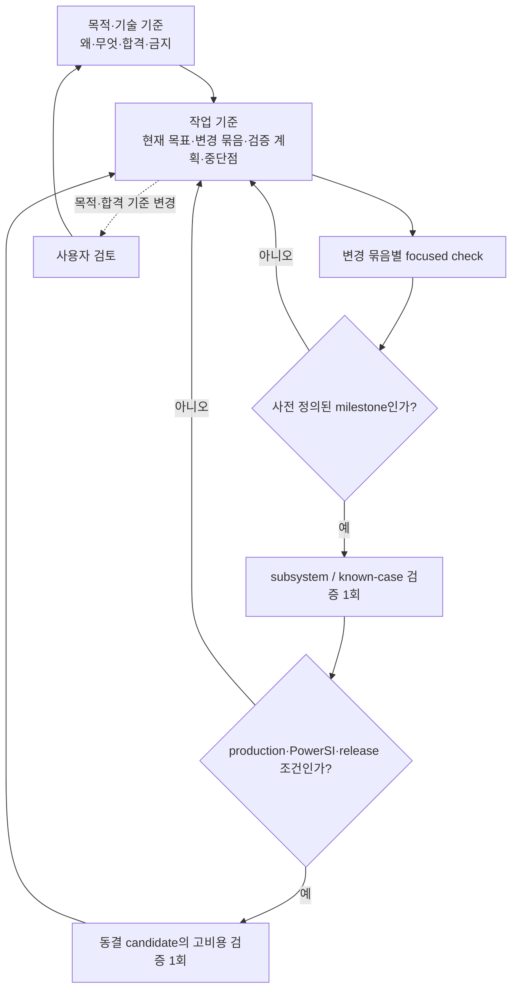

# SPD Decap PI Evaluator 목적·기술 기준

- 적용 제품: **SPD Decap PI Evaluator v0.23.1**
- 문서 버전: **1.154**
- W5 approved/machine-frozen source-before: `main` commit `027ac7a09a3eded15f45c41860945f9d4c7f488d`
- 상태: **G0 기준 문서** — W5 DONE; W6-BASE 260729 numerical FAIL; W7-PHYS BLOCKED.
- 현재 평가: 17DG는 standalone mathematical foundation이고, 17DR–17DS review에서 source/provenance/ownership feasibility 기준 **surface-patch plane current-spreading R/L**만 credible한 다음 물리 방향으로 남았지만 global port/owner seam 부재로 **NOT READY/STOP**이다. 17DT는 raw-spatial v3 내부 재현은 PASS했으나 W6 비교는 `STOP_IDENTITY_DRIFT`다. 17DU는 실행 후 compiled rail-port NET 계약 불일치로 `STOP_AUDIT_CONTRACT_MISMATCH` 종료, W7은 BLOCKED 상태다.
- Sole ACTIVE item (current): **17DV** metadata-only bridge gate under standing preapproval. 17DU는 immutable DONE/STOP 상태이며 production physics/`Zii`는 unchanged다.
- 후속 권한: 17DV read-only metadata-only gate만 승인한다. 17DU는 retry하지 않으며 raw-spatial loader/import, raw-v3 decode, SPD/W6/Touchstone/correlation/solver/GUI/physics/profile 변경, production rerun, build/release는 미승인이다.
- 재개 조건: geometry/material provenance, falsifiable physical/analytic limiting-case invariant, deterministic stamp, disjoint owner ledger를 갖춘 source-certified rail-complete physical candidate.
- 최종 개정: 2026-08-28 (Asia/Seoul)

## 1. 문서 역할과 권위

이 문서는 프로그램의 **왜**, **무엇**, **합격의 의미**, **넘지 말아야 할
경계**를 고정한다. 작업 목록, 구현 순서, 진행 상황, 검증 실행 기록은 이
문서에 누적하지 않는다. 그것들은 추후 별도로 만들 **작업 기준 문서**에서
관리한다.

권위는 두 축으로 구분한다.

1. **목적과 우선순위:** 이 문서가 최우선이다. 작업 기준 문서와 개별 계획은
   이 문서를 변경하거나 우회할 수 없다.
2. **현재 구현과 결과 사실:** exact commit의 source, hash-bound input/output
   artifact, 실행 log가 요약 문서보다 우선한다. 코드가 이 문서와 다르면
   코드가 옳다는 뜻이 아니라 해결할 불일치가 발견된 것이다.

과거 release note, 연구 문서, PRD, session log는 증거와 결정 이력이다.
현재 목적이나 현재 통과 상태를 자동으로 정의하지 않는다. 목적, 수치 합격선,
제품 sign-off 범위를 바꾸려면 사용자 검토와 이 문서의 명시적 개정이 필요하다.

## 2. 최우선 목적

> **완성된 SPD 도면에서 source-derived 물리·연결 근거만 사용하여 single-rail
> driving-point impedance `Zii`를 계산하고, 공급된 PowerSI 결과와 비슷한
> 정확도를 새로운 설계에도 재현할 수 있는 알고리즘과 제품 workflow를
> 확립한다.**

PowerSI Touchstone은 외부 비교 자료다. PowerSI 응답을 이용해 R/L/C, 재료,
geometry correction 또는 설계별 보정값을 fitting하지 않는다. 목표는 특정
파일 네 개를 맞추는 것이 아니라, source evidence에서 일반화되는 계산법을
확립하는 것이다.

이 프로그램은 pre-design 판단 도구다. PowerSI, SIwave, full-wave field solver,
DRC, 제조 또는 sign-off 도구를 대체한다고 주장하지 않는다.

## 3. 목적 우선순위

앞선 항목을 뒤의 항목과 교환하지 않는다.

1. **외부 정확성 및 일반화:** rail별 magnitude, phase, resonance, complex error가
   승인된 PowerSI 비교 기준을 만족해야 한다.
2. **물리·증거·수치 건전성:** source provenance, topology ownership, passivity,
   reciprocity, conservation, conditioning과 convergence가 설명 가능해야 한다.
3. **실사용 가능성:** 목표 장비에서 시간, memory, 취소, 저장 및 복구가
   실용적이어야 한다.
4. **보조 workflow:** De-cap Distribution, UI, workbook, AI 보조 분석은 위 세
   목적을 지원한다. 그 자체가 정확성 목표를 대체하지 않는다.
5. **배포:** installer와 release는 앞선 gate를 통과한 범위만 전달한다.

성능 최적화는 틀린 물리 모델을 빠르게 만드는 근거가 될 수 없다. Distribution
호환성이나 UI 편의 작업을 최우선 정확성 과제로 승격하려면 사용자 승인이
필요하다.

## 4. 제품 입력·출력 경계

| 구분 | 현행 역할 | 경계 |
|---|---|---|
| Raw SPD | geometry, stack-up, material table, net, node, trace, via, plane artwork, Device/Decap source | 원본을 수정하거나 덮어쓰지 않음 |
| `.spdpi` | source identity, scenario state, normalized attachment와 Original baseline 보존 | raw SPD 자체를 내장하지 않으며 source/hash 불일치 시 재사용 금지 |
| Decap model | passive two-terminal branch와 assignment | PowerSI 응답으로 parameter fitting 금지 |
| Distribution workbook | format 5 Target/Tolerance 및 policy 교환 | format 1–4는 현행 exact-layer 계약으로 직접 import하지 않고 source SPD에서 재-export 필요 |
| PowerSI Touchstone | 외부 complex impedance 비교와 promotion 판단 | production network 구성·parameter fitting 입력이 아님 |
| Evaluation 결과 | Original/Tuned `Zii`, target 비교, plot/table/CSV | 통과한 evidence scope 밖의 정확성 또는 sign-off 주장 금지 |
| Distribution 결과 | immutable landing에서의 assignment planning, audit, workbook/CSV | SPD via/plane artwork를 실제로 고치지 않으며 제조·DRC·SI sign-off가 아님 |

## 5. 현행 기술 기준

### 5.1 Evaluation

- Desktop 기본 profile은 `layerwise_admittance_v1`, 표시명은
  **Layer-surface terminal-complete network**다.
- 현행 solver identity는 `modal-mvp-0.8.5`, compiler algorithm은
  `layer-surface-adjacent-y-island-finite-via-termination-kron-v8`이다.
- retained physical `(layer, NET)` artwork surface를 독립 node로 두고, 인접
  dielectric gap의 ordered artwork에서 Maxwell admittance block을 만든다.
- source-observed same-NET Trace/Via connectivity와 ownership-resolved finite
  Via R/L만 결합한다. Device terminal과 Decap loop branch의 소유권을 substrate와
  중복하지 않는다.
- 모든 내부 interface는 하나의 sparse global-Y system에서 Schur/Kron
  reduction하며 외부 Device port의 open-port `Zii`를 읽는다.
- **Legacy modal**은 명시적 rollback/regression profile이다. source evidence가
  부족할 때 Layerwise가 몰래 Legacy로 fallback해서는 안 된다.
- PowerSI는 network compile이나 parameter 생성 중 읽히지 않는다.

세부 공식과 modeling 설명은 [Evaluation Accuracy and Modeling
Boundary](EVALUATION_ACCURACY.md)에 둔다. 현행 Layerwise는 source-derived
quasi-static circuit model이며 다음을 충분히 표현하지 않는다.

- lateral Trace impedance와 plane-sheet nonuniform R/L
- Via return/mutual coupling, pad/anti-pad field와 copper spreading
- inter-rail/site transfer coupling, DC IR drop, DGND tie impedance
- general multiport/full-wave field behavior

### 5.2 De-cap Distribution

- 물리적 Decap/PWR Via landing XY와 source plane artwork는 불변이다.
- candidate는 retained target PWR artwork와 source evidence로 eligibility를
  판정한다. non-TOP 이동은 현행 v0.23 transition evidence/gate를 통과해야 한다.
- 결과는 assignment planning이다. 필요한 Via stack retarget/rebuild를 실제
  source SPD에 적용했다는 뜻이 아니다.
- optional signal-routing protection은 기본 OFF이고 현재
  `SIGNAL_NET_ONLY` width-resolved Trace scope다. routed PWR/GND, signal Via,
  pin, pad, fanout 전체를 인증하지 않으므로 DRC-safe 결과로 승격하지 않는다.
- 자세한 수량, topology, preview/apply 규칙은
  [De-cap Distribution 변동 규칙](DECAP_DISTRIBUTION_RULES.md)에 둔다.

### 5.3 Persistence, UI와 독립성

- source identity, scenario state, solver/profile/compiler identity가 다르면
  cache와 artifact를 공유하지 않는다.
- `.spdpi`를 다시 열 때는 scenario가 가리키는 외부 raw SPD payload의 size와
  SHA-256이 일치해야 한다. 따라서 `.spdpi`를 raw source 없이 완전히
  self-contained인 project로 설명하지 않는다.
- immutable Original **configuration**과 계산된 Original **result curve**를
  구분한다. 현행 기본 Layerwise Original result는 run마다 다시 계산되므로,
  저장된 baseline curve를 자동 재사용한다고 주장하지 않는다.
- Original/Tuned 양쪽은 같은 builder-time connectivity/modelability 경계로
  검사하며, 차단된 rail은 결과에 `NOT evaluated`로 남겨야 한다.
- 장시간 parse, compile, solve, save/load는 GUI thread 밖에서 수행하고 progress,
  cancellation, stale-result rejection을 보존해야 한다.
- 프로그램명과 버전은 title bar와 installer metadata에서 쉽게 식별 가능해야
  한다.
- runtime에 다른 PI Calculator 또는 `probe-card-mlo-pdn`을 설치·import·갱신하지
  않는다. 세부 경계는 [Embedded evaluation core](CORE_EXTRACTION.md)에 둔다.

## 6. 증거와 상태 표기

`passed` 한 단어만 사용하지 않는다. 모든 중요한 주장은 최소한 다음 세 요소를
가진다.

| 요소 | 허용 예 | 의미 |
|---|---|---|
| 적용 대상 | `current`, `historical`, `planned` + commit/profile/input hash | 어느 구현과 자료에 적용되는가 |
| 증거 상태 | `verified`, `provisional`, `unknown` | artifact와 재현 범위가 충분한가 |
| 실행 결과 | `passed`, `failed`, `blocked`, `not_run` | 해당 범위의 판정 또는 미실행 상태 |

`verified + passed`도 명시된 coupon, parser, import 또는 gate 범위만 통과했다는
뜻이다. product accuracy, performance, release까지 자동 승격하지 않는다.

### 6.1 G0 작성 시점의 상태

| 주장 | 적용 대상 | 증거 상태 | 실행 결과 | 해석 |
|---|---|---|---|---|
| 제품명·버전 identity | current v0.23.0 / `0f24363c` | verified | passed | source, title, package, installer metadata 범위 |
| production-size import·save·92-rail solver entry | current v0.23.0 attestation | verified | passed | import/save/entry 범위에 한함 |
| 같은 attestation의 frequency solve·Touchstone comparison | current v0.23.0 | verified | not_run | `frequency_solves_executed=0`, `touchstone_read=false` |
| 현행 default solver의 PowerSI 정확성 | current v0.23.0 / 260729 retrospective | provisional | failed | completed manifest·sidecar와 offline verifier exit 2가 무결성을 확인했으며, bare/loaded macro가 각 limit을 초과했다; unseen/generalization은 아직 unknown/not_run |
| 260804 terminal-complete loaded correlation | historical v0.22.0 | provisional | failed | 문서상 critical-band `16.743 dB`, `44.28°`; raw report가 Git에 없어 current 결과로 재사용 불가 |
| 목표 장비의 시간·memory promotion | current | unknown | not_run | workstation 또는 import-only 수치로 승격 금지 |
| product-core CI 회귀 차단 | current bounded selection | verified | passed | V3 `361 passed, 1 skipped in 22.88s`, local v0.13 bundle skip |

현재 GUI의 `layerwise validation pending` 표시는 이 상태와 일치한다. 과거
validation 문서의 placeholder, report-level pass, 작은 backward residual,
import/save 성공은 PowerSI accuracy promotion이 아니다.

W5 이전에는 제품 수준 PowerSI 수치 합격선이 **미확정**이었다. W5에서
`1.00/1.25 dB` 등을 포함한 수치와 reference partition을 승인해
machine-frozen policy로 고정했다. 260729 retrospective는 completed numerical
FAIL이며, unseen/generalization과 260804/P5는 여전히 `unknown / not_run`이다.
local mesh/oracle convergence 수치를 제품 PowerSI gate로 전용해서는 안 된다.

### 6.2 W5-GATE approved/machine-frozen policy

W5 threshold, partition, run manifest는 사용자 승인으로 **machine-frozen**된
정책 계약이다. 수치와 분류는 여전히 역사적 측정 결과나 제품 sign-off가 아니다.
현재 등록된
자료에는 최종 generalization을 판정할 P5 unseen design이 없으므로, 최종 정확성
및 일반화 승격은 BLOCKED다.

- 승인 threshold: 100 kHz/1 MHz low-frequency offset, 100 kHz–100 MHz
  critical-band magnitude, rail별 max magnitude, phase, low-impedance complex
  error, dominant-peak 위치/진폭을 함께 판정한다.
- VQPS 10개 bare rail과 VTRIP/VINT/VCPU 6개 loaded rail은 별도 strata로
  유지하며 pooled 평균이나 한 strata가 다른 strata의 실패를 숨기는 판정을
  하지 않는다.
- 260729 development와 260804 retrospective design holdout은 모두
  retrospective evidence다. W5 freeze 당시 양쪽 등록 `D:\` raw 경로와 S92P
  경로는 존재/size 일치만 확인되었고 SHA는 재계산하지 않았다. 등록 baseline
  candidate는 없었고, 이전 blocked root에서 생성된 candidate는 W6-BASE controller
  output·scoring snapshot·retry에 재사용하지 않는다. 당시 승인된 W6 contract는
  brand-new root의 fresh import에서 시작해야 한다. B의 correlation은 historical
  evidence이고, C는 old candidate/import report를 정확히 한 번 read-only로
  열었고, correlation report는 사용하지 않았으며, fresh C root에만 썼다.
- Site0/site1/loaded는 blind sample이 아니라 노출된 strata다. P1 transfer/scale
  holdout은 160-port runner와 memory-safe preprocessing 부재로, P2는 현재
  weighting/reference-plane/de-embedding 미확정으로, P3/P4는 등록 경로의
  reference 부재와 multifactor/solver-state confound로 BLOCKED다. P5 unseen
  design은 없으며 최종 generalization에 필수다.

따라서 W6가 만들 수 있는 것은 260729/260804의 **비-blind
retrospective baseline**뿐이다. 이것을 unseen generalization 또는 제품
PowerSI 합격으로 재사용할 수 없다.

현재 trust identity는 benchmark base normalized SHA
`d43b868629464f408ea19362daa78fc369d2fd446cf3d458cfdc044ccbf57f08`, adapter
`6b7e399b4a843028ce754ac9154b8ce1a4575b1581c8d6007cebf26f94e6d440`, v6
validator `3f26b2aa7880cd9aff89cd5407643c934367764b590db98962cbc30bfa1b04a0`,
accuracy validator `8487be60cad523f9ed2ea1c61c57b580d9c2bb0fee598eea0bb938145b82151e`,
policy `6ea6e0b3327eaf828257334d7bb0211582fcc85ed632468223c7b566d0d3fd4d`,
controller `b7d5b87d97e1441ccaa950a1fbe50a49f599483e68acee99596eda7dd612262d`이다.
기존 v5 validator, known-case policy와 historical fixtures는 byte-identical로
보존되며, W6 controller는 `blocked_partial`에서 부분 결과를 점수화하지 않는다.

첫 W6 260729 실행은 source HEAD
`46d17dc73381d4292ea342d7a10e85d4f2e338f6`와 immutable root
`D:\SPD-Decap-PI-Evaluator-W6\46d17dc73381d4292ea342d7a10e85d4f2e338f6\260729`에
결속된다. tombstone `blocked_partial.json` SHA는
`b81525bd47744dc1ea5c75bb26f20ea354246ad88b8ce5bc9aef131cb50c09f7`이며 phase1
passed, phase2 exit2, v6 not_started, scoring refused였다. 이 결과는 old policy
`c362acb01ef28cefbbd1d32753f86bccafbdd53355b42eda83c03a6ea810698b`에 결속되므로
새 policy로 소급 검증하지 않고 root도 재사용하지 않는다. W6-BLOCK-A는 layerwise
diagnostic/correlation의 누락 terminal-complete argument를 adapter에서만 보강한
DONE 묶음이며 base/solver/pivot gate/physics는 변경하지 않았다.

## 7. Promotion gate

다음 gate는 순서대로 통과한다. 앞 단계 실패나 unknown 상태에서 뒤의 고비용
단계를 실행하거나 release claim으로 건너뛰지 않는다.

1. **Identity/evidence:** source, reference, port manifest, code, compiler,
   profile, material assumption, frequency policy hash가 완전하다.
2. **Physical/numerical integrity:** source ownership, limiting case, passivity,
   reciprocity, conservation, conditioning, residual과 frequency coverage를
   focused case로 판정한다.
3. **Subsystem/known-case:** 변경된 subsystem의 deterministic regression과
   catastrophe floor를 통과한다. 이는 외부 정확성 승격이 아니다.
4. **Frozen candidate:** 관련 변경 묶음과 설정을 동결한 뒤 end-to-end
   frequency solve와 artifact 생성을 완료한다.
5. **External accuracy/generalization:** development, reserved holdout, 최종
   unseen design을 분리해 rail별 magnitude RMS/max, phase RMS/max, resonance
   위치·진폭, low-impedance complex error를 판정한다. 평균이 한 rail의 실패를
   숨길 수 없다.
6. **Performance/product/release:** 목표 장비의 wall time, process-tree memory,
   cancellation, save/export, GUI response와 installer workflow를 판정한다.

정확성 후보가 동결되기 전에 acceleration, adaptive sampling 또는 MOR 결과를
정확성 개선으로 해석하지 않는다. source-derived 물리 변경은 한 번에 한 owning
block만 바꾸고, 어떤 error component를 줄이려는지 사전에 명시한다.

## 8. 검증 비용을 통제하는 불변 원칙

구체 명령, 예상 비용, 최대 재시도 횟수와 중단 조건은
[작업 기준 문서](WORK_EXECUTION_BASELINE.md)에 적는다. 이 문서에서는 다음
원칙만 고정한다.

- 작은 수정마다 전체 테스트, production SPD, PowerSI correlation, installer를
  반복하지 않는다.
- 관련 수정을 하나의 원인·결과 묶음으로 닫고 focused check를 수행한 뒤,
  사전 정의된 milestone에서 subsystem 검증을 한 번 실행한다.
- production/PowerSI 전체 검증은 solver 의미, profile, threshold와 변경 묶음이
  동결된 candidate마다 원칙적으로 한 번 실행한다.
- 낮은 단계가 실패하면 원인을 작은 재현으로 축소한다. 전체 실행을 디버깅
  수단으로 사용하거나 원인 변경 없이 같은 고비용 실행을 반복하지 않는다.
- commit, input hash, profile/compiler, 설정과 판정 환경이 모두 같을 때만 기존
  증거를 재사용한다. 하나가 달라지면 상태를 `unknown`으로 되돌리되, 즉시 전체
  검증을 실행하지 않고 다음 필요한 milestone에 배치한다.
- `not_run`, `reused`, `not_required`를 구분해서 기록한다.
- 문서만 바뀐 단계에서는 link, Markdown structure와 diff만 검사한다. 문서 변경을
  이유로 solver나 installer 검증을 실행하지 않는다.

## 9. Fail-closed와 비주장

- source, geometry, topology, terminal, workbook, cache 또는 result identity가
  불일치하면 재사용하지 않는다.
- 누락·모호한 source evidence를 좌표 clamp, 임의 연결, fitted value 또는
  silent fallback으로 숨기지 않는다. 명시적으로 versioned fallback을 지원하는
  경우에는 그 범위와 confidence를 결과에 표시하고 exact-source 주장에 사용하지
  않는다.
- Original/Tuned 중 한쪽이 build되지 않으면 완전 비교로 표시하지 않는다.
- 실행하지 않은 solve, rail 또는 reference 비교를 0, pass 또는 evaluated로
  기록하지 않는다.
- 특정 rail, 한 평균값, 한 보드 또는 한 PowerSI 파일의 개선을 일반 정확성으로
  확대하지 않는다.
- Distribution planning 결과를 as-built connectivity, DRC, 제조 또는 PI
  sign-off로 부르지 않는다.
- AI는 solver 결과나 design state를 직접 변경하지 않는다.

## 10. 두 기준 문서를 이용한 작업 방식

새 작업과 context가 재개될 때 기본 입력은 다음 두 문서로 제한한다.

1. 이 **목적·기술 기준 문서**
2. [**작업 기준 문서**](WORK_EXECUTION_BASELINE.md)

필요한 subsystem 문서와 source는 현재 작업 범위에 따라 선택해서 읽는다. 과거
연구 문서 전체를 세션 시작 조건으로 삼지 않는다.

작업 기준 문서는 최소한 현재 목표, 제외 범위, 변경 묶음, 해당 파일/함수,
검증 단계와 실행 조건, 예상 비용, 최대 재시도, 중단점, evidence identity,
결과와 다음 결정을 기록해야 한다. 작업 기준 문서는 목적이나 합격선을 임의로
바꾸지 못한다.

목적에서 벗어난 문제가 발견되면 별도 후보로 기록할 수는 있지만 현재 작업을
중단하고 확장하지 않는다. 목적 또는 수치 gate 변경이 필요하면 사용자 검토
전까지 작업을 멈춘다.

## 11. 관련 문서와 해석 범위

- [Evaluation Accuracy and Modeling Boundary](EVALUATION_ACCURACY.md): 현행
  Evaluation 수식·modeling 상세. 일부 과거 validation 서술은 역사적 범위다.
- [Evaluation Solver Deep-Research Decision Record](EVALUATION_SOLVER_DEEP_RESEARCH_2026-08-04.md):
  accuracy-first 연구 방향과 후보 기술의 역사적 결정 기록.
- [Evaluation Algorithm Research State](evaluation-research/RESEARCH_STATE.md):
  상세 연구·실행 이력. current product promotion 근거로 자동 사용하지 않는다.
- [Bounded Baseline Protocol](evaluation-research/BASELINE_PROTOCOL.md): 상태 분리와
  단계형 baseline의 역사적 프로토콜.
- [Layer-Surface Validation Record](EVALUATION_LAYER_SURFACE_VALIDATION_2026-08-06.md):
  named input과 과거 실행 기록. `TO_FILL` 구간이 있어 완료된 current release
  evidence로 인용하지 않는다.
- [De-cap Distribution 변동 규칙](DECAP_DISTRIBUTION_RULES.md): 현행
  Distribution 상세 계약.
- [Embedded evaluation core](CORE_EXTRACTION.md): standalone/runtime 독립성.

## 12. 현재 결과 평가와 재개 조건

| 평가 축 | 현재 결론 |
|---|---|
| 제품 기반 | W0–W5에서 목적·작업 통제, product-core truth, SPD/I/O 안전성, CI, solver fail-closed guard와 frozen accuracy gate를 확보했다. |
| 외부 정확성 | W6-BASE 260729는 완료된 수치 결과지만 PowerSI 기준 **FAIL**이다. unseen/generalization은 `unknown / not_run`이다. |
| W7의 유효 성과 | 17DG의 sparse gauge-safe finite-port condensation은 재사용 가능한 standalone 수학 기반이다. 17DL/17DN은 audit API/lifecycle 결함을 고쳤고, 17DO는 source coverage의 실제 한계를 계량했다. |
| W7의 한계 | overall 17DO strict coverage는 terminal 30,526/63,872 complete와 via-pair gaps로 **BLOCKED/STOP**이다. 다만 nested `surface.production_compile`/`rail_port_audit`는 92/92 rail, 42,674 binding pins, 1,692,366 finite links, 1,729,871 owners를 complete로 확인했고 canonical W6 finite-via links는 1,692,389개다. 현재 17DS blocker는 rail 자체 불완전이 아니라 authoritative point/topology owner 집합과 raw-v3 finite-area PWR/return patch footprint 및 replaced-plane owners 사이 identity-level join, production global assembly, replacement owner-off 증거의 부재다. |
| 17DR candidate gate | physical gate는 `C=ε₀εrA/d`와 uniform-strip series R/L analytic limits로 분리하고, 17DG는 별도의 gauge-safe finite-port condensation foundation으로 둔다(게이지/reciprocity/passivity는 physical limiting-case invariant가 아님). source/provenance/ownership feasibility 기준 sole credible next direction은 **surface-patch plane current-spreading R/L replacement**이지만 deterministic production replacement stamp와 global port/owner seam이 없어 W6 원인 또는 정확도 개선 판정이 아닌 **NOT READY/STOP**이다. |
| 17DS closure | exact source-only subject `ADC_VDD_180_VQPS_SYS_1_AON/0` (selected layer labels `Signal$L30(OTHER_POWER1)` / `Signal$L29(DGND)`, active selected caps 0, device branches/pins 3/6, both endpoints authoritative finite-via vertices). Selection: eligible bare → both endpoints finite-Via → minimum branch/pin → canonical rail ID. Frozen candidate SHA `8b02836c03aa38c447fba37ddd30434a3e4ed34ce772654fa5bc3a8512543320` has only raw-spatial v2 `attachments/spatial/raw-spatial-contact-v2-40cb44b2376f59d6.sqlite.zlib` (attachment SHA `275c839633a37f3de3f76fd502d3a790d7c48da82e9ca156700449d1fa71f9c4`); v3 plane primitives/vertices/circles, stackup, and dielectric rows are absent: `STOP_RAW_SPATIAL_V3_ABSENT`. Old AdjacentGap/Dispersive plane stamps also lack persisted physical owner IDs, so disjoint replacement ownership is unprovable. Review **DONE**, candidate **NOT READY**, W7 **BLOCKED**, `ACTIVE NONE`. |
| 17DT activation | Raw SPD contains source plane/stackup/material data. Fresh import-save-only v3 reproduction completed internally, but W6 comparison is `STOP_IDENTITY_DRIFT`; no production physics changed. |
| 17DU closure | DONE with `STOP_AUDIT_CONTRACT_MISMATCH`; execution HEAD `36aacaf18dd09da66fae249b4756a8e082e51b3e`, runtime 160.5 s, max RSS 7.48 GiB, exit 2, no retry. Output `D:\SPD-Decap-PI-Evaluator-W7\36aacaf18dd09da66fae249b4756a8e082e51b3e\260729-17du-current-lineage-rail-footprint\rail_footprint_audit.json` (222 bytes, SHA-256 `BD175CB7C095A966923D92E305C248EB6EC64954A878CE0FB9819BBB19BEB72B`) contained error `target compiled rail port is absent or has unexpected net pair`; no local seam evidence was produced. Root cause is logical rail/contact/Via NET `ADC_VDD_180_VQPS_SYS_1_AON/0` versus physical layer-label token `Signal$L30(OTHER_POWER1)`, so changing only the first guard would leave contact/Via/surface lookup and success-stamp conflation. W7 remains BLOCKED; production physics/`Zii` unchanged. |
| 17DV metadata bridge | ACTIVE under standing preapproval; read-only metadata-only gate for `ADC_VDD_180_VQPS_SYS_1_AON/0`, success ceiling `PASS_METADATA_BRIDGE_ONLY`, STOP contracts `STOP_INPUT_IDENTITY`, `STOP_CONTRACT_UNSUPPORTED`, `STOP_NO_AUTHORITATIVE_BRIDGE`, `STOP_RESOURCE_OR_CANCELLED`. It may read only manifest/scenario/compiled attachment and proves logical rail/contact/Via landing/quotient vertex → finite-vertex surface link → artwork island/component → project `plane_geometries` record; no raw-spatial loader/import, plane payload/decode, containment, or physics. |
| 열지 않는 후보 | Trace R/L은 source trace-width/return assignment가 incomplete하고, Via return/mutual은 source-complete plating/fill/return-plane contract가 없다. Pad/anti-pad는 complete antipad/replacement boundary가 없고, dielectric은 scalar/table dispersion이 이미 active라 temperature-less model로 temperature variant를 source-faithful하게 표현할 수 없다. GUI `include_plane_sheet_payload` 플래그만 켜는 것은 데이터만 만들 뿐 physics를 바꾸지 않으므로 금지한다. |
| 후속 필요성 | 현 artifact만 이용한 Via/sheet/profile ablation은 여러 누락 물리 항을 식별하지 못하므로 실행하지 않는다. owner-manifest/schema 작업도 선택된 물리 후보 없이 진행하면 validation churn이다. |
| 현재 권한 | `ACTIVE 17DV` under standing preapproval for the metadata-only bridge gate; 17DU is a preserved immutable DONE/STOP one-shot contract and is never retried. No raw-spatial loader/import, raw-v3 decode, W6/Touchstone/correlation/solver/GUI/physics/profile/build/release execution is authorized. |
| 재개 조건 | source-derived geometry/material 근거, falsifiable physical/analytic limiting-case invariant, rail-complete 적용 범위, deterministic stamp, disjoint owner ledger를 갖춘 단일 physical candidate가 확보되고 명시적으로 승인될 때 한 item만 연다. |

세부 실행 이력과 exact artifact identity는
[작업 기준](WORK_EXECUTION_BASELINE.md)에 두고 이 문서에 다시 복제하지 않는다.
이전 미시적 실행 이력은 Git history로 추적한다.
