# SPD Decap PI Evaluator v0.23.1 — 목적·기술 기준

- 문서 버전: **3.5**
- 권위: **G0 — 목적, 우선순위, 합격 의미와 비주장 경계**
- 최종 개정: **2026-09-01 (Asia/Seoul)**
- 현재 외부 정확성: **W6-BASE 260729 retrospective numerical FAIL**
- unseen/generalization: **unknown / not_run**
- 현재 수치 개선: **0** — solver, `Y_global`, `Zii`와 PowerSI 비교 수치는 아직 바뀌지 않았다.
- 현재 구현 gate: **DONE / ACCEPT / COMMITTED @ `eece8ab944a29a9f6c5ddde17e56de8dbbd2ee6a`**
- 현재 정확성 gate: **A1 DONE / ACCEPT — A2 DONE / ACCEPT_NARROW_CORE_EVIDENCE — V1/A2R/A2S DONE / STOP — A2T DONE / STATIC_ACCEPT — V3G DONE / STATIC_ACCEPT — D-087 DONE / STOP_V3_LAUNCHER_COORDINATOR_SHA_CASE — D-088 DONE / STOP_V3R_IMPORT_OWNERSHIP_TERMINAL_CONTRACT — D-089 DONE / ACCEPT_FOCUSED / COMMITTED @ `54c87d1`**

## 1. 문서 역할과 권위

이 문서는 프로그램의 **왜**, **무엇**, **합격의 의미**, **넘지 말아야 할
경계**를 고정한다. 작업 파일, 명령, hash, 실행 결과와 세부 이력은
[작업 기준 문서](WORK_EXECUTION_BASELINE.md)에서 관리한다.

권위는 다음 순서다.

1. 사용자가 승인한 이 문서의 목적과 우선순위
2. exact commit과 hash-bound 입력·출력·실행 log
3. 작업 기준 문서의 현재 상태와 실행 계약
4. subsystem 문서와 과거 연구·실험 기록

Source-IR 문서는 schema와 기술 계약의 권위이며 live 작업 상태의 권위가 아니다.
상태가 충돌하면 작업 기준 문서가 우선한다. 과거 실행 세부는 이 문서에 다시
복제하지 않는다.

## 2. 최우선 목적

> **완성된 원본 SPD의 source-derived 물리·연결 근거만 사용해 single-rail
> driving-point impedance `Zii`를 계산하고, 공급된 PowerSI 결과에 근접한
> 정확도를 새로운 설계에도 재현할 수 있는 알고리즘과 제품 workflow를
> 확립한다.**

PowerSI Touchstone은 비교 자료다. PowerSI 응답으로 R/L/C, 재료, geometry
correction 또는 설계별 보정값을 fitting하지 않는다. 목표는 특정 파일에 맞는
보정값이 아니라 원본 SPD 근거에서 일반화되는 계산법이다.

이 프로그램은 pre-design 판단 도구다. PowerSI, SIwave, full-wave field solver,
DRC, 제조 또는 sign-off 도구를 대체한다고 주장하지 않는다.

## 3. 목적 우선순위

앞 항목을 뒤 항목과 교환하지 않는다.

1. **외부 정확성 및 일반화** — rail별 magnitude, phase, resonance와 complex
   error가 승인된 PowerSI 비교 기준을 만족한다.
2. **물리·증거·수치 건전성** — source provenance, topology ownership,
   passivity, reciprocity, conservation, conditioning과 convergence가 설명된다.
3. **실사용 가능성** — 목표 장비에서 시간, memory, 취소, 저장과 복구가
   실용적이다.
4. **보조 workflow** — De-cap Distribution, UI, workbook과 AI 보조 분석은 위
   목적을 지원하며 정확성 목표를 대체하지 않는다.
5. **배포** — installer와 release는 통과한 정확성·제품 gate의 범위만 전달한다.

## 4. 제품 입력·출력 경계

| 구분 | 역할 | 경계 |
|---|---|---|
| 원본 SPD | geometry, stack-up, material, net, node, trace, via, plane artwork, Device/Decap의 권위 source | 수정하거나 덮어쓰지 않는다. 필요한 계산 DB는 이 원본에서 재생성한다. |
| Source-derived DB/IR | source identity와 byte provenance, geometry/material/topology/owner relation, 계산용 index | 원본과 hash-bound되어야 하며 누락·추정값을 source-authored 사실로 승격하지 않는다. |
| `.spdpi` | scenario, normalized attachment와 source identity 보존 | raw SPD 자체를 내장하지 않는다. source/hash 불일치 시 재사용하지 않는다. |
| Decap model | passive two-terminal branch와 assignment | PowerSI 응답으로 parameter fitting하지 않는다. |
| PowerSI Touchstone | 외부 complex impedance 비교와 promotion 판단 | network 생성이나 물리 parameter 산출 입력이 아니다. |
| Evaluation 결과 | Original/Tuned `Zii`, target 비교, plot/table/CSV | 실행하지 않은 rail·solve·비교를 0 또는 PASS로 표시하지 않는다. |
| Distribution 결과 | immutable landing 기반 assignment planning | as-built connectivity, DRC, 제조 또는 PI sign-off가 아니다. |

## 5. 현행 기술 기준과 알려진 한계

현행 desktop 기본 profile은 `layerwise_admittance_v1`, solver identity는
`modal-mvp-0.8.5`, compiler algorithm은
`layer-surface-adjacent-y-island-finite-via-termination-kron-v8`이다.

- retained `(layer, NET)` artwork surface를 node로 두고 adjacent dielectric gap의
  Maxwell admittance와 source-observed Trace/Via connectivity를 sparse global-Y로
  조립한 뒤 Schur/Kron reduction으로 외부 Device port `Zii`를 읽는다.
- source evidence가 부족할 때 Layerwise가 Legacy로 자동 fallback해서는 안 된다.
- PowerSI는 compile 또는 parameter 생성 중 읽히지 않는다.
- source identity, scenario, solver/profile/compiler identity가 다르면 cache와
  artifact를 공유하지 않는다.
- parse, compile, solve, save/load는 GUI thread 밖에서 실행하고 progress,
  cancellation과 stale-result rejection을 보존한다.
- 프로그램명과 버전은 title bar와 installer metadata에서 쉽게 식별되어야 한다.

현행 모델이 충분히 표현하지 못하는 주요 후보군은 다음과 같다.

- nonuniform plane-sheet/current-spreading R/L
- via return/mutual coupling과 pad/anti-pad local field
- lateral Trace R/L과 copper loss
- fringing/nonlocal coupling
- source-table 기반 causal dielectric dispersion
- general multiport/full-wave behavior

이 목록은 동시 구현 계획이 아니다. 오차 signature와 source ownership을 먼저
고정하고 **한 번에 정확히 하나의 owning physical block**만 선택한다.

세부 수식과 현행 modeling boundary는
[Evaluation Accuracy and Modeling Boundary](EVALUATION_ACCURACY.md), 후보 연구의
근거는 [Evaluation Solver Deep-Research Decision Record](EVALUATION_SOLVER_DEEP_RESEARCH_2026-08-04.md)를 따른다.

## 6. 현재 증거와 판정

| 축 | 현재 사실 | 주장할 수 없는 것 |
|---|---|---|
| W0–W5 기반 | source/I/O 안전성, fail-closed guard와 frozen accuracy policy를 확보했다. | PowerSI 근접 정확성 완료 |
| W6-BASE 260729 | integrity-valid completed run이지만 bare macro `1.707111 dB`, loaded macro `15.910647 dB`, 총 failure `57`로 numerical FAIL이다. | unseen/generalization, 제품 sign-off |
| W7 Source IR | canonical source/provenance와 contact/owner 관계, shadow prerequisite를 구축했다. | production `Y_global`/`Zii` 개선 |
| W7 prospective P0–P10 | contact admissibility, shadow N-port, owner/cut-set/assembly prerequisite를 닫았다. | production replacement와 broadband 정확성 |
| P11 | exact 1 GHz shadow factor gate에서 forward-reliability STOP했다. 작은 backward residual은 forward accuracy가 아니다. | trusted solve |
| 원본 SPD/streamed IR | production-scale data handoff의 cap, memory, provenance와 validator 결함을 찾아 spool/index 경로를 구현했다. | 원본 SPD end-to-end 성공, PowerSI 개선 |
| 통합 hardening 후보 | predecessor는 node 5 `SPD_NO_RAILS`로 DONE/STOP했다. 승인된 grammar-valid test-only successor는 Sol `STATIC_ACCEPT`, `21 passed in 15.09s` 뒤 commit `eece8ab`로 닫혔다. | production owner join, `Y_global`/`Zii`, PowerSI 개선 |

따라서 현재 product risk는 여전히 **외부 정확성 미달**이며 PowerSI 수치 격차
개선은 0이다. parser/IR/test PASS는 계산 정확도 개선의 대리 지표가 아니다.

## 7. 이번 재감사에서 바로잡은 오류

1. 이미 구현된 predecessor를 구현 전 상태로 표시한 stale 기록을 바로잡았고,
   이후 Sol `STATIC_ACCEPT`와 단일 runtime 실패를 반영해 predecessor의 당시 최종 상태를
   **`DONE / STOP_TEST_UNICODE_FIXTURE_RAIL_FORMATION`**으로 닫는다.
2. predecessor와 별도 successor의 SHA·실행 identity를 구분한다. successor는
   Sol `STATIC_ACCEPT`, 단일 PASS와 commit `eece8ab944a29a9f6c5ddde17e56de8dbbd2ee6a`를 얻었고, exact receipt는
   작업 기준 문서만 관리한다.
3. 목적 문서에 누적됐던 micro-successor 실행 이력을 제거한다. 그 이력은 Git와
   [Source-derived physical IR](SOURCE_DERIVED_PHYSICAL_IR.md)에 남아 있다.
4. surface-patch/current-spreading 또는 `ΔC`를 사전 유일 해법으로 단정하지 않는다.
   `ΔC`는 저주파 capacitance 오차를 설명하는 진단 후보일 뿐 broadband
   magnitude/phase/resonance 개선을 증명하지 않는다.
5. validator 또는 test-oracle 실패마다 새 successor를 자동 생성하지 않는다.
   현재 item 안에서 원인을 묶어 한 번 검토하고, 범위 변경이면 STOP 후 재계획한다.

## 8. 정확성 개선 로드맵

```mermaid
flowchart LR
    H["통합 hardening<br/>DONE / STOP<br/>invalid Unicode fixture"] --> X["test-only successor<br/>DONE / ACCEPT<br/>COMMITTED eece8ab"]
    X --> E["A1 error budget<br/>DONE / ACCEPT<br/>one rail · one component · one block"]
    E --> D["A2 source-block materializer<br/>STATIC_ACCEPT<br/>기존 raw v3 + ownership IR"]
    D --> V1["focused V1<br/>STOP: launcher Python에 pytest 없음"]
    V1 -->|현재 결과| SV1["DONE / STOP_V1_LAUNCHER_NO_PYTEST"]
    SV1 --> V1R["A2R launcher recovery<br/>consumed / no rerun"]
    V1R -->|현재 결과| SR["DONE / STOP_V1R_TEST_FIXTURE_IR_RELATION"]
    SR --> V1S["A2S test-only successor<br/>consumed / no rerun"]
    V1S -->|현재 결과| SS["DONE / STOP_V1S<br/>alias fixture target 없음"]
    SS --> V1T["A2T alias test prune<br/>DONE / STATIC_ACCEPT"]
    V1T --> AN["A2 narrow core evidence<br/>DONE / ACCEPT"]
    AN --> V3G["별도 V3 계약<br/>DONE / STATIC_ACCEPT"]
    V3G --> C["D-087 single run<br/>STOP: SHA case gate"]
    C --> V3R["D-088 V3R<br/>DONE / STOP_V3R_IMPORT_OWNERSHIP_TERMINAL_CONTRACT"]
    V3R --> D89["D-089 focused contract<br/>DONE / ACCEPT_FOCUSED / COMMITTED 54c87d1"]
    D89 --> D90["D-090 production one-shot contract freeze<br/>PLANNED / NOT_STARTED"]
    D90 -->|계약 동결 후| L["production one-shot consideration"]
    D89 -->|STOP| SSRC["static diagnosis/replanning"]
    L --> I["one-owner production integration"]
    I --> A["동결 260729 development A/B 1회"]
    A -->|PASS| R["260804 retrospective holdout"]
    R -->|PASS| U["새 unseen design"]
    A -->|FAIL| S["STOP / 원인 재평가"]
```

### G1 — 현재 통합 hardening 닫기

Sol은 누적 tracked candidate를 한 번에 정적 검토해 `STATIC_ACCEPT`, P0–P3 0을
확정했다. 승인된 successor의 exact 21 nodes도 새 process 한 번에서
`21 passed in 15.09s`로 통과했다. 이 gate의 PASS 의미는 source-IR
fail-closed/casefold/indexed transport semantics뿐이다.

2026-09-01 첫 단일 실행은 21개를 수집했으나 5번째 Unicode casefold fixture가
필수 `Node` 접두사를 제거해 `SPD_NO_RAILS`로 중단됐다. 이 결과는
consumed/no-rerun이며 partial PASS를 재사용하지 않는다. 사용자는 이후
grammar-valid test-only successor와 후속 자동 진행을 승인했다. 새 candidate는
제품 코드를 바꾸지 않고 `NodeStraße2`로 실제 DGND terminal source chain과
Python casefold/source-byte hash를 검증했고, 별도 candidate identity의 21-node
계약을 한 번 통과했다. 실행은 consumed/no-rerun이며 implementation commit은
`eece8ab944a29a9f6c5ddde17e56de8dbbd2ee6a`다. 후속 phase checkpoint에서 G2의
A1을 열었고 아래와 같이 `DONE / ACCEPT`했다.

### G2 — 기존 증거로 오차 분해와 단일 후보 선택 — DONE / ACCEPT

새 full correlation을 실행하지 않고 hash-bound W6 evidence로 다음을 rail/strata별
분리한다.

- low-frequency offset와 `C_eff`
- series-resistance floor
- inductive slope
- resonance/antiresonance 위치와 진폭/Q
- phase와 low-impedance complex error
- bare 대 loaded 차이

예상 error 방향과 source-owned block을 하나로 연결하지 못하면
`STOP_NOT_READY`다. 여러 후보를 동시에 구현하지 않는다.

A1의 단일 read-only audit은 hash-bound W6 260729 report에서 development rail
`ADC_VDD_180_VQPS_SYS_1_AON/0`을 고정했다. 0.1/1 MHz magnitude error는 각각
`+1.555225/+1.554217 dB`, low-frequency offset은 `1.554721 dB`이고 phase error는
`+0.0130/+0.01075 deg`다. anchor-derived equivalent `C_eff`는 model 약
`0.5381 nF`, reference 약 `0.6436 nF`로 model/reference가 약 `0.8361`이다.
이 비율은 진단값이며 보정계수가 아니다.

사전 지정 error component는 **no-decap low-band `C_eff` deficit**, 단일 owning
block은 **`RAIL_REACHABLE_DIELECTRIC_GAP_MAXWELL_GC`**다. 예상 방향은 원본 SPD
근거가 자연스럽게 선택 rail의 transverse capacitive admittance를 늘려 low-band
`|Zii|`를 낮추는 것이다. PowerSI로 Dk, area, thickness, fringe 또는 scale을 맞추지
않는다. R/L, resonance/Q, loaded-rail error와 100 MHz broadband error는 이 A1
가설 범위 밖이다. 따라서 현재 수치 개선은 계속 0이며 A2가 source provenance와
exact old-owner bijection을 증명하기 전에는 구현하지 않는다.

### G3 — 원본 SPD source package와 local physics gate

선택 block에 필요한 geometry, stack-up, dielectric, Trace, Via, pad/anti-pad,
plane artwork와 port/owner relation은 원본 SPD에서 만든 기존 source-derived DB를
재사용한다. 새 DB를 만들지 않고, compile 결과의 G/C row census만 한 번
materialize한다. 기존 DB와 census는 원본 byte span/hash 및 query key를 보존해야 한다.

A2 정적 계약 감사 결과, 새 DB/table/schema는 필요하지 않다. canonical raw-spatial
v3가 stack-up, Dk/Df와 artwork를, source-plane ownership IR v2가 원본 byte
span/hash, rail/terminal binding과 replaced/retained ledger를 이미 보존한다. 실제
production `AdjacentGapMaxwellPartial`과 reduced-node mapping은 source geometry를
compile한 뒤에만 생기므로 원본 SPD import와
`compile_layerwise_substrate(..., require_plane_sheet_payload=True)`를 각각 한 번
허용한다. 이 compile은 source topology와 Maxwell G/C inventory를 만드는 단계이며
`Y_global`, `Zii` 또는 PowerSI 계산이 아니다.

A2에서는 P1 finite-port condensation을 실행하지 않는다. frozen production
diagnostic의 contact boundary가 약 38,920개이므로 거대 N-port를 만드는 것은 source
contract 증명에 필요하지 않다. 대신 selected P/G reduced-node closure에 incident한
모든 production Maxwell off-diagonal row를 compile 결과에서 read-only census한다.
각 row는 `adjacent`, `source-proven-nonlocal`, `missing-source-excluded` 중 정확히
하나로 분류하고, 기존 old-edge fingerprint와 source Dk/Df provenance 및
`G(f)=2*pi*f*C(f)*Df(f)` 법칙을 결속한다. PowerSI fitting이나 A2에서의 수치 G
평가는 금지한다.

generic product query key는 선택 block/rail/L30-L29 pair, 원본 SPD와
raw/ownership/certificate/compiled-topology/substrate identity, exact P/G
surface/component/island/reduced-node closure 및 classification-policy version을
포함한다. production one-run receipt가 이 query hash와 L30/L29 선택을 A1의 세
frozen W6 hash에 결속한다. product 함수에 W6 경로나 hash를 하드코딩하지 않는다.
duplicate/casefold collision, nonfinite/asymmetric/non-Laplacian C,
source-record 누락, unclassified row, raw/collapsed aggregation 불일치, owner ledger
overlap 또는 replaced/retained row를 구분하지 못하는 scope는
`STOP_NOT_READY`다. report는 항상 `shadow_only=true`,
`replacement_ready=false`, `production_ready=false`이며 정확성 개선 증거가 아니다.

materializer와 단일 focused test는 Sol 정적 검토에서 `STATIC_ACCEPT`를 받았다.
그러나 2026-09-01 V1은 test collection 전에 지정 launcher Python의
`No module named pytest`로 exit 1이 되어 `STOP_V1_LAUNCHER_NO_PYTEST`다. 이는 제품
코드 실패나 PASS 증거가 아니며 당시 같은 계약의 재실행과 상위 V3 원본 SPD import는
허용하지 않았다. 정확한 명령·hash·영수증과 후속 계약은 작업 기준 문서가
관리한다.

별도 A2R은 Python 3.12.10 / pytest 9.0.3에서 collection 1까지 진입했지만,
test-only `missing_witness` draft가 contact-layer relation을 깨뜨려 IR builder에서
실패했다. census 자체는 두 번 실행되어 앞선 deterministic assertions를 통과했지만
부분 통과를 acceptance로 재사용하지 않는다. A2R은
`DONE / STOP_V1R_TEST_FIXTURE_IR_RELATION`이며 재실행하지 않고 V3도 열지 않는다.

별도 A2S는 invalid `missing_witness` test block 14줄만 삭제했다. 제품 코드, helper,
새 test와 대체 IR 변이는 추가하지 않았고 나머지 focused node는 유지됐다. Sol 최종
정적 검토는 P0/P1/P2 0으로 `STATIC_ACCEPT`했다. 새 test hash와 exact one-node 예산은
작업 기준 문서에 동결한 뒤 그 node를 fresh process에서 정확히 한 번 실행했다.
제품 census 두 번과 앞선 불변·dielectric fail-closed 검사는 통과했지만 test-only
synthetic-alias 대상을 찾지 못해 `assert alias_target is not None`에서 실패했다. 부분
통과는 acceptance로 재사용하지 않는다. A2S는
`DONE / STOP_V1S_ALIAS_FIXTURE_NO_TARGET`이며 재실행하지 않고 V3도 열지 않는다.

Sol 정적 재평가에 따라 제품의 direct island→surface→layer witness guard는 trust-boundary로
유지한다. 다만 synthetic-alias 변이는 MINI-SPD에 우연히 비선택 topology가 있어야 하는
fixture 의존 코드이므로 A2T에서 그 동적 탐색·class monkeypatch block만 삭제한다. 제품,
fixture, helper, 다른 검사는 바꾸지 않고 추가 runtime도 열지 않는다. 삭제 후 Sol 정적
검토를 통과해 A2를 `ACCEPT_NARROW_CORE_EVIDENCE`로 닫았다. 이는 deterministic census,
material provenance, altered-dielectric fail-closed와 no-P1/solve만 증명하며 alias guard의
동적 branch, focused node 전체 PASS, 원본 SPD completeness와 PowerSI 수치 개선은 증명하지
않는다.

A2T는 추가 0줄·삭제 51줄로 위 block만 제거했고 제품 source는 불변이다. Sol 최종
검토는 P0/P1/P2 0으로 `STATIC_ACCEPT`했으며 추가 runtime은 없었다. 따라서 A2는
`DONE / ACCEPT_NARROW_CORE_EVIDENCE`로 종료한다. V1S/A2S의 STOP과 미증명 경계는 그대로
유지하며, 다음 단계는 별도 원본-SPD V3 계약의 검토·동결뿐이다.

V3G 정적 경로 추적 결과 기존 W6 bundle은 raw-spatial v2이고, 17DT v3 candidate에는
target ownership IR이 없다. 어느 것도 현재 census가 요구하는 raw v3, ownership IR과
substrate identity의 동일-import 결속을 충족하지 못하므로 재사용하지 않는다. V3는
원본 SPD를 현재 importer로 fresh import하고 `compile_layerwise_substrate`와 source-block
census를 각각 한 번만 호출한다. scenario 저장/reload, P1, solve, `Y_global`, `Zii`,
Touchstone와 PowerSI는 호출하지 않는다.

실행은 제품 변경 없이 외부 one-shot coordinator 하나로 제한한다. D-087은 문서 명령의
대문자 coordinator SHA가 lowercase-only launcher gate에서 거부되어 source 접근 전에
`STOP_V3_LAUNCHER_COORDINATOR_SHA_CASE`로 끝났다. import/compile/census/P1/solve/PowerSI/
report는 모두 0이고 수치·제품·데이터 증거는 늘지 않았다. 동일 D-087은 재실행하지 않는다.

D-088/V3R은 새 exact HEAD `d53ca9cccae7b824fb0cf3076c103d0fee08ab73`와
`D:\SPD-Decap-PI-Evaluator-W7\d53ca9cccae7b824fb0cf3076c103d0fee08ab73\260729-a2-v3-source-block-census-01`
root에서 정확히 한 번 소비됐다. `source_block_census_receipt.json`은 2,685 bytes,
SHA-256 `9c415b58839a3a588c02cadb6adcc3a28f5cc389a4bc8e5314399e2012a7fb35`이며
status/stage/disposition은 각각 `STOP`/`STOP_UNEXPECTED`/`STOP_UNEXPECTED`다.
예외는 import-stage fail-closed의
`SpdImportError: SOURCE_PLANE_OWNERSHIP_IR_TERMINAL_INCOMPLETE: finite edge owner set is absent`다.
call ledger는 import=1, report=1, compile=0, census=0, P1=0, solve=0, PowerSI=0,
retry=0, `report.present=false`다. 원본 SPD source-block census가 import 단계에서
열리지 않아 numerical/product/data completeness 증거와 PowerSI 격차는 변하지 않았다.
동일 D-088은 재실행하지 않는다. 종료 직후 수행한 정적 diagnosis/replanning에서
Sol verdict는 **D-088 acceptance
REJECT**이며 receipt는 유효한 fail-closed STOP으로 인정됐다. P1 evidence는
`src/spd_decap_pi/spd_adapter.py:8149-8210, 9146-9152`에서 projected certificate가
target-anchor first edge를 생략할 수 있는데 callback은 이후 이를 요구하는 점과,
`tests/test_finite_via_layerwise.py:328-350`의 upstream finite-via가 direct-trace
source-node null edge/owner를 허용하는 반면 `source_plane_ownership_ir.py:359-384,
742-747`의 ownership IR은 Via/edge/owner를 강제하는 cross-IR mismatch다. 이는
parser/IR representation mismatch이며 원본 SPD data 부재의 증거가 아니다. receipt에는
role/pin/edge/path-kind가 없어 특정 production row를 어느 P1이 만들었는지는 주장하지
않으며, observed message는 projected-edge absence와 일관될 뿐이다.

D-089 `W7-ACC-TERMINAL-PATH-KIND-OWNERSHIP-IR-01` / `TERMINAL_PATH_KIND_OWNERSHIP_IR_CONTRACT`는
`DONE / ACCEPT_FOCUSED / COMMITTED @ 54c87d1`로 닫혔다. 기존 `via_record_required`로
conventional=1의 strict Via/edge/retained-owner와 direct-trace=0의 exact NULL
Via/edge/owner를 결속했고 authoritative landing identity는
`(via_id, external_endpoint_node_id)`다. target-only conventional first edge/endpoints/
owner-series projection과 boundary coverage ledger 불변을 확인했다. product 3개와
focused test 3개 파일만 변경했으며 schema/version/dependency/solver/P1/PowerSI 변경은
없다. producer 2 nodes는 `2 passed in 1.57s`, 관련 4 focused nodes도 PASS했다.
현재 수치 개선은 0이고 원본 SPD/solver/PowerSI는 실행하지 않았다. 후속 D-090
production one-shot contract freeze는 `PLANNED / NOT_STARTED`이며 아직 실행·ACTIVE가
아니다.

그다음 fitting 없이 analytic/manufactured oracle에서 limiting case, passivity,
reciprocity, conservation, conditioning과 expected error signature를 판정한다.
source data 또는 oracle이 부족하면 production integration으로 가지 않는다.

### G4 — one-owner integration

deterministic replacement stamp, exact owner-off와 replaced/retained disjoint ledger로
한 physical block만 production assembly에 연결한다. small synthetic/known-case에서
catastrophe와 double counting을 먼저 차단한다. 두 번째 물리 block, schema redesign
또는 threshold 완화가 필요하면 현재 후보를 STOP한다.

### G5 — 동결 candidate의 외부 정확성 승격

candidate와 설정을 동결한 뒤 260729 development comparison을 한 번 실행한다.
사전 지정 error component가 예상 방향으로 개선되고 다른 필수 gate를 악화시키지
않을 때만 260804 retrospective holdout으로 간다. 두 retrospective board가
통과해도 최종 일반화는 새 unseen design이 있어야 판정한다.

PowerSI fitting, 전체 평균으로 rail 실패 숨기기, 원인 변경 없는 반복 실행,
development FAIL 상태에서 holdout·release로 진행하는 것을 금지한다.

## 9. Promotion과 검증 비용 원칙

승격 순서는 `identity/evidence → physical/numerical integrity → local/known-case →
frozen development comparison → retrospective holdout → unseen → product/release`다.

- 작은 수정마다 full suite, 원본 SPD, PowerSI correlation 또는 installer를 반복하지
  않는다.
- 관련 수정은 한 원인·결과 묶음으로 닫고 milestone에서만 상위 검증을 한 번 한다.
- 실패한 고비용 실행은 동일 계약으로 반복하지 않는다. 원인을 낮은 비용 rung으로
  축소하거나 후보를 STOP한다.
- `not_run`, `reused`, `not_required`를 구분한다.
- 문서만 바뀐 단계는 link, structure, status와 diff만 검사한다.
- accuracy threshold와 partition은
  [Evaluation Accuracy and Modeling Boundary](EVALUATION_ACCURACY.md)의 승인된 W5
  policy를 따른다. 이 문서 개정은 그 수치를 바꾸지 않는다.

## 10. 비주장과 중단 조건

- source, geometry, topology, terminal, cache 또는 result identity가 불일치하면
  재사용하지 않는다.
- 누락·모호한 source evidence를 좌표 clamp, 임의 연결, fitted value 또는 silent
  fallback으로 숨기지 않는다.
- import/save 성공, deterministic replay, reciprocity, 작은 residual 또는 focused
  test PASS를 PowerSI 정확성으로 승격하지 않는다.
- 한 rail·한 보드·한 평균의 개선을 일반 정확성으로 확대하지 않는다.
- 목적, threshold, PowerSI fitting 금지 또는 release 범위를 바꾸려면 사용자
  검토 전까지 멈춘다.

## 11. 기본 context와 역사 복구

새 session의 기본 입력은 다음 두 기준 문서다.

1. 이 문서 — 목적, 기술 경계, 합격 의미와 roadmap
2. [작업 기준 문서](WORK_EXECUTION_BASELINE.md) — 현재 candidate, 파일, 검증 예산과 다음 상태 전이

필요할 때만 다음 supporting 문서를 읽는다.

- [Source-derived physical IR](SOURCE_DERIVED_PHYSICAL_IR.md) — schema와 기술 계약
- [Evaluation Accuracy and Modeling Boundary](EVALUATION_ACCURACY.md) — 수식·threshold·W6 증거
- [Evaluation Solver Deep-Research Decision Record](EVALUATION_SOLVER_DEEP_RESEARCH_2026-08-04.md) — 후보 물리 모델 근거
- [Evaluation Solver Implementation Plan](EVALUATION_SOLVER_IMPLEMENTATION_PLAN_2026-08-04.md) — 단계별 구현 연구안

2026-09-01 이전의 micro-item, exact runtime, artifact와 STOP 연쇄는 Git history와
Source-IR 문서의 historical section에서 복구한다. 그것을 current ACTIVE 상태로
재해석하거나 자동 재실행하지 않는다.
