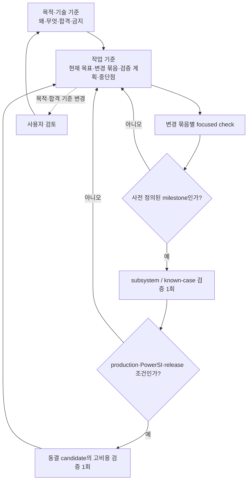

# SPD Decap PI Evaluator 목적·기술 기준

- 적용 제품: **SPD Decap PI Evaluator v0.23.1**
- 문서 버전: **1.198**
- W5 approved/machine-frozen source-before: `main` commit `027ac7a09a3eded15f45c41860945f9d4c7f488d`
- 상태: **G0 기준 문서** — W5 DONE; W6-BASE 260729 numerical FAIL; W7-SOURCE-IR Phase 1/2/3/4와 W7-PHYS-PROSPECTIVE-P0/P1/P2/P4/P5/P6/P7/P8/P9/P10/P11 DONE, P3/P11 DONE/STOP (모두 shadow/prerequisite 범위); Actual-P0/R1/R2와 R2-MULTI-TOPOLOGY-DIAG-01 및 Recovery-01은 DONE/STOP, FIX-01/FIX-02는 DONE/ACCEPT다. `W7-PHYS-SOURCE-ANCHOR-LEAN-DSU-EVIDENCE-01`은 DONE/`STOP_TARGET_CONTACT_MISSING_OR_AMBIGUOUS`다.
  DSU-02/DSU-03/DSU-04는 각각 `STOP_PROVENANCE_INCOMPLETE`, DSU-05는 `STOP_MULTIPLE_NOT_REPRODUCED`로 영구 종료됐다.
  W7 production physics는 BLOCKED이고 현재 sole ACTIVE는 **NONE**이다. W7-PHYS-OWNER-JOIN-EVIDENCE-01은 DONE/ACCEPT로 닫혔다.
- 현재 평가: W6-BASE는 PowerSI 수치 기준 FAIL이고 unseen/generalization은 `unknown / not_run`이다. P11은 commit `e8d029a`에서 exact 1 GHz P1 supplemental matrix를 기존 Layer-Surface 경로에 적용해 reciprocity/row-sum 뒤 factor gate까지 도달했지만, pivot ratio `1.900e15`와 condition-1 lower bound `1.096e17`로 기존 `1e13` forward-reliability 한계를 초과해 `SHADOW_SOLVE_NUMERICAL_FAILURE` STOP했다. 작은 backward residual `7.308e-17`은 forward accuracy 증거가 아니다. production solver caller, cache, topology, owner-off, `Y_global`과 `Zii`는 바뀌지 않았다.
- 제품 solver/owner-off/`Y_global`/`Zii`와 W6 PowerSI 수치는 변경되지 않았으므로 수치 격차 개선은 0이다(새 percentage metric이 아니라 실측 improvement absence를 뜻한다).
- Sole ACTIVE item (current): **NONE** — W7-PHYS-OWNER-JOIN-EVIDENCE-01은 technical commit `2b27e30c6fe41f03281d3943568d0905d84d8af3`에서 DONE/ACCEPT로 닫혔다. 다음 후보는 별도 frozen original-SPD one-shot preflight이며 NOT READY/NOT ACTIVE다.
- P11 closure: commit `e8d029a`, 최종 지정 node `1 passed in 1.55s`, Sol ACCEPT; matrix SHA `b0680d39fcc0f9bad2c6e619b6910fd3e52765a610b940e31f7dc6cb1be79c0e`; accepted stamp/matrix/solve/readiness flags false, production unchanged.
- 현재 권한: main-only와 `accuracy_parse.py` 보존만 유지한다. 닫힌 Phase A/B gate에는 추가 code/test 실행 권한이 없으며, 별도 frozen successor review 전까지 원본 SPD 실행을 포함한 후속 작업을 열지 않는다. physics/solver/`Y_global`/`Zii`는 변경하지 않으며 PowerSI numerical improvement는 0이다.
- DSU-03 closure: contract `35b11484eabfce80d27c7a273b92fd68c5f37102`, frozen coordinator 115,960 bytes/SHA-256 `fb6dc30adabd8c93453dcc0791bf99f2464d49b8c90c76c8ce74f9dbd1a93402`, report 1,511 bytes/SHA-256 `c052258fe5ab389169b7e4d33853d90dcc29394057cb186f2ed548b2aead6b17`, sibling receipt 2,238 bytes/SHA-256 `fee03ea53c5c7d4a308711a94cd9ff5ee2b45eacb1f29b5941b44ba36ce2caae`다. calls는 `1/1/1/1`, retry/runtime guards 0이고 V1/V2/E1/E2/V3는 미평가다. observed immediate layer는 `Signal$L02(DGND)`이고 remote selected ground는 `Signal$L29(DGND)`인데 둘의 동일성을 강제한 observer 계약 때문에 pre-graph STOP했다. 이는 source/product data 결손이 아니며 재시도·재사용·재실행하지 않는다.
- DSU-04 closure: contract `28845c0bd718d61fb611414005d1b325b19a9eca`, frozen coordinator 119,092 bytes/SHA-256 `df2c43d45f8b86a016015b4163cddeabcda8211a59520a88cb9cf1fc677634ee`, report 1,567 bytes/SHA-256 `72ca6d6eaeb81d39c91785a4c6243ee34f769f1d6ea07f74e03d6b78e7cad389`, sibling receipt 2,238 bytes/SHA-256 `01e4618f9b9af0024fabfe1ad13db148482a9d1b8eaa2a29884507797cd0b64c`다. calls는 `1/1/1/1`, retry/runtime guards 0이고 `power immediate landing contact is invalid`에서 pre-graph STOP했다. immediate map 0은 제품의 direct/trace finite-path 계약에서 허용되므로 source/product 결손이 아니라 observer 과잉 계약이며, actual path와 V1/V2/E1/E2/V3는 미평가다. 재시도·재사용·재실행하지 않는다.
- coordinator freeze: historical DSU-05 coordinator는 `D:\SPD-Decap-PI-Evaluator-W7\_coordinator_temp\source_anchor_lean_dsu_evidence_v5.py` (119,869 bytes, SHA-256 `601e7404f85d4ce64c43203a1af94b28144c82e516651f6a241d75b3f6c8d9bb`)이며 in-memory compile/self-check 각 1회 PASS, 195.51 bytes/target vertex와 Sol final ACCEPT를 기록한다. exact contract는 docs-only commit `314f3a64aefb7b60c975a93cc7e6d701ab3debc4`다.
- DSU-05 closure: 원본 SPD `D:\S4LB002-2Para_260729_1_injected.spd` (1,116,717,287 bytes, observed SHA-256 `40cb44b2376f59d6b606eb9b4d138204fe51b2dc6b3332d3b7c0e7d4202866d2`) one-shot은 `STOP_MULTIPLE_NOT_REPRODUCED`로 종료됐다. report는 289,336 bytes/SHA-256 `368c3e2d15c45ba93f5c0eea49b8cf9149efa18deed79cf9c4d341abe28361ba`, sibling receipt는 2,246 bytes/SHA-256 `e70af4cb45129829c9d11e4ed1b14bfc3643af0edab518752d27923f19b81837`다. child 2,845.614 s/launcher 2,851.766 s, exit 1, import/analyze/observer/report `1/1/1/1`, retry와 세 runtime guard 0이다.
- DSU-05 finding: V1/V2/V3 각 784,687, E1/E2 각 1,692,389로 3V+2E graph gate를 통과했다. 6개 contact 모두 `direct_via_landing`, complete/issues 0이며 `C_contact == C_graph_all == C_graph_complete`가 count 1과 동일 hash로 성립했다. source-boundary multiple-selector 가설은 이 범위에서 재현되지 않았고 제품 solver/PowerSI 정확성 개선 증거는 아니다.
- Post-DSU-05 readiness: candidate old-Maxwell owner를 source-derived P1 N-port atomic replacement로 바꾸는 안은 **NOT_READY/STOP**이다. 선택된 L30/L29 finite-area source footprint/P1 terminal identity와 실제 `Y_global`이 소비하는 정확한 old-Maxwell owner closed set을 bijective하게 잇는 hash-bound source-to-production replacement-owner join ledger가 없다. 이 ledger가 rail-complete scope와 replaced/retained disjoint partition을 증명해야 한다.
- DSU-05 count/SHA-only evidence, compiled-only Recovery와 full certificate/ownership IR 부재로 exact join key가 없었으므로 prior revision에서 W7-PHYS-OWNER-JOIN-EVIDENCE-01을 evidence를 만드는 gate로 열었다. Technical commit `2b27e30c6fe41f03281d3943568d0905d84d8af3`에서 DONE/ACCEPT로 닫혔으며, DSU-06/FIX-03/P12/production/rerun은 여전히 금지하고 PowerSI numerical improvement는 0이다.
- 물리 작업 재개 조건: IR prerequisite 완료 후에도 geometry/material provenance, physical limiting-case invariant, rail-complete 적용 범위, deterministic stamp와 실제 consumer에 결속된 disjoint owner ledger를 갖춘 단일 physical candidate가 필요하다.
- 최종 개정: 2026-08-31 (Asia/Seoul)

## 1. 문서 역할과 권위

이 문서는 프로그램의 **왜**, **무엇**, **합격의 의미**, **넘지 말아야 할
경계**를 고정한다. 작업 목록, 구현 순서, 진행 상황, 검증 실행 기록은 이
문서에 누적하지 않는다. 그것들은 **작업 기준 문서**에서
관리한다.

권위는 두 축으로 구분한다.

1. **목적과 우선순위:** 이 문서가 최우선이다. 작업 기준 문서와 개별 계획은
   이 문서를 변경하거나 우회할 수 없다.
2. **현재 구현과 결과 사실:** exact commit의 source, hash-bound input/output
   artifact, 실행 log가 요약 문서보다 우선한다. 코드가 이 문서와 다르면
   코드가 옳다는 뜻이 아니라 해결할 불일치가 발견된 것이다.

과거 release note, 연구 문서, PRD, session log는 증거와 결정 이력이다.
현재 목적이나 현재 통과 상태를 자동으로 정의하지 않는다. 목적, 수치 합격선,
제품 sign-off 범위를 바꾸려면 사용자 검토와 이 문서의 명시적 개정이 필요하다.

## 2. 최우선 목적

> **완성된 SPD 도면에서 source-derived 물리·연결 근거만 사용하여 single-rail
> driving-point impedance `Zii`를 계산하고, 공급된 PowerSI 결과와 비슷한
> 정확도를 새로운 설계에도 재현할 수 있는 알고리즘과 제품 workflow를
> 확립한다.**

PowerSI Touchstone은 외부 비교 자료다. PowerSI 응답을 이용해 R/L/C, 재료,
geometry correction 또는 설계별 보정값을 fitting하지 않는다. 목표는 특정
파일 네 개를 맞추는 것이 아니라, source evidence에서 일반화되는 계산법을
확립하는 것이다.

이 프로그램은 pre-design 판단 도구다. PowerSI, SIwave, full-wave field solver,
DRC, 제조 또는 sign-off 도구를 대체한다고 주장하지 않는다.

## 3. 목적 우선순위

앞선 항목을 뒤의 항목과 교환하지 않는다.

1. **외부 정확성 및 일반화:** rail별 magnitude, phase, resonance, complex error가
   승인된 PowerSI 비교 기준을 만족해야 한다.
2. **물리·증거·수치 건전성:** source provenance, topology ownership, passivity,
   reciprocity, conservation, conditioning과 convergence가 설명 가능해야 한다.
3. **실사용 가능성:** 목표 장비에서 시간, memory, 취소, 저장 및 복구가
   실용적이어야 한다.
4. **보조 workflow:** De-cap Distribution, UI, workbook, AI 보조 분석은 위 세
   목적을 지원한다. 그 자체가 정확성 목표를 대체하지 않는다.
5. **배포:** installer와 release는 앞선 gate를 통과한 범위만 전달한다.

성능 최적화는 틀린 물리 모델을 빠르게 만드는 근거가 될 수 없다. Distribution
호환성이나 UI 편의 작업을 최우선 정확성 과제로 승격하려면 사용자 승인이
필요하다.

## 4. 제품 입력·출력 경계

| 구분 | 현행 역할 | 경계 |
|---|---|---|
| Raw SPD | geometry, stack-up, material table, net, node, trace, via, plane artwork, Device/Decap source | 원본을 수정하거나 덮어쓰지 않음 |
| `.spdpi` | source identity, scenario state, normalized attachment와 Original baseline 보존 | raw SPD 자체를 내장하지 않으며 source/hash 불일치 시 재사용 금지 |
| Decap model | passive two-terminal branch와 assignment | PowerSI 응답으로 parameter fitting 금지 |
| Distribution workbook | format 5 Target/Tolerance 및 policy 교환 | format 1–4는 현행 exact-layer 계약으로 직접 import하지 않고 source SPD에서 재-export 필요 |
| PowerSI Touchstone | 외부 complex impedance 비교와 promotion 판단 | production network 구성·parameter fitting 입력이 아님 |
| Evaluation 결과 | Original/Tuned `Zii`, target 비교, plot/table/CSV | 통과한 evidence scope 밖의 정확성 또는 sign-off 주장 금지 |
| Distribution 결과 | immutable landing에서의 assignment planning, audit, workbook/CSV | SPD via/plane artwork를 실제로 고치지 않으며 제조·DRC·SI sign-off가 아님 |

## 5. 현행 기술 기준

### 5.1 Evaluation

- Desktop 기본 profile은 `layerwise_admittance_v1`, 표시명은
  **Layer-surface terminal-complete network**다.
- 현행 solver identity는 `modal-mvp-0.8.5`, compiler algorithm은
  `layer-surface-adjacent-y-island-finite-via-termination-kron-v8`이다.
- retained physical `(layer, NET)` artwork surface를 독립 node로 두고, 인접
  dielectric gap의 ordered artwork에서 Maxwell admittance block을 만든다.
- source-observed same-NET Trace/Via connectivity와 ownership-resolved finite
  Via R/L만 결합한다. Device terminal과 Decap loop branch의 소유권을 substrate와
  중복하지 않는다.
- 모든 내부 interface는 하나의 sparse global-Y system에서 Schur/Kron
  reduction하며 외부 Device port의 open-port `Zii`를 읽는다.
- **Legacy modal**은 명시적 rollback/regression profile이다. source evidence가
  부족할 때 Layerwise가 몰래 Legacy로 fallback해서는 안 된다.
- PowerSI는 network compile이나 parameter 생성 중 읽히지 않는다.

세부 공식과 modeling 설명은 [Evaluation Accuracy and Modeling
Boundary](EVALUATION_ACCURACY.md)에 둔다. 현행 Layerwise는 source-derived
quasi-static circuit model이며 다음을 충분히 표현하지 않는다.

- lateral Trace impedance와 plane-sheet nonuniform R/L
- Via return/mutual coupling, pad/anti-pad field와 copper spreading
- inter-rail/site transfer coupling, DC IR drop, DGND tie impedance
- general multiport/full-wave field behavior

### 5.2 De-cap Distribution

- 물리적 Decap/PWR Via landing XY와 source plane artwork는 불변이다.
- candidate는 retained target PWR artwork와 source evidence로 eligibility를
  판정한다. non-TOP 이동은 현행 v0.23 transition evidence/gate를 통과해야 한다.
- 결과는 assignment planning이다. 필요한 Via stack retarget/rebuild를 실제
  source SPD에 적용했다는 뜻이 아니다.
- optional signal-routing protection은 기본 OFF이고 현재
  `SIGNAL_NET_ONLY` width-resolved Trace scope다. routed PWR/GND, signal Via,
  pin, pad, fanout 전체를 인증하지 않으므로 DRC-safe 결과로 승격하지 않는다.
- 자세한 수량, topology, preview/apply 규칙은
  [De-cap Distribution 변동 규칙](DECAP_DISTRIBUTION_RULES.md)에 둔다.

### 5.3 Persistence, UI와 독립성

- source identity, scenario state, solver/profile/compiler identity가 다르면
  cache와 artifact를 공유하지 않는다.
- `.spdpi`를 다시 열 때는 scenario가 가리키는 외부 raw SPD payload의 size와
  SHA-256이 일치해야 한다. 따라서 `.spdpi`를 raw source 없이 완전히
  self-contained인 project로 설명하지 않는다.
- immutable Original **configuration**과 계산된 Original **result curve**를
  구분한다. 현행 기본 Layerwise Original result는 run마다 다시 계산되므로,
  저장된 baseline curve를 자동 재사용한다고 주장하지 않는다.
- Original/Tuned 양쪽은 같은 builder-time connectivity/modelability 경계로
  검사하며, 차단된 rail은 결과에 `NOT evaluated`로 남겨야 한다.
- 장시간 parse, compile, solve, save/load는 GUI thread 밖에서 수행하고 progress,
  cancellation, stale-result rejection을 보존해야 한다.
- 프로그램명과 버전은 title bar와 installer metadata에서 쉽게 식별 가능해야
  한다.
- runtime에 다른 PI Calculator 또는 `probe-card-mlo-pdn`을 설치·import·갱신하지
  않는다. 세부 경계는 [Embedded evaluation core](CORE_EXTRACTION.md)에 둔다.

## 6. 증거와 상태 표기

`passed` 한 단어만 사용하지 않는다. 모든 중요한 주장은 최소한 다음 세 요소를
가진다.

| 요소 | 허용 예 | 의미 |
|---|---|---|
| 적용 대상 | `current`, `historical`, `planned` + commit/profile/input hash | 어느 구현과 자료에 적용되는가 |
| 증거 상태 | `verified`, `provisional`, `unknown` | artifact와 재현 범위가 충분한가 |
| 실행 결과 | `passed`, `failed`, `blocked`, `not_run` | 해당 범위의 판정 또는 미실행 상태 |

`verified + passed`도 명시된 coupon, parser, import 또는 gate 범위만 통과했다는
뜻이다. product accuracy, performance, release까지 자동 승격하지 않는다.

### 6.1 현재 제품 판정

| 주장 | 현재 판정 | 해석·권위 문서 |
|---|---|---|
| 제품 identity | SPD Decap PI Evaluator v0.23.1 | title/package의 현행 identity. release 상태는 별도 확인 대상 |
| 외부 정확성 | W6-BASE 260729 retrospective numerical **FAIL** | completed evidence지만 PowerSI accuracy promotion 실패; exact 이력은 작업 기준 |
| unseen/generalization | `unknown / not_run` | 개발 case FAIL 동안 승격·실행 금지 |
| Source IR | Phase 1/2/3/4 committed; Phase 4 `3b76af4` | prerequisite/shadow 범위; schema 상세는 Source-derived IR 문서 |
| contact admissibility | P0 `4dc855a`, focused PASS / Sol ACCEPT | 모든 v2 contact의 direct same-net artwork full coverage만 증명; production port/stamp 아님 |
| contact-complete N-port | P1 `f823a53`, focused `1 passed in 1.58s`; Sol conditional ACCEPT 뒤 identity fix | exact 1 GHz shadow N×N/constraint/diagnostics만 증명; production owner-off 아님 |
| contact quotient | P3 `b8a79f1`, focused `1 passed in 1.51s`; Sol ACCEPT; semantic STOP `CONTACT_INTERFACE_RANK_LOSS` | 현 PWR/GND two-node ideal quotient는 P1 current-spreading mode를 보존하지 못함; topology split 자체는 미구현 |
| selected base cut-set | P4 `39fd4fa`, corrected focused `1 passed in 1.53s`; Sol ACCEPT | base adjacency closure만 증명; `split_ready=false`, scenario/termination 미포함 |
| scenario commutation | P6 `6793bb2`, final focused `1 passed in 1.42s`; Sol ACCEPT | P5 경계의 scenario/termination 구조 보존만 증명; readiness false |
| production `Y_global` / `Zii` | P6 이후에도 변경 없음 | IR·shadow PASS·import 성공을 정확도 개선으로 해석하지 않음 |
| historical v0.23.0 attestation | import/save/92-rail solver entry만 verified | frequency solve·Touchstone comparison·현행 release 근거로 재사용 금지 |

과거 validation placeholder, report-level pass, 작은 backward residual,
import/save 성공은 PowerSI accuracy promotion이 아니다. W5 이전 합격선은 역사적이며,
현행 수치 정책은 아래 6.2가 권위 있다. exact commit, artifact, runtime과 test 이력은
[작업 기준](WORK_EXECUTION_BASELINE.md)에만 둔다.

### 6.2 W5-GATE approved/machine-frozen policy

W5 threshold, partition, run manifest는 사용자 승인으로 **machine-frozen**된
정책 계약이다. 수치와 분류는 여전히 역사적 측정 결과나 제품 sign-off가 아니다.
현재 등록된
자료에는 최종 generalization을 판정할 P5 unseen design이 없으므로, 최종 정확성
및 일반화 승격은 BLOCKED다.

- 승인 threshold: 100 kHz/1 MHz low-frequency offset, 100 kHz–100 MHz
  critical-band magnitude, rail별 max magnitude, phase, low-impedance complex
  error, dominant-peak 위치/진폭을 함께 판정한다.
- VQPS 10개 bare rail과 VTRIP/VINT/VCPU 6개 loaded rail은 별도 strata로
  유지하며 pooled 평균이나 한 strata가 다른 strata의 실패를 숨기는 판정을
  하지 않는다.
- 260729 development와 260804 retrospective design holdout은 모두
  retrospective evidence다. W5 freeze 당시 양쪽 등록 `D:\` raw 경로와 S92P
  경로는 존재/size 일치만 확인되었고 SHA는 재계산하지 않았다. 등록 baseline
  candidate는 없었고, 이전 blocked root에서 생성된 candidate는 W6-BASE controller
  output·scoring snapshot·retry에 재사용하지 않는다. 당시 승인된 W6 contract는
  brand-new root의 fresh import에서 시작해야 한다. B의 correlation은 historical
  evidence이고, C는 old candidate/import report를 정확히 한 번 read-only로
  열었고, correlation report는 사용하지 않았으며, fresh C root에만 썼다.
- Site0/site1/loaded는 blind sample이 아니라 노출된 strata다. P1 transfer/scale
  holdout은 160-port runner와 memory-safe preprocessing 부재로, P2는 현재
  weighting/reference-plane/de-embedding 미확정으로, P3/P4는 등록 경로의
  reference 부재와 multifactor/solver-state confound로 BLOCKED다. P5 unseen
  design은 없으며 최종 generalization에 필수다.

따라서 W6가 만들 수 있는 것은 260729/260804의 **비-blind
retrospective baseline**뿐이다. 이것을 unseen generalization 또는 제품
PowerSI 합격으로 재사용할 수 없다.

W5 frozen trust identity는 benchmark base normalized SHA
`d43b868629464f408ea19362daa78fc369d2fd446cf3d458cfdc044ccbf57f08`, adapter
`6b7e399b4a843028ce754ac9154b8ce1a4575b1581c8d6007cebf26f94e6d440`, v6
validator `3f26b2aa7880cd9aff89cd5407643c934367764b590db98962cbc30bfa1b04a0`,
accuracy validator `8487be60cad523f9ed2ea1c61c57b580d9c2bb0fee598eea0bb938145b82151e`,
policy `6ea6e0b3327eaf828257334d7bb0211582fcc85ed632468223c7b566d0d3fd4d`,
controller `b7d5b87d97e1441ccaa950a1fbe50a49f599483e68acee99596eda7dd612262d`이다.
기존 v5 validator, known-case policy와 historical fixtures는 byte-identical로
보존되며, W6 controller는 `blocked_partial`에서 부분 결과를 점수화하지 않는다.

W6의 tombstone, immutable root, exact 실행 SHA와 BLOCK-A–E 이력은
[작업 기준](WORK_EXECUTION_BASELINE.md#w6-base-completed-evidence-260729)에만 둔다.
과거 blocked-partial 또는 old-policy 결과를 현행 completed W6-BASE로 재분류하거나
새 policy로 소급 검증하지 않는다.

## 7. Promotion gate

다음 gate는 순서대로 통과한다. 앞 단계 실패나 unknown 상태에서 뒤의 고비용
단계를 실행하거나 release claim으로 건너뛰지 않는다.

1. **Identity/evidence:** source, reference, port manifest, code, compiler,
   profile, material assumption, frequency policy hash가 완전하다.
2. **Physical/numerical integrity:** source ownership, limiting case, passivity,
   reciprocity, conservation, conditioning, residual과 frequency coverage를
   focused case로 판정한다.
3. **Subsystem/known-case:** 변경된 subsystem의 deterministic regression과
   catastrophe floor를 통과한다. 이는 외부 정확성 승격이 아니다.
4. **Frozen candidate:** 관련 변경 묶음과 설정을 동결한 뒤 end-to-end
   frequency solve와 artifact 생성을 완료한다.
5. **External accuracy/generalization:** development, reserved holdout, 최종
   unseen design을 분리해 rail별 magnitude RMS/max, phase RMS/max, resonance
   위치·진폭, low-impedance complex error를 판정한다. 평균이 한 rail의 실패를
   숨길 수 없다.
6. **Performance/product/release:** 목표 장비의 wall time, process-tree memory,
   cancellation, save/export, GUI response와 installer workflow를 판정한다.

정확성 후보가 동결되기 전에 acceleration, adaptive sampling 또는 MOR 결과를
정확성 개선으로 해석하지 않는다. source-derived 물리 변경은 한 번에 한 owning
block만 바꾸고, 어떤 error component를 줄이려는지 사전에 명시한다.

## 8. 검증 비용을 통제하는 불변 원칙

구체 명령, 예상 비용, 최대 재시도 횟수와 중단 조건은
[작업 기준 문서](WORK_EXECUTION_BASELINE.md)에 적는다. 이 문서에서는 다음
원칙만 고정한다.

- 작은 수정마다 전체 테스트, production SPD, PowerSI correlation, installer를
  반복하지 않는다.
- 관련 수정을 하나의 원인·결과 묶음으로 닫고 focused check를 수행한 뒤,
  사전 정의된 milestone에서 subsystem 검증을 한 번 실행한다.
- production/PowerSI 전체 검증은 solver 의미, profile, threshold와 변경 묶음이
  동결된 candidate마다 원칙적으로 한 번 실행한다.
- 낮은 단계가 실패하면 원인을 작은 재현으로 축소한다. 전체 실행을 디버깅
  수단으로 사용하거나 원인 변경 없이 같은 고비용 실행을 반복하지 않는다.
- commit, input hash, profile/compiler, 설정과 판정 환경이 모두 같을 때만 기존
  증거를 재사용한다. 하나가 달라지면 상태를 `unknown`으로 되돌리되, 즉시 전체
  검증을 실행하지 않고 다음 필요한 milestone에 배치한다.
- `not_run`, `reused`, `not_required`를 구분해서 기록한다.
- 문서만 바뀐 단계에서는 link, Markdown structure와 diff만 검사한다. 문서 변경을
  이유로 solver나 installer 검증을 실행하지 않는다.

## 9. Fail-closed와 비주장

- source, geometry, topology, terminal, workbook, cache 또는 result identity가
  불일치하면 재사용하지 않는다.
- 누락·모호한 source evidence를 좌표 clamp, 임의 연결, fitted value 또는
  silent fallback으로 숨기지 않는다. 명시적으로 versioned fallback을 지원하는
  경우에는 그 범위와 confidence를 결과에 표시하고 exact-source 주장에 사용하지
  않는다.
- Original/Tuned 중 한쪽이 build되지 않으면 완전 비교로 표시하지 않는다.
- 실행하지 않은 solve, rail 또는 reference 비교를 0, pass 또는 evaluated로
  기록하지 않는다.
- 특정 rail, 한 평균값, 한 보드 또는 한 PowerSI 파일의 개선을 일반 정확성으로
  확대하지 않는다.
- Distribution planning 결과를 as-built connectivity, DRC, 제조 또는 PI
  sign-off로 부르지 않는다.
- AI는 solver 결과나 design state를 직접 변경하지 않는다.

## 10. 세 기준 문서를 이용한 작업 방식

새 작업과 context가 재개될 때 기본 입력은 다음 세 문서로 제한한다.

1. 이 **목적·기술 기준 문서** — 목적, 합격선, 우선순위와 금지 경계
2. [**Source-derived physical IR**](SOURCE_DERIVED_PHYSICAL_IR.md) — 현행 source IR 계약, schema와 기술 주장 범위
3. [**작업 기준 문서**](WORK_EXECUTION_BASELINE.md) — current Git/evidence 상태, 실행 예산, 이력과 다음 승인 gate

필요한 subsystem 문서와 source는 현재 작업 범위에 따라 선택해서 읽는다. 과거
연구 문서 전체를 세션 시작 조건으로 삼지 않는다.

작업 기준 문서는 최소한 현재 목표, 제외 범위, 변경 묶음, 해당 파일/함수,
검증 단계와 실행 조건, 예상 비용, 최대 재시도, 중단점, evidence identity,
결과와 다음 결정을 기록해야 한다. 작업 기준 문서는 목적이나 합격선을 임의로
바꾸지 못한다.

목적에서 벗어난 문제가 발견되면 별도 후보로 기록할 수는 있지만 현재 작업을
중단하고 확장하지 않는다. 목적 또는 수치 gate 변경이 필요하면 사용자 검토
전까지 작업을 멈춘다.

## 11. 관련 문서와 해석 범위

- [Source-derived physical IR](SOURCE_DERIVED_PHYSICAL_IR.md): source-derived
  canonical IR의 현행 기술 계약. Phase별 실행 이력과 current Git 권위는 작업 기준에 둔다.
- [Evaluation Accuracy and Modeling Boundary](EVALUATION_ACCURACY.md): 현행
  Evaluation 수식·modeling 상세. 일부 과거 validation 서술은 역사적 범위다.
- [Evaluation Solver Deep-Research Decision Record](EVALUATION_SOLVER_DEEP_RESEARCH_2026-08-04.md):
  accuracy-first 연구 방향과 후보 기술의 역사적 결정 기록.
- [Evaluation Algorithm Research State](evaluation-research/RESEARCH_STATE.md):
  상세 연구·실행 이력. current product promotion 근거로 자동 사용하지 않는다.
- [Bounded Baseline Protocol](evaluation-research/BASELINE_PROTOCOL.md): 상태 분리와
  단계형 baseline의 역사적 프로토콜.
- [Layer-Surface Validation Record](EVALUATION_LAYER_SURFACE_VALIDATION_2026-08-06.md):
  named input과 과거 실행 기록. `TO_FILL` 구간이 있어 완료된 current release
  evidence로 인용하지 않는다.
- [De-cap Distribution 변동 규칙](DECAP_DISTRIBUTION_RULES.md): 현행
  Distribution 상세 계약.
- [Embedded evaluation core](CORE_EXTRACTION.md): standalone/runtime 독립성.

## 12. 현재 결과 평가와 재개 조건

| 평가 축 | 현재 결론 |
|---|---|
| 제품 기반 | W0–W5에서 목적·작업 통제, product-core truth, SPD/I/O 안전성, CI, solver fail-closed guard와 frozen accuracy gate를 확보했다. |
| 외부 정확성 | W6-BASE 260729는 완료된 수치 결과지만 PowerSI 기준 **FAIL**이다. unseen/generalization은 `unknown / not_run`이다. |
| Source IR 성과 | Phase 1/2는 canonical source/provenance IR과 importer seam, Phase 3은 deterministic shadow finite-port witness, Phase 4는 quotient-authoritative all-contact v2를 commit `3b76af4`에서 완료했다. 세부 계약은 [Source-derived physical IR](SOURCE_DERIVED_PHYSICAL_IR.md)이 권위 있다. |
| Source IR 한계 | P0–P10은 contact admissibility부터 exact 1 GHz atomic replacement recipe, shadow topology/P1 block binding과 augmented component/pruning closure까지의 prerequisite를 증명했다. P11은 actual shadow matrix/factor gate를 실행했지만 forward reliability STOP했다. trusted solve, production assembly와 `Zii` 연결, PowerSI 근접 정확성은 증명하지 않았다. |
| 생산 물리 상태 | surface-patch plane current-spreading R/L이 유일한 credible direction이지만 deterministic replacement stamp, production global assembly와 disjoint owner-off ledger가 없어 **NOT READY/STOP**이다. |
| 현재 작업 상태 | Actual-P0/R1/R2, DIAG-01, Recovery-01과 DSU-01–05는 영구 DONE/STOP했다. FIX-01/FIX-02는 DONE/ACCEPT다. DSU-05는 exact contract `314f3a64aefb7b60c975a93cc7e6d701ab3debc4`에서 `STOP_MULTIPLE_NOT_REPRODUCED`로 닫혔다. |
| 현재 ACTIVE | **NONE** — W7-PHYS-OWNER-JOIN-EVIDENCE-01 DONE/ACCEPT; next original-SPD one-shot preflight NOT READY/NOT ACTIVE |
| 현재 gate | **NONE** — 마지막 W7-PHYS-OWNER-JOIN-EVIDENCE-01은 DONE/ACCEPT로 닫혔다. 별도 frozen successor review 전까지 DSU-06/FIX-03/P12/production wiring과 원본 SPD를 열지 않으며 physics/solver/`Y_global`/`Zii`와 PowerSI numerical improvement는 0으로 유지한다. |
| 사전 물리 가설 | 대상 bare rail의 exact old-Maxwell owner를 source-derived P1 N-port로 **교체**할 때의 순 capacitance 변화 `ΔC = Ceff(P1) - Ceff(old owner)`가 기존 100 kHz/1 MHz PowerSI 오차 성분을 설명할 수 있는지를 후속 별도 gate에서 무피팅으로 반증한다. actual scenario 생성 자체는 정확도 개선 증거가 아니다. |

세부 실행 이력, exact artifact identity와 current dirty file set은
[작업 기준](WORK_EXECUTION_BASELINE.md)에만 둔다. 이전 미시적 실행 이력은 Git
history로 추적하며, 이 문서에는 다시 복제하지 않는다.

## 13. W7-PHYS-OWNER-JOIN-EVIDENCE-01 — DONE/ACCEPT closure

source-before는 exact `main` HEAD `74d49077ec6f67a7bdebe1e1815da4f2c7897771`이다.
이 frozen gate의 목적은 physics/solver/`Y_global`/`Zii`를 바꾸지 않고, source-derived
P1 replacement와 production old-Maxwell owner를 hash-bound로 잇는 누락된 evidence를
만드는 것이다. PowerSI numerical improvement는 **0**으로 유지한다. Root cause는 한
global contact에 서로 다른 required rail layer의 component 후보가 여럿일 수 있는데
ownership-private selector가 global singular identity를 요구한 것이며, exact-one은
`(expected_net, expected_layer)`별 속성이다.

- Phase A는 `src/spd_decap_pi/spd_adapter.py`와
  `tests/test_source_plane_ownership_ir_producer.py`만 수정한다. 먼저 full global
  candidate/evidence closure를 검증한 뒤 exact `(expected_net, expected_layer)`로
  projection하여 정확히 하나만 허용하고, 같은 pair의 0개 또는 2개 이상은 동일하게
  STOP한다. contact singular alias는 승격하지 않으며 global certificate/compiled
  topology schema와 hash, `layerwise_network.py`는 보존한다.
- Phase B는 기존 P2/P3/P4/P7와 `source-plane-ownership-ir-v2`를 재사용하는
  read-only observer로, `src/spd_decap_pi/source_plane_patch_consumer.py`와
  `tests/test_source_plane_patch_consumer.py`만 수정한다. source/P1 contact row와
  production old-Maxwell row를 기존 fingerprint
  `SHA256(substrate_identity, upper_layer, lower_layer, upper_island_id,
  lower_island_id, capacitance_f_hex)`로 키잉하고 partial ordinal, reduced
  coordinates, aggregation count, action ledger, replaced/retained disjoint hashes,
  final report SHA를 낸다. persisted DB/table/schema/asset 변경은 0이며 반환되는
  read-only observer report object 하나만 허용한다. `shadow_only=true`,
  `replacement_ready=false`, `production_ready=false`를 내고 hash/identity/coverage/
  disjointness/partial exact-one/reduced-coordinate 불일치는 fail-closed한다.
- batched implementation 후 Sol static code review 다음에 아래 executable test node
  정확히 2개를 각각 1회만 실행한다(전체 suite, `python -m compileall`, extra pytest 금지).
  `tests/test_source_plane_ownership_ir_producer.py::test_source_plane_ownership_component_layer_is_authoritative_for_mismatched_endpoint`
  및 `tests/test_source_plane_patch_consumer.py::test_source_plane_patch_owner_off_shadow_audit_mini_spd`.
  `git diff --check`와 tracked diff review는 static check로서 executable 횟수에 포함되지
  않으며 closure 직전 전체 gate 기준 각 최대 1회다. 두 Phase focused PASS, Sol ACCEPT, exact
  tracked diff review와 docs closure commit 뒤에만 별도 frozen original-SPD one-shot을
  고려할 수 있으며, 이 gate는 지금 ready로 주장하지 않는다.

## 14. W7-PHYS owner-join closure — current ACTIVE NONE

`W7-PHYS-OWNER-JOIN-EVIDENCE-01`은 technical commit
`2b27e30c6fe41f03281d3943568d0905d84d8af3`에서 DONE/ACCEPT다. Phase A는 global
candidate/evidence closure 뒤 expected `(net, layer)`별 exact-one projection을 고정했고,
Phase B는 source/P1 contact와 production old-Maxwell rows를 fingerprint, partial ordinal,
reduced aggregation 및 replaced/retained disjoint ledger로 묶는 read-only report를 냈다.
persisted DB/table/schema/asset 변경은 0이며 report flags는
`shadow_only=true`, `replacement_ready=false`, `production_ready=false`다.
첫 두-node validation은 consumer PASS와 producer fixture FAIL(전체 v4 partition을 깨는
test-only cloned island)였고, post-externalization snapshot fixture 보정 후 producer-only
rerun은 `1 passed in 1.52s`; consumer는 재실행하지 않았다. Sol ACCEPT와 tracked scope는
명시된 네 implementation/test 파일로 한정된다. `layerwise_network.py`, production
wiring/compiler/cache/solver/`Y_global`/`Zii`는 바뀌지 않았다. 이 closure는 actual
production global-multi compile, original-SPD 성공 또는 PowerSI numerical improvement를
증명하지 않으며 improvement는 **0**이다. 현재 ACTIVE는 **NONE**이고 다음 original-SPD
one-shot preflight는 별도 frozen review 전까지 NOT READY/NOT ACTIVE다.
