# SPD Decap PI Evaluator v0.23.1 — 목적·기술 기준

- 문서 버전: **3.20**
- 권위: **G0 — 목적, 우선순위, 합격 의미와 비주장 경계**
- 최종 개정: **2026-09-02 (Asia/Seoul)**
- 현재 외부 정확성: **W6-BASE 260729 retrospective numerical FAIL**
- unseen/generalization: **unknown / not_run**
- 현재 수치 개선: **0** — solver, `Y_global`, `Zii`와 PowerSI 비교 수치는 아직 바뀌지 않았다.
- 현재 구현 gate: **DONE / ACCEPT / COMMITTED @ `eece8ab944a29a9f6c5ddde17e56de8dbbd2ee6a`**
- current accuracy gate: **A1 DONE / ACCEPT — A2 DONE / ACCEPT_NARROW_CORE_EVIDENCE — V1/A2R/A2S DONE / STOP — A2T DONE / STATIC_ACCEPT — V3G DONE / STATIC_ACCEPT — D-087 DONE / STOP_V3_LAUNCHER_COORDINATOR_SHA_CASE — D-088 DONE / STOP_V3R_IMPORT_OWNERSHIP_TERMINAL_CONTRACT — D-089 DONE / ACCEPT_FOCUSED / COMMITTED @ `54c87d1` — D-090 DONE / STOP_D090_OWNERSHIP_TERMINAL_MULTIBRANCH_CARDINALITY — D-091 DONE / ACCEPT_FOCUSED / COMMITTED @ `6b88c3c` — D-092 DONE / STOP_D092_CONTACT_TERMINAL_OWNER_COVERAGE_PARTITION — D-093 DONE / ACCEPT_FOCUSED / COMMITTED @ `bebbb80` — D-094 DONE / STOP_D094_COORDINATOR_ROWS_HASH_PROJECTION — D-095 DONE / ACCEPT_FOCUSED — D-096 DONE / ACCEPT — D-097 DONE / STOP_D097_RAW_STACKUP_PROVENANCE_SCOPE / CONSUMED_NO_RERUN — D-097R DONE / STOP_D097R_TERMINAL_ENDPOINT_LAYER_SEMANTICS / CONSUMED_NO_RERUN — D-097S DONE / STOP_D097S_INVALID_DETACHED_FIXTURE_COMPONENT_COVERAGE / CONSUMED_NO_RERUN — D-097T DONE / PASS_FOCUSED / COMMITTED @ `6bdd8a1` — D-098 DONE / STOP_MANIFEST_REPRODUCTION / CONSUMED / NO_RERUN — D-099 DONE / STOP_D099_SQLITE_HANDLE_NOT_CLOSED / CONSUMED / NO_RERUN — D-099R DONE / STOP_D099R_TERMINAL_BINDING_PRESENTATION_ORDER / CONSUMED / NO_RERUN — D-100 DONE / PASS_FOCUSED — D-101 DONE / STOP_D096_EVIDENCE_IDENTITY / CONSUMED_NO_RERUN**
- current accuracy gate continuation: **D102/D103/D104 DONE / PASS — D105 DOWNLOAD_ONLY / STATIC_AUDIT_DONE — D106 EXTRACTED / VERSION_PROBE_PASS — next: D105 read-only data-version/list gate**

## 1. 문서 역할과 권위

이 문서는 프로그램의 **왜**, **무엇**, **합격의 의미**, **넘지 말아야 할
경계**를 고정한다. 작업 파일, 명령, hash, 실행 결과와 세부 이력은
[작업 기준 문서](WORK_EXECUTION_BASELINE.md)에서 관리한다.

권위는 다음 순서다.

1. 사용자가 승인한 이 문서의 목적과 우선순위
2. exact commit과 hash-bound 입력·출력·실행 log
3. 작업 기준 문서의 현재 상태와 실행 계약
4. subsystem 문서와 과거 연구·실험 기록

Source-IR 문서는 schema와 기술 계약의 권위이며 live 작업 상태의 권위가 아니다.
상태가 충돌하면 작업 기준 문서가 우선한다. 과거 실행 세부는 이 문서에 다시
복제하지 않는다.

## 2. 최우선 목적

> **완성된 원본 SPD의 source-derived 물리·연결 근거만 사용해 single-rail
> driving-point impedance `Zii`를 계산하고, 공급된 PowerSI 결과에 근접한
> 정확도를 새로운 설계에도 재현할 수 있는 알고리즘과 제품 workflow를
> 확립한다. 최우선은 원본 SPD 근거로 PowerSI에 가까운 Zii 정확도를 얻는
> 것이며, De-cap Distribution 호환은 부차적 보조 workflow다.**

PowerSI Touchstone은 비교 자료다. PowerSI 응답으로 R/L/C, 재료, geometry
correction 또는 설계별 보정값을 fitting하지 않는다. 목표는 특정 파일에 맞는
보정값이 아니라 원본 SPD 근거에서 일반화되는 계산법이다.

이 프로그램은 pre-design 판단 도구다. PowerSI, SIwave, full-wave field solver,
DRC, 제조 또는 sign-off 도구를 대체한다고 주장하지 않는다.

## 3. 목적 우선순위

앞 항목을 뒤 항목과 교환하지 않는다.

1. **외부 정확성 및 일반화** — rail별 magnitude, phase, resonance와 complex
   error가 승인된 PowerSI 비교 기준을 만족한다.
2. **물리·증거·수치 건전성** — source provenance, topology ownership,
   passivity, reciprocity, conservation, conditioning과 convergence가 설명된다.
3. **실사용 가능성** — 목표 장비에서 시간, memory, 취소, 저장과 복구가
   실용적이다.
4. **보조 workflow** — De-cap Distribution, UI, workbook과 AI 보조 분석은 위
   목적을 지원하며 정확성 목표를 대체하지 않는다.
5. **배포** — installer와 release는 통과한 정확성·제품 gate의 범위만 전달한다.

## 4. 제품 입력·출력 경계

| 구분 | 역할 | 경계 |
|---|---|---|
| 원본 SPD | geometry, stack-up, material, net, node, trace, via, plane artwork, Device/Decap의 권위 source | 수정하거나 덮어쓰지 않는다. 필요한 계산 DB는 이 원본에서 재생성한다. |
| Source-derived DB/IR | source identity와 byte provenance, geometry/material/topology/owner relation, 계산용 index | 원본과 hash-bound되어야 하며 누락·추정값을 source-authored 사실로 승격하지 않는다. |
| `.spdpi` | scenario, normalized attachment와 source identity 보존 | raw SPD 자체를 내장하지 않는다. source/hash 불일치 시 재사용하지 않는다. |
| Decap model | passive two-terminal branch와 assignment | PowerSI 응답으로 parameter fitting하지 않는다. |
| PowerSI Touchstone | 외부 complex impedance 비교와 promotion 판단 | network 생성이나 물리 parameter 산출 입력이 아니다. |
| Evaluation 결과 | Original/Tuned `Zii`, target 비교, plot/table/CSV | 실행하지 않은 rail·solve·비교를 0 또는 PASS로 표시하지 않는다. |
| Distribution 결과 | immutable landing 기반 assignment planning | as-built connectivity, DRC, 제조 또는 PI sign-off가 아니다. |

## 5. 현행 기술 기준과 알려진 한계

현행 desktop 기본 profile은 `layerwise_admittance_v1`, solver identity는
`modal-mvp-0.8.5`, compiler algorithm은
`layer-surface-adjacent-y-island-finite-via-termination-kron-v8`이다.

- retained `(layer, NET)` artwork surface를 node로 두고 adjacent dielectric gap의
  Maxwell admittance와 source-observed Trace/Via connectivity를 sparse global-Y로
  조립한 뒤 Schur/Kron reduction으로 외부 Device port `Zii`를 읽는다.
- source evidence가 부족할 때 Layerwise가 Legacy로 자동 fallback해서는 안 된다.
- PowerSI는 compile 또는 parameter 생성 중 읽히지 않는다.
- source identity, scenario, solver/profile/compiler identity가 다르면 cache와
  artifact를 공유하지 않는다.
- parse, compile, solve, save/load는 GUI thread 밖에서 실행하고 progress,
  cancellation과 stale-result rejection을 보존한다.
- 프로그램명과 버전은 title bar와 installer metadata에서 쉽게 식별되어야 한다.

현행 모델이 충분히 표현하지 못하는 주요 후보군은 다음과 같다.

- nonuniform plane-sheet/current-spreading R/L
- via return/mutual coupling과 pad/anti-pad local field
- lateral Trace R/L과 copper loss
- fringing/nonlocal coupling
- source-table 기반 causal dielectric dispersion
- general multiport/full-wave behavior

이 목록은 동시 구현 계획이 아니다. 오차 signature와 source ownership을 먼저
고정하고 **한 번에 정확히 하나의 owning physical block**만 선택한다.

세부 수식과 현행 modeling boundary는
[Evaluation Accuracy and Modeling Boundary](EVALUATION_ACCURACY.md), 후보 연구의
근거는 [Evaluation Solver Deep-Research Decision Record](EVALUATION_SOLVER_DEEP_RESEARCH_2026-08-04.md)를 따른다.

## 6. 현재 증거와 판정

| 축 | 현재 사실 | 주장할 수 없는 것 |
|---|---|---|
| W0–W5 기반 | source/I/O 안전성, fail-closed guard와 frozen accuracy policy를 확보했다. | PowerSI 근접 정확성 완료 |
| W6-BASE 260729 | integrity-valid completed run이지만 bare macro `1.707111 dB`, loaded macro `15.910647 dB`, 총 failure `57`로 numerical FAIL이다. | unseen/generalization, 제품 sign-off |
| W7 Source IR | canonical source/provenance와 contact/owner 관계, shadow prerequisite를 구축했다. | production `Y_global`/`Zii` 개선 |
| W7 prospective P0–P10 | contact admissibility, shadow N-port, owner/cut-set/assembly prerequisite를 닫았다. | production replacement와 broadband 정확성 |
| P11 | exact 1 GHz shadow factor gate에서 forward-reliability STOP했다. 작은 backward residual은 forward accuracy가 아니다. | trusted solve |
| 원본 SPD/streamed IR | production-scale data handoff의 cap, memory, provenance와 validator 결함을 찾아 spool/index 경로를 구현했다. | 원본 SPD end-to-end 성공, PowerSI 개선 |
| 통합 hardening 후보 | predecessor는 node 5 `SPD_NO_RAILS`로 DONE/STOP했다. 승인된 grammar-valid test-only successor는 Sol `STATIC_ACCEPT`, `21 passed in 15.09s` 뒤 commit `eece8ab`로 닫혔다. | production owner join, `Y_global`/`Zii`, PowerSI 개선 |

따라서 현재 product risk는 여전히 **외부 정확성 미달**이며 PowerSI 수치 격차
개선은 0이다. parser/IR/test PASS는 계산 정확도 개선의 대리 지표가 아니다.

## 7. 이번 재감사에서 바로잡은 오류

1. 이미 구현된 predecessor를 구현 전 상태로 표시한 stale 기록을 바로잡았고,
   이후 Sol `STATIC_ACCEPT`와 단일 runtime 실패를 반영해 predecessor의 당시 최종 상태를
   **`DONE / STOP_TEST_UNICODE_FIXTURE_RAIL_FORMATION`**으로 닫는다.
2. predecessor와 별도 successor의 SHA·실행 identity를 구분한다. successor는
   Sol `STATIC_ACCEPT`, 단일 PASS와 commit `eece8ab944a29a9f6c5ddde17e56de8dbbd2ee6a`를 얻었고, exact receipt는
   작업 기준 문서만 관리한다.
3. 목적 문서에 누적됐던 micro-successor 실행 이력을 제거한다. 그 이력은 Git와
   [Source-derived physical IR](SOURCE_DERIVED_PHYSICAL_IR.md)에 남아 있다.
4. surface-patch/current-spreading 또는 `ΔC`를 사전 유일 해법으로 단정하지 않는다.
   `ΔC`는 저주파 capacitance 오차를 설명하는 진단 후보일 뿐 broadband
   magnitude/phase/resonance 개선을 증명하지 않는다.
5. validator 또는 test-oracle 실패마다 새 successor를 자동 생성하지 않는다.
   현재 item 안에서 원인을 묶어 한 번 검토하고, 범위 변경이면 STOP 후 재계획한다.

## 8. 정확성 개선 로드맵

```mermaid
flowchart LR
    H["통합 hardening<br/>DONE / STOP<br/>invalid Unicode fixture"] --> X["test-only successor<br/>DONE / ACCEPT<br/>COMMITTED eece8ab"]
    X --> E["A1 error budget<br/>DONE / ACCEPT<br/>one rail · one component · one block"]
    E --> D["A2 source-block materializer<br/>STATIC_ACCEPT<br/>기존 raw v3 + ownership IR"]
    D --> V1["focused V1<br/>STOP: launcher Python에 pytest 없음"]
    V1 -->|현재 결과| SV1["DONE / STOP_V1_LAUNCHER_NO_PYTEST"]
    SV1 --> V1R["A2R launcher recovery<br/>consumed / no rerun"]
    V1R -->|현재 결과| SR["DONE / STOP_V1R_TEST_FIXTURE_IR_RELATION"]
    SR --> V1S["A2S test-only successor<br/>consumed / no rerun"]
    V1S -->|현재 결과| SS["DONE / STOP_V1S<br/>alias fixture target 없음"]
    SS --> V1T["A2T alias test prune<br/>DONE / STATIC_ACCEPT"]
    V1T --> AN["A2 narrow core evidence<br/>DONE / ACCEPT"]
    AN --> V3G["별도 V3 계약<br/>DONE / STATIC_ACCEPT"]
    V3G --> C["D-087 single run<br/>STOP: SHA case gate"]
    C --> V3R["D-088 V3R<br/>DONE / STOP_V3R_IMPORT_OWNERSHIP_TERMINAL_CONTRACT"]
    V3R --> D89["D-089 focused contract<br/>DONE / ACCEPT_FOCUSED / COMMITTED 54c87d1"]
    D89 --> D90["D-090 source-block census<br/>DONE / STOP_D090_OWNERSHIP_TERMINAL_MULTIBRANCH_CARDINALITY"]
    D90 --> D91["D-091 focused cardinality contract<br/>DONE / ACCEPT_FOCUSED / COMMITTED 6b88c3c"]
    D91 --> D92["D-092 source-block census<br/>DONE / STOP_D092_CONTACT_TERMINAL_OWNER_COVERAGE_PARTITION"]
    D92 --> D93["D-093 contact terminal owner coverage partition<br/>DONE / ACCEPT_FOCUSED / COMMITTED bebbb80"]
    D93 --> D94["D-094 source-block census<br/>DONE / STOP_D094_COORDINATOR_ROWS_HASH_PROJECTION"]
    D94 --> D95["D-095 coordinator rows-hash projection<br/>DONE / ACCEPT_FOCUSED"]
    D95 --> D96["D-096 original-SPD source-block census<br/>DONE / ACCEPT<br/>PASS_SOURCE_BLOCK_CENSUS_COMPLETE / CONSUMED_NO_RERUN"]
    D96 --> D97["D-097 source-bound geometry manifest<br/>DONE / STOP_D097_RAW_STACKUP_PROVENANCE_SCOPE"]
    D97 --> D97R["D-097R selected-stackup provenance scope<br/>DONE / STOP_D097R_TERMINAL_ENDPOINT_LAYER_SEMANTICS"]
    D97R --> D97S["D-097S terminal endpoint provenance<br/>DONE / STOP_D097S_INVALID_DETACHED_FIXTURE_COMPONENT_COVERAGE"]
    D97S --> D97T["D-097T selected-island multicomponent provenance<br/>DONE / PASS_FOCUSED"]
    D97T --> D98["D-098 original-SPD source-bound geometry manifest<br/>DONE / STOP_MANIFEST_REPRODUCTION / CONSUMED"]
    D98 --> D99["D-099 ownership logical rows cross-process determinism<br/>DONE / STOP_D099_SQLITE_HANDLE_NOT_CLOSED / CONSUMED"]
    D99 --> D99R["D-099R SQLite handle closure determinism successor<br/>DONE / STOP_D099R_TERMINAL_BINDING_PRESENTATION_ORDER / CONSUMED"]
    D99R --> D100["D-100 terminal binding canonical order<br/>DONE / PASS_FOCUSED"]
    D100 --> D101["D-101 original-SPD ownership reproduction then fringe<br/>DONE / STOP_D096_EVIDENCE_IDENTITY / CONSUMED"]
    D101 --> PHY["Physics track<br/>L28-L31 16-cell adaptive/global BEM"]
    D101 --> GEO["Geometry track<br/>source-bound crop/WKB acquisition"]
    D101 --> SCORE["Scoring track<br/>frozen 100kHz/1MHz metric"]
    PHY --> INT["raw C gates → conditional C_res or exact replacement → first metric"]
    GEO --> INT
    SCORE --> INT
    D89 -->|STOP| SSRC["static diagnosis/replanning"]
```

### G1 — 현재 통합 hardening 닫기

Sol은 누적 tracked candidate를 한 번에 정적 검토해 `STATIC_ACCEPT`, P0–P3 0을
확정했다. 승인된 successor의 exact 21 nodes도 새 process 한 번에서
`21 passed in 15.09s`로 통과했다. 이 gate의 PASS 의미는 source-IR
fail-closed/casefold/indexed transport semantics뿐이다.

2026-09-01 첫 단일 실행은 21개를 수집했으나 5번째 Unicode casefold fixture가
필수 `Node` 접두사를 제거해 `SPD_NO_RAILS`로 중단됐다. 이 결과는
consumed/no-rerun이며 partial PASS를 재사용하지 않는다. 사용자는 이후
grammar-valid test-only successor와 후속 자동 진행을 승인했다. 새 candidate는
제품 코드를 바꾸지 않고 `NodeStraße2`로 실제 DGND terminal source chain과
Python casefold/source-byte hash를 검증했고, 별도 candidate identity의 21-node
계약을 한 번 통과했다. 실행은 consumed/no-rerun이며 implementation commit은
`eece8ab944a29a9f6c5ddde17e56de8dbbd2ee6a`다. 후속 phase checkpoint에서 G2의
A1을 열었고 아래와 같이 `DONE / ACCEPT`했다.

### G2 — 기존 증거로 오차 분해와 단일 후보 선택 — DONE / ACCEPT

새 full correlation을 실행하지 않고 hash-bound W6 evidence로 다음을 rail/strata별
분리한다.

- low-frequency offset와 `C_eff`
- series-resistance floor
- inductive slope
- resonance/antiresonance 위치와 진폭/Q
- phase와 low-impedance complex error
- bare 대 loaded 차이

예상 error 방향과 source-owned block을 하나로 연결하지 못하면
`STOP_NOT_READY`다. 여러 후보를 동시에 구현하지 않는다.

A1의 단일 read-only audit은 hash-bound W6 260729 report에서 development rail
`ADC_VDD_180_VQPS_SYS_1_AON/0`을 고정했다. 0.1/1 MHz magnitude error는 각각
`+1.555225/+1.554217 dB`, low-frequency offset은 `1.554721 dB`이고 phase error는
`+0.0130/+0.01075 deg`다. anchor-derived equivalent `C_eff`는 model 약
`0.5381 nF`, reference 약 `0.6436 nF`로 model/reference가 약 `0.8361`이다.
이 비율은 진단값이며 보정계수가 아니다.

사전 지정 error component는 **no-decap low-band `C_eff` deficit**, 단일 owning
block은 **`RAIL_REACHABLE_DIELECTRIC_GAP_MAXWELL_GC`**다. 예상 방향은 원본 SPD
근거가 자연스럽게 선택 rail의 transverse capacitive admittance를 늘려 low-band
`|Zii|`를 낮추는 것이다. PowerSI로 Dk, area, thickness, fringe 또는 scale을 맞추지
않는다. R/L, resonance/Q, loaded-rail error와 100 MHz broadband error는 이 A1
가설 범위 밖이다. 따라서 현재 수치 개선은 계속 0이며 A2가 source provenance와
exact old-owner bijection을 증명하기 전에는 구현하지 않는다.

### G3 — 원본 SPD source package와 local physics gate

선택 block에 필요한 geometry, stack-up, dielectric, Trace, Via, pad/anti-pad,
plane artwork와 port/owner relation은 원본 SPD에서 만든 기존 source-derived DB를
재사용한다. 새 DB를 만들지 않고, compile 결과의 G/C row census만 한 번
materialize한다. 기존 DB와 census는 원본 byte span/hash 및 query key를 보존해야 한다.

A2 정적 계약 감사 결과, 새 DB/table/schema는 필요하지 않다. canonical raw-spatial
v3가 stack-up, Dk/Df와 artwork를, source-plane ownership IR v2가 원본 byte
span/hash, rail/terminal binding과 replaced/retained ledger를 이미 보존한다. 실제
production `AdjacentGapMaxwellPartial`과 reduced-node mapping은 source geometry를
compile한 뒤에만 생기므로 원본 SPD import와
`compile_layerwise_substrate(..., require_plane_sheet_payload=True)`를 각각 한 번
허용한다. 이 compile은 source topology와 Maxwell G/C inventory를 만드는 단계이며
`Y_global`, `Zii` 또는 PowerSI 계산이 아니다.

A2에서는 P1 finite-port condensation을 실행하지 않는다. frozen production
diagnostic의 contact boundary가 약 38,920개이므로 거대 N-port를 만드는 것은 source
contract 증명에 필요하지 않다. 대신 selected P/G reduced-node closure에 incident한
모든 production Maxwell off-diagonal row를 compile 결과에서 read-only census한다.
각 row는 `adjacent`, `source-proven-nonlocal`, `missing-source-excluded` 중 정확히
하나로 분류하고, 기존 old-edge fingerprint와 source Dk/Df provenance 및
`G(f)=2*pi*f*C(f)*Df(f)` 법칙을 결속한다. PowerSI fitting이나 A2에서의 수치 G
평가는 금지한다.

generic product query key는 선택 block/rail/L30-L29 pair, 원본 SPD와
raw/ownership/certificate/compiled-topology/substrate identity, exact P/G
surface/component/island/reduced-node closure 및 classification-policy version을
포함한다. production one-run receipt가 이 query hash와 L30/L29 선택을 A1의 세
frozen W6 hash에 결속한다. product 함수에 W6 경로나 hash를 하드코딩하지 않는다.
duplicate/casefold collision, nonfinite/asymmetric/non-Laplacian C,
source-record 누락, unclassified row, raw/collapsed aggregation 불일치, owner ledger
overlap 또는 replaced/retained row를 구분하지 못하는 scope는
`STOP_NOT_READY`다. report는 항상 `shadow_only=true`,
`replacement_ready=false`, `production_ready=false`이며 정확성 개선 증거가 아니다.

materializer와 단일 focused test는 Sol 정적 검토에서 `STATIC_ACCEPT`를 받았다.
그러나 2026-09-01 V1은 test collection 전에 지정 launcher Python의
`No module named pytest`로 exit 1이 되어 `STOP_V1_LAUNCHER_NO_PYTEST`다. 이는 제품
코드 실패나 PASS 증거가 아니며 당시 같은 계약의 재실행과 상위 V3 원본 SPD import는
허용하지 않았다. 정확한 명령·hash·영수증과 후속 계약은 작업 기준 문서가
관리한다.

별도 A2R은 Python 3.12.10 / pytest 9.0.3에서 collection 1까지 진입했지만,
test-only `missing_witness` draft가 contact-layer relation을 깨뜨려 IR builder에서
실패했다. census 자체는 두 번 실행되어 앞선 deterministic assertions를 통과했지만
부분 통과를 acceptance로 재사용하지 않는다. A2R은
`DONE / STOP_V1R_TEST_FIXTURE_IR_RELATION`이며 재실행하지 않고 V3도 열지 않는다.

별도 A2S는 invalid `missing_witness` test block 14줄만 삭제했다. 제품 코드, helper,
새 test와 대체 IR 변이는 추가하지 않았고 나머지 focused node는 유지됐다. Sol 최종
정적 검토는 P0/P1/P2 0으로 `STATIC_ACCEPT`했다. 새 test hash와 exact one-node 예산은
작업 기준 문서에 동결한 뒤 그 node를 fresh process에서 정확히 한 번 실행했다.
제품 census 두 번과 앞선 불변·dielectric fail-closed 검사는 통과했지만 test-only
synthetic-alias 대상을 찾지 못해 `assert alias_target is not None`에서 실패했다. 부분
통과는 acceptance로 재사용하지 않는다. A2S는
`DONE / STOP_V1S_ALIAS_FIXTURE_NO_TARGET`이며 재실행하지 않고 V3도 열지 않는다.

Sol 정적 재평가에 따라 제품의 direct island→surface→layer witness guard는 trust-boundary로
유지한다. 다만 synthetic-alias 변이는 MINI-SPD에 우연히 비선택 topology가 있어야 하는
fixture 의존 코드이므로 A2T에서 그 동적 탐색·class monkeypatch block만 삭제한다. 제품,
fixture, helper, 다른 검사는 바꾸지 않고 추가 runtime도 열지 않는다. 삭제 후 Sol 정적
검토를 통과해 A2를 `ACCEPT_NARROW_CORE_EVIDENCE`로 닫았다. 이는 deterministic census,
material provenance, altered-dielectric fail-closed와 no-P1/solve만 증명하며 alias guard의
동적 branch, focused node 전체 PASS, 원본 SPD completeness와 PowerSI 수치 개선은 증명하지
않는다.

A2T는 추가 0줄·삭제 51줄로 위 block만 제거했고 제품 source는 불변이다. Sol 최종
검토는 P0/P1/P2 0으로 `STATIC_ACCEPT`했으며 추가 runtime은 없었다. 따라서 A2는
`DONE / ACCEPT_NARROW_CORE_EVIDENCE`로 종료한다. V1S/A2S의 STOP과 미증명 경계는 그대로
유지하며, 다음 단계는 별도 원본-SPD V3 계약의 검토·동결뿐이다.

V3G 정적 경로 추적 결과 기존 W6 bundle은 raw-spatial v2이고, 17DT v3 candidate에는
target ownership IR이 없다. 어느 것도 현재 census가 요구하는 raw v3, ownership IR과
substrate identity의 동일-import 결속을 충족하지 못하므로 재사용하지 않는다. V3는
원본 SPD를 현재 importer로 fresh import하고 `compile_layerwise_substrate`와 source-block
census를 각각 한 번만 호출한다. scenario 저장/reload, P1, solve, `Y_global`, `Zii`,
Touchstone와 PowerSI는 호출하지 않는다.

실행은 제품 변경 없이 외부 one-shot coordinator 하나로 제한한다. D-087은 문서 명령의
대문자 coordinator SHA가 lowercase-only launcher gate에서 거부되어 source 접근 전에
`STOP_V3_LAUNCHER_COORDINATOR_SHA_CASE`로 끝났다. import/compile/census/P1/solve/PowerSI/
report는 모두 0이고 수치·제품·데이터 증거는 늘지 않았다. 동일 D-087은 재실행하지 않는다.

D-088/V3R은 새 exact HEAD `d53ca9cccae7b824fb0cf3076c103d0fee08ab73`와
`D:\SPD-Decap-PI-Evaluator-W7\d53ca9cccae7b824fb0cf3076c103d0fee08ab73\260729-a2-v3-source-block-census-01`
root에서 정확히 한 번 소비됐다. `source_block_census_receipt.json`은 2,685 bytes,
SHA-256 `9c415b58839a3a588c02cadb6adcc3a28f5cc389a4bc8e5314399e2012a7fb35`이며
status/stage/disposition은 각각 `STOP`/`STOP_UNEXPECTED`/`STOP_UNEXPECTED`다.
예외는 import-stage fail-closed의
`SpdImportError: SOURCE_PLANE_OWNERSHIP_IR_TERMINAL_INCOMPLETE: finite edge owner set is absent`다.
call ledger는 import=1, report=1, compile=0, census=0, P1=0, solve=0, PowerSI=0,
retry=0, `report.present=false`다. 원본 SPD source-block census가 import 단계에서
열리지 않아 numerical/product/data completeness 증거와 PowerSI 격차는 변하지 않았다.
동일 D-088은 재실행하지 않는다. 종료 직후 수행한 정적 diagnosis/replanning에서
Sol verdict는 **D-088 acceptance
REJECT**이며 receipt는 유효한 fail-closed STOP으로 인정됐다. P1 evidence는
`src/spd_decap_pi/spd_adapter.py:8149-8210, 9146-9152`에서 projected certificate가
target-anchor first edge를 생략할 수 있는데 callback은 이후 이를 요구하는 점과,
`tests/test_finite_via_layerwise.py:328-350`의 upstream finite-via가 direct-trace
source-node null edge/owner를 허용하는 반면 `source_plane_ownership_ir.py:359-384,
742-747`의 ownership IR은 Via/edge/owner를 강제하는 cross-IR mismatch다. 이는
parser/IR representation mismatch이며 원본 SPD data 부재의 증거가 아니다. receipt에는
role/pin/edge/path-kind가 없어 특정 production row를 어느 P1이 만들었는지는 주장하지
않으며, observed message는 projected-edge absence와 일관될 뿐이다.

D-089 `W7-ACC-TERMINAL-PATH-KIND-OWNERSHIP-IR-01` / `TERMINAL_PATH_KIND_OWNERSHIP_IR_CONTRACT`는
`DONE / ACCEPT_FOCUSED / COMMITTED @ 54c87d1`로 닫혔다. 기존 `via_record_required`로
conventional=1의 strict Via/edge/retained-owner와 direct-trace=0의 exact NULL
Via/edge/owner를 결속했고 authoritative landing identity는
`(via_id, external_endpoint_node_id)`다. target-only conventional first edge/endpoints/
owner-series projection과 boundary coverage ledger 불변을 확인했다. product 3개와
focused test 3개 파일만 변경했으며 schema/version/dependency/solver/P1/PowerSI 변경은
없다. producer 2 nodes는 `2 passed in 1.57s`, 관련 4 focused nodes도 PASS했다.
현재 수치 개선은 0이고 solver/P1/PowerSI는 실행되지 않았다. D-090에서 원본 SPD import
1회가 실행됐지만 source-block census는 fail-closed STOP으로 종료됐다. D-090은
`DONE / STOP_D090_OWNERSHIP_TERMINAL_MULTIBRANCH_CARDINALITY`로 종료됐고 acceptance는
REJECT지만 receipt는 유효한 fail-closed STOP이다. execution HEAD는
`7d7bac4f82546f27a84b6b3d7d4ae7c5bd5a00e8`, receipt는 2,696 bytes/SHA
`5d6eb3fded5f53491a6d0601c67932e9f92ddbf5a4599ea32a1f7274a0d53f1d`이며
`STOP_UNEXPECTED`다. 예외는 `SourcePlaneOwnershipIRError: target rail terminal chain must contain complete power and ground`이고
call ledger는 import=1/report=1, compile/census/P1/solve/PowerSI=0, retry=0,
`report.present=false`다. 이는 producer가 모든 Device branch의 power/ground를 보존하고
mapping validator가 복수를 허용하는 반면 spool line 753–755가 exact `(2,1,1)`만 허용하는
representation/validator mismatch이며 원본 SPD data 부재가 아니다. 동일 D-090은
재실행하지 않는다.

D-091 `W7-ACC-OWNERSHIP-TERMINAL-MULTIBRANCH-CARDINALITY-01`은
`DONE / ACCEPT_FOCUSED / COMMITTED @ 6b88c3c`로 닫혔다. streamed spool exact-two를
mapping과 같은 casefold nonempty/power≥1/ground≥1/total=p+g로 정렬하고 rows/order를
보존했으며 기존 fail-closed/schema/adapter/consumer는 불변이다. product 1개와 test 1개
파일만 변경했다. 첫 exact node의 `1 failed in 0.67s`는 negative fixture role 삭제 뒤
ordinal gap으로 cardinality보다 먼저 `ORDER_INVALID`가 난 test-only 문제였고 positive
4-row mapping/spool 경로는 통과했다. ordinal 재열거 후 동일 node는 `1 passed in 0.82s`였고
Sol은 `ACCEPT_D091_FOCUSED`, P0–P3는 0이다. 원본 SPD/full suite/import/solver/P1/PowerSI는
실행하지 않았고 수치 개선은 0이며 D-090은 재실행하지 않는다.

D-092 `W7-ACC-SOURCE-BLOCK-ORIGINAL-SPD-D092-01`은
`DONE / STOP_D092_CONTACT_TERMINAL_OWNER_COVERAGE_PARTITION`으로 정확히 한 번
소비되어 재실행하지 않는다. exact contract HEAD는
`ebd143b13a80056d15701b536ea7e4993176229a`, root는
`D:\SPD-Decap-PI-Evaluator-W7\ebd143b13a80056d15701b536ea7e4993176229a\260729-a2-d092-source-block-census-01`이다.
`source_block_census_receipt.json`은 2,688 bytes, SHA-256
`c5fe8e22abc079d059eaf8f232cce650083a91b2be0dd3032f93d6de4899427e`이며
status/stage/disposition은 `STOP`/`STOP_UNEXPECTED`/`STOP_UNEXPECTED`다. 예외는
`SourcePlaneOwnershipIRError: contact owner coverage differs from retained finite-via owners`이고,
call ledger는 import=1/report=1, compile/census/P1/solve/PowerSI=0, retry=0,
`report.present=false`, elapsed는 약 4993.576 s다. Acceptance는 REJECT지만 유효한
fail-closed receipt이며 실제 owner ID/count, 원본 data 부재, coordinator 문제를 주장하지
않는다. 원인은 producer retained set `R = actual contact-owner set B ∪ terminal-only
first-edge owner series T`를 보존했지만 mapping+spool은 `R==B`를 요구한
representation mismatch다. Contact row는 실제 physical port이므로 synthetic 추가는 금지되며 naive
subset은 fail-open이다. 수치 개선은 0이다.

D-093 `W7-ACC-CONTACT-TERMINAL-OWNER-COVERAGE-PARTITION-01`은
`DONE / ACCEPT_FOCUSED / COMMITTED @ bebbb80`로 닫혔다. whitelist는
`src/spd_decap_pi/source_plane_ownership_ir.py`와
`tests/test_source_plane_ownership_ir.py`뿐이다. invariant는
persisted finite-via invariant는 `R = B ∪ T`이며 `T`는 terminal-edge-proven retained
owners다. terminal proof는 persisted
`terminal_bindings.via_record_required=1`, persisted casefold
`terminal_bindings.(finite_edge_id, rail_id, island_id) == retained_owner_refs.(edge_id, rail_id, island_id)`,
retained `retained_owner_refs.owner_kind=via`에 bound된 모든 `T`만 인정한다. 즉
conventional `via_record_required=1` terminal의 exact casefold triple에 bound된
`owner_kind=via` retained refs만 `T`이며 direct-trace `via_record_required=0`는 proof가 아니다. per-contact exact edge-owner completeness,
contact checks, uniqueness/schema/adapter/consumer/caps/deps/version은 불변이다. 기존
schema는 persisted owner accounting만 증명하고 ordered upstream quotient series는
증명하지 않는다. focused node는
`tests/test_source_plane_ownership_ir.py::test_v2_contact_coverage_partitions_terminal_series_owners`이며
positive overlap/contact와 별도 2-owner terminal edge, negative orphan 및
edge/island/rail/kind mismatch와 direct-trace를 포함한다. 원본 SPD/full suite/P1/
solver/PowerSI는 실행하지 않는다. 첫 exact node는 `1 failed in 0.51s`였으나 SQLite
compressed/uncompressed asset byte identity를 요구한 test-only assertion 오류였고,
product logic은 성공했으며 manifest 차이는 physical artifact hash/size뿐이었다.
assertion을 logical_rows_sha256와 counts parity로 바꾼 뒤 같은 node를 재실행해
`1 passed in 1.40s`를 얻었다. Sol static review는 ACCEPT이며 implementation은 IR와
focused test만 변경했고 schema/adapter/consumer/caps/deps/version은 그대로다.
원본 SPD/full suite/P1/solver/PowerSI는 실행하지 않았고 수치 개선은 0이다.

### D-094 — W7-ACC-SOURCE-BLOCK-ORIGINAL-SPD-D094-01 — DONE / STOP_D094_COORDINATOR_ROWS_HASH_PROJECTION

D-094는 소비된 original-SPD one-shot이며 재실행하지 않는다. Coordinator는
`D:\SPD-Decap-PI-Evaluator-W7\_coordinator_temp\a2_d094_source_block_census_once.py`;
41,620 bytes, SHA-256
`c05c8f19810e8f0b3a8ee552d5b981af665114f62b78627af408bd56105ff43c`다. Contract HEAD는
`b46eed9fa50fe06ddaca30c5002f933407b40668`, root는
`D:\SPD-Decap-PI-Evaluator-W7\b46eed9fa50fe06ddaca30c5002f933407b40668\260729-a2-d094-source-block-census-01`이다.
Receipt `source_block_census_receipt.json`은 2,545 bytes,
SHA-256 `475b3fe4430c54ccfd41342e17c8697792933427387036915dcef79f4f1abef4`다.

Receipt는 `STOP / STOP_CENSUS / STOP_CENSUS`, elapsed `8058.36384 s`,
exception `rows hash differs`를 기록한다. Call ledger는 import/compile/census/report
`1/1/1/1`, P1/solve/PowerSI/retry `0/0/0/0`이고 report는 persisted되지 않았다.
따라서 실제 row 내용·개수·fingerprint는 주장하지 않는다. Acceptance는 REJECT지만
receipt는 유효한 fail-closed STOP이다. 수치 개선은 0이다.

정적 원인은 coordinator가 full row mapping을 hash한 반면, 기존 consumer contract는
`fingerprint`, `partial_ordinal`, `upper_reduced_index`, `lower_reduced_index`,
`classification`, `action`, `aggregation_count`의 7-field projection을 `rows_sha256`에
사용하기 때문이다. 전체 row evidence는 `final_report_sha256`에 계속 커밋된다. D-094
coordinator와 receipt는 immutable하게 보존하고 재실행하지 않는다.

### D-095 — W7-ACC-SOURCE-BLOCK-COORDINATOR-ROWS-HASH-PROJECTION-01 — DONE / ACCEPT_FOCUSED

D-095는 synthetic-only focused successor로 소비됐으며 재실행하지 않는다. Coordinator는
`D:\SPD-Decap-PI-Evaluator-W7\_coordinator_temp\a2_d095_source_block_census_once.py`;
42,277 bytes, SHA-256 `29e2ec27462a6382acea28b04a6f6e802cc2704816e2c0f04c6fee23074d743f`다.
단일 check는 `a2_d095_rows_hash_projection_check.py`; 4,883 bytes, SHA-256
`d8d9e60726cabf63cfea28dc0eab5be0df61bd359fe419f3a34ec67905c538c1`다. Sol은 세 label
수정 후 `STATIC_ACCEPT`했고, Python 3.12 단일 실행은 exit 0, `0.3282879 s`,
`D095 rows-hash projection contract: PASS`였다. predecessor D-094의 valid projection
digest reject, D-095 accept, full-row digest reject, missing/non-mapping `STOP_CENSUS`,
projected mutation rows-hash 실패, nonprojected mutation stale final-hash 실패를 확인했다.
Coordinator main/original SPD/product import/compile/census/P1/solve/PowerSI는 모두 0이며
수치 개선은 0이다. repo product/source 변경과 schema/adapter/consumer/caps/deps/version
변경은 없고 D-095 check는 consumed/no-rerun이다.

### D-096 — W7-ACC-SOURCE-BLOCK-ORIGINAL-SPD-D096-01 — DONE / ACCEPT

Readiness qualifiers: `PASS_SOURCE_BLOCK_CENSUS_COMPLETE / CONSUMED_NO_RERUN`.
Contract HEAD는 `23e5d3c6b43064b8fd805c234da5f0ccc86b6d4f`이며 root는
`D:\SPD-Decap-PI-Evaluator-W7\23e5d3c6b43064b8fd805c234da5f0ccc86b6d4f\260729-a2-d096-source-block-census-01`이다.
Receipt `source_block_census_receipt.json`은 3,895 B, SHA-256
`4ab8562d9c307b3aaedd54c2839f232dea492467f9fd44bd0b7881975bc9840e`; report는 17,236 B,
SHA-256 `bb2ad70bbbb5e39af6a673d29adb2e5543675e680d68491cf906aabc2c16f473`다. Elapsed는
`8286.58578 s` (138m6.59s), disposition은 `PASS_SOURCE_BLOCK_CENSUS_COMPLETE`다.
Call ledger는 import/compile/census/report `1/1/1/1`, P1/solve/PowerSI `0/0/0`, retry `0`이며
최종 report `e09f7e20b50c993cc9e540589cc543ec5a651469e0240ff1cb4f1852c7ce42d7`, query
`9fd6c843765ff80789e293958b0ac5a3d7ccaa24c7144b9fcfba3c538e8f9d31`, rows
`eebfdb29b2586d77f7486eb77d8c42880e5c93d9bf87b1d134f39ea24425e5f2`, candidate set
`d00b6f92ec064224030e77cd50bd763502ca2caf0def862f0149655d784c7fb4`, retained
`53d5171dc735c40cb1b17e2bb47cc3993a41fece5e0d129bd5d11586b5e5dec7`, excluded empty
`4f53cda18c2baa0c0354bb5f9a3ecbe5ed12ab4d8e11ba873c2f11161202b945`, ledger
`425777101d113e8d66dffc9f423a50641ab6536bd8b4792981464a7cbca9f54e`다.

Rows는 10개 모두 adjacent이며 candidate/retained/excluded는 `1/9/0`이다. Candidate
fingerprint는 `a96399ee2022af38d4060b5b66a1d1c246c4a9fead3ff35737857055a832a41d`,
`L29 DGND reduced2854 <-> L30 power reduced2859`, C는
`0x1.7613d08aa1b9dp-32 = 0.340221414118078 nF`다. Stack은 `20um Cu / 30um ABF-GL102 /
20um Cu`이며 equivalent overlap area는 약 `339.043 mm²`다. Source Dk/Df seven points는
`1MHz 3.4/0.0041; 1GHz 3.3/0.004; 5.8GHz 3.3/0.0044; 10GHz 3.2/0.0046;
20GHz 3.4/0.0051; 40GHz 3.3/0.0058; 60GHz 3.3/0.006`이다. numerical improvement는
0이고 flags는 `shadow_only=true`, `replacement_ready=false`, `production_ready=false`다.

판정상 이 candidate는 이미 production bulk `epsilon*A/d`와 같아 제거·재삽입은 low-band
no-op이다. 따라서 G4를 열지 않고 A1 deficit의 31% scaling도 적용하지 않는다. 알려진
fringe/nonadjacent exclusion은 정성적 경계일 뿐 0이라고 주장하지 않는다. D-096 실행과
report는 consumed/no-rerun이며 1분 polling 없이 종료·오류 event만 확인한다.

### D-097 — W7-ACC-D097-SOURCE-BOUND-CANDIDATE-GEOMETRY-MANIFEST-01 — DONE / STOP_D097_RAW_STACKUP_PROVENANCE_SCOPE / CONSUMED_NO_RERUN

정확한 focused node 1회 실행은 Python 3.12.10/pytest 9.0.3에서 2.03초에 실패했다. 실패는
`source_plane_patch_consumer.py:679`의 geometry 이전 `SOURCE_FRINGE_CENSUS_INVALID: raw stackup provenance differs`였고,
solver/P1/PowerSI 실행은 0이다. 원인은 raw-v3 full stackup 순회와 ownership IR의 selected-layer-only
compiler filter(`raw_spatial_contact_compiler.py:3499-3502`) 불일치이며, D-096의 올바른 selected
filter는 `source_plane_patch_consumer.py:3552-3556`이다. 기존 D-097은 consumed/no-rerun으로
동결한다.

### D-097R — W7-ACC-D097R-SELECTED-STACKUP-PROVENANCE-SCOPE-01 — DONE / STOP_D097R_TERMINAL_ENDPOINT_LAYER_SEMANTICS / CONSUMED_NO_RERUN

새 focused node 1회는 Python 3.12.10/pytest 9.0.3에서 1.87초에 실패했다. selected-stackup
provenance fix와 geometry reconstruction은 통과했으나 `_terminal_raw_gate` line 215에서
`terminal external endpoint Node is absent or ambiguous`가 발생했고 pads는 empty였다.
solver/P1/PowerSI 실행은 0이다. 원인은 ownership terminal의 `source_node_record_id`와
`endpoint_node_id`가 동일 external/source Node(TOP)인데 `terminal.layer`가 internal component
PWR/GND인 의미 불일치이며, source layer로만 바꾸면 line 217에서 다음 실패가 보장된다.
D-097R은 consumed/no-rerun으로 동결한다.

### D-097S — W7-ACC-D097S-SOURCE-INTERNAL-TERMINAL-ENDPOINT-PROVENANCE-01 — DONE / STOP_D097S_INVALID_DETACHED_FIXTURE_COMPONENT_COVERAGE / CONSUMED_NO_RERUN

새 terminal helper/필수 alias·internal layer·pad layer·ordinal·hash 및 component/Via-layer tamper는
실패 지점 전에 통과했으나, Python 3.12.10/pytest 9.0.3의 exact node 1회가 2.56초에 실패했다.
후반 `_v2_import(detached=True)`의 Polygon5 비접촉 island가 ownership snapshot에는 포함됐지만
anchor-filtered certificate component에는 없어 `spd_adapter` line 8991
`island/component alignment is incomplete`가 발생했다. Windows SQLite PermissionError는 2차
cleanup 증상이며 solver/P1/PowerSI 실행은 0이다. 기존 D-097S는 consumed/no-rerun으로 동결한다.

### D-097T — W7-ACC-D097T-MULTICOMPONENT-SELECTED-ISLAND-UNIT-01 — DONE / PASS_FOCUSED / COMMITTED @ `6bdd8a1`

Exact node 1회가 1.09초에 통과했다. SPD import/substrate/compiler/P1/solver/oracle/PowerSI 실행은
0이며 D-097T 계약을 닫고 D-098을 연다.

### D-098 — W7-ACC-D098-ORIGINAL-SPD-SOURCE-BOUND-GEOMETRY-MANIFEST-01 — DONE / STOP_MANIFEST_REPRODUCTION / CONSUMED / NO_RERUN

Contract HEAD는 `62c49524b862d0903d59e790c911a1ebb109baac`이다. 외부 coordinator는
`D:\SPD-Decap-PI-Evaluator-W7\_coordinator_temp\d098_source_plane_fringe_manifest_once.py`이며
60,943 B, SHA-256 `3370051060b55ec080051c954f34dc9e634c2a52a57655b7730f2911178347ed`로 고정했다.
실행 output root는
`D:\SPD-Decap-PI-Evaluator-W7\62c49524b862d0903d59e790c911a1ebb109baac\260729-d098-source-plane-fringe-geometry-manifest-01`이다.
D-096 frozen receipt는
`D:\SPD-Decap-PI-Evaluator-W7\23e5d3c6b43064b8fd805c234da5f0ccc86b6d4f\260729-a2-d096-source-block-census-01\source_block_census_receipt.json`
(3,895 B, `4ab8562d9c307b3aaedd54c2839f232dea492467f9fd44bd0b7881975bc9840e`), report는 같은
root의 `source_block_census_report.json` (17,236 B,
`bb2ad70bbbb5e39af6a673d29adb2e5543675e680d68491cf906aabc2c16f473`)이며, expected frozen
`ownership_logical_rows_sha256`는 `7bea5522fe5a32af64ecede674eaf8394a63ce678af49ef21d4612e87ec018ef`였다.

Terminal receipt는 `source_plane_fringe_geometry_receipt.json` 하나만 남았고 2,385 B,
SHA-256 `cb702e755c9d359fc8d5f1cb0be6944662d66f2364972ae52848fda015925240`이다. 시작은
2026-09-02 05:47:42 KST, 종료는 07:28:26 KST, elapsed 6043.738 s였다. 원본 source hash,
D-096 receipt/report load, original-SPD import은 각각 1회였고 fringe audit/report/attachments/
substrate compile/census/P1/oracle/solve/PowerSI/retry는 모두 0회였다. Child receipt는 0회이고,
parent가 terminal receipt 정확히 1개를 최종화했다. Scratch는 정리됐고 report/WKB attachment는 publish하지 않았으며
tracked checkout은 clean이다.

실패 지점은 `ownership_logical_rows_sha256` reproduction mismatch였다. raw manifest/geometry/logical/
plane checks는 그 전 단계에서 통과했지만 ownership logical hash 재현 실패만을 기록하며 물리적 drift는
주장하지 않는다. 따라서 이 gate는 `STOP_MANIFEST_REPRODUCTION`으로 소비하고 재실행하지 않는다.
수치 개선은 0이며 oracle/solver/P1/PowerSI 실행과 production/release readiness 주장은 없다.

직전 D-099는 base HEAD `4d2083d0457cd6394ff1d9a8f5d24c39682f1c0b`에서 정확한 focused node를 1회
실행했으나 2.94 s에 1 failed, parent wall은 4.0406744 s였다. Launch 시 test file은 63,650 B,
SHA-256 `193e5c4b9a12554414d73e061781e9a520a43a022d7d364d18b1b83893012ec8`였다. Synthetic child는
import와 DB query까지 완료했지만 `sqlite3.connect` handle이 닫히기 전에 child line 93의
`sqlite_path.unlink`가 실행되어 Windows `PermissionError`가 `CalledProcessError`를 일으켰다.
따라서 reversed child와 binding/semantic/section-ledger/logical-hash 비교에는 도달하지 않았으며,
ownership determinism 결론을 내리지 않는다. 원본 SPD/census/fringe/P1/oracle/solver/PowerSI 실행과
수치 개선은 0이다. D-099는 `STOP_D099_SQLITE_HANDLE_NOT_CLOSED`로 소비하고 재실행하지 않는다.

D-099R는 base HEAD `0bd4f578e38f0392140a823c2496d1b80d9c85a7`에서 동일 focused node를 정확히 1회
실행했고 3.58 s에 1 failed, parent wall은 4.3048687 s였다. Launch 시 test file은 63,690 B,
SHA-256 `eaff0f7f848315f667a91e4cfa68877ea3559546ebbcb1bf32f4286e8297011c`였다. Binding, selected
surface/component semantic identities와 anchor count assertions는 통과했다. 유일한 section-ledger
차이는 `terminal_bindings` row_count 2였다: normal SHA `a4501cba36140b8aa2211aadd6ba5b475a821958c7efca778f7a797477f81644`,
reversed SHA `ec2a3405462c38ba2258aa83e4aa35b95cacef5d9c608a15a231c0b28366f705`였다. 최종 logical
assertion에는 도달하지 않았으며, 이는 terminal ordinal presentation dependence의 증거이지
physical/original-SPD accuracy 결론이 아니다. 원본 SPD/census/fringe/P1/oracle/solver/PowerSI 실행과
수치 개선은 0이다. D-099R은 `STOP_D099R_TERMINAL_BINDING_PRESENTATION_ORDER`로 소비하고 재실행하지 않는다.

D-100은 base HEAD `6171cd4a56facffccbc1a4920807a8e765b60e26`에서 정확한 focused node를 1회 실행해
3.81 s에 통과했으며 parent wall은 4.5631819 s였다. 실행 시 `spd_adapter.py`는 461,503 B,
SHA-256 `1c0d1488402bd6366739788fb1a75599d94e31cdd7970b9f739bd87ecc2334f3`, test는 63,690 B,
SHA-256 `eaff0f7f848315f667a91e4cfa68877ea3559546ebbcb1bf32f4286e8297011c`였다. Binding/semantic/
anchor assertions, 모든 section ledger와 final logical hash가 process/order 간 일치해 terminal presentation
defect 수정을 확인했다. 원본 SPD/census/fringe/P1/oracle/solver/PowerSI 실행과 수치 개선은 0이다.

D-101은 gate `W7-ACC-D101-ORIGINAL-SPD-OWNERSHIP-REPRODUCTION-THEN-FRINGE-01`, contract
`a5dea56b6fd5fe8eb345420dddb16a88c10bc224`, coordinator 80,666 B/SHA
`04697178770b438eee8f3aa409f623482d40cf1339a94ae29243617f215f579b`에서 7,640.601 s 후
`DONE / STOP_D096_EVIDENCE_IDENTITY / CONSUMED_NO_RERUN`이다. `frozen census project binding is absent or invalid`
예외는 D096 report의 project binding 부재를 확인한 것이며 product drift/fringe/accuracy 결론이 아니다.
Receipt 3,143 B/SHA `fed4252bb60359bf2e2784ece86a9d83df78b9e67c78e713d49fd949c5d3c426`와 observation
4,548 B/SHA `1b4699e6f067329edcbf397f776afb618dc91d9c3a66b22884de21e5721542f3`만 남았다. Observation은
ownership logical `7bea5522...18ef`, raw manifest/geometry/logical/plane 및 certificate/topology identity,
project binding `a20f1310...616e`를 보존하며 수치 개선은 0이다.

다음 gate는 별도 diagnostic/oracle 대신 bounded physical gate 한 번으로 제한한다. D-101은
WKB/SQLite geometry artifact를 남기지 않았으므로 Geometry track은 source-bound crop/WKB를 찾아 재사용하거나
bounded original-source read 1회로 생성해야 하며 full ownership compile은 반복하지 않는다. Physics/Geometry/Scoring
track은 `raw C gates → conditional C_res or exact replacement → first metric`에서 수렴한다. 준비 단계에서는
PowerSI app과 expensive solver를 실행하지 않지만 최종 integration은 frozen reference에 대한 bounded model solve를
수행하고 첫 PowerSI 100 kHz/1 MHz metric만 측정한다. fitting이나 production readiness를 주장하지 않는다.

limiting case, passivity, reciprocity, conservation, conditioning과 expected error signature는
bounded physical gate의 acceptance 조건이다. 하나라도 unmet이면 integration을 차단한다.
첫 metric은 `e_f=20log10(|Zmodel|/|Zref|)`, `low_offset=abs((e_100k+e_1M)/2)`로 고정하며,
frozen baseline `low_offset=1.5547211732 dB`에서 첫 measurable improvement는
`baseline-candidate >= max(3*sigma_mag,0.25 dB)`여야 한다. 별도 eventual gate는 `low_offset<=1.0 dB`다.

### G4 — one-owner integration

deterministic replacement stamp, exact owner-off와 replaced/retained disjoint ledger로
한 physical block만 production assembly에 연결한다. small synthetic/known-case에서
catastrophe와 double counting을 먼저 차단한다. 두 번째 물리 block, schema redesign
또는 threshold 완화가 필요하면 현재 후보를 STOP한다.

### G5 — 동결 candidate의 외부 정확성 승격

candidate와 설정을 동결한 뒤 260729 development comparison을 한 번 실행한다.
사전 지정 error component가 예상 방향으로 개선되고 다른 필수 gate를 악화시키지
않을 때만 260804 retrospective holdout으로 간다. 두 retrospective board가
통과해도 최종 일반화는 새 unseen design이 있어야 판정한다.

PowerSI fitting, 전체 평균으로 rail 실패 숨기기, 원인 변경 없는 반복 실행,
development FAIL 상태에서 holdout·release로 진행하는 것을 금지한다.

### v3.20 현재 상태 — D102–D106

- D102–D104 완료 상태와 main 커밋은 `d405bce`, `6e348da`, `fe59cbc`, `6c9045f`,
  `8177f7a`, `a51c130`, `fb596d9`다. direct-anchor 계약은 `f1a22d0`다.
- D103 최종 receipt: `D:\SPD-Decap-PI-Evaluator-W7\8177f7a82715979652d7dcb3cd7bfd2770746133\260729-d103-source-stackup-material-receipt-02\stackup_material_receipt.json`,
  SHA256 `4ea63cf86f6b1f4e8d56eead82033606cd2a2f9b6fae1b14e857a51e4c0749f9`, PASS,
  95 layers/301 dielectric points. 100k material은 1MHz endpoint hold 정책이며 source-grounded-at-frequency가 아니다.
- D104 final receipt: `D:\SPD-Decap-PI-Evaluator-W7\fb596d929427d926f091df380b88f162f830483d\260729-d104-source-local-window-geometry-01\geometry_receipt.json`,
  SHA256 `bf3d965281f3fd09cf6be26cbd49cca22b4b3085f265ba859349e8091754263b`, PASS,
  L28-L31 16 cells, raw WKB 13,600,420 bytes.
- 최소 물리 도메인은 L28-L31 전체 16-cell multi-conductor adaptive/global BEM이다.
  manufactured raw `C_full`은 infinity-reference Maxwell C이므로 row sum은 일반적으로 nonzero/nonnegative다. explicit infinity augmentation 뒤에만 zero-sum을 기대한다.
  supplemental residual은 raw row-sum projection을 하지 않고, 같은 extended basis에서 `C_res_ext=C_full_ext-C_bulk_ext`를 만든 뒤 동일 `P_ext`로 production terminal basis에 congruence map한다.
  infinity를 DGND와 같은 terminal에 map하는 것은 source-proven equipotential/environment tie와 production topology basis 일치가 있을 때만 허용한다. 현재 그 증거가 없으므로 supplemental injection은 STOP이며 exact bulk-pair replacement 필요성만 판정한다. disabled API 선구현은 금지한다.
- scorer 권위는 `score_frozen_two_anchor_first_metric`이며 `f1a22d0`에서는 exact `modal_rms_delta_db`만 받는다. oracle uncertainty를 이 필드에 과적재하지 않는다.
  두 anchor 각각 independent `u_Z<=20%|DeltaZii|` (SNR>=5)를 먼저 통과한 뒤 기존 scorer의 `max(3*abs(modal_rms_delta_db),0.25dB)`를 통과해야 하며 eventual `low_offset<=1.0dB`는 독립 gate다.
- FasterCap은 연구 oracle 후보다. D105 installer는 `D:\SPD-Decap-PI-Evaluator-W7\fb596d929427d926f091df380b88f162f830483d\260729-d105-fastercap-bundle-download-01\fastfieldsolvers_bundle_5.2.0_setup_x64.exe`,
  size 27,202,233, SHA256 `f0f25cadcb8dfc8bd5d33734ee8ae6bd50412247eb84f08c45cd0ebdd65c1212`다.
  unsigned Inno Setup 5.4.2이며 아직 실행·설치·추출하지 않았고 FasterCap binary version은 UNKNOWN이다.
- 다음 gate 순서는 trusted executable acquisition → manufactured 4-conductor/aperture smoke → D104 C-matrix oracle →
  100k/1MHz ΔZii first metric → 필요할 때만 ownership seam이다. 실제 수치 정확도 개선은 첫 metric 전까지 0이다.
  사용량 stop line은 10%이며 반복 1분 polling과 small-step full verification은 하지 않는다.
- D106은 같은 경로에서 official ZIP을 built-in Expand-Archive로 artifact root/extracted에 안전 추출 완료했다. exact allowlist 10 files/2 dirs, total files 1,300,144 bytes, no reparse point, exe hash/size exact, Authenticode NotSigned다. standard-user bounded `innoextract.exe --version`은 exit 0, 99.444 ms, stdout 76 B, stderr 0, child 0, artifact file changes 0, TEMP files 0으로 PASS했으며 `innoextract 1.9` / Inno Setup 1.2.10–6.0.5를 출력했다. Network isolation은 이 host에서 사용할 수 없어 `NOT_AVAILABLE_NOT_CLAIMED`; Sol PE/source static review 후 version-only probe만 ACCEPT_BOUNDED다. 다음은 D105 read-only data-version/list gate이며 ZIP extraction/EXE execution은 완료된 version-only 범위를 넘지 않는다.

## 9. Promotion과 검증 비용 원칙

승격 순서는 `identity/evidence → physical/numerical integrity → local/known-case →
frozen development comparison → retrospective holdout → unseen → product/release`다.

- 작은 수정마다 full suite, 원본 SPD, PowerSI correlation 또는 installer를 반복하지
  않는다.
- 관련 수정은 한 원인·결과 묶음으로 닫고 milestone에서만 상위 검증을 한 번 한다.
- 실패한 고비용 실행은 동일 계약으로 반복하지 않는다. 원인을 낮은 비용 rung으로
  축소하거나 후보를 STOP한다.
- `not_run`, `reused`, `not_required`를 구분한다.
- 문서만 바뀐 단계는 link, structure, status와 diff만 검사한다.
- accuracy threshold와 partition은
  [Evaluation Accuracy and Modeling Boundary](EVALUATION_ACCURACY.md)의 승인된 W5
  policy를 따른다. 이 문서 개정은 그 수치를 바꾸지 않는다.

## 10. 비주장과 중단 조건

- source, geometry, topology, terminal, cache 또는 result identity가 불일치하면
  재사용하지 않는다.
- 누락·모호한 source evidence를 좌표 clamp, 임의 연결, fitted value 또는 silent
  fallback으로 숨기지 않는다.
- import/save 성공, deterministic replay, reciprocity, 작은 residual 또는 focused
  test PASS를 PowerSI 정확성으로 승격하지 않는다.
- 한 rail·한 보드·한 평균의 개선을 일반 정확성으로 확대하지 않는다.
- 목적, threshold, PowerSI fitting 금지 또는 release 범위를 바꾸려면 사용자
  검토 전까지 멈춘다.

## 11. 기본 context와 역사 복구

새 session의 기본 입력은 다음 두 기준 문서다.

1. 이 문서 — 목적, 기술 경계, 합격 의미와 roadmap
2. [작업 기준 문서](WORK_EXECUTION_BASELINE.md) — 현재 candidate, 파일, 검증 예산과 다음 상태 전이

필요할 때만 다음 supporting 문서를 읽는다.

- [Source-derived physical IR](SOURCE_DERIVED_PHYSICAL_IR.md) — schema와 기술 계약
- [Evaluation Accuracy and Modeling Boundary](EVALUATION_ACCURACY.md) — 수식·threshold·W6 증거
- [Evaluation Solver Deep-Research Decision Record](EVALUATION_SOLVER_DEEP_RESEARCH_2026-08-04.md) — 후보 물리 모델 근거
- [Evaluation Solver Implementation Plan](EVALUATION_SOLVER_IMPLEMENTATION_PLAN_2026-08-04.md) — 단계별 구현 연구안

2026-09-01 이전의 micro-item, exact runtime, artifact와 STOP 연쇄는 Git history와
Source-IR 문서의 historical section에서 복구한다. 그것을 current ACTIVE 상태로
재해석하거나 자동 재실행하지 않는다.
