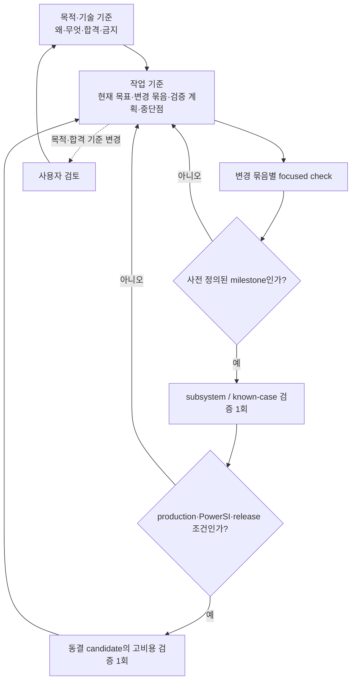

# SPD Decap PI Evaluator 목적·기술 기준

- 적용 제품: **SPD Decap PI Evaluator v0.23.0**
- 문서 버전: **1.38**
- W5 approved/machine-frozen source-before: `main` commit `027ac7a09a3eded15f45c41860945f9d4c7f488d`
- 상태: **G0 기준 문서** — [작업 기준](WORK_EXECUTION_BASELINE.md)과 함께 사용하며, W5 DONE·W6-BLOCK-A DONE·W6-BLOCK-B BLOCKED·W6-BLOCK-C DONE·W6-BLOCK-D DONE·W6-BLOCK-E DONE·W6-BASE DONE (260729 numerical FAIL)·W7-PHYS-AUDIT-MOUNTED-PATH DONE (negative/unclassified)·W7-PHYS-OWNER-TERMINAL-VIA-VS-SPATIAL DONE (negative/evidence-unavailable)·W7-PHYS-EVIDENCE-MISSING-PATH-COVERAGE DONE (negative/evidence-unavailable)·W7-PHYS-PRODUCTION-VIA-ROUTE-SOURCE-TRACE DONE (source-classified raw-base/global finite-route ownership; local calibrated half-branches not selected; mixed ownership fail-closed)·W7-PHYS-RAW-FINITE-VIA-RL-GENERATION-TRACE DONE (producer unclassified, high confidence)·W7-PHYS-GROUND-REACHABILITY-RL-PRODUCER-TRACE DONE (producer delegated/unclassified, high confidence)·W7-PHYS-VIA-SEGMENT-RL-MODEL-TRACE DONE (source-classified model; conditional multi-segment caller-contract bug confirmed; W6 exposure unknown)·W7-PHYS-MULTISEGMENT-RL-CALLER-FIX BLOCKED (fixture-contract red; production diff statically accepted and retained uncommitted)·W7-PHYS-CORRECTED-SUCCESSOR BLOCKED (static REJECT; zero pytest executions)·W7-PHYS-CORRECTED-SUCCESSOR-2 DONE·W7-PHYS-W6-MULTISEGMENT-EXPOSURE DONE (source-classified evidence unavailable; actual exposure unknown)·W7-PHYS-PLANE-SHEET-NONUNIFORM-RL-SOURCE-TRACE DONE (local stamps source-classified; Maxwell partial generation external/unclassified)·W7-PHYS-MAXWELL-PARTIAL-SOURCE-TRACE DONE (local adjacent-gap dispersive admittance classified; Maxwell C/dispersion/load/solver insertion external)·W7-PHYS-MAXWELL-CAPACITANCE-PRODUCER-TRACE DONE (exact 2D polygon-overlay lumped parallel-plate Maxwell C source-classified; W6 inputs/asset fidelity external)·W7-PHYS-PLANE-SHEET-RL-REUSE-DISCOVERY DONE (canonical rg once, candidates found; no reuse/production proof)·W7-PHYS-COPPER-SURFACE-IMPEDANCE-REUSE-TRACE DONE (surface-impedance constitutive law and MFDM stamp source-classified; W6 reuse unclassified/STOP)·W7-PHYS-SURFACE-PATCH-PLANE-REUSE-TRACE DONE (surface-patch local solver/operator source-classified; whole-solver W6 compatibility reuse unclassified/STOP)·W7-PHYS-W6-PLANE-SHEET-REIMPLEMENTATION-DESIGN BLOCKED (design before coding; replacement profile decision frozen)·W7-PHYS-W6-PLANE-SHEET-ADAPTER-BINDING-TRACE BLOCKED (profile/fallback, worker/cache, raw geometry/material provenance, differential nullspace/final rail-order Zii, and no-double-counting owner transition remain external)·W7-PHYS-W6-PLANE-SHEET-INTEGRATION-BINDING-TRACE BLOCKED (source-classified; five acceptance items UNPROVEN; stopped at whitelist-outside delegates)·W7-PHYS-PROSPECTIVE-RUNTIME-TERM-EVIDENCE BLOCKED/YAGNI·W7-PHYS BLOCKED·ACTIVE NONE
- 최종 개정: 2026-08-26 (Asia/Seoul)

## 1. 문서 역할과 권위

이 문서는 프로그램의 **왜**, **무엇**, **합격의 의미**, **넘지 말아야 할
경계**를 고정한다. 작업 목록, 구현 순서, 진행 상황, 검증 실행 기록은 이
문서에 누적하지 않는다. 그것들은 추후 별도로 만들 **작업 기준 문서**에서
관리한다.

권위는 두 축으로 구분한다.

1. **목적과 우선순위:** 이 문서가 최우선이다. 작업 기준 문서와 개별 계획은
   이 문서를 변경하거나 우회할 수 없다.
2. **현재 구현과 결과 사실:** exact commit의 source, hash-bound input/output
   artifact, 실행 log가 요약 문서보다 우선한다. 코드가 이 문서와 다르면
   코드가 옳다는 뜻이 아니라 해결할 불일치가 발견된 것이다.

과거 release note, 연구 문서, PRD, session log는 증거와 결정 이력이다.
현재 목적이나 현재 통과 상태를 자동으로 정의하지 않는다. 목적, 수치 합격선,
제품 sign-off 범위를 바꾸려면 사용자 검토와 이 문서의 명시적 개정이 필요하다.

## 2. 최우선 목적

> **완성된 SPD 도면에서 source-derived 물리·연결 근거만 사용하여 single-rail
> driving-point impedance `Zii`를 계산하고, 공급된 PowerSI 결과와 비슷한
> 정확도를 새로운 설계에도 재현할 수 있는 알고리즘과 제품 workflow를
> 확립한다.**

PowerSI Touchstone은 외부 비교 자료다. PowerSI 응답을 이용해 R/L/C, 재료,
geometry correction 또는 설계별 보정값을 fitting하지 않는다. 목표는 특정
파일 네 개를 맞추는 것이 아니라, source evidence에서 일반화되는 계산법을
확립하는 것이다.

이 프로그램은 pre-design 판단 도구다. PowerSI, SIwave, full-wave field solver,
DRC, 제조 또는 sign-off 도구를 대체한다고 주장하지 않는다.

## 3. 목적 우선순위

앞선 항목을 뒤의 항목과 교환하지 않는다.

1. **외부 정확성 및 일반화:** rail별 magnitude, phase, resonance, complex error가
   승인된 PowerSI 비교 기준을 만족해야 한다.
2. **물리·증거·수치 건전성:** source provenance, topology ownership, passivity,
   reciprocity, conservation, conditioning과 convergence가 설명 가능해야 한다.
3. **실사용 가능성:** 목표 장비에서 시간, memory, 취소, 저장 및 복구가
   실용적이어야 한다.
4. **보조 workflow:** De-cap Distribution, UI, workbook, AI 보조 분석은 위 세
   목적을 지원한다. 그 자체가 정확성 목표를 대체하지 않는다.
5. **배포:** installer와 release는 앞선 gate를 통과한 범위만 전달한다.

성능 최적화는 틀린 물리 모델을 빠르게 만드는 근거가 될 수 없다. Distribution
호환성이나 UI 편의 작업을 최우선 정확성 과제로 승격하려면 사용자 승인이
필요하다.

## 4. 제품 입력·출력 경계

| 구분 | 현행 역할 | 경계 |
|---|---|---|
| Raw SPD | geometry, stack-up, material table, net, node, trace, via, plane artwork, Device/Decap source | 원본을 수정하거나 덮어쓰지 않음 |
| `.spdpi` | source identity, scenario state, normalized attachment와 Original baseline 보존 | raw SPD 자체를 내장하지 않으며 source/hash 불일치 시 재사용 금지 |
| Decap model | passive two-terminal branch와 assignment | PowerSI 응답으로 parameter fitting 금지 |
| Distribution workbook | format 5 Target/Tolerance 및 policy 교환 | format 1–4는 현행 exact-layer 계약으로 직접 import하지 않고 source SPD에서 재-export 필요 |
| PowerSI Touchstone | 외부 complex impedance 비교와 promotion 판단 | production network 구성·parameter fitting 입력이 아님 |
| Evaluation 결과 | Original/Tuned `Zii`, target 비교, plot/table/CSV | 통과한 evidence scope 밖의 정확성 또는 sign-off 주장 금지 |
| Distribution 결과 | immutable landing에서의 assignment planning, audit, workbook/CSV | SPD via/plane artwork를 실제로 고치지 않으며 제조·DRC·SI sign-off가 아님 |

## 5. 현행 기술 기준

### 5.1 Evaluation

- Desktop 기본 profile은 `layerwise_admittance_v1`, 표시명은
  **Layer-surface terminal-complete network**다.
- 현행 solver identity는 `modal-mvp-0.8.5`, compiler algorithm은
  `layer-surface-adjacent-y-island-finite-via-termination-kron-v8`이다.
- retained physical `(layer, NET)` artwork surface를 독립 node로 두고, 인접
  dielectric gap의 ordered artwork에서 Maxwell admittance block을 만든다.
- source-observed same-NET Trace/Via connectivity와 ownership-resolved finite
  Via R/L만 결합한다. Device terminal과 Decap loop branch의 소유권을 substrate와
  중복하지 않는다.
- 모든 내부 interface는 하나의 sparse global-Y system에서 Schur/Kron
  reduction하며 외부 Device port의 open-port `Zii`를 읽는다.
- **Legacy modal**은 명시적 rollback/regression profile이다. source evidence가
  부족할 때 Layerwise가 몰래 Legacy로 fallback해서는 안 된다.
- PowerSI는 network compile이나 parameter 생성 중 읽히지 않는다.

세부 공식과 modeling 설명은 [Evaluation Accuracy and Modeling
Boundary](EVALUATION_ACCURACY.md)에 둔다. 현행 Layerwise는 source-derived
quasi-static circuit model이며 다음을 충분히 표현하지 않는다.

- lateral Trace impedance와 plane-sheet nonuniform R/L
- Via return/mutual coupling, pad/anti-pad field와 copper spreading
- inter-rail/site transfer coupling, DC IR drop, DGND tie impedance
- general multiport/full-wave field behavior

### 5.2 De-cap Distribution

- 물리적 Decap/PWR Via landing XY와 source plane artwork는 불변이다.
- candidate는 retained target PWR artwork와 source evidence로 eligibility를
  판정한다. non-TOP 이동은 현행 v0.23 transition evidence/gate를 통과해야 한다.
- 결과는 assignment planning이다. 필요한 Via stack retarget/rebuild를 실제
  source SPD에 적용했다는 뜻이 아니다.
- optional signal-routing protection은 기본 OFF이고 현재
  `SIGNAL_NET_ONLY` width-resolved Trace scope다. routed PWR/GND, signal Via,
  pin, pad, fanout 전체를 인증하지 않으므로 DRC-safe 결과로 승격하지 않는다.
- 자세한 수량, topology, preview/apply 규칙은
  [De-cap Distribution 변동 규칙](DECAP_DISTRIBUTION_RULES.md)에 둔다.

### 5.3 Persistence, UI와 독립성

- source identity, scenario state, solver/profile/compiler identity가 다르면
  cache와 artifact를 공유하지 않는다.
- `.spdpi`를 다시 열 때는 scenario가 가리키는 외부 raw SPD payload의 size와
  SHA-256이 일치해야 한다. 따라서 `.spdpi`를 raw source 없이 완전히
  self-contained인 project로 설명하지 않는다.
- immutable Original **configuration**과 계산된 Original **result curve**를
  구분한다. 현행 기본 Layerwise Original result는 run마다 다시 계산되므로,
  저장된 baseline curve를 자동 재사용한다고 주장하지 않는다.
- Original/Tuned 양쪽은 같은 builder-time connectivity/modelability 경계로
  검사하며, 차단된 rail은 결과에 `NOT evaluated`로 남겨야 한다.
- 장시간 parse, compile, solve, save/load는 GUI thread 밖에서 수행하고 progress,
  cancellation, stale-result rejection을 보존해야 한다.
- 프로그램명과 버전은 title bar와 installer metadata에서 쉽게 식별 가능해야
  한다.
- runtime에 다른 PI Calculator 또는 `probe-card-mlo-pdn`을 설치·import·갱신하지
  않는다. 세부 경계는 [Embedded evaluation core](CORE_EXTRACTION.md)에 둔다.

## 6. 증거와 상태 표기

`passed` 한 단어만 사용하지 않는다. 모든 중요한 주장은 최소한 다음 세 요소를
가진다.

| 요소 | 허용 예 | 의미 |
|---|---|---|
| 적용 대상 | `current`, `historical`, `planned` + commit/profile/input hash | 어느 구현과 자료에 적용되는가 |
| 증거 상태 | `verified`, `provisional`, `unknown` | artifact와 재현 범위가 충분한가 |
| 실행 결과 | `passed`, `failed`, `blocked`, `not_run` | 해당 범위의 판정 또는 미실행 상태 |

`verified + passed`도 명시된 coupon, parser, import 또는 gate 범위만 통과했다는
뜻이다. product accuracy, performance, release까지 자동 승격하지 않는다.

### 6.1 G0 작성 시점의 상태

| 주장 | 적용 대상 | 증거 상태 | 실행 결과 | 해석 |
|---|---|---|---|---|
| 제품명·버전 identity | current v0.23.0 / `0f24363c` | verified | passed | source, title, package, installer metadata 범위 |
| production-size import·save·92-rail solver entry | current v0.23.0 attestation | verified | passed | import/save/entry 범위에 한함 |
| 같은 attestation의 frequency solve·Touchstone comparison | current v0.23.0 | verified | not_run | `frequency_solves_executed=0`, `touchstone_read=false` |
| 현행 default solver의 PowerSI 정확성 | current v0.23.0 / 260729 retrospective | provisional | failed | completed manifest·sidecar와 offline verifier exit 2가 무결성을 확인했으며, bare/loaded macro가 각 limit을 초과했다; unseen/generalization은 아직 unknown/not_run |
| 260804 terminal-complete loaded correlation | historical v0.22.0 | provisional | failed | 문서상 critical-band `16.743 dB`, `44.28°`; raw report가 Git에 없어 current 결과로 재사용 불가 |
| 목표 장비의 시간·memory promotion | current | unknown | not_run | workstation 또는 import-only 수치로 승격 금지 |
| product-core CI 회귀 차단 | current bounded selection | verified | passed | V3 `361 passed, 1 skipped in 22.88s`, local v0.13 bundle skip |

현재 GUI의 `layerwise validation pending` 표시는 이 상태와 일치한다. 과거
validation 문서의 placeholder, report-level pass, 작은 backward residual,
import/save 성공은 PowerSI accuracy promotion이 아니다.

W5 이전에는 제품 수준 PowerSI 수치 합격선이 **미확정**이었다. W5에서
`1.00/1.25 dB` 등을 포함한 수치와 reference partition을 승인해
machine-frozen policy로 고정했다. 260729 retrospective는 completed numerical
FAIL이며, unseen/generalization과 260804/P5는 여전히 `unknown / not_run`이다.
local mesh/oracle convergence 수치를 제품 PowerSI gate로 전용해서는 안 된다.

### 6.2 W5-GATE approved/machine-frozen policy

W5 threshold, partition, run manifest는 사용자 승인으로 **machine-frozen**된
정책 계약이다. 수치와 분류는 여전히 역사적 측정 결과나 제품 sign-off가 아니다.
현재 등록된
자료에는 최종 generalization을 판정할 P5 unseen design이 없으므로, 최종 정확성
및 일반화 승격은 BLOCKED다.

- 승인 threshold: 100 kHz/1 MHz low-frequency offset, 100 kHz–100 MHz
  critical-band magnitude, rail별 max magnitude, phase, low-impedance complex
  error, dominant-peak 위치/진폭을 함께 판정한다.
- VQPS 10개 bare rail과 VTRIP/VINT/VCPU 6개 loaded rail은 별도 strata로
  유지하며 pooled 평균이나 한 strata가 다른 strata의 실패를 숨기는 판정을
  하지 않는다.
- 260729 development와 260804 retrospective design holdout은 모두
  retrospective evidence다. W5 freeze 당시 양쪽 등록 `D:\` raw 경로와 S92P
  경로는 존재/size 일치만 확인되었고 SHA는 재계산하지 않았다. 등록 baseline
  candidate는 없었고, 이전 blocked root에서 생성된 candidate는 W6-BASE controller
  output·scoring snapshot·retry에 재사용하지 않는다. 당시 승인된 W6 contract는
  brand-new root의 fresh import에서 시작해야 한다. B의 correlation은 historical
  evidence이고, C는 old candidate/import report를 정확히 한 번 read-only로
  열었고, correlation report는 사용하지 않았으며, fresh C root에만 썼다.
- Site0/site1/loaded는 blind sample이 아니라 노출된 strata다. P1 transfer/scale
  holdout은 160-port runner와 memory-safe preprocessing 부재로, P2는 현재
  weighting/reference-plane/de-embedding 미확정으로, P3/P4는 등록 경로의
  reference 부재와 multifactor/solver-state confound로 BLOCKED다. P5 unseen
  design은 없으며 최종 generalization에 필수다.

따라서 W6가 만들 수 있는 것은 260729/260804의 **비-blind
retrospective baseline**뿐이다. 이것을 unseen generalization 또는 제품
PowerSI 합격으로 재사용할 수 없다.

현재 trust identity는 benchmark base normalized SHA
`d43b868629464f408ea19362daa78fc369d2fd446cf3d458cfdc044ccbf57f08`, adapter
`6b7e399b4a843028ce754ac9154b8ce1a4575b1581c8d6007cebf26f94e6d440`, v6
validator `3f26b2aa7880cd9aff89cd5407643c934367764b590db98962cbc30bfa1b04a0`,
accuracy validator `8487be60cad523f9ed2ea1c61c57b580d9c2bb0fee598eea0bb938145b82151e`,
policy `6ea6e0b3327eaf828257334d7bb0211582fcc85ed632468223c7b566d0d3fd4d`,
controller `b7d5b87d97e1441ccaa950a1fbe50a49f599483e68acee99596eda7dd612262d`이다.
기존 v5 validator, known-case policy와 historical fixtures는 byte-identical로
보존되며, W6 controller는 `blocked_partial`에서 부분 결과를 점수화하지 않는다.

첫 W6 260729 실행은 source HEAD
`46d17dc73381d4292ea342d7a10e85d4f2e338f6`와 immutable root
`D:\SPD-Decap-PI-Evaluator-W6\46d17dc73381d4292ea342d7a10e85d4f2e338f6\260729`에
결속된다. tombstone `blocked_partial.json` SHA는
`b81525bd47744dc1ea5c75bb26f20ea354246ad88b8ce5bc9aef131cb50c09f7`이며 phase1
passed, phase2 exit2, v6 not_started, scoring refused였다. 이 결과는 old policy
`c362acb01ef28cefbbd1d32753f86bccafbdd53355b42eda83c03a6ea810698b`에 결속되므로
새 policy로 소급 검증하지 않고 root도 재사용하지 않는다. W6-BLOCK-A는 layerwise
diagnostic/correlation의 누락 terminal-complete argument를 adapter에서만 보강한
DONE 묶음이며 base/solver/pivot gate/physics는 변경하지 않았다.

## 7. Promotion gate

다음 gate는 순서대로 통과한다. 앞 단계 실패나 unknown 상태에서 뒤의 고비용
단계를 실행하거나 release claim으로 건너뛰지 않는다.

1. **Identity/evidence:** source, reference, port manifest, code, compiler,
   profile, material assumption, frequency policy hash가 완전하다.
2. **Physical/numerical integrity:** source ownership, limiting case, passivity,
   reciprocity, conservation, conditioning, residual과 frequency coverage를
   focused case로 판정한다.
3. **Subsystem/known-case:** 변경된 subsystem의 deterministic regression과
   catastrophe floor를 통과한다. 이는 외부 정확성 승격이 아니다.
4. **Frozen candidate:** 관련 변경 묶음과 설정을 동결한 뒤 end-to-end
   frequency solve와 artifact 생성을 완료한다.
5. **External accuracy/generalization:** development, reserved holdout, 최종
   unseen design을 분리해 rail별 magnitude RMS/max, phase RMS/max, resonance
   위치·진폭, low-impedance complex error를 판정한다. 평균이 한 rail의 실패를
   숨길 수 없다.
6. **Performance/product/release:** 목표 장비의 wall time, process-tree memory,
   cancellation, save/export, GUI response와 installer workflow를 판정한다.

정확성 후보가 동결되기 전에 acceleration, adaptive sampling 또는 MOR 결과를
정확성 개선으로 해석하지 않는다. source-derived 물리 변경은 한 번에 한 owning
block만 바꾸고, 어떤 error component를 줄이려는지 사전에 명시한다.

## 8. 검증 비용을 통제하는 불변 원칙

구체 명령, 예상 비용, 최대 재시도 횟수와 중단 조건은
[작업 기준 문서](WORK_EXECUTION_BASELINE.md)에 적는다. 이 문서에서는 다음
원칙만 고정한다.

- 작은 수정마다 전체 테스트, production SPD, PowerSI correlation, installer를
  반복하지 않는다.
- 관련 수정을 하나의 원인·결과 묶음으로 닫고 focused check를 수행한 뒤,
  사전 정의된 milestone에서 subsystem 검증을 한 번 실행한다.
- production/PowerSI 전체 검증은 solver 의미, profile, threshold와 변경 묶음이
  동결된 candidate마다 원칙적으로 한 번 실행한다.
- 낮은 단계가 실패하면 원인을 작은 재현으로 축소한다. 전체 실행을 디버깅
  수단으로 사용하거나 원인 변경 없이 같은 고비용 실행을 반복하지 않는다.
- commit, input hash, profile/compiler, 설정과 판정 환경이 모두 같을 때만 기존
  증거를 재사용한다. 하나가 달라지면 상태를 `unknown`으로 되돌리되, 즉시 전체
  검증을 실행하지 않고 다음 필요한 milestone에 배치한다.
- `not_run`, `reused`, `not_required`를 구분해서 기록한다.
- 문서만 바뀐 단계에서는 link, Markdown structure와 diff만 검사한다. 문서 변경을
  이유로 solver나 installer 검증을 실행하지 않는다.

## 9. Fail-closed와 비주장

- source, geometry, topology, terminal, workbook, cache 또는 result identity가
  불일치하면 재사용하지 않는다.
- 누락·모호한 source evidence를 좌표 clamp, 임의 연결, fitted value 또는
  silent fallback으로 숨기지 않는다. 명시적으로 versioned fallback을 지원하는
  경우에는 그 범위와 confidence를 결과에 표시하고 exact-source 주장에 사용하지
  않는다.
- Original/Tuned 중 한쪽이 build되지 않으면 완전 비교로 표시하지 않는다.
- 실행하지 않은 solve, rail 또는 reference 비교를 0, pass 또는 evaluated로
  기록하지 않는다.
- 특정 rail, 한 평균값, 한 보드 또는 한 PowerSI 파일의 개선을 일반 정확성으로
  확대하지 않는다.
- Distribution planning 결과를 as-built connectivity, DRC, 제조 또는 PI
  sign-off로 부르지 않는다.
- AI는 solver 결과나 design state를 직접 변경하지 않는다.

## 10. 두 기준 문서를 이용한 작업 방식

새 작업과 context가 재개될 때 기본 입력은 다음 두 문서로 제한한다.

1. 이 **목적·기술 기준 문서**
2. [**작업 기준 문서**](WORK_EXECUTION_BASELINE.md)

필요한 subsystem 문서와 source는 현재 작업 범위에 따라 선택해서 읽는다. 과거
연구 문서 전체를 세션 시작 조건으로 삼지 않는다.

작업 기준 문서는 최소한 현재 목표, 제외 범위, 변경 묶음, 해당 파일/함수,
검증 단계와 실행 조건, 예상 비용, 최대 재시도, 중단점, evidence identity,
결과와 다음 결정을 기록해야 한다. 작업 기준 문서는 목적이나 합격선을 임의로
바꾸지 못한다.

목적에서 벗어난 문제가 발견되면 별도 후보로 기록할 수는 있지만 현재 작업을
중단하고 확장하지 않는다. 목적 또는 수치 gate 변경이 필요하면 사용자 검토
전까지 작업을 멈춘다.

## 11. 관련 문서와 해석 범위

- [Evaluation Accuracy and Modeling Boundary](EVALUATION_ACCURACY.md): 현행
  Evaluation 수식·modeling 상세. 일부 과거 validation 서술은 역사적 범위다.
- [Evaluation Solver Deep-Research Decision Record](EVALUATION_SOLVER_DEEP_RESEARCH_2026-08-04.md):
  accuracy-first 연구 방향과 후보 기술의 역사적 결정 기록.
- [Evaluation Algorithm Research State](evaluation-research/RESEARCH_STATE.md):
  상세 연구·실행 이력. current product promotion 근거로 자동 사용하지 않는다.
- [Bounded Baseline Protocol](evaluation-research/BASELINE_PROTOCOL.md): 상태 분리와
  단계형 baseline의 역사적 프로토콜.
- [Layer-Surface Validation Record](EVALUATION_LAYER_SURFACE_VALIDATION_2026-08-06.md):
  named input과 과거 실행 기록. `TO_FILL` 구간이 있어 완료된 current release
  evidence로 인용하지 않는다.
- [De-cap Distribution 변동 규칙](DECAP_DISTRIBUTION_RULES.md): 현행
  Distribution 상세 계약.
- [Embedded evaluation core](CORE_EXTRACTION.md): standalone/runtime 독립성.

## W5/W6 implementation closure

W5 policy and implementation closure are machine-frozen and DONE. W6-BLOCK-A is
DONE; W6-BLOCK-B is BLOCKED after a deterministic pivot reproduction,
W6-BLOCK-C is DONE after preserving deterministic factor/matrix context,
W6-BLOCK-D is DONE after recording a sparse raw-system condition lower bound,
and W6-BLOCK-E is DONE after classifying and gating the rejected factor. W6-BASE
is DONE for the single 260729 run from clean `main` HEAD
`fb36288781dcc0b884950ef5a486c474090ceebd`: the completed manifest/sidecar was
verified offline with exit 2 and the numerical result is FAIL. Bare macro was
`1.7071112227372152` and loaded macro `15.910646842123072`, both above the 1.0 dB
limit. The product's highest purpose remains calculation with accuracy comparable
to PowerSI; this is retrospective evidence only. Accuracy for unseen/generalization
remains `unknown / not_run`, P5 is mandatory for final signoff, and 260804 was not
run. The completed root is
`D:\SPD-Decap-PI-Evaluator-W6\fb36288781dcc0b884950ef5a486c474090ceebd\260729`;
manifest SHA `2b14f90e762abc49833518137812e8fc97fcde0e9c145795b7384210cfd9f5de`,
sidecar SHA `0d103e0ad47df80641fac0952a35a6eaa56cc9fdb71be24661903e451926e932`,
and correlation SHA `969e40046e3a099d09557ba7500693460362336d76b067962436bd3b5177abc4`.

W6 production authority is consumed by the completed 260729 numerical FAIL. The prior
W7 frozen-artifact audits are complete and negative/unclassified. The completed
`W7-PHYS-PRODUCTION-VIA-ROUTE-SOURCE-TRACE` static source trace classifies the production
ownership as raw-base/global finite-route ownership in the v4 scenario network;
`local_calibrated_via_half_branches` was not selected and mixed ownership is
fail-closed. Confidence is high and source-proven, but this does not prove certificate
R/L accuracy, forward/PowerSI accuracy, or a causal terminal-Via error owner. At the 17D
closure active work was NONE; the current successor remains the sole ACTIVE item. A future
260729 production rerun requires
the user to activate and complete a new exclusive-owner classification item selecting
exactly one source-derived block, followed by exactly one physical change, focused
evidence, and a new gate. This does not authorize remote/release/installer work,
retries, old-root W6-BASE reuse or mutation, threshold weakening, fallback,
reordering, port movement, or physics changes.
Before any future W6 run, the completed W6-BLOCK-E gate remains a prerequisite. C and D already consumed their
exactly-one old candidate/import reads and wrote only to fresh roots; E had one
production candidate/import invocation plus one separate orchestration ZIP
central-directory read, did not use the correlation report, and wrote only to its
brand-new diagnostic root. The old root remains forbidden for
W6-BASE/controller/scoring/retry/mutation. The next BASE run must use a new root,
controller-only execution, one-run/no-retry, and cannot start until that newly
user-authorized owner-classification/change/evidence/gate sequence closes. The local
bounded V3 result is a mirror of the required CI selection, not remote CI evidence.

The focused parity V1 was red once and green once (`1 passed in 0.88s`); V2 was
`10 passed in 2.13s`; current bounded V3 was `361 passed, 1 skipped in 22.88s`,
exit 0. The only skip was the unavailable local v0.13 SPD regression bundle at
`tests/test_spd_decap_scenario_io.py:1048`. D:/ input hash recomputation was not
performed; the external PowerSI solver was not run. For the first
`46d17dc...` blocked root only, Phase2 consumed the registered PowerSI Touchstone
but produced no completed comparison or score; the current `fb36288...` W6-BASE
root produced the completed numerical FAIL recorded above. Remote/full suite,
installer, release, and production rerun were not performed. The B diagnostic
reproduced the pivot but did not classify its root cause. C's exact evidence is the
fresh root
`D:\SPD-Decap-PI-Evaluator-W6-Diagnostics\e9a1ca124d94f1bd0192d519aa22996e87266ac5\260729-vtrip0-1khz`:
exit 1 after about `667.19s`, no report, stdout SHA
`e3b0c44298fc1c149afbf4c8996fb92427ae41e4649b934ca495991b7852b855`, stderr SHA
`8468b8f0798dc754c2c5926cc01dbe26d612b9cba7867efe4fa96f389bf89fc8`. It retained
`756888` nodes and `2904010` nonzeros; local magnitudes were
`2.467e-13..1.575e+08`, pivots `3.290e-10..8.366e+07`, ratio `2.543e17`,
backward residual `6.808e-20`, and matrix SHA
`709efcd1b8857c1ab9c4f73bec20cc7ec7d144cd9bfd32b9ee1657b956587524`. Old inputs
and repo were unchanged. D now adds sparse condition lower-bound evidence only
inside that existing pivot failure branch; its V1 red/green and V2 results are
recorded in the work document. No threshold relaxation, fallback, reordering,
port, or physics change is allowed. D's diagnostic root was
`D:\SPD-Decap-PI-Evaluator-W6-Diagnostics\ac828f306da4ca4fa4e4c80c2cb77cadf0d3185f\260729-vtrip0-1khz-cond1`:
exit 1 after `668.63s`, no report; inverse lower bound `3.040e+09`, condition
lower bound `9.572e+17`, stderr SHA
`d40503688889e51afd00504321ca37e032ff6b81fcb800c3bb51d722abab5c58`. The raw
system is therefore proven to have condition lower bound at least `9.572e+17`;
the tiny backward residual does not prove forward, assembly, or PowerSI accuracy.
E's analytic V1 was red once (`1 failed in 0.93s`) and corrected green once
(`1 passed in 0.72s`); two intermediate source-indentation/syntax collection
failures occurred. The first valid exact V2 was `129 passed, 2 failed in 3.89s`,
then `130 passed, 1 failed in 4.63s` after the test-only correction; two typo
attempts collected zero tests. The final valid bounded V2 was `131 passed in 4.13s`,
exit 0. This is local structural evidence, not PowerSI accuracy evidence.
E applies row-scaled `Aeq=SAS` with `S=diag(1/sqrt(row_norm))`, solves `beq=S*b`
then maps `x=S*y`, and retains original-coordinate `A@x-b` residuals. The
existing pivot ceiling and no-fallback boundary are unchanged. The single E
diagnostic at `D:\SPD-Decap-PI-Evaluator-W6-Diagnostics\f23c5b241d522d05f50f6de05bd6819723b7d3db\260729-vtrip0-1khz-equilibrated`
completed with exit 0 in `697.35s`: report `6464` bytes/SHA
`70e1264e6e4223da9c8715ade5695d02f1ab951aa36b418e5b067a3145fd2e9f`, stdout
`281` bytes/SHA `da71076cad8e6c7308b46bcfc42b8ef0395b430b81cb78dcb905607c4a5d783d`,
stderr `0` bytes/SHA `e3b0c44298fc1c149afbf4c8996fb92427ae41e4649b934ca495991b7852b855`.
The completed report is solver `modal-mvp-0.8.5`, profile
`layerwise_admittance_v1`, rail `ADC_VDD_055_VTRIP/0`, frequency `1000 Hz`, with
finite admittance `[0.13437046955500517, 12.100420788716686]`, scaled pivot
`9.966405069248625e9 <= 1e13`, original residual
`3.919670457452144e-17 <= 1e-9`, one frequency solve, Touchstone `false`, and
adaptive sweep `false`. Candidate/import bindings matched their immutable inputs;
the ZIP central directory was opened read-only once during orchestration, but only
one production diagnostic invocation occurred. No retry or edit was performed.
This proves the numerical promotion gate only, not model-form or PowerSI accuracy.
E is DONE; W6-BASE is DONE for the 260729 numerical FAIL. W7-PHYS-AUDIT-MOUNTED-PATH
is DONE negative/unclassified: the read-only audit preserved cap/Via/spatial provenance
but its cap-only peak/bin prerequisite failed on all six loaded rails. No exclusive
source-derived owning term was selected, so W7-PHYS is BLOCKED; at that closure,
active work was NONE,
and no physics code change is authorized.

The single W7 mounted-path audit run (tool commit `1af7dd7a1150749a579b55623415ee8abedefda4`)
returned exit 2 after 62.98s with `diagnostic_fail`, selected block `null`, causal
owner `null`, and `owner_status=unclassified`. The versioned terminal-Via audit
commit `5d3846cd85b4b5631440dc7f84f8f865900e7bcd` was then run exactly once from
clean `main` against a new root
`D:\SPD-Decap-PI-Evaluator-W7\5d3846cd85b4b5631440dc7f84f8f865900e7bcd\260729`;
it exited 2 after 82.84s with exact stderr `integrity failure: target Via path evidence is missing`,
created no JSON, and produced no owner field. At least one target landing therefore
lacks persisted path evidence; no rail/Via count, R/L, or owner claim is made. The
scientific owner remains unclassified and no physics change is authorized.

`W7-PHYS-OWNER-TERMINAL-VIA-VS-SPATIAL` is DONE (negative/evidence-unavailable).
The completed follow-up was `W7-PHYS-EVIDENCE-MISSING-PATH-COVERAGE`; it was a
read-only coverage question, not a retry, and inspected only the existing script,
test, and frozen candidate/import/correlation inputs. It must report 8,986 selected
decaps across six rails with terminal/unit/Via states `available`, `missing`, or
`trace_NA`; only available paths could contribute all-segment R/L/classification,
but none were available, with
missing/trace values explicitly N/A. No legacy imputation, owner selection, or physics
authorization is permitted. A normal coverage report is diagnostic-complete exit 2,
with owner null/unclassified; its report schema is v2 and trust conflicts remain no-output.

The corrected v2 result from commit `66b2e2d5c39fe24d224544ffb590a87bc6f2a9aa`
ran exactly once for 82.08s at
`D:\SPD-Decap-PI-Evaluator-W7\66b2e2d5c39fe24d224544ffb590a87bc6f2a9aa\260729`.
Its JSON is 527477 bytes, SHA-256
`2816958e48d3713d179d7420834ad9ff97b177ba661848f1646def104c867a14`; all
19,218 inventoried terminal Vias were missing (available 0, trace_NA 0), so this
is coverage evidence only and creates no accuracy PASS/FAIL. The subsequent
`W7-PHYS-PRODUCTION-VIA-ROUTE-SOURCE-TRACE` source V0 used only the documented 11
source files, with no artifact/test/solver/edit execution, and closed source-proven:
v6 → base benchmark → `_build_bound_layerwise_source_model` → v4-only termination
factory → required v4 certificate → scenario network → retained base
`finite_parallel_rl` links plus cap-only termination manifest. Local calibrated
half-branches were not selected and mixed ownership is rejected. The 2026-08-25
six-file source V0 and one Sol review are complete. `spd_adapter.py` persists
reachability-produced drill/material/segment length/R/L/count from
`recover_spd_ground_reachability`; `reduced_conductor.py` preserves source-Via
parallel count without inventing R/L; `finite_route_reducer.py` performs exact series
`fsum` aggregation and emits equivalent count 1; `finite_via_layerwise.py` validates
`raw_count = parallel_path_count * per_path_via_count` and hands precomputed R/L to
`finite_parallel_rl`; `compiled_topology_asset.py` persists/reloads those fields.
`via_peec.py` is isolated diagnostic-only, and the other five files contain no
producer binding to it. Therefore 17E is DONE as `producer unclassified (high
confidence)`: production formula/unit conversion and runtime producer binding remain
unknown. No artifact/raw-SPD/Python/import/test/solver/edit execution, PowerSI,
forward-accuracy, causal-owner, threshold, physics, or retry claim is made. The next
candidate `W7-PHYS-GROUND-REACHABILITY-RL-PRODUCER-TRACE` is DONE as
`producer delegated/unclassified (high confidence)`. The one-file V0 found local
geometry/provenance assembly but no local R/L formula or fallback; it delegates to
`src/spd_decap_pi/_core/via_model.py::estimate_via_segment_rl` with length, drill,
material, layer endpoints, and stackup, returning Ω/H or incomplete/None on exception.
`physical_model_for_canonical` may build a multi-segment chain (`:7853-7861`), while
`finite_physical` passes only `segments[0].length_um` with the full layer endpoints;
there is no local `len==1` invariant. This unresolved delegate contract is not called
a bug, and complete path-length modeling is not claimed. The next candidate
`W7-PHYS-VIA-SEGMENT-RL-MODEL-TRACE` is DONE as a source-classified model. The one-file
V0+Sol review bound sigma `5.959e7`, hollow area `pi*d*min(20,d/4)*1e-12`, qualifying
solid area `pi*(d/2)^2*1e-12`, R/L equations, legacy fallback, and Ω/H outputs. It
confirmed a conditional caller-contract bug: `spd.py` may construct multiple segments
without a len-one guard, then passes `segments[0].length_um` with full endpoints; the
one-segment model cannot recover full span. W6 exposure is unknown; this is not an
accuracy or causal-owner claim. The consumed focused pytest execution boundary was clean
`main` HEAD `17836612ceaf09adf83237ec377c845fd1b6ecfd`; it ran exactly once and failed: exit 1,
`1 failed in 2.13s` (wall 3.40s), expected two segments but the fixture produced one correct
`Signal$TOP→Signal$PWR` segment of 220um. The production diff remains statically accepted
and uncommitted. The first static-reject/successor-2 retained-diff base is clean `main` HEAD
`0cbe18e6b7c36dbfd686a14439a164c12f4abccb`, exactly `src/spd_decap_pi/_core/io/spd.py` plus
`tests/test_io_spd.py`, with zero new pytest executions and no pytest artifact/result root.
`W7-PHYS-MULTISEGMENT-RL-CALLER-FIX` remains BLOCKED; its corrected
successor was statically REJECTED with zero pytest executions because the long Via used
`DR-0102_60` without a GND PadDef and the long stackup omitted intermediate PWR.
`17H-CORRECTED-SUCCESSOR-2` is DONE. The exact node ran once with exit 0, `1 passed in
1.08s` (wall ~2.07s), no rerun and no artifact/result root. Commit
`7fd8df954791b5a17229b49153d0f5dd57a248d2` contains exactly the production/test files;
the worktree was clean. The behavior claim is narrow: each persisted segment uses its own
geometry, completed tuples are fsum-summed, failures leave aggregate fields unavailable,
and each contribution is added once. W6 exposure, PowerSI/forward accuracy, causal ownership,
artifact/solver/production validation, and release readiness remain unclaimed. Next
`W7-PHYS-W6-MULTISEGMENT-EXPOSURE` is DONE as source-classified evidence unavailable:
the compact scenario quotient stores only schema/status, compiled SQLite stores aggregate
`finite_parallel_rl` links/count/R/L/owners without source `series_terms`, segments, or
`physical_model_status`, and production-complete surface certificates use a compiled-only
stub without the raw canonical certificate. Import/correlation/manifest data provide
identities and counts, not in-memory retained/suppressed/retarget rows. Therefore rereading
the candidate cannot classify old W6 first-segment versus all-segment execution. The only
allowed evidence budget here was D: root/candidate path+size metadata enumeration; candidate
outer hash, ZIP central/manifest, `scenario.json`, small reports, prior audit JSON, and all
Python/test/solver/production execution were zero. No exposure-present/absent, affected-term
or rail count, R/L delta, W6-cause, accuracy, causal-owner, or fix-benefit claim is made.
`W7-PHYS-PROSPECTIVE-RUNTIME-TERM-EVIDENCE` is BLOCKED/YAGNI and would require a separately
selected grounded physical change plus a new candidate/HEAD/root, one-run/no-retry term
digest/count/owner partition.

The completed 17J read-only item used clean `main` HEAD `9d8cb2e5e09c2cef49895cbaee3b23c66d305820`.
Its exact one-file whitelist was `src/spd_decap_pi/_core/solver/layer_surface_network.py`; one
source V0 and one independent Sol review were allowed, with Python/import/test/artifact/raw-SPD/
solver/production/edit at zero. The prior 17K item was limited to
`src/spd_decap_pi/_core/solver/uniform_c00.py` from clean HEAD `675a7d9ccb9240ab3c88aadcef5dbe059aef7bb3`.
The completed 17J question was whether the W6-bound layer-surface matrix stamps position/material-dependent
plane-sheet series R/L or current-spreading/nonuniform corrections, rather than only retained
artwork quasi-static Maxwell-Y. This is an observability ordering item, not a causal or physics
authorization claim; lateral Trace was not selected because its production integration is not
bounded.

17J is DONE: local stamps are source-classified, while Maxwell partial generation is external/
unclassified. Topology-only links are ideal vertical-node coalescence; incoming C[F] is remapped/
collapsed to dielectric-ratio `j2πf·C` S, finite vertical Via links use `count/(R+j2πfL)`, and
termination returns S. No local plane-sheet series R/L or nonuniform/current-spreading term was
found. 17K is DONE: local adjacent-gap dispersive admittance is classified by
`Ybulk=j2πf Σ[(Dk(1−jDf)/εr_nom) C_M]` (Hz/F/dimensionless inputs yield S), while Maxwell
C/dispersion/load/solver insertion remains external/unclassified. Grounding/Schur/modal(0,0)
replacement and numerical gates are reduction/validation, not extra physics; arbitrary caller
loads remain external/unclassified. 17L is DONE: exact 2D polygon-overlay lumped parallel-plate
Maxwell C is source-classified with `C=ε0·εr·A/d` (F) and Laplacian assembly; optional
nonadjacent opening coupling is an opt-in projected-aperture parallel-plate approximation.
There is no frequency/complex-Y, conductivity, sheet R/L, skin, nonuniform in-plane current, or
current-spreading term; W6 inputs/asset fidelity remain external. 17M is DONE: the canonical
`rg -n -i` discovery ran once (exit 0) and found candidate symbols in solver files, but no reuse
or production proof was made. At the 17M closure, the sole ACTIVE successor was
`W7-PHYS-COPPER-SURFACE-IMPEDANCE-REUSE-TRACE`, limited to one complete read of
`src/spd_decap_pi/_core/solver/mfdm.py` from clean HEAD `1bd942b7b6e85fecef1d6074826e00a45adb71b4`
and one Sol review; no implementation or W6 binding is implied. 17N is DONE: the surface-
impedance constitutive law and MFDM stamp are source-classified, with one-/two-face coth/csch
Ω/square behavior, DC `1/(σt)`, and high-frequency transfer tending to zero; W6 reuse is
unclassified/STOP. 17O is DONE: the surface-patch local solver/operator is source-classified,
but whole-solver W6 compatibility reuse is unclassified/STOP. Its ceiling is polygon clip/mesh
and constant-signature strips; scalar σ/t and dielectric provenance; copper helper + gap L +
dielectric C/loss differential nodal S; common-potential null/differential-only output; absolute
MNA rejected; gates/cache. Terminal/Via/pad/antipad/fringe/full-wave and whole-solver drop-in
compatibility were not proven.

17P is BLOCKED before coding. Its high-level decision is frozen as an explicit new
`layerwise_surface_patch_v1` profile, replacement rather than augmentation; the historical
profile remains unchanged with no automatic fallback. The new profile owns polygon C/loss,
lateral gap L, and sheet impedance; it disables old plane Maxwell C/ideal plane topology while
retaining finite Via and termination exactly once, and fails closed when evidence is missing.
The bounded core remains app v0.23.0; exact solver identity is pending. 17Q is BLOCKED because
profile/fallback, worker/cache, raw geometry/material provenance, differential nullspace/final
rail-order Zii, and no-double-counting owner transition remain external to its five-file trace.
17R is now **source-classified BLOCKED**. At clean main HEAD
`8451c4afca57fb46e89b7096026b281ba54bbf52`, the exact three files were each read once and no
other source was read. All five acceptance items were UNPROVEN: the opt-in no-fallback profile
and application enforcement are absent/outside scope; hash-bound plane input without solve-time
raw/full Scenario hydration is not established and the visible adapter retains a
`legacy_rail_template` fallback; balanced `N^H B=0`, stable rail/Zii and nullspace ownership are
delegated; the old Maxwell C/ideal disable seam with exactly-once Via/termination is absent or
delegated; and global OrderedDict/RLock caches leave single-worker/no-shared-mutable-cache
unproven. Sol accepted the fail-closed stop: no fourth read, automatic whitelist expansion,
coding, tests, or execution. User W6 reimplementation authority is recorded but cannot proceed
without an explicit new bounded source-whitelist/contract decision; production runs, old-root
reuse, release, and parent accuracy/causal promotion remain unauthorized.

Approval basis commit `027ac7a09a3eded15f45c41860945f9d4c7f488d` is distinct from
the caller-supplied exact current `main` HEAD required at a future W6 invocation;
the policy contains no implementation self-HEAD. The frozen historical v5
validator, known-case policy/fixtures, and base benchmark remain byte-identical.
W5 adds a versioned adapter boundary and a separate atomic BLAS evidence artifact;
W6 execution is controller-only and completed output is accepted only through the
offline `validate_powersi_accuracy.py --verify-sidecar` boundary. The benchmark
phase argv is internal controller evidence, not a direct user command.
The registered 260804 S92P SHA is
`cd103f42412c2a63518105d7e10fae8a0538c84982e1eddbfb74829a6972951b`; the missing
trailing `b` in the earlier draft was a registry transcription typo, not a new
hash computation.

Frozen historical v5 validator/policy/fixtures and base benchmark remain byte-identical.
W6-E atomically rotated the current v6→policy→accuracy-validator→controller trust
chain for solver `modal-mvp-0.8.5`; after the result commit, listed current identities
and the exact Git HEAD are frozen together. Current trust identities: base `d43b868629464f408ea19362daa78fc369d2fd446cf3d458cfdc044ccbf57f08`; adapter `6b7e399b4a843028ce754ac9154b8ce1a4575b1581c8d6007cebf26f94e6d440`; v6 `3f26b2aa7880cd9aff89cd5407643c934367764b590db98962cbc30bfa1b04a0`; accuracy validator `8487be60cad523f9ed2ea1c61c57b580d9c2bb0fee598eea0bb938145b82151e`; policy `6ea6e0b3327eaf828257334d7bb0211582fcc85ed632468223c7b566d0d3fd4d`; controller normalized source `b7d5b87d97e1441ccaa950a1fbe50a49f599483e68acee99596eda7dd612262d`.

## 12. 변경 기록

| 문서 버전 | 날짜 | 변경 |
|---|---|---|
| 1.2 | 2026-08-24 | W5-GATE의 승인 전 DRAFT threshold/partition/manifest 경계와 P5 generalization blocker를 명시. |
| 1.3 | 2026-08-24 | W5 machine-frozen implementation closure, adapter/BLAS artifact boundary, bounded V1/V2 evidence, W6 READY and accuracy unknown/not_run. |
| 1.4 | 2026-08-24 | trust-boundary correction과 controller-only/verify-only W6 boundary를 반영. |
| 1.5 | 2026-08-24 | 최종 V3 green 증거와 W5 DONE/W6 READY 상태를 동결. |
| 1.6 | 2026-08-25 | W6-BLOCK-A parity, blocked 260729 attempt, standing authorization과 W6-BLOCK-B pre-rerun boundary를 기록. |
| 1.7 | 2026-08-25 | W6-BLOCK-B diagnostic exit1과 W6-BLOCK-C deterministic pivot-context instrumentation을 기록하고 W6-BASE를 보류. |
| 1.8 | 2026-08-25 | W6-BLOCK-C 완료와 W6-BLOCK-D sparse condition lower-bound instrumentation을 기록하고 W6-BASE를 보류. |
| 1.9 | 2026-08-25 | W6-BLOCK-D 완료, W6-BLOCK-E row-scaled factorization 및 solver 0.8.5 trust rotation을 기록하고 W6-BASE를 보류. |
| 1.10 | 2026-08-25 | W6-BLOCK-E 단일 진단 exit0 및 수치 promotion gate를 기록하고 W6-BASE READY(미실행)로 전환. |
| 1.11 | 2026-08-25 | W6-BASE 260729 completed numerical FAIL과 integrity-valid offline exit 2를 기록하고 W7-PHYS mounted-path audit를 지정. |
| 1.12 | 2026-08-25 | W6 production authority consumed; W7 frozen-artifact owner audit와 one-physical-change/new-gate 순서를 고정. |
| 1.13 | 2026-08-25 | W7 mounted-path audit negative/unclassified 종료, owning block 미분류로 W7-PHYS BLOCKED 및 active NONE. |
| 1.15 | 2026-08-25 | terminal-Via 감사의 persisted path evidence 누락을 exit 2로 기록하고 W7-PHYS-EVIDENCE-MISSING-PATH-COVERAGE를 새 read-only active item으로 지정. |
| 1.16 | 2026-08-25 | corrected v2 coverage audit를 negative/evidence-unavailable로 닫고 W7-PHYS-PRODUCTION-VIA-ROUTE-SOURCE-TRACE를 유일한 ACTIVE static-trace item으로 지정. |
| 1.17 | 2026-08-25 | W7-PHYS-PRODUCTION-VIA-ROUTE-SOURCE-TRACE를 raw-base/global finite-route ownership으로 source-proven 종료하고 active NONE, 다음 producer-trace 후보 BLOCKED로 갱신. |
| 1.18 | 2026-08-25 | 사용자 승인으로 W7-PHYS-RAW-FINITE-VIA-RL-GENERATION-TRACE를 유일한 read-only ACTIVE producer trace로 지정하고 6-file whitelist와 비목표를 고정. |
| 1.19 | 2026-08-25 | 17E six-file source V0와 Sol review를 producer unclassified (high confidence)로 종료하고 active NONE, 17F ground-reachability producer trace 후보를 BLOCKED로 지정. |
| 1.20 | 2026-08-25 | 사용자 승인으로 17F ground-reachability R/L producer trace를 유일한 ACTIVE read-only item으로 지정하고 단일 파일 whitelist와 비목표를 고정. |
| 1.21 | 2026-08-25 | 17F one-file V0와 Sol review를 delegated/unclassified (high confidence)로 종료하고 active NONE, 17G via-segment R/L model trace 후보를 BLOCKED로 지정. |
| 1.22 | 2026-08-25 | 사용자 승인으로 17G via-segment R/L model trace를 유일한 ACTIVE read-only item으로 지정하고 단일 파일 whitelist와 완료 기준을 고정. |
| 1.23 | 2026-08-25 | 17G one-file V0와 Sol review를 source-classified model 및 conditional multi-segment caller-contract bug로 종료하고 active NONE, 17H caller fix 후보를 BLOCKED로 지정. |
| 1.24 | 2026-08-25 | 17H multisegment caller fix를 사용자 code+test authority 아래 두 파일 whitelist의 유일한 ACTIVE bounded V0로 지정. |
| 1.25 | 2026-08-25 | 17H focused fixture-contract node가 1회 red로 종료되어 production diff는 retained uncommitted로 보존되었고, corrected successor의 static REJECT(0 pytest) 후 17H-CORRECTED-SUCCESSOR-2를 사용자 pre-approval 아래 유일한 ACTIVE test-only correction으로 지정하며 exact HEAD/diff/node boundary를 고정. |
| 1.26 | 2026-08-25 | first corrected successor static REJECT를 기록하고 17H-CORRECTED-SUCCESSOR-2의 TOP/PWR/GND padstack·full-stackup test-only contract를 유일한 ACTIVE item으로 고정. |
| 1.27 | 2026-08-25 | 17H-CORRECTED-SUCCESSOR-2를 단일 focused PASS와 commit `7fd8df9`로 DONE 처리하고 W6 multisegment exposure 후보를 BLOCKED로 등록. |
| 1.28 | 2026-08-25 | W6 multisegment exposure를 source-classified evidence unavailable/actual exposure unknown으로 종료하고 prospective runtime-term evidence를 BLOCKED/YAGNI로 등록. |
| 1.29 | 2026-08-25 | W7-PHYS-PLANE-SHEET-NONUNIFORM-RL-SOURCE-TRACE를 유일한 ACTIVE one-file source V0/Sol review item으로 지정하고 W6 layer-surface 관측성 경계를 고정. |
| 1.30 | 2026-08-25 | 17J를 local-stamp source-classified/Maxwell-generation external-unclassified로 종료하고 17K `uniform_c00.py` source trace를 유일 ACTIVE로 지정. |
| 1.31 | 2026-08-25 | 17K를 local adjacent-gap dispersive admittance source-classified/Maxwell C·dispersion·load·solver insertion external-unclassified로 종료하고 17L `multilayer_capacitance.py` producer trace를 유일 ACTIVE로 지정. |
| 1.32 | 2026-08-25 | 17L을 exact 2D polygon-overlay lumped parallel-plate Maxwell C source-classified/W6 input fidelity external로 종료하고 17M solver-directory reuse discovery를 유일 ACTIVE로 지정. |
| 1.33 | 2026-08-26 | 17M canonical solver-directory `rg` discovery를 candidate-found/no-reuse-proof로 종료하고 `mfdm.py` copper surface-impedance reuse trace를 유일 ACTIVE로 지정. |
| 1.34 | 2026-08-26 | 17N을 surface-impedance constitutive law/MFDM stamp source-classified·W6 reuse unclassified/STOP으로 종료하고 `surface_patch_plane.py` caller trace를 유일 ACTIVE로 지정. |
| 1.35 | 2026-08-26 | 17O를 surface-patch local solver/operator source-classified·whole-solver W6 reuse unclassified/STOP으로 종료하고 17P W6 plane-sheet reimplementation design을 유일 ACTIVE로 지정. |
| 1.36 | 2026-08-26 | 17P를 명시적 `layerwise_surface_patch_v1` replacement profile 결정과 함께 BLOCKED로 닫고 17Q 5-file adapter binding trace를 유일 ACTIVE로 지정. |
| 1.37 | 2026-08-26 | 17Q를 외부 binding 미결로 BLOCKED 처리하고 `profiles.py`·`layerwise_network.py`·`spd_adapter.py` 3-file integration binding trace를 유일 ACTIVE로 지정. |
| 1.38 | 2026-08-26 | 17R 세 파일 완전 read trace를 다섯 acceptance UNPROVEN/source-classified BLOCKED로 닫고 active NONE 및 새 bounded source-whitelist/contract 결정 경계를 기록. |
| 1.1 | 2026-08-24 | `WORK_EXECUTION_BASELINE.md`를 두 번째 canonical 문서로 연결. |
| 1.0 | 2026-08-24 | v0.24 계획 중심의 Distribution–solver PRD를 제품 전체의 목적·기술 기준으로 개정. PowerSI 정확성 우선, 상태 어휘, 기술 경계, promotion gate, 검증 비용 통제와 two-document 작업 방식을 고정. |
