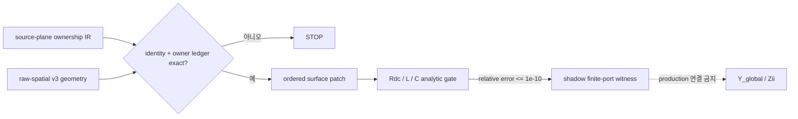

# SPD Decap PI Evaluator v0.23.1 — Source-derived physical IR

- 문서 버전: **1.64**
- 계약 상태: **ACCEPTED** — source-derived provenance/ownership prerequisite의 기술 기준
- committed 구현: `source-plane-ownership-ir-v1` + Phase 3 shadow consumer + v2 `contact_boundary` (`3b76af4`) + P0 (`4dc855a`) + P1 (`f823a53`) + P2 (`90f6b54`) + P3 (`b8a79f1`) + P4 base cut-set (`39fd4fa`) + P5 shadow rewire plan (`d7e7278`) + P6 scenario commutation audit (`6793bb2`) + P7 atomic recipe (`f1c2968`) + P8 topology embedding (`abf79cf`) + P9 nodal-block binding (`593e070`) + P10 component closure (`7f9c498`) + P11 supplemental solve gate (`e8d029a`) + ownership component-layer selector fix (`b0b90db`) + component-cardinality classifier (`6fc06dd`) + W7 owner-join closure (`2b27e30c6fe41f03281d3943568d0905d84d8af3`)
- runtime acceptance: **Phase 4와 P0–P10 focused PASS / Sol ACCEPT; P3 semantic STOP, P4 structural CLOSED, P5 PLANNED, P6/P7 PASSED, P8 materialized, P9 bound, P10 component-closed; P11 focused test PASS / numerical result STOP; W7 owner-join commit `2b27e30c6fe41f03281d3943568d0905d84d8af3` DONE/ACCEPT with producer-only corrected rerun `1 passed in 1.52s` (consumer not rerun)**. This is read-only prerequisite evidence and does not claim actual production global-multi compile, original-SPD success, or PowerSI improvement.
- production 상태: solver, owner-off, `Y_global`, `Zii` **unchanged**
- 현재 작업 상태: **Actual-P0/R1/R2, R2-MULTI-TOPOLOGY-DIAG-01, Recovery-01과 DSU-01–05 DONE/STOP, FIX-01/FIX-02 DONE/ACCEPT**다.
  DSU-05는 `STOP_MULTIPLE_NOT_REPRODUCED`; W7-PHYS BLOCKED다. OWNERSHIP-COUNT-DIAG-01/-02는 DONE/`STOP_RESOURCE_OR_CANCELLED`이다. STREAMED-IR-300K-FIX-01은 `STOP_TEST_COLLECTION_SYNTAX`, collection-fix successor는 `STOP_TEST_FAILURE_AND_RUNTIME_BUDGET`, validation-runtime fix는 `ACCEPT_WITH_OUTPUT_LIMITATION`, lightweight acceptance는 `STOP_TEST_ORACLE_COMPOUND_MUTATION`, oracle-fix successor는 `STOP_PRODUCT_SELECTION_VALIDATION_OMISSION`, material-selection fix는 `STOP_PRODUCT_STREAMED_HANDOFF_REGRESSION`, streamed-handoff fix는 `STOP_TEST_CAPTURE_CONNECTION_LEAK`, capture-connection fix는 `STOP_TEST_TAMPER_CONNECTION_LEAK`, tamper-connection fix는 `STOP_TEST_PROVISIONAL_CAP_SCOPE_LEAK`로 DONE이며 provisional-cap oracle fix도 DONE/ACCEPT다. Integrated hardening은 Sol 최종 `STATIC_ACCEPT` 뒤 exact 21-node 단일 실행에서 Unicode fixture가 rail을 만들지 못해 **DONE / STOP_TEST_UNICODE_FIXTURE_RAIL_FORMATION**이다. 사용자가 승인한 grammar-valid test-only successor **W7-PHYS-OWNER-JOIN-OWNERSHIP-STREAMED-IR-UNICODE-FIXTURE-RAIL-FORMATION-FIX-01**은 Sol `STATIC_ACCEPT`와 새 21-node PASS를 얻어 **DONE / ACCEPT / READY_FOR_EXPLICIT_STAGE_AND_COMMIT**다. Original-SPD EVIDENCE-01/-02/-04/-05는 retry-0 DONE/STOP, EVIDENCE-03은 `STOP_UNEXPECTED`로 DONE/STOP이고 quotient-scope FIX-01, terminal pad-layer test-oracle FIX-01과 compact-request-bound FIX-01은 DONE/ACCEPT다. P12는 NO-GO다.
- PROVISIONAL-CAP-ORACLE-FIX-01은 request-only synthetic cap 48과 authoritative final cap의 단계 경계를 복원했고 exact 18-node lightweight scope를 단일 invocation에서 통과했다. 그 좁은 증거는 보존되지만 누적 candidate는 commit되지 않았다. Integrated hardening predecessor run은 21개를 수집하고 4개를 통과한 뒤 node 5에서 `SPD_NO_RAILS`로 실패했으며 consumed/no-rerun이다. 별도 Unicode successor run은 `21 passed in 15.09s`이며 역시 consumed/no-rerun이다. Production/PowerSI improvement remains unproved/0.
- P11 closure: commit `e8d029a`, 최종 지정 node `1 passed in 1.55s`, Sol ACCEPT; pivot ratio `1.900e15`, condition-1 lower bound `1.096e17`, `SHADOW_SOLVE_NUMERICAL_FAILURE`; trusted stamp/matrix/solve/readiness false, production unchanged
- 최종 개정: 2026-09-01 (Asia/Seoul)

## 1. 목적

이 IR의 목적은 원본 SPD에서 PowerSI 근접 `Zii` 계산에 필요한 source identity,
plane geometry lineage, stackup/material provenance, terminal footprint와 solver owner
관계를 한 번의 import에서 보존하는 것이다. IR 자체는 정확도 개선이 아니며,
source-derived 물리식 하나를 중복 stamp 없이 교체하기 위한 전제다.

17DV의 `STOP_NO_AUTHORITATIVE_BRIDGE`는 원본 SPD에 정보가 없음을 뜻하지 않는다.
기존 persisted artifact가 import 중 계산된 관계를 보존하지 못했음을 뜻한다.

## 2. 결정

원본 SPD를 solve 때마다 다시 읽거나 raw-spatial v3를 변경하지 않는다. importer가
source graph와 live artwork island resolver를 동시에 가진 시점에 compact SQLite
draft를 만들고, 기존 raw-v3와 compiled-topology identity가 생성된 뒤 hash binding을
완성한다.

```mermaid
flowchart LR
  A[원본 SPD record/span/hash] --> B[ordered plane primitive]
  B --> C[derived artwork island/component]
  C --> D[Node/Via/terminal footprint]
  D --> E[rail PWR/return binding]
  E --> F[compiler-assigned plane owner]
  F --> G[replacement ledger]
  G --> H[Phase 3 shadow patch witness DONE]
  H --> L[Phase 4 all-contact boundary IR v2 DONE]
  L --> M[P0 contact-to-artwork admissibility DONE]
  M --> N[P1 contact-complete shadow N-port DONE]
  N --> O[P2 old-edge identity bijection DONE]
  O --> P[P3 quotient audit DONE / RANK LOSS STOP]
  P --> Q[P4 closed base cut-set DONE]
  Q --> R[P5 shadow contact rewire plan DONE]
  R --> S[P6 scenario commutation audit DONE]
  S --> T[P7 one-frequency atomic recipe audit DONE]
  T --> U[P8 shadow topology/index materialization DONE]
  U --> V[P9 shadow P1 nodal-block binding DONE]
  V --> W[P10 augmented component closure DONE]
  W --> X[P11 exact 1 GHz shadow augmented solve DONE / NUMERICAL STOP]
  X --> Y[P12 NO-GO]
  Y -. independent prerequisite .-> AP0[W7-PHYS-ACTUAL-P0 DONE / STOP<br/>selector identity mismatch]
  AP0 --> AF[W7-PHYS-ACTUAL-P0-FIX-01 DONE / ACCEPT<br/>component-layer selector fix]
  AF -. separate frozen gate .-> AP1[W7-PHYS-ACTUAL-P0-R1 DONE / STOP<br/>component candidate identity unclassified]
  AP1 --> AF2[W7-PHYS-ACTUAL-P0-FIX-02 DONE / ACCEPT<br/>0 / 1 / multiple deterministic classification]
  AF2 -. separate frozen gate .-> AP2[W7-PHYS-ACTUAL-P0-R2 DONE / STOP<br/>actual candidate multiple]
  AP2 --> AM[W7-PHYS-R2-MULTI-TOPOLOGY-DIAG-01 DONE / STOP<br/>report finalization failure]
  AM --> SM[W7-PHYS-R2-STORAGE-METADATA-RECOVERY-01 DONE / STOP<br/>compiled-only storage context]
  SM --> SA{old component observer STOP_RESOURCE_OR_CANCELLED}
  SA --> LD{W7-PHYS-SOURCE-ANCHOR-LEAN-DSU-EVIDENCE-01 DONE / STOP_TARGET_CONTACT_MISSING_OR_AMBIGUOUS}
  LD --> LD2{W7-PHYS-SOURCE-ANCHOR-LEAN-DSU-EVIDENCE-02 DONE / STOP_PROVENANCE_INCOMPLETE}
  LD2 --> LD3{W7-PHYS-SOURCE-ANCHOR-LEAN-DSU-EVIDENCE-03 DONE / STOP<br/>immediate-vs-remote layer contract mismatch}
  LD3 --> LD4{W7-PHYS-SOURCE-ANCHOR-LEAN-DSU-EVIDENCE-04 DONE / STOP<br/>empty immediate overstrict contract}
  LD4 --> LD5[W7-PHYS-SOURCE-ANCHOR-LEAN-DSU-EVIDENCE-05 DONE / STOP<br/>multiple candidate not reproduced]
  LD5 --> SX[W7 remains BLOCKED<br/>owner-join prerequisite needed]
  SX --> OJ[W7-PHYS-OWNER-JOIN-EVIDENCE-01 DONE / ACCEPT]
  OJ --> OG[W7-PHYS-OWNER-JOIN-ORIGINAL-SPD-EVIDENCE-01<br/>DONE / STOP_IMPORT_OR_OWNERSHIP]
  OG --> QF[W7-PHYS-OWNER-JOIN-QUOTIENT-SCOPE-FIX-01<br/>DONE / ACCEPT]
  QF --> QT[focused tests<br/>3 passed in 2.06s / CODE_TEST_ACCEPT]
  QT --> FG[W7-PHYS-OWNER-JOIN-ORIGINAL-SPD-EVIDENCE-02<br/>DONE / STOP_IMPORT_OR_OWNERSHIP]
  FG --> PF[W7-PHYS-OWNER-JOIN-TERMINAL-PAD-LAYER-FIX-01<br/>DONE / STOP_TEST_ORACLE_FALSE_NEGATIVE]
  PF --> TF[W7-PHYS-OWNER-JOIN-TERMINAL-PAD-LAYER-TEST-ORACLE-FIX-01<br/>DONE / ACCEPT<br/>1 passed in 1.60s]
  TF --> EG3[W7-PHYS-OWNER-JOIN-ORIGINAL-SPD-EVIDENCE-03<br/>DONE / STOP_UNEXPECTED<br/>missing httpx before import]
  EG3 --> IP[Python312 exact import-stack preflight<br/>PASS / no SPD]
  IP --> EG4[W7-PHYS-OWNER-JOIN-ORIGINAL-SPD-EVIDENCE-04<br/>DONE / STOP_IMPORT_OR_OWNERSHIP<br/>compact request row bound]
  EG4 --> NX[W7-PHYS-OWNER-JOIN-COMPACT-REQUEST-BOUND-FIX-01<br/>DONE / ACCEPT<br/>1 passed in 1.65s]
  NX --> NF[W7-PHYS-OWNER-JOIN-ORIGINAL-SPD-EVIDENCE-05<br/>DONE / STOP_IMPORT_OR_OWNERSHIP<br/>Node+Via subtotal > 100000]
  NF --> CD[W7-PHYS-OWNER-JOIN-OWNERSHIP-COUNT-DIAG-01<br/>DONE / STOP_RESOURCE_OR_CANCELLED<br/>working-set result ambiguous; counts lost]
  CD --> CD2[W7-PHYS-OWNER-JOIN-OWNERSHIP-COUNT-DIAG-02<br/>DONE / STOP_RESOURCE_OR_CANCELLED<br/>counts preserved; peak 13.09 GiB]
  CD2 --> ST[W7-PHYS-OWNER-JOIN-OWNERSHIP-STREAMED-IR-300K-FIX-01<br/>DONE / STOP_TEST_COLLECTION_SYNTAX]
  ST --> CF[W7-PHYS-OWNER-JOIN-OWNERSHIP-STREAMED-IR-300K-COLLECTION-FIX-01<br/>DONE / STOP_TEST_FAILURE_AND_RUNTIME_BUDGET]
  CF --> VR[W7-PHYS-OWNER-JOIN-OWNERSHIP-STREAMED-IR-300K-VALIDATION-RUNTIME-FIX-01<br/>DONE / ACCEPT_WITH_OUTPUT_LIMITATION]
  VR --> LA[W7-PHYS-OWNER-JOIN-OWNERSHIP-STREAMED-IR-LIGHTWEIGHT-ACCEPTANCE-01<br/>DONE / STOP_TEST_ORACLE_COMPOUND_MUTATION]
  LA --> OF[W7-PHYS-OWNER-JOIN-OWNERSHIP-STREAMED-IR-LIGHTWEIGHT-ACCEPTANCE-ORACLE-FIX-01<br/>DONE / STOP_PRODUCT_SELECTION_VALIDATION_OMISSION]
  OF --> MS[W7-PHYS-OWNER-JOIN-OWNERSHIP-STREAMED-IR-MATERIAL-SELECTION-FIX-01<br/>DONE / STOP_PRODUCT_STREAMED_HANDOFF_REGRESSION]
  MS --> SH[W7-PHYS-OWNER-JOIN-OWNERSHIP-STREAMED-IR-STREAMED-HANDOFF-FIX-01<br/>DONE / STOP_TEST_CAPTURE_CONNECTION_LEAK]
  SH --> CC[W7-PHYS-OWNER-JOIN-OWNERSHIP-STREAMED-IR-STREAMED-HANDOFF-CAPTURE-CONNECTION-FIX-01<br/>DONE / STOP_TEST_TAMPER_CONNECTION_LEAK]
  CC --> TC[W7-PHYS-OWNER-JOIN-OWNERSHIP-STREAMED-IR-STREAMED-HANDOFF-TAMPER-CONNECTION-FIX-01<br/>DONE / STOP_TEST_PROVISIONAL_CAP_SCOPE_LEAK]
  TC --> PC[W7-PHYS-OWNER-JOIN-OWNERSHIP-STREAMED-IR-STREAMED-HANDOFF-PROVISIONAL-CAP-ORACLE-FIX-01<br/>DONE / ACCEPT<br/>18 passed in 14.80s]
  PC --> IH[W7-PHYS-OWNER-JOIN-OWNERSHIP-STREAMED-IR-INTEGRATED-HARDENING-FIX-01<br/>DONE / STOP_TEST_UNICODE_FIXTURE_RAIL_FORMATION]
  IH --> UF[W7-PHYS-OWNER-JOIN-OWNERSHIP-STREAMED-IR-UNICODE-FIXTURE-RAIL-FORMATION-FIX-01<br/>DONE / ACCEPT<br/>21 passed in 15.09s]
  I[raw-v3 geometry/material] -. hash reference .-> B
  J[compiled finite topology] -. hash/owner reference .-> D
```

IR에는 polygon vertex, WKB, 원본 bytes를 복제하지 않는다. geometry와 finite
topology는 기존 hash-bound asset을 참조한다. SPD에 존재하지 않는 legacy solver
owner 또는 PowerSI 내부 mesh/object ID를 source-authored 값으로 주장하지 않는다.
plane owner는 source identity에 결속해 importer/compiler가 결정적으로 부여한다.

## 3. Canonical relation

| 영역 | 보존 대상 | 핵심 경계 |
|---|---|---|
| source | record kind/order, byte span, exact-record SHA | source file SHA와 범위 검증 |
| plane | surface, ordered primitive, polarity/kind, raw-v3 primitive identity | primitive와 island는 일대일이라고 가정하지 않음 |
| island | derived island/component identity와 primitive witness | positive/negative Boolean lineage는 다대다 |
| material | stackup thickness/conductivity, Dk/Df 각 값의 origin과 exact source record | Layer/Material 출처를 필드별로 구분 |
| rail | logical NET, artwork NET, layer, PWR/return surface | layer display token을 NET으로 사용하지 않음 |
| terminal | branch/pin→Node→Via→finite vertex/edge→exact rail island→PadDef+Regular footprint | 전체 chain이 있어야 complete |
| ownership | retained Via/device/terminal owner와 declared plane owner | namespace disjoint, exact-once |
| contact boundary (v2) | selected P/G component incident edge, boundary-side Via, endpoint/rotation/pad provenance, Device/decap/other 보강 | `3b76af4` accepted prerequisite |
| contact admissibility (P0) | v2 contact exact footprint와 selected same-net ordered artwork의 direct full coverage | `4dc855a` accepted shadow prerequisite |
| contact N-port (P1) | P0 ordered contact 전부의 1 GHz finite-port admittance, constraint, diagnostics와 input identity | `f823a53` accepted shadow prerequisite |
| owner-off candidate audit (P2) | P1/raw/substrate identity, contact↔finite-link↔production-port chain, selected incident old-edge fingerprint closed set | `90f6b54` accepted shadow prerequisite; `replacement_ready=false` |
| quotient representability (P3) | N-contact admittance가 현 PWR/GND ideal quotient에서 보존되는지의 projector residual | `b8a79f1` DONE/STOP; `CONTACT_INTERFACE_RANK_LOSS` |
| closed base cut-set (P4) | selected ideal class의 full preimage와 contact/old-Maxwell 외부 adjacency exact closure | `39fd4fa` DONE/CLOSED; `split_ready=false` |
| shadow contact rewire plan (P5) | contact별 interface node, retained finite-link rewire, P2 disable set과 P1 stamp identity | `d7e7278` DONE/PLANNED; plan-only, production topology/stamp 불변 |
| scenario commutation audit (P6) | P5 contact edge와 scenario/termination bound network의 exact structural compatibility | `6793bb2` DONE/PASSED; read-only, production topology/stamp 불변 |
| atomic replacement recipe (P7) | exact 1 GHz old-Maxwell 제거, finite-link rewire와 P1 N-port 추가의 no-double-counting ledger | `f1c2968` DONE/PASSED; read-only, production topology/stamp 불변 |
| shadow topology/index materialization (P8) | P6 old class 제거, P7 interface/finite-link을 기존 immutable network에 materialize하고 shadow termination을 재결속 | `abf79cf` DONE/PASSED; `solve_eligible=false`, production topology/stamp 불변 |
| shadow P1 nodal-block binding (P9) | P1 N-port를 P8 interface/reduced index와 P7 owner ledger에 기존 `NodalAdmittanceBlock`으로 결속 | `593e070` DONE/PASSED; `p1_stamp_applied=false`, production assembly 불변 |
| augmented component closure (P10) | P8 base·mounted termination·P1 support graph를 합친 component/port-bearing pruning closure | `7f9c498` DONE/PASSED; no matrix application/solve, production assembly 불변 |
| exact 1 GHz shadow augmented solve (P11) | 기존 Layer-Surface assembly/gauge/factor/residual 경로에 P1 supplemental block을 실제 적용 | `e8d029a` DONE/STOP; matrix/factor reached, forward reliability rejected; production caller/cache 불변 |
| replacement | replaced/retained set hash와 상태 | Phase 1은 `prerequisite_only`만 허용 |

## 4. 불변조건

1. 모든 source span은 source size 안에 있고 exact record hash와 일치한다.
2. retained primitive는 surface별 source order와 raw-v3 ordinal에 정확히 한 번 나타난다.
3. island는 surface/component 하나에 속하고 positive primitive witness를 하나 이상 가진다.
4. primitive↔island lineage는 다대다이며, 사라진 primitive는 명시적 no-survivor 상태다.
5. logical rail NET, artwork NET, layer display name은 별도 필드다.
6. material 값마다 source, layer override, material model 또는 unavailable origin과
   그 값의 exact source record를 함께 보존한다. unavailable conductivity는 값과
   source reference가 모두 없다.
7. complete terminal은 rail→pin→Node→Via→finite edge/vertex→rail-bound island→
   PadDef+Regular→raw pad footprint가 완전하다. 불완전한 selected rail은 IR 없이 STOP한다.
8. compiler plane owner는 retained owner namespace와 충돌하지 않는다.
9. `replacement_ready`는 실제 consumer가 동일 owner를 운반하고 owner conservation을
   통과하기 전에는 기록할 수 없다.
10. 모든 table은 row count와 canonical logical SHA를 가진다.

## 5. 생성 수명주기

1. 기존 SPD parser가 필요한 source record span과 hash를 수집한다.
2. connectivity recovery 후 live artwork가 유지되는 동안 primitive/island 관계와
   rail/terminal draft를 만든다.
3. live Shapely geometry를 정상 해제한다.
4. 기존 raw-v3와 compiled topology를 변경 없이 생성한다.
5. draft를 source/project/certificate/topology/raw identity에 결속하고 SQLite를 한 번
   압축해 scenario attachment로 저장한다.
6. 실패하면 draft와 임시 DB를 폐기하고 부분 attachment를 남기지 않는다.

## 6. 단계와 검증 예산

| Phase | 구현 위치 | 증거 | 현재 판정 | production 의미 |
|---|---|---|---|---|
| 1 | committed `82370b6` | focused storage contract PASS | DONE | source/provenance storage prerequisite만 |
| 2 | committed `75ac0a0` | focused end-to-end producer PASS | DONE | import-time atomic binding만 |
| 3 | committed `5d2c353` | analytic/deterministic shadow gate PASS | DONE | `Y_global`/`Zii` 미연결 |
| 4 | committed `3b76af4` | focused `1 passed in 1.39s`; Sol ACCEPT | DONE | finite boundary provenance prerequisite만; 정확도 주장 금지 |
| P0 | committed `4dc855a` | focused `1 passed in 1.51s`; Sol ACCEPT | DONE | direct artwork full-coverage prerequisite만; production 연결 없음 |
| P1 | committed `f823a53` | focused `1 passed in 1.58s`; Sol identity review 반영 | DONE | exact 1 GHz shadow N-port만; production owner-off 없음 |
| P2 | committed `90f6b54` | 최초 contract FAIL 뒤 fixture 유지·identity 교정; focused `1 passed in 1.49s`; Sol ACCEPT | DONE | candidate old-edge closed set만; `replacement_ready=false` |
| P3 | committed `b8a79f1` | focused `1 passed in 1.51s`; Sol ACCEPT; semantic STOP | DONE | `CONTACT_INTERFACE_RANK_LOSS`; topology/production 불변 |
| P4 | committed `39fd4fa` | 최초 negative fixture contract FAIL 뒤 corrected focused `1 passed in 1.53s`; Sol ACCEPT | DONE | base cut-set CLOSED; `split_ready=false`; production 불변 |
| P5 | committed `d7e7278` | focused `1 passed in 1.73s`; Sol ACCEPT | DONE | deterministic plan-only; topology/stamp/solve 불변 |
| P6 | committed `6793bb2` | final focused `1 passed in 1.42s`; Sol ACCEPT | DONE | scenario/termination 구조 호환성만; production 불변 |
| P7 | committed `f1c2968` | focused `1 passed in 1.58s`; Sol ACCEPT | DONE | passed shadow recipe; readiness false; production 불변 |
| P8 | committed `abf79cf` | final focused `1 passed in 1.60s`; Sol ACCEPT | DONE | topology materialized; P1 stamp/solve readiness false; production 불변 |
| P9 | committed `593e070` | final focused `1 passed in 1.60s`; Sol ACCEPT | DONE | exact 1 GHz binding prerequisite only; no matrix application/solve |
| P10 | committed `7f9c498` | final focused `1 passed in 1.56s`; Sol ACCEPT | DONE | exact 1 GHz partition/pruning prerequisite only; no matrix application/solve |
| P11 | committed `e8d029a` | final focused `1 passed in 1.55s`; Sol ACCEPT; deterministic numerical STOP | DONE | pivot `1.900e15` > `1e13`; no trusted solve; production caller/cache/wiring unchanged |
| Actual-P0 | existing importer/save/load seam; no product-code change | commit `ff3327c`, import 1/save 0/load 0, 3,357.744 s, report SHA `e942787a…c1d` | DONE | selector/identity-contract STOP; scenario absent; zero solve/Touchstone/P0-P11 |
| Actual-P0-FIX-01 | commit `b0b90db`; two-file minimal change | mismatch/direct focused `1 passed in 1.33s` / `1 passed in 1.42s`; Sol ACCEPT | DONE | component-row surface identity와 raw endpoint provenance 분리; production unchanged |
| Actual-P0-R1 | accepted importer/save/load seam | commit `0ac15e8`, import/save/load `1/0/0`, 3,368.603 s, report SHA `3d009c61…76b5` | DONE | `None`/candidate cardinality가 가려진 selector STOP; scenario absent; zero solve/Touchstone/P0-P12 |
| Actual-P0-FIX-02 | commit `6fc06dd`; existing selector seam | mismatch/cardinality focused `1 passed in 1.55s`; direct producer `1 passed in 1.41s`; Sol ACCEPT | DONE | exact zero/one/multiple/tamper 분류; production unchanged |
| Actual-P0-R2 | accepted importer seam | commit `ff8613c`, import/save/load `1/0/0`, 3,354.484 s, report SHA `b55ca2fa…44fe8` | DONE | actual candidate multiple STOP; identity/ownership not evaluated |
| R2-MULTI-TOPOLOGY-DIAG-01 | frozen 17DT artifact + existing validators | candidate hash/report read/bundle load `1/1/1`; failure report SHA `725ec8b4…a53c` | DONE | report-finalization **BLOCKED/STOP**; storage/topology not persisted; no topology claim; retry 0 |
| R2-STORAGE-METADATA-RECOVERY-01 | frozen ZIP + exact descriptor path | scenario 760,816,272 bytes/SHA `15115693d43bdfe69bfcf2d17faeb465da0adac640072183ee24eeea414fa9d9`; descriptor 499 bytes; report 3,092 bytes/SHA `fbd4f9d4593af4d3b58828f6ca7c17a85b4d6d1fc62c7afcd29b6b7c9c9319e3`; calls/forbidden budget exact | DONE | execution PASS; compiled-only; scientific `STOP_FULL_CERTIFICATE_UNAVAILABLE`; full surface identity absent; no topology claim |
| W7-PHYS-SOURCE-ANCHOR-COMPONENT-EVIDENCE-01 | Recovery-01 context-only identity | target census cap에서 `STOP_RESOURCE_OR_CANCELLED`로 영구 종료; 재시도/재사용 없음 | DONE/STOP | successor DSU-01로만 진단 |
| W7-PHYS-SOURCE-ANCHOR-LEAN-DSU-EVIDENCE-01 | Recovery-01 context-only identity | contract `fb45d2fdb9c7e447935073e082ac557209a317f6`; pre-graph target-rail identity guard STOP으로 `STOP_TARGET_CONTACT_MISSING_OR_AMBIGUOUS`; calls `1/1/1/1`, retry 0, guards 0; V1/V2/E1/E2/V3 not evaluated | DONE/STOP | historical successor chain proceeds through DSU-02/03/04/05 |
| W7-PHYS-SOURCE-ANCHOR-LEAN-DSU-EVIDENCE-02 | Recovery-01 context-only identity | pre-graph immediate landing singleton-island guard에서 `STOP_PROVENANCE_INCOMPLETE`; report/receipt persisted; V1/V2/E1/E2/V3 not evaluated | DONE/STOP | historical successor DSU-03으로 진단 |
| W7-PHYS-SOURCE-ANCHOR-LEAN-DSU-EVIDENCE-03 | Recovery-01 context-only identity | contract `35b11484eabfce80d27c7a273b92fd68c5f37102`; actual immediate L02와 remote selected L29 동일성 과잉 guard에서 `STOP_PROVENANCE_INCOMPLETE`; report/receipt persisted; V1/V2/E1/E2/V3 not evaluated | DONE/STOP | source/product 결손 아님; no retry/reuse/rerun |
| W7-PHYS-SOURCE-ANCHOR-LEAN-DSU-EVIDENCE-04 | Recovery-01 context-only identity | contract `28845c0bd718d61fb611414005d1b325b19a9eca`; empty immediate를 invalid로 본 과잉 guard에서 `STOP_PROVENANCE_INCOMPLETE`; report/receipt persisted; V1/V2/E1/E2/V3 not evaluated | DONE/STOP | source/product 결손 아님; no retry/reuse/rerun |
| W7-PHYS-SOURCE-ANCHOR-LEAN-DSU-EVIDENCE-05 | contract `314f3a64aefb7b60c975a93cc7e6d701ab3debc4`; path-aware producer-time lean DSU | 3V+2E PASS; six contacts 모두 direct/complete/singleton이고 `C_contact=C_graph_all=C_graph_complete`; report SHA `368c3e2d…61ba` | DONE/STOP | `STOP_MULTIPLE_NOT_REPRODUCED`; no source-partition/finite-reachability defect evidence; no DSU-06/FIX-03/P12/production wiring |

`DONE`은 해당 Phase의 선언 범위가 종료됐다는 뜻이며 current release, production
acceptance 또는 PowerSI 정확성을 뜻하지 않는다. Phase 4의 exact 실행 이력과 검증
예산은 작업 기준 1장과 12.8–12.9가 권위 있다.

### Phase 1 — storage contract

DONE. importer와 solver를 수정하지 않고 deterministic SQLite writer/loader,
schema validation과 synthetic round-trip을 구현했다. 선택 rail 관계 전체에
100,000행 상한을 두고 terminal은 complete-only로 닫았다.

Whitelist:

- `docs/PRODUCT_PURPOSE_AND_TECHNICAL_BASELINE.md`
- `docs/WORK_EXECUTION_BASELINE.md`
- `docs/SOURCE_DERIVED_PHYSICAL_IR.md`
- `src/spd_decap_pi/source_plane_ownership_ir.py`
- `tests/test_source_plane_ownership_ir.py`

Validation budget:

- V0: `git diff --check`와 문서/schema 정적 확인 1회
- V1: `tests/test_source_plane_ownership_ir.py` 1회
- V2 이상, 원본 SPD, raw-v3 재생성, solver, Touchstone, W6/PowerSI 비교 금지

Closure evidence: `python -m pytest -q tests/test_source_plane_ownership_ir.py`
→ `7 passed in 0.84s`. 이 결과는 storage contract만 검증한다.

### Phase 2 — importer producer seam

DONE. source span 수집, cleanup 전 draft 생성, raw/compiled identity finalization과
scenario envelope 검증을 작업 기준 12.6의 whitelist로 완료했다. 두 full-file
실행에서 공통 guard 3개는 PASS했고 fixture 결함을 순차 수정했다. 이후 단일
end-to-end producer node로 축소해 certificate terminal-owner projection, source size
hand-off와 Pydantic envelope 변환을 바로잡았으며 최종 결과는
`1 passed in 1.39s`다. 이 단계는 `Zii`를 변경하지 않았다.

### Phase 3 — shadow-only source-plane patch consumer

DONE. validated IR/raw-v3에서 source-certified PWR/return surface와 complete
terminal footprint 하나를 exact join해 `source-plane-patch-v1` finite-port shadow
witness를 만든다. 선택 rail 이외의 surface/terminal 중간 데이터는 보존하지 않고,
실제 stack corridor와 dielectric global ordinal 증명에 필요한 raw stackup/dielectric
stream만 전체 순서를 유지한다. production stamp를 교체하지 않았으며 owner
inventory, `Y_global`, `Zii`도 변경하지 않았다.

Whitelist와 검증 예산은 작업 기준 12.7이 권위 있다. Phase 3 PASS도 analytic
limiting case와 owner hand-off prerequisite만 증명한다. production replacement,
mesh convergence, causal broadband A/B, PowerSI correlation과 holdout은 별도 단계다.

검증은 첫 focused file에서 identity-tamper가 PASS하고 float canonicalization fixture만
실패해 `1 failed, 1 passed in 1.30s`였다. fixture 수정 뒤 exact happy node는
`1 passed in 0.97s`였고 `Rdc`, `L=mu0*d*ell/w`,
`C=epsilon0*epsilon_r*A/d`의 상대오차 `<=1e-10`과 deterministic replay를 닫았다.

### Phase 4 — contact-complete import-time boundary

DONE / prerequisite-only. Phase 3의 두 Device terminal은 analytic witness에는 충분하지만 production
loaded plane replacement의 경계로는 충분하지 않다. target rail의 P/G anchor가
증명한 두 surface-equivalence component를 먼저 고정하고, finite-via quotient에서 그
component vertex에 incident한 모든 edge와 전체 owner를 권위 inventory로 선택한다.
`terminal_landing_contacts`는 Device/decap 종류 보강에만 사용하며 inventory source로
사용하지 않는다. 같은 raw compiler pass에서 각 boundary Via의 양 endpoint Node와
PadDef/Regular/PadShape source provenance를 결속하고 solve 때 SPD나 network를 다시
스캔하지 않는다.

v2는 v1의 `terminal_bindings` 의미를 유지하고 별도 `contact_boundary` relation을
추가한다. relation은 owner kind, plane/opposite endpoint, rail-bound component와 대표
island, finite vertex/edge와 edge 전체 owner, raw Via rotation과 exact footprint source를
포함한다. quotient의 canonical `(component/island, vertex, edge, owner)` 집합과 persisted
집합이 정확히 같지 않으면 부분 attachment 없이 STOP한다. 공유 Node/PadStack은 정상적인
many-to-one 관계로 허용하되 모든 intermediate와 최종 관계는 기존 100,000행 상한 안에
있어야 한다.

여기서 `complete`는 finite equivalence-boundary의 source/provenance가 완전하다는 뜻이다.
Pad footprint가 selected artwork에 직접 겹치는지와 trace-equivalent contact를 production
patch port로 쓸 수 있는지는 후속 단일 physical gate이며 Phase 4가 미리 주장하지 않는다.

Whitelist, 검증 예산과 STOP 조건은 작업 기준 12.8이 권위 있다. 이 단계에서도
replacement ledger는 `prerequisite_only`이고 current patch consumer, adjacent-gap
partial, solver, `Y_global`과 `Zii`는 바꾸지 않는다.

현재 Phase 4 증거는 다음처럼 분리한다.

| 축 | 현재 사실 | 주장 금지 |
|---|---|---|
| committed 구현 | v2 schema/loader, quotient-authoritative boundary selection, raw endpoint/rotation/pad provenance와 authority coverage가 commit `3b76af4`의 3 production + 1 focused test 파일에 존재 | release 또는 production solver acceptance |
| causal closure | R2 read-only 추적으로 C1의 isolated Node3 때문에 Trace11 quotient union이 생기지 않아 Via11이 leaf-prune된 fixture/acceptance 부정합으로 분류 | production enumerator/join 결함으로 재분류 |
| runtime 증거 | decap Via7/Node8을 복원하고 Trace11을 non-isolated Node1에서 시작한 fixture에서 Via11 `other`, Node11/Node12, 4.5도 rotation/padstack, canonical authority list/set/count/SHA와 atomic failure가 PASS; 최종 `1 passed in 1.39s` | direct artwork coverage, replacement readiness |
| validation hardening | v2 Node/Via/PadDef/Regular identity, net/layer, endpoint alias, normalized rotation을 교차 결속하고 landing enrichment를 `O(B+L)`로 인덱싱; Sol 재검토 ACCEPT | PowerSI accuracy 또는 성능 benchmark |
| production | solver, current patch consumer, owner-off, `Y_global`, `Zii` 변경 없음 | 정확도 개선 또는 PowerSI 상관 개선 |

R4의 첫 검증은 `spd_adapter.py` 들여쓰기 오류로 collection 전에 중단됐고 같은 노드에서
재실행하지 않았다. 별도 R5 문법 교정 뒤 지정 node를 한 번 실행해 `1 passed in 1.39s`를
얻었고 R6 Sol 재검토가 ACCEPT했다.

### P0 — contact-to-artwork finite-port admissibility

DONE / shadow prerequisite-only. `evaluate_source_plane_contact_admissibility()`는 manifest rail,
v2 contact identity, raw endpoint layer와 PadShape provenance를 다시 결속한 뒤 각 exact footprint가
selected same-net ordered artwork에 전면 피복되는지 직접 판정한다. production Phase 3 consumer의
출력과 의미는 바꾸지 않았다.

초기 구현은 irregular artwork를 기존 analytic rectangle 경로에 결합해 `_rectangle()`에서
중단됐으므로 폐기했다. 별도 read-only 판정기로 분리한 뒤 첫 음성 fixture의 Node11을 30 mm로
옮기자 upstream P4가 contact 자체를 제외한다는 원인을 확인했고 재실행하지 않았다. Node11 중심을
PWR 경계 안 3.995 mm에 두되 pad가 경계를 넘도록 고친 단일 node는 `1 passed in 1.52s`였다.
Sol trust-boundary 검토에 따라 manifest target rail 인증과 external source-record layer↔opposite
Via layer 교차 결속을 추가했고 최종 지정 node는 `1 passed in 1.51s`였다. 뒤의 annotation-only
교정은 runtime 의미를 바꾸지 않아 재실행하지 않았으며 Sol이 ACCEPT했다. 기술 commit은
`4dc855a`다.

### P1 — contact-complete shadow N-port condensation

DONE / shadow prerequisite-only. `evaluate_source_plane_contact_condensation()`은 P0 accepted
contact 순서와 `(contact_id, owner_kind)`를 다시 대조하고 selected ordered artwork, IR↔raw
stackup/material provenance와 exact source-tabulated frequency point를 기존 surface-patch
operator에 전달한다. 1 GHz, 1000 um fixed mesh의 지정 node는 모든 `device/decap/other`
contact를 포함한 유한 N×N admittance, terminal constraint, gauge/solve/reciprocity/passivity/
condition diagnostics와 deterministic replay를 `1 passed in 1.58s`로 닫았다.

Sol 정적 검토는 최초 `input_sha256`가 authenticated ownership logical-row identity를 누락해
서로 다른 유효 sidecar가 같은 hash를 만들 수 있다고 REJECT했다. Luna가
`ownership_logical_rows_sha256` 한 필드만 input identity에 추가했고 계산/행렬/port 의미가
바뀌지 않아 node를 재실행하지 않았다. 나머지 항목은 Sol이 ACCEPT했으며 기술 commit은
`f823a53`다.

P2는 P1 N-port가 대체할 production adjacent-gap Maxwell old edge를 exact fingerprint로
전수 식별했다. 그러나 현 production은 각 P/G artwork component를 ideal node 하나로 축약한다.
P3 결과 현 quotient는 contact-space mode를 보존하지 못했고 P4는 contact-interface node 분리의
base-network cut-set 전제를 닫았다. P5는 exact rewire/disable/stamp shadow plan까지 결속했다.
P6는 실제 scenario/termination binding이 그 contact basis를 보존함을 닫았다. 이제 exact
1 GHz에서 production old-Maxwell 계수 제거, finite-link rewire와 P1 N-port 추가가 하나의
atomic no-double-counting recipe로 결속되는지 P7에서 닫기 전에는 owner-off나 production
replacement stamp를 만들지 않는다.

### P2 — incident old-edge identity/bijection

DONE / shadow prerequisite-only. `audit_source_plane_patch_owner_off()`는 P1/raw/ownership/
substrate identity를 결속하고, physical artwork component→contact plane-side quotient vertex→
retained finite R/L edge/owner→external terminal vertex→production port chain을 검증한다.
선택 component incident sparse Maxwell edge를 전수 스캔해 canonical fingerprint closed set을
만들며 production network는 수정하지 않는다.

최초 지정 node는 physical island와 external production port를 동일시한 audit contract 때문에
`1 failed in 1.77s`였다. fixture의 retained Via 경계가 옳아 fixture를 완화하지 않고 위 identity
chain으로 교정했다. 재실행은 `1 passed in 1.49s`, Sol 최종 정적 검토는 ACCEPT였고 기술
commit은 `90f6b54`다. 결과는 계속 `shadow_only=true`, `replacement_ready=false`다.

### P3 — contact quotient representability

DONE / shadow falsification-only. `audit_source_plane_patch_contact_quotient_representability()`은
contact one-hot map `B`, projector `Q = B.T @ diag(1 / contact_count_per_node) @ B`와
`R = Y - Q @ Y @ Q`를 exact P1/P2 identity에 결속했다. 지정 node는 `1 passed in 1.51s`,
Sol 최종 검토는 ACCEPT, 기술 commit은 `b8a79f1`이다. 실행 성공의 semantic result는
`CONTACT_INTERFACE_RANK_LOSS` STOP이며, 현 PWR/GND two-node ideal quotient가 P1의
current-spreading mode를 보존하지 못함을 확정한다. tolerance 완화, contact 병합, topology
분할은 수행하지 않았고 `replacement_ready=false`다.

### P4 — selected base cut-set closure

DONE / shadow structural prerequisite-only. termination/scenario 없는 base
`compile_layerwise_substrate` network에서 role별 full `reduced_node_index()` preimage가 P2
component islands와 P3 contact `finite_vertex_id`의 합집합과 정확히 같은지 판정한다. 이 class에
닿는 ideal link는 같은 role 내부에서 닫혀야 하며, class를 가로지르는 finite link는 P2 contact
edge와, sparse Maxwell adjacency는 P2 incident fingerprint와 각각 exact equality여야 한다.
base port 직접 부착, extra vertex/edge/owner, cross-role ideal link는 STOP한다. PASS여도
`split_ready=false`이며 scenario/termination adjacency는 split 설계 뒤 별도 bound-network gate다.

최초 node는 본체의 정상 `closed` 경로 뒤 negative fixture에 extra `via_links`만 추가하고 compiled
`_finite_links`를 함께 갱신하지 않아 `1 failed in 1.90s`였다. 이는 frozen network constructor가
fixture 불변조건을 차단한 test-contract 오류다. 두 inventory를 함께 구성하도록 fixture만 교정한
재실행은 `1 passed in 1.53s`, Sol 최종 검토는 ACCEPT, 기술 commit은 `39fd4fa`다. 결과는
`status=closed`, `split_ready=false`, production topology/solver/`Zii` 불변이다.

### P5 — shadow contact rewire plan

DONE / plan-only. P4를 한 번 호출하고 내부 P3→P2 chain을 재사용한다. 각 contact에 P4 hash와
contact identity로 unique interface node를 만들고, retained `finite_parallel_rl` link는 selected
endpoint만 그 node로 바꾸는 계획을 만든다. link ID, external endpoint, count, R/L, retained Via
owners는 exact 보존한다. P2 old Maxwell fingerprints 전부를 exact-once disable set으로, P1 ordered
N-port와 matrix/constraint identity를 planned stamp로 결속한다. virtual transform 뒤 old selected
class의 external degree가 0이어야 한다. 지정 node는 `1 passed in 1.73s`, Sol 최종 검토는 ACCEPT,
기술 commit은 `d7e7278`이다. 결과는 `status=planned`, `shadow_only=true`,
`production_ready=false`, `replacement_ready=false`이며 실제 graph/matrix는 수정하지 않는다.

### P6 — shadow rewire–scenario commutation audit

DONE / read-only prerequisite. P5 결과, 동일 base substrate와 기존 compiler가 생성한
`LayerwiseScenarioNetworkBinding`을 입력으로 받는다. scenario identity/plan, surface/link manifest,
termination manifest와 P5 `shadow_split_sha256`를 결속하고, 모든 contact finite edge가 exact-once로
남아 endpoint/mode/count/R/L/owner 순서를 보존하는지 판정한다. scenario topology-only link,
termination, base port 또는 partial이 P5 old selected class와 예정 interface 경계를 우회하면 STOP한다.
source contact가 suppress/retarget되어 owner만 새 route로 옮겨진 경우도 P1 terminal basis가 달라지므로
`SCENARIO_REWIRE_SOURCE_EDGE_SUPPRESSED`로 중단한다. PASS여도 구조적 호환성만 뜻하며 production
topology/owner-off/stamp/solve와 `Zii`는 변경하지 않는다.

최초 지정 node는 `1 passed in 2.43s`였으나 Sol이 surface loop의 O(V×K) lookup과 반복
boundary union을 REJECT했다. lookup/boundary set을 한 번만 만들고 전체 surface tuple 복제를
제거한 뒤 최종 지정 node는 `1 passed in 1.42s`, Sol 재검토는 ACCEPT였다. 기술 commit은
`6793bb2`다. 추가 비용은 `O(V + L + P + T + K)` 시간과
`O(V_selected + K + P + T)` 메모리이며 결과는 `status=passed`, `shadow_only=true`,
`production_ready=false`, `replacement_ready=false`다.

### P7 — one-frequency atomic replacement recipe audit (closure)

DONE / read-only stamp prerequisite. accepted P1 patch, P5 rewire plan, P6 commutation result,
동일 substrate/scenario binding과 P1 exact 1 GHz source point만 입력으로 사용한다. P5 disabled
fingerprint마다 scenario partial의 old Maxwell 항을 exact-once 재식별하고 production과 같은
`Dk(f)·(1-j·Df(f))/nominal_Dk` 계수로 `y_old`를 기록한다. retained finite branch는 owner/R/L/count와
old/new admittance를 보존하며, P1 contact 순서와 P5 interface 순서를 exact 결속한다.

출력은 ordered `remove_old_maxwell`, `rewire_finite`, `add_p1_nport` ledger와 deterministic recipe
SHA뿐이다. interpolation, broadband, global matrix와 solver를 만들지 않는다. old edge/source point가
없거나 중복되거나 contact order·owner·algebra가 다르면 STOP한다. PASS여도 현재 source point 한
주파수에서 atomic no-double-counting recipe가 존재한다는 뜻만 가지며 production readiness와
PowerSI 정확성을 주장하지 않는다.

Closure evidence: technical commit `f1c2968`; 지정 node `1 passed in 1.58s`; Sol ACCEPT. 결과는
`status=passed`, `shadow_only=true`, `production_ready=false`, `replacement_ready=false`이며 production
network, solver, `Y_global`, `Zii`는 변경하지 않았다.

### P8 — assembly prerequisite shadow topology/index embedding (closure)

DONE / shadow-only materialization prerequisite. `materialize_source_plane_patch_shadow_topology_embedding()`은
P6 pass identity와 P7 recipe hash를 다시 계산해 동일 binding에 결속한 뒤 P6 old class를 제거하고 P7
interface를 contact 순서대로 추가한다. finite link는 R/L/count/mode/owner를 보존해 재배선하고 touched
partial의 행/열만 축소하며 untouched wrapper/dispersion은 재사용한다. empty partial은 버리고 기존 ports는
exact 유지한다. 원본 termination manifest가 전체 원본 surface inventory에 결속되므로 기존 compiled
cluster source를 shadow surface inventory로 ephemeral 재컴파일해 mapping과 manifest SHA를 검증한다.

출력은 immutable compiled network와 ordered interface→unique reduced-index,
surface/partial/link/port/termination manifest 및 topology hash를 포함한다. `topology_materialized=true`지만
`p1_stamp_applied=false`, `solve_eligible=false`, readiness false다. STOP 코드는
`SHADOW_EMBEDDING_IDENTITY_MISMATCH`, `SHADOW_EMBEDDING_OLD_CLASS_INCOMPLETE`,
`SHADOW_EMBEDDING_PARTIAL_ESCAPE`, `SHADOW_EMBEDDING_LINK_ESCAPE`,
`SHADOW_EMBEDDING_INTERFACE_COLLAPSED`, `SHADOW_EMBEDDING_UNREPRESENTABLE` 여섯 개다.

Closure evidence: technical commit `abf79cf`; 최종 지정 node `1 passed in 1.60s`; Sol ACCEPT.
P6 old-class tamper는 identity mismatch로 차단되고, all-partials-removed 입력은 unrepresentable STOP이다.
production topology/cache/profile, solver, `Y_global`, `Zii`는 변경하지 않았다.

### P9 — shadow P1 nodal-block binding

DONE / stamp-binding prerequisite. 공개 함수는
`bind_source_plane_patch_shadow_nport_block(patch_result, commutation_result, recipe_result, binding, *, rail_id)`이며
내부에서 P8을 정확히 한 번 호출한다. PASS는 P8 shadow network, 기존 `NodalAdmittanceBlock`,
`source-plane-shadow-nport-block-binding-v1` audit을 반환하고 STOP은 `(None, None, audit)`이다. 새 carrier나
core seam을 만들지 않는다.

block node는 P7 interface exact order, owner는 P7 added-P1 owner exact order, ID는
`source-plane-shadow-p1-nport:{p1_output_sha256}`다. P1 `admittance_s`만 새 read-only `complex128` local
matrix로 복사한다. 후속 assembly 의미는 ordered interface의 P8 reduced index `r_i`에 대해
`A[r_i,r_j] += Y_P1[i,j]`지만 P9은 실제 matrix에 적용하지 않는다. 이미 condensed된 Y에
`terminal_constraint_matrix`를 다시 stamp하지 않는다.

audit은 P1/P7/P8/scenario/termination/boundary identity, ordered contact/interface/reduced index,
block/owner/matrix identity와 `p1_stamp_bound=true`, `p1_stamp_applied=false`, `solve_eligible=false`, readiness
false를 기록한다. STOP 코드는 `SHADOW_NPORT_PREREQUISITE_STOPPED`, `SHADOW_NPORT_IDENTITY_MISMATCH`,
`SHADOW_NPORT_CONTACT_ORDER_MISMATCH`, `SHADOW_NPORT_INTERFACE_BINDING_MISMATCH`,
`SHADOW_NPORT_OWNER_CONFLICT`, `SHADOW_NPORT_MATRIX_UNREPRESENTABLE` 여섯 개로 제한한다. focused node는
`test_source_plane_patch_shadow_nport_block_binding` 하나이며, positive deterministic/read-only binding과
P8이 PASS한 유효 chain의 P1 input SHA만 형식상 유효한 다른 값으로 바꾼 identity-mismatch negative를 함께
검증했다. closure evidence는 commit `593e070`, 최종 `1 passed in 1.60s`, Sol ACCEPT다. 증분 비용은
`O(N²+N)` 시간·메모리이고 actual assembly/solve/`Zii`, broadband, PowerSI, W6, Distribution은 금지한다.

### P10 — shadow augmented component closure

DONE / pre-assembly partition prerequisite. 공개 함수는
`audit_source_plane_patch_shadow_augmented_component_closure(patch_result, commutation_result, recipe_result, binding, *, rail_id) -> Mapping[str, Any]`이며
P9을 정확히 한 번 호출한다. P9/P8/P7/scenario/termination/boundary/block/matrix identity를 다시 결속하고,
P8 compiled base connectivity, shadow network에 다시 결속한 all-mounted termination endpoint, P9 P1 matrix의
exact nonzero off-diagonal support를 deterministic union-find graph 하나로 합친다.

audit schema는 `source-plane-shadow-augmented-component-closure-v1`이다. base/augmented component manifest와
SHA, P1 structural-edge SHA, ordered port→component와 interface→component를 기록한다. 모든 port의 양 끝은
같은 augmented component에 있어야 하고 모든 P1 interface는 port-bearing augmented component에 남아야 한다.
PASS flags는 `component_closure_verified=true`, `p1_connectivity_accounted=true`,
`p1_stamp_applied=false`, `global_matrix_assembled=false`, `solve_eligible=false`, readiness false다.

STOP 코드는 `SHADOW_COMPONENT_PREREQUISITE_STOPPED`, `SHADOW_COMPONENT_IDENTITY_MISMATCH`,
`SHADOW_COMPONENT_TOPOLOGY_MISMATCH`, `SHADOW_COMPONENT_TERMINATION_MISMATCH`,
`SHADOW_COMPONENT_PORT_DISCONNECTED`, `SHADOW_COMPONENT_P1_PRUNED` 여섯 개다. focused node는
`test_source_plane_patch_shadow_augmented_component_closure` 하나다. Positive는 deterministic component/edge
identity, exact base→augmented merge, port/interface survival과 원본 network 불변을 검증한다. Negative는 공개
network constructor로 isolated retained surface와 그 surface에서 기존 retained surface로 가는 port를 포함한
일관된 P6–P9 chain을 만들고 P9 PASS 뒤 `SHADOW_COMPONENT_PORT_DISCONNECTED`를 확인한다. 비용은
`O(V+E+L+T+P+N²)` 시간, `O(E_partial_max+R+P+T+N²)` 추가 메모리이며 `E_partial_max`는 한 번에 복사하는 단일 partial의 최대 sparse nnz다. dense `V×V` matrix는 만들지 않았다. closure evidence는 commit `7f9c498`,
최종 `1 passed in 1.56s`, Sol ACCEPT다. core seam, admittance 적용, factor/solve/`Zii`, broadband,
PowerSI, W6, Distribution과 production 변경은 수행하지 않았다.

### P11 — exact 1 GHz shadow P1-augmented solve

DONE/STOP / first value-application gate. `global_mna.evaluate_nodal_admittance_block(block, frequency_hz)` 공개 helper로
finite shape, complex-symmetric reciprocity, Hermitian passivity와 floating zero row/column sum을 한 번 구현해
기존 Global-MNA와 Layer-Surface supplemental path가 함께 사용한다. 기존
`CompiledLayerSurfaceNetwork.solve(..., supplemental_nodal_admittance: NodalAdmittanceBlock | None = None)`에
kw-only optional seam 하나만 추가한다. `None` 경로의 production arithmetic/cache 의미는 불변이고 block 경로는
exact one-frequency와 cache-ineligible로 제한한다.

Supplemental 경로는 validated P1 nonzero support를 base+termination component에 먼저 union한 뒤 port validation과
port-bearing pruning을 수행한다. assembly 순서는 retained dispersive partial → retained finite R/L → all-mounted
termination → P1 N-port다. P1 node는 distinct reduced/active index여야 하고 owner는 retained Via/termination owner와
disjoint해야 한다. P1 CSC를 ordered active index에 더한 뒤 기존 reciprocity/row-sum, gauge/factor/pivot/residual/passive-port
gate를 그대로 실행한다. final point-matrix identity와 block/node/owner/admittance identity를 core solve identity에 포함하며
supplemental 결과는 frequency cache를 읽거나 쓰지 않는다.

Consumer API는
`audit_source_plane_patch_shadow_one_frequency_solve(patch_result, commutation_result, recipe_result, component_closure_result, binding, *, rail_id) -> Mapping[str, Any]`이다.
P10 self-hash/status/flags를 먼저 확인하고, 통과한 경우 P9을 정확히 한 번 호출해 ephemeral P8 network/P1 block을
복구한다. shadow termination manifest를 재컴파일하고 `[1.0e9]`에서 기존 solve를 supplemental block과 함께 호출한다.
schema는 `source-plane-shadow-one-frequency-p1-augmented-solve-v1`이며 upstream identity, block/matrix/owner,
core solve identity, ordered port complex admittance hex/SHA와 pivot/residual/active-node/termination diagnostics를 기록한다.
PASS는 `component_closure_verified=true`, `p1_stamp_applied=true`, `global_matrix_assembled=true`,
`one_frequency_shadow_solve_executed=true`, `cache_reuse_eligible=false`, `solve_eligible=false`, readiness false다.

STOP 코드는 `SHADOW_SOLVE_PREREQUISITE_STOPPED`, `SHADOW_SOLVE_IDENTITY_MISMATCH`,
`SHADOW_SOLVE_OWNER_CONFLICT`, `SHADOW_SOLVE_STAMP_INVALID`, `SHADOW_SOLVE_COMPONENT_MISMATCH`,
`SHADOW_SOLVE_NUMERICAL_FAILURE` 여섯 개다. focused node는
`test_source_plane_patch_shadow_one_frequency_augmented_solve` 하나다. Accepted P10 MINI chain은 P1 적용 뒤
reciprocity/row-sum을 통과하고 factor gate까지 도달했지만 pivot ratio `1.900e15`, condition-1 lower bound
`1.096e17`로 기존 `1e13` forward-reliability 한계를 초과해 `SHADOW_SOLVE_NUMERICAL_FAILURE` STOP했다.
backward residual `7.308e-17`은 ill-conditioned 해의 forward accuracy 증거가 아니다. 최종 matrix SHA는
`b0680d39fcc0f9bad2c6e619b6910fd3e52765a610b940e31f7dc6cb1be79c0e`다. Focused test는 deterministic STOP,
accepted flags/readiness false, solve/port output 부재와 원본 substrate/network/CSC/cache 불변을 확인한다. Negative는
P10 `component_closure_sha256`을 다른 유효 SHA로 바꾸고 P9 호출 전 identity STOP을 확인한다. 최종 evidence는
commit `e8d029a`, `1 passed in 1.55s`, Sol ACCEPT다. P11 stamp 증분은 `O(N²+L+T)` 시간,
`O(N²+R)` 메모리이고 전체 sparse factor/solve 비용은 기존 LU fill-in에 의존한다. dense `V×V` matrix나 새 solver는
만들지 않았다. threshold/fallback/gauge/reordering/fixture capacitance는 바꾸지 않았다. 이 STOP은 현재 synthetic
MINI chain의 exact 1 GHz forward-reliable solve 실패만 뜻하며 실제 SPD/`Zii` correlation, PowerSI 개선,
broadband/mesh convergence/unseen generalization, production wiring/cache/profile, W6와 Distribution은 미주장·금지다.

P12 prospective review는 NO-GO다. P11 matrix에는 구조 closure를 위한 임의 `1e-12 F` synthetic bridge가
함께 들어가므로 base/P1 weak-mode attribution을 추가해도 실제 SPD의 owning physical block을 식별하지 못한다.
P3가 이미 current two-node quotient의 P1 contact-mode rank loss를 증명했고, per-block attribution에는 assembly
복제 또는 새 diagnostic carrier가 필요해 현 증거 수준에서는 validation churn이다. 재개에는 original-SPD에서
hash-bound로 만든 synthetic-free scenario, 같은 P0–P10 closure, 한 source-derived owner와 한 PowerSI error
component를 잇는 no-fit 사전 가설이 모두 필요하다. 그때만 기존 P11을 값 변경 없이 한 번 재사용한다.

### W7-PHYS-ACTUAL-P0 — original-SPD source-IR scenario generation

이 gate는 새 parser, schema, builder 또는 solver를 만들지 않는다. 기존
`import_spd_scenario(..., source_plane_ownership_rail_id=...)`, atomic scenario save와
bundle reload 경로만 재사용한다. 입력은 `D:\S4LB002-2Para_260729_1_injected.spd`
(1,116,717,287 bytes, SHA-256
`40cb44b2376f59d6b606eb9b4d138204fe51b2dc6b3332d3b7c0e7d4202866d2`)이고 대상은
bare rail `ADC_VDD_180_VQPS_SYS_1_AON/0`, PWR/return layer
`Signal$L30(OTHER_POWER1)` / `Signal$L29(DGND)`다.

Expected raw-v3 identity는 frozen 17DT의 canonical manifest
`802439b57bf60af1ae82299ae26a4fb777215c5665e813ac6ac893e32d56d71d`, compressed asset
`c5f7085edcf9d0e638f01602633f9df158472eb8e2959989d9fa7693e504947a`, geometry
`bdfecc328264d28b6e2f35a6dcb096a42373a4cbed799a5de51403f71787623e`, logical
`519fda0cc425d24fc61baaeb529d55240bcc085c5dca4bea5c528616e9fefb10`, plane sheet
`e266286afe42425b8df1bfa4db85f5e2556140905f42cd8ba156f585e301c6b5`, project binding
`52b04151f8c46ad2bc903dbf4e62855e0e29042b428ce38a4aafc9e98c519760`, certificate
`fac8e711e65a3fe4f82d3d32fd7cb862bcf2781e02e5037fb4f16ba5a07c46b3`, topology
`a12a76a1060cb466b3a35f4e43165e1db6e7a28c96e8a071cb0ea01e9945c6ef`다. PASS는 이
chain과 source hash가 일치하고, source-plane ownership IR이 exact rail/layer pair에
결속되며 contact/owner ledger가 complete이고 synthetic partial이 없고, save/reload 뒤
동일하게 검증될 때만 가능하다.

실행 전 branch가 `main`, tracked working tree가 clean, `HEAD`가 작업 기준의
`contract-commit`과 정확히 같아야 하며 하나라도 다르면 import 전에 STOP한다. 실행 예산은
그 commit의 새 빈 root에서 정확히 한 번이며 재시도하지 않는다. 이 gate에서는
frequency solve, Touchstone read, P0-P11, production owner-off/wiring, threshold/value/fixture
변경을 수행하지 않는다. 실패·취소·resource stop은 그대로 STOP으로 폐쇄한다.

Closure result는 **DONE/STOP**이다. `main` commit
`ff3327c0ed093c71398fd293b445a1eb91529ea1`에서 import를 정확히 한 번 실행했고
3,357.7441885 s 뒤
`SOURCE_PLANE_OWNERSHIP_IR_INCOMPLETE: anchor representative island is not on selected surface`
에서 fail-closed 중단됐다. call count는 import 1, save 0, load 0이고 frequency solve 0,
Touchstone false, P0–P11 미실행이다. 마지막 progress는 3,351.847 s의
`Compiled layer-surface connectivity certificate evidence`였다. scenario candidate는 없고 output
root에는 coordinator evidence envelope
`actual_source_ir_generation_report.json`만 남았다(10,582 bytes, SHA-256
`e942787a8363f68be0a17abedfe9b3562c1a35475fa0972736a9b67f5ec93c1d`). frozen raw-v3
identity chain과 synthetic-free resume condition은 scenario 부재로 **pending/not evaluated**이며,
기존 root와 실행을 PASS로 재분류하거나 재시도하지 않는다.

### W7-PHYS-ACTUAL-P0-FIX-01 — ownership selected-surface identity correction

정적 원인은 raw SPD/geometry 부재가 아니라 v4 certificate의 두 layer 의미를 섞은 selector contract다.
`endpoint_layer`는 terminal 첫 Via의 raw/internal endpoint provenance이고,
`contact_component_layer`와 `representative_island_id`/`contact_component_id`는 finite branch/cycle로
도달한 required rail surface component를 나타낸다. 현 producer는 후자의 island/component를 전자의
layer와 결합해 snapshot을 검사하므로 두 layer가 다른 실제 보드에서 거짓 불일치를 만든다.

이 fix의 sole authority는 certificate `surface_equivalence_components`에서
`contact_component_id`를 exact-join한 canonical `(net, layer, representative_island_id,
component_id)`다. power/ground 각 row는 configured target rail surface와 snapshot inventory에
정확히 일치해야 한다. contact의 net/component-layer/representative-island도 component row와 다르면
fallback 없이 STOP한다. raw Node/Via/PadDef/Regular provenance에는 기존 `endpoint_layer`를 그대로
사용한다. guard 제거, first-island 선택, alias 추정, API/schema 변경은 허용하지 않는다.

변경 whitelist는 `src/spd_decap_pi/spd_adapter.py`,
`tests/test_source_plane_ownership_ir_producer.py`와 이 세 기준 문서뿐이다. acceptance는
“immediate endpoint layer != required component layer”인 focused fixture에서 ownership import가
통과하고, selected surface/component/island는 exact 일치하며 raw terminal pad layer provenance는
보존되는 것이다. component net/layer/island tamper는 raw asset build 전에 deterministic STOP해야 한다.
검증은 새 focused node와 기존 direct-layer producer node만 각 한 번 실행한다. 원본 SPD import,
save/reload, solver, P12, Touchstone, P0–P11, owner-off/wiring/cache/profile은 이 gate에서 금지한다.
fix ACCEPT 뒤에도 successor Actual-P0는 자동 실행하지 않고 exact fix commit과 새 빈 root를 동결한
별도 one-shot/retry-0 gate로만 연다.

FIX-01은 commit `b0b90dbc2d9e93b5bac145f77d79a40ba1376df2`에서 **DONE/ACCEPT**다.
producer는 certificate component ID를 exact-unique join하고 representative-island membership,
role별 configured surface, contact canonical identity와 snapshot membership을 fail-closed로 검증한다.
raw pad selection은 immediate `endpoint_layer`, persisted terminal surface는
`contact_component_layer`를 사용한다. mismatch focused node는 `1 passed in 1.33s`, 기존 direct
producer node는 `1 passed in 1.42s`, Sol 최종 ACCEPT다. 원본 SPD, solver, Touchstone과 P0–P12는
실행하지 않았고 API/schema/production owner·solver·cache는 바뀌지 않았다.

### W7-PHYS-ACTUAL-P0-R1 — successor original-SPD source-IR one-shot

R1은 실패한 `ff3327c` 실행의 retry가 아니라 accepted fix commit 이후 새로 동결한 별도 gate다.
source, target rail/layer pair와 expected raw-v3/source/project/certificate/topology identity chain은
Actual-P0 계약과 동일하다. 실행 전 `main`, tracked clean, `HEAD == {contract-commit}`을 확인하고
`D:\SPD-Decap-PI-Evaluator-W7\{contract-commit}\260729-actual-source-ir-r1`이 존재하지 않는 새
root여야 한다. importer, atomic save, bundle reload를 각 정확히 한 번 호출하고 retry는 0회다.

허용 output은 `S4LB002-2Para_260729_1_injected_source_ir_r1.spdpi`와 bounded coordinator envelope
`actual_source_ir_generation_r1_report.json`뿐이다. PASS는 frozen identity chain, exact rail/L30/L29
ownership/contact/owner ledger, synthetic partial absent와 save/reload 동일성까지 모두 확인될 때만
가능하다. failure/cancel/resource stop이면 partial을 재사용하지 않고 R1을 DONE/STOP으로 닫는다.
frequency solve, Touchstone, P0–P11, 새 코드/test/schema, production wiring/cache/profile, fitting과
threshold/value/fixture 변경은 금지한다.

R1 closure는 **DONE/STOP**이다. clean `main`의 exact contract commit
`0ac15e89fa65981ae732238aa3b1646656acce22`와 새 empty root에서 importer를 정확히 한 번
실행했고 3,368.6026986 s 뒤 `spd_adapter.py:7913`의
`SOURCE_PLANE_OWNERSHIP_IR_INCOMPLETE: target anchor component identity is not unique`에서
중단됐다. save/load, verify, solve, Touchstone와 P0–P12는 모두 0이다. output root에는
`actual_source_ir_generation_r1_report.json` 하나만 있으며 22,879 bytes, SHA-256
`3d009c619611adfb7ef81a0180f9faa6741bc55fe6991e89a3caaf21117676b5`다. scenario와 partial은
없고 이 root/실행은 재시도·부분 재사용·PASS 재분류하지 않는다.

R1의 미분류 직접 원인은 selector의 null/cardinality 계약 결함이다. underlying source/provenance 상태는
zero와 multiple의 실제 분류 전까지 미확정이다. producer는 candidate가
정확히 하나가 아니면 singular component/island/layer를 Python `None`으로 기록한다. Actual-P0와
FIX-01 selector는 이를 먼저 `str(...)`로 바꿔 `"None"`을 identity처럼 처리했으므로, 앞선 snapshot
STOP은 component가 실제 존재했다는 증거가 아니다. R1 report에는 candidate IDs가 없어 zero와
multiple 중 어느 쪽인지는 아직 미확정이다.

### W7-PHYS-ACTUAL-P0-FIX-02 — candidate cardinality classifier

FIX-02는 물리 component를 새로 고르거나 합치지 않는다. 기존 `contact_component_ids`와
`reachable_required_component_ids`를 exact sequence로 검증하고 `0 / 1 / >1`을 서로 다른
deterministic STOP으로 분류한다. 정확히 하나일 때만 singular component ID/evidence, net, required
layer와 representative-island membership을 certificate row와 exact join한다. 같은 검증을 raw compiler
전 selector와 ownership callback 양쪽에 적용한다.

변경 whitelist는 `src/spd_decap_pi/spd_adapter.py`,
`tests/test_source_plane_ownership_ir_producer.py`와 이 세 canonical 문서뿐이다. focused acceptance는
zero, one, multiple, tampered component row 네 경우이며 invalid case는 raw compiler 전에 STOP해야 한다.
`None` 문자열화, 정렬 첫 항목, first-match, component dedupe/merge, alias/fallback, API/schema/analysis ID
추가, 원본 SPD import/R1 재시도/R2, solve/Touchstone/P0–P12와 production 변경은 금지한다. FIX-02
focused PASS와 Sol ACCEPT 뒤에만 새 empty root의 successor original-SPD gate를 별도 문서로 열 수 있다.

FIX-02는 commit `6fc06dd512441fe72b8703391b487c0ac41c9707`에서 **DONE/ACCEPT**다.
shared helper가 raw compiler 전 selector와 ownership callback에 같은 sequence/cardinality/component-row
계약을 적용한다. mismatch/cardinality focused node는 `1 passed in 1.55s`, 기존 direct producer node는
`1 passed in 1.41s`, `git diff --check`는 clean이며 Sol 최종 ACCEPT다. invalid zero/multiple/tamper는
raw compiler call 0으로 서로 다른 STOP을 남기고 one만 두 consumer를 통과한다. 원본 SPD, save/load,
solve/Touchstone/P0-P12와 production physics는 실행·변경하지 않았다.

### W7-PHYS-ACTUAL-P0-R2 — actual candidate diagnostic one-shot

R2는 R1의 retry가 아니다. FIX-02 accepted commit 뒤 별도 docs contract commit과 시작 전 absent인
`D:\SPD-Decap-PI-Evaluator-W7\{contract-commit}\260729-actual-source-ir-r2`를 사용하는 successor
gate다. source, target rail/layer pair와 8개 frozen source/raw-v3/project/certificate/topology identity는
Actual-P0와 같다. preflight는 `main`, tracked clean, `HEAD == {contract-commit}`, contract commit이
`6fc06dd` 뒤 세 canonical 문서만 바꾼 docs-only commit인지, source size/hash와 새 empty root를 모두
확인하며 하나라도 다르면 import call 0으로 STOP한다.

Importer는 preflight PASS 뒤 정확히 한 번 호출한다. candidate zero/multiple STOP이면
`SOURCE_PLANE_OWNERSHIP_IR_INCOMPLETE: target anchor component candidates are zero` /
`SOURCE_PLANE_OWNERSHIP_IR_INCOMPLETE: target anchor component candidates are multiple`의
exception type/message/stage/traceback과 call counts가 coordinator report에 보존되어야 하며
save/reload는 0이다. 조기 STOP의 미검증 identity는 `matched`가 아니라 `not_evaluated`다. singular
one으로 import가 끝날 때만 atomic save와
bundle reload를 각각 최대 한 번 수행해 frozen identity chain, exact rail/L30/L29 ownership/contact/owner
ledger, synthetic partial absent와 reload 동일성을 검사한다. retry는 결과와 무관하게 0이다. 허용 output은
`S4LB002-2Para_260729_1_injected_source_ir_r2.spdpi`와
`actual_source_ir_generation_r2_report.json`뿐이다. report는 coordinator evidence envelope이며 새 product
schema/API가 아니다.

모든 결과에서 report는 import/save/load가 각각 최대 1, retry 0, frequency solve 0,
Touchstone 0/false, P0-P12 0, synthetic injection 0임을 기록하고 검증해야 한다.

zero/multiple, 다른 import failure, cancel 또는 resource stop은 R2를 DONE/STOP으로 영구 폐쇄하고
scenario/partial/root를 재사용하지 않는다. singular one + save/reload PASS도 source prerequisite만
증명하며 PowerSI 정확성이나 production readiness가 아니다. 실행 중 code/test/docs/schema 수정,
frequency solve, Touchstone, P0-P12, synthetic injection, first-match/dedupe/fallback, production
owner-off/wiring/cache/profile, fitting/threshold/value/fixture 변경과 build/release는 금지한다.

R2 closure는 **DONE/STOP**이다. clean `main`, exact docs contract commit
`ff8613c86014a412cd76f5acf3d56b0c4b3ba94b`, 시작 전 absent였던
`D:\SPD-Decap-PI-Evaluator-W7\ff8613c86014a412cd76f5acf3d56b0c4b3ba94b\260729-actual-source-ir-r2`
에서 importer를 정확히 한 번 실행했다. 3,354.484 s 뒤
`SOURCE_PLANE_OWNERSHIP_IR_INCOMPLETE: target anchor component candidates are multiple`로 import
단계에서 중단했다. candidate cardinality는 **multiple**이며 save/load, 세 envelope validator,
ownership loader, solve, Touchstone, P0-P12와 synthetic injection은 모두 0, retry도 0이다.

root에는 `actual_source_ir_generation_r2_report.json` 하나만 있으며 23,894 bytes, SHA-256
`b55ca2fa4740dd91516a624c6995f1f0d1371aea8f72f5bcfd168c4c21844fe8`다. 조기 STOP이라
frozen identity/ownership과 resume conditions는 `not_evaluated`다. 이 결과는 component 후보가 실제로
복수라는 것만 증명하며 valid one-to-many인지 producer partition/provenance 결함인지는 증명하지 않는다.
R2 실행/root/report는 재시도·부분 재사용·PASS 재분류하지 않는다.

### W7-PHYS-R2-MULTI-TOPOLOGY-DIAG-01 — frozen artifact topology semantics

다음 gate는 original SPD를 다시 읽지 않는다. frozen 17DT candidate
`D:\SPD-Decap-PI-Evaluator-W7\2928ca73ffa0d0d1421cd393939b6fea1d025f42\260729-17dt-raw-spatial-v3\S4LB002-2Para_260729_1_injected_candidate.spdpi`
(911,542,390 bytes, SHA-256
`fbe6abeb5655918134ecb47235edfd3b81b891ed5ec95545e03c9651937c6bcc`)와 같은 root의
`import_save_validation_report.json` (8,622 bytes, SHA-256
`87d83364998ba09639cf36b30e34559cf598da04f653309967145a4dd1681f2f`)만 한 번 검증한다.

`{contract-commit}`은 exact
`ff8613c86014a412cd76f5acf3d56b0c4b3ba94b`의 단일 child여야 하며, 그 commit의 변경 파일은
세 canonical 문서뿐이어야 한다. preflight는 `main`, tracked clean, `HEAD == {contract-commit}`과
두 input size/SHA, 새 report root absent를 함께 검증한다.

full canonical certificate를 hydrate할 수 있을 때만 exact target rail
`ADC_VDD_180_VQPS_SYS_1_AON/0`의 power logical net `ADC_VDD_180_VQPS_SYS_1_AON/0`/L30
(`Signal$L30(OTHER_POWER1)` source layer label)와 ground logical `DGND`/L29
(`Signal$L29(DGND)` source label) 역할을 판정한다. 각 target contact마다 후보 집합 `C_contact`와 graph에서 도출한
집합 `C_graph`가 exact-set으로 같아야 하며, role/contact 간 candidate 수를 합산하지 않는다. 각 집합은
component-row exact-unique join, net/layer, disjoint island sets, canonical evidence hash, exposed quotient
vertex의 complete-edge reachability, raw-v3 Via owner witness path를 모두 만족해야 한다. target contact가
0개이거나 어떤 contact라도 `C_contact != C_graph`이면 `STOP_PARTITION_OR_PROVENANCE_DEFECT`다. 모든
contact가 exact witness를 통과하고 그중 적어도 한 contact가 `|C_contact| >= 2`일 때만
`PASS_VALID_ONE_TO_MANY_TOPOLOGY`다.

certificate가 compiled-only이면 즉시 `STOP_FULL_CERTIFICATE_UNAVAILABLE`다. compact surface view는
component rows만, external view는 pin/net/quotient/incident-Via만 보존하고
`contact_component_ids`를 보존하지 않는다. 이 경우 raw-v3만으로 producer partition/reachability를
재구성하거나 first-match/dedupe/merge하지 않는다. output은 새 absent root의
`r2_multiple_topology_diagnostic_report.json` 하나뿐이며 coordinator evidence envelope이지 product
schema/API가 아니다.

호출 예산은 candidate hash 1, validation-report read 1, `load_scenario_bundle` 1, certificate hydration
최대 1, full-certificate PASS 뒤 raw-v3 load 최대 1, retry 0이다. compiled-only이면 hydration/raw-v3
load는 0이다. original SPD/import/save/reload, code/test/schema, solver/Touchstone/P0-P12, synthetic,
fitting과 production 변경은 모두 0이다. 모든 결과는 자동 재실행/R3 없이 별도 후속 gate를 요구한다.

DIAG-01 closure는 **DONE/STOP**이다. exact contract commit
`e9c0e545d17e4707122dfce0e16b1377f9b50c49`에서 candidate hash, validation-report read와
`load_scenario_bundle`를 각각 1회 완료했지만, atomic report 직전 Windows Python의
`ZoneInfo("Asia/Seoul")`가 `tzdata` 부재로 실패했다. storage mode와 topology disposition은
persist되지 않았다. root에는 failure report 하나만 있다: 3,283 bytes, SHA-256
`725ec8b45961e5b2902248e9e805c10c462481f564e71bc464757c1dfc02a53c`.
hydrate/raw load/original SPD/solve는 0이다. 이 실행/root는 재실행·부분 재사용·결과 추정하지 않는다.

### W7-PHYS-R2-STORAGE-METADATA-RECOVERY-01 — exact descriptor stream

Closure: **DONE / execution PASS / scientific `STOP_FULL_CERTIFICATE_UNAVAILABLE`**.
Report는 `D:\SPD-Decap-PI-Evaluator-W7\96b0a6235b8139671c90be94dceea4a9a573f6d2\260729-r2-storage-metadata-recovery-01\r2_storage_metadata_recovery_report.json`
(3,092 bytes, SHA-256 `fbd4f9d4593af4d3b58828f6ca7c17a85b4d6d1fc62c7afcd29b6b7c9c9319e3`) 하나이며,
scenario 760,816,272 bytes/SHA `15115693d43bdfe69bfcf2d17faeb465da0adac640072183ee24eeea414fa9d9`, descriptor 499 bytes, compiled-only,
full surface identity 8,437,824,570 bytes/SHA `1c3bfb03aa3201f47e831824e8acb1a9d95f6cfd5c2a782467e8c5019f33c17a` absent를 기록한다.

successor는 전체 bundle을 다시 materialize하지 않는다. Recovery 계약 commit은 exact
`96b0a6235b8139671c90be94dceea4a9a573f6d2`이며 `e9c0e545d17e4707122dfce0e16b1377f9b50c49`의
단일 docs-only child이고 변경 파일은 세 canonical 문서뿐이다. Future successor `{contract-commit}`은
`96b0a6235b8139671c90be94dceea4a9a573f6d2`의 단일 docs-only child이며 동일한 세 문서만 변경하고
clean `main`/exact `HEAD`에서 실행한다. candidate/validation report와 DIAG-01
failure report의 size/SHA를 고정하고,
ZIP `manifest.json`과 `scenario.json`을 한 번씩 읽는다. scenario size/SHA를 manifest와 대조하면서
token-aware exact path
`normalized_project.metadata.spd_import.layerwise_surface_connectivity_certificate`가 정확히 한 번
존재하는지 검증하고, 전체 JSON value가 1 MiB 안에서 닫힐 때만 분류한다.

validated compiled-only descriptor이고 bound compiled/raw attachment가 manifest와 central directory에
exact once 존재하며 full surface attachment가 없을 때 execution classification은 PASS지만 scientific
disposition은 `STOP_FULL_CERTIFICATE_UNAVAILABLE`다. external full-asset descriptor는 `asset_name`이
manifest와 central directory에 exact once 존재하고 size/SHA가 일치할 때, bounded inline v4는 전체
value가 1 MiB 안에서 닫히고 exact schema일 때만 `PASS_FULL_CERTIFICATE_STORAGE_AVAILABLE`다. 이 PASS는
storage availability만 뜻하며 topology 판정이나 자동 successor 실행을 허용하지 않는다. input
size/SHA 불일치는 `STOP_INPUT_IDENTITY`, duplicate/path mismatch/malformed/member inconsistency는
`STOP_STORAGE_METADATA_INVALID`, 1 MiB 초과 inline value는
`STOP_DESCRIPTOR_CAPTURE_BOUND_EXCEEDED`다. raw-v3로 contact partition을 재구성하지 않는다.

호출 예산은 candidate hash 1, validation report read 1, DIAG-01 report read 1, ZIP central-directory read 1,
manifest read 1, scenario stream 1, storage-stub validator 최대 1, retry 0이다. `load_scenario_bundle`,
hydrate/raw load, attachment payload load, original SPD/import/save/reload, code/test/schema,
solve/Touchstone/P0-P12/synthetic/fitting은 모두 0이다.
timestamp helper는 input read 전에 fixed `timezone(timedelta(hours=9))`로 self-check하고, success/failure
모두 동일 helper와 atomic report writer를 사용한다.

### W7-PHYS-SOURCE-ANCHOR-COMPONENT-EVIDENCE-01 — DONE/STOP_RESOURCE_OR_CANCELLED

Recovery-01은 execution PASS이지만 compiled-only이며 scientific disposition은
`STOP_FULL_CERTIFICATE_UNAVAILABLE`이다. 보존된 scenario identity
`760,816,272` bytes/SHA `15115693d43bdfe69bfcf2d17faeb465da0adac640072183ee24eeea414fa9d9`, descriptor 499 bytes와 full-surface identity
`8,437,824,570` bytes/SHA `1c3bfb03aa3201f47e831824e8acb1a9d95f6cfd5c2a782467e8c5019f33c17a` absent는 **context_only_not_recomputed**로만
사용한다. 이 old gate의 ephemeral wrapper는 `spd_adapter._layer_surface_connectivity_certificate`
호출 시점에 authoritative project/source/rail_anchor_bindings/contact_seeds/
landing_by_pin/reachability를 읽어 target-only bounded (<=1 MiB) evidence를 관찰한다.
이 old gate는 target census cap을 만나 `STOP_RESOURCE_OR_CANCELLED`로 영구 종료했다. 고정 coordinator는 `D:\SPD-Decap-PI-Evaluator-W7\_coordinator_temp\source_anchor_component_evidence.py`
(69,919 bytes, SHA-256 `3bf566baeceac42a14416f72c91950a4e3d830801928eb4dd77344ee0340e015`)이며 self-check와
in-memory compile은 PASS였고 Sol ACCEPT를 받았으며 P0/P1은 없다. 원본 source/import/artifact/output에는 접근하지 않았다.
launcher는 exact preflight 후 `launch_id`와 source stat을 담은 exclusive no-clobber STARTED sibling receipt를
먼저 예약하고 exclusive output root를 만든다. child는 import 전에 clean main/exact HEAD/단일 parent/exact docs,
coordinator/root/owned receipt/source path-size-stat을 재검증한다. producer observed source SHA가 유일한 content
hash이며 1.1 GB source를 별도 pre-hash하지 않는다. primary report도 exclusive publisher이고, receipt는 소유한
STARTED 파일만 finalization으로 교체하며 `launch_id`를 유지한다. 2시간 timeout/interrupt는 terminate 후 kill하고
`STOP_RESOURCE_OR_CANCELLED`, 예외는 `STOP_UNEXPECTED`로 남긴다. finalization 실패 시 STARTED receipt는 보존하며 retry는 0이다.
대상은 `ADC_VDD_180_VQPS_SYS_1_AON/0`, power logical net `ADC_VDD_180_VQPS_SYS_1_AON/0`/L30
(`Signal$L30(OTHER_POWER1)`은 source layer label/provenance token), ground logical `DGND`/L29
(`Signal$L29(DGND)` source label)이며 identity는 source/rail/anchor/contact/landing/reachability의
exact join으로 고정한다.
context-only identity chain은 raw canonical `802439b57bf60af1ae82299ae26a4fb777215c5665e813ac6ac893e32d56d71d`,
raw compressed `c5f7085edcf9d0e638f01602633f9df158472eb8e2959989d9fa7693e504947a`, geometry
`bdfecc328264d28b6e2f35a6dcb096a42373a4cbed799a5de51403f71787623e`, logical
`519fda0cc425d24fc61baaeb529d55240bcc085c5dca4bea5c528616e9fefb10`, plane sheet
`e266286afe42425b8df1bfa4db85f5e2556140905f42cd8ba156f585e301c6b5`, project `52b04151f8c46ad2bc903dbf4e62855e0e29042b428ce38a4aafc9e98c519760`,
certificate `fac8e711e65a3fe4f82d3d32fd7cb862bcf2781e02e5037fb4f16ba5a07c46b3`, topology
`a12a76a1060cb466b3a35f4e43165e1db6e7a28c96e8a071cb0ea01e9945c6ef`, source
`40cb44b2376f59d6b606eb9b4d138204fe51b2dc6b3332d3b7c0e7d4202866d2`다. 모든 identity는
`context_only_not_recomputed`로 표시한다.
sentinel은 selector/raw compiler보다 먼저 실행하며 정상 observer-reached 경로에서 import/analyze/source-graph/
observer/report `1/1/1/1`, retry 0이다. runtime guard는 compiled-raw/ownership/externalizer에만 적용하고,
save/load/reload, solve/Touchstone/P0–P12, fitting과 artifact 재읽기는 `not_requested_by_coordinator` 정적
제어흐름 주장이다. timeout/interrupt/unexpected communicate에서는 child call/runtime guard를
`not_evaluated_after_termination`으로 기록한다. evidence가 selector defect 후보를 정확히 증명하면 PASS
후보로 남기고, 아니면 STOP하며 production으로 직접 연결하지 않는다. 제품 코드/test/
schema 변경은 0이다. output은 initially absent root
`D:\SPD-Decap-PI-Evaluator-W7\{contract-commit}\260729-source-anchor-component-evidence-01\` 아래
`source_anchor_component_evidence_report.json` 하나(<=1 MiB)와 별도 sibling launcher receipt(<=64 KiB)이며 두 파일은 독립적인 exclusive publisher다. receipt는 소유한 STARTED 파일만 finalization으로 교체하고 partial file을 남기지 않는다.
finite graph는 target NET/incident vertex·edge만 한 번 index하고 target vertex 262,144개, edge 524,288개,
contact connected vertex 65,536개의 hard bound를 둔다. 여섯 contact가 shared index와 exact-unique
`edge_by_id`를 재사용한다.
runtime guard counter는 compiled-raw/ownership/externalizer에만 적용하며
save/load/reload, solver/Touchstone/P0–P12/fitting, candidate/ZIP/Recovery read, original full-v4 및
actual synthetic/test는 `not_requested_by_coordinator` static-control-flow claim으로 기록한다.
필수 per-contact evidence는 source key/landing/incident/opposite/padstack/path/issues, surface layers/islands,
immediate islands, ordered candidate IDs, 모든 component row의 full evidence/component ID/proof/contacted islands,
disjointness/candidate-set SHA, finite witness counts/cycle rank/retained-surface counts+hashes/witness SHA다.
`C_contact`는 full remote surface-island를 logical net+role layer로 투영하고, `C_graph_all`은 모든
authoritative finite target-net edge, `C_graph_complete`는 endpoint-valid complete edge로 독립 산출한다.
각 contact에서 세 집합은 nonempty exact-equal이어야 하며 cross-contact component/island sharing은 허용한다.
`PASS_VALID_MULTI_COMPONENT_BOUNDARY_SELECTOR_DEFECT`는 power/ground exact-complete, 하나 이상의 contact에서
2개 이상 distinct candidate, exact net/layer, contact 내 required-role candidate의 pairwise-disjoint islands, required-surface contact island의 exact-once
mapping, finite reachability와 proof/contact complete일 때만 허용한다. 그 외에는
`STOP_MULTIPLE_NOT_REPRODUCED`, `STOP_TARGET_CONTACT_MISSING_OR_AMBIGUOUS`, `STOP_SOURCE_PARTITION_INVALID`,
`STOP_COMPONENT_ID_COLLISION`, `STOP_FINITE_REACHABILITY_INCOMPLETE`, `STOP_PROVENANCE_INCOMPLETE`,
`STOP_INPUT_IDENTITY`, `STOP_OBSERVER_NOT_REACHED`, `STOP_RESOURCE_OR_CANCELLED` 중 하나로 닫는다.
direct-via contact는 `first_via_quotient_edge_id`의 exact-unique terminal incidence, logical net,
`physical_model_status=complete`, `owner_ids`의 case-insensitive `via:<incident_via_id>` witness를
요구하고 bounded owner count/hash를 기록한다. trace-component contact는 first edge가 비어도 된다.
preflight, report-finalization, unexpected 예외도 각각 `STOP_PREFLIGHT`, `STOP_REPORT_FINALIZATION_FAILED`,
`STOP_UNEXPECTED` disposition으로 fail-closed 기록하며 자동 재시도하지 않는다.
receipt finalizer는 현재 소유한 STARTED, 동일 launch_id와 product/version/contract/coordinator/source
path-size-stat/started_at binding, terminal payload만 허용하며 binding drift와 second overwrite를 거부한다.
child는 import 직전 예약 root가 정확히 비어 있음을 확인한다.

### W7-PHYS-SOURCE-ANCHOR-LEAN-DSU-EVIDENCE-01 — DONE/STOP_TARGET_CONTACT_MISSING_OR_AMBIGUOUS

DSU-01은 contract `fb45d2fdb9c7e447935073e082ac557209a317f6`에서 실행한 pre-graph target-rail identity guard STOP이다. coordinator는
`D:\SPD-Decap-PI-Evaluator-W7\_coordinator_temp\source_anchor_lean_dsu_evidence.py`
(109,333 bytes, SHA-256 `ff2ce1af1528033ec378354988bd8cc7cf1fc381e7e2f511629e140bcadb7d35`)다. primary report는
`D:\SPD-Decap-PI-Evaluator-W7\fb45d2fdb9c7e447935073e082ac557209a317f6\260729-source-anchor-lean-dsu-evidence-01\source_anchor_lean_dsu_evidence_report.json`
(1,049 bytes, SHA `1354021750db67f473610e3c229ae21ad4dffb223d3ab93ed4c56ff16b7ea85f`), sibling receipt는
2,266 bytes/SHA `939f787ce937a6c2f6ea8ea3d67b18601f72558e888287e68eb320af6583951b`다. child 2,695.170 s,
launcher 2,699.535 s, exit 1, disposition `STOP_TARGET_CONTACT_MISSING_OR_AMBIGUOUS`, calls
import/analyze/observer/report `1/1/1/1`, retry 0, guards 0이며 V1/V2/E1/E2/V3는 not evaluated다. 이는
17DV earlier rail/pair guard 통과 뒤 later geometry STOP과 same 17DT scenario의 selected-plane full labels 및 17DV→DSU-01 사이 unchanged rail-construction semantics 및 DSU-01 shorthand
exact guard의 contract mismatch로 정적 확정했으며 새 tuple 관측을 주장하지 않는다. 재시도/재사용/재실행하지 않는다.

### W7-PHYS-SOURCE-ANCHOR-LEAN-DSU-EVIDENCE-02 — DONE/STOP_PROVENANCE_INCOMPLETE

DSU-01 이후 실행한 DSU-02는 `STOP_PROVENANCE_INCOMPLETE`로 영구 종료됐다. frozen
ephemeral coordinator는 `D:\SPD-Decap-PI-Evaluator-W7\_coordinator_temp\source_anchor_lean_dsu_evidence_v2.py`
(110,605 bytes, SHA-256 `b9d56f959b9a7795b6dbb83fd6e33c515c91d19c97c845f5614d31e33c792092`)이며
final exact-hash self-check PASS, `measured_aux_bytes_per_vertex=196.06`
(196.06 B/target vertex <=256 B) PASS, Sol ACCEPT, P0/P1 없음으로 동결됐다. contract
실행 contract `4f6e063be4b16f261eaa2fdd7ff3927dd1de92f5`는 `fb45d2fdb9c7e447935073e082ac557209a317f6`의 단일 docs-only child였고 정확히 이 세 문서만 바꾼 clean `main`/exact HEAD였다.

DSU-02 one-shot은 child 2,740.791 s/launcher 2,745.004 s, exit 1로 종료됐다. report는
`D:\SPD-Decap-PI-Evaluator-W7\4f6e063be4b16f261eaa2fdd7ff3927dd1de92f5\260729-source-anchor-lean-dsu-evidence-02\source_anchor_lean_dsu_evidence_report.json`
(1,048 bytes, SHA-256 `17fdb08c7bade28090909ec846d1041e6ecea4490ce08725e35fd3fb5b575e1c`), receipt는
`D:\SPD-Decap-PI-Evaluator-W7\4f6e063be4b16f261eaa2fdd7ff3927dd1de92f5\260729-source-anchor-lean-dsu-evidence-02.launcher-receipt.json`
(2,238 bytes/SHA-256 `12e7ab7e6a8f429be7aef624bfc4c468d8d5c26575bd6d49c46d9813a37fcb16`)다. disposition은
`STOP_PROVENANCE_INCOMPLETE`, error는 `ground immediate landing contact is invalid`, calls import/analyze/observer/report `1/1/1/1`, retry/guards 0이며
V1/V2/E1/E2/V3는 not evaluated다. singleton-island guard가 과도해 actual map의 empty 대 valid multi-island가 미분류된 것이며 source/product defect를 주장하지 않는다. 재시도/재사용/재실행하지 않는다.

authoritative source는 `D:\S4LB002-2Para_260729_1_injected.spd` (1,116,717,287 bytes)이며 producer
observed source SHA는 `40cb44b2376f59d6b606eb9b4d138204fe51b2dc6b3332d3b7c0e7d4202866d2`와 exact
일치해야 한다. raw canonical/compressed, geometry, logical, plane sheet, project, certificate,
topology의 8-hash context chain은 위 DONE block에 열거된 값 그대로 `context_only_not_recomputed`로
참조한다.

observer는 `spd_adapter._layer_surface_connectivity_certificate` 호출부에서 authoritative
project/source/rail_anchor_bindings/contact_seeds/landing_by_pin/reachability만 읽는다. target rail은
정확히 하나, 세 device branch의 power/ground 6 contacts이며 logical power net
`ADC_VDD_180_VQPS_SYS_1_AON/0`/`Signal$L30(OTHER_POWER1)`, ground `DGND`/`Signal$L29(DGND)`다.
`OTHER_POWER1`은 source layer provenance/artwork token일 뿐 logical lookup net이 아니다. seed `status=pending`에서 landing, terminal,
remote projection, immediate endpoint와 finite witness를 재계산한다.

lean DSU는 정확히 V1/V2/E1/E2/V3(3 vertex + 2 edge pass)로 target census 후 typed flat arrays와 두
DSU를 사용한다. 최대 target vertex 4,194,304, estimated auxiliary 1 GiB/256 B per target vertex,
Windows available RAM 3 GiB 이상을 요구하고, seed-root와 두 required surface만 보존하며 global
adjacency/record graph는 만들지 않는다. 여섯 contact가 공유 index/edge identity를 재사용하고 global
diagnostics sample은 SHA digest 최대 4,096개다. 정상 observer-reached 경로는 import/analyze/observer/report
`1/1/1/1`, retry 0이며 runtime guard는 compiled-raw/ownership/externalizer만 계수한다. report는
<=1 MiB, sibling launcher receipt는 <=64 KiB다.

historical output은 위 one-shot에서 persisted report와 sibling receipt로 실현됐으며 추가 output/rerun은 없다. 원본 SPD는
정확히 1회만 허용됐고 retry는 없다. `STOP_PREFLIGHT`, `STOP_REPORT_FINALIZATION_FAILED`,
`STOP_UNEXPECTED`를 포함한 cardinality/partition/component/finite/provenance/input/resource/cancel
STOP은 fail-closed로 영구 종료한다. PASS는 selector-defect diagnostic-only evidence이며 FIX-03/P12,
production/PowerSI accuracy로 자동 승격되지 않는다. 제품 code/test/schema/solver/Zii는 변경하지 않는다.

### W7-PHYS-SOURCE-ANCHOR-LEAN-DSU-EVIDENCE-03 — DONE/STOP_PROVENANCE_INCOMPLETE

DSU-03은 contract `35b11484eabfce80d27c7a273b92fd68c5f37102`의 clean `main`에서 one-shot으로 실행됐다. frozen coordinator는
`D:\SPD-Decap-PI-Evaluator-W7\_coordinator_temp\source_anchor_lean_dsu_evidence_v3.py`
(115,960 bytes/SHA-256 `fb6dc30adabd8c93453dcc0791bf99f2464d49b8c90c76c8ce74f9dbd1a93402`)다. report는
`D:\SPD-Decap-PI-Evaluator-W7\35b11484eabfce80d27c7a273b92fd68c5f37102\260729-source-anchor-lean-dsu-evidence-03\source_anchor_lean_dsu_evidence_report.json`
(1,511 bytes/SHA-256 `c052258fe5ab389169b7e4d33853d90dcc29394057cb186f2ed548b2aead6b17`), sibling receipt는
`D:\SPD-Decap-PI-Evaluator-W7\35b11484eabfce80d27c7a273b92fd68c5f37102\260729-source-anchor-lean-dsu-evidence-03.launcher-receipt.json`
(2,238 bytes/SHA-256 `fee03ea53c5c7d4a308711a94cd9ff5ee2b45eacb1f29b5941b44ba36ce2caae`)다. child 2,699.649 s/launcher 2,704.004 s, exit 1, calls import/analyze/observer/report `1/1/1/1`, retry/runtime guards 0이다.

bounded diagnostics는 immediate layer count 1/SHA-256 `125dd9846ff83e996d2565a03a42eddfcd13b9c918ed919be5ab64391bbf876a`와 491 islands/SHA-256 `c3a2918a5285976f60d44a5cd255a97c0ebd6a7f205f414f40cc472a92734008`를 기록했다. tracked full label 대조로 immediate layer는 `Signal$L02(DGND)`, remote selected ground SHA-256 `a6e6cce98260839ab910017b4c77a40279e4668127b2a08c330bf7952d1558b3`는 `Signal$L29(DGND)`다. v3가 둘의 동일성을 먼저 강제해 pre-graph STOP했으므로 `matching_component_count=0`은 L02 component 부재 증거가 아니며 V1/V2/E1/E2/V3는 미평가다. source/product data 결손으로 승격하지 않고 재시도·재사용·재실행하지 않는다.

### W7-PHYS-SOURCE-ANCHOR-LEAN-DSU-EVIDENCE-04 — DONE/STOP_PROVENANCE_INCOMPLETE

DSU-04는 contract `28845c0bd718d61fb611414005d1b325b19a9eca`의 clean `main`에서 one-shot으로 종료됐다. frozen coordinator는
`D:\SPD-Decap-PI-Evaluator-W7\_coordinator_temp\source_anchor_lean_dsu_evidence_v4.py`
(119,092 bytes/SHA-256 `df2c43d45f8b86a016015b4163cddeabcda8211a59520a88cb9cf1fc677634ee`)다. report는
`D:\SPD-Decap-PI-Evaluator-W7\28845c0bd718d61fb611414005d1b325b19a9eca\260729-source-anchor-lean-dsu-evidence-04\source_anchor_lean_dsu_evidence_report.json`
(1,567 bytes/SHA-256 `72ca6d6eaeb81d39c91785a4c6243ee34f769f1d6ea07f74e03d6b78e7cad389`), sibling receipt는
`D:\SPD-Decap-PI-Evaluator-W7\28845c0bd718d61fb611414005d1b325b19a9eca\260729-source-anchor-lean-dsu-evidence-04.launcher-receipt.json`
(2,238 bytes/SHA-256 `01e4618f9b9af0024fabfe1ad13db148482a9d1b8eaa2a29884507797cd0b64c`)다. child 2,672.595 s/launcher 2,676.891 s, exit 1, calls import/analyze/observer/report `1/1/1/1`, retry/runtime guards 0이다.

`power immediate landing contact is invalid`에서 immediate layer/island count 0/0, remote-required layer count 1/SHA-256 `60820fb8c8f0e69e8c07fe2e6d85cbcd5616d135608074f2a9f845a12268d8f5`를 기록하고 graph 전 중단했다. 제품 final certificate는 direct first finite edge 또는 trace `source-node:*` terminal에서 remote required surface를 판정하며 immediate artwork row는 0 또는 1일 수 있다. 따라서 이 STOP은 source/product data 결손이 아니라 observer 과잉 계약이고 actual path와 V1/V2/E1/E2/V3는 미평가다. 재시도·재사용·재실행하지 않는다.

### W7-PHYS-SOURCE-ANCHOR-LEAN-DSU-EVIDENCE-05 — DONE/STOP_MULTIPLE_NOT_REPRODUCED

ephemeral coordinator는
`D:\SPD-Decap-PI-Evaluator-W7\_coordinator_temp\source_anchor_lean_dsu_evidence_v5.py`
(119,869 bytes/SHA-256 `601e7404f85d4ce64c43203a1af94b28144c82e516651f6a241d75b3f6c8d9bb`)이며 in-memory compile/self-check 각 1회 PASS, 195.51 bytes/target vertex와 Sol final ACCEPT로 동결됐다. exact docs-only contract commit은 `314f3a64aefb7b60c975a93cc7e6d701ab3debc4`다.

direct는 physical landing↔incident Via/source Node와 first edge exact-one/incident/net/complete/raw owner를 요구한다. trace는 exact `source-node:{source_node_id}` landing과 incident Via/opposite/first-edge 부재를 요구한다. immediate row는 absent/empty 또는 한 nonblank layer의 nonempty/nonblank/casefold-unique islands 형식만 검사하고 component/projection authority로 쓰지 않는다. 양 path의 remote selected L30/L29 target/proof/projection, `C_contact == C_graph_all == C_graph_complete`, retained witness/partition/disjointness와 기존 V1/V2/E1/E2/V3 3V+2E DSU는 유지한다.

one-shot은 child 2,845.614 s/launcher 2,851.766 s, exit 1로 종료됐다. primary report는
`D:\SPD-Decap-PI-Evaluator-W7\314f3a64aefb7b60c975a93cc7e6d701ab3debc4\260729-source-anchor-lean-dsu-evidence-05\source_anchor_lean_dsu_evidence_report.json`
(289,336 bytes/SHA-256 `368c3e2d15c45ba93f5c0eea49b8cf9149efa18deed79cf9c4d341abe28361ba`), sibling receipt는
`D:\SPD-Decap-PI-Evaluator-W7\314f3a64aefb7b60c975a93cc7e6d701ab3debc4\260729-source-anchor-lean-dsu-evidence-05.launcher-receipt.json`
(2,246 bytes/SHA-256 `e70af4cb45129829c9d11e4ed1b14bfc3643af0edab518752d27923f19b81837`)다. import/analyze/observer/report `1/1/1/1`, retry와 compiled-raw/ownership/externalizer guard 0이다.

V1/V2/V3는 각 784,687, E1/E2는 각 1,692,389이며 target vertex는 383,864다. 세 ground/세 power contact 모두 `direct_via_landing`, complete/issues 0, candidate와 first edge count 1이고 각 contact의 세 C-set은 count/hash가 동일하다. all/complete root도 exact 동일하며 ground root 4746은 V 382,889/E 1,067,321/branch 220/cycle rank 684,433, power root 12421은 V 129/E 201/branch 4/cycle rank 73이다.

따라서 선택된 6-contact source boundary에서 R2 multiple-selector 가설은 재현되지 않았다. source partition 또는 finite reachability 결함의 관찰 증거도 없다. 이는 product solver/PowerSI 수치 개선이나 topology 승격 증거가 아니므로 DSU-06, FIX-03/P12, production wiring과 원본 재실행을 열지 않고 W7-PHYS BLOCKED / ACTIVE NONE으로 복귀한다.

후속 no-fit 가설은 old owner에 더하는 것이 아니라 L30/L29의 exact old-Maxwell owner를
source-derived P1 N-port로 교체하는 것이다. `ΔC = Ceff(P1) - Ceff(old owner)`를 정의하고
`35.516437 pF <= ΔC <= 183.967942 pF`만 기존 100 kHz와 1 MHz 두 anchor를 모두 기존
`±1 dB` 범위로 옮길 수 있는 사전 허용 구간으로 둔다. 후속 별도 gate는 owner-off/addition
disjointness 실패, 구간 이탈, 어느 anchor든 악화, 새 low-band local peak 발생 시 reject한다.
P11 1 GHz gate만으로 이 두 anchor를 증명하지 않으므로 accuracy promotion 전 bounded
two-anchor checkpoint를 별도로 요구한다.

Post-DSU-05 readiness는 **NOT_READY/STOP**이다. candidate old-Maxwell owner를 source-derived P1 N-port atomic replacement로 바꾸려면, 선택된 L30/L29 finite-area source footprint/P1 terminal identity를 실제 `Y_global`이 소비하는 정확한 old-Maxwell owner closed set에 hash-bound bijectively join하는 ledger가 필요하다. 이 ledger가 rail-complete scope와 replaced/retained disjoint partition을 증명해야 하지만, DSU-05의 count/SHA-only IDs, compiled-only Recovery, full certificate/ownership IR 부재와 exact join key 부재로는 구성할 수 없다. 따라서 admissible next gate, DSU-06/FIX-03/P12/production/rerun은 없고 ACTIVE NONE이며 PowerSI numerical improvement는 0이다.
이 문장은 74d readiness audit 당시의 historical conclusion이며, 당시 §8의 W7-PHYS-OWNER-JOIN-EVIDENCE-01이 이를 supersede했다. 이후 §9 closure가 §8을 닫았고, §10/§12/§15/§17/§19 original-SPD gates와 §20 DIAG-01, §21 DIAG-02는 permanent DONE/STOP, §11 quotient-scope fix와 §14/§18 fixes는 DONE/ACCEPT다. §13 terminal pad-layer FIX-01은 test-oracle false negative로 DONE/STOP했다. §22 streamed-IR FIX-01과 §23 collection-fix는 DONE/STOP, §24 validation-runtime fix는 DONE/`ACCEPT_WITH_OUTPUT_LIMITATION`, §25 lightweight acceptance는 DONE/`STOP_TEST_ORACLE_COMPOUND_MUTATION`, §26 oracle fix는 DONE/`STOP_PRODUCT_SELECTION_VALIDATION_OMISSION`, §27 material-selection fix는 DONE/`STOP_PRODUCT_STREAMED_HANDOFF_REGRESSION`, §28 streamed-handoff fix는 DONE/`STOP_TEST_CAPTURE_CONNECTION_LEAK`, §29 capture-connection fix는 DONE/`STOP_TEST_TAMPER_CONNECTION_LEAK`, §30 tamper-connection fix는 DONE/`STOP_TEST_PROVISIONAL_CAP_SCOPE_LEAK`, §31 provisional-cap oracle fix는 DONE/ACCEPT다. §32 integrated hardening은 `DONE / STOP_TEST_UNICODE_FIXTURE_RAIL_FORMATION`이며, 그 직후에는 ACTIVE가 없었다. 이후 사용자 승인으로 연 §33은 `DONE / ACCEPT / READY_FOR_EXPLICIT_STAGE_AND_COMMIT`다.

## 7. 주장 한계

- Phase 1/2/3/4와 P0–P10 focused PASS는 source identity, ownership, shadow analytic,
  finite-boundary, direct artwork coverage, one-frequency N-port, 구조적 rank-loss, base cut-set,
  shadow rewire/atomic recipe와 topology embedding prerequisite만 증명한다. P3의 PASS는 함수·판정 계약 실행 성공이고 결과 자체는 STOP이다.
- P11 focused PASS는 fail-closed numerical STOP의 deterministic 재현 성공이다. trusted solve 또는 실제 SPD/PowerSI
  accuracy failure를 뜻하지 않는다.
- reciprocity, passivity, deterministic replay는 non-regression이며 PowerSI 정확도
  개선 증거가 아니다.
- PowerSI 데이터는 comparison gate에만 사용하고 parameter fitting 입력으로 쓰지
  않는다.
- 17DU/17DV historical STOP은 재실행하거나 성공으로 재분류하지 않는다.

## 8. W7-PHYS-OWNER-JOIN-EVIDENCE-01 — DONE/ACCEPT closure

source-before는 exact `main` HEAD `74d49077ec6f67a7bdebe1e1815da4f2c7897771`이다.
이 gate는 source-derived P1 replacement와 production old-Maxwell owner의 hash-bound
join evidence만 만든다. physics/solver/`Y_global`/`Zii`와 PowerSI numerical
improvement(0)는 불변이다. Global contact에 서로 다른 required rail layer의 component
후보가 함께 존재할 수 있으므로 exact-one은 per-rail이며, global singular identity를
요구한 ownership-private selector가 accepted root cause다.

### Phase A — producer selector correction

수정 범위는 `src/spd_decap_pi/spd_adapter.py`와
`tests/test_source_plane_ownership_ir_producer.py`뿐이다. Full global
candidate/evidence closure를 먼저 검증하고, 그 결과를 exact
`(expected_net, expected_layer)`로 project하여 count가 1인 경우만 통과시킨다. 같은
target pair가 0개 또는 2개 이상이면 동일하게 STOP하며 contact singular alias는
승격하지 않는다. Global certificate/compiled topology schema와 hash는 유지하고
`layerwise_network.py`는 수정하지 않는다.

### Phase B — read-only consumer observer

기존 P2/P3/P4/P7 및 `source-plane-ownership-ir-v2`를 재사용하며 수정 범위는
`src/spd_decap_pi/source_plane_patch_consumer.py`와
`tests/test_source_plane_patch_consumer.py`뿐이다. Source/P1 contact row와 exact
production old-Maxwell row를 기존 fingerprint
`SHA256(substrate_identity, upper_layer, lower_layer, upper_island_id,
lower_island_id, capacitance_f_hex)`로 결속하고 partial ordinal, reduced coordinates,
aggregation count, action ledger, replaced/retained disjoint hashes와 final report SHA를
출력한다. Persisted DB/table/schema/asset 변경은 0이며 반환되는 read-only observer
report object 하나만 허용한다. `shadow_only=true`, `replacement_ready=false`,
`production_ready=false`를 내고 hash/identity/coverage/disjointness/partial exact-one/
reduced-coordinate 불일치는 fail-closed한다.

전체 suite, `python -m compileall`, extra pytest와 original SPD/scenario save-load/
numerical solve/Touchstone/P12, owner-off production wiring, fitting, release/build/version
bump는 이 gate에서 금지한다. Batched implementation 후 Sol static code review 다음에
아래 executable test node 정확히 2개를 각각 1회만 실행한다.
`tests/test_source_plane_ownership_ir_producer.py::test_source_plane_ownership_component_layer_is_authoritative_for_mismatched_endpoint`
및 `tests/test_source_plane_patch_consumer.py::test_source_plane_patch_owner_off_shadow_audit_mini_spd`.
`git diff --check`와 tracked diff review는 static check로서 executable 횟수에 포함되지
않으며 closure 직전 전체 gate 기준 각 최대 1회다. 두 Phase PASS, Sol ACCEPT, exact tracked
diff review와 docs closure commit 전에는 후속 original-SPD one-shot을 ready로 간주하지 않는다.

## 9. W7-PHYS owner-join closure — DONE/ACCEPT (historical before successor)

§8의 `W7-PHYS-OWNER-JOIN-EVIDENCE-01`은 technical commit
`2b27e30c6fe41f03281d3943568d0905d84d8af3`에서 DONE/ACCEPT다. Phase A는 global
candidate/evidence closure 뒤 expected `(net, layer)`별 exact-one projection을 고정했고,
Phase B는 source/P1 contact와 production old-Maxwell rows를 기존 fingerprint,
partial ordinal/reduced aggregation, replaced/retained disjoint hashes로 묶는 read-only
report를 냈다. persisted DB/table/schema/asset 변경은 0이며 flags는
`shadow_only=true`, `replacement_ready=false`, `production_ready=false`다. 첫 two-node
validation은 consumer PASS와 producer test-only cloned-island FAIL이었고, post-
externalization snapshot fixture 보정 후 producer-only rerun은 `1 passed in 1.52s`였으며
consumer는 재실행하지 않았다. Sol ACCEPT와 tracked scope는 네 implementation/test
파일에 한정된다. `layerwise_network.py`, production wiring/compiler/cache/solver/
`Y_global`/`Zii`는 변경되지 않았다. 이 historical closure는 actual production
global-multi compile, original-SPD 성공 또는 PowerSI numerical improvement를 증명하지
않으며 improvement는 **0**이다. 아래 §10 successor가 이를 승계한다.

## 10. W7-PHYS-OWNER-JOIN-ORIGINAL-SPD-EVIDENCE-01 — DONE/STOP_IMPORT_OR_OWNERSHIP

Exact contract `a4e049366a5a1745b9762557d72204f0b1a823de` permanently closes the original-SPD
one-shot with exit 1, `SpdImportError`, and detail
`SOURCE_PLANE_OWNERSHIP_IR_BOUND_EXCEEDED: quotient vertex materialization exceeds bound`.
Calls import/compile/P1/observer/report were `1/0/0/0/1`, retry 0, total 3536.391 s. Report:
`D:\SPD-Decap-PI-Evaluator-W7\a4e049366a5a1745b9762557d72204f0b1a823de\260729-production-owner-join-original-spd-evidence-01\production_owner_join_original_spd_evidence_report.json`
(1,113 bytes, SHA `131d47a1cdff992d3d94495ba7c132d46bb7d8bffa48cab611136a40f3506b7f`); sibling receipt 1,098 bytes,
SHA `8e7fd7232a33a1683e2c552dd4664eee203d143f9515a3c1d4aa2b6a816082c0`. The 52,827-byte coordinator
SHA `155ee83d1911f72a1820dc14fa3b2a5cf3de13f11afd35f2bac3043a5d3552af` was tracked-clean. Because import did not
return, only expected source SHA/stat are recorded; observed SHA is not claimed. Import timing and peak RSS are
unavailable/misattributed rather than actual zero. No retry/reuse/rerun/patch is permitted. The STOP reflects the
implementation path: global finite-via-quotient vertices were already produced, then all valid global vertices were
duplicated into a casefold dictionary with selected-rail sidecar cap 100,000 before role filtering; at least 100,001
valid unique vertices were scanned. It does not establish invalid SPD/topology or selected projection size.

## 11. W7-PHYS-OWNER-JOIN-QUOTIENT-SCOPE-FIX-01 — DONE/ACCEPT

The frozen single invocation exited 0 with `3 passed in 2.06s` (`CODE_TEST_ACCEPT`), P0/P1 none. Product changes
removed global quotient cap-before-filter materialization and added selected-role first-pass capping, selected-edge
endpoint/anchor ID collection, original-order second-pass bounded projection, and duplicate/missing/projected-cap
fail-close. Cap/schema/solver/physics remain unchanged. Evidence is synthetic+MINI only; original-SPD import/compile/P1/
owner-join/`Y_global`/`Zii`/PowerSI improvement remain unproven/0. The old original-SPD gate is retry 0 DONE/STOP and
permanently not rerun.

## 12. W7-PHYS-OWNER-JOIN-ORIGINAL-SPD-EVIDENCE-02 — DONE/STOP_IMPORT_OR_OWNERSHIP

Exact contract `8609c806443b4df18a9ad9b55e56987ec8bcbaec` exited 1 after 3,357.609 s with
`SpdImportError: SOURCE_PLANE_OWNERSHIP_IR_INCOMPLETE: terminal raw selection is ambiguous`.
Calls were import/compile/P1/observer/report `1/0/0/0/1`, retry 0. The 1,099-byte report SHA is
`9063679e9b055e7964ff981f788ab6907d88dce5e651d4373870eae2903e44f2`; the 1,100-byte sibling receipt SHA is
`7645918d9fddca34cd401d61ba89653453f47b01c20ac605f92aa5a4a0fb15c8`. Import did not return, so only expected
source SHA/stat are present and no observed source SHA is claimed. Import timing and peak RSS are unavailable/
misattributed; only total time is usable. EVIDENCE-01/-02 are permanent retry-0 DONE/STOP with no patch/reuse/rerun.

The composite guard ran after exact target role/component projection and before raw compiler/callback. It does not count
ambiguous source candidates. v4 accepts a complete finite path when immediate artwork-derived `endpoint_layer` is absent,
but ownership raw selection and callback still used `(incident_padstack, endpoint_layer)`. Same-source/rail DSU-05 had
already shown all six target contacts as direct/complete with one first edge, while direct endpoint construction retains
`source_layer`, incident Via and padstack. Therefore the accepted defect is the stale pad-layer join, not source ambiguity.

## 13. W7-PHYS-OWNER-JOIN-TERMINAL-PAD-LAYER-FIX-01 — DONE / STOP_TEST_ORACLE_FALSE_NEGATIVE

For target terminal pad provenance, use `(incident_padstack, source_layer)` in both raw selection and callback; validate
that the raw Node layer equals retained `source_layer`. Continue using projected `component_layer` for the terminal rail,
island and component fields. Preserve boundary pad keys, direct-Via requirement, `via_record_required=1`, raw Via/Pad
provenance, finite edge/owner checks, storage schema and raw compiler. `trace_component` terminal support is a separate
schema/owner-semantics problem and is not admitted by this fix.

Allowed files are `src/spd_decap_pi/spd_adapter.py`,
`tests/test_source_plane_ownership_ir_producer.py`, and the canonical three docs. The existing focused producer node is
extended with `endpoint_layer=None`, retained `source_layer=Signal$TOP`, source-layer pad/provenance assertions,
component-layer terminal assertions, raw-Node/source-layer mismatch STOP, and its existing zero/multiple component STOPs.
Static Sol review found no P0-P3. The one allowed invocation ended `1 failed in 1.65s` after the positive import returned
but before downstream pad/terminal and tampered-Node assertions. The `mismatched` test discriminator compared
`endpoint_layer=None` to deliberately cleared `contact_component_layer=None`, so both became `"None"` and yielded an
empty list. This is a deterministic test-oracle false negative, not product acceptance or a product-path failure. The
run is permanently recorded and not retried.

## 14. W7-PHYS-OWNER-JOIN-TERMINAL-PAD-LAYER-TEST-ORACLE-FIX-01 — DONE / ACCEPT

Keep `spd_adapter.py` unchanged from the statically accepted predecessor diff. Change only the existing test's
`mismatched` comparison target from `contact_component_layer` to retained `source_layer`. That one line correctly
classifies `endpoint_layer=None` against `source_layer=Signal$TOP`; all existing downstream source-pad,
component-terminal, zero/multiple and tampered-Node assertions remain unchanged. After static Sol ACCEPT, one fresh
invocation of the same focused node was the entire executable budget. At exact docs contract
`198fb3e393caa54f42de862fce96e1c13e34796a`, static review found no P0-P3; the authorized invocation exited 0 with
`1 passed in 1.60s`, and Sol returned `CODE_TEST_ACCEPT`, P0-P3 none. No retry, full suite, compileall, original-SPD,
raw compiler/schema, solver, coordinator, production or PowerSI work occurred. Claim ceiling remains synthetic importer/
ownership-producer semantics; numerical improvement remains 0.

## 15. W7-PHYS-OWNER-JOIN-ORIGINAL-SPD-EVIDENCE-03 — DONE / STOP_UNEXPECTED

Base/source-before is `2174a3891158a7d210e57ceb86a61937424386e4`. The distinct coordinator
`D:\SPD-Decap-PI-Evaluator-W7\_coordinator_temp\production_owner_join_original_spd_evidence_03.py` is 52,836 bytes,
SHA-256 `5aef286c9bb936c7d748a8f1b5396f3a27f2bdc3922b076c74e2fb1b90eca0d7`. It differs from EVIDENCE-02 only at six
identity lines; Sol static ACCEPT found no P0-P3. One source-only compile and one self-check each exited 0/PASS and are
consumed. The execution contract must be the base's direct child changing exactly the canonical three docs on
tracked-clean `main`.

The source is `D:\S4LB002-2Para_260729_1_injected.spd`, 1,116,717,287 bytes, expected SHA-256
`40cb44b2376f59d6b606eb9b4d138204fe51b2dc6b3332d3b7c0e7d4202866d2`; rail is
`ADC_VDD_180_VQPS_SYS_1_AON/0`, frequency `1e9` Hz, cell `1000` um, timeout `7200` s. Use only the new empty root
`D:\SPD-Decap-PI-Evaluator-W7\<contract>\260729-production-owner-join-original-spd-evidence-03`, exact report
`production_owner_join_original_spd_evidence_03_report.json` and sibling `.launcher-receipt.json`, all absent before
launch. After exact-contract Sol acceptance, the parent launcher may run once with exact repo/contract/coordinator SHA;
retry is 0. The inherited 1 PASS/9 STOP ledger, same-handle lock, exclusive publication/no-clobber, confirmed-termination
versus STARTED receipt semantics, source pre/post identity and no patch/reuse/rerun rules are binding. Claim ceiling is
importer, compile, P1 and shadow owner-join evidence only; no production wiring/solve/`Y_global`/`Zii`, PowerSI sign-off
or numerical improvement.

Exact contract `1028607852966f5c1f117d84f5b20a243d2b3b3a` exited 1 after 1.328 s with `STOP_UNEXPECTED` and
`ModuleNotFoundError: No module named 'httpx'`. Calls were import/compile/P1/observer/report `0/0/0/0/1`, retry 0,
peak RSS 0. Report is 1,033 B/SHA `25fa9f705a053a8cd23387bcb7edee96be1655c4b47d26317d4dc8f0a53cdc35`;
sibling receipt is 1,092 B/SHA `1438ac1b6a58e8f130fca9931c1d81d354aafe0f805390bda4dddcd418707ee4`.
The child failed while loading modules before `import_spd_scenario`; only expected source identity/stat is present and no
observed source SHA, import/compile/P1/owner-join evidence exists. Finalized terminal counters/report/receipt accept the
coordinator lifecycle, not the scientific gate. Retry/reuse/rerun is forbidden.

## 16. EVIDENCE-04 interpreter preflight prerequisite — DONE / PASS

Choose one absolute project interpreter, invoke it with `-I`, explicitly insert the repository `src` path, and perform
one no-SPD import-stack preflight for the exact coordinator symbols `import_spd_scenario`,
`compile_layerwise_substrate`, `evaluate_source_plane_contact_condensation`, and
`audit_source_plane_patch_production_owner_join`; record exit 0 and `sys.executable`. Failure is EVIDENCE-04 NO-GO.
A PASS alone permits a distinct `_04.py` and identities, followed by static audit and exactly one source compile plus
one self-check using the same interpreter. Only then may a new exact-three-doc direct-child contract and empty root be
frozen. No product code change or old gate/root reuse is allowed. Claim ceiling remains shadow owner-join evidence;
PowerSI improvement remains 0.

## 17. W7-PHYS-OWNER-JOIN-ORIGINAL-SPD-EVIDENCE-04 — DONE / STOP_IMPORT_OR_OWNERSHIP

Base/source-before is `6359170fd4d1be424dbaf7e0863b37fae37c8caf`. Bind exact interpreter
`C:\Users\User\AppData\Local\Programs\Python\Python312\python.exe` with `-I -B`. Its one no-SPD four-symbol import
preflight exited 0 and printed that exact `sys.executable`. The distinct coordinator
`D:\SPD-Decap-PI-Evaluator-W7\_coordinator_temp\production_owner_join_original_spd_evidence_04.py` is 52,836 B/SHA
`81798167799450e16e8bce1d172a32de6c6b849b32858cde9fec457fa152a67f`; exact-six-line static audit, source compile and
self-check each passed once using the same interpreter. None may repeat.

The execution contract must be the base's direct child changing only the canonical three docs on tracked-clean `main`.
Source is `D:\S4LB002-2Para_260729_1_injected.spd`, 1,116,717,287 B, expected SHA-256
`40cb44b2376f59d6b606eb9b4d138204fe51b2dc6b3332d3b7c0e7d4202866d2`; rail
`ADC_VDD_180_VQPS_SYS_1_AON/0`, frequency `1e9` Hz, cell `1000` um, timeout `7200` s. Root
`D:\SPD-Decap-PI-Evaluator-W7\<contract>\260729-production-owner-join-original-spd-evidence-04`, report
`production_owner_join_original_spd_evidence_04_report.json` and sibling receipt must all be absent. After exact-contract
Sol acceptance, one parent launch under the frozen Python312 `-I -B` with exact repo/contract/SHA is permitted; retry 0.
Inherited lock/no-clobber, confirmed-termination/STARTED receipt, source pre/post identity, counter ledger and no old-
root/patch/reuse/rerun rules bind the run. Claim ceiling is importer, compile, P1 and shadow owner-join evidence only;
production/PowerSI improvement remains unproved/0.

Exact contract `e6575c076718fd99c6a51b85d9b4bcc57d1712e2` launched once and exited 1 after
3,269.36 s with `SOURCE_PLANE_OWNERSHIP_IR_BOUND_EXCEEDED: compact ownership request exceeds the bounded row limit`.
Calls were import/compile/P1/observer/report `1/0/0/0/1`, retry 0. Report is 1,123 B/SHA-256
`81bad4e4350c4bb564fd213f9c70eea6edceb422d0fa11dc9492136f21699ef0`; sibling receipt is 1,101 B/SHA-256
`d0bae25889f183d9cc344e0110843145564df6e9082b1655ab134fdd0b6a37cd`. Import did not return, therefore only
expected source identity/stat is recorded; observed source SHA, compile/P1/owner-join and physics claims are absent.
This gate/root is immutable and cannot be retried or reused. The failing provisional aggregate overlaps already-
materialized surface, certificate, raw-selection and draft representations and is not the final persisted IR row count.
A successor may remove only that aggregate precheck while preserving all local/raw/final 100,000-row caps. No cap
raise, SQLite/schema change or broader redesign is justified; PowerSI improvement remains 0.

## 18. W7-PHYS-OWNER-JOIN-COMPACT-REQUEST-BOUND-FIX-01 — DONE / ACCEPT

Base is `0775f38e9d569e3144f8aac56729d8cabc3e61e1`. The failing `compact_row_count` is a provisional
overlapping representation count, not final persisted IR cardinality. The exact implementation is deletion of only that
aggregate computation and STOP from `spd_adapter.py`, retaining the subsequent `ownership_request["draft"] =
compact_draft`. All selected-surface/quotient/boundary bounds, raw-selection/source-record bounds and persisted
IR normalize/manifest 100,000-row bounds remain authoritative and unchanged.

Luna may modify only `spd_adapter.py` and the existing producer test file; canonical docs carry the contract. The sole
new node is
`tests/test_source_plane_ownership_ir_producer.py::test_source_plane_ownership_provisional_request_aggregate_does_not_consume_final_ir_row_cap`.
It must prove that individually bounded groups may overlap past the provisional sum while the raw compiler/final builder
remain reached and the persisted manifest remains within its cap. Sol static review precedes one invocation. Cap raise,
SQLite/schema/new abstraction, original SPD, solver, production and PowerSI work are forbidden; claim is synthetic-only.

Implementation commit `af84334008d43ce5fe7cf23cadde4c4d9ae5c276` deleted only the provisional aggregate
calculation/STOP and added the frozen regression. Sol static and final reviews found no P0-P3. The one authorized node
ran once under Python312 and returned `1 passed in 1.65s`; final verdict was `CODE_TEST_ACCEPT`. All local/raw/final caps,
schema, terminal source-layer semantics and solver remain unchanged. No retry/full suite/original-SPD/production/
PowerSI run occurred. The accepted claim remains synthetic importer/ownership-producer semantics; improvement is 0.

## 19. W7-PHYS-OWNER-JOIN-ORIGINAL-SPD-EVIDENCE-05 — DONE / STOP_IMPORT_OR_OWNERSHIP

Base/source-before is exact `88e23784435490f374454df1fbc19c7bdc05ab4a`. Use only
`C:\Users\User\AppData\Local\Programs\Python\Python312\python.exe -I -B`. Coordinator
`D:\SPD-Decap-PI-Evaluator-W7\_coordinator_temp\production_owner_join_original_spd_evidence_05.py` is 52,836 B/SHA
`18a206735c25c8f58fae52542b6f96fb806fd6144c0ff65679929805fe1e104c`. Its six identity-only changes received Sol
static ACCEPT, and source compile/self-check each passed once. They cannot repeat; no EVIDENCE-04 preflight is repeated.

The execution contract must be the base's direct child changing only the canonical three docs on tracked-clean `main`.
Source is `D:\S4LB002-2Para_260729_1_injected.spd`, 1,116,717,287 B/SHA-256
`40cb44b2376f59d6b606eb9b4d138204fe51b2dc6b3332d3b7c0e7d4202866d2`; rail
`ADC_VDD_180_VQPS_SYS_1_AON/0`, frequency `1e9` Hz, cell `1000` um and timeout `7200` s. Root
`D:\SPD-Decap-PI-Evaluator-W7\<contract>\260729-production-owner-join-original-spd-evidence-05`, report
`production_owner_join_original_spd_evidence_05_report.json` and sibling receipt must all be absent. After exact-contract
Sol acceptance, one parent launch with exact repo/contract/coordinator SHA is allowed; retry 0. Preserve lock/no-clobber,
confirmed-termination/STARTED receipt, source pre/post identity and call/disposition ledger. EVIDENCE-01–04 reuse,
rerun and patch are forbidden. Claim ceiling is importer, compile, P1 and shadow owner-join only; production wiring/
solve/`Y_global`/`Zii`, PowerSI sign-off and improvement remain unproved/0.

Exact contract `db84e47079524c13042a9b50d6d6f884a376b686` ran once, exited 1 after 4,255.875 s and finalized
`STOP_IMPORT_OR_OWNERSHIP`, calls import/compile/P1/observer/report `1/0/0/0/1`, retry 0. Error is
`RawSpatialCompilerError: selected Via endpoint Node keys exceed ownership bound`. Report is 1,059 B/SHA-256
`98dd5ceb83ce93b13a3d21637f51ac2bdccbc7126c0b016bb1574facecd8b5d1`; receipt is 1,101 B/SHA-256
`fa357da90d5cee85ff7d19d37952dfb4aa6a6cba1540f139cadcd6045a821160`.

The prior provisional aggregate was passed, so FIX-01 was effective for that defect. The nested raw compiler then
expanded every selected Via to required endpoint Node keys and proved a disjoint Node+Via source-record subtotal of
100,001 or 100,002 at the first crossing. This is an authoritative provenance lower bound, not overlapping draft
representations; the complete count is unknown. No observed source SHA, successful raw manifest/ownership IR,
layerwise compile/P1/owner-join/PowerSI claim exists. This gate is immutable. Next admissible work is a separately
frozen count-only diagnostic; deleting the guard, raising the cap or redesigning schema before exact counts is NO-GO.

## 20. W7-PHYS-OWNER-JOIN-OWNERSHIP-COUNT-DIAG-01 — DONE / STOP_RESOURCE_OR_CANCELLED

Base is exact `9ae4d55f5e1fe7a223374ab52e535c0ae3cfcda7`. Implement only external coordinator
`D:\SPD-Decap-PI-Evaluator-W7\_coordinator_temp\production_owner_join_ownership_count_diag_01.py`. It intercepts the
existing adapter raw-compiler seam only after the full ownership request exists, and must not invoke the product raw
compiler, callback, final IR builder, P1 or solve.

SQLite scratch tables hold every selection/expanded endpoint key; input-sized Python sets and cap patching are
forbidden. Exact labels are allowed for request categories, raw-observed Via expansion and Node/Via/PadDef/Regular
candidate counts. Layer/Material are request-projected; Shape and final sections are snapshot-projected or rigorous
lower-bound only. `observed_final` is forbidden. Scratch is capped at 4 GiB, peak working set at 8 GiB, report at 1 MiB
and future parent timeout at 14,400 s. Source identity, one interceptor call, retry 0, original product-stage counters 0,
exclusive root/receipt and bounded samples/digests are mandatory.

Sol static ACCEPT precedes exactly one Python312 source compile and one embedded
`OwnershipCountDiagnosticSelfCheck.test_shared_endpoint_dedup_and_no_product_compile` run. No original SPD or pytest is
allowed in this implementation gate. Claim ceiling is sizing evidence only; import/raw manifest/final IR/P1/owner-join/
production/PowerSI remain unproved/0.

External coordinator 63,060 B/SHA-256
`23cda651d854613555e67d6caf62ceea72e364ea9a483dfa96a50f9bdc96cb83` passed one source compile and one embedded
self-check after Sol static ACCEPT. Contract `20c43f626b742c547c6c9f59cb3adb4ff840c52a` then ran once/retry 0 and stopped
after 4,253.062 s. Report 1,109 B/SHA-256
`01c45ff3d2ad3fc783b2e94e1e04f379d75437cb2ffa9d5333f59dee5f5caca6` and receipt 1,152 B/SHA-256
`efbad29542ac8098d2661412f7f3185370bcffb920fc34ed1e1089f0e54f5af7` are finalized. Product-stage counters are zero.

The terminal detail cannot distinguish unavailable/zero WinAPI measurement from an actual peak above 8 GiB. The
reported zero is not a measured value. Because peak evaluation raised inside the diagnostic return mapping, the
completed SQLite-backed counts were not returned and the temporary database was deleted. No final count, final IR,
P1, owner join, production or PowerSI claim exists. This gate and artifacts are immutable/no-rerun.

## 21. W7-PHYS-OWNER-JOIN-OWNERSHIP-COUNT-DIAG-02 — DONE / STOP_RESOURCE_OR_CANCELLED

Base is exact `20c43f626b742c547c6c9f59cb3adb4ff840c52a`. Successor coordinator `_02.py` keeps all accepted request/source
count definitions and SQLite indexes. It changes only resource observability and one-shot identity: explicit WinAPI
types/error capture, measurement/limit separation, positive peak persistence before limit classification, diagnostic
preservation on resource STOP, and `finally` timing attribution.

Before any original-SPD access, require Sol static ACCEPT, one Python312 source compile, one mocked self-check and one unmocked
native probe under 30 s. The native probe opens no source and imports no product module. It must prove a valid handle,
BOOL success, positive current/peak working sets and baseline below 8 GiB. Only then may a new empty-root original-SPD
one-shot run once/retry 0. Scratch 4 GiB, peak 8 GiB, report 1 MiB, timeout 14,400 s, product-stage zero calls and all
claim ceilings remain unchanged.

Exact accepted coordinator is 68,329 B/SHA-256
`78e27c81a1db4aa74dfdb8896943bcc17990a03417c65fa1a8abb1d962691155`. The initial static reject was corrected by
the three resource-only edits and closed as `STATIC_ACCEPT_CONTINUATION`; source compile, mocked self-check and native
probe each passed once. Exact contract `f2c98040870b30bf21d778099cc4cb6d2a553ed5` ran once/retry 0 for 4,237.703 s,
then exited 1 with calls `1/1/0/0/0/0/0/1` and `STOP_RESOURCE_OR_CANCELLED`.

Report 8,436 B/SHA-256 `bd86c66fdc93f93ed76823b2027b35d63cec39a5b602ddfc9a6cf5be40001541` and
receipt 1,153 B/SHA-256 `6e4ac1f07b3912cb3ccf69a1e061a421790a4eef76582c5472a01d94c810a94e` are final.
Native observation is valid: post-count current 1,525,403,648 B, peak 14,059,352,064 B, status `measured-over`;
SQLite scratch is 137,990,144 B. This is an actual 8 GiB limit excess, not API ambiguity.

The report preserves completed counts with `accepted:false`: expanded Node 77,852, Via 38,926, Node+Via 116,778,
expanded six-key selection 116,791, `source_records` lower bound 122,146 and final-v2 lower bound 249,635. The first
production bound would be selected Via endpoint Node expansion. Original compiler/callback/final builder were never
called, so these counts do not prove final IR. Cap-only change is rejected; the artifacts are immutable/no-rerun.

## 22. W7-PHYS-OWNER-JOIN-OWNERSHIP-STREAMED-IR-300K-FIX-01 — DONE / STOP_TEST_COLLECTION_SYNTAX

Base/source-before is exact `f2c98040870b30bf21d778099cc4cb6d2a553ed5`. Reuse the existing raw-spatial SQLite
spool as the internal ownership transport instead of materializing expanded selection, source/context records and
final sections into duplicate Python containers. Modify only `raw_spatial_contact_compiler.py`, `spd_adapter.py`,
`source_plane_ownership_ir.py` and their three focused tests. External v2 tables, field semantics, ordinal order,
logical digests, source identity and replaced/retained owner ledger remain byte-logically equivalent.

The internal limits become 150,000 expanded selection rows, 150,000 rows per section and 300,000 total final rows,
while the 2 GiB uncompressed payload and SQLite resource bounds remain fail-closed. One focused Python312 invocation
after Sol static review covers logical equivalence, exact generated 77,852/38,926/116,791/122,146/249,635 pressure,
duplicate/casefold/order, cancellation/cleanup and every bound. No original SPD, full suite, certificate redesign,
P1/solver/production/PowerSI is allowed. The separately observed 13.09 GiB upstream recovery/certificate peak is not
declared fixed by this stage; direct-to-compiled SQLite recovery is the mandatory later prerequisite before any new
original-SPD final-IR run.

The six-file implementation received Sol `STATIC_ACCEPT`, but its first and only focused Python312 invocation stopped
during collection: exit 1, `3 errors in 1.98s`, and zero test bodies executed. A stale first one-line module docstring
made the line-9 future import illegal. The failed invocation is final and cannot be reused or rerun.

## 23. W7-PHYS-OWNER-JOIN-OWNERSHIP-STREAMED-IR-300K-COLLECTION-FIX-01 — DONE / STOP_TEST_FAILURE_AND_RUNTIME_BUDGET

The stale first docstring line was deleted and the resulting ownership IR SHA-256 is
`59C85203333561158C1C91699EEAB02C6BD24734EF726E844D81B0E4604906B7`; all tests and other product bytes remained
frozen. Sol static review accepted the exact one-line delta.

The sole fresh 15-node invocation emitted `.....F...`. The pressure test failed, but the traceback had not been printed
before the run proceeded, so its exception/cause is unknown. The exact 300,000-row parameter then remained CPU-active
until the parent enforced a 5,400 s wall budget. It was interrupted with exit 1; later parameter, cleanup and producer
nodes were not reached and no final summary exists. Progress dots are not reused as acceptance evidence.

Static analysis separately proved that the component-count validator used a 149,977 by 149,977 correlated folded
surface scan. Pressure-sized Shape/source, retained-edge and owner-ledger relations also had avoidable superlinear
plans or, for owner-ledger coverage, depended on an optional automatic index. This establishes a validator
implementation defect but does not identify the lost pressure failure.

## 24. W7-PHYS-OWNER-JOIN-OWNERSHIP-STREAMED-IR-300K-VALIDATION-RUNTIME-FIX-01 — DONE / ACCEPT_WITH_OUTPUT_LIMITATION

Modify only `_validate_spooled_rows` in `source_plane_ownership_ir.py`. Use the existing folded TEMP columns with two
TEMP indexes, an indexed reverse Shape lookup, an outer-surface component comparison and set difference for retained
primitive witness coverage. Preserve Python Unicode `casefold()` behavior and all validation outcomes. Do not change
the external v2 tables/payload, caps, hashes, tests, producer/adapter/raw transport, solver or add an abstraction.

After Sol static acceptance, one `-x -vv --tb=long` Python312 invocation may run pressure first and, only on PASS, the
exact `150000/149977/300000` parameter. The external limit is 600 s. Any first failure/timeout is preserved as a new
STOP with no rerun. Passing proves only those two synthetic validator cases. It does not fix the upstream 13.09 GiB
recovery peak, run original SPD, alter a solver/owner stamp, or improve PowerSI correlation.

Luna's final ownership IR hash is `1027E694F6994B4F6B109933617D149A7A5184CD6951050D2C93F67B145079DE`; Sol static
review found no P0/P1. The exact ordered two-node process exited 0 within wrapper wall 22.8483887 s. Fresh node IDs and
temporary databases confirm both requested cases ran in order, but stdout was unavailable, so literal pytest summary and
per-node durations are outside the evidence. This invocation is consumed/no-rerun.

## 25. W7-PHYS-OWNER-JOIN-OWNERSHIP-STREAMED-IR-LIGHTWEIGHT-ACCEPTANCE-01 — DONE / STOP_TEST_ORACLE_COMPOUND_MUTATION

Keep all six candidate files byte-frozen and run only the 18 exact nodes in the work baseline once with `-x -vv
--tb=long` and a 300 s external limit. Static-only dataclass shape, redundant 150,000-section success, already accepted
pressure/exact-300K and unchanged tests are omitted. Any failure or timeout closes this item without rerun.

Success is limited to the named synthetic/MINI-SPD streamed transport, logical parity, fail-closed invariants/cleanup and
adapter producer branches. It is not original-SPD or production-owner evidence and does not change solver or PowerSI
accuracy.

The sole run collected 18 nodes and stopped at the eighth: seven explicit PASS results, then expected `ID_COLLISION`
versus actual `DATABASE_INVALID`; `1 failed, 7 passed in 6.39s`, child exit 1, wrapper wall 7.0349161 s. Mutation index
10 changed a ledger parent ID without its child member IDs, so the FK-enabled copy correctly failed before folded-ID
validation. Product code is not implicated. The invocation is consumed/no-rerun and does not accept partial progress.

## 26. W7-PHYS-OWNER-JOIN-OWNERSHIP-STREAMED-IR-LIGHTWEIGHT-ACCEPTANCE-ORACLE-FIX-01 — DONE / STOP_PRODUCT_SELECTION_VALIDATION_OMISSION

Add only the matching child-ledger ID update to that test mutation, preserving the expected Python-casefold
`ID_COLLISION`. Product and every other test byte remain frozen. After Sol static acceptance, run the same 18 exact
nodes once with `-x -vv --tb=long` and 300 s external limit. The claim ceiling remains section 25's named
synthetic/MINI-SPD transport paths; original SPD, production and PowerSI remain unproved.

The corrected oracle passed, then the sole run stopped at the producer component-layer node after ten explicit PASS
results: `RAW_SPATIAL_OWNERSHIP_EVIDENCE_INCOMPLETE`, `1 failed, 10 passed in 7.87s`, child exit 1, wrapper wall
8.516575 s. `Material/abf/''` and `Material/copper/''` selections are staged, but the generic selected-source presence
query has no Material branch, so it rejects valid staged rows before the exact-one Material check. The unordered
`LIMIT 1` does not identify which row was returned. The run is consumed/no-rerun; partial progress is diagnostic only.

## 27. W7-PHYS-OWNER-JOIN-OWNERSHIP-STREAMED-IR-MATERIAL-SELECTION-FIX-01 — DONE / STOP_PRODUCT_STREAMED_HANDOFF_REGRESSION

Add only `OR (s.kind='Material' AND r.kind='Material')` to that final presence query. Existing key equality supplies
exact matching, so no new query, helper or fallback is allowed. Freeze every other product/test byte. Sol static review
precedes one fresh 18-node fail-fast run with the producer component-layer node first and the work baseline's exact
remaining nodes. Pressure/exact-300K/full suite/original SPD/production/PowerSI stay excluded; the claim ceiling remains
the named synthetic/MINI-SPD streamed transport and producer paths.

The sole run collected 18 nodes and failed its first producer node with no reusable PASS. The primary error was
`NOT NULL constraint failed: stackup_layers.raw_layer_ordinal`; pytest `1 failed in 1.87s`, child exit 1, wrapper wall
2.6307 s. WinError 32 during `raw-spatial-spool.sqlite` cleanup then masked that primary. The run is consumed/no-rerun.
The streamed handoff lost the predecessor's raw-v3/provenance merge for stackup/dielectric ordinal and canonical hash
fields, while eager retained/member cursor generators keep the spool handle live during exception traceback. Both are
product regressions; the fixture and unreached capture builder are not causal.

## 28. W7-PHYS-OWNER-JOIN-OWNERSHIP-STREAMED-IR-STREAMED-HANDOFF-FIX-01 — DONE / STOP_TEST_CAPTURE_CONNECTION_LEAK

Port the exact predecessor merge into the current v2 spool writer and consume those stackup/dielectric sections as
streamed rows. Preserve final contiguous ordinals, global raw ordinals, canonical raw-row SHA and source provenance.
Make retained/member queries lazy and close every owned insertion iterator before exception propagation; do not
suppress cleanup errors. Freeze schema/caps/source IR/tests and every other product byte. Sol static review precedes one
fresh exact 18-node run in work-baseline section 12.57. Original SPD, accepted pressure/exact-300K, full suite,
production and PowerSI stay excluded; the claim ceiling remains the named synthetic/MINI-SPD paths.

The final raw compiler/adapter hashes are `5B02CC51677FEB6BCBE537071C7A13342E2036C0F2D7910103118865C3A45BA2` and
`F8E81D7B702E155C51766A8CC0CAC2B3FE3E189450BEB43DAC0811FA9A213D14`; Sol static review found no product P0/P1.
The sole 18-node run stopped at its first node after normal callback/build return because a frozen test capture
connection remained open during outer temporary cleanup: WinError 32, `1 failed in 2.27s`, child exit 1, wrapper wall
2.8645396 s, reusable PASS 0. The run is consumed/no-rerun.

## 29. W7-PHYS-OWNER-JOIN-OWNERSHIP-STREAMED-IR-STREAMED-HANDOFF-CAPTURE-CONNECTION-FIX-01 — DONE / STOP_TEST_TAMPER_CONNECTION_LEAK

Modify only the producer test: add `contextlib.closing` and use it around both read-only
`sqlite3.connect(spool.path)` capture connections. SQLite's connection context manager ends a transaction but does not
close the handle; explicit closing is the complete fix. Freeze every product/source IR/other test byte. After Sol static
review, run the fresh exact 18-node scope from work-baseline section 12.58 once. Original SPD, accepted
pressure/exact-300K, full suite, production and PowerSI stay excluded; the claim ceiling remains the named
synthetic/MINI-SPD paths.

The producer test reached SHA-256 `44E82828827CF5D4C43D489FC51340884F791FB7ED4E806081115B11F1CBE83A`, and
Sol static review found no P0/P1. The sole run collected 18 nodes and stopped at the first after the intended
Node-layer `SpdImportError`. A third test-only connection inside `tamper_node` stayed open, so WinError 32 masked that
expected exception during raw spool cleanup: `1 failed in 2.44s`, child exit 1, wrapper wall 3.1867265 s, reusable PASS
0. The invocation is consumed/no-rerun. Static tracing found no surviving product handle and exactly one remaining
producer-test leak.

## 30. W7-PHYS-OWNER-JOIN-OWNERSHIP-STREAMED-IR-STREAMED-HANDOFF-TAMPER-CONNECTION-FIX-01 — DONE / STOP_TEST_PROVISIONAL_CAP_SCOPE_LEAK

Modify only the remaining producer-test statement to
`with closing(sqlite3.connect(evidence.spool.path)) as connection:`. The existing explicit commit preserves the
intended mutation; the existing `closing` import is reused. Freeze every other test and product/source IR byte. After
Sol static review, run the fresh exact 18-node scope from work-baseline section 12.59 once. Original SPD, accepted
pressure/exact-300K, full suite, production and PowerSI stay excluded; the claim ceiling remains the named
synthetic/MINI-SPD paths and numerical improvement remains 0.

The producer test reached SHA-256 `494468358C939CA25A0FA013616DD93702CDBE4051C47DB3CD9004C757CE7193`, and Sol
static review found no P0/P1. The sole run collected 18 nodes, passed the first 13 and stopped at the provisional-cap
node because synthetic 48 also constrained the actual final spool count after the streamed handoff: `1 failed, 13
passed in 8.79s`, child exit 1, wrapper wall 9.435489 s, reusable acceptance evidence 0. The run is consumed/no-rerun.
This is a stale test-oracle scope, not a product cap defect.

## 31. W7-PHYS-OWNER-JOIN-OWNERSHIP-STREAMED-IR-STREAMED-HANDOFF-PROVISIONAL-CAP-ORACLE-FIX-01 — DONE / ACCEPT

In the producer test's `capture_compile`, restore `MAX_SOURCE_PLANE_OWNERSHIP_IR_ROWS` to
`AUTHORITATIVE_IR_ROW_CAP` after request capture and before real compilation. Request formation remains under 48, so
the removed provisional aggregate stays covered, while final spool validation uses its authoritative cap. Freeze every
product/source IR/other test byte. After Sol static review, run the provisional node first and the remaining 17 nodes
in prior relative order from work-baseline section 12.60 once. Original SPD, accepted pressure/exact-300K, full suite,
production and PowerSI stay excluded; the claim ceiling remains the named synthetic/MINI-SPD paths and numerical
improvement remains 0.

The implementation adds only the frozen cap restoration statement in the producer test. Final SHA-256 is
`FD9C1E698DEE0B254EB76960CC890D39C509E5926055C159DC5EF9427F87AFC9`, and deleting that statement reconstructs
exact predecessor SHA-256 `494468358C939CA25A0FA013616DD93702CDBE4051C47DB3CD9004C757CE7193`. Sol plus an independent static review found
no P0-P3. The sole Python312 invocation collected and passed all 18 named nodes: `18 passed in 14.80s`, child exit 0,
wrapper wall 15.5172699 s; output 2,773 bytes, SHA-256
`20B0444750B8D6F125F898AC120DD8FA4AEDE433F5D7004AADEFE513A88F47A6`. It is consumed/no-rerun. This is acceptance
only for the named synthetic/MINI-SPD streamed v2/v3 transport and producer paths. Original SPD, production owner
join, solver/`Y_global`/`Zii`, PowerSI accuracy/performance and release remain unproved; numerical improvement is 0.

## 32. W7-PHYS-OWNER-JOIN-OWNERSHIP-STREAMED-IR-INTEGRATED-HARDENING-FIX-01 — DONE / STOP_TEST_UNICODE_FIXTURE_RAIL_FORMATION

The umbrella item implemented its two disjoint streams without changing the raw compiler product, persisted v2
schema/caps, solver, owner-off, `Y_global` or `Zii`. Stream A now fails closed on every retained-owner NULL
edge/rail/island field, uses literal casefold-prefix semantics and indexed temporary relations. Stream B reuses exact
compiler/canonical lookup keys, primitive primary-key and bounded edge indexes with Python-casefold island identity;
its 116,791-row oracle covers actual Via endpoint expansion and derive-time cap failure. No dependency or speculative
abstraction was added.

The first cumulative Sol review found one P1 and two P2 issues: general NULL provenance remained open and both index
oracles were detached from actual product queries. Those were fixed inside the same item. The second review found two
P2 test-oracle mismatches: an earlier general error code and SQLite `USING COVERING INDEX` spelling. After the minimal
existing-node fixes, final Sol re-review returned `STATIC_ACCEPT`, P0/P1/P2/P3 all zero. Final code/test hashes are
recorded in the work baseline; the raw compiler stayed
`5B02CC51677FEB6BCBE537071C7A13342E2036C0F2D7910103118865C3A45BA2`.

The sole fresh Python 3.12.10/pytest 9.0.3 invocation collected all 21 frozen nodes. Nodes 1–4 passed, then
`test_source_plane_ownership_streamed_handoff_preserves_unicode_casefold` failed before the ownership callback because
the `Node1`→`Straße1` MINI-SPD fixture produced an import plan with `SPD_NO_RAILS`. Result: `1 failed, 4 passed in
8.66s`, child exit 1, wrapper wall 9.767968 s. Stdout is 7,571 bytes/SHA-256
`6C4CE1E243D1CB19D7BB179D84D9EE689E514BB9249D1942814237ADDB352B29`; stderr is 0 bytes/SHA-256
`E3B0C44298FC1C149AFBF4C8996FB92427AE41E4649B934CA495991B7852B855`. Exact paths are preserved in the work baseline.

The invocation is consumed/no-rerun. Partial PASS is not reusable, the nine-file candidate is uncommitted, and no
automatic fix successor is opened. Pressure/exact-300K, full suite, original SPD, production owner join,
solver/`Y_global`/`Zii`, PowerSI and release remain excluded; numerical improvement remains 0.

## 33. W7-PHYS-OWNER-JOIN-OWNERSHIP-STREAMED-IR-UNICODE-FIXTURE-RAIL-FORMATION-FIX-01 — DONE / ACCEPT / READY_FOR_EXPLICIT_STAGE_AND_COMMIT

After §32 closed, the user explicitly approved a separate test-only successor and continued autonomous work. Static
trace shows no product defect: the failing test removed the required `Node` prefix by replacing `Node1` with
`Straße1`, and the broad substring also changed `Node10`, `Node11` and `Node12`. Both the core `.Connect`/Node parser
and raw compiler require the record identity to begin with `Node`, while strict UTF-8 after that prefix is supported.

Only `tests/test_source_plane_ownership_ir_producer.py` may change. The existing DGND terminal identity `Node2` occurs
at exactly three linked source locations: the Node record, SITE0 `.Connect` port and Via2 endpoint. The test must assert
that count, replace only those identities with `NodeStraße2`, query the real spool with `(kind='Node', lookup_a='dgnd',
lookup_b='nodestrasse2')`, and retain exact `node:NodeStraße2:DGND`, Python casefold and source-byte SHA-256 checks. It
must still execute the real `import_spd_scenario` streamed handoff; parser, rail, analysis or callback bypasses are
forbidden.

Luna implemented only that existing test function. The producer-test SHA-256 moved from
`0A7A09C67D13156F2AA8EBDB2E88FC287922722FB7688558B05A91935D3510DC` to
`BD8B813C0ED5125F741E130E65ECC26088F5BD10E057C1BEA110EDFF51C06FA4`. Sol's final static
review returned `STATIC_ACCEPT`, with P0/P1/P2/P3 all zero.

After that acceptance, one fresh Python 3.12.10/pytest 9.0.3 process ran the ordered 21 nodes with
`-x -vv --tb=long` and the 300 s wall bound. It collected 21 and returned exit 0: `21 passed in 15.09s`, wrapper
wall 15.774693 s. Stdout is
`C:\Users\User\AppData\Local\Temp\spd-pi-unicode-successor-21-1b4b6ce5c5474372bbdcaed23a5de443.stdout.log`,
3,158 bytes, SHA-256 `3A1E2C821E265C34E12C39F357118B93CEED7E0F22C6624A19D73B7CF072E9A0`; stderr is the
matching `.stderr.log`, 0 bytes, SHA-256
`E3B0C44298FC1C149AFBF4C8996FB92427AE41E4649B934CA495991B7852B855`. The invocation is consumed/no-rerun, and the
consumed §32 invocation and its partial PASS were not reused. Product files, persisted schema/caps, original SPD,
solver/`Y_global`/`Zii`, PowerSI and release remain frozen/not_run; numerical improvement remains 0.
