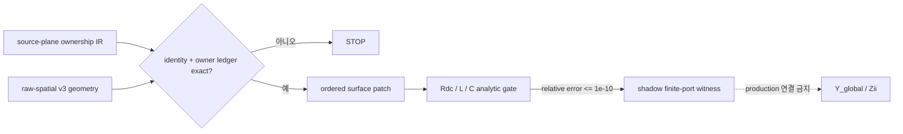

# SPD Decap PI Evaluator v0.23.1 — Source-derived physical IR

- 문서 버전: **1.17**
- 계약 상태: **ACCEPTED** — source-derived provenance/ownership prerequisite의 기술 기준
- committed 구현: `source-plane-ownership-ir-v1` + Phase 3 shadow consumer + v2 `contact_boundary` (`3b76af4`) + P0 (`4dc855a`) + P1 (`f823a53`) + P2 (`90f6b54`) + P3 (`b8a79f1`) + P4 base cut-set (`39fd4fa`) + P5 shadow rewire plan (`d7e7278`) + P6 scenario commutation audit (`6793bb2`) + P7 atomic recipe (`f1c2968`) + P8 topology embedding (`abf79cf`) + P9 nodal-block binding (`593e070`) + P10 component closure (`7f9c498`) + P11 supplemental solve gate (`e8d029a`)
- runtime acceptance: **Phase 4와 P0–P10 focused PASS / Sol ACCEPT; P3 semantic STOP, P4 structural CLOSED, P5 PLANNED, P6/P7 PASSED, P8 materialized, P9 bound, P10 component-closed; P11 focused test PASS / numerical result STOP**
- production 상태: solver, owner-off, `Y_global`, `Zii` **unchanged**
- 현재 작업 상태: **`W7-PHYS-ACTUAL-P0` DONE/STOP, `W7-PHYS-ACTUAL-P0-FIX-01` ACTIVE / P12 NO-GO** — 실제 260729 원본 SPD 1회 실행은 selected component island를 raw endpoint layer와 결합한 selector 오류에서 중단; 별도 최소 fix·focused regression만 진행
- P11 closure: commit `e8d029a`, 최종 지정 node `1 passed in 1.55s`, Sol ACCEPT; pivot ratio `1.900e15`, condition-1 lower bound `1.096e17`, `SHADOW_SOLVE_NUMERICAL_FAILURE`; trusted stamp/matrix/solve/readiness false, production unchanged
- 최종 개정: 2026-08-30 (Asia/Seoul)

## 1. 목적

이 IR의 목적은 원본 SPD에서 PowerSI 근접 `Zii` 계산에 필요한 source identity,
plane geometry lineage, stackup/material provenance, terminal footprint와 solver owner
관계를 한 번의 import에서 보존하는 것이다. IR 자체는 정확도 개선이 아니며,
source-derived 물리식 하나를 중복 stamp 없이 교체하기 위한 전제다.

17DV의 `STOP_NO_AUTHORITATIVE_BRIDGE`는 원본 SPD에 정보가 없음을 뜻하지 않는다.
기존 persisted artifact가 import 중 계산된 관계를 보존하지 못했음을 뜻한다.

## 2. 결정

원본 SPD를 solve 때마다 다시 읽거나 raw-spatial v3를 변경하지 않는다. importer가
source graph와 live artwork island resolver를 동시에 가진 시점에 compact SQLite
draft를 만들고, 기존 raw-v3와 compiled-topology identity가 생성된 뒤 hash binding을
완성한다.

```mermaid
flowchart LR
  A[원본 SPD record/span/hash] --> B[ordered plane primitive]
  B --> C[derived artwork island/component]
  C --> D[Node/Via/terminal footprint]
  D --> E[rail PWR/return binding]
  E --> F[compiler-assigned plane owner]
  F --> G[replacement ledger]
  G --> H[Phase 3 shadow patch witness DONE]
  H --> L[Phase 4 all-contact boundary IR v2 DONE]
  L --> M[P0 contact-to-artwork admissibility DONE]
  M --> N[P1 contact-complete shadow N-port DONE]
  N --> O[P2 old-edge identity bijection DONE]
  O --> P[P3 quotient audit DONE / RANK LOSS STOP]
  P --> Q[P4 closed base cut-set DONE]
  Q --> R[P5 shadow contact rewire plan DONE]
  R --> S[P6 scenario commutation audit DONE]
  S --> T[P7 one-frequency atomic recipe audit DONE]
  T --> U[P8 shadow topology/index materialization DONE]
  U --> V[P9 shadow P1 nodal-block binding DONE]
  V --> W[P10 augmented component closure DONE]
  W --> X[P11 exact 1 GHz shadow augmented solve DONE / NUMERICAL STOP]
  X --> Y[P12 NO-GO]
  Y -. independent prerequisite .-> AP0[W7-PHYS-ACTUAL-P0 DONE / STOP<br/>selector identity mismatch]
  AP0 --> AF[W7-PHYS-ACTUAL-P0-FIX-01 ACTIVE<br/>component-layer selector fix]
  AF -. ACCEPT 뒤 별도 문서 gate .-> AP1[successor original-SPD one-shot]
  AP1 --> APN[PASS 뒤 actual P0-P10 별도 gate]
  APN -. hold: production wiring 금지 .-> K[production Y_global / Zii]
  I[raw-v3 geometry/material] -. hash reference .-> B
  J[compiled finite topology] -. hash/owner reference .-> D
```

IR에는 polygon vertex, WKB, 원본 bytes를 복제하지 않는다. geometry와 finite
topology는 기존 hash-bound asset을 참조한다. SPD에 존재하지 않는 legacy solver
owner 또는 PowerSI 내부 mesh/object ID를 source-authored 값으로 주장하지 않는다.
plane owner는 source identity에 결속해 importer/compiler가 결정적으로 부여한다.

## 3. Canonical relation

| 영역 | 보존 대상 | 핵심 경계 |
|---|---|---|
| source | record kind/order, byte span, exact-record SHA | source file SHA와 범위 검증 |
| plane | surface, ordered primitive, polarity/kind, raw-v3 primitive identity | primitive와 island는 일대일이라고 가정하지 않음 |
| island | derived island/component identity와 primitive witness | positive/negative Boolean lineage는 다대다 |
| material | stackup thickness/conductivity, Dk/Df 각 값의 origin과 exact source record | Layer/Material 출처를 필드별로 구분 |
| rail | logical NET, artwork NET, layer, PWR/return surface | layer display token을 NET으로 사용하지 않음 |
| terminal | branch/pin→Node→Via→finite vertex/edge→exact rail island→PadDef+Regular footprint | 전체 chain이 있어야 complete |
| ownership | retained Via/device/terminal owner와 declared plane owner | namespace disjoint, exact-once |
| contact boundary (v2) | selected P/G component incident edge, boundary-side Via, endpoint/rotation/pad provenance, Device/decap/other 보강 | `3b76af4` accepted prerequisite |
| contact admissibility (P0) | v2 contact exact footprint와 selected same-net ordered artwork의 direct full coverage | `4dc855a` accepted shadow prerequisite |
| contact N-port (P1) | P0 ordered contact 전부의 1 GHz finite-port admittance, constraint, diagnostics와 input identity | `f823a53` accepted shadow prerequisite |
| owner-off candidate audit (P2) | P1/raw/substrate identity, contact↔finite-link↔production-port chain, selected incident old-edge fingerprint closed set | `90f6b54` accepted shadow prerequisite; `replacement_ready=false` |
| quotient representability (P3) | N-contact admittance가 현 PWR/GND ideal quotient에서 보존되는지의 projector residual | `b8a79f1` DONE/STOP; `CONTACT_INTERFACE_RANK_LOSS` |
| closed base cut-set (P4) | selected ideal class의 full preimage와 contact/old-Maxwell 외부 adjacency exact closure | `39fd4fa` DONE/CLOSED; `split_ready=false` |
| shadow contact rewire plan (P5) | contact별 interface node, retained finite-link rewire, P2 disable set과 P1 stamp identity | `d7e7278` DONE/PLANNED; plan-only, production topology/stamp 불변 |
| scenario commutation audit (P6) | P5 contact edge와 scenario/termination bound network의 exact structural compatibility | `6793bb2` DONE/PASSED; read-only, production topology/stamp 불변 |
| atomic replacement recipe (P7) | exact 1 GHz old-Maxwell 제거, finite-link rewire와 P1 N-port 추가의 no-double-counting ledger | `f1c2968` DONE/PASSED; read-only, production topology/stamp 불변 |
| shadow topology/index materialization (P8) | P6 old class 제거, P7 interface/finite-link을 기존 immutable network에 materialize하고 shadow termination을 재결속 | `abf79cf` DONE/PASSED; `solve_eligible=false`, production topology/stamp 불변 |
| shadow P1 nodal-block binding (P9) | P1 N-port를 P8 interface/reduced index와 P7 owner ledger에 기존 `NodalAdmittanceBlock`으로 결속 | `593e070` DONE/PASSED; `p1_stamp_applied=false`, production assembly 불변 |
| augmented component closure (P10) | P8 base·mounted termination·P1 support graph를 합친 component/port-bearing pruning closure | `7f9c498` DONE/PASSED; no matrix application/solve, production assembly 불변 |
| exact 1 GHz shadow augmented solve (P11) | 기존 Layer-Surface assembly/gauge/factor/residual 경로에 P1 supplemental block을 실제 적용 | `e8d029a` DONE/STOP; matrix/factor reached, forward reliability rejected; production caller/cache 불변 |
| replacement | replaced/retained set hash와 상태 | Phase 1은 `prerequisite_only`만 허용 |

## 4. 불변조건

1. 모든 source span은 source size 안에 있고 exact record hash와 일치한다.
2. retained primitive는 surface별 source order와 raw-v3 ordinal에 정확히 한 번 나타난다.
3. island는 surface/component 하나에 속하고 positive primitive witness를 하나 이상 가진다.
4. primitive↔island lineage는 다대다이며, 사라진 primitive는 명시적 no-survivor 상태다.
5. logical rail NET, artwork NET, layer display name은 별도 필드다.
6. material 값마다 source, layer override, material model 또는 unavailable origin과
   그 값의 exact source record를 함께 보존한다. unavailable conductivity는 값과
   source reference가 모두 없다.
7. complete terminal은 rail→pin→Node→Via→finite edge/vertex→rail-bound island→
   PadDef+Regular→raw pad footprint가 완전하다. 불완전한 selected rail은 IR 없이 STOP한다.
8. compiler plane owner는 retained owner namespace와 충돌하지 않는다.
9. `replacement_ready`는 실제 consumer가 동일 owner를 운반하고 owner conservation을
   통과하기 전에는 기록할 수 없다.
10. 모든 table은 row count와 canonical logical SHA를 가진다.

## 5. 생성 수명주기

1. 기존 SPD parser가 필요한 source record span과 hash를 수집한다.
2. connectivity recovery 후 live artwork가 유지되는 동안 primitive/island 관계와
   rail/terminal draft를 만든다.
3. live Shapely geometry를 정상 해제한다.
4. 기존 raw-v3와 compiled topology를 변경 없이 생성한다.
5. draft를 source/project/certificate/topology/raw identity에 결속하고 SQLite를 한 번
   압축해 scenario attachment로 저장한다.
6. 실패하면 draft와 임시 DB를 폐기하고 부분 attachment를 남기지 않는다.

## 6. 단계와 검증 예산

| Phase | 구현 위치 | 증거 | 현재 판정 | production 의미 |
|---|---|---|---|---|
| 1 | committed `82370b6` | focused storage contract PASS | DONE | source/provenance storage prerequisite만 |
| 2 | committed `75ac0a0` | focused end-to-end producer PASS | DONE | import-time atomic binding만 |
| 3 | committed `5d2c353` | analytic/deterministic shadow gate PASS | DONE | `Y_global`/`Zii` 미연결 |
| 4 | committed `3b76af4` | focused `1 passed in 1.39s`; Sol ACCEPT | DONE | finite boundary provenance prerequisite만; 정확도 주장 금지 |
| P0 | committed `4dc855a` | focused `1 passed in 1.51s`; Sol ACCEPT | DONE | direct artwork full-coverage prerequisite만; production 연결 없음 |
| P1 | committed `f823a53` | focused `1 passed in 1.58s`; Sol identity review 반영 | DONE | exact 1 GHz shadow N-port만; production owner-off 없음 |
| P2 | committed `90f6b54` | 최초 contract FAIL 뒤 fixture 유지·identity 교정; focused `1 passed in 1.49s`; Sol ACCEPT | DONE | candidate old-edge closed set만; `replacement_ready=false` |
| P3 | committed `b8a79f1` | focused `1 passed in 1.51s`; Sol ACCEPT; semantic STOP | DONE | `CONTACT_INTERFACE_RANK_LOSS`; topology/production 불변 |
| P4 | committed `39fd4fa` | 최초 negative fixture contract FAIL 뒤 corrected focused `1 passed in 1.53s`; Sol ACCEPT | DONE | base cut-set CLOSED; `split_ready=false`; production 불변 |
| P5 | committed `d7e7278` | focused `1 passed in 1.73s`; Sol ACCEPT | DONE | deterministic plan-only; topology/stamp/solve 불변 |
| P6 | committed `6793bb2` | final focused `1 passed in 1.42s`; Sol ACCEPT | DONE | scenario/termination 구조 호환성만; production 불변 |
| P7 | committed `f1c2968` | focused `1 passed in 1.58s`; Sol ACCEPT | DONE | passed shadow recipe; readiness false; production 불변 |
| P8 | committed `abf79cf` | final focused `1 passed in 1.60s`; Sol ACCEPT | DONE | topology materialized; P1 stamp/solve readiness false; production 불변 |
| P9 | committed `593e070` | final focused `1 passed in 1.60s`; Sol ACCEPT | DONE | exact 1 GHz binding prerequisite only; no matrix application/solve |
| P10 | committed `7f9c498` | final focused `1 passed in 1.56s`; Sol ACCEPT | DONE | exact 1 GHz partition/pruning prerequisite only; no matrix application/solve |
| P11 | committed `e8d029a` | final focused `1 passed in 1.55s`; Sol ACCEPT; deterministic numerical STOP | DONE | pivot `1.900e15` > `1e13`; no trusted solve; production caller/cache/wiring unchanged |
| Actual-P0 | existing importer/save/load seam; no product-code change | commit `ff3327c`, import 1/save 0/load 0, 3,357.744 s, report SHA `e942787a…c1d` | DONE | selector/identity-contract STOP; scenario absent; zero solve/Touchstone/P0-P11 |
| Actual-P0-FIX-01 | `spd_adapter.py` + producer focused regression | component-row canonical surface identity, raw endpoint provenance separation | ACTIVE | original SPD run, schema/API/solver/physics changes forbidden |

`DONE`은 해당 Phase의 선언 범위가 종료됐다는 뜻이며 current release, production
acceptance 또는 PowerSI 정확성을 뜻하지 않는다. Phase 4의 exact 실행 이력과 검증
예산은 작업 기준 1장과 12.8–12.9가 권위 있다.

### Phase 1 — storage contract

DONE. importer와 solver를 수정하지 않고 deterministic SQLite writer/loader,
schema validation과 synthetic round-trip을 구현했다. 선택 rail 관계 전체에
100,000행 상한을 두고 terminal은 complete-only로 닫았다.

Whitelist:

- `docs/PRODUCT_PURPOSE_AND_TECHNICAL_BASELINE.md`
- `docs/WORK_EXECUTION_BASELINE.md`
- `docs/SOURCE_DERIVED_PHYSICAL_IR.md`
- `src/spd_decap_pi/source_plane_ownership_ir.py`
- `tests/test_source_plane_ownership_ir.py`

Validation budget:

- V0: `git diff --check`와 문서/schema 정적 확인 1회
- V1: `tests/test_source_plane_ownership_ir.py` 1회
- V2 이상, 원본 SPD, raw-v3 재생성, solver, Touchstone, W6/PowerSI 비교 금지

Closure evidence: `python -m pytest -q tests/test_source_plane_ownership_ir.py`
→ `7 passed in 0.84s`. 이 결과는 storage contract만 검증한다.

### Phase 2 — importer producer seam

DONE. source span 수집, cleanup 전 draft 생성, raw/compiled identity finalization과
scenario envelope 검증을 작업 기준 12.6의 whitelist로 완료했다. 두 full-file
실행에서 공통 guard 3개는 PASS했고 fixture 결함을 순차 수정했다. 이후 단일
end-to-end producer node로 축소해 certificate terminal-owner projection, source size
hand-off와 Pydantic envelope 변환을 바로잡았으며 최종 결과는
`1 passed in 1.39s`다. 이 단계는 `Zii`를 변경하지 않았다.

### Phase 3 — shadow-only source-plane patch consumer

DONE. validated IR/raw-v3에서 source-certified PWR/return surface와 complete
terminal footprint 하나를 exact join해 `source-plane-patch-v1` finite-port shadow
witness를 만든다. 선택 rail 이외의 surface/terminal 중간 데이터는 보존하지 않고,
실제 stack corridor와 dielectric global ordinal 증명에 필요한 raw stackup/dielectric
stream만 전체 순서를 유지한다. production stamp를 교체하지 않았으며 owner
inventory, `Y_global`, `Zii`도 변경하지 않았다.

Whitelist와 검증 예산은 작업 기준 12.7이 권위 있다. Phase 3 PASS도 analytic
limiting case와 owner hand-off prerequisite만 증명한다. production replacement,
mesh convergence, causal broadband A/B, PowerSI correlation과 holdout은 별도 단계다.

검증은 첫 focused file에서 identity-tamper가 PASS하고 float canonicalization fixture만
실패해 `1 failed, 1 passed in 1.30s`였다. fixture 수정 뒤 exact happy node는
`1 passed in 0.97s`였고 `Rdc`, `L=mu0*d*ell/w`,
`C=epsilon0*epsilon_r*A/d`의 상대오차 `<=1e-10`과 deterministic replay를 닫았다.

### Phase 4 — contact-complete import-time boundary

DONE / prerequisite-only. Phase 3의 두 Device terminal은 analytic witness에는 충분하지만 production
loaded plane replacement의 경계로는 충분하지 않다. target rail의 P/G anchor가
증명한 두 surface-equivalence component를 먼저 고정하고, finite-via quotient에서 그
component vertex에 incident한 모든 edge와 전체 owner를 권위 inventory로 선택한다.
`terminal_landing_contacts`는 Device/decap 종류 보강에만 사용하며 inventory source로
사용하지 않는다. 같은 raw compiler pass에서 각 boundary Via의 양 endpoint Node와
PadDef/Regular/PadShape source provenance를 결속하고 solve 때 SPD나 network를 다시
스캔하지 않는다.

v2는 v1의 `terminal_bindings` 의미를 유지하고 별도 `contact_boundary` relation을
추가한다. relation은 owner kind, plane/opposite endpoint, rail-bound component와 대표
island, finite vertex/edge와 edge 전체 owner, raw Via rotation과 exact footprint source를
포함한다. quotient의 canonical `(component/island, vertex, edge, owner)` 집합과 persisted
집합이 정확히 같지 않으면 부분 attachment 없이 STOP한다. 공유 Node/PadStack은 정상적인
many-to-one 관계로 허용하되 모든 intermediate와 최종 관계는 기존 100,000행 상한 안에
있어야 한다.

여기서 `complete`는 finite equivalence-boundary의 source/provenance가 완전하다는 뜻이다.
Pad footprint가 selected artwork에 직접 겹치는지와 trace-equivalent contact를 production
patch port로 쓸 수 있는지는 후속 단일 physical gate이며 Phase 4가 미리 주장하지 않는다.

Whitelist, 검증 예산과 STOP 조건은 작업 기준 12.8이 권위 있다. 이 단계에서도
replacement ledger는 `prerequisite_only`이고 current patch consumer, adjacent-gap
partial, solver, `Y_global`과 `Zii`는 바꾸지 않는다.

현재 Phase 4 증거는 다음처럼 분리한다.

| 축 | 현재 사실 | 주장 금지 |
|---|---|---|
| committed 구현 | v2 schema/loader, quotient-authoritative boundary selection, raw endpoint/rotation/pad provenance와 authority coverage가 commit `3b76af4`의 3 production + 1 focused test 파일에 존재 | release 또는 production solver acceptance |
| causal closure | R2 read-only 추적으로 C1의 isolated Node3 때문에 Trace11 quotient union이 생기지 않아 Via11이 leaf-prune된 fixture/acceptance 부정합으로 분류 | production enumerator/join 결함으로 재분류 |
| runtime 증거 | decap Via7/Node8을 복원하고 Trace11을 non-isolated Node1에서 시작한 fixture에서 Via11 `other`, Node11/Node12, 4.5도 rotation/padstack, canonical authority list/set/count/SHA와 atomic failure가 PASS; 최종 `1 passed in 1.39s` | direct artwork coverage, replacement readiness |
| validation hardening | v2 Node/Via/PadDef/Regular identity, net/layer, endpoint alias, normalized rotation을 교차 결속하고 landing enrichment를 `O(B+L)`로 인덱싱; Sol 재검토 ACCEPT | PowerSI accuracy 또는 성능 benchmark |
| production | solver, current patch consumer, owner-off, `Y_global`, `Zii` 변경 없음 | 정확도 개선 또는 PowerSI 상관 개선 |

R4의 첫 검증은 `spd_adapter.py` 들여쓰기 오류로 collection 전에 중단됐고 같은 노드에서
재실행하지 않았다. 별도 R5 문법 교정 뒤 지정 node를 한 번 실행해 `1 passed in 1.39s`를
얻었고 R6 Sol 재검토가 ACCEPT했다.

### P0 — contact-to-artwork finite-port admissibility

DONE / shadow prerequisite-only. `evaluate_source_plane_contact_admissibility()`는 manifest rail,
v2 contact identity, raw endpoint layer와 PadShape provenance를 다시 결속한 뒤 각 exact footprint가
selected same-net ordered artwork에 전면 피복되는지 직접 판정한다. production Phase 3 consumer의
출력과 의미는 바꾸지 않았다.

초기 구현은 irregular artwork를 기존 analytic rectangle 경로에 결합해 `_rectangle()`에서
중단됐으므로 폐기했다. 별도 read-only 판정기로 분리한 뒤 첫 음성 fixture의 Node11을 30 mm로
옮기자 upstream P4가 contact 자체를 제외한다는 원인을 확인했고 재실행하지 않았다. Node11 중심을
PWR 경계 안 3.995 mm에 두되 pad가 경계를 넘도록 고친 단일 node는 `1 passed in 1.52s`였다.
Sol trust-boundary 검토에 따라 manifest target rail 인증과 external source-record layer↔opposite
Via layer 교차 결속을 추가했고 최종 지정 node는 `1 passed in 1.51s`였다. 뒤의 annotation-only
교정은 runtime 의미를 바꾸지 않아 재실행하지 않았으며 Sol이 ACCEPT했다. 기술 commit은
`4dc855a`다.

### P1 — contact-complete shadow N-port condensation

DONE / shadow prerequisite-only. `evaluate_source_plane_contact_condensation()`은 P0 accepted
contact 순서와 `(contact_id, owner_kind)`를 다시 대조하고 selected ordered artwork, IR↔raw
stackup/material provenance와 exact source-tabulated frequency point를 기존 surface-patch
operator에 전달한다. 1 GHz, 1000 um fixed mesh의 지정 node는 모든 `device/decap/other`
contact를 포함한 유한 N×N admittance, terminal constraint, gauge/solve/reciprocity/passivity/
condition diagnostics와 deterministic replay를 `1 passed in 1.58s`로 닫았다.

Sol 정적 검토는 최초 `input_sha256`가 authenticated ownership logical-row identity를 누락해
서로 다른 유효 sidecar가 같은 hash를 만들 수 있다고 REJECT했다. Luna가
`ownership_logical_rows_sha256` 한 필드만 input identity에 추가했고 계산/행렬/port 의미가
바뀌지 않아 node를 재실행하지 않았다. 나머지 항목은 Sol이 ACCEPT했으며 기술 commit은
`f823a53`다.

P2는 P1 N-port가 대체할 production adjacent-gap Maxwell old edge를 exact fingerprint로
전수 식별했다. 그러나 현 production은 각 P/G artwork component를 ideal node 하나로 축약한다.
P3 결과 현 quotient는 contact-space mode를 보존하지 못했고 P4는 contact-interface node 분리의
base-network cut-set 전제를 닫았다. P5는 exact rewire/disable/stamp shadow plan까지 결속했다.
P6는 실제 scenario/termination binding이 그 contact basis를 보존함을 닫았다. 이제 exact
1 GHz에서 production old-Maxwell 계수 제거, finite-link rewire와 P1 N-port 추가가 하나의
atomic no-double-counting recipe로 결속되는지 P7에서 닫기 전에는 owner-off나 production
replacement stamp를 만들지 않는다.

### P2 — incident old-edge identity/bijection

DONE / shadow prerequisite-only. `audit_source_plane_patch_owner_off()`는 P1/raw/ownership/
substrate identity를 결속하고, physical artwork component→contact plane-side quotient vertex→
retained finite R/L edge/owner→external terminal vertex→production port chain을 검증한다.
선택 component incident sparse Maxwell edge를 전수 스캔해 canonical fingerprint closed set을
만들며 production network는 수정하지 않는다.

최초 지정 node는 physical island와 external production port를 동일시한 audit contract 때문에
`1 failed in 1.77s`였다. fixture의 retained Via 경계가 옳아 fixture를 완화하지 않고 위 identity
chain으로 교정했다. 재실행은 `1 passed in 1.49s`, Sol 최종 정적 검토는 ACCEPT였고 기술
commit은 `90f6b54`다. 결과는 계속 `shadow_only=true`, `replacement_ready=false`다.

### P3 — contact quotient representability

DONE / shadow falsification-only. `audit_source_plane_patch_contact_quotient_representability()`은
contact one-hot map `B`, projector `Q = B.T @ diag(1 / contact_count_per_node) @ B`와
`R = Y - Q @ Y @ Q`를 exact P1/P2 identity에 결속했다. 지정 node는 `1 passed in 1.51s`,
Sol 최종 검토는 ACCEPT, 기술 commit은 `b8a79f1`이다. 실행 성공의 semantic result는
`CONTACT_INTERFACE_RANK_LOSS` STOP이며, 현 PWR/GND two-node ideal quotient가 P1의
current-spreading mode를 보존하지 못함을 확정한다. tolerance 완화, contact 병합, topology
분할은 수행하지 않았고 `replacement_ready=false`다.

### P4 — selected base cut-set closure

DONE / shadow structural prerequisite-only. termination/scenario 없는 base
`compile_layerwise_substrate` network에서 role별 full `reduced_node_index()` preimage가 P2
component islands와 P3 contact `finite_vertex_id`의 합집합과 정확히 같은지 판정한다. 이 class에
닿는 ideal link는 같은 role 내부에서 닫혀야 하며, class를 가로지르는 finite link는 P2 contact
edge와, sparse Maxwell adjacency는 P2 incident fingerprint와 각각 exact equality여야 한다.
base port 직접 부착, extra vertex/edge/owner, cross-role ideal link는 STOP한다. PASS여도
`split_ready=false`이며 scenario/termination adjacency는 split 설계 뒤 별도 bound-network gate다.

최초 node는 본체의 정상 `closed` 경로 뒤 negative fixture에 extra `via_links`만 추가하고 compiled
`_finite_links`를 함께 갱신하지 않아 `1 failed in 1.90s`였다. 이는 frozen network constructor가
fixture 불변조건을 차단한 test-contract 오류다. 두 inventory를 함께 구성하도록 fixture만 교정한
재실행은 `1 passed in 1.53s`, Sol 최종 검토는 ACCEPT, 기술 commit은 `39fd4fa`다. 결과는
`status=closed`, `split_ready=false`, production topology/solver/`Zii` 불변이다.

### P5 — shadow contact rewire plan

DONE / plan-only. P4를 한 번 호출하고 내부 P3→P2 chain을 재사용한다. 각 contact에 P4 hash와
contact identity로 unique interface node를 만들고, retained `finite_parallel_rl` link는 selected
endpoint만 그 node로 바꾸는 계획을 만든다. link ID, external endpoint, count, R/L, retained Via
owners는 exact 보존한다. P2 old Maxwell fingerprints 전부를 exact-once disable set으로, P1 ordered
N-port와 matrix/constraint identity를 planned stamp로 결속한다. virtual transform 뒤 old selected
class의 external degree가 0이어야 한다. 지정 node는 `1 passed in 1.73s`, Sol 최종 검토는 ACCEPT,
기술 commit은 `d7e7278`이다. 결과는 `status=planned`, `shadow_only=true`,
`production_ready=false`, `replacement_ready=false`이며 실제 graph/matrix는 수정하지 않는다.

### P6 — shadow rewire–scenario commutation audit

DONE / read-only prerequisite. P5 결과, 동일 base substrate와 기존 compiler가 생성한
`LayerwiseScenarioNetworkBinding`을 입력으로 받는다. scenario identity/plan, surface/link manifest,
termination manifest와 P5 `shadow_split_sha256`를 결속하고, 모든 contact finite edge가 exact-once로
남아 endpoint/mode/count/R/L/owner 순서를 보존하는지 판정한다. scenario topology-only link,
termination, base port 또는 partial이 P5 old selected class와 예정 interface 경계를 우회하면 STOP한다.
source contact가 suppress/retarget되어 owner만 새 route로 옮겨진 경우도 P1 terminal basis가 달라지므로
`SCENARIO_REWIRE_SOURCE_EDGE_SUPPRESSED`로 중단한다. PASS여도 구조적 호환성만 뜻하며 production
topology/owner-off/stamp/solve와 `Zii`는 변경하지 않는다.

최초 지정 node는 `1 passed in 2.43s`였으나 Sol이 surface loop의 O(V×K) lookup과 반복
boundary union을 REJECT했다. lookup/boundary set을 한 번만 만들고 전체 surface tuple 복제를
제거한 뒤 최종 지정 node는 `1 passed in 1.42s`, Sol 재검토는 ACCEPT였다. 기술 commit은
`6793bb2`다. 추가 비용은 `O(V + L + P + T + K)` 시간과
`O(V_selected + K + P + T)` 메모리이며 결과는 `status=passed`, `shadow_only=true`,
`production_ready=false`, `replacement_ready=false`다.

### P7 — one-frequency atomic replacement recipe audit (closure)

DONE / read-only stamp prerequisite. accepted P1 patch, P5 rewire plan, P6 commutation result,
동일 substrate/scenario binding과 P1 exact 1 GHz source point만 입력으로 사용한다. P5 disabled
fingerprint마다 scenario partial의 old Maxwell 항을 exact-once 재식별하고 production과 같은
`Dk(f)·(1-j·Df(f))/nominal_Dk` 계수로 `y_old`를 기록한다. retained finite branch는 owner/R/L/count와
old/new admittance를 보존하며, P1 contact 순서와 P5 interface 순서를 exact 결속한다.

출력은 ordered `remove_old_maxwell`, `rewire_finite`, `add_p1_nport` ledger와 deterministic recipe
SHA뿐이다. interpolation, broadband, global matrix와 solver를 만들지 않는다. old edge/source point가
없거나 중복되거나 contact order·owner·algebra가 다르면 STOP한다. PASS여도 현재 source point 한
주파수에서 atomic no-double-counting recipe가 존재한다는 뜻만 가지며 production readiness와
PowerSI 정확성을 주장하지 않는다.

Closure evidence: technical commit `f1c2968`; 지정 node `1 passed in 1.58s`; Sol ACCEPT. 결과는
`status=passed`, `shadow_only=true`, `production_ready=false`, `replacement_ready=false`이며 production
network, solver, `Y_global`, `Zii`는 변경하지 않았다.

### P8 — assembly prerequisite shadow topology/index embedding (closure)

DONE / shadow-only materialization prerequisite. `materialize_source_plane_patch_shadow_topology_embedding()`은
P6 pass identity와 P7 recipe hash를 다시 계산해 동일 binding에 결속한 뒤 P6 old class를 제거하고 P7
interface를 contact 순서대로 추가한다. finite link는 R/L/count/mode/owner를 보존해 재배선하고 touched
partial의 행/열만 축소하며 untouched wrapper/dispersion은 재사용한다. empty partial은 버리고 기존 ports는
exact 유지한다. 원본 termination manifest가 전체 원본 surface inventory에 결속되므로 기존 compiled
cluster source를 shadow surface inventory로 ephemeral 재컴파일해 mapping과 manifest SHA를 검증한다.

출력은 immutable compiled network와 ordered interface→unique reduced-index,
surface/partial/link/port/termination manifest 및 topology hash를 포함한다. `topology_materialized=true`지만
`p1_stamp_applied=false`, `solve_eligible=false`, readiness false다. STOP 코드는
`SHADOW_EMBEDDING_IDENTITY_MISMATCH`, `SHADOW_EMBEDDING_OLD_CLASS_INCOMPLETE`,
`SHADOW_EMBEDDING_PARTIAL_ESCAPE`, `SHADOW_EMBEDDING_LINK_ESCAPE`,
`SHADOW_EMBEDDING_INTERFACE_COLLAPSED`, `SHADOW_EMBEDDING_UNREPRESENTABLE` 여섯 개다.

Closure evidence: technical commit `abf79cf`; 최종 지정 node `1 passed in 1.60s`; Sol ACCEPT.
P6 old-class tamper는 identity mismatch로 차단되고, all-partials-removed 입력은 unrepresentable STOP이다.
production topology/cache/profile, solver, `Y_global`, `Zii`는 변경하지 않았다.

### P9 — shadow P1 nodal-block binding

DONE / stamp-binding prerequisite. 공개 함수는
`bind_source_plane_patch_shadow_nport_block(patch_result, commutation_result, recipe_result, binding, *, rail_id)`이며
내부에서 P8을 정확히 한 번 호출한다. PASS는 P8 shadow network, 기존 `NodalAdmittanceBlock`,
`source-plane-shadow-nport-block-binding-v1` audit을 반환하고 STOP은 `(None, None, audit)`이다. 새 carrier나
core seam을 만들지 않는다.

block node는 P7 interface exact order, owner는 P7 added-P1 owner exact order, ID는
`source-plane-shadow-p1-nport:{p1_output_sha256}`다. P1 `admittance_s`만 새 read-only `complex128` local
matrix로 복사한다. 후속 assembly 의미는 ordered interface의 P8 reduced index `r_i`에 대해
`A[r_i,r_j] += Y_P1[i,j]`지만 P9은 실제 matrix에 적용하지 않는다. 이미 condensed된 Y에
`terminal_constraint_matrix`를 다시 stamp하지 않는다.

audit은 P1/P7/P8/scenario/termination/boundary identity, ordered contact/interface/reduced index,
block/owner/matrix identity와 `p1_stamp_bound=true`, `p1_stamp_applied=false`, `solve_eligible=false`, readiness
false를 기록한다. STOP 코드는 `SHADOW_NPORT_PREREQUISITE_STOPPED`, `SHADOW_NPORT_IDENTITY_MISMATCH`,
`SHADOW_NPORT_CONTACT_ORDER_MISMATCH`, `SHADOW_NPORT_INTERFACE_BINDING_MISMATCH`,
`SHADOW_NPORT_OWNER_CONFLICT`, `SHADOW_NPORT_MATRIX_UNREPRESENTABLE` 여섯 개로 제한한다. focused node는
`test_source_plane_patch_shadow_nport_block_binding` 하나이며, positive deterministic/read-only binding과
P8이 PASS한 유효 chain의 P1 input SHA만 형식상 유효한 다른 값으로 바꾼 identity-mismatch negative를 함께
검증했다. closure evidence는 commit `593e070`, 최종 `1 passed in 1.60s`, Sol ACCEPT다. 증분 비용은
`O(N²+N)` 시간·메모리이고 actual assembly/solve/`Zii`, broadband, PowerSI, W6, Distribution은 금지한다.

### P10 — shadow augmented component closure

DONE / pre-assembly partition prerequisite. 공개 함수는
`audit_source_plane_patch_shadow_augmented_component_closure(patch_result, commutation_result, recipe_result, binding, *, rail_id) -> Mapping[str, Any]`이며
P9을 정확히 한 번 호출한다. P9/P8/P7/scenario/termination/boundary/block/matrix identity를 다시 결속하고,
P8 compiled base connectivity, shadow network에 다시 결속한 all-mounted termination endpoint, P9 P1 matrix의
exact nonzero off-diagonal support를 deterministic union-find graph 하나로 합친다.

audit schema는 `source-plane-shadow-augmented-component-closure-v1`이다. base/augmented component manifest와
SHA, P1 structural-edge SHA, ordered port→component와 interface→component를 기록한다. 모든 port의 양 끝은
같은 augmented component에 있어야 하고 모든 P1 interface는 port-bearing augmented component에 남아야 한다.
PASS flags는 `component_closure_verified=true`, `p1_connectivity_accounted=true`,
`p1_stamp_applied=false`, `global_matrix_assembled=false`, `solve_eligible=false`, readiness false다.

STOP 코드는 `SHADOW_COMPONENT_PREREQUISITE_STOPPED`, `SHADOW_COMPONENT_IDENTITY_MISMATCH`,
`SHADOW_COMPONENT_TOPOLOGY_MISMATCH`, `SHADOW_COMPONENT_TERMINATION_MISMATCH`,
`SHADOW_COMPONENT_PORT_DISCONNECTED`, `SHADOW_COMPONENT_P1_PRUNED` 여섯 개다. focused node는
`test_source_plane_patch_shadow_augmented_component_closure` 하나다. Positive는 deterministic component/edge
identity, exact base→augmented merge, port/interface survival과 원본 network 불변을 검증한다. Negative는 공개
network constructor로 isolated retained surface와 그 surface에서 기존 retained surface로 가는 port를 포함한
일관된 P6–P9 chain을 만들고 P9 PASS 뒤 `SHADOW_COMPONENT_PORT_DISCONNECTED`를 확인한다. 비용은
`O(V+E+L+T+P+N²)` 시간, `O(E_partial_max+R+P+T+N²)` 추가 메모리이며 `E_partial_max`는 한 번에 복사하는 단일 partial의 최대 sparse nnz다. dense `V×V` matrix는 만들지 않았다. closure evidence는 commit `7f9c498`,
최종 `1 passed in 1.56s`, Sol ACCEPT다. core seam, admittance 적용, factor/solve/`Zii`, broadband,
PowerSI, W6, Distribution과 production 변경은 수행하지 않았다.

### P11 — exact 1 GHz shadow P1-augmented solve

DONE/STOP / first value-application gate. `global_mna.evaluate_nodal_admittance_block(block, frequency_hz)` 공개 helper로
finite shape, complex-symmetric reciprocity, Hermitian passivity와 floating zero row/column sum을 한 번 구현해
기존 Global-MNA와 Layer-Surface supplemental path가 함께 사용한다. 기존
`CompiledLayerSurfaceNetwork.solve(..., supplemental_nodal_admittance: NodalAdmittanceBlock | None = None)`에
kw-only optional seam 하나만 추가한다. `None` 경로의 production arithmetic/cache 의미는 불변이고 block 경로는
exact one-frequency와 cache-ineligible로 제한한다.

Supplemental 경로는 validated P1 nonzero support를 base+termination component에 먼저 union한 뒤 port validation과
port-bearing pruning을 수행한다. assembly 순서는 retained dispersive partial → retained finite R/L → all-mounted
termination → P1 N-port다. P1 node는 distinct reduced/active index여야 하고 owner는 retained Via/termination owner와
disjoint해야 한다. P1 CSC를 ordered active index에 더한 뒤 기존 reciprocity/row-sum, gauge/factor/pivot/residual/passive-port
gate를 그대로 실행한다. final point-matrix identity와 block/node/owner/admittance identity를 core solve identity에 포함하며
supplemental 결과는 frequency cache를 읽거나 쓰지 않는다.

Consumer API는
`audit_source_plane_patch_shadow_one_frequency_solve(patch_result, commutation_result, recipe_result, component_closure_result, binding, *, rail_id) -> Mapping[str, Any]`이다.
P10 self-hash/status/flags를 먼저 확인하고, 통과한 경우 P9을 정확히 한 번 호출해 ephemeral P8 network/P1 block을
복구한다. shadow termination manifest를 재컴파일하고 `[1.0e9]`에서 기존 solve를 supplemental block과 함께 호출한다.
schema는 `source-plane-shadow-one-frequency-p1-augmented-solve-v1`이며 upstream identity, block/matrix/owner,
core solve identity, ordered port complex admittance hex/SHA와 pivot/residual/active-node/termination diagnostics를 기록한다.
PASS는 `component_closure_verified=true`, `p1_stamp_applied=true`, `global_matrix_assembled=true`,
`one_frequency_shadow_solve_executed=true`, `cache_reuse_eligible=false`, `solve_eligible=false`, readiness false다.

STOP 코드는 `SHADOW_SOLVE_PREREQUISITE_STOPPED`, `SHADOW_SOLVE_IDENTITY_MISMATCH`,
`SHADOW_SOLVE_OWNER_CONFLICT`, `SHADOW_SOLVE_STAMP_INVALID`, `SHADOW_SOLVE_COMPONENT_MISMATCH`,
`SHADOW_SOLVE_NUMERICAL_FAILURE` 여섯 개다. focused node는
`test_source_plane_patch_shadow_one_frequency_augmented_solve` 하나다. Accepted P10 MINI chain은 P1 적용 뒤
reciprocity/row-sum을 통과하고 factor gate까지 도달했지만 pivot ratio `1.900e15`, condition-1 lower bound
`1.096e17`로 기존 `1e13` forward-reliability 한계를 초과해 `SHADOW_SOLVE_NUMERICAL_FAILURE` STOP했다.
backward residual `7.308e-17`은 ill-conditioned 해의 forward accuracy 증거가 아니다. 최종 matrix SHA는
`b0680d39fcc0f9bad2c6e619b6910fd3e52765a610b940e31f7dc6cb1be79c0e`다. Focused test는 deterministic STOP,
accepted flags/readiness false, solve/port output 부재와 원본 substrate/network/CSC/cache 불변을 확인한다. Negative는
P10 `component_closure_sha256`을 다른 유효 SHA로 바꾸고 P9 호출 전 identity STOP을 확인한다. 최종 evidence는
commit `e8d029a`, `1 passed in 1.55s`, Sol ACCEPT다. P11 stamp 증분은 `O(N²+L+T)` 시간,
`O(N²+R)` 메모리이고 전체 sparse factor/solve 비용은 기존 LU fill-in에 의존한다. dense `V×V` matrix나 새 solver는
만들지 않았다. threshold/fallback/gauge/reordering/fixture capacitance는 바꾸지 않았다. 이 STOP은 현재 synthetic
MINI chain의 exact 1 GHz forward-reliable solve 실패만 뜻하며 실제 SPD/`Zii` correlation, PowerSI 개선,
broadband/mesh convergence/unseen generalization, production wiring/cache/profile, W6와 Distribution은 미주장·금지다.

P12 prospective review는 NO-GO다. P11 matrix에는 구조 closure를 위한 임의 `1e-12 F` synthetic bridge가
함께 들어가므로 base/P1 weak-mode attribution을 추가해도 실제 SPD의 owning physical block을 식별하지 못한다.
P3가 이미 current two-node quotient의 P1 contact-mode rank loss를 증명했고, per-block attribution에는 assembly
복제 또는 새 diagnostic carrier가 필요해 현 증거 수준에서는 validation churn이다. 재개에는 original-SPD에서
hash-bound로 만든 synthetic-free scenario, 같은 P0–P10 closure, 한 source-derived owner와 한 PowerSI error
component를 잇는 no-fit 사전 가설이 모두 필요하다. 그때만 기존 P11을 값 변경 없이 한 번 재사용한다.

### W7-PHYS-ACTUAL-P0 — original-SPD source-IR scenario generation

이 gate는 새 parser, schema, builder 또는 solver를 만들지 않는다. 기존
`import_spd_scenario(..., source_plane_ownership_rail_id=...)`, atomic scenario save와
bundle reload 경로만 재사용한다. 입력은 `D:\S4LB002-2Para_260729_1_injected.spd`
(1,116,717,287 bytes, SHA-256
`40cb44b2376f59d6b606eb9b4d138204fe51b2dc6b3332d3b7c0e7d4202866d2`)이고 대상은
bare rail `ADC_VDD_180_VQPS_SYS_1_AON/0`, PWR/return layer
`Signal$L30(OTHER_POWER1)` / `Signal$L29(DGND)`다.

Expected raw-v3 identity는 frozen 17DT의 canonical manifest
`802439b57bf60af1ae82299ae26a4fb777215c5665e813ac6ac893e32d56d71d`, compressed asset
`c5f7085edcf9d0e638f01602633f9df158472eb8e2959989d9fa7693e504947a`, geometry
`bdfecc328264d28b6e2f35a6dcb096a42373a4cbed799a5de51403f71787623e`, logical
`519fda0cc425d24fc61baaeb529d55240bcc085c5dca4bea5c528616e9fefb10`, plane sheet
`e266286afe42425b8df1bfa4db85f5e2556140905f42cd8ba156f585e301c6b5`, project binding
`52b04151f8c46ad2bc903dbf4e62855e0e29042b428ce38a4aafc9e98c519760`, certificate
`fac8e711e65a3fe4f82d3d32fd7cb862bcf2781e02e5037fb4f16ba5a07c46b3`, topology
`a12a76a1060cb466b3a35f4e43165e1db6e7a28c96e8a071cb0ea01e9945c6ef`다. PASS는 이
chain과 source hash가 일치하고, source-plane ownership IR이 exact rail/layer pair에
결속되며 contact/owner ledger가 complete이고 synthetic partial이 없고, save/reload 뒤
동일하게 검증될 때만 가능하다.

실행 전 branch가 `main`, tracked working tree가 clean, `HEAD`가 작업 기준의
`contract-commit`과 정확히 같아야 하며 하나라도 다르면 import 전에 STOP한다. 실행 예산은
그 commit의 새 빈 root에서 정확히 한 번이며 재시도하지 않는다. 이 gate에서는
frequency solve, Touchstone read, P0-P11, production owner-off/wiring, threshold/value/fixture
변경을 수행하지 않는다. 실패·취소·resource stop은 그대로 STOP으로 폐쇄한다.

Closure result는 **DONE/STOP**이다. `main` commit
`ff3327c0ed093c71398fd293b445a1eb91529ea1`에서 import를 정확히 한 번 실행했고
3,357.7441885 s 뒤
`SOURCE_PLANE_OWNERSHIP_IR_INCOMPLETE: anchor representative island is not on selected surface`
에서 fail-closed 중단됐다. call count는 import 1, save 0, load 0이고 frequency solve 0,
Touchstone false, P0–P11 미실행이다. 마지막 progress는 3,351.847 s의
`Compiled layer-surface connectivity certificate evidence`였다. scenario candidate는 없고 output
root에는 coordinator evidence envelope
`actual_source_ir_generation_report.json`만 남았다(10,582 bytes, SHA-256
`e942787a8363f68be0a17abedfe9b3562c1a35475fa0972736a9b67f5ec93c1d`). frozen raw-v3
identity chain과 synthetic-free resume condition은 scenario 부재로 **pending/not evaluated**이며,
기존 root와 실행을 PASS로 재분류하거나 재시도하지 않는다.

### W7-PHYS-ACTUAL-P0-FIX-01 — ownership selected-surface identity correction

정적 원인은 raw SPD/geometry 부재가 아니라 v4 certificate의 두 layer 의미를 섞은 selector contract다.
`endpoint_layer`는 terminal 첫 Via의 raw/internal endpoint provenance이고,
`contact_component_layer`와 `representative_island_id`/`contact_component_id`는 finite branch/cycle로
도달한 required rail surface component를 나타낸다. 현 producer는 후자의 island/component를 전자의
layer와 결합해 snapshot을 검사하므로 두 layer가 다른 실제 보드에서 거짓 불일치를 만든다.

이 fix의 sole authority는 certificate `surface_equivalence_components`에서
`contact_component_id`를 exact-join한 canonical `(net, layer, representative_island_id,
component_id)`다. power/ground 각 row는 configured target rail surface와 snapshot inventory에
정확히 일치해야 한다. contact의 net/component-layer/representative-island도 component row와 다르면
fallback 없이 STOP한다. raw Node/Via/PadDef/Regular provenance에는 기존 `endpoint_layer`를 그대로
사용한다. guard 제거, first-island 선택, alias 추정, API/schema 변경은 허용하지 않는다.

변경 whitelist는 `src/spd_decap_pi/spd_adapter.py`,
`tests/test_source_plane_ownership_ir_producer.py`와 이 세 기준 문서뿐이다. acceptance는
“immediate endpoint layer != required component layer”인 focused fixture에서 ownership import가
통과하고, selected surface/component/island는 exact 일치하며 raw terminal pad layer provenance는
보존되는 것이다. component net/layer/island tamper는 raw asset build 전에 deterministic STOP해야 한다.
검증은 새 focused node와 기존 direct-layer producer node만 각 한 번 실행한다. 원본 SPD import,
save/reload, solver, P12, Touchstone, P0–P11, owner-off/wiring/cache/profile은 이 gate에서 금지한다.
fix ACCEPT 뒤에도 successor Actual-P0는 자동 실행하지 않고 exact fix commit과 새 빈 root를 동결한
별도 one-shot/retry-0 gate로만 연다.

후속 no-fit 가설은 old owner에 더하는 것이 아니라 L30/L29의 exact old-Maxwell owner를
source-derived P1 N-port로 교체하는 것이다. `ΔC = Ceff(P1) - Ceff(old owner)`를 정의하고
`35.516437 pF <= ΔC <= 183.967942 pF`만 기존 100 kHz와 1 MHz 두 anchor를 모두 기존
`±1 dB` 범위로 옮길 수 있는 사전 허용 구간으로 둔다. 후속 별도 gate는 owner-off/addition
disjointness 실패, 구간 이탈, 어느 anchor든 악화, 새 low-band local peak 발생 시 reject한다.
P11 1 GHz gate만으로 이 두 anchor를 증명하지 않으므로 accuracy promotion 전 bounded
two-anchor checkpoint를 별도로 요구한다.

## 7. 주장 한계

- Phase 1/2/3/4와 P0–P10 focused PASS는 source identity, ownership, shadow analytic,
  finite-boundary, direct artwork coverage, one-frequency N-port, 구조적 rank-loss, base cut-set,
  shadow rewire/atomic recipe와 topology embedding prerequisite만 증명한다. P3의 PASS는 함수·판정 계약 실행 성공이고 결과 자체는 STOP이다.
- P11 focused PASS는 fail-closed numerical STOP의 deterministic 재현 성공이다. trusted solve 또는 실제 SPD/PowerSI
  accuracy failure를 뜻하지 않는다.
- reciprocity, passivity, deterministic replay는 non-regression이며 PowerSI 정확도
  개선 증거가 아니다.
- PowerSI 데이터는 comparison gate에만 사용하고 parameter fitting 입력으로 쓰지
  않는다.
- 17DU/17DV historical STOP은 재실행하거나 성공으로 재분류하지 않는다.
