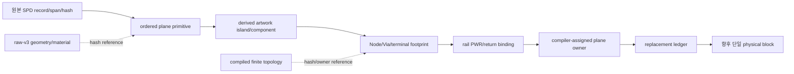

# SPD Decap PI Evaluator v0.23.1 — Source-derived physical IR

- 상태: **ACCEPTED / Phase 1 DONE / Phase 2 ACTIVE**
- 스키마: `source-plane-ownership-ir-v1`
- 최종 개정: 2026-08-28 (Asia/Seoul)

## 1. 목적

이 IR의 목적은 원본 SPD에서 PowerSI 근접 `Zii` 계산에 필요한 source identity,
plane geometry lineage, stackup/material provenance, terminal footprint와 solver owner
관계를 한 번의 import에서 보존하는 것이다. IR 자체는 정확도 개선이 아니며,
source-derived 물리식 하나를 중복 stamp 없이 교체하기 위한 전제다.

17DV의 `STOP_NO_AUTHORITATIVE_BRIDGE`는 원본 SPD에 정보가 없음을 뜻하지 않는다.
기존 persisted artifact가 import 중 계산된 관계를 보존하지 못했음을 뜻한다.

## 2. 결정

원본 SPD를 solve 때마다 다시 읽거나 raw-spatial v3를 변경하지 않는다. importer가
source graph와 live artwork island resolver를 동시에 가진 시점에 compact SQLite
draft를 만들고, 기존 raw-v3와 compiled-topology identity가 생성된 뒤 hash binding을
완성한다.

IR에는 polygon vertex, WKB, 원본 bytes를 복제하지 않는다. geometry와 finite
topology는 기존 hash-bound asset을 참조한다. SPD에 존재하지 않는 legacy solver
owner 또는 PowerSI 내부 mesh/object ID를 source-authored 값으로 주장하지 않는다.
plane owner는 source identity에 결속해 importer/compiler가 결정적으로 부여한다.

## 3. Canonical relation

| 영역 | 보존 대상 | 핵심 경계 |
|---|---|---|
| source | record kind/order, byte span, exact-record SHA | source file SHA와 범위 검증 |
| plane | surface, ordered primitive, polarity/kind, raw-v3 primitive identity | primitive와 island는 일대일이라고 가정하지 않음 |
| island | derived island/component identity와 primitive witness | positive/negative Boolean lineage는 다대다 |
| material | stackup thickness/conductivity, Dk/Df 각 값의 origin과 exact source record | Layer/Material 출처를 필드별로 구분 |
| rail | logical NET, artwork NET, layer, PWR/return surface | layer display token을 NET으로 사용하지 않음 |
| terminal | branch/pin→Node→Via→finite vertex/edge→exact rail island→PadDef+Regular footprint | 전체 chain이 있어야 complete |
| ownership | retained Via/device/terminal owner와 declared plane owner | namespace disjoint, exact-once |
| replacement | replaced/retained set hash와 상태 | Phase 1은 `prerequisite_only`만 허용 |

## 4. 불변조건

1. 모든 source span은 source size 안에 있고 exact record hash와 일치한다.
2. retained primitive는 surface별 source order와 raw-v3 ordinal에 정확히 한 번 나타난다.
3. island는 surface/component 하나에 속하고 positive primitive witness를 하나 이상 가진다.
4. primitive↔island lineage는 다대다이며, 사라진 primitive는 명시적 no-survivor 상태다.
5. logical rail NET, artwork NET, layer display name은 별도 필드다.
6. material 값마다 source, layer override, material model 또는 unavailable origin과
   그 값의 exact source record를 함께 보존한다. unavailable conductivity는 값과
   source reference가 모두 없다.
7. complete terminal은 rail→pin→Node→Via→finite edge/vertex→rail-bound island→
   PadDef+Regular→raw pad footprint가 완전하다. 불완전한 selected rail은 IR 없이 STOP한다.
8. compiler plane owner는 retained owner namespace와 충돌하지 않는다.
9. `replacement_ready`는 실제 consumer가 동일 owner를 운반하고 owner conservation을
   통과하기 전에는 기록할 수 없다.
10. 모든 table은 row count와 canonical logical SHA를 가진다.

## 5. 생성 수명주기

1. 기존 SPD parser가 필요한 source record span과 hash를 수집한다.
2. connectivity recovery 후 live artwork가 유지되는 동안 primitive/island 관계와
   rail/terminal draft를 만든다.
3. live Shapely geometry를 정상 해제한다.
4. 기존 raw-v3와 compiled topology를 변경 없이 생성한다.
5. draft를 source/project/certificate/topology/raw identity에 결속하고 SQLite를 한 번
   압축해 scenario attachment로 저장한다.
6. 실패하면 draft와 임시 DB를 폐기하고 부분 attachment를 남기지 않는다.

## 6. 단계와 검증 예산

### Phase 1 — storage contract

DONE. importer와 solver를 수정하지 않고 deterministic SQLite writer/loader,
schema validation과 synthetic round-trip을 구현했다. 선택 rail 관계 전체에
100,000행 상한을 두고 terminal은 complete-only로 닫았다.

Whitelist:

- `docs/PRODUCT_PURPOSE_AND_TECHNICAL_BASELINE.md`
- `docs/WORK_EXECUTION_BASELINE.md`
- `docs/SOURCE_DERIVED_PHYSICAL_IR.md`
- `src/spd_decap_pi/source_plane_ownership_ir.py`
- `tests/test_source_plane_ownership_ir.py`

Validation budget:

- V0: `git diff --check`와 문서/schema 정적 확인 1회
- V1: `tests/test_source_plane_ownership_ir.py` 1회
- V2 이상, 원본 SPD, raw-v3 재생성, solver, Touchstone, W6/PowerSI 비교 금지

Closure evidence: `python -m pytest -q tests/test_source_plane_ownership_ir.py`
→ `7 passed in 0.84s`. 이 결과는 storage contract만 검증한다.

### Phase 2 — importer producer seam

ACTIVE. source span 수집, cleanup 전 draft 생성, raw/compiled identity finalization과
scenario envelope 검증을 작업 기준 12.6의 별도 whitelist로 연다. 이 단계도
`Zii`를 변경하지 않는다.

### Phase 3 — single physical consumer

source-certified PWR/return surface와 complete terminal footprint 하나를 선택해
surface-patch plane current-spreading R/L block을 old plane owner와 disjoint하게
교체한다. uniform-strip R/L과 `C=epsilon0*epsilonr*A/d`를 각각 물리 limiting-case로
검증한 뒤에만 bounded correlation gate를 고려한다.

## 7. 주장 한계

- Phase 1/2 PASS는 source identity와 ownership prerequisite만 증명한다.
- reciprocity, passivity, deterministic replay는 non-regression이며 PowerSI 정확도
  개선 증거가 아니다.
- PowerSI 데이터는 comparison gate에만 사용하고 parameter fitting 입력으로 쓰지
  않는다.
- 17DU/17DV historical STOP은 재실행하거나 성공으로 재분류하지 않는다.
