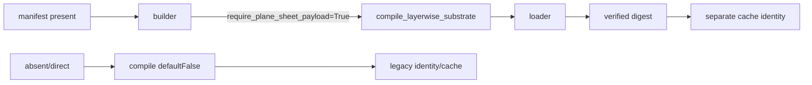

# SPD Decap PI Evaluator 작업 기준

- 적용 제품: **SPD Decap PI Evaluator v0.23.0**
- 문서 버전: **1.99**
- 상위 기준: [목적·기술 기준](PRODUCT_PURPOSE_AND_TECHNICAL_BASELINE.md) v1.98
- W6-BASE source-before: clean `main` HEAD `fb36288781dcc0b884950ef5a486c474090ceebd`; this is the exact source boundary for the completed one-run evidence
- 상태: **APPROVED/MACHINE-FROZEN CONTROL DOCUMENT**; full phase/item history lives in the register and changelog; W5 DONE; W6-BASE 260729 numerical FAIL; W7-PHYS BLOCKED; 17AX BLOCKED/STOP; 17AY DONE (location evidence); 17AZ BLOCKED/STOP (source-classified delegated substrate owner); 17BA BLOCKED/STOP (boundary span627>500); 17BB BLOCKED/STOP (cache-only multiple clusters); 17BC BLOCKED/STOP (endpoint truncation + delegated identity); 17BD DONE (location evidence); 17BE BLOCKED/STOP (raw-v3/hash seam unproven); 17BF BLOCKED/design REJECT; 17BG BLOCKED/STOP (canonical payload/content identity delegated); 17BH BLOCKED/source-classified STOP (lifetime trace endpoint incomplete); 17BI DONE/PASS; 17BJ DONE/PASS; 17BK BLOCKED/source-classified STOP (validator field/type/unit/layer/net semantics delegated); 17BL DONE/location PASS (validator boundaries 1280/1323); 17BM DONE/PASS (local validator contract; physical ownership BLOCKED); 17BN DONE/PASS (typed immutable facade; physical scope unproven); 17BO BLOCKED/design REJECT (surface/island field-domain equivalence unproven); 17BP BLOCKED/source-classified location STOP (required surface-row producer missing); 17BQ DONE/location PASS (unique producer at raw_spatial_contact_compiler.py:2575); 17BR BLOCKED/boundary STOP (258-line span >160); 17BS ACTIVE. Any physical implementation following a future PASS remains separately gated by fresh whitelist/test authority.
- 현재 권위 상태: sole ACTIVE 17BS is a bounded local constructor trace. Exact one-time numbered read is restricted to `src/spd_decap_pi/raw_spatial_contact_compiler.py` lines2550-2600; endpoint/semantic delegation STOP with no expansion. PASS only if constructor line2575 and relevant source/artwork identity plus net/layer normalization/validation are complete and direct/validated in-range. No source expansion/code/test/physical ownership/stamp/production/accuracy execution beyond this bounded read.
- 최종 개정: 2026-08-26 (Asia/Seoul)

## 1. 압축 후 즉시 복구 카드

context가 압축되거나 새 session에서 작업을 재개하면 다른 연구 문서를 먼저
읽지 말고 이 표부터 확인한다.

| 항목 | 현재 값 |
|---|---|
| 변하지 않는 목적 | source-derived single-rail `Zii`의 PowerSI 근접 정확성과 일반화 |
| 현재 branch | `main`만 사용; 정리된 과거 branch를 다시 조사하지 않음 |
| 현재 active work item | `W7-PHYS-W6-RAW-SURFACE-CONSTRUCTOR-LOCAL-TRACE` (17BS) |
| 다음 권장 묶음 | `17BS` exact once-only numbered constructor read 2550-2600 |
| current authorization | 17BS bounded read: use the recorded Get-Content numbered command exactly once for compiler.py lines2550-2600; no expansion/retry. Require complete constructor line2575, immediate origins, source/artwork identity, and net/layer normalization/validation direct or validated in-range; endpoint/external-helper delegation STOP. Field-domain/provenance only; islands/electrical ownership/stamp/accuracy remain separate. |
| 17T command A | `rg -n --no-heading --color never --glob '*.py' '\bcompile_raw_spatial_contact_asset\b' 'src/spd_decap_pi'` |
| 17T command B | `rg -n --no-heading --color never --glob '*.py' '\b(?:resolve_solver_profile|numerical_worker_count|build_layerwise_uniform_source_model)\b' 'src/spd_decap_pi'` |
| 17T command C | `rg -n --no-heading --color never --glob '*.py' '\b(?:GLOBAL_KRON|SurfacePatchDifferentialProjection|SurfacePatchFinitePortProjection|assemble_differential_admittance|differential_projection)\b' 'src/spd_decap_pi'` |
| consumed 17M discovery | canonical rg ran once (exit 0), found candidate symbols only; no reuse or production proof |
| future production invariant (not current authority) | if a future run is authorized: exact clean `main`, new output root, one run/no retry; B correlation is historical evidence; C/D consumed their exactly-one old candidate/import reads; E had one production diagnostic invocation plus one orchestration ZIP read; old root remains forbidden for W6-BASE output/scoring/retry/mutation |
| 고비용 검증 권한 | none; 17BS allows only one bounded 51-line source read, with source expansion/code/test/build/import/production execution forbidden |
| 현재 정확성 상태 | `260729 retrospective FAIL`; unseen/generalization remains `unknown / not_run` |
| 현재 release 계산 증거 | W6-BASE 260729 completed numerical FAIL; offline verifier exit 2 (integrity-valid) |
| W6-BASE result root | `D:\SPD-Decap-PI-Evaluator-W6\fb36288781dcc0b884950ef5a486c474090ceebd\260729` — manifest `2b14f90e762abc49833518137812e8fc97fcde0e9c145795b7384210cfd9f5de`, sidecar `0d103e0ad47df80641fac0952a35a6eaa56cc9fdb71be24661903e451926e932`, correlation `969e40046e3a099d09557ba7500693460362336d76b067962436bd3b5177abc4` |
| W6 attempt root | `D:\SPD-Decap-PI-Evaluator-W6\46d17dc73381d4292ea342d7a10e85d4f2e338f6\260729` (immutable; B correlation is historical; C/D reads are consumed; E had one production candidate/import invocation plus one separate orchestration ZIP read and did not use correlation; no W6-BASE output/scoring/retry/mutation; all output is fresh-root only) |
| W6-BLOCK-B diagnostic | `D:\SPD-Decap-PI-Evaluator-W6-Diagnostics\6bbe44e2f36610755103757d6a4502c9ed9760d3\260729-vtrip0-1khz` — exit 1, no report/artifact |
| W6 tombstone | `blocked_partial.json` SHA `b81525bd47744dc1ea5c75bb26f20ea354246ad88b8ce5bc9aef131cb50c09f7`; old policy SHA `c362acb01ef28cefbbd1d32753f86bccafbdd53355b42eda83c03a6ea810698b` |
| source/bundle boundary | W6-BASE ran once from clean `main` HEAD `fb36288781dcc0b884950ef5a486c474090ceebd` into its brand-new root; B correlation is historical, C/D reads are consumed, E did not use correlation, and no retry/reuse/mutation occurred |

최초 목적은 [목적·기술 기준 2장](PRODUCT_PURPOSE_AND_TECHNICAL_BASELINE.md#2-최우선-목적),
현재 증거 상태는 [6장](PRODUCT_PURPOSE_AND_TECHNICAL_BASELINE.md#6-증거와-상태-표기)이
권위 있다. 이 문서는 그것을 재정의하지 않는다.

## 2. 문서 사용 규칙

### 2.1 두 문서만 기본 context로 사용

작업 시작 시 기본 입력은 다음 두 개뿐이다.

1. `PRODUCT_PURPOSE_AND_TECHNICAL_BASELINE.md`
2. `WORK_EXECUTION_BASELINE.md`

active work item에 명시된 source/test/subsystem 문서만 추가로 읽는다. 전체
`docs/evaluation-research`, session log, 과거 release note 또는 branch 역사를
일괄 로드하지 않는다.

### 2.2 이 문서가 관리하는 것

- 현재 active work item 하나
- 우선순위와 명시적 제외 범위
- 변경 묶음과 root-cause 경계
- 검증 단계, 실행 조건, 예상 비용, 최대 횟수와 중단 조건
- exact source/input/profile/artifact identity
- 완료 결과와 다음 사용자 결정

목적, 제품 sign-off 범위 또는 PowerSI 수치 합격선은 이 문서에서 임의로 바꾸지
않는다. W6 one-run production authority는 260729 completed numerical FAIL과
함께 소진되었고 W7 audit도 owner 미분류로 종료되었다. 향후 production rerun은
사용자가 새 read-only active item을 선택해 필요한 source evidence를 확보한 뒤,
정확히 하나의 source-derived block을 분류하고, 정확히 한 physical change → focused evidence → 새 gate 순서를
거쳐야 한다. 260804/P5/unseen은 개발 case FAIL 동안 금지한다.
remote/release/installer, old-root reuse/mutation, retry, threshold/fallback 변경은
승인되지 않았다.

### 2.3 갱신 시점

이 문서는 다음 시점에만 짧게 갱신한다.

1. 사용자가 active work item을 승인했을 때
2. 변경 묶음이나 검증 예산을 확정했을 때
3. milestone 검증 직전과 직후
4. item 완료, 차단 또는 명시적 보류 시

대화별 진행 로그, 긴 stdout, 반복 설명은 넣지 않는다. raw log/artifact는 별도
경로에 두고 이 문서에는 identity, 요약 판정과 링크만 기록한다.

## 3. 작업 우선순위와 단계

제품 위험 우선순위와 실제 실행 순서를 구분한다. PowerSI 정확성은 최상위 제품
위험이지만, 수정 효과를 판정할 test/evidence 기반부터 최소 비용으로 복구한다.

| 단계 | 목적 | 종료 조건 | 고비용 검증 |
|---|---|---|---|
| `W0` | 두 canonical 문서 고정 | 목적/작업 문서 상호 링크와 문서 검증 | 금지 |
| `W1` | product-core test truth 복원 | stale test 계약 정리, bounded core selection 확정 | 금지 |
| `W2` | 범위가 확정된 SPD/I/O 결함 수정 | focused checks 통과, 실제 결함별 회귀 check 존재 | 금지 |
| `W3` | product-core CI gate 활성화 | W1/W2 묶음이 한 번의 core suite에서 green | production solve 금지 |
| `W4` | solver 수치 신뢰성 선행 문제 해결 | synthetic/analytic focused gate 통과 | full correlation 금지 |
| `W5` | 정확성 계약과 frozen baseline 준비 | 사용자 승인 수치 gate, reference partition, exact run manifest | 실행 전 승인 필요 |
| `W6` | current frozen candidate 1회 baseline | completed solve와 raw hash-bound artifact, rail별 판정 | consumed: 260729 exact one-run 결과 보존 |
| `W7` | model-form error를 한 owning block씩 개선 | 사전 가설과 focused evidence 통과 | 승인된 candidate만 1회 |
| `W8` | completed-solve release gate 및 전달 | 계산·artifact·installer가 exact release commit에 결속 | 최종 1회 |

`W1`부터 `W4`까지는 production SPD 전체 correlation 없이 닫는 것이 원칙이다.
`W6` one-run gate는 260729에서 소진되었다. W7 audit가 실패해 owner를 분류하지
못했으므로, 향후 재실행은 사용자가 선택한 새 exclusive-owner classification item이
닫힌 뒤 physical change/evidence/gate 순서와 exact clean `main`, brand-new output
root, one-run/no-retry 조건을 다시 확정할 때만 고려한다.

## 4. 작업 항목 register

상태 어휘는 `READY`, `ACTIVE`, `BLOCKED`, `DEFERRED`, `DONE`만 사용한다. 동시에
`ACTIVE`는 하나만 허용한다.

| ID | 순서 | 상태 | 작업 묶음 | 완료 기준 |
|---|---:|---|---|---|
| `W0-DOC` | 0 | DONE | 목적·기술 기준과 이 작업 기준 작성 | 상호 링크, Markdown/link/diff 검증 |
| `W1-TEST` | 1 | DONE | stale test double·구형 정책 기대를 current v0.23 계약에 맞게 정리하고 product-core selection 고정 | 실제 결함은 red로 남기고 test 자체 오류 제거 |
| `W2-SPD-A` | 2 | DONE | source-graph target contact persistence 복구 | target-layer coordinate가 저장·사용되는 focused regression |
| `W2-SPD-B` | 3 | DONE | graph-contact `source_sha256` 교차 검증 | 다른 source coordinate가 scenario validation에서 차단 |
| `W2-SPD-C` | 4 | DONE | `blocking:false` mixed-reference warning이 import를 중단하는 문제 수정 | warning-only case import 성공, blocking case 차단 유지 |
| `W2-IO-A` | 5 | DONE | Distribution/Tuned CSV atomic replace | write 실패 시 기존 파일 보존 |
| `W2-IO-B` | 6 | DONE | 대형 `.spdpi` load cancellation과 load 중 close 경로 | 기존 loader callback 재사용, 취소 후 stale state 없음 |
| `W3-CI` | 7 | DONE | 짧은 product-core lane을 required CI로 연결 | parser/scenario/solver/Distribution/GUI I/O 핵심 경로 green |
| `W4-FREQ` | 8 | DONE | adaptive frequency가 sample 사이 narrow peak를 보지 않고 converged 처리하는 blind spot | midpoint/coverage focused case가 peak 누락을 검출 |
| `W4-COND` | 9 | DONE | ill-conditioned sparse solve의 결과 신뢰성 gate | residual과 별도 conditioning/forward-reliability 판정 |
| `W5-GATE` | 10 | DONE | approved gate/partition/manifest plus trust-boundary adapter/controller evidence | focused trust tests and bounded V3 green |
| `W6-BLOCK-A` | 11 | DONE | versioned Layerwise comparison-runner template parity | layerwise diagnostic/correlation에만 terminal-complete 입력 보강; frozen base/physics/pivot gate unchanged |
| `W6-BLOCK-B` | 12 | BLOCKED | immutable failed-run pivot classification before rerun | 2.543e17 pivot reproduced at VTRIP/0 1 kHz, but factor context was absent; root cause remains unclassified |
| `W6-BLOCK-C` | 13 | DONE | preserve deterministic factor/matrix context at the existing fail-closed pivot | exact one-run context retained; no solver/threshold/cache/physics change |
| `W6-BLOCK-D` | 14 | DONE | estimate raw-system sparse condition lower bound at the fail-closed pivot | exact diagnostic lower bound retained; no threshold relaxation |
| `W6-BLOCK-E` | 15 | DONE | classify and gate the rejected factor after row-scaled sparse solve | exact one-shot diagnostic met finite admittance, scaled pivot, and original residual gates; no threshold/fallback change |
| `W6-BASE` | 16 | DONE | exact clean main HEAD의 retrospective one-run baseline | 260729 completed manifest/sidecar, integrity-valid offline FAIL; no retry |
| `W7-PHYS` | 17 | BLOCKED | source-derived owning block이 분류되지 않아 physics 변경 보류 | exclusive owner가 분류될 때까지 260804/P5·production rerun 금지 |
| `W7-PHYS-AUDIT-MOUNTED-PATH` | 17A | DONE (negative/unclassified) | completed 260729 FAIL artifact의 mounted-path/physical error decomposition | cap-only peak prerequisite 실패; owner null; code/physics 변경 없음 |
| `W7-PHYS-OWNER-TERMINAL-VIA-VS-SPATIAL` | 17B | DONE (negative/evidence-unavailable) | persisted terminal-Via self-R/L·landing geometry의 exclusive ownership read-only 분류 | target path evidence 누락으로 exit 2/no owner; physics authorization 없음 |
| `W7-PHYS-EVIDENCE-MISSING-PATH-COVERAGE` | 17C | DONE (diagnostic-complete; negative/evidence-unavailable) | 8,986 selected decaps의 persisted terminal path coverage | available 0/missing 19,218/trace_NA 0; owner null; physics authorization 없음 |
| `W7-PHYS-PRODUCTION-VIA-ROUTE-SOURCE-TRACE` | 17D | DONE | W6 finite Via links의 단일 source call-chain/ownership 정적 추적 | source-classified raw-base/global finite-route ownership (v4 scenario network); local calibrated half-branches not selected; mixed fail-closed; confidence high/source-proven |
| `W7-PHYS-RAW-FINITE-VIA-RL-GENERATION-TRACE` | 17E | DONE (producer unclassified; high confidence) | six-file producer call-chain/source trace | reachability-produced fields and exact handoff are bound; producer formula/unit conversion and runtime binding remain unknown; no physics/accuracy claim |
| `W7-PHYS-GROUND-REACHABILITY-RL-PRODUCER-TRACE` | 17F | DONE (producer delegated/unclassified; high confidence) | `recover_spd_ground_reachability` geometry/provenance and R/L handoff trace | local R/L formula/fallback absent; delegate `src/spd_decap_pi/_core/via_model.py::estimate_via_segment_rl`; multi-segment/full-span contract unresolved; no accuracy/physics claim |
| `W7-PHYS-VIA-SEGMENT-RL-MODEL-TRACE` | 17G | DONE (source-classified model; conditional caller-contract bug confirmed) | one-file R/L equation/policy trace plus caller handoff review | W6 exposure unknown; no accuracy/physics owner claim |
| `W7-PHYS-MULTISEGMENT-RL-CALLER-FIX` | 17H | BLOCKED (fixture-contract red; production diff statically accepted and retained uncommitted) | bounded V0 plus focused regression | exact whitelist `src/spd_decap_pi/_core/io/spd.py`, `tests/test_io_spd.py`; node exit 1, no rerun |
| `W7-PHYS-CORRECTED-SUCCESSOR` | 17H successor | BLOCKED (static REJECT; zero pytest executions) | long Via used DR-0102_60 without GND PadDef and long stackup omitted intermediate PWR | original 17H remains blocked; no technical rerun |
| `W7-PHYS-CORRECTED-SUCCESSOR-2` | 17H successor-2 | DONE | long-Via-only padstack TOP/PWR/GND, full analysis stackup, short TOP→PWR existing DR | exact node once: exit0, 1 passed in1.08s, wall~2.07s; commit `7fd8df9` exactly two files |
| `W7-PHYS-W6-MULTISEGMENT-EXPOSURE` | 17I | DONE (source-classified evidence unavailable; actual exposure unknown) | determine whether the fixed conditional branch was present in frozen 260729 evidence | candidate/compiled/runtime term evidence was insufficient; no exposure claim |
| `W7-PHYS-PLANE-SHEET-NONUNIFORM-RL-SOURCE-TRACE` | 17J | DONE (local stamps source-classified; Maxwell partial generation external/unclassified) | determine whether W6 layer-surface stamps position/material-dependent plane-sheet series R/L or current-spreading/nonuniform corrections | no runtime coefficient/causality/accuracy claim |
| `W7-PHYS-MAXWELL-PARTIAL-SOURCE-TRACE` | 17K | DONE (local adjacent-gap dispersive admittance classified; Maxwell C/dispersion/load/solver insertion external) | classify the uniform C00 delegate boundary | no local plane-sheet R/L/nonuniform claim; external delegate boundaries remain unclassified |
| `W7-PHYS-MAXWELL-CAPACITANCE-PRODUCER-TRACE` | 17L | DONE (exact 2D polygon-overlay lumped parallel-plate Maxwell C source-classified; W6 inputs/asset fidelity external) | classify retained-artwork C generation boundary | no frequency/complex-Y/conductivity/sheet R/L/skin/nonuniform/current-spreading claim |
| `W7-PHYS-PLANE-SHEET-RL-REUSE-DISCOVERY` | 17M | DONE (canonical rg once, exit 0; candidates found; no reuse/production proof) | classify solver-directory candidate symbols | no implementation/W6 binding claim |
| `W7-PHYS-COPPER-SURFACE-IMPEDANCE-REUSE-TRACE` | 17N | DONE (surface-impedance constitutive law and MFDM stamp source-classified; W6 reuse unclassified/STOP) | close helper/MFDM reuse boundary | one-/two-face coth/csch Ω/square; DC `1/(σt)`; high-frequency transfer→0; no W6 reuse claim |
| `W7-PHYS-SURFACE-PATCH-PLANE-REUSE-TRACE` | 17O | DONE (surface-patch local solver/operator source-classified; whole-solver W6 compatibility reuse unclassified/STOP) | bind the caller’s retained-artwork-like geometry/material integration, network/admittance boundary, topology/ownership, dependencies, and numeric gates | polygon clip/mesh and constant-signature strips; scalar σ/t and dielectric provenance; helper + gap L + dielectric C/loss differential nodal S; common-potential null/differential-only; absolute MNA rejected; no terminal/Via/pad/antipad/fringe/full-wave; no drop-in W6 reuse proof |
| `W7-PHYS-W6-PLANE-SHEET-REIMPLEMENTATION-DESIGN` | 17P | BLOCKED (design before coding; replacement profile decision frozen) | explicit `layerwise_surface_patch_v1` replacement profile | historical profile unchanged/no automatic fallback; new profile owns polygon C/loss + lateral gap L + sheet impedance, disables old plane Maxwell C/ideal plane topology, retains finite Via + termination once, fail closed on missing evidence; app v0.23.0, exact solver identity pending |
| `W7-PHYS-W6-PLANE-SHEET-ADAPTER-BINDING-TRACE` | 17Q | BLOCKED (external binding incomplete) | close the five-file adapter trace | profile/fallback, worker/cache, raw geometry/material provenance, differential nullspace/final rail-order Zii, and no-double-counting owner transition remain external; no implementation-ready adapter |
| `W7-PHYS-W6-PLANE-SHEET-INTEGRATION-BINDING-TRACE` | 17R | BLOCKED (source-classified; five acceptance items UNPROVEN) | bind opt-in no-fallback profile, hash-bound inputs, balanced differential incidence, stable rail/Zii output, and exact ownership transitions | clean `8451c4afca57fb46e89b7096026b281ba54bbf52`; exact three-file read once; profile/application enforcement, raw/full hydration boundary, differential/nullspace/Zii, owner-off seam, and cache/worker proof remain unbound; stop with no fourth read or whitelist expansion |
| `W7-PHYS-W6-PLANE-SHEET-SOURCE-CONTRACT-TRACE` | 17S | BLOCKED (source-classified; approved asset path missing) | bind services/profile enforcement, hash-bound surface certificate inputs, balanced termination/nullspace and stable rail/Zii, and Via/termination ownership | clean `bc0147e5e15b91a77593ad7306b492aae3079d4c`; services.py and layer_surface_termination.py read once; approved surface_certificate_asset.py missing (`Cannot find path`); no search/substitution/fourth read; all joint acceptance unmet; resume requires explicit path-discovery/source-contract authorization |
| `W7-PHYS-W6-PLANE-SHEET-BOUNDED-PATH-DISCOVERY` | 17T | BLOCKED (source-classified; A/B/C insufficient) | identify bounded producer/profile/worker/differential integration candidates without opening files | clean `57aae22531d481623d34b6fb1b68bc0a201702c9`; A 4/2, B 29/4, C 12/1 lines/files; future budget A1/B0/C0; no additional search/read/expansion |
| `W7-PHYS-W6-RAW-SPATIAL-PAYLOAD-CONTRACT-TRACE` | 17U | BLOCKED (source-classified) | compile input/output/types/units/limits; complete layer/net polygon geometry, ordered sigma/thickness, dielectric spacing/epsilon/loss/dispersion provenance and source hashes; bounded deterministic/hashable payload without raw-SPD/full-Scenario hydration | clean `main` HEAD `c6c5dec9ceab37a2011b1f7bd2eedc4e87d00ef5`; compiler trust/resource/determinism/fail-closed are proven, but `raw_spatial_contact_asset.py` and `surface_certificate_asset.py` delegates leave payload assembly/certificate envelope and required completeness unproven |
| `W7-PHYS-W6-RAW-SPATIAL-ASSET-CERTIFICATE-CONTRACT-TRACE` | 17V | BLOCKED (source-classified) | Q1/Q2 asset and certificate contract | clean `main` HEAD `6bec2ab4b7f2d1ef094c0ad44df198f37fc05fb4`; structural schema/hash/bounds and certificate envelope checks are proven, but complete polygons/material/dielectric fields and solve-ready payload are absent; no profile/nullspace/Zii/cache claim |
| `W7-PHYS-W6-RAW-PLANE-MATERIAL-SOURCE-DISCOVERY` | 17W | DONE (source-classified) | locate exactly one `SpdAnalysis` and one `ProjectSpec` definition owner without rereading prior files | clean main HEAD `43b244909b4bbb03057666a2451b14f2cce566e5`; exact query once returned 2 lines/2 files; `domain.py` was unread and `spd.py` was prior-17F evidence, so no reread; future owner whitelist max 1–2 unread files, each once |
| `W7-PHYS-W6-PROJECTSPEC-PLANE-MATERIAL-OWNER-TRACE` | 17X | BLOCKED (source-classified; existing-contract gap) | bind ProjectSpec plane/material owner fields and a deterministic compiler handoff | clean main HEAD `9b4e8fde1d7b463272bd41c8d42416a508734bdf`; same-file geometry/material evidence is available, but compiler handoff is absent and frozen17F remains unproven; no implementation |
| `W7-PHYS-W6-RAW-SPATIAL-V3-TEST-PATH-DISCOVERY` | 17Y | BLOCKED (source-classified; 0-match filename query) | locate an existing raw-spatial test path for a bounded v3 contract | clean main HEAD `94df6d30cb1b6e8e1be686e311e7ebaa2e96e6b9`; exact query once returned no path (rg exit 1); filename absence only, no second query/open |
| `W7-PHYS-W6-RAW-SPATIAL-V3-TEST-SYMBOL-DISCOVERY` | 17Z | DONE (source-classified) | locate one compiler-referencing raw-spatial test symbol owner | clean main HEAD `4f5d149a1e803caa2a2b78b854b6579cafb3bed4`; exact query once returned 17 lines/5 files; unique compiler reference is `tests/test_raw_spatial_contact_compiler.py`, other matches are builder/validator-only; no second query/open |
| `W7-PHYS-W6-RAW-SPATIAL-ASSET-V3-EMISSION` | 17AA | BLOCKED (test-gate) | implement opt-in hash-bound schema-v3 plane-sheet payload and focused test | exact `pytest -q` command ran once, exit1, `1 failed in 1.55s`; `_plane_sheet_payload` returned `RAW_SPATIAL_PLANE_SHEET_REQUIRED` / `ProjectSpec stackup physical fields are incomplete`; no rerun; the three paths were later atomically committed as `c7306f2b2633b8d610bb962eb5b64966235afd2f` (3 files, 618 insertions/21 deletions) |
| `W7-PHYS-W6-RAW-SPATIAL-ASSET-V3-EMISSION-S1` | 17AA-S1 | BLOCKED (test-gate) | typed StackupLayer/fixture contract correction | exact node once, exit1, `1 failed in 1.51s`; `_plane_sheet_rows` line 1389 raised `KeyError: 0` from direct circle lookup for a polygon with no circle rows; source-classified asset grouping bug; no rerun |
| `W7-PHYS-W6-RAW-SPATIAL-ASSET-V3-EMISSION-S2` | 17AA-S2 | DONE (test-gate PASS) | asset grouping correction | approved focused node ran once under S2, exit 0, `1 passed in 1.09s`; no rerun/broad/production |
| `W7-PHYS-W6-RAW-SPATIAL-V3-PERSISTENCE-OWNER-DISCOVERY` | 17AB | DONE (source-classified) | discover one existing persistence owner/caller | exact frozen query ran once on clean `main`, exit 0, 26 lines/5 files; useful unique seam is `src/spd_decap_pi/spd_adapter.py` (imports both keys, requires compiled manifest, normalizes/sets `RAW_SPATIAL_CONTACT_ASSET_METADATA_KEY`); other matches are definitions/validator, sibling compiled builder/persistence in `surface_certificate_asset`, and compiled reader in `layerwise_network`; location evidence only |
| `W7-PHYS-W6-RAW-SPATIAL-V3-SPD-ADAPTER-PERSISTENCE-TRACE` | 17AC | BLOCKED (source-classified STOP) | read the bounded SPD-adapter persistence seam and answer owner/normalization/v3/delegate questions | one authorized read of lines 100-215: `_has_compiled_topology_manifest` 114-128 and `_merge_raw_spatial_contact_asset` 131-206 prove copy-on-write persistence, exact generated attachment name/type/payload match, casefold collision rejection, canonical metadata-key preservation, and divergent manifest rejection; v3 semantic validation and compiler/caller ownership remain unproven/delegated |
| `W7-PHYS-W6-RAW-SPATIAL-V3-MERGE-CALLER-DISCOVERY` | 17AD | DONE (source-classified) | locate at most one non-definition caller of the raw-spatial merge seam | clean main HEAD `7537c8ebee9109071db54cc84f5562e375bfc07f`; exact frozen query once, exit 0, 2 output lines/1 file; definition `src/spd_decap_pi/spd_adapter.py:131`, exactly one selected non-definition caller `src/spd_decap_pi/spd_adapter.py:7868`; location evidence only, no files opened or compiler/delegate inference |
| `W7-PHYS-W6-RAW-SPATIAL-V3-MERGE-OWNER-BOUNDARY-DISCOVERY` | 17AE | DONE (source-location boundary evidence) | bracket the selected merge caller with top-level owner/signature definitions | clean main HEAD `c5f3b1a234c8deeffa26b0fa6cf60dabc4d576d9`; exact frozen PowerShell once exit0, exactly 2 lines/1 file: `src/spd_decap_pi/spd_adapter.py:6423:def import_spd_scenario(` and `src/spd_decap_pi/spd_adapter.py:8024:def verify_scenario_source(`; 1601-line span is not reasonably bounded, so no contiguous/implementation read or compiler/delegate inference |
| `W7-PHYS-W6-RAW-SPATIAL-V3-COMPILER-MERGE-SYMBOL-DISCOVERY` | 17AF | DONE (source-classified) | locate compiler symbol relative to the known merge call | clean main HEAD `e4a6704247770cce084fd70fa3d5307f95a3a64a`; exact frozen query once exit0, 4 lines/1 file: line45 compiler import, line131 merge definition, line7860 actual non-import/non-definition compiler call, line7868 known actual merge call; nearest compiler-to-merge span 8 lines <=120; location evidence only, no file open/inference beyond placement |
| `W7-PHYS-W6-RAW-SPATIAL-V3-COMPILER-MERGE-CALLSITE-TRACE` | 17AG | DONE (integration-gap evidence) | read the bounded compiler/merge callsite and adjacent control boundary | clean main HEAD `300d5aacc6386ad8c55ce6bd198ab207fb1f4597`; exact read lines 7848-7885: guard 7854; compiler tuple 7859-7867 omits `include_plane_sheet_payload=True` (actual schema-v2); merge/rebind 7868-7873; envelope validation 7874-7877; success/block 7878-7881; 7882 onward unrelated sorting, endpoint-truncated downstream persistence/return UNPROVEN; no standalone fix/root-cause claim |
| `W7-PHYS-W6-RAW-SPATIAL-V3-ADAPTER-TEST-SEAM-DISCOVERY` | 17AH | DONE (bounded location evidence) | locate one existing adapter test seam for later bounded trace | clean main HEAD `d45a23f62ebd417a50498724bdea79ba77d8d041`; exact query once exit0, 22 lines/1 file; `import_spd_scenario` import line70 and non-import calls lines 509, 587, 618, 647, 698, 791, 863, 965, 1207, 1208, 1229, 1249, 1272, 1291, 1409, 1450, 2298; RAW metadata key import45/checks1750, 1752, 2487; no compiler/include flag matches; location evidence only, no test owner selected |
| `W7-PHYS-W6-RAW-SPATIAL-V3-ADAPTER-TEST-OWNER-BOUNDARY-DISCOVERY` | 17AI | BLOCKED (gate STOP) | bracket observed metadata checks with one top-level adapter test owner | clean main HEAD `0b9e75f5367c12e76e8e06edb652f112d518b69d`; exact frozen PowerShell once exit2, zero output; no rerun; failure stage unclassified among silent gates, no inferred cause |
| `W7-PHYS-W6-RAW-SPATIAL-V3-ADAPTER-TEST-OWNER-BOUNDARY-DIAGNOSTIC` | 17AJ | DONE (deterministic owner-location evidence) | diagnose the silent owner-boundary gate without opening source files | clean main HEAD `4aaf242dc6da530b600b01e924f4a9c01ab88c01`; exact diagnostic once exit0, exactly 4 lines for expected file; target1750 bracket 1736 `test_raw_spatial_member_merge_is_collision_safe_and_nonmutating` to1764, no frozen 17AH non-import call; target2487 bracket 1764 `test_import_runs_one_union_reachability_pass_and_persists_surface_certificate` to EOF sentinel, contains frozen call2298; exactly one owner selected |
| `W7-PHYS-W6-RAW-SPATIAL-V3-ADAPTER-OPTIN-TEST-SEAM-TRACE` | 17AK | BLOCKED (source-classified endpoint STOP) | trace the selected owner with two bounded excerpts for opt-in regression seam viability | clean main HEAD `286e939fce53918465de72f8be9b67d3f1844470`; exact A2284-2312/B2468-2505 excerpts once; A proves `import_spd_scenario(source)` line2298 without args/kwargs/opt-in and immediate status assertions; B proves persisted topology/raw manifest attachment/source/project/certificate/topology hash checks through2499, then loader call begins2500 and truncates at2505; schema/version/tables/require-plane/tail UNPROVEN; no extension/reread |
| `W7-PHYS-W6-RAW-SPATIAL-V3-ADAPTER-OPTIN-TEST-TAIL-TRACE` | 17AL | DONE (source-classified test gap) | complete the selected owner’s loader and test-tail bounded trace | clean main HEAD `7618408f8979d07f6810ed1052cb472b8837b222`; exact tail2500-2540 once, natural EOF2524; complete loader checks source/project/certificate/topology/geometry hashes; no `require_plane_sheet_payload=True`; only get_via assertions plus rail witness; selected owner viable integration seam, but default-v2 and no-v3-regression claims remain |
| `W7-PHYS-W6-RAW-SPATIAL-V3-IMPORT-API-SIGNATURE-TRACE` | 17AM | DONE | trace import API signature and immediate setup boundary | clean main `2076ba2764a4ae7614a7fdaa55ee6b208f6fdbad`; exact6423-6465 once; complete `import_spd_scenario(path: str|Path, *, progress=None, is_cancelled=None) -> ScenarioImport`, safe kw-only extension point, setup not truncated |
| `W7-PHYS-W6-RAW-SPATIAL-V3-ADAPTER-OPTIN-WIRING` | 17AN | DONE | wire opt-in plane-sheet payload through adapter and selected regression seam | clean main `f178f4a12720a30db6f12e0011c79d9e2346bd54`; 2 files, 4 insertions/1 deletion; adapter kw-only defaultFalse forwarded; selected test include True + loader require True; Sol static ACCEPT; focused node once exit0 `1 passed in 1.59s`; no rerun; default callers remain v2; no production W6/accuracy claim |
| `W7-PHYS-W6-RAW-SPATIAL-V3-PRODUCTION-IMPORT-CALLER-DISCOVERY` | 17AO | DONE | locate exactly one production import application caller | clean main `f9ab13c752f7b9c832e69f1d0a16f54fabd38085`; exact query once exit0, 4 lines/2 files; gui/main_window.py line109 import and line1867 actual call, spd_adapter.py line6423 def and line8070 __all__; ignoring import/def/string yields exactly one app caller `src/spd_decap_pi/gui/main_window.py:1867`; location evidence only; no production activation claim |
| `W7-PHYS-W6-RAW-SPATIAL-V3-PRODUCTION-IMPORT-CALLER-TRACE` | 17AP | DONE | trace the selected production import caller boundary | clean main `d476ce2da4bdb852c8164f2036be07eed8c504b0`; exact once read gui/main_window.py 1838-1895 (58 lines); `_job_import_spd` boundary1859-1877; default-v2 call omits include_plane_sheet_payload; progress/cancellation/return proven; no local try/except or product/profile opt-in; upper error handling unproven; no code/test/production/accuracy claim |
| `W7-PHYS-W6-RAW-SPATIAL-V3-GUI-CALLER-TEST-SEAM-DISCOVERY` | 17AQ | BLOCKED | discover a bounded GUI caller test seam | clean main `f79927da0f96adc4a60644aa29388965b0dd6df8`; exact authorized rg once exit1 zero output; no rerun; no existing direct `_job_import_spd` test seam; no source/test/code |
| `W7-PHYS-W6-RAW-SPATIAL-V3-GUI-OPTIN-ACTIVATION` | 17AR | DONE | activate the GUI v3 opt-in at the existing import call | source-before `d20eabf267f06799a4f13caa0dce51357eecd4aa`; clean commit `fba20767abfbc357f972f77172f6e7f0a5f67772`; exactly 1 file/1 insertion `include_plane_sheet_payload=True,`; Sol static ACCEPT; no tests; no solver/production/accuracy claim |
| `W7-PHYS-W6-RAW-SPATIAL-V3-SOLVER-CONSUMER-DISCOVERY` | 17AS | DONE-negative | locate the raw-spatial loader/require-plane consumer | clean main `9dba3076b6648e7aeb874c96fa721997e1629bb3`; exact query once exit0, 6 lines/1 file (`raw_spatial_contact_asset.py`); all matches definitions/signature/guards/export; actual `require_plane_sheet_payload=True` source callers=0; producer active/no solver consumer; no rerun/read/code/test/production/PowerSI/accuracy/causal claim |
| `W7-PHYS-W6-RAW-SPATIAL-V3-SOLVER-CONSUMER-INTEGRATION-DESIGN` | 17AT | BLOCKED/implementation REJECT | design the solver-consumer integration contract from frozen evidence | one frozen-evidence design pass completed; all six bindings UNPROVEN: profile+require owner; hash-bound evaluation→solver handoff; replacement/no-double-counting owner-off seam; differential/nullspace/gauge/rail-order global mapping; worker/immutable/cache resource fencing; minimal file/test/V1/V2 whitelist. No code/test/source/production/PowerSI/accuracy/causal claim |
| `W7-PHYS-W6-RAW-SPATIAL-V3-EVALUATION-HANDOFF-BOUNDARY-DISCOVERY` | 17AU | DONE (location evidence) | discover evaluation→solver handoff boundary from frozen evidence | clean main `9f1c95fa0a933445bbb918aff050fcb6238b1e6b`; exact query once exit0, 22 lines/2 files; raw loader/require cluster 2460-2477 unique; evaluation build cluster formed by nearest profile resolution 2363 plus build import 2404/call 2420; no source range/code/test/claims |
| `W7-PHYS-W6-RAW-SPATIAL-V3-EVALUATION-HANDOFF-CALLSITE-TRACE` | 17AV | BLOCKED/STOP | trace the evaluation handoff callsite | exact read2330-2449 once; start mid-signature/function name and end mid termination exception/comment/downstream; no extension. Profile/per-rail cancel/report, attachments→build_evaluation_project, layerwise branch/template/build inputs, and termination factory start are proven; enclosing owner/full signature, termination+solver+return/error boundary, raw v3 loader/hash-bound ownership unproven; no code/test/claims |
| `W7-PHYS-W6-RAW-SPATIAL-V3-EVALUATION-OWNER-BOUNDARY-DISCOVERY` | 17AW | DONE (location evidence) | discover evaluation owner boundary | clean main `24382198a02c01cb9720b02148784d1b57abf33c`; exact PowerShell once exit0, exactly 2 lines/1 file: evaluation.py2325 `def _builder_preflight_blockers`, 2501 next def; span176<=240 |
| `W7-PHYS-W6-PLANE-SHEET-BUILDER-PREFLIGHT-OWNER-TRACE` | 17AX | BLOCKED/STOP | trace builder preflight owner | exact2325-2500 once complete owner; dry-build blocker collector; profile/cancel/attachments/source-model/termination/error-to-blockers proven; raw-v3 loader/requireTrue, replacement, nullspace/gauge, rail-order Zii absent/delegate-owned; no implementation approval |
| `W7-PHYS-W6-LAYERWISE-SOURCE-MODEL-OWNER-BOUNDARY-DISCOVERY` | 17AY | DONE (location evidence) | discover layerwise source-model owner boundary | clean main `ab36421d41146613574fa65538efa0695adb398a`; exact query once exit0, 2 lines/1 file: layerwise_network.py5432 target def,5606 next def, span174<=400 |
| `W7-PHYS-W6-LAYERWISE-SOURCE-MODEL-OWNER-TRACE` | 17AZ | BLOCKED/STOP | trace layerwise source-model owner | exact5432-5605 read validated v4 certificate/rail/port/device/geometry/provenance and returned `LayerwiseUniformSourceModel`; raw-v3/replacement/nullspace/Zii absent and substrate delegated to `compile_layerwise_substrate`; no implementation approval |
| `W7-PHYS-W6-LAYERWISE-SUBSTRATE-OWNER-BOUNDARY-DISCOVERY` | 17BA | BLOCKED/STOP | discover delegated substrate owner boundary | exact query once exit0, target `compile_layerwise_substrate` line3669 and next definition4296, span627>500; no file read |
| `W7-PHYS-W6-LAYERWISE-SUBSTRATE-INTEGRATION-CLUSTER-DISCOVERY` | 17BB | BLOCKED/STOP | discover substrate integration cluster | documented query once exit0; 8 unique cache-only rows in3669-4295 (3901,3906,3933,3939; 4278,4283,4284,4285), combined span385; raw-v3 loader/require/plane/surface/layer tokens=0; no source range read |
| `W7-PHYS-W6-LAYERWISE-SUBSTRATE-INPUT-CACHE-SEAM-TRACE` | 17BC | BLOCKED/STOP | trace substrate input/cache seam | exact3669-3945 read at clean main `76b550ddbf0301d3c682840d206f312ed60345fc` proved signature/project/attachments, required_rail_id/progress/is_cancelled, snapshot/cache lookups/asset SHA/cancellation; raw-v3/require/plane-sheet absent; identity delegated to `_finite_via_substrate_identity` and `_substrate_identity`; endpoint continuing block; no expansion |
| `W7-PHYS-W6-LAYERWISE-SUBSTRATE-IDENTITY-HELPER-BOUNDARY-DISCOVERY` | 17BD | DONE (location evidence) | discover substrate identity helper boundaries | clean main `662de67882c27bafc3420c965bb069da7458b826`; exact query once exit0, 4 lines/1 file: finite identity3462→3546 span84; substrate identity3343→3462 span119; repeated3462 is intended adjacency despite output order |
| `W7-PHYS-W6-LAYERWISE-SUBSTRATE-IDENTITY-HELPER-TRACE` | 17BE | BLOCKED/STOP | trace substrate identity helpers | exact3343-3545 read at clean main `0bea406939f3f84a1000c56d4b74b490cbf3a2cb` completed both helpers; current identity binds source/geometry/material/blocks/GND/certificate or topology/ports/omissions/compiler/static `layerwise_admittance_v1`; raw-v3 manifest/payload/content hash absent, no profile opt-in arg, canonical/key/static identity delegated externally; no implementation approval |
| `W7-PHYS-W6-RAW-SPATIAL-V3-SUBSTRATE-HANDOFF-DESIGN` | 17BF | BLOCKED/design REJECT | design raw-spatial v3 substrate handoff | frozen 17AN-17BE evidence cannot name activation owner/call boundary, require=True loader/attachment/project binding, loader return identity/hash, kw-only propagation, v2/v3 cache alias/resource contract, or exact whitelist/focused V1; closed fail-closed |
| `W7-PHYS-W6-RAW-SPATIAL-V3-LOADER-RETURN-CONTRACT-TRACE` | 17BG | BLOCKED/STOP | trace loader return contract | exact2460-2558 read at clean main `95cb94d28090021c8b21081b771b1d8d30d2b353` completed require=True v3/five binding hashes/attachment-cancel-temp-SQLite cleanup/no fallback; canonical payload/content identity delegated to `_validate_manifest` and `LoadedRawSpatialContactAsset` constructor/type; no further source trace |
| `W7-PHYS-W6-LOADED-RAW-SPATIAL-ASSET-LIFETIME-CONTRACT-TRACE` | 17BH | BLOCKED/source-classified STOP | trace loaded raw spatial asset lifetime contract | exact once at clean main `3b507dd9aab7871baab29226f9849c87659c058b` exit0, 164 lines/1 match/1 file; class starts2278, defensive manifest copy/nested-count/public MappingProxy/connection-tempdir/idempotent close/context/closed-query fail-closed proven; output ends line2438 inside `get_padstack` without next top-level boundary; no further source trace or implementation promotion |
| `W7-PHYS-W6-LOADED-RAW-SPATIAL-ASSET-COMPLETE-CONTRACT-TRACE` | 17BI | DONE/PASS | complete loaded raw spatial asset contract | clean main `c8e97c3ca8937775c869d3e4be20bd3cb489787f`; exact2275-2459 once exit0 completed class, immutable public manifest, lifecycle/context, blank2458-2459 + frozen def2460 exact boundary |
| `W7-PHYS-W6-RAW-SPATIAL-V3-SUBSTRATE-HANDOFF-IMPLEMENTATION` | 17BJ | DONE/PASS | opt-in substrate handoff | technical commit `bbf5598c76beb0190863a492c3a4b68ca007b687`; focused node once after Sol ACCEPT, exit0 `1 passed in 0.79s` (elapsed1.401s); v3 digest/cache/loader/snapshot/builder/fail-closed evidence only; no physical stamp |
| `W7-PHYS-W6-PLANE-SHEET-BOUNDED-QUERY-CONTRACT-TRACE` | 17BK | BLOCKED/source-classified STOP | trace plane-sheet bounded query contract | clean main `afda7f5c9e88f71235229a34e386528c11909647`; exact query once 3 lines/1 file at1360/1395/1421; read1360-1484 (125 lines) proved inventory/count/ordinal/grouping/digest/coordinate_unit/bindings/batch-cancel/incomplete grouping, but field/type/unit/layer/net semantics delegated to validators; no further read |
| `W7-PHYS-W6-PLANE-SHEET-ROW-VALIDATOR-BOUNDARY-DISCOVERY` | 17BL | DONE/location PASS | locate plane-sheet validator boundaries | clean main `59c7e4b1a457057c00ef9ebd2286829d8c9710a7`; exact query once exit0 exactly 2 lines/1 file at definitions 1280/1323; location evidence only |
| `W7-PHYS-W6-PLANE-SHEET-ROW-VALIDATOR-CONTRACT-TRACE` | 17BM | DONE/PASS | trace typed plane-sheet validator contract | clean main `7d5eb16d67d9d98fad3a89939819eb4f30e45b80`; exact1280-1359 read once locally complete for fields/types/units/order/group/hash/gaps and primitive layer/net/source bindings; no island/surface identity; physical ownership BLOCKED |
| `W7-PHYS-W6-PLANE-SHEET-BOUNDED-QUERY-FACADE` | 17BN | DONE/PASS | expose bounded typed plane-sheet rows | technical commit `8f74ccc1f22c94373f48b07edac6480ef116e830`; Sol static ACCEPT; focused node exactly once exit0 `1 passed in 1.19s` (elapsed1.866s); typed immutable five-table rows/iterators/count/order/v2/closed/batch only; physical scope unproven |
| `W7-PHYS-W6-PLANE-PRIMITIVE-EXACT-SURFACE-OWNERSHIP-DESIGN` | 17BO | BLOCKED/design REJECT | frozen-evidence primitive-to-surface ownership design | primitive source/hash + net/layer bindings and surface-row fields are frozen, but source-vs-artwork SHA/domain/content equivalence, canonical namespaces, and islands_by_surface provenance/electrical owner meaning are unproven; no PASS/whitelist |
| `W7-PHYS-W6-SURFACE-ISLAND-FIELD-DOMAIN-BOUNDARY-DISCOVERY` | 17BP | BLOCKED/source-classified location STOP | locate surface-row producer and island inventory boundaries | clean main/doc commit `f50bcd5`; exact once-only query returned exactly 2 unique lines/2 files (raw asset class at342, layerwise inventory def at1556) but no actual `RawSpatialSurfaceRow` producer; no rerun |
| `W7-PHYS-W6-RAW-SURFACE-ROW-PRODUCER-DISCOVERY` | 17BQ | DONE/location PASS | discover one actual surface-row producer | clean main/docs HEAD `d8a5c49`; exact query once exit0, 9 unique lines/2 files; excluded class/_ROW_TYPES/annotations/`__all__` and compiler import/annotations, leaving exactly one actual constructor at `src/spd_decap_pi/raw_spatial_contact_compiler.py:2575`; no file open/retry |
| `W7-PHYS-W6-RAW-SURFACE-PRODUCER-BOUNDARY-DISCOVERY` | 17BR | BLOCKED/boundary STOP | bound the unique compiler producer | clean main/docs HEAD `d28dcd2`; exact script once exit0 exactly 2 lines/1 file, boundaries compiler.py:2363 `_parse_surfaces(` and 2621 `class _Batch:`; inclusive 258-line span exceeds 160; no source read/retry |
| `W7-PHYS-W6-RAW-SURFACE-CONSTRUCTOR-LOCAL-TRACE` | 17BS | ACTIVE | inspect the unique compiler constructor locally | exact one-time numbered Get-Content read of `src/spd_decap_pi/raw_spatial_contact_compiler.py` lines2550-2600 (51 lines), no expansion/retry; require complete constructor line2575, immediate origins, source/artwork identity and net/layer normalization/validation direct or validated in-range; endpoint/external-helper delegation STOP |
| `W7-PHYS-PROSPECTIVE-RUNTIME-TERM-EVIDENCE` | next candidate | BLOCKED/YAGNI | provide a grounded runtime term digest/count/owner partition only after an independently selected physical change | new candidate/HEAD/root, one run/no retry; no current authority |
| `W8-REL` | 18 | BLOCKED | completed known-case solve를 release gate에 연결하고 최종 전달 | accuracy/product gate와 exact release commit 필요 |
| `D-DIST` | - | DEFERRED | Distribution routing/DRC scope 확대 | 사용자가 implementation-ready/DRC 목표로 승격할 때만 |
| `D-DOC` | - | DEFERRED | README와 동결 연구 배너 정리 | current work를 방해할 때 별도 문서 묶음으로 처리 |

각 항목의 source 위치와 현재 근거는 해당 item을 `ACTIVE`로 바꿀 때만 기록한다.
미리 모든 caller와 연구 문서를 이 파일에 복제하지 않는다.

## 5. 검증 사다리와 실행 예산

아래 단계에서 필요한 가장 낮은 rung만 사용한다. 상위 rung이 green이라고 하위
문제의 root cause를 설명하는 것은 아니며, 하위 rung이 red이면 상위로 가지 않는다.

| 등급 | 내용 | 기본 최대 횟수 | 실행 조건 |
|---|---|---:|---|
| `V0` | 문서 link/structure, `git diff --check`, 정적 source 확인 | 변경 묶음당 1회 | 문서 또는 계획 변경 종료 시 |
| `V1` | 한 root cause를 재현하는 focused test/self-check | 구현 묶음 후 1회 | 해당 item acceptance를 직접 판정할 때 |
| `V2` | 관련 subsystem test selection | item 묶음 종료 후 1회 | 모든 V1이 green일 때 |
| `V3` | bounded product-core suite 또는 small known-case completed solve | frozen phase당 1회 | W2/W4 같은 phase 종료 시 |
| `V4` | production SPD/PowerSI full solve·correlation | 승인된 frozen candidate당 1회 | W5 run manifest 승인 후 |
| `V5` | package, installed smoke, release artifact/CI | exact release commit당 1회 | 기능·정확성 gate 완료 후 |

실패 후 같은 명령을 그대로 반복하지 않는다. `V1–V3` 재실행은 실패 원인을
설명하는 코드·test·fixture 변경이 생긴 경우 한 번만 허용한다. 두 번째 실패는
더 작은 재현으로 돌아간다.

`V4`는 자동 재시도하지 않는다. 실패·중단·자원 초과가 발생하면 raw evidence를
보존하고 원인을 저비용 단계로 축소한다. W6 authority는 consumed 상태이고 W7
audit는 owner를 분류하지 못했으므로, 사용자가 새 exclusive-owner classification
item을 선택해 닫기 전에는 어떤 production one-run도 시작하지 않는다. 그 뒤에도
physical change/focused evidence/new gate 순서를 새로 확정해야 한다. `V5`는 intermediate code나
문서 변경 때문에 실행하지 않는다.

## 6. 변경 유형별 최소 검증

| 변경 유형 | 필수 | 이번 묶음에서 하지 않는 것 |
|---|---|---|
| 목적/작업 문서 | `V0` | pytest, solver, installer |
| stale test 계약만 수정 | 해당 test file `V1` | production input, package |
| SPD import/provenance | focused negative/positive `V1`, 묶음 끝 import subsystem `V2` | PowerSI correlation |
| CSV/save/load/cancel | failure-preservation `V1`, GUI/I/O selection `V2` | solver/installer |
| CI workflow | workflow text/selection 확인 후 product-core `V3` 1회 | full research suite 반복 |
| solver sampling/conditioning | synthetic/analytic `V1`, bounded solver `V2` | 곧바로 production correlation |
| physical model/profile/compiler | local oracle `V1`, known-case `V3`; milestone이면 `V4` | 한 수정마다 full correlation |
| release/installer | `V5` | 미완료 기능을 package green으로 대신 증명 |

전체 2,434개 test를 매 PR에서 반드시 실행하는 것이 목표는 아니다. product-core와
heavy research suite를 분리하고, full suite가 필요한 시점은 active work item에서
사전에 한 번 지정한다.

## 7. Active work item 작성 형식

사용자 지시를 받으면 아래 block 하나를 이 절의 맨 위에 작성한다. 완료 후 짧은
결과 row로 줄이고 다음 item을 자동 시작하지 않는다.

```text
ID / 상태:
사용자 목적과의 연결:
이번 변경 묶음:
명시적 제외 범위:
root-cause 가설:
읽을 source/test/subsystem 문서:
acceptance:
V0–V5 계획과 최대 횟수:
중단 조건:
evidence identity before:
결과 / artifact / diff:
다음 사용자 결정:
```

ID / 상태: `W4-COND / DONE`
사용자 목적과의 연결: sparse factor가 작은 backward residual을 내더라도 극단적인 U-pivot spread로 forward reliability가 무너지는 결과를 product-core 경계에서 fail-closed 한다. 이는 model-form 또는 PowerSI 정확성 증거가 아니다.
이번 변경 묶음: `layer_surface_network.py`의 기존 U-diagonal ratio 계산에 `1.0e13` ceiling과 invalid-pivot rejection을 추가하고 residual gate 이후 forward-reliability rejection을 적용했다. cache payload에도 동일 ceiling을 검증하며 solver identity를 `modal-mvp-0.8.4`로 갱신했다.
명시적 제외 범위: fallback/reordering/pivot tuning/clamp, residual gate 완화, compiler `kron-v8`, convergence `v5`, app `v0.23.0`, model physics, W5 hash-bound PowerSI validation, production SPD/PowerSI, installer/release.
root-cause 가설: 기존 코드는 `factor.U.diagonal()` ratio를 진단에만 기록하고 극단적인 spread를 결과·cache에 허용했다.
읽을 source/test/subsystem 문서: 목적·기술 기준, 이 작업 기준, `layer_surface_network.py` factor/cache 경계, `tests/test_layer_surface_network.py`, `tests/test_layerwise_network.py`, 그리고 W5 이후에도 재생성하지 않는 frozen pre-W4 validator/non-regression scripts.
acceptance: 실제 SuperLU `solve`를 위임하는 wrapper가 backward residual `<=1e-9`인 상태에서 1:1e-17 pivot ratio를 forward-reliability wording으로 거부한다. 1:1e-13(정확히 `1.0e13`)은 admittance/residual/보고 ratio를 보존하며 허용된다. 빈/nonfinite/nonpositive pivot과 초과 cache payload는 fail-closed다.
V0–V5 계획과 최대 횟수: conditioning adversarial V1 red 1회; adversarial+ceiling V1 green `2 passed` 1회; layer-surface/layerwise plus exact solver identity V2 `94 passed` 1회; resulting CI bounded V3 selection 1회; V0 YAML/diff 정적 확인 1회; V4–V5와 production solve 금지.
중단 조건: residual gate와 forward gate를 혼합해야 하거나, fallback/reordering/physics 변경이 필요하거나, W5 numerical/PowerSI run 승인이 필요한 경우.
evidence identity before: `main` / `3b6ed2cc6308179002fee817c1b14f7efebd6cb9` / solver `modal-mvp-0.8.3` / compiler `kron-v8` / convergence `v5`.
결과 / artifact / diff: conditioning red node는 `1 failed`; 최소 solver/cache gate 후 adversarial+ceiling focused는 `2 passed in 0.72s`였다. 최종 `pytest -q tests/test_layer_surface_network.py tests/test_layerwise_network.py tests/test_spd_decap_evaluation.py::test_solver_version_0_8_2_recalculates_0_6_baseline_cache`는 `94 passed in 2.16s`였다. source-before는 `main` / `b2608a260a1f952c9b1f6c11d57b71e060ae575c`이며, 그 W4 묶음은 workflow Test command에 두 W4 conditioning gate를 보존적으로 추가한 bounded V3 selection을 `QT_QPA_PLATFORM=offscreen`으로 1회 실행해 `325 passed, 1 skipped in 18.25s`였다. Required CI command에는 두 W4 gate node가 유지된다. W4-FREQ synthetic closure는 별도 commit에서 완료되었고, 이번 묶음은 forward-reliability gate와 v0.8.4 live identity에 한정한다. W5 hash-bound validator/non-regression scripts와 기존 artifact identity는 pre-W4 값으로 동결해 두었으며, 이는 해당 W4 시점의 historical evidence이다. W5 승인 후에도 historical assets는 갱신하지 않는다. 그 W4 묶음에서는 remote CI/full suite/production SPD/PowerSI/installer/release를 실행하지 않았다. accuracy는 `unknown / not_run`; model-form/PowerSI 수치 합격을 주장하지 않는다.
W5 policy와 implementation은 승인·동결되었고 W5-GATE는 DONE이다. W6-BLOCK-A도
DONE이며, W6-BLOCK-B는 diagnostic pivot 미분류로 BLOCKED, W6-BLOCK-C와
W6-BLOCK-D와 W6-BLOCK-E는 DONE이다. W6-BASE는 260729에 대해 completed
manifest/sidecar를 남긴 **numerical FAIL**로 DONE이며, offline verifier는 exit 2로
무결성을 확인했다. 제품 최상위 목적은 PowerSI와 비슷한 정확도의 계산이며,
현재 개발 case 정확성은 `260729 retrospective FAIL`, unseen/generalization과
260804/P5는 `unknown / not_run`이다. 개발 case FAIL 동안 260804/P5 실행과
추가 production rerun은 금지한다.

W6-BLOCK-A는 v6 adapter가 layerwise diagnostic/correlation에서만 누락된
`terminal_complete_external_input=True`를 보강하고 explicit value를 보존하며
hook을 복구하도록 한 parity 수정이다. import passthrough, legacy/research,
frozen base benchmark, solver physics, pivot gate와 v6 validator는 변경하지
않았다. V1은 사전 `1 failed`, 수정 후 `1 passed in 0.88s`; V2는 `10 passed in
2.13s`; 현재 bounded V3는 `361 passed, 1 skipped in 22.88s`, exit 0이다. Skip은
`tests/test_spd_decap_scenario_io.py:1048`의 local v0.13 SPD regression bundle
부재다.

첫 260729 controller attempt는 exact source HEAD
`46d17dc73381d4292ea342d7a10e85d4f2e338f6`에서
`D:\SPD-Decap-PI-Evaluator-W6\46d17dc73381d4292ea342d7a10e85d4f2e338f6\260729`
에 수행되었다. `blocked_partial.json` SHA는
`b81525bd47744dc1ea5c75bb26f20ea354246ad88b8ce5bc9aef131cb50c09f7`이며 phase1은
통과, phase2는 exit 2, v6는 not_started, scoring은 refused였다. 이 tombstone은
구 policy SHA `c362acb01ef28cefbbd1d32753f86bccafbdd53355b42eda83c03a6ea810698b`에
결속되므로 새 policy로 소급 검증하지 않으며, root는 W6-BASE controller output·scoring
snapshot·retry·mutation에 사용하지 않는다. B의 correlation은 historical evidence이고,
C는 old candidate/import report를 정확히 한 번 read-only로 열며 correlation report는
입력으로 사용하지 않는다. C는 이미 별도 fresh root에 썼고, D도 brand-new
diagnostic root에만 쓴다.
Fresh import는 `5078.367847900023s`, candidate `796205663` bytes /
`8b02836c03aa38c447fba37ddd30434a3e4ed34ce772654fa5bc3a8512543320`, import report
`e65cae7297b28a36e405074e7135c216c65c483d237973928d9bf63488d3b0b5`, frequency
solves `0`, Touchstone read `false`였다 (phase1 import report only). Phase2 read and
hashed the registered PowerSI Touchstone and attempted correlation; all rails were
blocked, so no completed comparison or score was produced. Correlation report는
`1fbc44ddb9f9c59254a56fd355096332d2fa4ea091516aa02cec3e9a20368dbb`이며 mode10
16 rails가 실행되었다. 12 rails는 rectangular-plane runner contract, VTRIP/VINT
4 rails는 올바른 `2.543e17 > 1e13` pivot gate로 차단되었다. mode12는 새 solve 없이
16 source blocker를 유지·재사용했고, release failure 32는 독립 solve 32개가
아니다. exact parity와 수치 정확성 결과는 없다. 260804는 실행하지 않았다.

`W6-BLOCK-B`는 BLOCKED다. 진단 root
`D:\SPD-Decap-PI-Evaluator-W6-Diagnostics\6bbe44e2f36610755103757d6a4502c9ed9760d3\260729-vtrip0-1khz`
에서 `ADC_VDD_055_VTRIP/0`의 1000 Hz 단일 diagnostic이 exit 1로 종료되며
`2.543e17 > 1e13` pivot을 재현했지만, 기존 예외에 factor context가 없어
assembly/scaling/topology defect와 genuine conditioning boundary를 구분하지 못했다.
stdout SHA는 `e3b0c44298fc1c149afbf4c8996fb92427ae41e4649b934ca495991b7852b855`,
stderr SHA는 `cb0d72713189a6fb71f6622afc80128fdc435917f63b8a27032981e3e732623a`이며
report/artifact는 없다. elapsed는 약 `687.84s`이며 old root와 repo는 불변이다.

`W6-BLOCK-C / DONE`는 기존 pivot-ratio 초과 raise에 이미 계산·보유된
frequency/component/retained/local/U-pivot/residual/matrix SHA context를 inline으로
보존했다. 새 root
`D:\SPD-Decap-PI-Evaluator-W6-Diagnostics\e9a1ca124d94f1bd0192d519aa22996e87266ac5\260729-vtrip0-1khz`
의 단일 diagnostic은 exit 1, 약 `667.19s`, no report였고 stdout SHA는
`e3b0c44298fc1c149afbf4c8996fb92427ae41e4649b934ca495991b7852b855`, stderr SHA는
`8468b8f0798dc754c2c5926cc01dbe26d612b9cba7867efe4fa96f389bf89fc8`였다. Context는
retained `756888`, nnz `2904010`, local `2.467e-13..1.575e+08`, pivots
`3.290e-10..8.366e+07`, ratio `2.543e17`, residual `6.808e-20`, matrix SHA
`709efcd1b8857c1ab9c4f73bec20cc7ec7d144cd9bfd32b9ee1657b956587524`다. old
candidate/import와 repo는 불변이며 full W6/260804/PowerSI/scoring은 실행하지 않았다.
solver 결과, threshold/order/cache/admittance/port/physics와 trust identity는 변경하지
않았다. C test node history 6회(기존 red/green과 review assertion 교정)는 그대로
보존한다. C는 old root의 candidate와 import report를 각각 정확히 한 번 read-only
입력으로만 열고 correlation report는 입력으로 사용하지 않으며, output은 fresh root에만 쓴다.
초기 호출은 4회였다: pre-code red `1 failed in 0.85s`, post-code
frequency-format mismatch `1 failed in 0.78s`, SHA trailing-parenthesis mismatch
`1 failed in 0.97s`, 최종 `1 passed in 0.68s`. review-strengthened assertion의
첫 실행은 SHA literal에서 trailing `b`를 빠뜨려 `1 failed in 0.83s`였고, exact
64-hex literal로 교정한 최소 재실행은 `1 passed in 0.71s`였다. 따라서 이 node의
실제 호출은 총 6회이며, 다른 node는 실행하지 않았다. C acceptance는
deterministic context 보존으로 닫혔다. D lower-bound evidence가 닫힐 때까지
W6-BASE는 실행하지 않는다.

`W6-BLOCK-D / DONE`는 기존 pivot failure branch에서만 sparse `||A||1`와
factor solve 기반 inverse `onenormest(t=1,itmax=5)`를 계산해
`inverse_one_norm_lower_bound`와 `condition_1_lower_bound`를 기록한다. 값은
`unavailable`로 fail-closed 기록할 수 있으며, 정상 path 계산·threshold 완화·fallback·
reordering·port 이동·physics 변경은 없다. Raw-system condition lower bound가
`>1e13`이면 해당 local system이 적어도 그 수준으로 ill-conditioned하다는 증거지만,
낮은 bound는 false positive나 assembly/topology correctness를 증명하지 않는다.
V1 red는 `1 failed in 0.80s`, green은 `1 passed in 0.62s`; V2
`python -m pytest -q tests/test_layer_surface_network.py`는 `58 passed in 1.91s`였다.
V3/full W6/PowerSI는 금지한다. D diagnostic은
`D:\SPD-Decap-PI-Evaluator-W6-Diagnostics\ac828f306da4ca4fa4e4c80c2cb77cadf0d3185f\260729-vtrip0-1khz-cond1`
에서 exit 1, `668.63s`, no report였다. stdout는 빈 파일 SHA
`e3b0c44298fc1c149afbf4c8996fb92427ae41e4649b934ca495991b7852b855`, stderr는
`3961` bytes/SHA `d40503688889e51afd00504321ca37e032ff6b81fcb800c3bb51d722abab5c58`이며,
`inverse_one_norm_lower_bound=3.040e+09`,
`condition_1_lower_bound=9.572e+17`였다. C context와 matrix SHA는 유지됐고,
inputs/repo는 불변, full W6/260804/PowerSI/scoring은 미실행이다.

`W6-BLOCK-E / DONE`는 row norm `abs(A).sum(axis=1)` 기반의 positive real
`S=diag(1/sqrt(row_norm))`와 sparse `Aeq=SAS`를 사용해 scaled factor를 정확히
한 번 만들고, `beq=S*b`, `x=S*y`로 원래 좌표 결과와 `A@x-b` residual을 유지한다.
실패한 factor의 raw inverse lower-bound는 `S*factor.solve(S*x)` 및 H 변환으로
계산한다. pivot ceiling `1e13`, original-coordinate residual `1e-9`, cache/hash,
assembly/ports/physics는 바꾸지 않는다. solver identity는 `modal-mvp-0.8.5`다.
V1 analytic red는 `1 failed in 0.93s`, corrected green은 `1 passed in 0.72s`였고,
py_compile은 두 파일에서 통과했다. 중간 source indentation/syntax collection
failure가 두 번 있었고, 첫 valid exact V2는 `129 passed, 2 failed in 3.89s`,
test-only correction 뒤 `130 passed, 1 failed in 4.63s`였다. 두 번의 command/path
typo 시도는 0 tests라 validation evidence가 아니며, 최종 valid bounded V2는
`131 passed in 4.13s`, exit 0이다. 이 결과는 local structural evidence일 뿐
PowerSI accuracy evidence가 아니다.

E의 단일 production diagnostic invocation은
`D:\SPD-Decap-PI-Evaluator-W6-Diagnostics\f23c5b241d522d05f50f6de05bd6819723b7d3db\260729-vtrip0-1khz-equilibrated`에서
exit 0, `697.35s`로 완료됐다. Report는 `6464` bytes/SHA
`70e1264e6e4223da9c8715ade5695d02f1ab951aa36b418e5b067a3145fd2e9f`, stdout는
`281` bytes/SHA `da71076cad8e6c7308b46bcfc42b8ef0395b430b81cb78dcb905607c4a5d783d`,
stderr는 `0` bytes/SHA `e3b0c44298fc1c149afbf4c8996fb92427ae41e4649b934ca495991b7852b855`다.
Status는 `completed`, solver는 `modal-mvp-0.8.5`, profile은
`layerwise_admittance_v1`, rail은 `ADC_VDD_055_VTRIP/0`, frequency는 `1000 Hz`다.
Finite admittance는 `[0.13437046955500517, 12.100420788716686]`, scaled
`maximum_factor_pivot_ratio`는 `9.966405069248625e9 <= 1e13`, original-coordinate
residual는 `3.919670457452144e-17 <= 1e-9`, frequency solve는 `1`, Touchstone은
`false`, adaptive sweep은 `false`였다. Candidate/import bindings는 immutable
입력과 일치했다. ZIP central directory는 orchestration 중 read-only로 한 번
열었지만 production diagnostic invocation은 한 번뿐이며 retry/edit는 없었다.
이는 numerical promotion gate만 증명하며 model-form 또는 PowerSI accuracy를
증명하지 않는다. W6-BASE는 260729 completed numerical FAIL로 닫혔고, W7 audit도
negative/unclassified로 종료되었으므로 260804/P5 또는 production rerun은 계속 금지한다.

### W6-BASE completed evidence (260729)

W6-BASE는 source-before clean `main` HEAD
`fb36288781dcc0b884950ef5a486c474090ceebd`에서 정확히 한 번 실행되었다.
새 root는
`D:\SPD-Decap-PI-Evaluator-W6\fb36288781dcc0b884950ef5a486c474090ceebd\260729`이며
controller exit `2`, elapsed `17938.47s`, manifest status `completed`,
score status `FAIL`이다. Offline
`validate_powersi_accuracy.py --verify-sidecar`도 정확히 한 번 실행되어 exit `2`
(integrity-valid numerical FAIL)였다. retry/resume/reuse는 없었다.

핵심 artifact SHA는 candidate `8b02836c03aa38c447fba37ddd30434a3e4ed34ce772654fa5bc3a8512543320`,
import report `5a2714c7ce0d90df6cc9c4155c8f5ef43b78802cec47872d53f1c8361b4261a3`,
correlation report `969e40046e3a099d09557ba7500693460362336d76b067962436bd3b5177abc4`,
BLAS evidence `c9037556772693d56d61cd287b813c9b3964dc14b4ad4b248926a84d2eb5e83a`,
manifest `2b14f90e762abc49833518137812e8fc97fcde0e9c145795b7384210cfd9f5de`,
accuracy sidecar `0d103e0ad47df80641fac0952a35a6eaa56cc9fdb71be24661903e451926e932`이다.
Mode10은 16개 rail을 실행했고 mode12는 16개 terminal-complete 결과를 재사용했다.
Bare macro는 `1.7071112227372152`(limit 1.0), loaded macro는
`15.910646842123072`(limit 1.0)로 모두 FAIL이다. 총 failure는 `57`건이다:
low-offset/magnitude `16/16` FAIL, bare phase RMS `10/10` PASS와 phase max
`9/10` PASS, loaded phase RMS/max/resonance 각각 `6/6` FAIL이다. Loaded
signed-error anchors는 0.1 MHz `-0.142..-0.038 dB`, 1 MHz
`-6.023..-3.058 dB`, 10 MHz `-27.527..-22.830 dB`, 100 MHz
`-25.061..-18.059 dB`로 여섯 rail 모두 음수이며, VTRIP/0 critical magnitude
RMS는 `17.644824 dB` (문서 표기 `17.645 dB`)다. 개발 case FAIL 동안
260804/P5 실행, fitting, 전역 scaling/threshold weakening, 추가 production rerun은
금지한다.

`W7-PHYS-AUDIT-MOUNTED-PATH`는 DONE (negative/unclassified)이다. 260729
candidate/import/correlation/manifest/sidecar를 read-only로 분류했지만 cap-only
peak/bin prerequisite가 실패하여 정확히 하나의 source-derived owning term을
선택하지 못했다. 따라서 W7-PHYS는 BLOCKED이며, 당시 closure의 active item은
NONE이었고 physics code를
수정하지 않는다.

Frozen historical v5 validator/policy/fixtures와 base benchmark는 byte-identical로
보존된다. W6-E는 current v6→policy→accuracy-validator→controller trust chain을
solver `modal-mvp-0.8.5`에 맞춰 원자적으로 회전했고, 결과 commit 이후에는 listed
current identities와 exact Git HEAD를 함께 동결한다. 현재 trust identities는 base `d43b868629464f408ea19362daa78fc369d2fd446cf3d458cfdc044ccbf57f08`,
adapter `6b7e399b4a843028ce754ac9154b8ce1a4575b1581c8d6007cebf26f94e6d440`, v6
`3f26b2aa7880cd9aff89cd5407643c934367764b590db98962cbc30bfa1b04a0`, accuracy
validator `8487be60cad523f9ed2ea1c61c57b580d9c2bb0fee598eea0bb938145b82151e`,
policy `6ea6e0b3327eaf828257334d7bb0211582fcc85ed632468223c7b566d0d3fd4d`,
controller `b7d5b87d97e1441ccaa950a1fbe50a49f599483e68acee99596eda7dd612262d`이다.
Historical v5 validator/policy/fixtures와 base benchmark는 byte-identical이며,
260804 S92P SHA의 trailing `b`는 frozen registry correction이다. W6 one-run
authority는 consumed 상태다. D:/ hash 재검산과 old root의 W6-BASE controller
재사용은 없었고, external PowerSI solver 실행은 없었다. For the first
`46d17dc...` blocked root only, Phase2는 등록된 PowerSI Touchstone을 소비했지만
완료 비교/score로 승격하지 않았다; current `fb36288...` Phase2는 completed
numerical FAIL을 남겼다. 새 user-selected exclusive-owner classification item 완료와
하나의 physical change/evidence/new gate 전에는 production rerun을 하지 않는다.
remote/full suite, installer/release는 수행하지 않았다.

## 8. Context 압축·새 session 복구 절차

1. 상위 목적 문서와 이 문서의 `압축 후 즉시 복구 카드`만 읽는다.
2. `git branch --show-current`, `git rev-parse HEAD`, `git status --short`로 실제
   checkout을 확인한다.
3. `main`이 아니거나 recorded source 기준과 예상하지 않은 차이가 있으면 작업을
   시작하지 않고 상태를 보고한다.
4. active item이 `NONE`이면 추측으로 다음 코드를 수정하지 않고 사용자 지시를
   기다린다.
5. active item이 있으면 그 item에 적힌 source/test만 읽고 caller를 end-to-end로
   추적한다.
6. context가 사라졌다는 이유만으로 이전 검증을 다시 실행하지 않는다. exact
   identity가 같은 기존 evidence를 사용하고, 불명확하면 `unknown`으로 표시한다.
7. 구현 전 최초 목적, active item, 제외 범위와 검증 예산을 한 번 재확인한다.
8. 다른 문제가 보이면 backlog 후보로 한 줄 기록할 수 있지만 현재 item을
   확장하지 않는다.

## 9. 중단·사용자 검토 조건

다음 중 하나면 안전한 read-only 확인까지만 하고 멈춘다.

- 목적 또는 제품 PowerSI 합격선을 바꿔야 함
- 한 번에 둘 이상의 physical owning block을 바꿔야 결과를 설명할 수 없음
- 사전 예산에 없는 `V4` 또는 `V5`가 필요함
- 같은 고비용 검증을 원인 변경 없이 다시 실행하려 함
- source/reference/port/profile/compiler identity가 불명확함
- 현재 권한 범위를 넘어 실제 입력·외부 권한·release authority 또는 사용자
  선택이 필요함 (active NONE에서는 예외 없음)
- 사용자 변경과 active item이 같은 파일에서 충돌함

어려움, 긴 runtime 또는 test 수가 많다는 이유만으로 범위를 넓히거나 목적을
바꾸지 않는다.

## 10. 현재 결정 기록

| ID | 결정 | 상태 |
|---|---|---|
| `D-001` | `main`만 대상으로 하며 정리된 branch를 다시 감사하지 않음 | 확정 |
| `D-002` | PowerSI 근접 Evaluation 정확성이 최우선이고 Distribution은 2차 목적 | 확정 |
| `D-003` | PowerSI는 comparison-only이며 fitting 입력이 아님 | 확정 |
| `D-004` | W5 이전 제품 PowerSI 수치 합격선은 사용자 승인 전 미확정 | W5에서 superseded; historical decision |
| `D-005` | 작은 수정마다 전체 검증하지 않고 frozen milestone에서 1회 실행 | 확정 |
| `D-006` | context 기본 입력은 두 canonical 문서뿐 | 확정 |
| `D-007` | historical: active code item이 없던 closure 상태에서는 다음 item을 자동 시작하지 않음; 17D source trace도 종료되어 현재 active item은 없음 | superseded by 17D DONE/17E BLOCKED |

## 11. 현재 evidence와 비재사용 경계

- `main`, `origin/main`, tag `v0.23.0`은 검토 기준 commit `0f24363c`에서
  일치했다.
- v0.23 production attestation의 import/save/92-rail solver entry는 그 범위에
  한해 사용 가능하다. completed frequency solve 또는 PowerSI 정확성 증거로
  재사용하지 않는다.
- 문서에 남은 historical v0.22 loaded correlation은 model-form failure를
  가리키지만 raw report가 Git에 없어 current baseline 숫자로 재사용하지 않는다.
- W1/W2 focused evidence는 graph-contact persistence/source provenance와
  mixed-reference warning/blocking 경계를 각각 확인했다. 이 evidence는 해당
  commit·노드 범위 밖의 product accuracy 또는 PowerSI 증거로 재사용하지 않는다.
- W4-FREQ synthetic focused solver checks와 W6 260729 blocked attempt는 각각의
  acceptance/evidence 범위에 한해 사용하며 production SPD/PowerSI 정확성 증거로
  재사용하지 않는다. W6 attempt는 correlation gate에서 중단되었고 260804는 실행하지
  않았다. External PowerSI solver는 실행하지 않았으며, phase2는 등록된 PowerSI
  Touchstone을 소비했지만 완료 comparison/score를 만들지 못했다. remote/full suite,
  installer/release 검증도 실행하지 않았다.

## 12. W7 mounted-path audit closure

`W7-PHYS-AUDIT-MOUNTED-PATH`는 commit `1af7dd7a1150749a579b55623415ee8abedefda4`에서
DONE (negative/unclassified)으로 닫혔다. Synthetic valid+cap-mix helper는 PASS/exit 0
(1.58s)였고, 전체 pytest node는 초기 두 실패(1.12s cap-prefix fixture/code issue,
1.10s fixture identity rebind issue) 뒤 재실행하지 않았다. 실제 audit는 정확히 1회,
exit 2, 62.98s였으며 solver/controller는 실행하지 않았다.

- root: `D:\SPD-Decap-PI-Evaluator-W7\1af7dd7a1150749a579b55623415ee8abedefda4\260729`
- output: `mounted_path_audit.json`, 15,796 bytes,
  SHA-256 `e3c28144b4578c6d17846b70bc345ffab634eb58c9faa698401b9bffcc663ceb`
- status `diagnostic_fail`; selected block `null`; causal owner `null`; owner
  `unclassified`; exclusive causality unproven; failures 6개 모두 cap-only first-peak
  bin mismatch. selected cap count 8,986이며 /0-/1 model mix는 family별 동일하다.
- cap counts: VTRIP 3,166/site, VINT 1,034/site, VCPU 293/site. Cap-only/candidate
  first peaks (MHz)는 VTRIP 2.660725/2.440619 (3 bins), VINT 2.660725/2.371374
  (4 bins), VCPU 2.818383/2.585235 (3 bins)으로 허용 ±1 bin을 벗어났다.
- pair RMS candidate/reference dB: VTRIP 0.004525/0.073046, VINT
  0.011577/0.787786, VCPU 0.041046/2.430263. Provenance는 6개 rail 모두 raw
  Via exact-once, finite Via 1,692,389, retarget/suppressed 0, terminal proofs
  proven, finite trace R/L 0, trace width unavailable 및 세 spatial omission을
  보존한다. 이는 inclusion/provenance evidence이지 numeric accuracy 증거가 아니다.

현재 `W7-PHYS`는 exclusive source-derived owning block이 분류되지 않아 BLOCKED이며,
기존 owner-classification 묶음은 evidence-unavailable로 닫혔다. 새 active item은
아래 path-coverage 묶음이며, 물리/physics 변경, 260729 production rerun,
260804/P5/unseen 실행은 계속 금지한다.

## 13. W7-PHYS-OWNER-TERMINAL-VIA-VS-SPATIAL (DONE; negative/evidence-unavailable)

사용자의 2026-08-25 계속 진행 지시에 따라 read-only exclusive-owner
classification item을 수행했으나, terminal target path evidence 누락으로 종료했다. 목적은 cap-mix를 통제한 뒤 persisted source-bound
terminal Via all-segment self-R/L 및 landing geometry inventory가 6 loaded rail의
3/4/3-bin peak shift와 pair spatial difference를 배타적으로 설명하는지 분류하는
것이다. `estimate_via_segment_rl` 재계산은 implementation consistency일 뿐
independent Via accuracy가 아니며, disabled-link counterfactual·pair RMS 단독
선택은 금지한다. persisted antipad clearance/return artwork/current-spreading
impedance가 없으므로 해당 수치·기여도·owner는 N/A다.

입력 read budget은 candidate outer SHA 순차 1회, ZIP central/manifest 1회,
scenario.json streaming pass 정확히 1회(동일 pass에서 top-level decaps,
connection_analysis, nested normalized_project rails/stackup 추출), small
import/correlation/W7 JSON 각각 최대 1회다. Raw SPD, Touchstone, solver,
normalized full ScenarioSpec hydration, production rerun은 범위 밖이다. 기존
helper/type만 재사용하고 새 physics/dependency는 만들지 않는다.

종료 조건은 정확히 하나의 source-derived block을 선택하거나, evidence가 없으면
`negative/evidence-unavailable`, exit 2로 닫는 것이다. 이 실행은 commit
`5d3846cd85b4b5631440dc7f84f8f865900e7bcd`에서 정확히 1회 수행했고, 새 root
`D:\SPD-Decap-PI-Evaluator-W7\5d3846cd85b4b5631440dc7f84f8f865900e7bcd\260729`에서
82.84s 후 `integrity failure: target Via path evidence is missing`으로 종료했다.
JSON은 생성되지 않았고 owner/rail/Via/count/RL 결과는 주장하지 않는다. 5d root는
소진된 immutable root이며 재읽기·삭제·재사용·retry하지 않는다.

## 14. W7-PHYS-EVIDENCE-MISSING-PATH-COVERAGE (DONE; diagnostic-complete)

이 묶음은 이전 실패의 retry가 아닌 persisted path coverage 확인 read-only
질문으로 수행되었다. 기존 script/test와 frozen candidate/import/correlation 입력만
사용해 8,986 selected decaps와 six rails를 terminal/unit/Via 상태
`available`/`missing`/`trace_NA`로 분류한다. available 항목만 all-segment R/L 및
classification을 집계하고, missing/trace는 N/A로 남긴다. legacy imputation, owner
선택, physics 변경, scoring은 금지한다. coverage report는 schema v2를 사용한다.
target/path·trust conflict는 output 없이
exit 2로 fail-closed하고, 정상 coverage report도 diagnostic-complete exit 2,
owner null/unclassified, physics false여야 한다.

검증 예산은 focused node 정확히 1회와 clean main의 새 commit에서 candidate read
정확히 1회(no retry)로 소진되었다. corrected v2 결과는 available 0, missing
19,218, trace_NA 0, total 19,218, state classification complete true,
coverage complete false이며 새 accuracy PASS/FAIL을 만들지 않는다. source/test
변경은 기존 두 파일로 제한되었고 remote/release/solver/260729 production rerun/
260804/P5/unseen은 실행하지 않았다.

첫 v2 full run은 clean `main` HEAD
`37fc6430d0f0f5f152ae7024fe72a37665aacda5`에서
`D:\SPD-Decap-PI-Evaluator-W7\37fc6430d0f0f5f152ae7024fe72a37665aacda5\260729`로
정확히 1회 수행되었고, `integrity failure: selected decap connection is not actionable`
으로 종료되어 JSON 없이 소진되었다(no retry). corrected full run은 clean HEAD
`66b2e2d5c39fe24d224544ffb590a87bc6f2a9aa`의 immutable root
`D:\SPD-Decap-PI-Evaluator-W7\66b2e2d5c39fe24d224544ffb590a87bc6f2a9aa\260729`에
`terminal_via_vs_spatial_audit.json`을 남겼다(527477 bytes,
SHA-256 `2816958e48d3713d179d7420834ad9ff97b177ba661848f1646def104c867a14`,
82.08s, exit 2). 이 root와 결과는 재열람·retry하지 않는다. Rail inventoried totals는
VTRIP/0 6788, VTRIP/1 6776, VINT/0 2204, VINT/1 2192, VCPU/0 626,
VCPU/1 632이며 모든 PWR/GND state가 missing이었다.

## 15. W7-PHYS-PRODUCTION-VIA-ROUTE-SOURCE-TRACE (DONE; source-classified)

질문은 persisted terminal path가 모두 missing인 상태에서 W6 finite Via link의
실제 source ownership이 raw-base finite topology, local terminal template, mixed,
또는 unclassified 중 무엇인지였다. 허용된 읽기 파일은
`scripts/benchmark_raw_spd_powersi_correlation_v6.py`,
`scripts/benchmark_raw_spd_powersi_correlation.py`,
`src/spd_decap_pi/evaluation.py`, `src/spd_decap_pi/layerwise_scenario_adapter.py`,
`src/spd_decap_pi/layerwise_scenario_topology.py`,
`src/spd_decap_pi/layerwise_termination_adapter.py`,
`src/spd_decap_pi/scenario_topology_plan.py`,
`src/spd_decap_pi/scenario_termination_manifest.py`,
`src/spd_decap_pi/_core/solver/finite_via_layerwise.py`,
`src/spd_decap_pi/_core/solver/layerwise_terminal_proof.py`,
`src/spd_decap_pi/_core/solver/layerwise_terminal_contact_proof.py`, 및 canonical
3문서다. source V0는 이 11개 파일만 읽고 artifact/test/solver/edit를 실행하지
않았다. 초기 보수적 unclassified 판단은 independent review에서 source evidence로
정정되었다. 완료 조건인
v6 call → `terminal_complete_external_input` → scenario topology → termination
manifest의 단일 source call-chain과 ownership 표를 static source로 결속하는 것이다.
`terminal_complete_external_input=True` 단독은 ownership 확정에 불충분하며, required
v4 certificate와 scenario-network owner invariants가 결합되어 raw-base ownership이
확정된다;
결론은 v4 scenario network의 raw-base/global finite-route ownership이며,
`local_calibrated_via_half_branches`는 선택되지 않았고 mixed ownership은
`TERMINAL_VIA_OWNERSHIP_CONFLICT`로 fail-closed된다. confidence는 high/source-proven이다.
이는 certificate R/L accuracy, forward/PowerSI accuracy, 또는 causal terminal-Via
error owner를 증명하지 않는다. 17G one-file V0와 Sol review는 source-classified model로
닫혔고, `spd.py`가 multi-segment chain을 만들 수 있지만 first segment length와 full
endpoints를 전달하는 조건부 caller-contract bug가 확인되었다. W6 exposure는 unknown이며
정확도/owner 권한은 없다.

검증 예산은 source V0 정적 추적 1회와 Sol independent static review 1회이며,
code/test/production 실행은 0회다.

## 16. W7-PHYS-RAW-FINITE-VIA-RL-GENERATION-TRACE (DONE; producer unclassified)

17D의 scenario/network 파일은 재독하지 않으며 broad producer search는
완료·소진되었다. 허용 파일은 정확히 다음 6개뿐이다.

- `src/spd_decap_pi/spd_adapter.py`
- `src/spd_decap_pi/compiled_topology_asset.py`
- `src/spd_decap_pi/_core/io/reduced_conductor.py`
- `src/spd_decap_pi/_core/solver/finite_route_reducer.py`
- `src/spd_decap_pi/_core/solver/via_peec.py`
- `src/spd_decap_pi/_core/solver/finite_via_layerwise.py`

질문과 완료 기준은 raw field+unit → formula → per-Via/equivalent grouping →
parallel aggregation → certificate `resistance_ohm`/`inductance_h`/count →
`finite_parallel_rl` line-bound call-chain이다. self R/L, conductor geometry/material,
mutual Via, pad/antipad, return/current spreading을 included/excluded/unknown으로
명시하고, fallback/heuristic/runtime branch를 정적으로 결속하지 못하면
producer unclassified로 닫는다. artifact/raw SPD/solver/PowerSI/수치 재계산,
calibration, threshold, physics 변경은 비목표다.

검증 예산은 6-file source V0 1회와 Sol review 1회이며 Python/import/test/solver/
artifact/raw-SPD 실행은 0회다. 결과는 producer unclassified (high confidence)이며,
17E closure 당시 ACTIVE NONE/17F BLOCKED였으나 이후 사용자 승인으로 아래 17F가
sole ACTIVE read-only item이 되었다.

## 17. W7-PHYS-GROUND-REACHABILITY-RL-PRODUCER-TRACE (DONE; delegated/unclassified)

17F one-file V0와 Sol review는 완료되었다. `spd.py`는 geometry/provenance를
조립하고, `src/spd_decap_pi/_core/via_model.py::estimate_via_segment_rl`에
length_um/drill/material/start/end/stackup을 위임한다. 반환은 Ω/H이며 예외는
incomplete/None이다. series term은 count 1, local R/L/length는 합산되고 edge는
parallel_path_count=1, per_path_via_count=raw_via_count=path length이다. 다중
segment chain과 `segments[0].length_um` 전달 사이의 delegate contract는 미해결이며
complete path-length modeling은 주장하지 않는다. 17F 결과는 producer
delegated/unclassified (high confidence)이고 정확도·물리 권한은 없다.

## 18. W7-PHYS-VIA-SEGMENT-RL-MODEL-TRACE (DONE; source-classified model)

17G one-file V0와 Sol review는 완료되었다. `R=(l_um*1e-6)/(5.959e7*A_m2)`이고,
`L=0.2*(max(l_um,1)/1000)*(ln(max(4*max(l_um,1)/d_um,1))+1)*1e-9 H`이다. Solid
면적은 `COPPER`, `d<=150um`, unique conductor endpoints, exactly one dielectric,
dielectric/d<=1일 때만 `pi*(d/2)^2*1e-12`; 그 밖의 ordinary/missing/non-COPPER/deep
evidence는 usable legacy hollow `A=pi*d*min(20,d/4)*1e-12`로 조용히 fallback한다.
포함은 fixed-sigma DC area-R, scalar one-segment self-L, classifier/clamps이고,
frequency/skin/proximity/mutual/return/pad/antipad/spreading/temp/material-specific
sigma/actual plating thickness는 제외·부재다. `spd.py`의 multi-segment 가능성과
first-segment length+full-endpoint 전달로 조건부 caller-contract bug를 확인했으며,
W6 exposure는 unknown이다. 검증 예산은 source V0 정확히 1회와 Sol review 정확히
1회이고, Python/import/test/solver/artifact/raw-SPD 실행과 수치 재계산은 0회다.

## 19. 17H closure (original BLOCKED; successor-2 DONE)

17H original remains BLOCKED and consumed at its fixture red (exit1). The first corrected
successor remains BLOCKED at static REJECT with zero pytest executions because its long Via
used `DR-0102_60` without GND PadDef and its long stackup omitted intermediate PWR.
`17H-CORRECTED-SUCCESSOR-2` is DONE. The exact command
`python -m pytest -q tests/test_io_spd.py::test_ground_reachability_multisegment_via_sums_each_segment_rl`
ran once and passed: exit0, `1 passed in 1.08s` (wall~2.07s), no rerun and no artifact/result
root. Commit `7fd8df954791b5a17229b49153d0f5dd57a248d2` contains exactly the production/test
files and the worktree was clean. Every persisted segment used own geometry, completed
tuples were fsum-summed, failures leave aggregate fields unavailable, and each contribution
is added once. This proves no W6 exposure, PowerSI/forward accuracy, causal ownership,
artifact/solver/production validation, or release readiness. The next
`W7-PHYS-W6-MULTISEGMENT-EXPOSURE` is DONE: the compact scenario quotient contains only
schema/status; compiled SQLite contains aggregate `finite_parallel_rl` links/count/R/L/owners
but no source series terms, segments, or `physical_model_status`; the production-complete
surface certificate is a compiled-only stub; and import/correlation/manifest rows provide
identities/counts rather than in-memory retained/suppressed/retarget decisions. Candidate
rereading therefore cannot classify first-segment versus all-segment W6 execution. This
source-only turn enumerated D: root/candidate path+size metadata only; candidate outer hash,
ZIP central/manifest, `scenario.json`, small reports, prior audit JSON, Python/test/solver/
production execution were all zero. Exposure presence/absence, affected terms/rails, R/L
delta, W6 cause, accuracy, causal owner, and fix benefit remain unclaimed. The next
`W7-PHYS-PROSPECTIVE-RUNTIME-TERM-EVIDENCE` is BLOCKED/YAGNI and requires a separately
selected grounded physical change, a new candidate/HEAD/root, and one no-retry term digest/
count/owner-partition run.

17O is DONE: the surface-patch local solver/operator is source-classified, but whole-solver W6
compatibility reuse is unclassified/STOP. Its ceiling is polygon clip/mesh plus constant-signature
strips; scalar σ/t and dielectric provenance; copper helper + gap L + dielectric C/loss differential
nodal S; common-potential null/differential-only output with absolute MNA rejected; gates/cache.
Terminal/Via/pad/antipad/fringe/full-wave behavior and whole-solver drop-in compatibility were not
proven. 17P is BLOCKED before coding: its high-level decision is an explicit new
`layerwise_surface_patch_v1` replacement profile; the historical profile is unchanged with no
automatic fallback. The new profile owns polygon C/loss + lateral gap L + sheet impedance,
disables old plane Maxwell C/ideal plane topology, retains finite Via + termination exactly once,
and fails closed on missing evidence; app v0.23.0, exact solver identity pending. 17Q is BLOCKED:
profile/fallback, worker/cache, raw geometry/material provenance, differential nullspace/final
rail-order Zii, and no-double-counting owner transition remain external to its five-file trace.
17R was the bounded active item at clean HEAD `8451c4afca57fb46e89b7096026b281ba54bbf52`.
Each of `src/spd_decap_pi/_core/solver/profiles.py`,
`src/spd_decap_pi/_core/solver/layerwise_network.py`, and `src/spd_decap_pi/spd_adapter.py`
was read exactly once. All five acceptance items were UNPROVEN; whitelist-outside delegates
closed 17R as source-classified BLOCKED. No fourth read, automatic whitelist expansion, coding,
tests, or execution is permitted. At 17R closure the active item was NONE; the subsequent 17S
read-only trace is now consumed and BLOCKED. Production runs, old-root reuse, release, and parent
accuracy/causal promotion remain unauthorized.

17J is closed: topology-only links are ideal vertical-node coalescence, not a same-layer numeric
stamp; incoming C[F] is remapped/collapsed, dielectric-ratio `j2πf·C` becomes S, finite
vertical Via links use `count/(R+j2πfL)`, and termination returns S. No local position/width/
plane-conductor-material sheet R/L or nonuniform/current-spreading term exists. 17K is also
closed: local adjacent-gap dispersive admittance is classified by
`Ybulk=j2πf Σ[(Dk(1−jDf)/εr_nom) C_M]` (Hz/F/dimensionless inputs yield S), while Maxwell C/dispersion/load/
solver insertion remains external/unclassified. Grounding/Schur/modal(0,0) replacement and
numerical gates are reduction/validation, not extra physics; arbitrary caller loads remain
external/unclassified. 17L is also closed: exact 2D polygon-overlay lumped parallel-plate
Maxwell C is source-classified as `C=eps0·epsr·A/d` with Laplacian assembly; optional nonadjacent
opening coupling is an opt-in projected-aperture parallel-plate approximation. No frequency/
complex-Y, conductivity, sheet R/L, skin, nonuniform in-plane current, or current-spreading term
is present, and W6 input/asset fidelity is external. 17M is DONE: canonical rg ran once (exit 0),
found candidate symbols in solver files, but made no reuse or production-binding proof. 17N is DONE:
surface-impedance constitutive law and MFDM stamp are source-classified, but W6 reuse is
unclassified/STOP. At the 17N closure, the sole ACTIVE successor was 17O, limited to
`src/spd_decap_pi/_core/solver/surface_patch_plane.py` from clean HEAD
`badfffc972489084fa0a5b8b746fd0c93fce0852`.

### 17U. W7-PHYS-W6-RAW-SPATIAL-PAYLOAD-CONTRACT-TRACE (BLOCKED; source-classified)

사용자가 2026-08-26 명시 승인했고 standing preapproval가 적용된다. Base clean main HEAD는
`c6c5dec9ceab37a2011b1f7bd2eedc4e87d00ef5`이다. 정확한 whitelist는
`src/spd_decap_pi/raw_spatial_contact_compiler.py` 하나이며, 이 파일을 complete read exactly once
한 뒤 Sol independent review exactly once를 수행한다. 질문은
`compile_raw_spatial_contact_asset`의 input/output type·unit·deterministic/resource limit,
완전한 layer/net polygon geometry와 ordered sigma/thickness, dielectric spacing/epsilon/loss/
dispersion provenance/source hash, raw-SPD/full-Scenario hydration 없는 bounded hashable solve-time
payload, fallback/delegate/resource ceiling이다. 필요한 payload/material/persistence가 파일 밖으로
위임되거나 한 항목이라도 증명되지 않으면 source-classified BLOCKED로 닫고 두 번째 파일을
자동으로 열지 않는다.

컴파일러 trust/resource/determinism/fail-closed는 source로 결속되었지만 실제 asset assembly,
certificate envelope, complete polygon/material/dielectric provenance와 raw-SPD/full-Scenario 없는
solve-time payload는 `src/spd_decap_pi/raw_spatial_contact_asset.py` 및
`src/spd_decap_pi/surface_certificate_asset.py`에 위임되어 이 차수에서 증명되지 않았다. 따라서
17U는 source-classified BLOCKED로 닫고 세 번째 파일을 열지 않는다.

이 차수의 실행은 source read + Sol review뿐이며 Python/import/test/artifact/solver/production,
260729/260804/P5, old-root, release/push/tag/installer, accuracy/causal promotion은 권한 밖이다.
standing preapproval는 이 bounded trace와 review 후 다음 최소 repo-local source/design/code/test
단계를 추가 사용자 승인 없이 진행할 수 있게 하지만, further command 또는 Usage Guard 50%에서
멈춘다. broad/full suite와 unbounded whitelist expansion은 금지한다.

### 17V. W7-PHYS-W6-RAW-SPATIAL-ASSET-CERTIFICATE-CONTRACT-TRACE (BLOCKED; source-classified)

17U의 delegated boundary를 닫기 위해 사용자가 standing preapproval 아래 17V를 활성화했다.
Base clean main HEAD는 `6bec2ab4b7f2d1ef094c0ad44df198f37fc05fb4`이며, exact whitelist는
`src/spd_decap_pi/raw_spatial_contact_asset.py`와
`src/spd_decap_pi/surface_certificate_asset.py`이다. 각 파일은 complete read exactly once 후
Sol review exactly once만 수행한다. Q1은 asset schema/units/provenance/source+content hashes,
complete layer/net polygons, ordered sigma/thickness, dielectric spacing/epsilon/loss/dispersion,
bounded deterministic direct-consumer hydration과 fallback/resource ceilings를 묻고, Q2는
certificate가 physics payload invariants를 structural envelope와 구분해 검증하는지와 omissions/
delegates를 묻는다. 두 질문이 함께 hash-bound complete solve-time payload를 raw-SPD/full-Scenario
hydration 없이 증명해야 하며, 외부 delegate·누락·구조 전용 결과면 source-classified BLOCKED다.
Payload PASS만으로 profile/nullspace/Zii/cache 구현 계약이나 W7 정확성/causal 승인을 만들지 않는다.
17V는 structural schema/hash/bounds 및 certificate envelope만 증명하고 full polygon/material/
dielectric fields와 solve-ready payload를 증명하지 못해 BLOCKED로 닫는다.

### 17W. W7-PHYS-W6-RAW-PLANE-MATERIAL-SOURCE-DISCOVERY (DONE; source-classified)

17V의 missing payload owner를 찾기 위해 사용자가 standing preapproval 아래 17W를 활성화했다.
Base clean main HEAD는 `43b244909b4bbb03057666a2451b14f2cce566e5`였으며, 다음 exact query를
정확히 한 번 실행해 2 lines/2 files를 얻었다. `domain.py`는 이 query에서 처음 발견된 unread owner이고,
`spd.py`는 17F에서 이미 읽은 파일이라 재독하지 않았다.

`rg -n --no-heading --color never --glob '*.py' '^(?:class SpdAnalysis\b|class ProjectSpec\b)' 'src/spd_decap_pi'`

Acceptance는 `SpdAnalysis`와 `ProjectSpec`의 definition이 각각 정확히 한 줄, 총 2줄이고
2개 이하 파일에 있어야 한다. missing/duplicate/nested/non-class alias/>2 lines/files면
source-classified BLOCKED로 닫고 두 번째 query/read를 하지 않는다. Prior-read 파일은 제외하며,
통과 시에도 unread owner file은 최대 1–2개를 각각 한 번만 열 수 있다. 질문은 complete net/layer
polygons와 units/source identity, ordered conductor thickness/conductivity, dielectric d/epsilon/
loss/dispersion provenance/default semantics이며, 필드가 외부 owner면 exact delegate만 기록하고
STOP한다. Standing preapproval/non-authority/Usage Guard 50% 경계와 W7 parent BLOCKED는 유지한다.
17W는 query acceptance를 충족했지만 payload completeness를 증명하지 않았으므로 DONE으로 닫고,
다음 17X owner trace를 유일한 ACTIVE로 지정한다.

### 17X. W7-PHYS-W6-PROJECTSPEC-PLANE-MATERIAL-OWNER-TRACE (BLOCKED; source-classified existing-contract gap)

17X는 clean main HEAD `9b4e8fde1d7b463272bd41c8d42416a508734bdf`에서
`src/spd_decap_pi/_core/domain.py`를 complete read exactly once 하고 Sol review를 거친 뒤
source-classified BLOCKED로 닫혔다. Same-file ProjectSpec types는 geometry primitives/assets,
`_um`, source SHA/order, stackup thickness/conductivity, dielectric frequency epsilon/loss를
증명했지만, adjacent-conductor spacing은 positive intervening dielectric thickness의 fsum으로
파생될 뿐이고 existing compiler handoff는 없다. Frozen 17F `SpdAnalysis`는 complete per-layer/
net polygon vertices, units, raw-source identity, preservation을 증명하지 않았다.

Acceptance는 ProjectSpec 또는 같은 파일의 직접 타입이 (1) full layer/net polygon vertices와
coordinate units/order/source provenance, (2) ordered conductor thickness/conductivity, (3)
dielectric thickness/spacing/epsilon/loss/dispersion의 units와 explicit/default semantics,
(4) compiler가 직접 소비할 deterministic/hashable handoff를 함께 source-bound로 증명하는 것이다.
Imported/delegated type, silent physical default, missing unit/provenance/order, incomplete polygon은
exact symbol을 기록하고 source-classified BLOCKED로 닫으며 두 번째 파일을 열지 않는다.
Material-only evidence는 불충분하다. 17X의 기존 계약 공백으로 implementation 없이 멈추며,
다음 17Y test-path discovery를 유일 ACTIVE로 지정한다.

### 17Y. W7-PHYS-W6-RAW-SPATIAL-V3-TEST-PATH-DISCOVERY (BLOCKED; source-classified 0-match)

Base clean main HEAD는 `94df6d30cb1b6e8e1be686e311e7ebaa2e96e6b9`였고, filename query를 정확히 한 번
실행했지만 no-match(0 paths, rg exit 1)였다. 이는 filename absence만 증명하며 두 번째 query/open을
허용하지 않는다.

### 17Z. W7-PHYS-W6-RAW-SPATIAL-V3-TEST-SYMBOL-DISCOVERY (DONE; source-classified)

Base clean main HEAD는 `94df6d30cb1b6e8e1be686e311e7ebaa2e96e6b9`이며, exact query를 정확히 한 번만
실행한다:

`rg -n --no-heading --color never --glob 'test_*.py' '\b(?:compile_raw_spatial_contact_asset|build_raw_spatial_contact_asset|validate_project_topology_storage_envelope)\b' 'tests'`

Budget는 <=40 lines 및 <=6 files였고 17 lines/5 files로 통과했다. compiler symbol을 참조한
유일한 file은 `tests/test_raw_spatial_contact_compiler.py`이며 나머지는 builder/validator-only다.
17Z는 DONE으로 닫고, 17AA와 17AA-S1은 historical BLOCKED로 남기며 17AA-S2는 test-gate PASS DONE으로 닫는다. 17AB는 DONE, 17AC는 source-classified STOP/BLOCKED로 닫고 17AD는 DONE으로 닫는다. 17AE는 source-location boundary evidence DONE으로 닫고 17AF는 DONE으로 닫는다. 17AG는 integration-gap evidence DONE으로 닫고, 17AH는 bounded location evidence DONE으로 닫는다. 17AI는 gate STOP/BLOCKED로 닫고 17AJ는 deterministic owner-location evidence DONE으로 닫는다. 17AK는 source-classified endpoint STOP/BLOCKED로 닫고 17AL은 source-classified test gap DONE으로 닫는다. 17AM은 DONE, 17AN은 test-gate PASS DONE으로 닫고, 17AO는 location evidence DONE으로 닫는다. 17AP는 source-classified caller trace DONE으로 닫고, 17AQ는 source-classified test-seam STOP/BLOCKED로 닫는다. 17AR는 one-file GUI opt-in activation DONE으로 닫고 17AS는 DONE-negative producer-active/no-solver-consumer로 닫는다. 17AT는 BLOCKED/implementation REJECT, 17AU는 DONE(location evidence), 17AV는 BLOCKED/STOP, 17AW는 DONE(location evidence), 17AX는 BLOCKED/STOP(source-classified preflight-only), 17AY는 DONE(location evidence), 17AZ는 BLOCKED/STOP(source-classified delegated substrate owner)으로 닫고, 17BA는 boundary span627>500으로 BLOCKED/STOP으로 닫으며, 17BB는 cache-only multiple clusters로 BLOCKED/STOP으로 닫고, 17BC는 endpoint truncation + delegated identity로 BLOCKED/STOP으로 닫고, 17BD는 DONE(location evidence)으로 닫으며, 17BE는 raw-v3/hash seam unproven으로 BLOCKED/STOP으로 닫고, 17BF는 BLOCKED/design REJECT로 닫으며, 17BG는 canonical payload/content identity delegation으로 BLOCKED/STOP으로 닫고 17BH는 source-classified endpoint STOP으로 닫고 17BI는 DONE/PASS로 닫는다. 17BJ is DONE/PASS at technical commit `bbf5598c76beb0190863a492c3a4b68ca007b687`; its focused node ran once after Sol ACCEPT, exit0 (`1 passed in 0.79s`, elapsed1.401s). 17BK is BLOCKED/source-classified STOP: exact query/read at `afda7f5c9e88f71235229a34e386528c11909647` returned 3 lines/1 file (1360/1395/1421), read 1360-1484 (125 lines), and proved bounded row/digest/cancel behavior but delegated field/type/unit/layer/net semantics to `_validate_plane_stackup` and `_validate_plane_primitive`; no further read occurred. Sole ACTIVE successor is 17BL, a read-only two-symbol validator-boundary query; no physical stamp or production claim.

Historical status summary is superseded by the current register: 17BL is DONE/location PASS, 17BM is
DONE/PASS with physical ownership BLOCKED, 17BN is DONE/PASS, 17BO is BLOCKED/design REJECT, 17BP is
BLOCKED/source-classified location STOP, 17BQ is DONE/location PASS with the unique compiler constructor at
line2575, 17BR is BLOCKED/boundary STOP (258-line span >160), and 17BS is the sole ACTIVE bounded local
constructor trace.

### 17AA. W7-PHYS-W6-RAW-SPATIAL-ASSET-V3-EMISSION (BLOCKED; test-gate)

The approved `pytest -q` node ran once and failed: exit1, `1 failed in 1.55s`,
`RAW_SPATIAL_PLANE_SHEET_REQUIRED: ProjectSpec stackup physical fields are incomplete`; no rerun.
S1 is BLOCKED at its test gate. The exact node ran once and failed: exit1, `1 failed in 1.51s`,
`raw_spatial_contact_asset.py::_plane_sheet_rows` line 1389 raised `KeyError: 0` from direct
`circles_by[row["primitive_ordinal"]]` for a polygon with no circle rows; no rerun. This remains
source-classified as a historical asset grouping bug. S2 then ran the approved node once and
passed: exit 0, `1 passed in 1.09s`; no rerun/broad/production. The v3 emission goal is DONE.
The historical exact whitelist before the failure was
`src/spd_decap_pi/raw_spatial_contact_asset.py`,
`src/spd_decap_pi/raw_spatial_contact_compiler.py`, `src/spd_decap_pi/surface_certificate_asset.py`,
`tests/test_raw_spatial_contact_compiler.py`다. The three-path diff was later atomically committed as
`c7306f2b2633b8d610bb962eb5b64966235afd2f` (3 files, 618 insertions/21 deletions), leaving clean
`main` as the query base. 17AB then ran its frozen rg once (exit 0, 26 lines/5 files); the useful
unique seam is `src/spd_decap_pi/spd_adapter.py` (imports both keys, requires compiled manifest,
normalizes/sets `RAW_SPATIAL_CONTACT_ASSET_METADATA_KEY`), while other matches are definitions/
validator, sibling compiled builder/persistence in `surface_certificate_asset`, and compiled reader
in `layerwise_network`. Matches are location evidence only. 17AC is source-classified STOP/BLOCKED
after one authorized read of `src/spd_decap_pi/spd_adapter.py` lines 100-215: `_has_compiled_topology_manifest`
lines 114-128 and `_merge_raw_spatial_contact_asset` lines 131-206 prove copy-on-write persistence,
exact generated attachment name/type/payload match, casefold collision rejection, canonical
`RAW_SPATIAL_CONTACT_ASSET_METADATA_KEY` preservation, and divergent existing manifest rejection.
v3 semantic validation and compiler/caller ownership remain explicitly unproven/delegated; absence is
not evidence. 17AD is DONE at clean main HEAD `7537c8ebee9109071db54cc84f5562e375bfc07f`: its
exact frozen query ran once, exit 0, with 2 output lines/1 file. The definition is
`src/spd_decap_pi/spd_adapter.py:131` and the exactly one selected non-definition caller is
`src/spd_decap_pi/spd_adapter.py:7868`; location evidence only, no files opened and no compiler/
delegate inference. 17AE is DONE as source-location boundary evidence at clean main HEAD
`c5f3b1a234c8deeffa26b0fa6cf60dabc4d576d9`: exact frozen PowerShell once, exit 0, exactly 2 lines/
1 file: `src/spd_decap_pi/spd_adapter.py:6423:def import_spd_scenario(` and
`src/spd_decap_pi/spd_adapter.py:8024:def verify_scenario_source(`. The bracketing span is 1601 lines and not reasonably bounded;
no contiguous/implementation read was made and no compiler/delegate inference is permitted. 17AF
is now the sole ACTIVE read with exact once-only query
`rg -n --with-filename --no-heading --color never '\b(?:compile_raw_spatial_contact_asset|_merge_raw_spatial_contact_asset)\b' 'src/spd_decap_pi/spd_adapter.py'`;
cap <=10 output lines/exactly 1 file. Ignore import/definition matches; require a non-import/
non-definition `compile_raw_spatial_contact_asset` occurrence at or before the known merge call,
select nearest compiler occurrence, and require compiler-to-merge span <=120 lines. Command error,
over-cap, wrong file count, missing either actual call, compiler after merge, or span >120 => STOP.
Output is location evidence only; no files open or automatic contiguous read. 17AF is DONE at clean
main HEAD `e4a6704247770cce084fd70fa3d5307f95a3a64a`: exact query once exit0, 4 lines/1 file,
with compiler import 45, merge definition 131, actual compiler call 7860, and known merge call 7868;
nearest compiler-to-merge span is 8 lines <=120. No inference beyond placement. Sole ACTIVE 17AG is
exactly one read of `src/spd_decap_pi/spd_adapter.py` lines 7848-7885 (38 lines), no whole-file/search/
second range/code/test; endpoint truncation => source-classified STOP without extension. Questions:
immediate guard/provenance setup; complete compiler assignment/call and arguments/flags/returned tuple;
complete merge assignment/call and arguments/results; adjacent downstream use/return; structural v3
manifest/generated passage to merge. No profile/solver/accuracy/production proof. v2 constants/API는
byte-identical로 유지하고 schema-v3 sibling만 추가한다: compiler kw-only
`include_plane_sheet_payload=False`, validator kw-only `require_plane_sheet_payload=False`, opt-in
no downgrade, 정확히 `plane_primitives`/`vertices`/`circles`/`stackup_layers`/`dielectric_points`
다섯 normalized tables, no gap table, positive intervening dielectric thickness fsum spacing 및
duplicate/missing/tampered fail-closed. 모든 row·coordinate transform·ProjectSpec/source-asset SHA,
row counts와 derived gap count/hash를 geometry/content digest에 접어 hash-bound로 만들고 기존
spool/hash/bounds/cancel/cleanup을 재사용한다. Explicit v3 flag는 v2/compiled-only/legacy/missing/
tampered payload를 차단하며 dependency/cache/global/profile/app/solver identity는 변경하지 않는다.
The approved focused node then ran once under S2 with exit 0, `1 passed in 1.09s`; no rerun,
broad-suite, or production run. The v3 emission goal is DONE and the exact technical commit and
17AB discovery outcome are recorded below. Production/accuracy authority remains absent.

### 17AB. W7-PHYS-W6-RAW-SPATIAL-V3-PERSISTENCE-OWNER-DISCOVERY (DONE; source-classified)

The atomic technical commit is `c7306f2b2633b8d610bb962eb5b64966235afd2f` (3 files, 618
insertions/21 deletions), with clean `main` as the query base. The frozen rg ran exactly once,
exit 0, returning 26 lines/5 files. The useful unique raw-spatial persistence seam is
`src/spd_decap_pi/spd_adapter.py` (imports both keys, requires the compiled manifest, and
normalizes/sets `RAW_SPATIAL_CONTACT_ASSET_METADATA_KEY`). Other matches are definitions/validator,
the sibling compiled builder/persistence in `surface_certificate_asset`, and the compiled reader in
`layerwise_network`; matches are location evidence only.

### 17AC. W7-PHYS-W6-RAW-SPATIAL-V3-SPD-ADAPTER-PERSISTENCE-TRACE (BLOCKED; source-classified STOP)

The single authorized read of `src/spd_decap_pi/spd_adapter.py` lines 100-215 covered
`_has_compiled_topology_manifest` lines 114-128 and `_merge_raw_spatial_contact_asset` lines 131-206.
It proves copy-on-write persistence, exact generated attachment name/type/payload match, casefold
collision rejection, canonical `RAW_SPATIAL_CONTACT_ASSET_METADATA_KEY` preservation, and divergent
existing manifest rejection. v3 semantic validation and compiler/caller ownership remain explicitly
unproven/delegated; no inference is made from absence. No whole-file reread/search, code/test/profile/
accuracy/production proof, or whitelist expansion is authorized.

### 17AD. W7-PHYS-W6-RAW-SPATIAL-V3-MERGE-CALLER-DISCOVERY (DONE; source-classified)

At clean main HEAD `7537c8ebee9109071db54cc84f5562e375bfc07f`, the exact frozen query ran once,
exit 0, with 2 output lines/1 file. The definition is `src/spd_decap_pi/spd_adapter.py:131` and
the exactly one selected non-definition caller is `src/spd_decap_pi/spd_adapter.py:7868`. This is
location evidence only; no files were opened and no compiler/delegate inference was made.

### 17AE. W7-PHYS-W6-RAW-SPATIAL-V3-MERGE-OWNER-BOUNDARY-DISCOVERY (DONE; source-location boundary evidence)

Freeze exactly this PowerShell command (the `--with-filename` correction is mandatory):

```powershell
$defs = @(rg -n --with-filename --no-heading --color never '^(?:async\s+def|def|class)\s' 'src/spd_decap_pi/spd_adapter.py')
if ($LASTEXITCODE -ne 0) { exit $LASTEXITCODE }
$numbered = foreach ($line in $defs) {
    if ($line -match '^[^:]+:(\d+):') {
        [pscustomobject]@{ Number = [int]$Matches[1]; Text = $line }
    }
}
$numbered | Where-Object Number -le 7868 | Select-Object -Last 1 -ExpandProperty Text
$numbered | Where-Object Number -gt 7868 | Select-Object -First 1 -ExpandProperty Text
```

Run exactly once. Require exactly 2 output lines/1 file, first line number <=7868 and second >7868.
Command error, parse failure, wrong count/file count, or nonbracketing => STOP. Output is only
top-level owner/signature boundary location evidence; no implementation read/file open/code/test/
profile/accuracy/production claim. A later contiguous source read must be separately documented and
authorized only if the bracketing range is reasonably bounded; no automatic read.

The exact frozen PowerShell gate ran once at clean main HEAD `c5f3b1a234c8deeffa26b0fa6cf60dabc4d576d9`,
exit 0, exactly 2 lines/1 file: `src/spd_decap_pi/spd_adapter.py:6423:def import_spd_scenario(`
and `src/spd_decap_pi/spd_adapter.py:8024:def verify_scenario_source(`. The owner bracket spans
1601 lines, is not reasonably bounded, and therefore stopped without contiguous or implementation
read or compiler/delegate inference.

### 17AF. W7-PHYS-W6-RAW-SPATIAL-V3-COMPILER-MERGE-SYMBOL-DISCOVERY (DONE; source-classified)

Freeze exactly once: `rg -n --with-filename --no-heading --color never '\b(?:compile_raw_spatial_contact_asset|_merge_raw_spatial_contact_asset)\b' 'src/spd_decap_pi/spd_adapter.py'`.
Cap output at <=10 lines and exactly 1 file. Ignore import and definition matches. Require a
non-import/non-definition `compile_raw_spatial_contact_asset` occurrence at or before the known
non-definition merge call, select the nearest compiler occurrence, and require a compiler-to-merge
line-number span <=120 lines. Command error, over-cap, wrong file count, missing either actual call,
compiler after merge, or span >120 => STOP. Output is location evidence only; 17AF opens no files;
any contiguous read requires separate authorization. The exact query ran once at clean main HEAD
`e4a6704247770cce084fd70fa3d5307f95a3a64a`, exit 0, 4 lines/1 file: line45 compiler import,
line131 merge definition, line7860 actual non-import/non-definition compiler call, and line7868 known
actual merge call. After import/definition filtering, nearest compiler-to-merge span is 8 lines <=120;
location evidence only, with no file open or inference beyond placement.

### 17AG. W7-PHYS-W6-RAW-SPATIAL-V3-COMPILER-MERGE-CALLSITE-TRACE (DONE; integration-gap evidence)

Authorize exactly one read of `src/spd_decap_pi/spd_adapter.py` lines 7848-7885 (38 lines). No
whole-file/search/second range/code/test/profile/solver/accuracy/production proof. Questions are the
immediate guard/provenance setup; complete compiler assignment/call and arguments/flags/returned tuple;
complete merge assignment/call and arguments/results; locally adjacent downstream use/return; and
whether v3 manifest/generated is structurally passed to merge. If either call/argument list or the
immediate control boundary is truncated at an endpoint, source-classify STOP without extension. The
exact read at clean main HEAD `300d5aacc6386ad8c55ce6bd198ab207fb1f4597` found guard
`_has_compiled_topology_manifest(base_project)` at 7854; compiler tuple 7859-7867 passes source_path,
analysis, base_project, scenario_attachments, cancelled but omits `include_plane_sheet_payload=True`,
so the frozen compiler default False leaves the actual SPD import schema-v2. Lines 7868-7873 pass
manifest/generated unchanged to merge and rebind updated project/attachments; 7874-7877 validate the
updated envelope; 7878-7881 report success/block completion. 7882 onward is unrelated sorting;
`nets=sorted` is endpoint-truncated, so downstream persistence/return remains UNPROVEN/outside with
no extension. This is an immediate wiring gap, not a safe standalone fix or PowerSI root-cause claim;
unconditional opt-in may violate legacy/default v2 imports.

### 17AH. W7-PHYS-W6-RAW-SPATIAL-V3-ADAPTER-TEST-SEAM-DISCOVERY (DONE; bounded location evidence)

At clean main HEAD `d45a23f62ebd417a50498724bdea79ba77d8d041`, the exact query ran once (exit0,
22 lines/1 file): `import_spd_scenario` import line70; non-import calls lines 509, 587, 618, 647,
698, 791, 863, 965, 1207, 1208, 1229, 1249, 1272, 1291, 1409, 1450, 2298; raw metadata key
import line45 and checks lines1750, 1752, 2487; no compiler/include flag matches. This is
bounded location evidence only; no test owner can be selected from location alone, and no files
were opened.

### 17AI. W7-PHYS-W6-RAW-SPATIAL-V3-ADAPTER-TEST-OWNER-BOUNDARY-DISCOVERY (BLOCKED; gate STOP)

At clean main HEAD `0b9e75f5367c12e76e8e06edb652f112d518b69d`, the exact frozen PowerShell gate ran
once, exited 2, and produced zero output. No rerun was made; the failure stage is unclassified among
the silent gates and no cause is inferred.

### 17AJ. W7-PHYS-W6-RAW-SPATIAL-V3-ADAPTER-TEST-OWNER-BOUNDARY-DIAGNOSTIC (DONE; deterministic owner-location evidence)

At clean main HEAD `4aaf242dc6da530b600b01e924f4a9c01ab88c01`, the exact diagnostic ran once, exit0,
with exactly four lines for the expected file. Target 1750 is bracketed by definition line 1736
`test_raw_spatial_member_merge_is_collision_safe_and_nonmutating` and line 1764, and contains no
frozen 17AH non-import call. Target 2487 is bracketed by line 1764
`test_import_runs_one_union_reachability_pass_and_persists_surface_certificate` and a valid EOF
sentinel, and contains frozen call 2298. Exactly one owner was selected.

### 17AK. W7-PHYS-W6-RAW-SPATIAL-V3-ADAPTER-OPTIN-TEST-SEAM-TRACE (BLOCKED; source-classified endpoint STOP)

At clean main HEAD `286e939fce53918465de72f8be9b67d3f1844470`, exact excerpts A lines 2284-2312 and B
lines 2468-2505 each ran once. A proves selected-owner call `import_spd_scenario(source)` line2298
with no args/kwargs/opt-in and immediate status assertions. B proves persisted topology/raw manifest
attachment/source/project/certificate/topology-hash checks through2499, then
`load_raw_spatial_contact_asset` begins at2500 and is truncated at2505; schema/version/tables,
`require_plane_sheet_payload`, and test tail remain UNPROVEN. No extension or reread occurred.

### 17AL. W7-PHYS-W6-RAW-SPATIAL-V3-ADAPTER-OPTIN-TEST-TAIL-TRACE (DONE; source-classified test gap)

At clean main HEAD `7618408f8979d07f6810ed1052cb472b8837b222`, the exact tail read lines2500-2540 ran
once and reached natural EOF at2524. Complete loader checks cover expected source/project/certificate/
topology/geometry hashes, but there is no `require_plane_sheet_payload=True`; only get_via assertions
and a rail witness are present. Together with known `import_spd_scenario(source)`, the selected owner
is a viable integration seam, while default-v2 and no-v3-regression claims remain unproven.

### 17AM. W7-PHYS-W6-RAW-SPATIAL-V3-IMPORT-API-SIGNATURE-TRACE (DONE; source-classified signature evidence)

At clean main `2076ba2764a4ae7614a7fdaa55ee6b208f6fdbad`, the exact bounded read of
`src/spd_decap_pi/spd_adapter.py` lines6423-6465 ran once. It completed
`import_spd_scenario(path: str|Path, *, progress=None, is_cancelled=None) -> ScenarioImport`,
showing a safe kw-only extension point; immediate setup was not truncated. No code/test authority
was exercised in17AM.

### 17AN. W7-PHYS-W6-RAW-SPATIAL-V3-ADAPTER-OPTIN-WIRING (DONE; test-gate PASS)

At clean main `f178f4a12720a30db6f12e0011c79d9e2346bd54`, the exact two-file change
(4 insertions/1 deletion) forwarded the adapter kw-only defaultFalse, selected test include True and
loader require True; Sol static ACCEPT. The focused node ran once with exit0
(`1 passed in 1.59s`); no rerun, default callers remain v2, and no production W6/accuracy claim.

### 17AO. W7-PHYS-W6-RAW-SPATIAL-V3-PRODUCTION-IMPORT-CALLER-DISCOVERY (DONE; location evidence)

At clean main `f9ab13c752f7b9c832e69f1d0a16f54fabd38085`, the exact query ran once with exit0,
4 lines/2 files: gui/main_window.py line109 import and line1867 actual call, spd_adapter.py line6423
definition and line8070 __all__. Ignoring import/definition/string matches leaves exactly one application
caller `src/spd_decap_pi/gui/main_window.py:1867`; this is location evidence only with no production
activation claim.

### 17AP. W7-PHYS-W6-RAW-SPATIAL-V3-PRODUCTION-IMPORT-CALLER-TRACE (DONE; source-classified caller evidence)

At clean main `d476ce2da4bdb852c8164f2036be07eed8c504b0`, the exact once read of
`src/spd_decap_pi/gui/main_window.py` lines1838-1895 (58 lines) completed the `_job_import_spd`
boundary1859-1877. The sole import call omits `include_plane_sheet_payload` and remains default-v2;
progress scales to65%, cancellation is forwarded, view preparation and `_PreparedScenarioImport`
return are present. No local try/except or product/profile opt-in was found; upper error handling
remains unproven. No code/test/production/accuracy claim.

### 17AQ. W7-PHYS-W6-RAW-SPATIAL-V3-GUI-CALLER-TEST-SEAM-DISCOVERY (BLOCKED; test-seam STOP)

At clean main `f79927da0f96adc4a60644aa29388965b0`, the exact authorized rg ran once with exit1 and
zero output. No rerun occurred; no existing direct `_job_import_spd` test seam was found, and no
source/test/code was read or changed.

### 17AR. W7-PHYS-W6-RAW-SPATIAL-V3-GUI-OPTIN-ACTIVATION (DONE; source-before/atomic one-file PASS)

At source-before `d20eabf267f06799a4f13caa0dce51357eecd4aa`, the authorized GUI change was exactly one
file/one insertion, `include_plane_sheet_payload=True,`, in the existing import call. Sol static review
ACCEPTED it; no tests ran and no solver/production/accuracy claim follows. The atomic clean-main commit is
`fba20767abfbc357f972f77172f6e7f0a5f67772`.

### 17AS. W7-PHYS-W6-RAW-SPATIAL-V3-SOLVER-CONSUMER-DISCOVERY (DONE-negative; producer active/no solver consumer)

At clean main `9dba3076b6648e7aeb874c96fa721997e1629bb3`, the exact authorized query ran once with exit0,
6 lines/1 file (`raw_spatial_contact_asset.py`). After excluding definitions/signatures/guards/exports,
the actual `require_plane_sheet_payload=True` source-caller count is zero. No rerun, source read, code,
test, production, PowerSI, accuracy, or causal claim was made.

### 17AT. W7-PHYS-W6-RAW-SPATIAL-V3-SOLVER-CONSUMER-INTEGRATION-DESIGN (BLOCKED; implementation REJECT)

One frozen-evidence design pass completed; all six required bindings remain UNPROVEN: profile plus
`require_plane_sheet_payload=True` owner; hash-bound evaluation→solver handoff; replacement/no-double-counting
owner-off seam; differential/nullspace/gauge/rail-order global mapping; worker/immutable/cache resource fencing;
and minimal file/test/V1/V2 whitelist. Implementation is rejected; no code/test/source/production/PowerSI/
accuracy/causal claim.

### 17AU. W7-PHYS-W6-RAW-SPATIAL-V3-EVALUATION-HANDOFF-BOUNDARY-DISCOVERY (DONE; location evidence)

At clean main `9f1c95fa0a933445bbb918aff050fcb6238b1e6b`, the exact authorized query ran once with exit0,
22 lines/2 files. The raw loader/require cluster 2460-2477 is unique; evaluation's nearest profile
resolution 2363 plus build import 2404/call 2420 form one unambiguous build cluster. No source range,
code, test, or additional claim was made.

### 17AV. W7-PHYS-W6-RAW-SPATIAL-V3-EVALUATION-HANDOFF-CALLSITE-TRACE (BLOCKED; STOP)

Authorize exactly one read of `src/spd_decap_pi/evaluation.py` lines2330-2449 (120 lines). Questions are
limited to the enclosing function/branch and resolved profile; scenario attachments/raw-manifest access;
exact build inputs/return; worker/cancellation/resource context; immediate downstream solver/return boundary;
and whether this site can own v3 loader hash-bound/fail-closed behavior. Any function/branch/build-argument/
immediate-downstream truncation => STOP with no extension. No code/test/production/profile/solver/accuracy/
causal claim. The exact 2330-2449 read started mid-signature/function name and ended mid termination
exception/comment/immediate-downstream boundary; no extension occurred. Proven: profile/per-rail
cancellation/report, attachments into `build_evaluation_project` and `build_layerwise_uniform_source_model`,
layerwise branch/template/build inputs, and termination factory start using substrate/template. Unproven:
enclosing owner/full signature, termination+solver+return/error boundary, and raw v3 loader/hash-bound
ownership. No code/test/production/solver/accuracy claim.

### 17AW. W7-PHYS-W6-RAW-SPATIAL-V3-EVALUATION-OWNER-BOUNDARY-DISCOVERY (DONE; location evidence)

Run exactly once the frozen PowerShell definition query on `src/spd_decap_pi/evaluation.py`. Gate requires
exactly 2 lines/1 file, before<=2330, after>2449, and span<=240 for a later owner read; parse/error/missing/
order/over-span => STOP. At clean main `24382198a02c01cb9720b02148784d1b57abf33c`, the exact PowerShell ran once exit0 with exactly 2 lines/1 file: evaluation.py2325 `def _builder_preflight_blockers`, 2501 next def; span176<=240. Location evidence only; no source range/code/test/claims.

### 17AX. W7-PHYS-W6-PLANE-SHEET-BUILDER-PREFLIGHT-OWNER-TRACE (BLOCKED; STOP; source-classified preflight-only)

Authorize exactly one read of `src/spd_decap_pi/evaluation.py` lines2325-2500 (176). Questions: full
signature/return; profile+attachment inputs; layerwise source/termination assembly; error/cancellation
boundaries; raw-v3 payload pass/validation; and whether this is preflight-only or actual solver handoff
owner. Delegate ownership or absent v3 loader/replacement/nullspace/Zii boundaries => STOP/source-classified
BLOCKED; no automatic range extension and no code/test/solver/production/profile/accuracy/causal claim. The
exact2325-2500 read completed the owner, dry-build blocker collector, profile/cancel/attachments/source-model/
termination/error-to-blockers path, but raw-v3 loader/requireTrue, replacement, nullspace/gauge, and rail-order
Zii are absent or delegate-owned. No implementation approval.

### 17AY. W7-PHYS-W6-LAYERWISE-SOURCE-MODEL-OWNER-BOUNDARY-DISCOVERY (DONE; location evidence)

Run exactly once the frozen PowerShell definition query on `src/spd_decap_pi/_core/solver/layerwise_network.py`.
Gate: exactly 2 lines/1 file, target `build_layerwise_uniform_source_model` then next top-level definition,
span<=400; error/parse/duplicate/no-next/over-span => STOP. Location only; no file read/code/test/solver/
production/accuracy claim. At clean main `ab36421d41146613574fa65538efa0695adb398a`, the exact query ran once exit0 with 2 lines/1 file: target def line5432 and next def line5606; span174<=400. Location evidence only.

### 17AZ. W7-PHYS-W6-LAYERWISE-SOURCE-MODEL-OWNER-TRACE (BLOCKED; source-classified delegated substrate owner)

The exact5432-5605 read at clean main `ab36421d41146613574fa65538efa0695adb398a` validated v4
certificate/rail/port/device/geometry/provenance and returned `LayerwiseUniformSourceModel`. Raw-v3/
replacement/nullspace/Zii were absent, while substrate was delegated to `compile_layerwise_substrate`;
17AZ is therefore BLOCKED/STOP (source-classified delegated substrate owner), with no implementation
approval.

### 17BA. W7-PHYS-W6-LAYERWISE-SUBSTRATE-OWNER-BOUNDARY-DISCOVERY (BLOCKED; boundary span)

The exact query ran once exit0 with target `compile_layerwise_substrate` at line3669 and next top-level
definition at4296, span627>500; no file read was made. 17BA is BLOCKED/STOP (source-classified boundary
span).

### 17BB. W7-PHYS-W6-LAYERWISE-SUBSTRATE-INTEGRATION-CLUSTER-DISCOVERY (BLOCKED; cache-only multiple clusters)

The documented query ran once exit0 with 8 unique exact-file rows in3669-4295: 3901,3906,3933,3939
(cache-read region3901-3939 span39) and 4278,4283,4284,4285 (cache-write/eviction region4278-4285
span8); combined inclusive span3901-4285 is385. Raw-v3 loader/require/plane/surface/layer tokens were
0, so 17BB is BLOCKED/STOP (cache-only multiple clusters); no source range was read.

The exact frozen query body used by 17BB was:

```powershell
$path = 'src/spd_decap_pi/_core/solver/layerwise_network.py'
$hits = @(rg -n --with-filename --no-heading --color never -i '\b(?:load_raw_spatial_contact_asset|require_plane_sheet_payload|RAW_SPATIAL_CONTACT_ASSET_METADATA_KEY|plane_sheet|surface_patch_plane|layer_surface_network|_layerwise_substrate_cache|_SUBSTRATE_CACHE)\b' $path)
if ($LASTEXITCODE -ne 0) { exit $LASTEXITCODE }
$rows = @(
    foreach ($line in $hits) {
        if ($line -match '^[^:]+:(\d+):') {
            $number = [int]$Matches[1]
            if ($number -ge 3669 -and $number -le 4295) {
                [pscustomobject]@{ Number = $number; Text = $line }
            }
        }
    }
)
if ($rows.Count -lt 1 -or $rows.Count -gt 24) { exit 2 }
if ((@($rows.Number | Sort-Object -Unique)).Count -ne $rows.Count) { exit 2 }
$rows.Text
```

Gate: run exactly once; exit0 with 1-24 rows, exact file, unique line numbers, and all rows within
3669-4295. Comments/strings-only or multiple/ambiguous clusters, or selected cluster span>160 => STOP.

### 17BC. W7-PHYS-W6-LAYERWISE-SUBSTRATE-INPUT-CACHE-SEAM-TRACE (BLOCKED; endpoint truncation + delegated identity)

The exact3669-3945 read at clean main `76b550ddbf0301d3c682840d206f312ed60345fc` proved
signature/project/attachments, required_rail_id/progress/is_cancelled, topology/certificate/geometry
snapshot, two cache lookups, asset SHA and cancellation; raw-v3/require/plane-sheet were absent. Identity
was delegated to `_finite_via_substrate_identity` and `_substrate_identity`, and line3945 continued a
comment/block. 17BC is BLOCKED/STOP (endpoint truncation + delegated identity), with no expansion.

### 17BD. W7-PHYS-W6-LAYERWISE-SUBSTRATE-IDENTITY-HELPER-BOUNDARY-DISCOVERY (DONE; location evidence)

At clean main `662de67882c27bafc3420c965bb069da7458b826`, the exact query ran once exit0 with 4 lines/1 file:
finite identity3462→next3546 span84; substrate identity3343→next3462 span119. Repeated3462 is intended
source-order adjacency (the first helper’s immediate next is the second target), despite output list order;
17BD is DONE (location evidence), with no source read/expansion/code/test/solver/production/release/accuracy claim.

```powershell
$path = 'src/spd_decap_pi/_core/solver/layerwise_network.py'
$defs = @(rg -n --with-filename --no-heading --color never '^(?:async\s+def|def|class)\s' $path)
if ($LASTEXITCODE -ne 0) { exit $LASTEXITCODE }
$rows = @(
    foreach ($line in $defs) {
        if ($line -match '^[^:]+:(\d+):') {
            [pscustomobject]@{ Number = [int]$Matches[1]; Text = $line }
        }
    }
)
$out = @()
foreach ($name in @('_finite_via_substrate_identity', '_substrate_identity')) {
    $pattern = ':(?:async\s+def|def)\s+' + [regex]::Escape($name) + '\b'
    $target = @($rows | Where-Object { $_.Text -match $pattern })
    if ($target.Count -ne 1) { exit 2 }
    $after = $rows | Where-Object Number -gt $target[0].Number | Select-Object -First 1
    if ($null -eq $after) { exit 2 }
    $span = $after.Number - $target[0].Number
    if ($span -le 0 -or $span -gt 240) { exit 2 }
    $out += $target[0].Text
    $out += $after.Text
}
if ($out.Count -ne 4) { exit 2 }
$out
```

### 17BE. W7-PHYS-W6-LAYERWISE-SUBSTRATE-IDENTITY-HELPER-TRACE (BLOCKED; raw-v3/hash seam unproven)

The exact3343-3545 read at clean main `0bea406939f3f84a1000c56d4b74b490cbf3a2cb` completed both helpers;
current identity binds source/geometry/material/blocks/GND/certificate or topology/ports/omissions/compiler/
static `layerwise_admittance_v1`, but raw-v3 manifest/payload/content hash is absent, no profile opt-in arg
exists, and canonical/key/static identity is delegated externally. 17BE is BLOCKED/STOP (raw-v3/hash seam
unproven), with no design or implementation approval.

### 17BF. W7-PHYS-W6-RAW-SPATIAL-V3-SUBSTRATE-HANDOFF-DESIGN (BLOCKED/design REJECT; ACTIVE NONE)

The docs-only design gate used canonical docs plus frozen 17AN-17BE evidence; source/query/code/test/production
executions remained zero. It is BLOCKED/design REJECT because frozen evidence cannot name the activation owner/
call boundary, require=True v3 loader and attachment/project binding, loader return identity/hash fields,
kw-only defaultFalse propagation, v2/v3 cache alias prevention/resource contract, or an exact minimal
production/test whitelist plus focused V1. ACTIVE is NONE; no successor is invented. Non-goals remain physical
plane-sheet stamping, replacement/no-double-count, nullspace/gauge/Zii, solver/production/release/accuracy.

### 17BG. W7-PHYS-W6-RAW-SPATIAL-V3-LOADER-RETURN-CONTRACT-TRACE (BLOCKED/STOP)

The exact2460-2558 read at clean main `95cb94d28090021c8b21081b771b1d8d30d2b353` completed the loader,
require=True v3 path, five binding hashes, attachment/cancellation/temp-SQLite cleanup, and no fallback;
canonical payload/content identity is delegated to `_validate_manifest` and the
`LoadedRawSpatialContactAsset` constructor/type, so 17BG is BLOCKED/STOP. No further source trace was made.
Frozen design decisions remain: handoff/validation owner `compile_layerwise_substrate`; activation owner
`build_layerwise_uniform_source_model`; manifest-present canonical builder passes kw-only
`require_plane_sheet_payload=True`; v2/manifest-absent/direct calls defaultFalse with existing identity
JSON/hash and behavior unchanged; payload validation and identity/cache split only, no physical stamp.
Implementation whitelist (PASS only): `src/spd_decap_pi/raw_spatial_contact_asset.py`,
`src/spd_decap_pi/_core/solver/layerwise_network.py`, `tests/test_layerwise_raw_spatial_handoff.py`;
focused node `tests/test_layerwise_raw_spatial_handoff.py::test_layerwise_substrate_v3_handoff_is_opt_in_hash_bound_and_fail_closed`.

### 17BH. W7-PHYS-W6-LOADED-RAW-SPATIAL-ASSET-LIFETIME-CONTRACT-TRACE (BLOCKED/source-classified STOP; ACTIVE NONE)

The exact once query at clean main `3b507dd9aab7871baab29226f9849c87659c058b` exited0 with 164 lines,
one match/one file. Class start2278 proves defensive manifest dict copy, nested-count and public MappingProxy,
connection/tempdir ownership, idempotent close, context-manager behavior, and closed-query fail-closed handling;
the output ends at line2438 inside `get_padstack` without the next top-level boundary. The complete-boundary
gate therefore fails: 17BH is BLOCKED/source-classified STOP, ACTIVE is NONE, and no implementation whitelist,
test promotion, or further source trace is authorized. No implementation/design PASS is claimed. The prior
Mermaid remains historical proposed flow only and is non-authorizing. Exclude profile, physical stamp,
replacement/no-double-count, nullspace/gauge/Zii, code/test/solver/production/release/accuracy claims.


### 17BI. W7-PHYS-W6-LOADED-RAW-SPATIAL-ASSET-COMPLETE-CONTRACT-TRACE (DONE/PASS)

The exact2275-2459 read at clean main `c8e97c3ca8937775c869d3e4be20bd3cb489787f` exited0 and completed
the class, immutable public manifest, lifecycle/context, and blank2458-2459 plus frozen def2460 exact boundary.
17BI is DONE/PASS; no further source expansion is authorized by this item.

### 17BJ. W7-PHYS-W6-RAW-SPATIAL-V3-SUBSTRATE-HANDOFF-IMPLEMENTATION (DONE/PASS)

Exact whitelist: `src/spd_decap_pi/raw_spatial_contact_asset.py`,
`src/spd_decap_pi/_core/solver/layerwise_network.py`,
`tests/test_layerwise_raw_spatial_handoff.py`; focused node ran once after Sol ACCEPT, exit0
(`1 passed in 0.79s`, process elapsed `1.401s`). DONE/PASS evidence is limited to v3 opt-in full
validated-manifest SHA, separate normal/finite cache namespaces, miss-only context loader with digest/
binding checks, immutable counts/plane-count snapshots, builder v3 True plus v2/absent False, and
missing/tampered fail-closed behavior. 17BJ closure had no implementation authority; 17BK is now
BLOCKED/source-classified STOP. 17BL is DONE/location PASS at definitions 1280/1323, and 17BM is
DONE/PASS with physical ownership BLOCKED. 17BN is DONE/PASS. 17BO is BLOCKED/design REJECT because
source-vs-artwork SHA/domain/content equivalence, canonical net/layer namespaces, and islands_by_surface
provenance/electrical-owner meaning are unproven. 17BP is BLOCKED/source-classified location STOP because
its exact query found no actual surface-row producer. 17BQ is DONE/location PASS at clean main/docs HEAD
`d8a5c49` with the unique compiler constructor at line2575. 17BR is BLOCKED/boundary STOP: clean main/docs
HEAD `d28dcd2` produced boundaries 2363/2621, an inclusive 258-line span exceeding the 160-line gate.
Sole current read-only successor 17BS owns the exact 2550-2600 constructor trace. Frozen evidence establishes no physical stamp/profile/replacement/nullspace/
gauge/Zii/production/release/PowerSI accuracy claim.

### 17BK. W7-PHYS-W6-PLANE-SHEET-BOUNDED-QUERY-CONTRACT-TRACE (BLOCKED/source-classified STOP)

The exact query/read at clean main `afda7f5c9e88f71235229a34e386528c11909647` returned 3 lines/1 file
at 1360/1395/1421; the conditional 1360-1484 (125-line) read proved inventory/count/ordinal/grouping,
ordered canonical digest, coordinate_unit um, four identity bindings, batch1024/cancel, and incomplete
grouping fail-closed behavior. Field/type/unit/layer/net semantics delegate to
`_validate_plane_stackup` and `_validate_plane_primitive`; 17BK is BLOCKED/source-classified STOP and no
further read occurred.

### 17BL. W7-PHYS-W6-PLANE-SHEET-ROW-VALIDATOR-BOUNDARY-DISCOVERY (DONE/location PASS)

Standing user preapproval authorizes only the following exact location query once in
`src/spd_decap_pi/raw_spatial_contact_asset.py`:

```powershell
rg -n --with-filename --no-heading --color never '^(?:def _validate_plane_stackup\b|def _validate_plane_primitive\b)' 'src/spd_decap_pi/raw_spatial_contact_asset.py'
```

Gate passed at clean main `59c7e4b1a457057c00ef9ebd2286829d8c9710a7`: exact query once exited0 with exactly 2
lines/1 file at validator definitions 1280/1323. This was location evidence only.
No stamp, profile, replacement/augmentation, finite-Via/termination duplication, tests, build, import, or
production claim is authorized; any future opt-in profile requires fresh explicit authority and exact ownership.

### 17BM. W7-PHYS-W6-PLANE-SHEET-ROW-VALIDATOR-CONTRACT-TRACE (DONE/PASS)

The exact 1280-1359 read at clean main `7d5eb16d67d9d98fad3a89939819eb4f30e45b80` was locally complete
for fields/types/units/order/group/hash and gaps; primitive layer, nonblank net, and source asset/hash
bindings were present, but island/surface identity was absent and physical ownership remains BLOCKED.
17BM is DONE/PASS with no further source expansion.

### 17BN. W7-PHYS-W6-PLANE-SHEET-BOUNDED-QUERY-FACADE (DONE/PASS)

Standing preapproval authorizes only `src/spd_decap_pi/raw_spatial_contact_asset.py` and
`tests/test_raw_spatial_contact_compiler.py`. Reuse existing `LoadedRawSpatialContactAsset` and `_iter`;
add only immutable typed rows and bounded iterators for `plane_primitives`, `plane_vertices`,
`plane_circles`, `stackup_layers`, and `dielectric_points`. Preserve ordinal ordering, batch bounds,
closed failure, existing fields, and `plane_sheet_counts` grouping; add no SQL join/filter/helper,
attachment/schema/manifest/hash or island/surface inference. Sol static review precedes at most one
focused node `tests/test_raw_spatial_contact_compiler.py::test_plane_sheet_payload_v3_is_hash_bound_and_v2_remains_unchanged` ran exactly once exit0 (`1 passed in 1.19s`, elapsed1.866s). Evidence is limited to typed immutable five-table rows, bounded iterators, counts/order, v2/closed/batch contracts; physical ownership/stamp/profile/replacement/nullspace/Zii/production/accuracy/release remain unproven and prohibited. 17BN is DONE/PASS.

### 17BO. W7-PHYS-W6-PLANE-PRIMITIVE-EXACT-SURFACE-OWNERSHIP-DESIGN (BLOCKED/design REJECT)

Docs/frozen-evidence-only read-only design gate; source/artifact/test execution is forbidden. Primitive
`(source_asset_sha256, casefold(net_name), casefold(layer_name))` must match exactly one
`RawSpatialSurfaceRow` `(artwork_asset_sha256, net_fold, layer_id_fold)`. Only when that surface's frozen
`islands_by_surface` has exactly one island is ownership classifiable; zero or multiple surface/island
matches is STOP/no inference. Negative-shape electrical-node semantics are not source-proven and remain
outside the PASS claim; multi-island overlap is not inferred. 17BO is BLOCKED/design REJECT because
source-vs-artwork SHA/domain/content equivalence, canonical namespaces, and islands_by_surface provenance/
electrical-owner meaning are unproven; no PASS/whitelist.

### 17BP. W7-PHYS-W6-SURFACE-ISLAND-FIELD-DOMAIN-BOUNDARY-DISCOVERY (BLOCKED/source-classified location STOP)

At clean main/doc commit `f50bcd5`, the exact once-only query exited0 with exactly 2 unique lines across 2
files: the raw-asset `RawSpatialSurfaceRow` class at line342 and the layerwise `_certificate_island_inventory`
definition at line1556. The required actual surface-row producer was absent; no rerun occurred.

### 17BQ. W7-PHYS-W6-RAW-SURFACE-ROW-PRODUCER-DISCOVERY (DONE/location PASS)

At clean main/docs HEAD `d8a5c49`, the exact once-only query exited0 with 9 unique lines across 2 files.
After excluding raw class/_ROW_TYPES/annotations/`__all__` and compiler import/annotations, exactly one
actual constructor remained at `src/spd_decap_pi/raw_spatial_contact_compiler.py:2575`; no file open or retry.

### 17BR. W7-PHYS-W6-RAW-SURFACE-PRODUCER-BOUNDARY-DISCOVERY (BLOCKED/boundary STOP)

At clean main/docs HEAD `d28dcd2`, the exact boundary script ran once, exited0, and returned exactly 2 lines
from one file: compiler.py:2363 `_parse_surfaces(` and 2621 `class _Batch:`. The inclusive 2363-2620 span
is 258 lines, exceeding the <=160 gate; no source read or retry occurred.

### 17BS. W7-PHYS-W6-RAW-SURFACE-CONSTRUCTOR-LOCAL-TRACE (ACTIVE)

Standing preapproval authorizes exactly this numbered read once, with no expansion or retry:

```powershell
$path = 'src/spd_decap_pi/raw_spatial_contact_compiler.py'
$lines = Get-Content -LiteralPath $path
for ($number = 2550; $number -le 2600; $number++) {
    if ($number -le $lines.Count) {
        '{0}:{1}' -f $number, $lines[$number - 1]
    }
}
```

Gate: exactly once, output only numbered lines2550-2600. Require constructor line2575, immediate origins,
source_asset_sha versus artwork identity, and net/layer normalization/validation to be complete and direct or
validated in-range. STOP if an endpoint cuts a statement/loop/branch, relevant data originates before2550 or
through an external helper, or the constructor continues past2600; no expansion/second read. Field-domain and
provenance only; `islands_by_surface`, electrical ownership, physical stamp, and accuracy remain separate.

## 20. 변경 기록

| 문서 버전 | 날짜 | 변경 |
|---|---|---|
| 1.0 | 2026-08-24 | 두 문서 기반 작업 통제, 우선순위 register, 검증 사다리·최대 횟수, active-item 형식, context 복구와 중단 조건을 생성. |
| 1.1 | 2026-08-24 | W4-FREQ midpoint coverage gate 완료, v5 identity와 focused evidence를 기록하고 W4-COND를 다음 item으로 지정. |
| 1.2 | 2026-08-24 | W4-COND forward-reliability gate와 v0.8.4 solver identity 완료, W5-GATE 승인 대기로 전환. |
| 1.3 | 2026-08-24 | W5-GATE DRAFT threshold/partition/manifest/hash-rotation을 문서화하고 사용자 승인 전 실행을 차단. |
| 1.4 | 2026-08-24 | W5 approved implementation closure: adapter BLAS boundary, strict offline/controller evidence, V1/V2 bounded results, W6 READY with active NONE. |
| 1.5 | 2026-08-24 | trust-boundary correction: controller-only/verify-only execution, exact artifact and manifest SHA binding, adapter passthrough. |
| 1.6 | 2026-08-24 | 최종 bounded V3 green 증거를 기록하고 W5 DONE, W6 READY, active NONE으로 동결. |
| 1.7 | 2026-08-25 | W6-BLOCK-A parity, standing authorization, 260729 blocked_partial 증거와 W6-BLOCK-B pivot classification boundary를 기록. |
| 1.8 | 2026-08-25 | W6-BLOCK-B diagnostic exit1과 W6-BLOCK-C deterministic pivot-context instrumentation을 기록하고 W6-BASE를 보류. |
| 1.9 | 2026-08-25 | W6-BLOCK-C DONE 및 W6-BLOCK-D sparse condition lower-bound instrumentation과 V1/V2 evidence를 기록하고 W6-BASE를 보류. |
| 1.10 | 2026-08-25 | W6-BLOCK-D DONE, W6-BLOCK-E row-scaled sparse solve ACTIVE, solver 0.8.5 trust rotation과 E V1 evidence를 기록. |
| 1.11 | 2026-08-25 | W6-BLOCK-E 단일 진단 exit0과 numerical promotion gate를 기록하고 W6-BASE READY(미실행)로 전환. |
| 1.12 | 2026-08-25 | W6-BASE 260729 completed numerical FAIL과 integrity-valid offline exit 2를 기록하고 W7-PHYS mounted-path audit를 ACTIVE로 지정. |
| 1.13 | 2026-08-25 | W6 authority consumed를 명시하고 W7 owning-term audit·57 failure evidence·owner-unclassified stop 조건을 고정. |
| 1.14 | 2026-08-25 | W7 mounted-path audit를 negative/unclassified로 종료하고 W7-PHYS를 BLOCKED, active NONE으로 전환. |
| 1.15 | 2026-08-25 | W7-PHYS-OWNER-TERMINAL-VIA-VS-SPATIAL read-only owner-classification item을 ACTIVE로 지정하고 read budget·fail-closed 종료조건을 고정. |
| 1.16 | 2026-08-25 | terminal target Via path evidence 누락으로 W7 owner 감사가 negative/evidence-unavailable로 종료되어 W7-PHYS-EVIDENCE-MISSING-PATH-COVERAGE를 새 active item으로 지정. |
| 1.17 | 2026-08-25 | corrected v2 coverage를 17C DONE으로 닫고 W7-PHYS-PRODUCTION-VIA-ROUTE-SOURCE-TRACE를 유일한 ACTIVE static-trace item으로 지정. |
| 1.18 | 2026-08-25 | 17D source V0를 raw-base/global finite-route ownership으로 source-proven 종료하고 active NONE, 17E producer-trace 후보 BLOCKED로 갱신. |
| 1.19 | 2026-08-25 | 사용자 승인 producer discovery/trace를 17E 유일 ACTIVE로 지정하고 exact six-file whitelist, producer call-chain 질문과 실행 금지를 기록. |
| 1.20 | 2026-08-25 | 17E six-file source V0를 producer unclassified (high confidence)로 닫고 active NONE, 17F ground-reachability producer trace를 BLOCKED로 등록. |
| 1.21 | 2026-08-25 | 사용자 1-file whitelist 승인으로 17F ground-reachability R/L producer trace를 유일한 ACTIVE read-only item으로 지정. |
| 1.22 | 2026-08-25 | 17F one-file V0/Sol review를 delegated/unclassified로 종료하고 active NONE, 17G via-segment R/L model trace를 BLOCKED로 등록. |
| 1.23 | 2026-08-25 | 사용자 one-file 승인으로 17G via-segment R/L model trace를 유일한 ACTIVE read-only item으로 지정하고 방정식·단위·다중 segment 완료 기준을 고정. |
| 1.24 | 2026-08-25 | 17G를 source-classified model 및 조건부 caller-contract bug 확인으로 종료하고 active NONE, 17H multisegment caller fix 후보를 BLOCKED로 지정. |
| 1.25 | 2026-08-25 | 사용자 code+test authority로 17H multisegment caller fix를 두 파일 bounded V0의 유일한 ACTIVE item으로 지정. |
| 1.26 | 2026-08-25 | 17H fixture-contract node를 1회 red로 기록하고 production diff를 retained uncommitted로 보존했으며, first corrected successor static REJECT(0 pytest) 후 17H-CORRECTED-SUCCESSOR-2를 사용자 pre-approval로 유일한 ACTIVE test-only correction으로 지정하고 HEAD/diff/node boundary를 고정. |
| 1.27 | 2026-08-25 | 17H-CORRECTED-SUCCESSOR-2를 단일 focused PASS와 commit `7fd8df9`로 DONE 처리하고 W6 multisegment exposure 후보를 BLOCKED로 등록. |
| 1.28 | 2026-08-25 | successor-2의 세그먼트별 geometry/합산/fail-closed 동작과 정확성 비주장을 기록하고 active NONE으로 전환. |
| 1.29 | 2026-08-25 | W6 multisegment exposure를 evidence unavailable/actual exposure unknown으로 닫고 prospective runtime-term evidence를 BLOCKED/YAGNI로 등록. |
| 1.30 | 2026-08-25 | W7-PHYS-PLANE-SHEET-NONUNIFORM-RL-SOURCE-TRACE를 유일한 ACTIVE one-file source V0/Sol review로 지정하고 plane-sheet/nonuniform 관측성 질문과 fail-closed 경계를 고정. |
| 1.31 | 2026-08-25 | 17J를 local-stamp source-classified/Maxwell-generation external-unclassified로 닫고 17K `uniform_c00.py` one-file source V0/Sol review를 유일 ACTIVE로 지정. |
| 1.32 | 2026-08-25 | 17K를 local adjacent-gap dispersive admittance source-classified/Maxwell C·dispersion·load·solver insertion external-unclassified로 닫고 17L `multilayer_capacitance.py` one-file source V0/Sol review를 유일 ACTIVE로 지정. |
| 1.33 | 2026-08-25 | 17L을 exact 2D polygon-overlay lumped parallel-plate Maxwell C source-classified/W6 input fidelity external로 닫고 17M solver-directory `rg -n -i` reuse discovery를 유일 ACTIVE로 지정. |
| 1.34 | 2026-08-26 | 17M canonical rg discovery를 candidates-found/no-reuse-proof로 닫고 `mfdm.py` copper surface-impedance reuse trace를 유일 ACTIVE로 지정. |
| 1.35 | 2026-08-26 | 17N을 surface-impedance constitutive law/MFDM stamp source-classified·W6 reuse unclassified/STOP으로 닫고 `surface_patch_plane.py` caller trace를 유일 ACTIVE로 지정. |
| 1.36 | 2026-08-26 | 17O를 surface-patch local solver/operator source-classified·whole-solver W6 reuse unclassified/STOP으로 닫고 17P W6 plane-sheet reimplementation design을 유일 ACTIVE로 지정. |
| 1.37 | 2026-08-26 | 17P를 명시적 `layerwise_surface_patch_v1` replacement profile 결정과 함께 BLOCKED로 닫고 17Q 5-file adapter binding trace를 유일 ACTIVE로 지정. |
| 1.38 | 2026-08-26 | 17Q를 외부 binding 미결로 BLOCKED 처리하고 `profiles.py`·`layerwise_network.py`·`spd_adapter.py` 3-file integration binding trace를 유일 ACTIVE로 지정. |
| 1.39 | 2026-08-26 | 17R 세 파일 완전 read trace를 다섯 acceptance UNPROVEN/source-classified BLOCKED로 닫고 active NONE 및 새 bounded source-whitelist/contract 결정 경계를 기록. |
| 1.40 | 2026-08-26 | 17S exact three-file source-contract trace를 사용자 승인 sole ACTIVE read-only item으로 지정하고 외부 delegate 시 fail-closed 경계를 고정. |
| 1.41 | 2026-08-26 | 17S 지정 asset 경로 누락과 외부 delegate로 source-classified BLOCKED 종료, active NONE 및 새 명시적 path-discovery/source-contract 승인 경계를 기록. |
| 1.42 | 2026-08-26 | 17T bounded path-discovery를 사용자 승인 sole ACTIVE item으로 지정하고 A→B→C exact rg query와 line/file budget STOP 경계를 기록. |
| 1.43 | 2026-08-26 | 17T A/B/C 검색을 within-cap source-classified BLOCKED로 닫고 A1/B0/C0, active NONE 및 `W7-PHYS-W6-RAW-SPATIAL-PAYLOAD-CONTRACT-TRACE` 명시 승인 경계를 기록. |
| 1.44 | 2026-08-26 | 17T를 historical BLOCKED로 닫고 사용자 승인/standing preapproval 아래 17U raw-spatial payload contract trace를 유일한 ACTIVE one-file read + Sol review로 지정. |
| 1.45 | 2026-08-26 | 17U를 compiler trust/resource/determinism proven 및 payload assembly/certificate envelope delegated/unproven으로 BLOCKED 종료하고, 17V asset/certificate two-file read + Sol review를 유일 ACTIVE로 지정. |
| 1.46 | 2026-08-26 | 17V를 structural schema/hash/bounds 및 certificate envelope만 proven, full polygons/material/dielectric payload absent로 BLOCKED 종료하고 17W exact `SpdAnalysis`/`ProjectSpec` definition query를 유일 ACTIVE로 지정. |
| 1.47 | 2026-08-26 | 17W exact definition query를 2 lines/2 files로 DONE(source-classified) 종료하고, `domain.py` 단일 owner read + Sol review의 17X ProjectSpec plane/material trace를 sole ACTIVE로 지정. |
| 1.48 | 2026-08-26 | 17X를 existing-contract gap으로 source-classified BLOCKED 종료하고 17Y raw-spatial v3 test-path discovery query를 sole ACTIVE로 지정. |
| 1.49 | 2026-08-26 | 17Y 0-match filename query를 source-classified BLOCKED로 닫고 17Z raw-spatial v3 test-symbol discovery query를 sole ACTIVE로 지정. |
| 1.50 | 2026-08-26 | 17Z 17-line/5-file symbol discovery에서 unique compiler test를 선택해 DONE으로 닫고 17AA 4-file v3 emission implementation gate를 sole ACTIVE로 지정. |
| 1.51 | 2026-08-26 | 17AA focused test-gate exit1을 no-rerun BLOCKED로 기록하고, raw asset/compiler/test retained diff와 typed StackupLayer/fixture static gate의 17AA-S1 successor를 sole ACTIVE로 지정. |
| 1.52 | 2026-08-26 | 17AA-S1 asset grouping test-gate exit1(`KeyError: 0`)을 no-rerun source-classified BLOCKED로 기록하고 raw asset 단일파일 S2 successor를 sole ACTIVE로 지정. |
| 1.53 | 2026-08-26 | 17AA-S2 approved focused node exit0(`1 passed in 1.09s`)으로 v3 emission DONE을 기록하고 17AB persistence-owner discovery를 sole ACTIVE로 지정. |
| 1.54 | 2026-08-26 | technical atomic commit `c7306f2b2633b8d610bb962eb5b64966235afd2f`와 clean-main 17AB query exit0(26 lines/5 files)을 기록하고 17AB DONE, 17AC SPD-adapter persistence trace를 sole ACTIVE로 지정. |
| 1.55 | 2026-08-26 | 17AC SPD-adapter persistence trace를 source-classified STOP/BLOCKED로 닫고, <=10-line/<=2-file merge-caller query의 17AD를 sole ACTIVE로 지정. |
| 1.56 | 2026-08-26 | clean-main HEAD `7537c8ebee9109071db54cc84f5562e375bfc07f`의 17AD query exit0(2 lines/1 file)과 definition/selected-caller 위치 evidence를 기록하고 17AE owner-boundary gate를 sole ACTIVE로 지정. |
| 1.57 | 2026-08-26 | clean-main HEAD `c5f3b1a234c8deeffa26b0fa6cf60dabc4d576d9`의 17AE boundary query exit0(2 lines/1 file)과 1601-line unbounded STOP을 기록하고 17AF compiler/merge symbol discovery를 sole ACTIVE로 지정. |
| 1.58 | 2026-08-26 | clean-main HEAD `e4a6704247770cce084fd70fa3d5307f95a3a64a`의 17AF query exit0(4 lines/1 file), 8-line compiler-to-merge span PASS를 기록하고 17AG bounded callsite trace를 sole ACTIVE로 지정. |
| 1.59 | 2026-08-26 | clean-main HEAD `300d5aacc6386ad8c55ce6bd198ab207fb1f4597`의 17AG bounded callsite read에서 schema-v2 wiring gap을 source-classified로 기록하고 17AH adapter-test seam discovery를 sole ACTIVE로 지정. |
| 1.60 | 2026-08-26 | clean-main HEAD `d45a23f62ebd417a50498724bdea79ba77d8d041`의 17AH query exit0(22 lines/1 file) bounded location evidence와 no-owner 결과를 기록하고 17AI adapter-test owner-boundary gate를 sole ACTIVE로 지정. |
| 1.61 | 2026-08-26 | clean-main HEAD `0b9e75f5367c12e76e8e06edb652f112d518b69d`의 17AI frozen owner-boundary gate exit2/zero-output STOP(no rerun, failure stage unclassified)을 기록하고 17AJ diagnostic gate를 sole ACTIVE로 지정. |
| 1.62 | 2026-08-26 | clean-main HEAD `4aaf242dc6da530b600b01e924f4a9c01ab88c01`의 17AJ diagnostic exit0(4 lines/expected file) deterministic owner-location evidence와 one-owner 선택을 기록하고 17AK two-excerpt opt-in seam trace를 sole ACTIVE로 지정. |
| 1.63 | 2026-08-26 | clean-main HEAD `286e939fce53918465de72f8be9b67d3f1844470`의 17AK A/B excerpt endpoint STOP과 schema/version/tables/require-plane/tail UNPROVEN을 기록하고 17AL one-bounded-tail trace를 sole ACTIVE로 지정. |
| 1.64 | 2026-08-26 | clean-main HEAD `7618408f8979d07f6810ed1052cb472b8837b222`의 17AL tail read natural EOF2524와 source-classified test gap을 기록하고 17AM import-API signature trace를 sole ACTIVE로 지정. |
| 1.65 | 2026-08-26 | clean-main HEAD `2076ba2764a4ae7614a7fdaa55ee6b208f6fdbad`의 17AM exact6423-6465 signature trace 완료를 기록하고 17AN exact two-file adapter opt-in wiring authority를 sole ACTIVE로 지정. |
| 1.66 | 2026-08-26 | clean-main HEAD `f178f4a12720a30db6f12e0011c79d9e2346bd54`의 17AN two-file opt-in wiring PASS와 focused node `1 passed in 1.59s`를 기록하고 17AO production import-caller discovery를 sole ACTIVE로 지정. |
| 1.67 | 2026-08-26 | clean-main HEAD `f9ab13c752f7b9c832e69f1d0a16f54fabd38085`의 17AO exact query exit0(4 lines/2 files)와 unique gui/main_window.py:1867 caller location evidence를 기록하고 17AP bounded production import-caller trace를 sole ACTIVE로 지정. |
| 1.68 | 2026-08-26 | clean-main HEAD `d476ce2da4bdb852c8164f2036be07eed8c504b0`의 17AP bounded gui caller trace 완료와 default-v2/error-boundary evidence를 기록하고 17AQ GUI caller test-seam discovery를 sole ACTIVE로 지정. |
| 1.69 | 2026-08-26 | clean-main HEAD `f79927da0f96adc4a60644aa29388965b0dd6df8`의 17AQ exact rg exit1/zero-output STOP을 기록하고 17AR one-line GUI opt-in activation을 sole ACTIVE로 지정. |
| 1.70 | 2026-08-26 | clean-main HEAD `fba20767abfbc357f972f77172f6e7f0a5f67772`의 17AR one-file GUI opt-in activation PASS를 기록하고 17AS solver-consumer discovery를 sole ACTIVE로 지정. |
| 1.71 | 2026-08-26 | clean-main HEAD `9dba3076b6648e7aeb874c96fa721997e1629bb3`의 17AS exact query exit0(6 lines/1 file)에서 실제 `require_plane_sheet_payload=True` source caller 0을 확인한 DONE-negative 결과를 기록하고 17AT solver-consumer integration design을 sole ACTIVE로 지정. |
| 1.72 | 2026-08-26 | clean-main HEAD `293c64b4de6aad9f5d828f7c270e5c8eccd53e68`에서 17AT frozen-evidence design을 implementation REJECT/BLOCKED로 닫고 여섯 바인딩 UNPROVEN을 기록하며 17AU evaluation-handoff boundary discovery를 sole ACTIVE로 지정. |
| 1.73 | 2026-08-26 | clean-main HEAD `9f1c95fa0a933445bbb918aff050fcb6238b1e6b`의 17AU exact query exit0(22 lines/2 files) location evidence를 기록하고 17AV evaluation-handoff callsite trace를 sole ACTIVE로 지정. |
| 1.74 | 2026-08-26 | clean-main HEAD `03b3d06b5a24686b64bd03a247cd8988d70ce402`의 17AV exact2330-2449 read truncation STOP을 기록하고 17AW evaluation-owner boundary discovery를 sole ACTIVE로 지정. |
| 1.75 | 2026-08-26 | clean-main HEAD `24382198a02c01cb9720b02148784d1b57abf33c`의 17AW exact PowerShell exit0(2 lines/1 file, span176) location evidence를 기록하고 17AX builder-preflight owner trace를 sole ACTIVE로 지정. |
| 1.76 | 2026-08-26 | clean-main HEAD `8d1be41756c263d382eed7809681b2e7501311d2`의 17AX exact2325-2500 preflight-only STOP을 기록하고 17AY layerwise source-model owner-boundary discovery를 sole ACTIVE로 지정. |
| 1.77 | 2026-08-26 | clean-main HEAD `ab36421d41146613574fa65538efa0695adb398a`의 17AY exact query exit0(2 lines/1 file, span174) location evidence를 기록하고 17AZ layerwise source-model owner trace를 sole ACTIVE로 지정. |
| 1.78 | 2026-08-26 | clean-main HEAD `d76f4a064eba51cf394a9af2d99b9400a04c4e77`의 17AZ exact5432-5605 trace에서 substrate owner delegation과 raw-v3/replacement/nullspace/Zii 부재를 기록해 BLOCKED/STOP으로 닫고 17BA substrate-owner boundary discovery를 sole ACTIVE로 지정. |
| 1.79 | 2026-08-26 | clean-main HEAD `f9c8d9b33d37badcf331fc313b2433dd962c2e27`의 17BA exact query에서 `compile_layerwise_substrate` line3669와 next definition4296의 span627>500 STOP을 기록하고 17BB substrate-integration cluster discovery를 sole ACTIVE로 지정. |
| 1.80 | 2026-08-26 | clean-main HEAD `c218cc81b56cf61a48373b7fceb140e48638af85`의 17BB exact query에서 cache-only 8개 row와 combined span385, raw-v3 관련 token 0을 기록해 multiple-cluster BLOCKED/STOP으로 닫고 17BC substrate-input cache seam trace를 sole ACTIVE로 지정. |
| 1.81 | 2026-08-26 | clean-main HEAD `76b550ddbf0301d3c682840d206f312ed60345fc`의 17BC exact3669-3945 read에서 raw-v3/require/plane-sheet 부재, identity helper delegation, endpoint truncation을 기록해 BLOCKED/STOP으로 닫고 17BD identity-helper boundary discovery를 sole ACTIVE로 지정. |
| 1.82 | 2026-08-26 | clean-main HEAD `662de67882c27bafc3420c965bb069da7458b826`의 17BD exact query exit0(4 lines/1 file)에서 helper spans84/119와 반복3462 의도적 adjacency를 location evidence로 기록해 DONE으로 닫고 17BE identity-helper trace를 sole ACTIVE로 지정. |
| 1.83 | 2026-08-26 | clean-main HEAD `0bea406939f3f84a1000c56d4b74b490cbf3a2cb`의 17BE exact3343-3545 read에서 raw-v3/hash seam·profile opt-in·loader identity 부재와 외부 delegation을 기록해 BLOCKED/STOP으로 닫고 17BF substrate-handoff design을 docs-only sole ACTIVE로 지정. |
| 1.84 | 2026-08-26 | frozen 17AN-17BE evidence만으로 17BF docs-only design gate를 수행해 activation/loader/identity/propagation/cache/whitelist bindings가 UNPROVEN임을 기록하고 BLOCKED/design REJECT, ACTIVE NONE으로 전환. |
| 1.85 | 2026-08-26 | clean main `46d5fdac0c348d2e35948921679ebf3259a8b478`에서 17BG loader-return contract trace를 sole ACTIVE로 지정하고 exact raw_spatial_contact_asset.py:2460-2558 read/def2460-export2559 boundary를 동결. |
| 1.86 | 2026-08-26 | clean main `95cb94d28090021c8b21081b771b1d8d30d2b353`의 17BG exact2460-2558 read에서 require=True v3/five binding hashes/attachment-cancel-temp-SQLite cleanup/no-fallback을 확인했으나 canonical payload/content identity가 `_validate_manifest`와 `LoadedRawSpatialContactAsset` constructor/type에 위임됨을 기록해 BLOCKED/STOP으로 닫고 17BH lifetime-contract trace를 sole ACTIVE로 지정. |
| 1.87 | 2026-08-26 | clean main `3b507dd9aab7871baab29226f9849c87659c058b`의 17BH exact once query exit0(164 lines/1 match/1 file)에서 manifest copy/MappingProxy/connection-tempdir/close/context/fail-closed를 확인했으나 line2438 `get_padstack` 내부에서 next top-level boundary가 잘려 BLOCKED/source-classified STOP으로 닫고 ACTIVE NONE으로 전환. |
| 1.88 | 2026-08-26 | 사용자 승인과 clean main `48caf37613db8f4bd8d00e7aa685b79862b7dcf7`를 기준으로 17BI raw_spatial_contact_asset.py:2275-2459(185) 단일 complete-contract read를 sole ACTIVE로 지정하고 frozen 17BG def2460을 재독하지 않는 경계를 동결. |
| 1.89 | 2026-08-26 | clean main `c8e97c3ca8937775c869d3e4be20bd3cb489787f`의 17BI exact2275-2459 read PASS/DONE을 기록하고 exact three-file 17BJ substrate-handoff implementation 및 focused node(max once after Sol static gate)을 sole ACTIVE로 지정. |
| 1.90 | 2026-08-26 | technical commit `bbf5598c76beb0190863a492c3a4b68ca007b687`의 17BJ implementation과 Sol ACCEPT 후 focused node 1회 exit0(`1 passed in 0.79s`, elapsed1.401s)을 기록해 DONE/PASS로 닫고 ACTIVE NONE으로 전환. 제한된 v3 digest/cache/loader/snapshot/builder/fail-closed 결과만 보존. |
| 1.91 | 2026-08-26 | 17BJ DONE/PASS를 보존하고 standing user preapproval 아래 17BK plane-sheet bounded-query contract trace를 sole ACTIVE로 지정. Exact one-shot location query, <=220-line single-cluster read gate, STOP/no-retry 경계와 no-stamp/no-production 금지를 동결. |
| 1.92 | 2026-08-26 | clean main `afda7f5c9e88f71235229a34e386528c11909647`의 17BK exact query/read evidence를 기록해 delegated validator semantics로 BLOCKED/source-classified STOP으로 닫고, `_validate_plane_stackup`/`_validate_plane_primitive` 2-line exact query를 17BL sole ACTIVE로 지정. |
| 1.93 | 2026-08-26 | clean main `59c7e4b1a457057c00ef9ebd2286829d8c9710a7`의 17BL exact query(1280/1323, 2 lines/1 file) DONE/location PASS를 기록하고, exact 1280-1359 (80-line) 17BM validator-contract read를 sole ACTIVE로 지정. |
| 1.94 | 2026-08-26 | clean main `7d5eb16d67d9d98fad3a89939819eb4f30e45b80`의 17BM exact1280-1359 read PASS/DONE과 physical ownership BLOCKED를 기록하고, exact two-file 17BN bounded typed facade 및 focused node(max once after Sol static review)를 sole ACTIVE로 지정. |
| 1.95 | 2026-08-26 | technical commit `8f74ccc1f22c94373f48b07edac6480ef116e830`의 17BN Sol ACCEPT 및 focused node 1회 exit0(`1 passed in 1.19s`, elapsed1.866s)을 기록해 DONE/PASS로 닫고, frozen-evidence-only 17BO primitive-to-surface ownership design을 sole ACTIVE로 지정. |
| 1.96 | 2026-08-26 | 17BO를 source-vs-artwork SHA/domain/content, canonical namespace, islands_by_surface provenance 미증명으로 BLOCKED/design REJECT로 닫고, exact two-file location-only 17BP surface-island field-domain boundary query를 sole ACTIVE로 지정. |
| 1.97 | 2026-08-26 | clean main/doc commit `f50bcd5`의 17BP exact query(2 unique lines/2 files)에서 실제 `RawSpatialSurfaceRow` producer가 없어 BLOCKED/source-classified location STOP으로 닫고, exact once-only 17BQ producer discovery query를 sole ACTIVE로 지정. |
| 1.98 | 2026-08-26 | clean main/docs HEAD `d8a5c49`의 17BQ exact query(9 unique lines/2 files)에서 exclusions 후 `raw_spatial_contact_compiler.py:2575` 단일 실제 constructor를 확인해 DONE/location PASS로 닫고, exact once-only 17BR compiler-owner boundary query를 sole ACTIVE로 지정. |
| 1.99 | 2026-08-26 | clean main/docs HEAD `d28dcd2`의 17BR exact boundary script(2 lines/1 file, 2363→2621, 258-line span) gate 초과로 BLOCKED/boundary STOP으로 닫고, exact numbered 2550-2600 constructor trace 17BS를 sole ACTIVE로 지정. |
