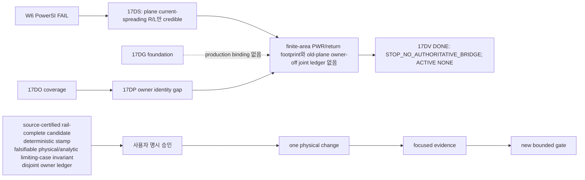

# SPD Decap PI Evaluator 작업 기준

- 적용 제품: **SPD Decap PI Evaluator v0.23.1**
- 문서 버전: **1.157**
- 상위 기준: [목적·기술 기준](PRODUCT_PURPOSE_AND_TECHNICAL_BASELINE.md) v1.156
- 현재 상태: W6 numerical FAIL; W7 BLOCKED; ACTIVE NONE; 17DG standalone/no Zii change; 17DK–17DP validation-only; 17DS candidate gate **NOT READY/STOP**; 17DT DONE (`internal v3 PASS / W6 comparability STOP_IDENTITY_DRIFT`); 17DU immutable DONE (`STOP_AUDIT_CONTRACT_MISMATCH`); 17DV DONE (`STOP_NO_AUTHORITATIVE_BRIDGE`), no retry.
- 최종 개정: 2026-08-28 (Asia/Seoul)

## 1. 압축 후 즉시 복구 카드

context가 압축되거나 새 session에서 작업을 재개하면 이 표만 먼저 확인한다.

| 항목 | 현재 값 |
|---|---|
| 변하지 않는 목적 | source-derived single-rail `Zii`의 PowerSI 근접 정확성과 일반화 |
| 현재 branch | `main`만 사용 |
| 현재 assessment | W6-BASE 260729 numerical FAIL; W7 BLOCKED; 17DS candidate gate NOT READY/STOP; 17DT DONE (`internal v3 PASS / W6 comparability STOP_IDENTITY_DRIFT`); 17DU DONE with `STOP_AUDIT_CONTRACT_MISMATCH`; 17DV DONE with `STOP_NO_AUTHORITATIVE_BRIDGE`; no retry |
| 현재 active work item | NONE — 17DU/17DV are immutable historical one-shots and never retried |
| 현재 정확성 상태 | `260729 retrospective FAIL`; unseen/generalization `unknown / not_run` |
| current authorization | ACTIVE NONE: no new metadata/raw/schema/owner audit; no raw-spatial loader/import, raw-v3 decode, plane payload, containment, W6/Touchstone/correlation/solver/physics/profile/GUI, production solve, build/release; 17DU/17DV script/test remain immutable historical evidence |
| 정확한 재개 조건 | source-certified rail-complete physical candidate + deterministic stamp + falsifiable physical/analytic limiting-case invariant + disjoint owner ledger 확보 및 사용자 명시 승인; 이후에만 one physical change → focused evidence → new gate |
| 핵심 증거 | [W6-BASE completed evidence](#w6-base-completed-evidence-260729), [W7 결과 재평가](#12-w7-결과-재평가와-후속-과제-판정) |

최초 목적은 [목적·기술 기준 2장](PRODUCT_PURPOSE_AND_TECHNICAL_BASELINE.md#2-최우선-목적),
현재 증거 상태는 [6장](PRODUCT_PURPOSE_AND_TECHNICAL_BASELINE.md#6-증거와-상태-표기)이
권위 있다. 이 문서는 그것을 재정의하지 않는다.

## 2. 문서 사용 규칙

### 2.1 두 문서만 기본 context로 사용

작업 시작 시 기본 입력은 다음 두 개뿐이다.

1. `PRODUCT_PURPOSE_AND_TECHNICAL_BASELINE.md`
2. `WORK_EXECUTION_BASELINE.md`

active work item에 명시된 source/test/subsystem 문서만 추가로 읽는다. 전체
`docs/evaluation-research`, session log, 과거 release note 또는 branch 역사를
일괄 로드하지 않는다.

### 2.2 이 문서가 관리하는 것

- 현재 active work item 하나
- 우선순위와 명시적 제외 범위
- 변경 묶음과 root-cause 경계
- 검증 단계, 실행 조건, 예상 비용, 최대 횟수와 중단 조건
- exact source/input/profile/artifact identity
- 완료 결과와 다음 사용자 결정

목적, 제품 sign-off 범위 또는 PowerSI 수치 합격선은 이 문서에서 임의로 바꾸지
않는다. W6 one-run production authority는 260729 completed numerical FAIL과
함께 소진되었고 W7 audit는 source-owner-gap으로 종료되었다. 향후 production
rerun은 source-certified rail-complete physical candidate, deterministic stamp,
falsifiable physical/analytic limiting-case invariant, disjoint owner ledger를 확보하고
사용자가 명시 승인한 경우에만 고려한다. 재개 후
순서는 one physical change → focused evidence → new gate이다. 260804/P5/unseen은
개발 case FAIL 동안 금지한다. remote/release/installer, old-root reuse/mutation,
retry, threshold/fallback 변경은 승인되지 않았다.

### 2.3 갱신 시점

이 문서는 다음 시점에만 짧게 갱신한다.

1. 사용자가 active work item을 승인했을 때
2. 변경 묶음이나 검증 예산을 확정했을 때
3. milestone 검증 직전과 직후
4. item 완료, 차단 또는 명시적 보류 시

대화별 진행 로그, 긴 stdout, 반복 설명은 넣지 않는다. raw log/artifact는 별도
경로에 두고 이 문서에는 identity, 요약 판정과 링크만 기록한다.

## 3. 작업 우선순위와 단계

제품 위험 우선순위와 실제 실행 순서를 구분한다. PowerSI 정확성은 최상위 제품
위험이지만, 수정 효과를 판정할 test/evidence 기반부터 최소 비용으로 복구한다.

| 단계 | 목적 | 종료 조건 | 고비용 검증 |
|---|---|---|---|
| `W0` | 두 canonical 문서 고정 | 목적/작업 문서 상호 링크와 문서 검증 | 금지 |
| `W1` | product-core test truth 복원 | stale test 계약 정리, bounded core selection 확정 | 금지 |
| `W2` | 범위가 확정된 SPD/I/O 결함 수정 | focused checks 통과, 실제 결함별 회귀 check 존재 | 금지 |
| `W3` | product-core CI gate 활성화 | W1/W2 묶음이 한 번의 core suite에서 green | production solve 금지 |
| `W4` | solver 수치 신뢰성 선행 문제 해결 | synthetic/analytic focused gate 통과 | full correlation 금지 |
| `W5` | 정확성 계약과 frozen baseline 준비 | 사용자 승인 수치 gate, reference partition, exact run manifest | 실행 전 승인 필요 |
| `W6` | current frozen candidate 1회 baseline | completed solve와 raw hash-bound artifact, rail별 판정 | consumed: 260729 exact one-run 결과 보존 |
| `W7` | model-form error를 한 owning block씩 개선 | 사전 가설과 focused evidence 통과 | 승인된 candidate만 1회 |
| `W8` | completed-solve release gate 및 전달 | 계산·artifact·installer가 exact release commit에 결속 | 최종 1회 |

`W1`부터 `W4`까지는 production SPD 전체 correlation 없이 닫는 것이 원칙이다.
`W6` one-run gate는 260729 completed numerical FAIL로 소진되었고 W7은
source-owner-gap으로 BLOCKED다. 재개는 source-certified rail-complete physical
candidate + deterministic stamp + falsifiable physical/analytic limiting-case invariant
disjoint owner ledger 확보와 사용자 명시 승인
이후에만 one physical change → focused evidence → new gate 순서로 허용한다.

## 4. 작업 항목 register

상태 어휘는 `READY`, `ACTIVE`, `BLOCKED`, `DEFERRED`, `DONE`만 사용한다.
동시에 `ACTIVE`는 하나만 허용하며 현재는 **NONE**이다. 완료된 미시적 item을
다시 펼쳐 읽지 말고 아래 phase-level 결론과 Git history를 사용한다.

| ID | 순서 | 상태 | 작업 묶음 | 완료 기준·현재 결론 |
|---|---:|---|---|---|
| `W0-DOC` | 0 | DONE | 목적·기술 기준과 이 작업 기준 작성 | 상호 링크, Markdown/link/diff 검증 |
| `W1-TEST` | 1 | DONE | stale test double·구형 정책 기대를 current v0.23 계약에 맞게 정리하고 product-core selection 고정 | 실제 결함은 red로 남기고 test 자체 오류 제거 |
| `W2-SPD-A` | 2 | DONE | source-graph target contact persistence 복구 | target-layer coordinate가 저장·사용되는 focused regression |
| `W2-SPD-B` | 3 | DONE | graph-contact `source_sha256` 교차 검증 | 다른 source coordinate가 scenario validation에서 차단 |
| `W2-SPD-C` | 4 | DONE | `blocking:false` mixed-reference warning이 import를 중단하는 문제 수정 | warning-only case import 성공, blocking case 차단 유지 |
| `W2-IO-A` | 5 | DONE | Distribution/Tuned CSV atomic replace | write 실패 시 기존 파일 보존 |
| `W2-IO-B` | 6 | DONE | 대형 `.spdpi` load cancellation과 load 중 close 경로 | 기존 loader callback 재사용, 취소 후 stale state 없음 |
| `W3-CI` | 7 | DONE | 짧은 product-core lane을 required CI로 연결 | parser/scenario/solver/Distribution/GUI I/O 핵심 경로 green |
| `W4-FREQ` | 8 | DONE | adaptive frequency가 sample 사이 narrow peak를 보지 않고 converged 처리하는 blind spot | midpoint/coverage focused case가 peak 누락을 검출 |
| `W4-COND` | 9 | DONE | ill-conditioned sparse solve의 결과 신뢰성 gate | residual과 별도 conditioning/forward-reliability 판정 |
| `W5-GATE` | 10 | DONE | approved gate/partition/manifest plus trust-boundary adapter/controller evidence | focused trust tests and bounded V3 green |
| `W6-BLOCK-A` | 11 | DONE | versioned Layerwise comparison-runner template parity | layerwise diagnostic/correlation에만 terminal-complete 입력 보강; frozen base/physics/pivot gate unchanged |
| `W6-BLOCK-B` | 12 | BLOCKED | immutable failed-run pivot classification before rerun | 2.543e17 pivot reproduced at VTRIP/0 1 kHz, but factor context was absent; root cause remains unclassified |
| `W6-BLOCK-C` | 13 | DONE | preserve deterministic factor/matrix context at the existing fail-closed pivot | exact one-run context retained; no solver/threshold/cache/physics change |
| `W6-BLOCK-D` | 14 | DONE | estimate raw-system sparse condition lower bound at the fail-closed pivot | exact diagnostic lower bound retained; no threshold relaxation |
| `W6-BLOCK-E` | 15 | DONE | classify and gate the rejected factor after row-scaled sparse solve | exact one-shot diagnostic met finite admittance, scaled pivot, and original residual gates; no threshold/fallback change |
| `W6-BASE` | 16 | DONE | exact clean main HEAD의 retrospective one-run baseline | 260729 completed manifest/sidecar, integrity-valid offline FAIL; no retry |
| `W7-PHYS` | 17 | BLOCKED | model-form error를 한 source-derived physical block씩 개선 | admissible causal block 부재; 17DV evidence gate DONE/STOP; no physics implementation item active |
| `W7-PHYS-HISTORY` | 17A–17DF | DONE | mounted-path, ownership, raw-spatial/plane provenance의 bounded audit·discovery | exclusive causal owner를 고르지 못함; production `Y_global`/`Zii` 미변경; 개별 micro-item 재개 금지 |
| `W7-PHYS-FOUNDATION` | 17DG | DONE | sparse gauge-safe finite-port condensation foundation | standalone analytic gate PASS; production binding/accuracy는 BLOCKED |
| `W7-PHYS-PREREQUISITES` | 17DH–17DJ | BLOCKED | landing ownership과 one-block causal experiment gate | source-certified rail-complete candidate와 authoritative owner relation 부재 |
| `W7-PHYS-COVERAGE` | 17DK–17DP | BLOCKED | audit API/lifecycle repair, strict source coverage, owner-ledger reconciliation | execution evidence는 확보했으나 17DP `SOURCE_OWNER_GAP_STOP`; validation/metadata only |
| `W7-PHYS-OUTCOME-REVIEW` | 17DQ | DONE | 현재 결과 재평가와 후속 필요성 판정 | artifact-only ablation과 owner-manifest/schema continuation을 열지 않고 ACTIVE NONE 유지 |
| `W7-PHYS-CANDIDATE-REVIEW` | 17DR | DONE | source/provenance/ownership feasibility candidate gate review | review 완료; candidate 결과 **NOT READY/STOP**; 상위 W7 **BLOCKED** / **ACTIVE NONE** |
| `W7-PHYS-CANDIDATE-REVIEW-CLOSURE` | 17DS | DONE | exact source-only bare-development rail candidate closure | `ADC_VDD_180_VQPS_SYS_1_AON/0` subject review 완료; raw-spatial v2 only로 `STOP_RAW_SPATIAL_V3_ABSENT`; candidate **NOT READY/STOP**; 상위 W7 **BLOCKED** |
| `W7-PHYS-V3-REPRODUCTION` | 17DT | DONE | fresh import-save-only source raw-spatial v3 reproduction | internal v3 PASS; W6 comparability `STOP_IDENTITY_DRIFT`; no physics/profile/GUI change |
| `W7-PHYS-LOCAL-SEAM` | 17DU | DONE | one read-only current-lineage rail footprint seam audit + focused test | execution `STOP_AUDIT_CONTRACT_MISMATCH`; no local seam evidence; W7 remains BLOCKED and production physics/`Zii` unchanged |
| `W7-PHYS-METADATA-BRIDGE` | 17DV | DONE | one-shot read-only metadata-only logical-to-physical bridge gate | `STOP_NO_AUTHORITATIVE_BRIDGE`; HEAD `11ef7af81ba087c0d9ec7442ba43940a23c734d9`, exit 2, runtime 172.429 s, peak RSS 7,324,794,880 bytes, no retry; output SHA-256 `86C3330EA47974167FE987821631A5F0FCB5DF9C4A56617A8574B5934D9CDB5A`; frozen four-file whitelist remains historical execution scope |
| `W7-PHYS-PROSPECTIVE` | next | BLOCKED | 단일 source-derived physical candidate의 causal checkpoint | geometry/material provenance, rail-complete 범위, deterministic stamp, falsifiable physical/analytic limiting-case invariant, disjoint owner ledger 및 사용자 명시 승인 후에만 READY 가능 |
| `W8-REL` | 18 | BLOCKED | completed known-case solve를 release gate에 연결하고 최종 전달 | accuracy/product gate와 exact release commit 필요 |
| `D-DIST` | - | DEFERRED | Distribution routing/DRC scope 확대 | 사용자가 implementation-ready/DRC 목표로 승격할 때만 |
| `D-DOC` | - | DEFERRED | README와 동결 연구 배너 정리 | current work를 방해할 때 별도 문서 묶음으로 처리 |

새 item은 재개 조건을 충족해 사용자가 승인할 때만 `ACTIVE`로 바꾸고,
그때 source 위치, 변경 whitelist와 검증 예산을 기록한다.

## 5. 검증 사다리와 실행 예산

아래 단계에서 필요한 가장 낮은 rung만 사용한다. 상위 rung이 green이라고 하위
문제의 root cause를 설명하는 것은 아니며, 하위 rung이 red이면 상위로 가지 않는다.

| 등급 | 내용 | 기본 최대 횟수 | 실행 조건 |
|---|---|---:|---|
| `V0` | 문서 link/structure, `git diff --check`, 정적 source 확인 | 변경 묶음당 1회 | 문서 또는 계획 변경 종료 시 |
| `V1` | 한 root cause를 재현하는 focused test/self-check | 구현 묶음 후 1회 | 해당 item acceptance를 직접 판정할 때 |
| `V2` | 관련 subsystem test selection | item 묶음 종료 후 1회 | 모든 V1이 green일 때 |
| `V3` | bounded product-core suite 또는 small known-case completed solve | frozen phase당 1회 | W2/W4 같은 phase 종료 시 |
| `V4` | production SPD/PowerSI full solve·correlation | 승인된 frozen candidate당 1회 | W5 run manifest 승인 후 |
| `V5` | package, installed smoke, release artifact/CI | exact release commit당 1회 | 기능·정확성 gate 완료 후 |

실패 후 같은 명령을 그대로 반복하지 않는다. `V1–V3` 재실행은 실패 원인을
설명하는 코드·test·fixture 변경이 생긴 경우 한 번만 허용한다. 두 번째 실패는
더 작은 재현으로 돌아간다.

`V4`는 자동 재시도하지 않는다. 실패·중단·자원 초과가 발생하면 raw evidence를
보존하고 원인을 저비용 단계로 축소한다. W6 authority는 consumed 상태이고 W7은
source-owner-gap으로 BLOCKED다. production one-run은 source-certified rail-complete
physical candidate + deterministic stamp + falsifiable physical/analytic limiting-case
invariant + disjoint owner ledger 확보와 사용자
명시 승인 뒤에만 one physical change → focused evidence → new gate 순서로 시작한다.
그 전에는 rerun하지 않는다. `V5`는 intermediate code나 문서 변경 때문에 실행하지 않는다.

## 6. 변경 유형별 최소 검증

| 변경 유형 | 필수 | 이번 묶음에서 하지 않는 것 |
|---|---|---|
| 목적/작업 문서 | `V0` | pytest, solver, installer |
| stale test 계약만 수정 | 해당 test file `V1` | production input, package |
| SPD import/provenance | focused negative/positive `V1`, 묶음 끝 import subsystem `V2` | PowerSI correlation |
| CSV/save/load/cancel | failure-preservation `V1`, GUI/I/O selection `V2` | solver/installer |
| CI workflow | workflow text/selection 확인 후 product-core `V3` 1회 | full research suite 반복 |
| solver sampling/conditioning | synthetic/analytic `V1`, bounded solver `V2` | 곧바로 production correlation |
| physical model/profile/compiler | local oracle `V1`, known-case `V3`; milestone이면 `V4` | 한 수정마다 full correlation |
| release/installer | `V5` | 미완료 기능을 package green으로 대신 증명 |

전체 2,434개 test를 매 PR에서 반드시 실행하는 것이 목표는 아니다. product-core와
heavy research suite를 분리하고, full suite가 필요한 시점은 active work item에서
사전에 한 번 지정한다.

## 7. Active work item 작성 형식

사용자 지시를 받으면 아래 block 하나를 이 절의 맨 위에 작성한다. 완료 후 짧은
결과 row로 줄이고 다음 item을 자동 시작하지 않는다.

```text
ID / 상태:
사용자 목적과의 연결:
이번 변경 묶음:
명시적 제외 범위:
root-cause 가설:
읽을 source/test/subsystem 문서:
acceptance:
V0–V5 계획과 최대 횟수:
중단 조건:
evidence identity before:
결과 / artifact / diff:
다음 사용자 결정:
```

ID / 상태: `W4-COND / DONE`
사용자 목적과의 연결: sparse factor가 작은 backward residual을 내더라도 극단적인 U-pivot spread로 forward reliability가 무너지는 결과를 product-core 경계에서 fail-closed 한다. 이는 model-form 또는 PowerSI 정확성 증거가 아니다.
이번 변경 묶음: `layer_surface_network.py`의 기존 U-diagonal ratio 계산에 `1.0e13` ceiling과 invalid-pivot rejection을 추가하고 residual gate 이후 forward-reliability rejection을 적용했다. cache payload에도 동일 ceiling을 검증하며 solver identity를 `modal-mvp-0.8.4`로 갱신했다.
명시적 제외 범위: fallback/reordering/pivot tuning/clamp, residual gate 완화, compiler `kron-v8`, convergence `v5`, app `v0.23.0`, model physics, W5 hash-bound PowerSI validation, production SPD/PowerSI, installer/release.
root-cause 가설: 기존 코드는 `factor.U.diagonal()` ratio를 진단에만 기록하고 극단적인 spread를 결과·cache에 허용했다.
읽을 source/test/subsystem 문서: 목적·기술 기준, 이 작업 기준, `layer_surface_network.py` factor/cache 경계, `tests/test_layer_surface_network.py`, `tests/test_layerwise_network.py`, 그리고 W5 이후에도 재생성하지 않는 frozen pre-W4 validator/non-regression scripts.
acceptance: 실제 SuperLU `solve`를 위임하는 wrapper가 backward residual `<=1e-9`인 상태에서 1:1e-17 pivot ratio를 forward-reliability wording으로 거부한다. 1:1e-13(정확히 `1.0e13`)은 admittance/residual/보고 ratio를 보존하며 허용된다. 빈/nonfinite/nonpositive pivot과 초과 cache payload는 fail-closed다.
V0–V5 계획과 최대 횟수: conditioning adversarial V1 red 1회; adversarial+ceiling V1 green `2 passed` 1회; layer-surface/layerwise plus exact solver identity V2 `94 passed` 1회; resulting CI bounded V3 selection 1회; V0 YAML/diff 정적 확인 1회; V4–V5와 production solve 금지.
중단 조건: residual gate와 forward gate를 혼합해야 하거나, fallback/reordering/physics 변경이 필요하거나, W5 numerical/PowerSI run 승인이 필요한 경우.
evidence identity before: `main` / `3b6ed2cc6308179002fee817c1b14f7efebd6cb9` / solver `modal-mvp-0.8.3` / compiler `kron-v8` / convergence `v5`.
결과 / artifact / diff: conditioning red node는 `1 failed`; 최소 solver/cache gate 후 adversarial+ceiling focused는 `2 passed in 0.72s`였다. 최종 `pytest -q tests/test_layer_surface_network.py tests/test_layerwise_network.py tests/test_spd_decap_evaluation.py::test_solver_version_0_8_2_recalculates_0_6_baseline_cache`는 `94 passed in 2.16s`였다. source-before는 `main` / `b2608a260a1f952c9b1f6c11d57b71e060ae575c`이며, 그 W4 묶음은 workflow Test command에 두 W4 conditioning gate를 보존적으로 추가한 bounded V3 selection을 `QT_QPA_PLATFORM=offscreen`으로 1회 실행해 `325 passed, 1 skipped in 18.25s`였다. Required CI command에는 두 W4 gate node가 유지된다. W4-FREQ synthetic closure는 별도 commit에서 완료되었고, 이번 묶음은 forward-reliability gate와 v0.8.4 live identity에 한정한다. W5 hash-bound validator/non-regression scripts와 기존 artifact identity는 pre-W4 값으로 동결해 두었으며, 이는 해당 W4 시점의 historical evidence이다. W5 승인 후에도 historical assets는 갱신하지 않는다. 그 W4 묶음에서는 remote CI/full suite/production SPD/PowerSI/installer/release를 실행하지 않았다. accuracy는 `unknown / not_run`; model-form/PowerSI 수치 합격을 주장하지 않는다.
W5 policy와 implementation은 승인·동결되었고 W5-GATE는 DONE이다. W6-BLOCK-A도
DONE이며, W6-BLOCK-B는 diagnostic pivot 미분류로 BLOCKED, W6-BLOCK-C와
W6-BLOCK-D와 W6-BLOCK-E는 DONE이다. W6-BASE는 260729에 대해 completed
manifest/sidecar를 남긴 **numerical FAIL**로 DONE이며, offline verifier는 exit 2로
무결성을 확인했다. 제품 최상위 목적은 PowerSI와 비슷한 정확도의 계산이며,
현재 개발 case 정확성은 `260729 retrospective FAIL`, unseen/generalization과
260804/P5는 `unknown / not_run`이다. 개발 case FAIL 동안 260804/P5 실행과
추가 production rerun은 금지한다.

W6-BLOCK-A는 v6 adapter가 layerwise diagnostic/correlation에서만 누락된
`terminal_complete_external_input=True`를 보강하고 explicit value를 보존하며
hook을 복구하도록 한 parity 수정이다. import passthrough, legacy/research,
frozen base benchmark, solver physics, pivot gate와 v6 validator는 변경하지
않았다. V1은 사전 `1 failed`, 수정 후 `1 passed in 0.88s`; V2는 `10 passed in
2.13s`; 현재 bounded V3는 `361 passed, 1 skipped in 22.88s`, exit 0이다. Skip은
`tests/test_spd_decap_scenario_io.py:1048`의 local v0.13 SPD regression bundle
부재다.

첫 260729 controller attempt는 exact source HEAD
`46d17dc73381d4292ea342d7a10e85d4f2e338f6`에서
`D:\SPD-Decap-PI-Evaluator-W6\46d17dc73381d4292ea342d7a10e85d4f2e338f6\260729`
에 수행되었다. `blocked_partial.json` SHA는
`b81525bd47744dc1ea5c75bb26f20ea354246ad88b8ce5bc9aef131cb50c09f7`이며 phase1은
통과, phase2는 exit 2, v6는 not_started, scoring은 refused였다. 이 tombstone은
구 policy SHA `c362acb01ef28cefbbd1d32753f86bccafbdd53355b42eda83c03a6ea810698b`에
결속되므로 새 policy로 소급 검증하지 않으며, root는 W6-BASE controller output·scoring
snapshot·retry·mutation에 사용하지 않는다. B의 correlation은 historical evidence이고,
C는 old candidate/import report를 정확히 한 번 read-only로 열며 correlation report는
입력으로 사용하지 않는다. C는 이미 별도 fresh root에 썼고, D도 brand-new
diagnostic root에만 쓴다.
Fresh import는 `5078.367847900023s`, candidate `796205663` bytes /
`8b02836c03aa38c447fba37ddd30434a3e4ed34ce772654fa5bc3a8512543320`, import report
`e65cae7297b28a36e405074e7135c216c65c483d237973928d9bf63488d3b0b5`, frequency
solves `0`, Touchstone read `false`였다 (phase1 import report only). Phase2 read and
hashed the registered PowerSI Touchstone and attempted correlation; all rails were
blocked, so no completed comparison or score was produced. Correlation report는
`1fbc44ddb9f9c59254a56fd355096332d2fa4ea091516aa02cec3e9a20368dbb`이며 mode10
16 rails가 실행되었다. 12 rails는 rectangular-plane runner contract, VTRIP/VINT
4 rails는 올바른 `2.543e17 > 1e13` pivot gate로 차단되었다. mode12는 새 solve 없이
16 source blocker를 유지·재사용했고, release failure 32는 독립 solve 32개가
아니다. exact parity와 수치 정확성 결과는 없다. 260804는 실행하지 않았다.

`W6-BLOCK-B`는 BLOCKED다. 진단 root
`D:\SPD-Decap-PI-Evaluator-W6-Diagnostics\6bbe44e2f36610755103757d6a4502c9ed9760d3\260729-vtrip0-1khz`
에서 `ADC_VDD_055_VTRIP/0`의 1000 Hz 단일 diagnostic이 exit 1로 종료되며
`2.543e17 > 1e13` pivot을 재현했지만, 기존 예외에 factor context가 없어
assembly/scaling/topology defect와 genuine conditioning boundary를 구분하지 못했다.
stdout SHA는 `e3b0c44298fc1c149afbf4c8996fb92427ae41e4649b934ca495991b7852b855`,
stderr SHA는 `cb0d72713189a6fb71f6622afc80128fdc435917f63b8a27032981e3e732623a`이며
report/artifact는 없다. elapsed는 약 `687.84s`이며 old root와 repo는 불변이다.

`W6-BLOCK-C / DONE`는 기존 pivot-ratio 초과 raise에 이미 계산·보유된
frequency/component/retained/local/U-pivot/residual/matrix SHA context를 inline으로
보존했다. 새 root
`D:\SPD-Decap-PI-Evaluator-W6-Diagnostics\e9a1ca124d94f1bd0192d519aa22996e87266ac5\260729-vtrip0-1khz`
의 단일 diagnostic은 exit 1, 약 `667.19s`, no report였고 stdout SHA는
`e3b0c44298fc1c149afbf4c8996fb92427ae41e4649b934ca495991b7852b855`, stderr SHA는
`8468b8f0798dc754c2c5926cc01dbe26d612b9cba7867efe4fa96f389bf89fc8`였다. Context는
retained `756888`, nnz `2904010`, local `2.467e-13..1.575e+08`, pivots
`3.290e-10..8.366e+07`, ratio `2.543e17`, residual `6.808e-20`, matrix SHA
`709efcd1b8857c1ab9c4f73bec20cc7ec7d144cd9bfd32b9ee1657b956587524`다. old
candidate/import와 repo는 불변이며 full W6/260804/PowerSI/scoring은 실행하지 않았다.
solver 결과, threshold/order/cache/admittance/port/physics와 trust identity는 변경하지
않았다. C test node history 6회(기존 red/green과 review assertion 교정)는 그대로
보존한다. C는 old root의 candidate와 import report를 각각 정확히 한 번 read-only
입력으로만 열고 correlation report는 입력으로 사용하지 않으며, output은 fresh root에만 쓴다.
초기 호출은 4회였다: pre-code red `1 failed in 0.85s`, post-code
frequency-format mismatch `1 failed in 0.78s`, SHA trailing-parenthesis mismatch
`1 failed in 0.97s`, 최종 `1 passed in 0.68s`. review-strengthened assertion의
첫 실행은 SHA literal에서 trailing `b`를 빠뜨려 `1 failed in 0.83s`였고, exact
64-hex literal로 교정한 최소 재실행은 `1 passed in 0.71s`였다. 따라서 이 node의
실제 호출은 총 6회이며, 다른 node는 실행하지 않았다. C acceptance는
deterministic context 보존으로 닫혔다. D lower-bound evidence가 닫힐 때까지
W6-BASE는 실행하지 않는다.

`W6-BLOCK-D / DONE`는 기존 pivot failure branch에서만 sparse `||A||1`와
factor solve 기반 inverse `onenormest(t=1,itmax=5)`를 계산해
`inverse_one_norm_lower_bound`와 `condition_1_lower_bound`를 기록한다. 값은
`unavailable`로 fail-closed 기록할 수 있으며, 정상 path 계산·threshold 완화·fallback·
reordering·port 이동·physics 변경은 없다. Raw-system condition lower bound가
`>1e13`이면 해당 local system이 적어도 그 수준으로 ill-conditioned하다는 증거지만,
낮은 bound는 false positive나 assembly/topology correctness를 증명하지 않는다.
V1 red는 `1 failed in 0.80s`, green은 `1 passed in 0.62s`; V2
`python -m pytest -q tests/test_layer_surface_network.py`는 `58 passed in 1.91s`였다.
V3/full W6/PowerSI는 금지한다. D diagnostic은
`D:\SPD-Decap-PI-Evaluator-W6-Diagnostics\ac828f306da4ca4fa4e4c80c2cb77cadf0d3185f\260729-vtrip0-1khz-cond1`
에서 exit 1, `668.63s`, no report였다. stdout는 빈 파일 SHA
`e3b0c44298fc1c149afbf4c8996fb92427ae41e4649b934ca495991b7852b855`, stderr는
`3961` bytes/SHA `d40503688889e51afd00504321ca37e032ff6b81fcb800c3bb51d722abab5c58`이며,
`inverse_one_norm_lower_bound=3.040e+09`,
`condition_1_lower_bound=9.572e+17`였다. C context와 matrix SHA는 유지됐고,
inputs/repo는 불변, full W6/260804/PowerSI/scoring은 미실행이다.

`W6-BLOCK-E / DONE`는 row norm `abs(A).sum(axis=1)` 기반의 positive real
`S=diag(1/sqrt(row_norm))`와 sparse `Aeq=SAS`를 사용해 scaled factor를 정확히
한 번 만들고, `beq=S*b`, `x=S*y`로 원래 좌표 결과와 `A@x-b` residual을 유지한다.
실패한 factor의 raw inverse lower-bound는 `S*factor.solve(S*x)` 및 H 변환으로
계산한다. pivot ceiling `1e13`, original-coordinate residual `1e-9`, cache/hash,
assembly/ports/physics는 바꾸지 않는다. solver identity는 `modal-mvp-0.8.5`다.
V1 analytic red는 `1 failed in 0.93s`, corrected green은 `1 passed in 0.72s`였고,
py_compile은 두 파일에서 통과했다. 중간 source indentation/syntax collection
failure가 두 번 있었고, 첫 valid exact V2는 `129 passed, 2 failed in 3.89s`,
test-only correction 뒤 `130 passed, 1 failed in 4.63s`였다. 두 번의 command/path
typo 시도는 0 tests라 validation evidence가 아니며, 최종 valid bounded V2는
`131 passed in 4.13s`, exit 0이다. 이 결과는 local structural evidence일 뿐
PowerSI accuracy evidence가 아니다.

E의 단일 production diagnostic invocation은
`D:\SPD-Decap-PI-Evaluator-W6-Diagnostics\f23c5b241d522d05f50f6de05bd6819723b7d3db\260729-vtrip0-1khz-equilibrated`에서
exit 0, `697.35s`로 완료됐다. Report는 `6464` bytes/SHA
`70e1264e6e4223da9c8715ade5695d02f1ab951aa36b418e5b067a3145fd2e9f`, stdout는
`281` bytes/SHA `da71076cad8e6c7308b46bcfc42b8ef0395b430b81cb78dcb905607c4a5d783d`,
stderr는 `0` bytes/SHA `e3b0c44298fc1c149afbf4c8996fb92427ae41e4649b934ca495991b7852b855`다.
Status는 `completed`, solver는 `modal-mvp-0.8.5`, profile은
`layerwise_admittance_v1`, rail은 `ADC_VDD_055_VTRIP/0`, frequency는 `1000 Hz`다.
Finite admittance는 `[0.13437046955500517, 12.100420788716686]`, scaled
`maximum_factor_pivot_ratio`는 `9.966405069248625e9 <= 1e13`, original-coordinate
residual는 `3.919670457452144e-17 <= 1e-9`, frequency solve는 `1`, Touchstone은
`false`, adaptive sweep은 `false`였다. Candidate/import bindings는 immutable
입력과 일치했다. ZIP central directory는 orchestration 중 read-only로 한 번
열었지만 production diagnostic invocation은 한 번뿐이며 retry/edit는 없었다.
이는 numerical promotion gate만 증명하며 model-form 또는 PowerSI accuracy를
증명하지 않는다. W6-BASE는 260729 completed numerical FAIL로 닫혔고, W7 audit도
negative/unclassified로 종료되었으므로 260804/P5 또는 production rerun은 계속 금지한다.

### W6-BASE completed evidence (260729)

W6-BASE는 source-before clean `main` HEAD
`fb36288781dcc0b884950ef5a486c474090ceebd`에서 정확히 한 번 실행되었다.
새 root는
`D:\SPD-Decap-PI-Evaluator-W6\fb36288781dcc0b884950ef5a486c474090ceebd\260729`이며
controller exit `2`, elapsed `17938.47s`, manifest status `completed`,
score status `FAIL`이다. Offline
`validate_powersi_accuracy.py --verify-sidecar`도 정확히 한 번 실행되어 exit `2`
(integrity-valid numerical FAIL)였다. retry/resume/reuse는 없었다.

핵심 artifact SHA는 candidate `8b02836c03aa38c447fba37ddd30434a3e4ed34ce772654fa5bc3a8512543320`,
import report `5a2714c7ce0d90df6cc9c4155c8f5ef43b78802cec47872d53f1c8361b4261a3`,
correlation report `969e40046e3a099d09557ba7500693460362336d76b067962436bd3b5177abc4`,
BLAS evidence `c9037556772693d56d61cd287b813c9b3964dc14b4ad4b248926a84d2eb5e83a`,
manifest `2b14f90e762abc49833518137812e8fc97fcde0e9c145795b7384210cfd9f5de`,
accuracy sidecar `0d103e0ad47df80641fac0952a35a6eaa56cc9fdb71be24661903e451926e932`이다.
Mode10은 16개 rail을 실행했고 mode12는 16개 terminal-complete 결과를 재사용했다.
Bare macro는 `1.7071112227372152`(limit 1.0), loaded macro는
`15.910646842123072`(limit 1.0)로 모두 FAIL이다. 총 failure는 `57`건이다:
low-offset/magnitude `16/16` FAIL, bare phase RMS `10/10` PASS와 phase max
`9/10` PASS, loaded phase RMS/max/resonance 각각 `6/6` FAIL이다. Loaded
signed-error anchors는 0.1 MHz `-0.142..-0.038 dB`, 1 MHz
`-6.023..-3.058 dB`, 10 MHz `-27.527..-22.830 dB`, 100 MHz
`-25.061..-18.059 dB`로 여섯 rail 모두 음수이며, VTRIP/0 critical magnitude
RMS는 `17.644824 dB` (문서 표기 `17.645 dB`)다. 개발 case FAIL 동안
260804/P5 실행, fitting, 전역 scaling/threshold weakening, 추가 production rerun은
금지한다.

`W7-PHYS-AUDIT-MOUNTED-PATH`는 DONE (negative/unclassified)이다. 260729
candidate/import/correlation/manifest/sidecar를 read-only로 분류했지만 cap-only
peak/bin prerequisite가 실패하여 정확히 하나의 source-derived owning term을
선택하지 못했다. 따라서 W7-PHYS는 BLOCKED이며, 당시 closure의 active item은
NONE이었고 physics code를
수정하지 않는다.

Frozen historical v5 validator/policy/fixtures와 base benchmark는 byte-identical로
보존된다. W6-E는 current v6→policy→accuracy-validator→controller trust chain을
solver `modal-mvp-0.8.5`에 맞춰 원자적으로 회전했고, 결과 commit 이후에는 listed
current identities와 exact Git HEAD를 함께 동결한다. 현재 trust identities는 base `d43b868629464f408ea19362daa78fc369d2fd446cf3d458cfdc044ccbf57f08`,
adapter `6b7e399b4a843028ce754ac9154b8ce1a4575b1581c8d6007cebf26f94e6d440`, v6
`3f26b2aa7880cd9aff89cd5407643c934367764b590db98962cbc30bfa1b04a0`, accuracy
validator `8487be60cad523f9ed2ea1c61c57b580d9c2bb0fee598eea0bb938145b82151e`,
policy `6ea6e0b3327eaf828257334d7bb0211582fcc85ed632468223c7b566d0d3fd4d`,
controller `b7d5b87d97e1441ccaa950a1fbe50a49f599483e68acee99596eda7dd612262d`이다.
Historical v5 validator/policy/fixtures와 base benchmark는 byte-identical이며,
260804 S92P SHA의 trailing `b`는 frozen registry correction이다. W6 one-run
authority는 consumed 상태다. D:/ hash 재검산과 old root의 W6-BASE controller
재사용은 없었고, external PowerSI solver 실행은 없었다. For the first
`46d17dc...` blocked root only, Phase2는 등록된 PowerSI Touchstone을 소비했지만
완료 비교/score로 승격하지 않았다; current `fb36288...` Phase2는 completed
numerical FAIL을 남겼다. 재개 조건은 12.4의 전체 조건(source-certified rail-complete
physical candidate, deterministic stamp, falsifiable physical/analytic limiting-case
invariant, disjoint owner ledger, 사용자 명시 승인)이며, one physical change →
focused evidence → new gate가 확정되기 전에는 production rerun을 하지 않는다.
remote/full suite, installer/release는 수행하지 않았다.

## 8. Context 압축·새 session 복구 절차

1. 상위 목적 문서와 이 문서의 `압축 후 즉시 복구 카드`만 읽는다.
2. `git branch --show-current`, `git rev-parse HEAD`, `git status --short`로 실제
   checkout을 확인한다.
3. `main`이 아니거나 recorded source 기준과 예상하지 않은 차이가 있으면 작업을
   시작하지 않고 상태를 보고한다.
4. active item이 `NONE`이면 추측으로 다음 코드를 수정하지 않고 사용자 지시를
   기다린다.
5. active item이 있으면 그 item에 적힌 source/test만 읽고 caller를 end-to-end로
   추적한다.
6. context가 사라졌다는 이유만으로 이전 검증을 다시 실행하지 않는다. exact
   identity가 같은 기존 evidence를 사용하고, 불명확하면 `unknown`으로 표시한다.
7. 구현 전 최초 목적, active item, 제외 범위와 검증 예산을 한 번 재확인한다.
8. 다른 문제가 보이면 backlog 후보로 한 줄 기록할 수 있지만 현재 item을
   확장하지 않는다.

## 9. 중단·사용자 검토 조건

다음 중 하나면 안전한 read-only 확인까지만 하고 멈춘다.

- 목적 또는 제품 PowerSI 합격선을 바꿔야 함
- 한 번에 둘 이상의 physical owning block을 바꿔야 결과를 설명할 수 없음
- 사전 예산에 없는 `V4` 또는 `V5`가 필요함
- 같은 고비용 검증을 원인 변경 없이 다시 실행하려 함
- source/reference/port/profile/compiler identity가 불명확함
- 현재 권한 범위를 넘어 실제 입력·외부 권한·release authority 또는 사용자
  선택이 필요함 (active NONE에서는 예외 없음)
- 사용자 변경과 active item이 같은 파일에서 충돌함

어려움, 긴 runtime 또는 test 수가 많다는 이유만으로 범위를 넓히거나 목적을
바꾸지 않는다.

## 10. 현재 결정 기록

| ID | 결정 | 상태 |
|---|---|---|
| `D-001` | `main`만 대상으로 하며 정리된 branch를 다시 감사하지 않음 | 확정 |
| `D-002` | PowerSI 근접 Evaluation 정확성이 최우선이고 Distribution은 2차 목적 | 확정 |
| `D-003` | PowerSI는 comparison-only이며 fitting 입력이 아님 | 확정 |
| `D-004` | W5 이전 제품 PowerSI 수치 합격선은 사용자 승인 전 미확정 | W5에서 superseded; historical decision |
| `D-005` | 작은 수정마다 전체 검증하지 않고 frozen milestone에서 1회 실행 | 확정 |
| `D-006` | context 기본 입력은 두 canonical 문서뿐 | 확정 |
| `D-007` | historical closure에서 다음 item을 자동 시작하지 않음 | D-008로 superseded |
| `D-008` | artifact-only ablation은 non-identifying이며 owner-manifest/schema continuation은 지금 진행하지 않음; ACTIVE NONE 유지 | historical; D-009 supersedes only for approved 17DT scope |
| `D-009` | 사용자 승인 17DT에 한해 fresh import-save-only raw-spatial v3 reproduction을 네 파일 whitelist로 실행; `accuracy_parse.py`는 보존·미수정 | 확정 |
| `D-010` | 17DT 내부 v3 PASS/W6 `STOP_IDENTITY_DRIFT` 후, 승인된 네 파일로 17DU current-lineage local seam audit를 1회 수행; `accuracy_parse.py` 보존·미수정, W7/global owner-off는 계속 BLOCKED | 확정 |

## 11. 현재 evidence와 비재사용 경계

- remote/tag/release identity는 이번 docs-only 재평가 범위 밖이며 release 전에 반드시 다시 확인한다. 과거 v0.23.0 attestation은 historical evidence다.
- v0.23 production attestation의 import/save/92-rail solver entry는 그 범위에
  한해 사용 가능하다. completed frequency solve 또는 PowerSI 정확성 증거로
  재사용하지 않는다.
- 문서에 남은 historical v0.22 loaded correlation은 model-form failure를
  가리키지만 raw report가 Git에 없어 current baseline 숫자로 재사용하지 않는다.
- W1/W2 focused evidence는 graph-contact persistence/source provenance와
  mixed-reference warning/blocking 경계를 각각 확인했다. 이 evidence는 해당
  commit·노드 범위 밖의 product accuracy 또는 PowerSI 증거로 재사용하지 않는다.
- `W4-FREQ` synthetic focused solver checks와 W6-BLOCK diagnostics는 각 acceptance 범위의
구조 증거로만 사용한다. W6-BASE 260729는 completed numerical FAIL이며, 이를
W6 attempt 또는 PowerSI 정확성 증거로 재분류하지 않는다. external PowerSI solver는
실행하지 않았고, W7 17DO/17DP는 source-coverage/source-owner-gap STOP이다. 재개
조건은 source-certified rail-complete physical candidate + deterministic stamp +
falsifiable physical/analytic limiting-case invariant + disjoint owner ledger와 사용자
명시 승인이다.

## 12. W7 결과 재평가와 후속 과제 판정

### 12.1 전체 판정

- W0–W5는 문서 통제, product-core truth, SPD/I/O 안전성, CI, solver
  fail-closed guard와 frozen accuracy gate를 마련했다.
- W6-BASE 260729는 정상 완료된 수치 실행이지만 PowerSI 기준 **FAIL**이다.
  Bare macro `1.7071112227372152 dB`, loaded macro
  `15.910646842123072 dB`, 총 failure `57`이며 unseen/generalization은
  `unknown / not_run`이다.
- W7은 source/provenance와 수학·운영 기반을 개선했지만 production network,
  계산된 `Zii`, PowerSI correlation을 바꾸지 않았다.
- 따라서 현재 product risk는 그대로 **외부 정확성 미달**이며, sole ACTIVE는
  **NONE**이다.
  17DT는 internal v3 PASS / W6 comparability STOP_IDENTITY_DRIFT로 종료되었고
  17DU도 `STOP_AUDIT_CONTRACT_MISMATCH`, 17DV도
  `STOP_NO_AUTHORITATIVE_BRIDGE`로 종료되었다.

### 12.2 보존할 성과와 주장 한계

| 묶음 | 보존할 성과 | 주장하지 않는 것 |
|---|---|---|
| 17DG | sparse, gauge-safe, reciprocal/passive finite-port condensation의 standalone 수학 기반; technical commit `fdb70ad0...`, focused gate 1회 PASS | production attachment, old Maxwell owner-off, `Y_global`/`Zii`, PowerSI 정확성 |
| 17DL/17DN | audit lifecycle와 frozen-row serialization/API 결함의 focused regression PASS | source coverage 완전성, R/L 또는 정확도 개선 |
| 17DO | authoritative production topology (`surface.production_compile` / `rail_port_audit` nested evidence): rail 92/92 complete, binding pins 42,674, finite links 1,692,366, owners 1,729,871 complete; canonical W6 finite-via links 1,692,389 | 이 completeness 수치는 overall 17DO audit가 아니라 nested production sections다. 17DR blocker는 point/topology owner 집합과 raw-v3 finite-area PWR/return patch footprint 및 replaced-plane owners의 identity-level join, production global assembly, replacement owner-off 증거 |
| 17DP | terminal/via partition count conservation 확인 | identity-level raw-to-authoritative owner intersection |

17DO execution identity: technical commit `ea78c0181aa98c565efedf1b3b19e2117decdcd7`; root `D:\SPD-Decap-PI-Evaluator-W7\ea78c0181aa98c565efedf1b3b19e2117decdcd7\260729-17do-source-coverage`; one run/no retry, exit 2; classification **execution PASS + strict source coverage BLOCKED/STOP**; final JSON SHA-256 `9c387bd5767c563cd993201472f7a74c67f483837f15724480d4c6d1fec0b20d`. 17DR의 현재 candidate-gate blocker는 rail 자체 불완전이 아니라 authoritative point/topology owner와 raw-v3 finite-area patch/replaced-plane owner의 identity-level join, production global assembly, replacement owner-off 증거 부재다.

전체 17DO strict-coverage 집계는 terminal landing 63,872개 중 30,526 complete / 33,346 incomplete, via-pair missing endpoint 1,547,649 및 terminal-owned-unpaired 61,192였고, 이 별도 집계가 strict source coverage BLOCKED/STOP의 근거다.

### 12.3 지금 후속 실험을 열지 않는 이유

W6 loaded rail 오차는 1 MHz `-6.023..-3.058 dB`, 10 MHz
`-27.527..-22.830 dB`, 100 MHz `-25.061..-18.059 dB`로 모두
음수였다. W6 port response만으로는 원인 block이 ambiguous했지만, 17DR
source/provenance/ownership feasibility review에서 다음 물리 방향은
**surface-patch plane current-spreading R/L replacement 하나**로 좁혀졌다.
이는 W6 원인이나 정확도 개선 판정이 아니라 candidate feasibility 범위다.

- `disabled_via_link_ids`는 finite Via link를 끌 수 있지만 production Evaluation
  call path와 authoritative owner partition에 결속되지 않아 구조 민감도만 보인다.
- sheet-loss evidence는 solver ablation을 실행하지 않으며, legacy sheet
  monkeypatch는 current Layerwise production 경로가 아니다.
- physical gate는 `C=ε₀εrA/d`와 uniform-strip series R/L analytic limits로 분리한다. 17DG는 별도의 gauge-safe finite-port condensation foundation이며, gauge/reciprocity/passivity는 physical limiting-case invariant가 아니다. raw-v3 plane/stackup/material provenance는 있으나 production caller와 old-Maxwell replacement의 global port/owner seam이 없어 surface-patch plane current-spreading R/L replacement는 **NOT READY/STOP**이다.
- profile 전환은 여러 modeling 차이를 함께 바꾸므로 one-block experiment가 아니다.
- Trace R/L은 source trace-width/return assignment가 incomplete하다. Via return/mutual은 source-complete plating/fill/return-plane contract가 없다. Pad/anti-pad는 complete antipad/replacement boundary가 없다. Scalar/table dielectric dispersion은 이미 active이며 temperature variants는 현재 temperature-less model로 source-faithful하게 표현할 수 없다. GUI `include_plane_sheet_payload` 플래그만 켜는 것은 데이터를 만들 뿐 physics를 바꾸지 않으므로 금지한다.

따라서 artifact-only ablation은 non-identifying이고, 선택된 물리 후보 없이
`raw_to_authoritative_owner_partition_manifest` 또는 새 schema/audit를 만드는
작업은 validation churn이다. 둘 다 현재 후속 과제로 승인하지 않는다.

17DS source-only audit subject는 `ADC_VDD_180_VQPS_SYS_1_AON/0` (selected layer labels
`Signal$L30(OTHER_POWER1)` / `Signal$L29(DGND)`, active selected caps 0, device branches/pins 3/6,
양 endpoint authoritative finite-via vertex)이다. Selection rule은 eligible bare
→ both endpoints finite-Via → minimum branch/pin → canonical rail ID다. Frozen
candidate SHA `8b02836c03aa38c447fba37ddd30434a3e4ed34ce772654fa5bc3a8512543320`에는
raw-spatial v2 attachment
`attachments/spatial/raw-spatial-contact-v2-40cb44b2376f59d6.sqlite.zlib` (SHA
`275c839633a37f3de3f76fd502d3a790d7c48da82e9ca156700449d1fa71f9c4`)만 있고 v3 `plane_primitives/vertices/circles`,
`stackup_layers`, `dielectric_points`가 없어 `STOP_RAW_SPATIAL_V3_ABSENT`다.
Old AdjacentGap/Dispersive plane stamps도 persisted physical owner ID가 없어
disjoint replacement ledger를 증명할 수 없다. 17DS review는 **DONE**, candidate는
**NOT READY**, W7은 **BLOCKED**다. 17DT는 internal v3 reproduction **DONE**
(`internal v3 PASS / W6 comparability STOP_IDENTITY_DRIFT`)이며, 17DU는
`STOP_AUDIT_CONTRACT_MISMATCH`로 DONE/STOP 되었다. 실행 HEAD는
`36aacaf18dd09da66fae249b4756a8e082e51b3e`, runtime 160.5 s, max RSS 7.48 GiB,
exit 2, no retry다. Output은
`D:\SPD-Decap-PI-Evaluator-W7\36aacaf18dd09da66fae249b4756a8e082e51b3e\260729-17du-current-lineage-rail-footprint\rail_footprint_audit.json`
(222 bytes, SHA-256 `BD175CB7C095A966923D92E305C248EB6EC64954A878CE0FB9819BBB19BEB72B`)이며
error는 `target compiled rail port is absent or has unexpected net pair`이고 local
seam evidence는 생성되지 않았다. Root cause는 compiler `selected_net=rail.net`과
power contact/Via logical NET `ADC_VDD_180_VQPS_SYS_1_AON/0`를 physical
layer-label token `Signal$L30(OTHER_POWER1)`로 관측해야 하는데 artwork NET으로
혼동한 계약 불일치다. 이 conflation은
contact/Via/surface lookup과 success stamp에도 퍼지므로 첫 guard만 바꾸는 수정은
유효하지 않다. 허용 파일은 이 문서와 Product 문서, `scripts/audit_current_lineage_rail_footprint.py`,
`tests/test_audit_current_lineage_rail_footprint.py`뿐이며 untracked
`accuracy_parse.py`는 보존·미수정한다. raw SPD/W6/Touchstone/correlation/solver/
GUI/physics/profile/build/release는 읽거나 실행하지 않는다. Expected
current 17DT input identities are candidate 911,542,390 bytes / SHA-256
`fbe6abeb5655918134ecb47235edfd3b81b891ed5ec95545e03c9651937c6bcc`, report 8,622
bytes / SHA-256 `87d83364998ba09639cf36b30e34559cf598da04f653309967145a4dd1681f2f`,
source SHA-256 `40cb44b2376f59d6b606eb9b4d138204fe51b2dc6b3332d3b7c0e7d4202866d2`;
17DU expected manifest identities are project binding
`52b04151f8c46ad2bc903dbf4e62855e0e29042b428ce38a4aafc9e98c519760`, certificate
`fac8e711e65a3fe4f82d3d32fd7cb862bcf2781e02e5037fb4f16ba5a07c46b3`, topology
`a12a76a1060cb466b3a35f4e43165e1db6e7a28c96e8a071cb0ea01e9945c6ef`, raw geometry
`bdfecc328264d28b6e2f35a6dcb096a42373a4cbed799a5de51403f71787623e`, raw logical
`519fda0cc425d24fc61baaeb529d55240bcc085c5dca4bea5c528616e9fefb10`. Budget is
one read-only audit, one focused test selection, bounded phase/decode/temp
preflights, and a coordinator-enforced external 30-minute/RSS hard wall with no
retry; stop on identity/loader/contact/geometry/cancellation/resource failure
and persist only a bounded STOP envelope with the failure reason. This does not select a physical owner or change
`Y_global`/`Zii`; old-plane owner-off/global assembly remain out of scope. 17DV is DONE
with `STOP_NO_AUTHORITATIVE_BRIDGE`; no retry. Execution HEAD
`11ef7af81ba087c0d9ec7442ba43940a23c734d9`, runtime 172.429 s, peak RSS
7,324,794,880 bytes, exit 2, coordinator stop null. Output is
`D:\SPD-Decap-PI-Evaluator-W7\11ef7af81ba087c0d9ec7442ba43940a23c734d9\260729-17dv-metadata-bridge\metadata_bridge_audit.json`
(227 bytes, SHA-256 `86C3330EA47974167FE987821631A5F0FCB5DF9C4A56617A8574B5934D9CDB5A`);
error exact `artwork island has no unique plane geometry record`. This proves only
that the frozen metadata bridge could not uniquely bind the selected finite-surface
island to component/geometry/project plane metadata; it does not distinguish zero
vs multiple matches or PWR vs GND, and does not prove raw artwork/physical link
absence, physical direction invalidity, PowerSI effect, W6 causality, global assembly,
rail completeness, or disjoint owner ledger.
The frozen gate was intended to prove `rail binding → contact → Via landing key → quotient
vertex → finite-vertex surface topology link → artwork island → compact surface component
→ project plane_geometries record` for `ADC_VDD_180_VQPS_SYS_1_AON/0`; execution did not
complete that proof chain. `OTHER_POWER1` is observed
inside the physical layer label `Signal$L30(OTHER_POWER1)`, not an assumed logical or
artwork NET: logical PWR is project `rail.net`/compiled `selected_net`, while physical
layer+NET must be cross-checked from `selected_plane_pair_provenance`, compact component,
and `plane_geometries`. Success ceiling is `PASS_METADATA_BRIDGE_ONLY`; STOP contracts
are `STOP_INPUT_IDENTITY`, `STOP_CONTRACT_UNSUPPORTED`, `STOP_NO_AUTHORITATIVE_BRIDGE`,
and `STOP_RESOURCE_OR_CANCELLED` (exit 0/2). It must not load raw-spatial, import raw-v3,
decode plane payloads, run containment, or run SPD/W6/Touchstone/correlation/solver/
physics/profile/GUI/build/release. Frozen opened allowlist was exactly `manifest.json`,
`scenario.json`, and `attachments/topology/layerwise-compiled-topology-v1-fac8e711e65a3fe4.sqlite.zlib`;
manifest is 79,199 bytes, scenario is 760,816,272 bytes (SHA-256
`15115693d43bdfe69bfcf2d17faeb465da0adac640072183ee24eeea414fa9d9`), and compiled
attachment is 112,530,944 bytes (SHA-256
`c7530202d6873d72fe2c01e5c00296ce5b83f2df33222991f1e98f9f45c97094`). Candidate/report
identities remain the current 17DT values above. The deterministic output schema is
`17dv-metadata-bridge-v1` with normalized main/exact-HEAD/clean identity, bridge rows,
selected pair provenance, `raw_spatial_loaded=false`, and exclusive output; one run/no
retry, internal 480 s and external 600 s wall, coordinator RSS 10 GiB, temp 4 GiB,
output 8 MiB, target anchors ≤2 and vertex-surface links ≤4096. W7 remains BLOCKED
and ACTIVE is NONE. Resume only when existing source-certified rail-complete
physical-candidate conditions are all met and the user explicitly approves an exact
whitelist plus validation budget. Do not open 17DW or any new metadata/raw/schema/
owner audit; prospective remains BLOCKED.

### 12.4 재개 조건



다음 work item은 아래 조건을 모두 만족할 때 하나만 연다.

1. source-derived geometry/material provenance가 있다.
2. 대상 rail 전체에 적용 가능한 physical model 또는 omitted-block candidate다.
3. baseline과 candidate를 구별하는 deterministic stamp가 있다.
4. candidate가 검증할 falsifiable physical/analytic limiting-case invariant가 있다.
5. replaced/retained topology가 **disjoint owner ledger**로 중복 없이 결속된다.
6. 사용자가 exact whitelist와 검증 예산을 명시 승인한다.

그 전에는 code/test/build, owner-manifest/schema, physics/profile 변경,
production audit/rerun, 260804/P5/unseen, installer/release를 시작하지 않는다.
과거 17A–17DP의 세부 micro-history는 Git history에서만 필요 시 조회하며,
context 복구 때 다시 적재하지 않는다.
