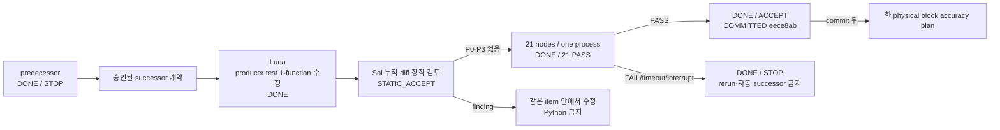

# SPD Decap PI Evaluator v0.23.1 — 작업 기준

- 문서 버전: **2.1**
- 기준 branch: **main only**
- current integrated-hardening docs base: `5a270677074868fc3e10ffa26309a208bb151ac3`
- integrated-hardening implementation commit: `eece8ab944a29a9f6c5ddde17e56de8dbbd2ee6a`
- 최종 개정: **2026-09-01 (Asia/Seoul)**
- sole ACTIVE: **NONE** — A1은 hardening commit 뒤에만 연다.
- lifecycle: **DONE / ACCEPT / COMMITTED @ `eece8ab944a29a9f6c5ddde17e56de8dbbd2ee6a`**
- runtime: **successor 21 passed in 15.09s / consumed-no-rerun**
- stage/commit: **complete @ `eece8ab944a29a9f6c5ddde17e56de8dbbd2ee6a`**

## 1. 압축 후 즉시 복구 카드

최초 목적은 원본 SPD의 source-derived physics로 PowerSI에 근접한 `Zii` 정확도를
얻는 것이다. 현재 작업은 그 정확도를 개선하는 물리 모델이 아니라, 원본 SPD
규모의 source ownership IR을 안전하게 전달하기 위한 마지막 통합 hardening이다.

두 Luna 구현 stream은 tracked working tree에 존재하고 Sol 정적 검토에서
P0–P3 없음 판정을 받았다. 첫 exact 21-node 단일 실행은 5번째 Unicode fixture의
`SPD_NO_RAILS`로 중단됐고 소모됐다. 정적 원인은 test가 `Node1`을 `Straße1`로
바꾸며 필수 `Node` source grammar를 제거한 것이다. 사용자는 grammar-valid
test-only successor와 후속 자동 진행을 승인했다. 제품 코드는 동결했고 Luna가
producer test 한 함수만 고쳤다. Sol은 `STATIC_ACCEPT`, P0–P3 0을 확정했고 새
candidate identity의 21 nodes는 한 process에서 `21 passed in 15.09s`로 통과했다.
exact nine-path candidate는 `eece8ab944a29a9f6c5ddde17e56de8dbbd2ee6a`로 commit됐고, 다음 단계는 A1의
read-only error-budget audit다.

현재 금지 사항:

- untracked `accuracy_parse.py`를 읽거나 수정하거나 stage하지 않는다.
- `git status`는 `--untracked-files=no`를 사용한다.
- successor 21-node invocation은 소모됐다. 같은 계약의 Python/pytest/build를
  다시 실행하지 않는다.
- pressure/exact-300K, full suite, 원본 SPD, solver, PowerSI, package/release를
  현재 hardening 검증에 섞지 않는다.
- predecessor 실패 계약과 partial PASS를 재사용하지 않는다. 현재 successor는
  2026-09-01 사용자 승인으로 연 별도 candidate/hash 계약이다.
- stage와 commit은 explicit path로만 수행한다.

사용량은 Codex Usage Guard v0.1.1로 phase 전환과 delegation/build 전에 확인한다.
사용자가 지정한 남은 사용량 **50%** 지점에서는 새 expensive phase를 시작하지
않고 현재 상태를 문서화해 멈춘다.

## 2. 문서 권위와 갱신 규칙

- [목적·기술 기준](PRODUCT_PURPOSE_AND_TECHNICAL_BASELINE.md)은 왜·무엇·합격
  의미와 비주장 경계를 정한다.
- 이 문서는 current candidate, 파일, 검증 예산, 상태 전이와 다음 계획만 관리한다.
- [Source-derived physical IR](SOURCE_DERIVED_PHYSICAL_IR.md)은 schema/technical
  contract다. 그 문서의 live status snapshot이 이 문서와 다르면 이 문서가 우선한다.
- exact source, commit, input/output hash와 log가 요약보다 우선한다.
- 완료 micro-item의 세부 명령과 STOP 연쇄를 current context에 다시 복제하지
  않는다. 필요하면 Git history와 Source-IR historical section에서 읽는다.

상태는 두 축으로 기록한다.

| 축 | 값 |
|---|---|
| lifecycle | `PLANNED`, `ACTIVE`, `DONE`, `BLOCKED`, `DEFERRED` |
| outcome | `TEST_ONLY_SUCCESSOR_PLANNED`, `IMPLEMENTED_AWAITING_SOL_STATIC_REVIEW`, `STATIC_ACCEPT`, `ACCEPT`, `STOP_<CAUSE>`, `not_run` |

`DONE/STOP_*`은 lifecycle과 outcome을 합친 표기이지 별도 lifecycle 값이 아니다.

## 3. 현재 working tree와 candidate receipt

branch는 `main`이다. base HEAD
`5a270677074868fc3e10ffa26309a208bb151ac3`에서 만든 implementation commit
`eece8ab944a29a9f6c5ddde17e56de8dbbd2ee6a`은 다음 아홉 파일로 제한된다.

- `docs/PRODUCT_PURPOSE_AND_TECHNICAL_BASELINE.md`
- `docs/SOURCE_DERIVED_PHYSICAL_IR.md`
- `docs/WORK_EXECUTION_BASELINE.md`
- `src/spd_decap_pi/raw_spatial_contact_compiler.py`
- `src/spd_decap_pi/source_plane_ownership_ir.py`
- `src/spd_decap_pi/spd_adapter.py`
- `tests/test_raw_spatial_contact_compiler.py`
- `tests/test_source_plane_ownership_ir.py`
- `tests/test_source_plane_ownership_ir_producer.py`

Implementation stream의 predecessor와 final **accepted** candidate SHA-256은
다음과 같다. final identity는 Sol `STATIC_ACCEPT`와 successor 21-node PASS를 얻은
뒤 `eece8ab944a29a9f6c5ddde17e56de8dbbd2ee6a`로 commit됐다.

| 파일 | predecessor SHA-256 | final candidate SHA-256 | 상태 |
|---|---|---|---|
| raw compiler product | `5B02CC51677FEB6BCBE537071C7A13342E2036C0F2D7910103118865C3A45BA2` | 동일 | frozen / successor 21 PASS 포함 |
| source IR | `1027E694F6994B4F6B109933617D149A7A5184CD6951050D2C93F67B145079DE` | `7F9AA899BD3F117316AC5949E41B45144CC309B2A3D07B585C4196BC84BF6522` | static accepted / successor 21 PASS |
| adapter | `F8E81D7B702E155C51766A8CC0CAC2B3FE3E189450BEB43DAC0811FA9A213D14` | `8AE7C31936125C028620FAB1FA217026B5CAFB47D51813FBFE9A15D01E7AC931` | static accepted / successor 21 PASS |
| source IR test | `56AAECB2A83F9E96E81D2F3F77D7EDC67F896E7AAD63BE38999AFAC06FDA8756` | `1A60C5B52B7E57BC04A2AAF2243FDA829D5C832FE247B4E0FE476FBB405A1362` | static accepted / successor 21 PASS |
| producer test | `FD9C1E698DEE0B254EB76960CC890D39C509E5926055C159DC5EF9427F87AFC9` | `BD8B813C0ED5125F741E130E65ECC26088F5BD10E057C1BEA110EDFF51C06FA4` | static accepted / successor 21 PASS |
| raw compiler test | `D51D4E45E0182DC99F60E12D7DB48528F1F38567EBD2A4E245DE416C4EF102BE` | `B04C3D50E4862868C161EBA85DA1ABEE1A4BE22D2B97F21E0A9694E9CC5A46FC` | static accepted / successor 21 PASS |

### 3.1 구현 A — source validator

허용 파일은 `source_plane_ownership_ir.py`와 해당 test뿐이다.

- NULL retained-owner edge/rail/island provenance를 명시적으로 거부한다.
- PadDef/Regular wildcard `LIKE`를 literal casefold-prefix 검사로 바꾼다.
- scope ID의 Python-casefold collision을 거부한다.
- surface lineage, dielectric layer와 ledger member validation을 indexed TEMP
  relation으로 제한한다.
- persisted v2 schema와 cap을 바꾸지 않는다.

신규 acceptance node:
`test_spool_validation_balanced_relations_use_indexed_lookups`.

### 3.2 구현 B — adapter handoff

허용 파일은 `spd_adapter.py`, producer test와 raw compiler test뿐이다.

- exact compiler source ID와 primitive primary key를 사용한다.
- Python-casefold island key와 TEMP edge indexes를 사용한다.
- canonical `ownership_source_stage` key로 pad row를 찾는다.
- logical identity의 SQLite ASCII `NOCASE` 의존을 제거한다.
- 38,939 selected rows에서 Via endpoint expansion 후 116,791 rows가 되는 것과
  derive-time cap overflow를 분리해 검증한다.
- raw compiler product, persisted schema와 cap을 바꾸지 않는다.

신규 acceptance nodes:

- `test_source_plane_ownership_streamed_handoff_preserves_unicode_casefold`
- `test_source_plane_ownership_streamed_handoff_uses_indexed_lookups`

## 4. 현재 통합 정적 review gate

Sol은 stream별 부분 판정을 합성하지 않고 현재 아홉 파일의 cumulative tracked
diff를 한 번에 검토한다.

Acceptance:

1. raw compiler product SHA가 frozen hash와 같다.
2. A/B implementation whitelist 밖의 code/test 변경이 없다.
3. nullable provenance, literal prefix, scope casefold collision, Unicode handoff,
   bounded indexed plan과 Via expansion 요구가 모두 닫혔다.
4. persisted schema/caps, solver, owner-off, `Y_global`과 `Zii`가 바뀌지 않았다.
5. test가 실제 변경 경로를 검증하며 source-string 존재 확인만으로 의미를 대신하지
   않는다.
6. P0–P3 finding이 없다.
7. final candidate SHA receipt와 `git diff --check`를 기록한다.

finding이 있으면 같은 ACTIVE item 안에서 Luna가 해당 whitelist만 수정한다.
정적 재검토 전 Python은 금지한다. whitelist 밖 설계 변경이 필요하면
`DONE / STOP_SCOPE_CHANGE`로 닫고 사용자 검토 후 새 계획을 작성한다.

## 5. 단일 21-node 실행 계약

Sol이 `STATIC_ACCEPT`한 뒤에만 Python 3.12의 새 process 하나에서
`-x -vv --tb=long`으로 다음 21개 unique node를 순서대로 실행한다.

1. `tests/test_source_plane_ownership_ir.py::test_spool_sql_validation_rejects_provenance_mutations`
2. `tests/test_source_plane_ownership_ir.py::test_spool_sql_contact_identity_and_edge_owner_rejections`
3. `tests/test_source_plane_ownership_ir.py::test_spool_sql_rejects_origin_scalar_casefold_and_ordinal_holes`
4. `tests/test_source_plane_ownership_ir.py::test_spool_validation_balanced_relations_use_indexed_lookups`
5. `tests/test_source_plane_ownership_ir_producer.py::test_source_plane_ownership_streamed_handoff_preserves_unicode_casefold`
6. `tests/test_source_plane_ownership_ir_producer.py::test_source_plane_ownership_streamed_handoff_uses_indexed_lookups`
7. `tests/test_raw_spatial_contact_compiler.py::test_ownership_expanded_selection_116791_and_global_cap`
8. `tests/test_source_plane_ownership_ir_producer.py::test_source_plane_ownership_provisional_request_aggregate_does_not_consume_final_ir_row_cap`
9. `tests/test_source_plane_ownership_ir_producer.py::test_source_plane_ownership_component_layer_is_authoritative_for_mismatched_endpoint`
10. `tests/test_raw_spatial_contact_compiler.py::test_ownership_selection_duplicate_is_sql_unique_failure`
11. `tests/test_raw_spatial_contact_compiler.py::test_ownership_selection_cap_exact_pass_plus_one_fails`
12. `tests/test_raw_spatial_contact_compiler.py::test_ownership_source_staging_keeps_original_spelling_and_canonical_lookup`
13. `tests/test_source_plane_ownership_ir.py::test_v2_mapping_and_spool_are_logically_equivalent_and_exclude_internal_tables`
14. `tests/test_source_plane_ownership_ir.py::test_spool_caps_and_cancellation_fail_closed`
15. `tests/test_source_plane_ownership_ir.py::test_spool_sql_rejects_contact_opposite_external_node_chain`
16. `tests/test_source_plane_ownership_ir.py::test_spool_temp_artifacts_are_removed_after_cancel_and_exception`
17. `tests/test_source_plane_ownership_ir_producer.py::test_source_plane_ownership_filters_global_quotient_before_selected_row_bound[unrelated_global]`
18. `tests/test_source_plane_ownership_ir_producer.py::test_source_plane_ownership_filters_global_quotient_before_selected_row_bound[projected_over_cap]`
19. `tests/test_source_plane_ownership_ir_producer.py::test_source_plane_ownership_producer_roundtrip_and_atomic_failure`
20. `tests/test_source_plane_ownership_ir.py::test_v2_exact_section_and_total_caps[150001-2-True-None]`
21. `tests/test_source_plane_ownership_ir.py::test_v2_exact_section_and_total_caps[150000-149978-True-None]`

실행 조건:

- 외부 wall limit **300 s**
- collection **21**, exit **0**, `21 passed`가 PASS의 필요조건
- stdout/stderr의 absolute path, byte count와 SHA-256 기록
- 이전 §12.60의 18-node run을 별도로 다시 실행하지 않는다.
- pressure, exact-300K, redundant cap cases, unchanged/full suite, 원본 SPD,
  solver, PowerSI와 release는 `not_run/not_required`다.

결과 전이:

| 결과 | 상태 | 다음 행동 |
|---|---|---|
| Sol finding | `ACTIVE / REVIEW_CHANGES_REQUIRED` | 같은 item·whitelist에서 수정, Python 금지 |
| Sol P0–P3 none | `ACTIVE / STATIC_ACCEPT / READY_FOR_SINGLE_INTEGRATED_RUN` | exact 21 nodes 한 번 |
| 21 PASS | `DONE / ACCEPT / READY_FOR_EXPLICIT_STAGE_AND_COMMIT` | nine paths만 stage하고 final diff 검토 |
| collection/failure/timeout/interrupt | `DONE / STOP_<CAUSE>` | partial PASS 재사용·rerun·자동 successor 금지 |
| explicit commit 완료 | `DONE / ACCEPT / COMMITTED @ <SHA>` | accuracy plan의 첫 gate로 전환 |

실제 단일 invocation은 Python 3.12.10/pytest 9.0.3에서 21개를 수집했고 앞의
4개가 PASS한 뒤 node 5
`test_source_plane_ownership_streamed_handoff_preserves_unicode_casefold`에서
`SPD_NO_RAILS`로 실패했다. fixture의 `Node1`→`Straße1` 치환 뒤 import plan이
유효한 rail을 만들지 못했으며 ownership callback에는 도달하지 않았다. 결과는
`1 failed, 4 passed in 8.66s`, child exit 1, wrapper wall 9.767968 s다.

- stdout: `C:\Users\User\AppData\Local\Temp\spd-pi-integrated-21-c3c867347ed443df9a9b5693f672aafd.stdout.log`, 7,571 bytes, SHA-256 `6C4CE1E243D1CB19D7BB179D84D9EE689E514BB9249D1942814237ADDB352B29`
- stderr: `C:\Users\User\AppData\Local\Temp\spd-pi-integrated-21-c3c867347ed443df9a9b5693f672aafd.stderr.log`, 0 bytes, SHA-256 `E3B0C44298FC1C149AFBF4C8996FB92427AE41E4649B934CA495991B7852B855`

판정은 `DONE / STOP_TEST_UNICODE_FIXTURE_RAIL_FORMATION`이다. 부분 PASS는 재사용하지
않고 동일 21-node 계약을 재실행하지 않으며 자동 fix successor를 만들지 않는다.

이 계약에서 21 PASS가 발생했을 경우에만 증명했을 범위는
fail-closed/casefold/indexed semantics와 named synthetic/MINI-SPD v2/v3
transport뿐이다. 실제 invocation은 STOP이며 production owner join, `Y_global`,
`Zii`, PowerSI 정확성 또는 성능을 증명하지 않는다.

## 6. 현재까지의 결과 압축

| 묶음 | lifecycle/outcome | 현재 의미 |
|---|---|---|
| G0, W0–W5 | DONE / ACCEPT | 목적 통제, source/I/O 안전성, solver guard와 accuracy policy 기반 |
| W6-BASE 260729 | DONE / NUMERICAL_FAIL | bare macro `1.707111 dB`, loaded macro `15.910647 dB`, failure `57`; unseen unknown |
| W7 Source IR Phase 1–4 | DONE / ACCEPT | canonical source/provenance와 contact ownership prerequisite |
| W7 prospective P0–P10 | DONE / mixed prerequisite outcomes | shadow contact/N-port/owner/assembly evidence; production 정확성 아님 |
| P11 | DONE / SHADOW_SOLVE_NUMERICAL_FAILURE | forward-reliability STOP; trusted solve 아님 |
| actual SPD/DSU/owner evidence | DONE / STOP chain | source 규모·identity·ownership 문제를 분류; 기존 one-shot은 rerun하지 않음 |
| streamed-IR chain | DONE / mixed STOP/ACCEPT | disk-backed handoff와 validator/index 경로 구현; 수치 개선 0 |
| provisional-cap oracle fix | DONE / ACCEPT | sole run `18 passed in 14.80s`; narrow synthetic/MINI scope |
| integrated hardening | DONE / STOP_TEST_UNICODE_FIXTURE_RAIL_FORMATION | Sol static P0–P3 없음; single run은 21 collected, node 5 실패; uncommitted/no-rerun |
| Unicode fixture successor | DONE / ACCEPT / COMMITTED @ `eece8ab` | Sol `STATIC_ACCEPT`, P0–P3 0; grammar-valid `NodeStraße2`; new-candidate `21 passed in 15.09s`; product frozen |
| W8 release | BLOCKED | accuracy와 product gate 뒤에만 진행 |

§12.60 historical run의 log는
`C:\Users\User\AppData\Local\Temp\spd-pi-provisional-cap-fix-18node-440ebbdd5e7540a4a9d8e300c3b6a166.log`,
2,773 bytes, SHA-256
`20B0444750B8D6F125F898AC120DD8FA4AEDE433F5D7004AADEFE513A88F47A6`다.
그 invocation은 consumed/no-rerun이다.

base commit `5a270677074868fc3e10ffa26309a208bb151ac3`의 이 문서는 D-001–D-076과
§12.60의 frozen predecessor 계약까지 보존한다. 이후 provisional-cap PASS와
integrated-review 결정의 핵심 사실은 위 표와
[Source-derived physical IR](SOURCE_DERIVED_PHYSICAL_IR.md)의 §31–§32에 보존한다.
그 상세를 current context로 자동 복원하거나 과거 partial PASS를 acceptance로
재사용하지 않는다.

## 7. hardening 뒤 정확성 우선 계획

다음 계획은 current hardening이 `DONE / ACCEPT / COMMITTED`일 때만 순서대로 연다.
각 단계는 한 번에 하나만 ACTIVE다.

predecessor hardening은 `DONE / STOP`이고 승인된 test-only successor는
`DONE / ACCEPT / COMMITTED @ eece8ab`다. 아래 항목 중 A1만 다음 PLANNED item이며
phase checkpoint 뒤 하나만 ACTIVE로 전환한다.

### A1 — W7-ACC-ERROR-BUDGET-01

목적: 새 PowerSI run 없이 기존 hash-bound W6 report로 저주파 offset, resistance
floor, inductive slope, resonance 위치·진폭/Q, phase/complex error와 bare-loaded
차이를 분리한다.

Acceptance: 한 development rail, 한 사전 지정 error component와 하나의 source-owned
physical block을 연결한 no-fit 가설이 있어야 한다. 연결이 모호하면
`STOP_NOT_READY`; code 변경과 후보 동시 구현은 없다.

검증 rung: **V0/read-only evidence audit 한 번**.

### A2 — W7-ACC-SOURCE-BLOCK-CONTRACT-01

목적: 선택 block에 필요한 geometry, stack-up, dielectric, Trace, Via,
pad/anti-pad, plane artwork와 port/owner relation을 원본 SPD에서 source-derived DB로
한 번 materialize할 계약을 고정한다.

Acceptance: original byte/hash provenance, rail-complete scope, deterministic query
key, exact old-owner bijection, replaced/retained disjoint ledger, expected error 방향과
analytic limiting case가 모두 정의된다. 하나라도 없으면 `STOP_NOT_READY`다.

검증 rung: contract V0 후, 승인된 경우에만 **production source import V3 한 번**.
PowerSI/solve는 실행하지 않는다.

### A3 — W7-ACC-ONE-BLOCK-IMPLEMENTATION-01

목적: 기존 IR/owner relation을 재사용해 선택한 physical block 하나만 research
path에 구현한다. 후보는 오차 증거에 따라 current-spreading/plane-sheet R/L,
via/pad/anti-pad local replacement, Trace R/L 또는 causal dielectric 중 하나다.

Acceptance: limiting case, passivity, reciprocity, conservation/row sum,
conditioning, deterministic stamp와 double-counting 방지를 analytic/synthetic case로
확인한다. 새 범용 abstraction, 두 번째 물리 block, schema/cap redesign이 필요하면
현재 후보를 STOP한다.

검증 rung: focused **V1 한 번**, 묶음 종료 시 bounded subsystem **V2 한 번**.

### A4 — W7-ACC-BOUNDED-DEVELOPMENT-COMPARE-01

목적: 앞 단계를 통과한 frozen candidate를 260729의 사전 지정 development
bare/loaded rail에 한해 한 번 비교한다.

Acceptance: W5 scorer로 low-frequency offset, critical-band magnitude, phase,
resonance와 complex error를 기록한다. 사전 지정 error component가 예상 방향으로
개선되고 catastrophe/integrity gate를 유지해야 한다. PowerSI fitting, global
scaling과 threshold 완화는 금지한다.

검증 rung: known-case V3 후 **frozen development V4 한 번**. 실패하면 후보를
STOP하며 다른 block으로 자동 전환하지 않는다.

### A5 — W7-ACC-HOLDOUT-AND-UNSEEN-01

260729 development가 통과한 candidate만 260804 retrospective holdout으로 간다.
두 retrospective board가 통과해도 final generalization은 새 unseen design이
필수다. unseen 자료가 없으면 상태는 `BLOCKED / DATA_REQUIRED`이며 release로 가지
않는다.

## 8. 검증 사다리와 낭비 방지

| rung | 범위 | 기본 최대 횟수 |
|---|---|---:|
| V0 | 문서 link/structure, diff, hash와 정적 source review | 변경 묶음당 1 |
| V1 | 한 root cause의 focused test/analytic oracle | 구현 묶음당 1 |
| V2 | 관련 subsystem selection | 모든 V1 green 뒤 1 |
| V3 | bounded product-core/known-case 또는 production source import | frozen phase당 1 |
| V4 | frozen development/holdout PowerSI correlation | 승인 candidate와 partition당 1 |
| V5 | package, installed smoke, release artifact/CI | exact release commit당 1 |

- 하위 rung이 red이면 상위 rung을 디버깅 수단으로 사용하지 않는다.
- 동일 계약·동일 원인으로 고비용 실행을 반복하지 않는다.
- test 수정이 product 결함을 숨기지 않는지 먼저 정적으로 검토한다.
- full suite는 정확성 milestone 또는 release 직전처럼 사전 지정한 시점에만 연다.
- predecessor closure turn은 Sol `STATIC_ACCEPT` 뒤 §5 invocation 하나만 수행해
  STOP했다. 승인된 §11 successor는 새 test hash로 정적 동결한 뒤 §5의 ordered
  21 nodes를 새 process 한 번만 실행해 PASS했다. 별도 focused 예행 test는 하지
  않았고 해당 invocation은 consumed/no-rerun이다.

## 9. 현재 결정

### D-079 — integrated candidate 구현 완료와 단일 closure

두 disjoint Luna stream은 predecessor에서 구현을 완료했다. 첫 누적 review는
일반 retained owner의 NULL provenance와 제품 경로에 결속되지 않은 두
indexed-plan test를 P1/P2로 발견했다. 같은 item 안에서 validator와 기존 test
node를 수정했고, 두 plan test를 실제 validator/import SQL의 runtime
`EXPLAIN QUERY PLAN` 계측으로 교체했다.

두 번째 review는 앞당겨진 error code 기대와 SQLite covering-index 표현을 P2로
발견했다. 동일 기존 node 안에서 기대값과 plan 정규화만 수정한 뒤 Sol 최종
재검토는 `STATIC_ACCEPT`, P0/P1/P2/P3 모두 0이었다. 이후 §5 invocation은 21개를
수집했지만 Unicode fixture의 rail formation 실패로 node 5에서 exit 1이 됐다.
따라서 최종 상태는 `DONE / STOP_TEST_UNICODE_FIXTURE_RAIL_FORMATION`; stage/commit,
A1, 원본 SPD, solver와 PowerSI는 진행하지 않는다.

### D-081 — Unicode fixture successor acceptance

사용자 승인 별도 successor는 제품 코드를 동결하고 producer test 한 함수의
fixture grammar만 복원했다. Sol 최종 판정은 `STATIC_ACCEPT`, P0/P1/P2/P3 모두
0이고, 새 candidate의 exact 21-node invocation은 `21 passed in 15.09s`, exit 0으로
끝났다. 상태는 `DONE / ACCEPT / COMMITTED @ eece8ab`이며 동일 계약을
재실행하지 않는다.

### D-080 — 정확성 우선 pivot

integrated hardening 뒤의 목적은 transport/ownership micro-hardening 반복이 아니라
source-derived physical-model accuracy다. 기존 W6 증거로 하나의 error component와
하나의 owning physical block을 먼저 선택한다. PowerSI는 fitting에 사용하지 않고,
source provenance, deterministic replacement stamp, disjoint owner ledger와 no-fit
limiting-case gate를 통과한 candidate만 bounded development comparison으로 보낸다.

## 10. 중단·사용자 검토 조건

다음이면 자동 진행을 멈추고 상태와 필요한 결정을 보고한다.

- 최초 목적, W5 threshold, PowerSI fitting 금지 또는 release 범위를 바꿔야 한다.
- whitelist 밖의 architecture/schema/cap 변경이 필요하다.
- 동일 물리 후보가 두 번째 high-cost 실행을 요구하지만 원인 변경이 없다.
- 원본 SPD source data, PowerSI reference partition 또는 unseen design이 없다.
- working tree에 범위 밖 tracked 변경이 생겨 안전하게 분리할 수 없다.
- 사용량이 사용자가 지정한 50% 남음 지점에 도달한다.

현재 ACTIVE item은 없다. §11은 commit까지 닫혔으며 whitelist 밖 제품 변경, 새
schema/cap 또는 추가 runtime이 필요하면 즉시 STOP하고 문서를 갱신한다.

## 11. 승인된 Unicode fixture successor — DONE / ACCEPT / COMMITTED @ eece8ab

### 11.1 항목과 원인

`W7-PHYS-OWNER-JOIN-OWNERSHIP-STREAMED-IR-UNICODE-FIXTURE-RAIL-FORMATION-FIX-01`
은 `DONE / ACCEPT / COMMITTED @ eece8ab944a29a9f6c5ddde17e56de8dbbd2ee6a`다. predecessor의 broad
`Node1`→`Straße1` 치환은 Node 레코드와
`.Connect` port에 필수인 `Node` 접두사를 없애고 `Node10`/`Node11`/`Node12`까지
바꿨다. 따라서 ownership callback 전 rail formation이 실패했다. core parser와
raw compiler는 `Node` 뒤의 strict UTF-8은 허용하므로 제품 결함은 확인되지 않았다.

### 11.2 whitelist와 최소 구현

Luna가 수정할 수 있는 code/test 경로는
`tests/test_source_plane_ownership_ir_producer.py` 한 개뿐이다. predecessor SHA-256은
`0A7A09C67D13156F2AA8EBDB2E88FC287922722FB7688558B05A91935D3510DC`다.
구현 뒤 Sol이 승인한 frozen SHA-256은
`BD8B813C0ED5125F741E130E65ECC26088F5BD10E057C1BEA110EDFF51C06FA4`다.

- `_ownership_fixture_payload()`의 `Node2`가 정확히 3회인지 먼저 assert한다.
- 그 세 DGND terminal chain reference만 `NodeStraße2`로 바꾼다.
- 실제 spool query는 `kind='Node'`, `lookup_a='dgnd'`,
  `lookup_b='nodestrasse2'`를 모두 요구한다.
- exact record ID `node:NodeStraße2:DGND`, Python `record_id.casefold()`과 원본
  byte span SHA-256을 검증한다.
- parser/compiler/adapter/source-IR product, 다른 test, schema/cap과 dependency는
  바꾸지 않는다. monkeypatch로 analysis/rail/callback을 우회하지 않는다.

### 11.3 정적 gate

Luna 구현 뒤 Python 없이 Sol이 다음을 확인한다.

1. 수정 경로와 test node 수가 변하지 않는다.
2. `Node` grammar, DGND rail/net identity와 세 source reference가 보존된다.
3. actual `import_spd_scenario`→raw compiler spool→IR builder 경로를 유지한다.
4. source byte slice hash와 Python casefold oracle을 약화하지 않는다.
5. 나머지 8개 tracked candidate 파일은 §3 receipt와 byte-identical이다.

finding이 없을 때만 `STATIC_ACCEPT / READY_FOR_NEW_21_NODE_RUN`이다.

실제 Sol 최종 정적 검토는 `STATIC_ACCEPT`, P0/P1/P2/P3 모두 0이었다. producer
test 외 제품·다른 test 경로와 §3 frozen receipt는 바뀌지 않았다.

### 11.4 단일 successor 실행 계약

Sol 승인 뒤 Python 3.12 fresh process에서 §5의 ordered 21 unique nodes를
`-x -vv --tb=long`, external wall 300 s로 **한 번** 실행한다. 별도 1-node 예행,
predecessor partial PASS 재사용, full suite, 원본 SPD, solver, PowerSI와 release는
하지 않는다. 같은 node ID 목록이지만 producer test hash와 ACTIVE item이 달라진
사용자 승인 successor이므로 predecessor invocation의 재실행으로 취급하지 않는다.

| 결과 | 상태 | 다음 행동 |
|---|---|---|
| collection 21, exit 0, `21 passed` | `DONE / ACCEPT / READY_FOR_EXPLICIT_STAGE_AND_COMMIT` | 문서 포함 기존 nine paths만 명시적으로 stage/commit |
| collection/failure/timeout/interrupt | `DONE / STOP_<CAUSE>` | rerun·partial reuse·자동 fix 금지 |

실제 새 candidate 실행은 Python 3.12.10/pytest 9.0.3에서 collection 21, exit 0,
`21 passed in 15.09s`, wrapper wall 15.774693 s로 끝났다.

- stdout: `C:\Users\User\AppData\Local\Temp\spd-pi-unicode-successor-21-1b4b6ce5c5474372bbdcaed23a5de443.stdout.log`, 3,158 bytes, SHA-256 `3A1E2C821E265C34E12C39F357118B93CEED7E0F22C6624A19D73B7CF072E9A0`
- stderr: `C:\Users\User\AppData\Local\Temp\spd-pi-unicode-successor-21-1b4b6ce5c5474372bbdcaed23a5de443.stderr.log`, 0 bytes, SHA-256 `E3B0C44298FC1C149AFBF4C8996FB92427AE41E4649B934CA495991B7852B855`

invocation은 consumed/no-rerun이다. PASS와 commit 뒤에만 A1을 연다. 이 successor는 test fixture와 named
synthetic/MINI-SPD transport acceptance만 닫으며 production owner join,
`Y_global`, `Zii`, PowerSI 정확성/성능과 수치 개선을 증명하지 않는다.

명시적 nine-path implementation commit은 `eece8ab944a29a9f6c5ddde17e56de8dbbd2ee6a`다.
