# SPD Decap PI Evaluator 작업 기준

- 적용 제품: **SPD Decap PI Evaluator v0.23.1**
- 문서 버전: **1.220**
- 상위 기준: [목적·기술 기준](PRODUCT_PURPOSE_AND_TECHNICAL_BASELINE.md) v1.219; [Source-derived physical IR](SOURCE_DERIVED_PHYSICAL_IR.md) v1.54
- 현재 상태: W6 numerical FAIL; W7-SOURCE-IR-P1/P2/P3/P4 및 W7-PHYS-PROSPECTIVE-P0/P1/P2/P3/P4/P5/P6/P7/P8/P9/P10/P11 DONE, P3/P11 DONE/STOP; Actual-P0/R1/R2, DIAG-01과 Recovery-01 DONE/STOP; FIX-01/FIX-02 DONE/ACCEPT; `W7-PHYS-SOURCE-ANCHOR-LEAN-DSU-EVIDENCE-01` DONE/`STOP_TARGET_CONTACT_MISSING_OR_AMBIGUOUS`다.
  `W7-PHYS-SOURCE-ANCHOR-LEAN-DSU-EVIDENCE-02`/`03`/`04` DONE/`STOP_PROVENANCE_INCOMPLETE`다.
  `W7-PHYS-SOURCE-ANCHOR-LEAN-DSU-EVIDENCE-05` DONE/`STOP_MULTIPLE_NOT_REPRODUCED`; W7-PHYS production physics remains BLOCKED. Terminal pad-layer FIX-01 is DONE/`STOP_TEST_ORACLE_FALSE_NEGATIVE`; its test-oracle FIX-01 successor is DONE/ACCEPT. Original-SPD EVIDENCE-01/-02/-04/-05 are DONE/`STOP_IMPORT_OR_OWNERSHIP`, EVIDENCE-03 is DONE/`STOP_UNEXPECTED`; compact-request-bound FIX-01 is DONE/ACCEPT. OWNERSHIP-COUNT-DIAG-01/-02 are DONE/`STOP_RESOURCE_OR_CANCELLED`; STREAMED-IR-300K-FIX-01 is DONE/`STOP_TEST_COLLECTION_SYNTAX`; collection-fix successor is DONE/`STOP_TEST_FAILURE_AND_RUNTIME_BUDGET`; current sole ACTIVE is **W7-PHYS-OWNER-JOIN-OWNERSHIP-STREAMED-IR-300K-VALIDATION-RUNTIME-FIX-01 / FROZEN / READY_FOR_IMPLEMENTATION**. Production physics/`Zii` are unchanged.
- 최종 개정: 2026-09-01 (Asia/Seoul)

## 1. 압축 후 즉시 복구 카드

context가 압축되거나 새 session에서 작업을 재개하면 이 표만 먼저 확인한다.

| 항목 | 현재 값 |
|---|---|
| 변하지 않는 목적 | source-derived single-rail `Zii`의 PowerSI 근접 정확성과 일반화 |
| 기본 복구 문서 | 목적·기술 기준 → Source-derived physical IR → 이 작업 기준, 세 문서 |
| 현재 branch | `main`만 사용 |
| 이 문서 정리의 source-before/implementation base parent | `f2c98040870b30bf21d778099cc4cb6d2a553ed5` (OWNERSHIP-COUNT-DIAG-02 contract) |
| 현재 assessment | W6-BASE numerical FAIL; Phase 4/P0–P11은 prerequisite/shadow 범위 DONE. DSU-05의 선택된 6-contact source boundary는 모두 singleton이며 all/complete graph가 동일해 R2 multiple-selector 가설이 재현되지 않았다. 제품 solver/owner-off/`Y_global`/`Zii`와 W6 PowerSI 수치는 변경되지 않아 수치 격차 개선은 0이다(새 percentage metric이 아니라 실측 improvement absence) |
| 현재 active work item | **W7-PHYS-OWNER-JOIN-OWNERSHIP-STREAMED-IR-300K-VALIDATION-RUNTIME-FIX-01 / FROZEN / READY_FOR_IMPLEMENTATION** |
| 현재 정확성 상태 | `260729 retrospective FAIL`; unseen/generalization `unknown / not_run` |
| current authorization | `main`-only, `accuracy_parse.py` 보존. Luna는 ownership IR validator SQL만 TEMP-indexed/set-based plan으로 최소 교정하고 test bytes를 보존. Sol static review 뒤 pressure→exact-300K 두 node의 `-x -vv --tb=long` Python312 invocation 1회, 외부 600 s. Old 15-node rerun, original SPD/full suite/certificate redesign/solver/P1/production/PowerSI 금지. |
| 다음 gate | **validation-runtime fix** — pressure의 첫 실패를 보존하고, PASS한 경우에만 exact-total-300K linear-plan acceptance |
| 정확한 재개 조건 | PowerSI 오차를 설명할 별도의 source-derived physical block, authoritative owner relation, deterministic replacement stamp, 무피팅 limiting-case invariant와 disjoint owner ledger가 함께 식별되고 frozen contract review를 통과해야 한다. |
| 핵심 증거 | [W6-BASE completed evidence](#w6-base-completed-evidence-260729), [W7 결과 재평가](#12-w7-결과-재평가와-후속-과제-판정) |

최초 목적은 [목적·기술 기준 2장](PRODUCT_PURPOSE_AND_TECHNICAL_BASELINE.md#2-최우선-목적),
현재 증거 상태는 [6장](PRODUCT_PURPOSE_AND_TECHNICAL_BASELINE.md#6-증거와-상태-표기)이
권위 있다. 이 문서는 그것을 재정의하지 않는다.

### 1.1 현재 구현·증거 경계

| 구분 | 현재 권위 |
|---|---|
| accepted / committed | Phase 1 `82370b6`, Phase 2 `75ac0a0`, Phase 3 `5d2c353`, Phase 4 `3b76af4`, P0 `4dc855a`, P1 `f823a53`, P2 `90f6b54`, P3 `b8a79f1`, P4 `39fd4fa`, P5 `d7e7278`, P6 `6793bb2`, P7 `f1c2968`, P8 `abf79cf`, P9 `593e070`, P10 `7f9c498`, P11 `e8d029a`, W7 owner-join `2b27e30c6fe41f03281d3943568d0905d84d8af3` DONE/ACCEPT read-only closure; 모두 prerequisite/shadow 범위이며 production `Y_global`/`Zii` 불변 |
| current candidate | DSU-01–05, Recovery-01/DIAG-01, original-SPD EVIDENCE-01/-02/-03/-04/-05와 OWNERSHIP-COUNT-DIAG-01/-02는 영구 DONE/STOP; owner-join, quotient-scope, terminal pad-layer test-oracle 및 compact-request-bound fixes are DONE/ACCEPT; streamed-IR-300K FIX-01은 collection STOP, collection-fix는 failure/runtime STOP; P12 prospective review NO-GO; validation-runtime successor sole ACTIVE |
| static evidence | P11 Sol ACCEPT; default `None` arithmetic/cache identity 불변, supplemental cache-ineligible, P10/P9/block/owner/termination identity와 original inventory/CSC/cache 불변 확인. P12 review는 synthetic bridge 때문에 actual owning-block attribution이 non-identifying이라고 판정 |
| runtime evidence | DIAG-02 exact report/receipt가 persisted됐다. WinAPI measured peak 13.09 GiB, current 1.42 GiB, scratch 131.6 MiB; expanded Node/Via 77,852/38,926, six-key selection 116,791, source-record lower bound 122,146, final-v2 lower bound 249,635. Collection-fix fresh run은 pressure `F` traceback 미보존 뒤 exact-300K에서 5,400 s budget STOP했고 acceptance summary가 없다. |
| runtime 미증명 | old-owner replacement, trusted solve와 실제 SPD/PowerSI 영향은 미증명이다. DSU-05는 source boundary 진단이며 production topology 또는 accuracy evidence가 아니다. |
| 별도 사용자 파일 | untracked `accuracy_parse.py`; 보존·미수정·미stage |
| candidate staging / acceptance | existing dirty six-file transport candidate는 보존하고, successor delta는 ownership IR validator 1개 함수만; tests byte-frozen; Sol static 뒤 named two-node conditional invocation 1회/600 s; original SPD/full suite 금지 |

## 2. 문서 사용 규칙

### 2.1 세 문서만 기본 context로 사용

작업 시작 시 기본 입력은 다음 세 개뿐이다.

1. `PRODUCT_PURPOSE_AND_TECHNICAL_BASELINE.md` — 목적·합격선·금지 경계
2. `SOURCE_DERIVED_PHYSICAL_IR.md` — source IR 계약·schema·기술 주장 범위
3. `WORK_EXECUTION_BASELINE.md` — current Git/evidence·실행 예산·다음 승인 gate

active work item에 명시된 source/test/subsystem 문서만 추가로 읽는다. 전체
`docs/evaluation-research`, session log, 과거 release note 또는 branch 역사를
일괄 로드하지 않는다.

### 2.2 이 문서가 관리하는 것

- 현재 active work item 하나
- 우선순위와 명시적 제외 범위
- 변경 묶음과 root-cause 경계
- 검증 단계, 실행 조건, 예상 비용, 최대 횟수와 중단 조건
- exact source/input/profile/artifact identity
- 완료 결과와 다음 사용자 결정

목적, 제품 sign-off 범위 또는 PowerSI 수치 합격선은 이 문서에서 임의로 바꾸지
않는다. W6 one-run production authority는 260729 completed numerical FAIL과
함께 소진되었다. historical W7 audit의 source-owner gap은 Source IR Phase 1–4의
canonical prerequisite로 보강됐지만 production physics에는 아직 연결되지 않았다. 향후 production
rerun은 source-certified rail-complete physical candidate, deterministic stamp,
falsifiable physical/analytic limiting-case invariant, disjoint owner ledger를 확보하고
사용자가 명시 승인한 경우에만 고려한다. 재개 후
순서는 one physical change → focused evidence → new gate이다. 260804/P5/unseen은
개발 case FAIL 동안 금지한다. remote/release/installer, old-root reuse/mutation,
retry, threshold/fallback 변경은 승인되지 않았다.

### 2.3 갱신 시점

이 문서는 다음 시점에만 짧게 갱신한다.

1. 사용자가 active work item을 승인했을 때
2. 변경 묶음이나 검증 예산을 확정했을 때
3. milestone 검증 직전과 직후
4. item 완료, 차단 또는 명시적 보류 시

대화별 진행 로그, 긴 stdout, 반복 설명은 넣지 않는다. raw log/artifact는 별도
경로에 두고 이 문서에는 identity, 요약 판정과 링크만 기록한다.

## 3. 작업 우선순위와 단계

제품 위험 우선순위와 실제 실행 순서를 구분한다. PowerSI 정확성은 최상위 제품
위험이지만, 수정 효과를 판정할 test/evidence 기반부터 최소 비용으로 복구한다.

| 단계 | 목적 | 종료 조건 | 고비용 검증 |
|---|---|---|---|
| `W0` | 세 canonical 문서 고정 | 목적/IR/작업 문서 상호 링크와 문서 검증 | 금지 |
| `W1` | product-core test truth 복원 | stale test 계약 정리, bounded core selection 확정 | 금지 |
| `W2` | 범위가 확정된 SPD/I/O 결함 수정 | focused checks 통과, 실제 결함별 회귀 check 존재 | 금지 |
| `W3` | product-core CI gate 활성화 | W1/W2 묶음이 한 번의 core suite에서 green | production solve 금지 |
| `W4` | solver 수치 신뢰성 선행 문제 해결 | synthetic/analytic focused gate 통과 | full correlation 금지 |
| `W5` | 정확성 계약과 frozen baseline 준비 | 사용자 승인 수치 gate, reference partition, exact run manifest | 실행 전 승인 필요 |
| `W6` | current frozen candidate 1회 baseline | completed solve와 raw hash-bound artifact, rail별 판정 | consumed: 260729 exact one-run 결과 보존 |
| `W7` | model-form error를 한 owning block씩 개선 | 사전 가설과 focused evidence 통과 | 승인된 candidate만 1회 |
| `W8` | completed-solve release gate 및 전달 | 계산·artifact·installer가 exact release commit에 결속 | 최종 1회 |

`W1`부터 `W4`까지는 production SPD 전체 correlation 없이 닫는 것이 원칙이다.
`W6` one-run gate는 260729 completed numerical FAIL로 소진되었고 W7은
source-owner-gap으로 BLOCKED다. 재개는 source-certified rail-complete physical
candidate + deterministic stamp + falsifiable physical/analytic limiting-case invariant
disjoint owner ledger 확보와 사용자 명시 승인
이후에만 one physical change → focused evidence → new gate 순서로 허용한다.

## 4. 작업 항목 register

상태 어휘는 `READY`, `ACTIVE`, `BLOCKED`, `DEFERRED`, `DONE`만 사용한다.
동시에 `ACTIVE`는 하나만 허용하며 현재 sole ACTIVE는 **W7-PHYS-OWNER-JOIN-OWNERSHIP-STREAMED-IR-300K-VALIDATION-RUNTIME-FIX-01**이다. 완료된 미시적 item을
다시 펼쳐 읽지 말고 아래 phase-level 결론과 Git history를 사용한다.
상태와 증거 축은 분리한다. `DONE`은 선언한 범위의 종료일 뿐 current commit,
production acceptance, runtime PASS 또는 PowerSI 정확성을 자동으로 뜻하지 않는다.
dirty/static/runtime/commit 상태는 복구 카드 1.1에 별도로 기록한다.

| ID | 순서 | 상태 | 작업 묶음 | 완료 기준·현재 결론 |
|---|---:|---|---|---|
| `W0-DOC` | 0 | DONE | 목적·기술 기준과 이 작업 기준 작성 | 상호 링크, Markdown/link/diff 검증 |
| `W1-TEST` | 1 | DONE | stale test double·구형 정책 기대를 current v0.23 계약에 맞게 정리하고 product-core selection 고정 | 실제 결함은 red로 남기고 test 자체 오류 제거 |
| `W2-SPD-A` | 2 | DONE | source-graph target contact persistence 복구 | target-layer coordinate가 저장·사용되는 focused regression |
| `W2-SPD-B` | 3 | DONE | graph-contact `source_sha256` 교차 검증 | 다른 source coordinate가 scenario validation에서 차단 |
| `W2-SPD-C` | 4 | DONE | `blocking:false` mixed-reference warning이 import를 중단하는 문제 수정 | warning-only case import 성공, blocking case 차단 유지 |
| `W2-IO-A` | 5 | DONE | Distribution/Tuned CSV atomic replace | write 실패 시 기존 파일 보존 |
| `W2-IO-B` | 6 | DONE | 대형 `.spdpi` load cancellation과 load 중 close 경로 | 기존 loader callback 재사용, 취소 후 stale state 없음 |
| `W3-CI` | 7 | DONE | 짧은 product-core lane을 required CI로 연결 | parser/scenario/solver/Distribution/GUI I/O 핵심 경로 green |
| `W4-FREQ` | 8 | DONE | adaptive frequency가 sample 사이 narrow peak를 보지 않고 converged 처리하는 blind spot | midpoint/coverage focused case가 peak 누락을 검출 |
| `W4-COND` | 9 | DONE | ill-conditioned sparse solve의 결과 신뢰성 gate | residual과 별도 conditioning/forward-reliability 판정 |
| `W5-GATE` | 10 | DONE | approved gate/partition/manifest plus trust-boundary adapter/controller evidence | focused trust tests and bounded V3 green |
| `W6-BLOCK-A` | 11 | DONE | versioned Layerwise comparison-runner template parity | layerwise diagnostic/correlation에만 terminal-complete 입력 보강; frozen base/physics/pivot gate unchanged |
| `W6-BLOCK-B` | 12 | BLOCKED | immutable failed-run pivot classification before rerun | 2.543e17 pivot reproduced at VTRIP/0 1 kHz, but factor context was absent; root cause remains unclassified |
| `W6-BLOCK-C` | 13 | DONE | preserve deterministic factor/matrix context at the existing fail-closed pivot | exact one-run context retained; no solver/threshold/cache/physics change |
| `W6-BLOCK-D` | 14 | DONE | estimate raw-system sparse condition lower bound at the fail-closed pivot | exact diagnostic lower bound retained; no threshold relaxation |
| `W6-BLOCK-E` | 15 | DONE | classify and gate the rejected factor after row-scaled sparse solve | exact one-shot diagnostic met finite admittance, scaled pivot, and original residual gates; no threshold/fallback change |
| `W6-BASE` | 16 | DONE | exact clean main HEAD의 retrospective one-run baseline | 260729 completed manifest/sidecar, integrity-valid offline FAIL; no retry |
| `W7-PHYS` | 17 | BLOCKED | model-form error를 한 source-derived physical block씩 개선 | admissible causal block 부재; 17DV evidence gate DONE/STOP; no physics implementation item active |
| `W7-PHYS-HISTORY` | 17A–17DF | DONE | mounted-path, ownership, raw-spatial/plane provenance의 bounded audit·discovery | exclusive causal owner를 고르지 못함; production `Y_global`/`Zii` 미변경; 개별 micro-item 재개 금지 |
| `W7-PHYS-FOUNDATION` | 17DG | DONE | sparse gauge-safe finite-port condensation foundation | standalone analytic gate PASS; production binding/accuracy는 BLOCKED |
| `W7-PHYS-PREREQUISITES` | 17DH–17DJ | BLOCKED | landing ownership과 one-block causal experiment gate | source-certified rail-complete candidate와 authoritative owner relation 부재 |
| `W7-PHYS-COVERAGE` | 17DK–17DP | BLOCKED | audit API/lifecycle repair, strict source coverage, owner-ledger reconciliation | execution evidence는 확보했으나 17DP `SOURCE_OWNER_GAP_STOP`; validation/metadata only |
| `W7-PHYS-OUTCOME-REVIEW` | 17DQ | DONE | 현재 결과 재평가와 후속 필요성 판정 | artifact-only ablation과 owner-manifest/schema continuation을 열지 않고 ACTIVE NONE 유지 |
| `W7-PHYS-CANDIDATE-REVIEW` | 17DR | DONE | source/provenance/ownership feasibility candidate gate review | review 완료; candidate 결과 **NOT READY/STOP**; 상위 W7 **BLOCKED** / **ACTIVE NONE** |
| `W7-PHYS-CANDIDATE-REVIEW-CLOSURE` | 17DS | DONE | exact source-only bare-development rail candidate closure | `ADC_VDD_180_VQPS_SYS_1_AON/0` subject review 완료; raw-spatial v2 only로 `STOP_RAW_SPATIAL_V3_ABSENT`; candidate **NOT READY/STOP**; 상위 W7 **BLOCKED** |
| `W7-PHYS-V3-REPRODUCTION` | 17DT | DONE | fresh import-save-only source raw-spatial v3 reproduction | internal v3 PASS; W6 comparability `STOP_IDENTITY_DRIFT`; no physics/profile/GUI change |
| `W7-PHYS-LOCAL-SEAM` | 17DU | DONE | one read-only current-lineage rail footprint seam audit + focused test | execution `STOP_AUDIT_CONTRACT_MISMATCH`; no local seam evidence; W7 remains BLOCKED and production physics/`Zii` unchanged |
| `W7-PHYS-METADATA-BRIDGE` | 17DV | DONE | one-shot read-only metadata-only logical-to-physical bridge gate | `STOP_NO_AUTHORITATIVE_BRIDGE`; HEAD `11ef7af81ba087c0d9ec7442ba43940a23c734d9`, exit 2, runtime 172.429 s, peak RSS 7,324,794,880 bytes, no retry; output SHA-256 `86C3330EA47974167FE987821631A5F0FCB5DF9C4A56617A8574B5934D9CDB5A`; frozen four-file whitelist remains historical execution scope |
| `W7-SOURCE-IR-P1` | IR-1 | DONE | source-plane ownership SQLite storage/validation vertical slice | deterministic schema/hash round-trip, per-field material lineage, complete terminal provenance, exact island와 owner exact-once ledger; `7 passed in 0.84s` |
| `W7-SOURCE-IR-P2` | IR-2 | DONE | import-time producer seam과 atomic scenario envelope 결속 | exact SPD spans/records, cleanup 전 live relation, raw/compiled identity finalization; combined focused evidence green, final end-to-end node `1 passed in 1.39s` |
| `W7-SOURCE-IR-P3` | IR-3 | DONE | source-plane patch shadow finite-port witness | exact IR/raw/owner join, analytic R/L/C와 deterministic finite-port witness PASS; production stamp/owner/`Zii` 불변 |
| `W7-SOURCE-IR-P4` | IR-4 | DONE | quotient-authoritative contact-complete ownership IR v2 | R2 fixture/acceptance 부정합 분류, R3/R5 focused PASS, R6 Sol ACCEPT; commit `3b76af4`; prerequisite-only |
| `W7-SOURCE-IR-P4-R2-CAUSE` | IR-4R2 | DONE | decap boundary 부재의 단일 causal contract | C1 isolated Node3 때문에 Trace11 quotient union이 생기지 않아 Via11이 leaf-prune된 fixture 원인으로 정적 확정 |
| `W7-PHYS-PROSPECTIVE-P0` | P0 | DONE | contact-to-artwork finite-port admissibility | commit `4dc855a`; final focused `1 passed in 1.51s`; Sol ACCEPT; production 불변 |
| `W7-PHYS-PROSPECTIVE-P1` | P1 | DONE | contact-complete shadow N-port condensation | commit `f823a53`; focused `1 passed in 1.58s`; Sol identity review 반영; production 불변 |
| `W7-PHYS-PROSPECTIVE-P2` | P2 | DONE | P1↔production incident old-edge identity bijection | commit `90f6b54`; corrected focused `1 passed in 1.49s`; Sol ACCEPT; candidate closed set만, `replacement_ready=false` |
| `W7-PHYS-PROSPECTIVE-P3` | P3 | DONE | P1 contact-space의 production quotient representability | commit `b8a79f1`; focused `1 passed in 1.51s`; Sol ACCEPT; `CONTACT_INTERFACE_RANK_LOSS` STOP; production 불변 |
| `W7-PHYS-PROSPECTIVE-P4` | P4 | DONE | selected ideal class의 base-network closed cut-set | commit `39fd4fa`; corrected focused `1 passed in 1.53s`; Sol ACCEPT; CLOSED, `split_ready=false` |
| `W7-PHYS-PROSPECTIVE-P5` | P5 | DONE | deterministic shadow contact rewire plan | commit `d7e7278`; focused `1 passed in 1.73s`; Sol ACCEPT; PLANNED, production/replacement readiness false |
| `W7-PHYS-PROSPECTIVE-P6` | P6 | DONE | shadow rewire–scenario commutation audit | commit `6793bb2`; final focused `1 passed in 1.42s`; Sol ACCEPT; PASSED, production/replacement readiness false |
| `W7-PHYS-PROSPECTIVE-P7` | 18 | DONE | one-frequency atomic replacement recipe audit | commit `f1c2968`; focused `1 passed in 1.58s`; Sol ACCEPT; readiness false; production 불변 |
| `W7-PHYS-PROSPECTIVE-P8` | 19 | DONE | assembly prerequisite shadow topology/index embedding | commit `abf79cf`; final focused `1 passed in 1.60s`; Sol ACCEPT; materialized, stamp/solve false; production 불변 |
| `W7-PHYS-PROSPECTIVE-P9` | 20 | DONE | shadow P1 nodal-block binding | commit `593e070`; final focused `1 passed in 1.60s`; Sol ACCEPT; bound, actual stamp/solve 금지 |
| `W7-PHYS-PROSPECTIVE-P10` | 21 | DONE | shadow augmented component closure | commit `7f9c498`; final focused `1 passed in 1.56s`; Sol ACCEPT; component/pruning closed, actual stamp/solve 미수행 |
| `W7-PHYS-PROSPECTIVE-P11` | 22 | DONE | exact 1 GHz shadow P1-augmented solve | commit `e8d029a`; final focused `1 passed in 1.55s`; Sol ACCEPT; `SHADOW_SOLVE_NUMERICAL_FAILURE` STOP, production wiring/cache 불변 |
| `W7-PHYS-ACTUAL-P0` | 23 | DONE | actual original-SPD source-IR scenario generation | commit `ff3327c`; import/save/load `1/0/0`, 3,357.744 s; selector identity STOP, scenario absent; no retry |
| `W7-PHYS-ACTUAL-P0-FIX-01` | 24 | DONE | ownership selected-surface identity correction | commit `b0b90db`; mismatch/direct focused PASS; Sol ACCEPT; production unchanged |
| `W7-PHYS-ACTUAL-P0-R1` | 25 | DONE | successor actual original-SPD source-IR generation | commit `0ac15e8`; import/save/load `1/0/0`, 3,368.603 s; candidate identity unclassified STOP, scenario absent; retry 0 |
| `W7-PHYS-ACTUAL-P0-FIX-02` | 26 | DONE | ownership component candidate cardinality classifier | commit `6fc06dd`; focused two nodes PASS; Sol ACCEPT; production unchanged |
| `W7-PHYS-ACTUAL-P0-R2` | 27 | DONE | successor actual candidate diagnostic one-shot | commit `ff8613c`; import/save/load `1/0/0`; actual multiple STOP; retry 0 |
| `W7-PHYS-R2-MULTI-TOPOLOGY-DIAG-01` | 28 | DONE | frozen artifact multiple-topology semantics | bundle load 뒤 report-finalization **BLOCKED/STOP**; report SHA `725ec8b4…a53c`; no topology claim; retry 0 |
| `W7-PHYS-R2-STORAGE-METADATA-RECOVERY-01` | 29 | DONE | exact certificate storage descriptor stream | execution PASS; compiled-only; scientific `STOP_FULL_CERTIFICATE_UNAVAILABLE`; report 3,092 bytes/SHA `fbd4f9d4593af4d3b58828f6ca7c17a85b4d6d1fc62c7afcd29b6b7c9c9319e3`; scenario 760,816,272 bytes/SHA `15115693d43bdfe69bfcf2d17faeb465da0adac640072183ee24eeea414fa9d9`; full surface absent; no topology claim |
| `W7-PHYS-SOURCE-ANCHOR-COMPONENT-EVIDENCE-01` | 30 | DONE/STOP_RESOURCE_OR_CANCELLED | producer-time source anchor/component evidence observer | target census cap에서 영구 종료; retry/reuse/rerun 없음 |
| `W7-PHYS-SOURCE-ANCHOR-LEAN-DSU-EVIDENCE-01` | 31 | DONE/STOP_TARGET_CONTACT_MISSING_OR_AMBIGUOUS | producer-time lean DSU source anchor/component evidence observer | pre-graph target-rail identity guard STOP; V1/V2/E1/E2/V3 not evaluated; retry/reuse/rerun 없음 |
| `W7-PHYS-SOURCE-ANCHOR-LEAN-DSU-EVIDENCE-02` | 32 | DONE/STOP_PROVENANCE_INCOMPLETE | producer-time lean DSU source anchor/component evidence observer | immediate singleton-island guard에서 pre-graph STOP; V1/V2/E1/E2/V3 not evaluated; retry/reuse/rerun 없음 |
| `W7-PHYS-SOURCE-ANCHOR-LEAN-DSU-EVIDENCE-03` | 33 | DONE/STOP_PROVENANCE_INCOMPLETE | producer-time lean DSU source anchor/component evidence observer | actual immediate L02와 remote selected L29 동일성 과잉 guard에서 pre-graph STOP; V1/V2/E1/E2/V3 not evaluated; no retry/reuse/rerun |
| `W7-PHYS-SOURCE-ANCHOR-LEAN-DSU-EVIDENCE-04` | 34 | DONE/STOP_PROVENANCE_INCOMPLETE | producer-time lean DSU source anchor/component evidence observer | empty immediate를 invalid로 본 과잉 guard에서 pre-graph STOP; V1/V2/E1/E2/V3 not evaluated; no retry/reuse/rerun |
| `W7-PHYS-SOURCE-ANCHOR-LEAN-DSU-EVIDENCE-05` | 35 | DONE/STOP_MULTIPLE_NOT_REPRODUCED | path-aware producer-time lean DSU source anchor/component evidence observer | 3V+2E PASS; six contacts direct/complete/singleton; source-boundary multiple-selector 가설 미재현; retry 0; no successor |
| `W7-PHYS-OWNER-JOIN-ORIGINAL-SPD-EVIDENCE-02` | 36 | DONE/STOP_IMPORT_OR_OWNERSHIP | quotient-scope fix 뒤 original-SPD owner-join one-shot | contract `8609c806443b4df18a9ad9b55e56987ec8bcbaec`; composite terminal raw-selection guard STOP; calls `1/0/0/0/1`, retry 0, no rerun |
| `W7-PHYS-OWNER-JOIN-TERMINAL-PAD-LAYER-FIX-01` | 37 | DONE/STOP_TEST_ORACLE_FALSE_NEGATIVE | terminal PadDef/Regular raw provenance layer correction | product diff Sol static ACCEPT; sole run `1 failed in 1.65s` at faulty `mismatched` discriminator; no rerun |
| `W7-PHYS-OWNER-JOIN-TERMINAL-PAD-LAYER-TEST-ORACLE-FIX-01` | 38 | DONE/ACCEPT | predecessor focused-test oracle correction | docs contract `198fb3e`; product diff unchanged; one-line test fix; fresh node `1 passed in 1.60s`; Sol `CODE_TEST_ACCEPT` |
| `W7-PHYS-OWNER-JOIN-ORIGINAL-SPD-EVIDENCE-03` | 39 | DONE/STOP_UNEXPECTED | terminal source-layer fix 뒤 original-SPD owner-join one-shot | bundled interpreter missing `httpx` before import; calls `0/0/0/0/1`, retry 0; report/receipt finalized; no rerun |
| `W7-PHYS-OWNER-JOIN-ORIGINAL-SPD-EVIDENCE-04` | 40 | DONE/STOP_IMPORT_OR_OWNERSHIP | project-interpreter-bound original-SPD owner-join one-shot | exact contract `e6575c0`; compact ownership request exceeded the bounded row limit; calls `1/0/0/0/1`, retry 0; no rerun |
| `W7-PHYS-OWNER-JOIN-COMPACT-REQUEST-BOUND-FIX-01` | 41 | DONE/ACCEPT | remove non-authoritative overlapping provisional row aggregate | commit `af84334`; all actual caps unchanged; sole node `1 passed in 1.65s`; Sol `CODE_TEST_ACCEPT` |
| `W7-PHYS-OWNER-JOIN-ORIGINAL-SPD-EVIDENCE-05` | 42 | DONE/STOP_IMPORT_OR_OWNERSHIP | distinct post-fix original-SPD owner-join one-shot | exact contract `db84e47`; selected Via endpoint expansion proved Node+Via subtotal >100,000; complete count unknown; no rerun |
| `W7-PHYS-OWNER-JOIN-OWNERSHIP-COUNT-DIAG-01` | 43 | DONE/STOP_RESOURCE_OR_CANCELLED | disk-backed exact sizing before cap/schema decision | contract `20c43f6`; 4,253.062 s; resource result ambiguous and count payload lost; report/receipt immutable; no rerun |
| `W7-PHYS-OWNER-JOIN-OWNERSHIP-COUNT-DIAG-02` | 44 | DONE/STOP_RESOURCE_OR_CANCELLED | preserve counts and classify Windows peak-working-set result before cap/schema decision | contract `f2c9804`; counts preserved; actual peak 13.09 GiB > 8 GiB; cap-only rejected; no rerun |
| `W7-PHYS-OWNER-JOIN-OWNERSHIP-STREAMED-IR-300K-FIX-01` | 45 | DONE/STOP_TEST_COLLECTION_SYNTAX | spool-backed ownership handoff and separated count bounds | Sol STATIC_ACCEPT; sole run exit 1 during collection, `3 errors in 1.98s`, zero test bodies; no rerun |
| `W7-PHYS-OWNER-JOIN-OWNERSHIP-STREAMED-IR-300K-COLLECTION-FIX-01` | 46 | DONE/STOP_TEST_FAILURE_AND_RUNTIME_BUDGET | delete duplicate first module docstring and collect the accepted focused scope | one-line delta static ACCEPT; sole run pressure F without traceback, exact-300K CPU-active until 5,400 s parent stop; no rerun |
| `W7-PHYS-OWNER-JOIN-OWNERSHIP-STREAMED-IR-300K-VALIDATION-RUNTIME-FIX-01` | 47 | ACTIVE | remove deterministic superlinear folded validation plans and preserve the first pressure failure | one source file only; tests frozen; Sol static then pressure→exact-300K conditional two-node invocation once/600 s |
| `W8-REL` | 18 | BLOCKED | completed known-case solve를 release gate에 연결하고 최종 전달 | accuracy/product gate와 exact release commit 필요 |
| `D-DIST` | - | DEFERRED | Distribution routing/DRC scope 확대 | 사용자가 implementation-ready/DRC 목표로 승격할 때만 |
| `D-DOC` | - | DEFERRED | README와 동결 연구 배너 정리 | current work를 방해할 때 별도 문서 묶음으로 처리 |

새 item은 재개 조건을 충족해 사용자가 승인할 때만 `ACTIVE`로 바꾸고,
그때 source 위치, 변경 whitelist와 검증 예산을 기록한다.

## 5. 검증 사다리와 실행 예산

아래 단계에서 필요한 가장 낮은 rung만 사용한다. 상위 rung이 green이라고 하위
문제의 root cause를 설명하는 것은 아니며, 하위 rung이 red이면 상위로 가지 않는다.

| 등급 | 내용 | 기본 최대 횟수 | 실행 조건 |
|---|---|---:|---|
| `V0` | 문서 link/structure, `git diff --check`, 정적 source 확인 | 변경 묶음당 1회 | 문서 또는 계획 변경 종료 시 |
| `V1` | 한 root cause를 재현하는 focused test/self-check | 구현 묶음 후 1회 | 해당 item acceptance를 직접 판정할 때 |
| `V2` | 관련 subsystem test selection | item 묶음 종료 후 1회 | 모든 V1이 green일 때 |
| `V3` | bounded product-core suite 또는 small known-case completed solve | frozen phase당 1회 | W2/W4 같은 phase 종료 시 |
| `V4` | production SPD/PowerSI full solve·correlation | 승인된 frozen candidate당 1회 | W5 run manifest 승인 후 |
| `V5` | package, installed smoke, release artifact/CI | exact release commit당 1회 | 기능·정확성 gate 완료 후 |

실패 후 같은 명령을 그대로 반복하지 않는다. `V1–V3` 재실행은 실패 원인을
설명하는 코드·test·fixture 변경이 생긴 경우 한 번만 허용한다. 두 번째 실패는
더 작은 재현으로 돌아간다.

`V4`는 자동 재시도하지 않는다. 실패·중단·자원 초과가 발생하면 raw evidence를
보존하고 원인을 저비용 단계로 축소한다. W6 authority는 consumed 상태이고 W7은
source-owner-gap으로 BLOCKED다. production one-run은 source-certified rail-complete
physical candidate + deterministic stamp + falsifiable physical/analytic limiting-case
invariant + disjoint owner ledger 확보와 사용자
명시 승인 뒤에만 one physical change → focused evidence → new gate 순서로 시작한다.
그 전에는 rerun하지 않는다. `V5`는 intermediate code나 문서 변경 때문에 실행하지 않는다.

## 6. 변경 유형별 최소 검증

| 변경 유형 | 필수 | 이번 묶음에서 하지 않는 것 |
|---|---|---|
| 목적/작업 문서 | `V0` | pytest, solver, installer |
| stale test 계약만 수정 | 해당 test file `V1` | production input, package |
| SPD import/provenance | focused negative/positive `V1`, 묶음 끝 import subsystem `V2` | PowerSI correlation |
| CSV/save/load/cancel | failure-preservation `V1`, GUI/I/O selection `V2` | solver/installer |
| CI workflow | workflow text/selection 확인 후 product-core `V3` 1회 | full research suite 반복 |
| solver sampling/conditioning | synthetic/analytic `V1`, bounded solver `V2` | 곧바로 production correlation |
| physical model/profile/compiler | local oracle `V1`, known-case `V3`; milestone이면 `V4` | 한 수정마다 full correlation |
| release/installer | `V5` | 미완료 기능을 package green으로 대신 증명 |

전체 2,434개 test를 매 PR에서 반드시 실행하는 것이 목표는 아니다. product-core와
heavy research suite를 분리하고, full suite가 필요한 시점은 active work item에서
사전에 한 번 지정한다.

## 7. Active work item 작성 형식

사용자 지시를 받으면 아래 block 하나를 이 절의 맨 위에 작성한다. 완료 후 짧은
결과 row로 줄이고 다음 item을 자동 시작하지 않는다.

```text
ID / 상태:
사용자 목적과의 연결:
이번 변경 묶음:
명시적 제외 범위:
root-cause 가설:
읽을 source/test/subsystem 문서:
acceptance:
V0–V5 계획과 최대 횟수:
중단 조건:
evidence identity before:
결과 / artifact / diff:
다음 사용자 결정:
```

ID / 상태: `W4-COND / DONE`
사용자 목적과의 연결: sparse factor가 작은 backward residual을 내더라도 극단적인 U-pivot spread로 forward reliability가 무너지는 결과를 product-core 경계에서 fail-closed 한다. 이는 model-form 또는 PowerSI 정확성 증거가 아니다.
이번 변경 묶음: `layer_surface_network.py`의 기존 U-diagonal ratio 계산에 `1.0e13` ceiling과 invalid-pivot rejection을 추가하고 residual gate 이후 forward-reliability rejection을 적용했다. cache payload에도 동일 ceiling을 검증하며 solver identity를 `modal-mvp-0.8.4`로 갱신했다.
명시적 제외 범위: fallback/reordering/pivot tuning/clamp, residual gate 완화, compiler `kron-v8`, convergence `v5`, app `v0.23.0`, model physics, W5 hash-bound PowerSI validation, production SPD/PowerSI, installer/release.
root-cause 가설: 기존 코드는 `factor.U.diagonal()` ratio를 진단에만 기록하고 극단적인 spread를 결과·cache에 허용했다.
읽을 source/test/subsystem 문서: 목적·기술 기준, 이 작업 기준, `layer_surface_network.py` factor/cache 경계, `tests/test_layer_surface_network.py`, `tests/test_layerwise_network.py`, 그리고 W5 이후에도 재생성하지 않는 frozen pre-W4 validator/non-regression scripts.
acceptance: 실제 SuperLU `solve`를 위임하는 wrapper가 backward residual `<=1e-9`인 상태에서 1:1e-17 pivot ratio를 forward-reliability wording으로 거부한다. 1:1e-13(정확히 `1.0e13`)은 admittance/residual/보고 ratio를 보존하며 허용된다. 빈/nonfinite/nonpositive pivot과 초과 cache payload는 fail-closed다.
V0–V5 계획과 최대 횟수: conditioning adversarial V1 red 1회; adversarial+ceiling V1 green `2 passed` 1회; layer-surface/layerwise plus exact solver identity V2 `94 passed` 1회; resulting CI bounded V3 selection 1회; V0 YAML/diff 정적 확인 1회; V4–V5와 production solve 금지.
중단 조건: residual gate와 forward gate를 혼합해야 하거나, fallback/reordering/physics 변경이 필요하거나, W5 numerical/PowerSI run 승인이 필요한 경우.
evidence identity before: `main` / `3b6ed2cc6308179002fee817c1b14f7efebd6cb9` / solver `modal-mvp-0.8.3` / compiler `kron-v8` / convergence `v5`.
결과 / artifact / diff: conditioning red node는 `1 failed`; 최소 solver/cache gate 후 adversarial+ceiling focused는 `2 passed in 0.72s`였다. 최종 `pytest -q tests/test_layer_surface_network.py tests/test_layerwise_network.py tests/test_spd_decap_evaluation.py::test_solver_version_0_8_2_recalculates_0_6_baseline_cache`는 `94 passed in 2.16s`였다. source-before는 `main` / `b2608a260a1f952c9b1f6c11d57b71e060ae575c`이며, 그 W4 묶음은 workflow Test command에 두 W4 conditioning gate를 보존적으로 추가한 bounded V3 selection을 `QT_QPA_PLATFORM=offscreen`으로 1회 실행해 `325 passed, 1 skipped in 18.25s`였다. Required CI command에는 두 W4 gate node가 유지된다. W4-FREQ synthetic closure는 별도 commit에서 완료되었고, 이번 묶음은 forward-reliability gate와 v0.8.4 live identity에 한정한다. W5 hash-bound validator/non-regression scripts와 기존 artifact identity는 pre-W4 값으로 동결해 두었으며, 이는 해당 W4 시점의 historical evidence이다. W5 승인 후에도 historical assets는 갱신하지 않는다. 그 W4 묶음에서는 remote CI/full suite/production SPD/PowerSI/installer/release를 실행하지 않았다. accuracy는 `unknown / not_run`; model-form/PowerSI 수치 합격을 주장하지 않는다.
W5 policy와 implementation은 승인·동결되었고 W5-GATE는 DONE이다. W6-BLOCK-A도
DONE이며, W6-BLOCK-B는 diagnostic pivot 미분류로 BLOCKED, W6-BLOCK-C와
W6-BLOCK-D와 W6-BLOCK-E는 DONE이다. W6-BASE는 260729에 대해 completed
manifest/sidecar를 남긴 **numerical FAIL**로 DONE이며, offline verifier는 exit 2로
무결성을 확인했다. 제품 최상위 목적은 PowerSI와 비슷한 정확도의 계산이며,
현재 개발 case 정확성은 `260729 retrospective FAIL`, unseen/generalization과
260804/P5는 `unknown / not_run`이다. 개발 case FAIL 동안 260804/P5 실행과
추가 production rerun은 금지한다.

W6-BLOCK-A는 v6 adapter가 layerwise diagnostic/correlation에서만 누락된
`terminal_complete_external_input=True`를 보강하고 explicit value를 보존하며
hook을 복구하도록 한 parity 수정이다. import passthrough, legacy/research,
frozen base benchmark, solver physics, pivot gate와 v6 validator는 변경하지
않았다. V1은 사전 `1 failed`, 수정 후 `1 passed in 0.88s`; V2는 `10 passed in
2.13s`; 현재 bounded V3는 `361 passed, 1 skipped in 22.88s`, exit 0이다. Skip은
`tests/test_spd_decap_scenario_io.py:1048`의 local v0.13 SPD regression bundle
부재다.

첫 260729 controller attempt는 exact source HEAD
`46d17dc73381d4292ea342d7a10e85d4f2e338f6`에서
`D:\SPD-Decap-PI-Evaluator-W6\46d17dc73381d4292ea342d7a10e85d4f2e338f6\260729`
에 수행되었다. `blocked_partial.json` SHA는
`b81525bd47744dc1ea5c75bb26f20ea354246ad88b8ce5bc9aef131cb50c09f7`이며 phase1은
통과, phase2는 exit 2, v6는 not_started, scoring은 refused였다. 이 tombstone은
구 policy SHA `c362acb01ef28cefbbd1d32753f86bccafbdd53355b42eda83c03a6ea810698b`에
결속되므로 새 policy로 소급 검증하지 않으며, root는 W6-BASE controller output·scoring
snapshot·retry·mutation에 사용하지 않는다. B의 correlation은 historical evidence이고,
C는 old candidate/import report를 정확히 한 번 read-only로 열며 correlation report는
입력으로 사용하지 않는다. C는 이미 별도 fresh root에 썼고, D도 brand-new
diagnostic root에만 쓴다.
Fresh import는 `5078.367847900023s`, candidate `796205663` bytes /
`8b02836c03aa38c447fba37ddd30434a3e4ed34ce772654fa5bc3a8512543320`, import report
`e65cae7297b28a36e405074e7135c216c65c483d237973928d9bf63488d3b0b5`, frequency
solves `0`, Touchstone read `false`였다 (phase1 import report only). Phase2 read and
hashed the registered PowerSI Touchstone and attempted correlation; all rails were
blocked, so no completed comparison or score was produced. Correlation report는
`1fbc44ddb9f9c59254a56fd355096332d2fa4ea091516aa02cec3e9a20368dbb`이며 mode10
16 rails가 실행되었다. 12 rails는 rectangular-plane runner contract, VTRIP/VINT
4 rails는 올바른 `2.543e17 > 1e13` pivot gate로 차단되었다. mode12는 새 solve 없이
16 source blocker를 유지·재사용했고, release failure 32는 독립 solve 32개가
아니다. exact parity와 수치 정확성 결과는 없다. 260804는 실행하지 않았다.

`W6-BLOCK-B`는 BLOCKED다. 진단 root
`D:\SPD-Decap-PI-Evaluator-W6-Diagnostics\6bbe44e2f36610755103757d6a4502c9ed9760d3\260729-vtrip0-1khz`
에서 `ADC_VDD_055_VTRIP/0`의 1000 Hz 단일 diagnostic이 exit 1로 종료되며
`2.543e17 > 1e13` pivot을 재현했지만, 기존 예외에 factor context가 없어
assembly/scaling/topology defect와 genuine conditioning boundary를 구분하지 못했다.
stdout SHA는 `e3b0c44298fc1c149afbf4c8996fb92427ae41e4649b934ca495991b7852b855`,
stderr SHA는 `cb0d72713189a6fb71f6622afc80128fdc435917f63b8a27032981e3e732623a`이며
report/artifact는 없다. elapsed는 약 `687.84s`이며 old root와 repo는 불변이다.

`W6-BLOCK-C / DONE`는 기존 pivot-ratio 초과 raise에 이미 계산·보유된
frequency/component/retained/local/U-pivot/residual/matrix SHA context를 inline으로
보존했다. 새 root
`D:\SPD-Decap-PI-Evaluator-W6-Diagnostics\e9a1ca124d94f1bd0192d519aa22996e87266ac5\260729-vtrip0-1khz`
의 단일 diagnostic은 exit 1, 약 `667.19s`, no report였고 stdout SHA는
`e3b0c44298fc1c149afbf4c8996fb92427ae41e4649b934ca495991b7852b855`, stderr SHA는
`8468b8f0798dc754c2c5926cc01dbe26d612b9cba7867efe4fa96f389bf89fc8`였다. Context는
retained `756888`, nnz `2904010`, local `2.467e-13..1.575e+08`, pivots
`3.290e-10..8.366e+07`, ratio `2.543e17`, residual `6.808e-20`, matrix SHA
`709efcd1b8857c1ab9c4f73bec20cc7ec7d144cd9bfd32b9ee1657b956587524`다. old
candidate/import와 repo는 불변이며 full W6/260804/PowerSI/scoring은 실행하지 않았다.
solver 결과, threshold/order/cache/admittance/port/physics와 trust identity는 변경하지
않았다. C test node history 6회(기존 red/green과 review assertion 교정)는 그대로
보존한다. C는 old root의 candidate와 import report를 각각 정확히 한 번 read-only
입력으로만 열고 correlation report는 입력으로 사용하지 않으며, output은 fresh root에만 쓴다.
초기 호출은 4회였다: pre-code red `1 failed in 0.85s`, post-code
frequency-format mismatch `1 failed in 0.78s`, SHA trailing-parenthesis mismatch
`1 failed in 0.97s`, 최종 `1 passed in 0.68s`. review-strengthened assertion의
첫 실행은 SHA literal에서 trailing `b`를 빠뜨려 `1 failed in 0.83s`였고, exact
64-hex literal로 교정한 최소 재실행은 `1 passed in 0.71s`였다. 따라서 이 node의
실제 호출은 총 6회이며, 다른 node는 실행하지 않았다. C acceptance는
deterministic context 보존으로 닫혔다. D lower-bound evidence가 닫힐 때까지
W6-BASE는 실행하지 않는다.

`W6-BLOCK-D / DONE`는 기존 pivot failure branch에서만 sparse `||A||1`와
factor solve 기반 inverse `onenormest(t=1,itmax=5)`를 계산해
`inverse_one_norm_lower_bound`와 `condition_1_lower_bound`를 기록한다. 값은
`unavailable`로 fail-closed 기록할 수 있으며, 정상 path 계산·threshold 완화·fallback·
reordering·port 이동·physics 변경은 없다. Raw-system condition lower bound가
`>1e13`이면 해당 local system이 적어도 그 수준으로 ill-conditioned하다는 증거지만,
낮은 bound는 false positive나 assembly/topology correctness를 증명하지 않는다.
V1 red는 `1 failed in 0.80s`, green은 `1 passed in 0.62s`; V2
`python -m pytest -q tests/test_layer_surface_network.py`는 `58 passed in 1.91s`였다.
V3/full W6/PowerSI는 금지한다. D diagnostic은
`D:\SPD-Decap-PI-Evaluator-W6-Diagnostics\ac828f306da4ca4fa4e4c80c2cb77cadf0d3185f\260729-vtrip0-1khz-cond1`
에서 exit 1, `668.63s`, no report였다. stdout는 빈 파일 SHA
`e3b0c44298fc1c149afbf4c8996fb92427ae41e4649b934ca495991b7852b855`, stderr는
`3961` bytes/SHA `d40503688889e51afd00504321ca37e032ff6b81fcb800c3bb51d722abab5c58`이며,
`inverse_one_norm_lower_bound=3.040e+09`,
`condition_1_lower_bound=9.572e+17`였다. C context와 matrix SHA는 유지됐고,
inputs/repo는 불변, full W6/260804/PowerSI/scoring은 미실행이다.

`W6-BLOCK-E / DONE`는 row norm `abs(A).sum(axis=1)` 기반의 positive real
`S=diag(1/sqrt(row_norm))`와 sparse `Aeq=SAS`를 사용해 scaled factor를 정확히
한 번 만들고, `beq=S*b`, `x=S*y`로 원래 좌표 결과와 `A@x-b` residual을 유지한다.
실패한 factor의 raw inverse lower-bound는 `S*factor.solve(S*x)` 및 H 변환으로
계산한다. pivot ceiling `1e13`, original-coordinate residual `1e-9`, cache/hash,
assembly/ports/physics는 바꾸지 않는다. solver identity는 `modal-mvp-0.8.5`다.
V1 analytic red는 `1 failed in 0.93s`, corrected green은 `1 passed in 0.72s`였고,
py_compile은 두 파일에서 통과했다. 중간 source indentation/syntax collection
failure가 두 번 있었고, 첫 valid exact V2는 `129 passed, 2 failed in 3.89s`,
test-only correction 뒤 `130 passed, 1 failed in 4.63s`였다. 두 번의 command/path
typo 시도는 0 tests라 validation evidence가 아니며, 최종 valid bounded V2는
`131 passed in 4.13s`, exit 0이다. 이 결과는 local structural evidence일 뿐
PowerSI accuracy evidence가 아니다.

E의 단일 production diagnostic invocation은
`D:\SPD-Decap-PI-Evaluator-W6-Diagnostics\f23c5b241d522d05f50f6de05bd6819723b7d3db\260729-vtrip0-1khz-equilibrated`에서
exit 0, `697.35s`로 완료됐다. Report는 `6464` bytes/SHA
`70e1264e6e4223da9c8715ade5695d02f1ab951aa36b418e5b067a3145fd2e9f`, stdout는
`281` bytes/SHA `da71076cad8e6c7308b46bcfc42b8ef0395b430b81cb78dcb905607c4a5d783d`,
stderr는 `0` bytes/SHA `e3b0c44298fc1c149afbf4c8996fb92427ae41e4649b934ca495991b7852b855`다.
Status는 `completed`, solver는 `modal-mvp-0.8.5`, profile은
`layerwise_admittance_v1`, rail은 `ADC_VDD_055_VTRIP/0`, frequency는 `1000 Hz`다.
Finite admittance는 `[0.13437046955500517, 12.100420788716686]`, scaled
`maximum_factor_pivot_ratio`는 `9.966405069248625e9 <= 1e13`, original-coordinate
residual는 `3.919670457452144e-17 <= 1e-9`, frequency solve는 `1`, Touchstone은
`false`, adaptive sweep은 `false`였다. Candidate/import bindings는 immutable
입력과 일치했다. ZIP central directory는 orchestration 중 read-only로 한 번
열었지만 production diagnostic invocation은 한 번뿐이며 retry/edit는 없었다.
이는 numerical promotion gate만 증명하며 model-form 또는 PowerSI accuracy를
증명하지 않는다. W6-BASE는 260729 completed numerical FAIL로 닫혔고, W7 audit도
negative/unclassified로 종료되었으므로 260804/P5 또는 production rerun은 계속 금지한다.

### W6-BASE completed evidence (260729)

W6-BASE는 source-before clean `main` HEAD
`fb36288781dcc0b884950ef5a486c474090ceebd`에서 정확히 한 번 실행되었다.
새 root는
`D:\SPD-Decap-PI-Evaluator-W6\fb36288781dcc0b884950ef5a486c474090ceebd\260729`이며
controller exit `2`, elapsed `17938.47s`, manifest status `completed`,
score status `FAIL`이다. Offline
`validate_powersi_accuracy.py --verify-sidecar`도 정확히 한 번 실행되어 exit `2`
(integrity-valid numerical FAIL)였다. retry/resume/reuse는 없었다.

핵심 artifact SHA는 candidate `8b02836c03aa38c447fba37ddd30434a3e4ed34ce772654fa5bc3a8512543320`,
import report `5a2714c7ce0d90df6cc9c4155c8f5ef43b78802cec47872d53f1c8361b4261a3`,
correlation report `969e40046e3a099d09557ba7500693460362336d76b067962436bd3b5177abc4`,
BLAS evidence `c9037556772693d56d61cd287b813c9b3964dc14b4ad4b248926a84d2eb5e83a`,
manifest `2b14f90e762abc49833518137812e8fc97fcde0e9c145795b7384210cfd9f5de`,
accuracy sidecar `0d103e0ad47df80641fac0952a35a6eaa56cc9fdb71be24661903e451926e932`이다.
Mode10은 16개 rail을 실행했고 mode12는 16개 terminal-complete 결과를 재사용했다.
Bare macro는 `1.7071112227372152`(limit 1.0), loaded macro는
`15.910646842123072`(limit 1.0)로 모두 FAIL이다. 총 failure는 `57`건이다:
low-offset/magnitude `16/16` FAIL, bare phase RMS `10/10` PASS와 phase max
`9/10` PASS, loaded phase RMS/max/resonance 각각 `6/6` FAIL이다. Loaded
signed-error anchors는 0.1 MHz `-0.142..-0.038 dB`, 1 MHz
`-6.023..-3.058 dB`, 10 MHz `-27.527..-22.830 dB`, 100 MHz
`-25.061..-18.059 dB`로 여섯 rail 모두 음수이며, VTRIP/0 critical magnitude
RMS는 `17.644824 dB` (문서 표기 `17.645 dB`)다. 개발 case FAIL 동안
260804/P5 실행, fitting, 전역 scaling/threshold weakening, 추가 production rerun은
금지한다.

`W7-PHYS-AUDIT-MOUNTED-PATH`는 DONE (negative/unclassified)이다. 260729
candidate/import/correlation/manifest/sidecar를 read-only로 분류했지만 cap-only
peak/bin prerequisite가 실패하여 정확히 하나의 source-derived owning term을
선택하지 못했다. 따라서 W7-PHYS는 BLOCKED이며, 당시 closure의 active item은
NONE이었고 physics code를
수정하지 않는다.

Frozen historical v5 validator/policy/fixtures와 base benchmark는 byte-identical로
보존된다. W6-E는 current v6→policy→accuracy-validator→controller trust chain을
solver `modal-mvp-0.8.5`에 맞춰 원자적으로 회전했고, 결과 commit 이후에는 listed
current identities와 exact Git HEAD를 함께 동결한다. 현재 trust identities는 base `d43b868629464f408ea19362daa78fc369d2fd446cf3d458cfdc044ccbf57f08`,
adapter `6b7e399b4a843028ce754ac9154b8ce1a4575b1581c8d6007cebf26f94e6d440`, v6
`3f26b2aa7880cd9aff89cd5407643c934367764b590db98962cbc30bfa1b04a0`, accuracy
validator `8487be60cad523f9ed2ea1c61c57b580d9c2bb0fee598eea0bb938145b82151e`,
policy `6ea6e0b3327eaf828257334d7bb0211582fcc85ed632468223c7b566d0d3fd4d`,
controller `b7d5b87d97e1441ccaa950a1fbe50a49f599483e68acee99596eda7dd612262d`이다.
Historical v5 validator/policy/fixtures와 base benchmark는 byte-identical이며,
260804 S92P SHA의 trailing `b`는 frozen registry correction이다. W6 one-run
authority는 consumed 상태다. D:/ hash 재검산과 old root의 W6-BASE controller
재사용은 없었고, external PowerSI solver 실행은 없었다. For the first
`46d17dc...` blocked root only, Phase2는 등록된 PowerSI Touchstone을 소비했지만
완료 비교/score로 승격하지 않았다; current `fb36288...` Phase2는 completed
numerical FAIL을 남겼다. 재개 조건은 12.4의 전체 조건(source-certified rail-complete
physical candidate, deterministic stamp, falsifiable physical/analytic limiting-case
invariant, disjoint owner ledger, 사용자 명시 승인)이며, one physical change →
focused evidence → new gate가 확정되기 전에는 production rerun을 하지 않는다.
remote/full suite, installer/release는 수행하지 않았다.

## 8. Context 압축·새 session 복구 절차

1. 상위 목적 문서, Source-derived physical IR와 이 문서의 `압축 후 즉시 복구 카드`를 순서대로 읽는다.
2. `git branch --show-current`, `git rev-parse HEAD`, `git status --short`로 실제
   checkout을 확인한다.
3. `main`이 아니거나 recorded source 기준과 예상하지 않은 차이가 있으면 작업을
   시작하지 않고 상태를 보고한다.
4. active item이 `NONE`이면 추측으로 다음 코드를 수정하지 않고 사용자 지시를
   기다린다.
5. active item이 있으면 그 item에 적힌 source/test만 읽고 caller를 end-to-end로
   추적한다.
6. context가 사라졌다는 이유만으로 이전 검증을 다시 실행하지 않는다. exact
   identity가 같은 기존 evidence를 사용하고, 불명확하면 `unknown`으로 표시한다.
7. 구현 전 최초 목적, active item, 제외 범위와 검증 예산을 한 번 재확인한다.
8. 다른 문제가 보이면 backlog 후보로 한 줄 기록할 수 있지만 현재 item을
   확장하지 않는다.

## 9. 중단·사용자 검토 조건

다음 중 하나면 안전한 read-only 확인까지만 하고 멈춘다.

- 목적 또는 제품 PowerSI 합격선을 바꿔야 함
- 한 번에 둘 이상의 physical owning block을 바꿔야 결과를 설명할 수 없음
- 사전 예산에 없는 `V4` 또는 `V5`가 필요함
- 같은 고비용 검증을 원인 변경 없이 다시 실행하려 함
- source/reference/port/profile/compiler identity가 불명확함
- 현재 권한 범위를 넘어 실제 입력·외부 권한·release authority 또는 사용자
  선택이 필요함 (active NONE에서는 예외 없음)
- 사용자 변경과 active item이 같은 파일에서 충돌함

어려움, 긴 runtime 또는 test 수가 많다는 이유만으로 범위를 넓히거나 목적을
바꾸지 않는다.

## 10. 현재 결정 기록

| ID | 결정 | 상태 |
|---|---|---|
| `D-001` | `main`만 대상으로 하며 정리된 branch를 다시 감사하지 않음 | 확정 |
| `D-002` | PowerSI 근접 Evaluation 정확성이 최우선이고 Distribution은 2차 목적 | 확정 |
| `D-003` | PowerSI는 comparison-only이며 fitting 입력이 아님 | 확정 |
| `D-004` | W5 이전 제품 PowerSI 수치 합격선은 사용자 승인 전 미확정 | W5에서 superseded; historical decision |
| `D-005` | 작은 수정마다 전체 검증하지 않고 frozen milestone에서 1회 실행 | 확정 |
| `D-006` | context 기본 입력은 목적·Source IR·작업의 세 canonical 문서뿐 | 확정 |
| `D-007` | historical closure에서 다음 item을 자동 시작하지 않음 | D-008로 superseded |
| `D-008` | artifact-only ablation은 non-identifying이며 owner-manifest/schema continuation은 지금 진행하지 않음; ACTIVE NONE 유지 | historical; D-009 supersedes only for approved 17DT scope |
| `D-009` | 사용자 승인 17DT에 한해 fresh import-save-only raw-spatial v3 reproduction을 네 파일 whitelist로 실행; `accuracy_parse.py`는 보존·미수정 | 확정 |
| `D-010` | 17DT 내부 v3 PASS/W6 `STOP_IDENTITY_DRIFT` 후, 승인된 네 파일로 17DU current-lineage local seam audit를 1회 수행; `accuracy_parse.py` 보존·미수정, W7/global owner-off는 계속 BLOCKED | 확정 |
| `D-011` | 17DV는 persisted join 부재만 증명한다. 2026-08-28 사용자 승인으로 원본 SPD 기반 canonical IR을 새 prerequisite로 열되 raw-v3를 변경하거나 solve-time 재파싱하지 않음 | 확정 |
| `D-012` | Phase 2 producer seam을 combined focused evidence로 닫고, 다음 단계는 production assembly가 아닌 `source-plane-patch-v1` shadow consumer로 제한 | 확정 |
| `D-013` | Phase 3 shadow consumer를 exact selected-rail provenance와 analytic R/L/C gate로 닫되 production `NodalAdmittanceBlock`, owner inventory, `Y_global`/`Zii`에는 연결하지 않고 ACTIVE NONE으로 복귀 | 확정 |
| `D-014` | Phase 4는 contract·commit·static·runtime·production 상태를 분리해 기록한다. 당시 v2 candidate는 static GO지만 runtime FAIL·미수용이었다 | historical; D-015로 superseded |
| `D-015` | P4-R2 원인을 fixture/acceptance 부정합으로 닫고 R3/R5 focused PASS 및 R6 Sol ACCEPT 뒤 v2 contact boundary를 `3b76af4`로 commit; production solver/owner-off/`Zii` 불변 | 확정 |
| `D-016` | 사용자 사전 승인 범위에서 `W7-PHYS-PROSPECTIVE-P0`를 shadow-only로 열고 두 파일·단일 pytest node로 contact-to-artwork admissibility만 판정 | 확정 |
| `D-017` | P0를 별도 read-only evaluator로 닫고 boundary-overrun negative와 trust-boundary cross-binding을 통과한 commit `4dc855a`를 accepted prerequisite로 기록; production consumer/solver/`Zii` 불변 | 확정 |
| `D-018` | owner-off보다 먼저 `W7-PHYS-PROSPECTIVE-P1`을 열어 기존 surface-patch operator로 모든 적격 contact의 1 GHz shadow N-port를 만들고, 두 파일·단일 pytest node 밖의 변경 필요 시 STOP | 확정 |
| `D-019` | P1 지정 node `1 passed in 1.58s`와 Sol 검토의 ownership logical-row identity 한 필드 보완 뒤 commit `f823a53`을 accepted shadow prerequisite로 기록; 계산 변경이 아닌 hash identity 보완은 재실행하지 않음 | 확정 |
| `D-020` | direct owner-off는 old partial owner/P1↔substrate identity 부재로 STOP. P2는 기존 raw-v3 manifest SHA provenance key 한 개와 read-only incident-edge fingerprint audit만 세 파일·단일 node로 허용 | 확정 |
| `D-021` | P2 최초 node의 physical-island↔external-port 동일성 가정은 fixture가 아니라 audit contract 오류로 분류; retained Via 경계를 보존해 5단계 identity chain으로 교정하고 `90f6b54`, `1 passed in 1.49s`, Sol ACCEPT로 닫음 | 확정 |
| `D-022` | P2 fingerprint를 곧바로 owner-off하지 않고 P1 N-contact admittance가 현 P/G two-node ideal quotient에서 보존되는지를 P3 projector residual 단일 gate로 먼저 판정 | 확정 |
| `D-023` | P3 지정 node `1 passed in 1.51s`, Sol ACCEPT, commit `b8a79f1`로 audit 실행은 닫되 결과는 `CONTACT_INTERFACE_RANK_LOSS` STOP으로 기록; tolerance/quotient/topology를 바꾸지 않음 | 확정 |
| `D-024` | contact-interface node split 설계 전에 base `compile_layerwise_substrate`의 selected ideal-class preimage와 contact/old-Maxwell cut-set closure만 P4 두 파일·단일 node로 판정; termination/scenario는 후속 bound-network gate로 분리 | 확정 |
| `D-025` | P4 최초 node의 실패는 extra `via_links`와 compiled `_finite_links`를 불일치시킨 negative fixture contract 오류로 분류; 두 inventory만 함께 교정해 `1 passed in 1.53s`, Sol ACCEPT, commit `39fd4fa`로 base cut-set CLOSED를 확정 | 확정 |
| `D-026` | P4 CLOSED를 production split로 승격하지 않고 P5에서 contact별 interface node, retained finite-link endpoint rewire, P2 old-edge disable과 P1 stamp identity의 deterministic shadow plan만 두 파일·단일 node로 구성 | 확정 |
| `D-027` | P5 지정 node `1 passed in 1.73s`, Sol ACCEPT, commit `d7e7278`로 deterministic shadow plan을 닫되 실제 topology/partial/stamp/owner-off/solve는 변경하지 않고 readiness false를 유지 | 확정 |
| `D-028` | P5 base plan을 production assembly로 승격하지 않고 P6에서 기존 scenario network/termination binding과의 commutation만 두 파일·단일 node로 read-only 판정; source contact suppress/retarget/drift/bypass는 STOP | 확정 |
| `D-029` | P6 최초 focused PASS 뒤 Sol이 O(V×K) lookup과 반복 boundary union을 REJECT; 선형 set 재사용과 전체 surface tuple 복제 제거 후 final `1 passed in 1.42s`, Sol ACCEPT, commit `6793bb2`로 구조 호환성만 닫음 | 확정 |
| `D-030` | P6 PASS를 production seam으로 승격하지 않고 P7에서 exact 1 GHz old-Maxwell 제거·finite-link rewire·P1 N-port 추가의 atomic shadow recipe만 두 파일·단일 node로 판정 | 확정 |
| `D-031` | P11 commit `e8d029a`와 focused `1 passed in 1.55s`로 exact 1 GHz supplemental factor gate를 닫되 결과는 `SHADOW_SOLVE_NUMERICAL_FAILURE` STOP으로 수용한다. synthetic `1e-12 F` bridge가 포함된 weak-mode attribution P12는 non-identifying/YAGNI라 열지 않고 ACTIVE NONE 유지 | 확정 |
| `D-032` | P12 NO-GO를 유지한 채 실제 260729 원본 SPD로 `W7-PHYS-ACTUAL-P0` source-IR generation prerequisite만 연다. 새 제품 코드 없이 기존 importer/save/load를 정확히 1회 실행하고, solve/Touchstone/P0-P11은 다음 별도 gate까지 금지한다 | 확정 |
| `D-033` | Actual-P0 one-shot은 report SHA `e942787a…c1d`의 selector guard STOP으로 영구 폐쇄한다. 원인은 selected component island를 raw `endpoint_layer`와 결합한 identity-contract bug다. `W7-PHYS-ACTUAL-P0-FIX-01`에서 certificate component-row canonical surface identity와 raw endpoint provenance만 분리하고 focused regression으로 닫으며, 원본 SPD 재실행은 successor 별도 gate까지 금지한다 | 확정 |
| `D-034` | FIX-01을 commit `b0b90db`, mismatch/direct focused PASS와 Sol ACCEPT로 닫고, 이를 포함한 별도 exact-main commit/new empty root에서 `W7-PHYS-ACTUAL-P0-R1` import/save/load를 정확히 1회·retry 0으로 연다. 실패한 ff3327c root는 재사용하지 않으며 solve/Touchstone/P0-P12는 금지한다 | 확정 |
| `D-035` | R1은 report SHA `3d009c61…76b5`, import/save/load `1/0/0`의 component identity STOP으로 영구 폐쇄한다. producer의 Python `None`을 selector가 문자열 `"None"`으로 취급해 zero/multiple 원인이 가려졌으므로 FIX-02에서 candidate `0 / 1 / >1`과 tamper를 raw compiler 전에 exact 분류한다. first-match/dedupe/fallback과 original-SPD rerun/R2는 금지한다 | 확정 |
| `D-036` | FIX-02를 commit `6fc06dd`, focused `1 passed in 1.55s`/`1 passed in 1.41s`와 Sol ACCEPT로 닫는다. 별도 docs commit/new empty root의 R2에서 실제 candidate cardinality를 import 1회, 조건부 save/load 각 최대 1회, retry 0으로만 분류한다. R1 root는 재사용하지 않고 solve/Touchstone/P0-P12는 금지한다 | 확정 |
| `D-037` | R2를 report SHA `b55ca2fa…44fe8`, import/save/load `1/0/0`의 actual multiple STOP으로 영구 폐쇄한다. 다음 artifact-only gate는 frozen 17DT candidate에서 full certificate가 있을 때만 exact-set topology/provenance를 판정하고 compiled-only이면 `STOP_FULL_CERTIFICATE_UNAVAILABLE`; raw-v3 재구성과 R2/R3는 금지한다 | 확정 |
| `D-038` | DIAG-01을 report SHA `725ec8b4…a53c`의 report-finalization STOP으로 영구 폐쇄한다. bundle 재로드 대신 exact JSON path의 storage descriptor만 bounded stream하는 successor를 열고, fixed +09:00 timestamp/atomic writer를 input read 전에 self-check한다. storage PASS도 topology 판정으로 자동 승격하지 않는다 | 확정 |
| `D-039` | Recovery-01을 report `D:\SPD-Decap-PI-Evaluator-W7\96b0a6235b8139671c90be94dceea4a9a573f6d2\260729-r2-storage-metadata-recovery-01\r2_storage_metadata_recovery_report.json` (3,092 bytes, SHA `fbd4f9d4593af4d3b58828f6ca7c17a85b4d6d1fc62c7afcd29b6b7c9c9319e3`)의 execution PASS/scientific `STOP_FULL_CERTIFICATE_UNAVAILABLE`로 영구 폐쇄한다. compiled-only context만 보존하고 topology 주장은 금지한다. 역사적 successor `W7-PHYS-SOURCE-ANCHOR-COMPONENT-EVIDENCE-01`은 initially absent `D:\SPD-Decap-PI-Evaluator-W7\{contract-commit}\260729-source-anchor-component-evidence-01\source_anchor_component_evidence_report.json` 하나와 별도 sibling launcher receipt를 <=1 MiB/<=64 KiB atomic writer로 남긴다. docs contract commit+self-check+Sol ACCEPT 전에는 실행하지 않으며 product code/test/schema 변경 0, runtime guard는 compiled-raw/ownership/externalizer만 계수하고 나머지는 `not_requested_by_coordinator` 정적 제어흐름 주장이다. 정상 retry 0, timeout/interrupt/unexpected는 `not_evaluated_after_termination`이며 preflight/input/cardinality/partition/component/finite/provenance/observer/resource/report-finalization/unexpected STOP을 fail-closed로 기록한다 | 확정 |
| `D-040` | `W7-PHYS-SOURCE-ANCHOR-COMPONENT-EVIDENCE-01`은 exact 95fd contract의 69,919-byte coordinator가 target vertex 262,145에서 `STOP_RESOURCE_OR_CANCELLED`를 낸 결과로 영구 DONE/STOP한다. cap 상승·재사용·재실행·production 승격은 금지한다 | 확정 |
| `D-041` | sole ACTIVE를 `W7-PHYS-SOURCE-ANCHOR-LEAN-DSU-EVIDENCE-01`로 교체한다. 109,333-byte/`ff2ce1af1528033ec378354988bd8cc7cf1fc381e7e2f511629e140bcadb7d35` ephemeral coordinator는 self-check/compile PASS와 Sol ACCEPT 후에만 원본 SPD 1회 observer를 허용한다. V1/V2/E1/E2/V3, target-only DSU, 3 branches/6 contacts, report/receipt bound를 지키며 PASS는 diagnostic-only다 | 확정 |
| `D-042` | `W7-PHYS-SOURCE-ANCHOR-LEAN-DSU-EVIDENCE-01`을 contract `fb45d2fdb9c7e447935073e082ac557209a317f6`의 `STOP_TARGET_CONTACT_MISSING_OR_AMBIGUOUS` 결과로 영구 DONE/STOP한다. pre-graph target-rail identity guard STOP이며 17DV guard 통과·same 17DT scenario의 selected-plane full labels와 17DV→DSU-01 사이 unchanged rail-construction semantics·shorthand mismatch로 원인을 확정하고 graph는 평가하지 않았다. 별도 `W7-PHYS-SOURCE-RAIL-IDENTITY-DIAG-01`은 같은 증거를 재수집하므로 YAGNI로 열지 않으며 재시도/재사용/재실행하지 않는다 | 확정 |
| `D-043` | sole ACTIVE를 `W7-PHYS-SOURCE-ANCHOR-LEAN-DSU-EVIDENCE-02`로 교체한다. 110,605-byte/`b9d56f959b9a7795b6dbb83fd6e33c515c91d19c97c845f5614d31e33c792092` ephemeral coordinator는 final exact-hash self-check PASS, 196.06 B/target vertex<=256, Sol ACCEPT 후에만 원본 SPD 1회 observer를 허용한다. full semantic power/ground layers, V1/V2/E1/E2/V3, report/receipt bound를 지키며 PASS는 diagnostic-only다 | 확정 |
| `D-044` | DSU-02를 exact `4f6e063be4b16f261eaa2fdd7ff3927dd1de92f5` artifact의 `STOP_PROVENANCE_INCOMPLETE`(singleton-island guard 과도; actual empty 대 valid multi-island 미분류)로 영구 DONE/STOP한다. 별도 contact diagnostic은 같은 증거를 재수집하므로 YAGNI이며 재시도/재사용/재실행하지 않는다. 당시 successor DSU-03은 115,960-byte/`fb6dc30adabd8c93453dcc0791bf99f2464d49b8c90c76c8ce74f9dbd1a93402` coordinator의 final self-check PASS/195.79 B/target vertex<=256/Sol ACCEPT 뒤에만 -03 one-shot을 연다 | 확정 |
| `D-045` | DSU-03을 exact `35b11484eabfce80d27c7a273b92fd68c5f37102` artifact의 `STOP_PROVENANCE_INCOMPLETE`로 영구 DONE/STOP한다. actual immediate `Signal$L02(DGND)`와 remote selected `Signal$L29(DGND)` 동일성 과잉 guard의 pre-graph STOP이며 source/product 결손이나 L02 component 부재를 주장하지 않는다. 재시도/재사용/재실행과 별도 layer diagnostic은 YAGNI다. sole ACTIVE DSU-04는 119,092-byte/`df2c43d45f8b86a016015b4163cddeabcda8211a59520a88cb9cf1fc677634ee` coordinator의 compile/self-check PASS와 Sol final ACCEPT 뒤에만 -04 one-shot을 연다. PASS도 production/FIX-03/P12/PowerSI 정확성으로 자동 승격하지 않는다 | 확정 |
| `D-046` | DSU-04를 exact contract `28845c0bd718d61fb611414005d1b325b19a9eca`의 report 1,567 bytes/SHA `72ca6d6eaeb81d39c91785a4c6243ee34f769f1d6ea07f74e03d6b78e7cad389`, receipt 2,238 bytes/SHA `01e4618f9b9af0024fabfe1ad13db148482a9d1b8eaa2a29884507797cd0b64c`, `STOP_PROVENANCE_INCOMPLETE`로 영구 DONE/STOP한다. empty immediate는 제품 direct/trace finite-path에서 허용되므로 source/product defect가 아니라 observer 과잉 계약이며 no retry/reuse/rerun이다. sole ACTIVE DSU-05는 119,869-byte/`601e7404f85d4ce64c43203a1af94b28144c82e516651f6a241d75b3f6c8d9bb` coordinator의 compile/self-check 각 1회 PASS, 195.51 B/target vertex와 Sol ACCEPT 뒤에만 -05 one-shot을 연다. PASS도 production/FIX-03/P12/PowerSI 정확성으로 자동 승격하지 않는다 | 확정 |
| `D-047` | DSU-05를 exact contract `314f3a64aefb7b60c975a93cc7e6d701ab3debc4`의 report 289,336 bytes/SHA `368c3e2d15c45ba93f5c0eea49b8cf9149efa18deed79cf9c4d341abe28361ba`, receipt 2,246 bytes/SHA `e70af4cb45129829c9d11e4ed1b14bfc3643af0edab518752d27923f19b81837`, `STOP_MULTIPLE_NOT_REPRODUCED`로 영구 DONE/STOP한다. 3V+2E PASS와 선택된 6-contact의 direct/complete/singleton 및 all/complete 동일성 때문에 source-boundary multiple-selector 가설은 미재현이다. product/PowerSI 승격은 없고 DSU-06/FIX-03/P12/production wiring/rerun을 열지 않으며 W7-PHYS BLOCKED / ACTIVE NONE으로 복귀한다 | 확정 |
| `D-048` | post-DSU-05 candidate old-Maxwell owner → source-derived P1 N-port atomic replacement는 **NOT_READY/STOP**이다. 선택된 L30/L29 finite-area source footprint/P1 terminal identity와 실제 `Y_global` 소비 old-Maxwell owner closed set을 bijective하게 잇는 hash-bound source-to-production replacement-owner join ledger가 rail-complete scope와 replaced/retained disjoint partition을 증명해야 한다. DSU-05 count/SHA-only ID, compiled-only Recovery, full certificate/ownership IR 부재와 exact join key 부재로 구성할 수 없으므로 admissible next gate가 없고 DSU-06/FIX-03/P12/production/rerun을 열지 않는다. ACTIVE NONE, PowerSI numerical improvement 0 | 확정 |
| `D-049` | `W7-PHYS-OWNER-JOIN-ORIGINAL-SPD-EVIDENCE-01`을 coordinator 52,827 bytes/SHA `155ee83d1911f72a1820dc14fa3b2a5cf3de13f11afd35f2bac3043a5d3552af`, source compile/self-check 각 1회 exit 0, Sol `EXECUTION_ACCEPT`, P0/P1 none으로 **FROZEN / READY_TO_EXECUTE**한다. 실행 contract는 `2014f206e756177b94bc71d2a341ef0fecde909a`의 docs-only direct child이며 hash는 실행 시 확정한다. 정확한 original-SPD one-shot 1회·retry 0·patch/rerun 없음, timeout/interrupt 미확정 시 `not_evaluated_after_termination`과 STARTED receipt 유지, duplicate claimant API/report 0, parent-owned finalization만 허용한다 | 확정 |
| `D-050` | `W7-PHYS-OWNER-JOIN-ORIGINAL-SPD-EVIDENCE-01`을 exact contract `a4e049366a5a1745b9762557d72204f0b1a823de`의 `DONE/STOP_IMPORT_OR_OWNERSHIP`로 영구 폐쇄한다. exit 1, `SpdImportError`, detail `SOURCE_PLANE_OWNERSHIP_IR_BOUND_EXCEEDED: quotient vertex materialization exceeds bound`, calls `1/0/0/0/1`, retry 0, total 3536.391 s; report/receipt identities를 보존하고 retry/reuse/rerun/patch와 source SHA 주장을 금지한다 | 확정 |
| `D-051` | sole ACTIVE를 `W7-PHYS-OWNER-JOIN-QUOTIENT-SCOPE-FIX-01` **FROZEN / READY_FOR_IMPLEMENTATION**으로 연다. 정확히 5-file scope에서 두-pass rail-local projection과 parameterized focused test node를 구현하고 한 번의 focused pytest만 허용한다. cap raise, SQLite/schema/new abstraction, physics/solver/wiring, original-SPD run과 old-gate retry/reuse/rerun은 금지하며 Sol final ACCEPT 뒤에만 새 successor one-shot을 연다 | 확정 |
| `D-052` | `W7-PHYS-OWNER-JOIN-QUOTIENT-SCOPE-FIX-01`을 synthetic+MINI single invocation exit 0 (`3 passed in 2.06s`)의 `CODE_TEST_ACCEPT`로 DONE/ACCEPT하고 P0/P1 none으로 닫는다. Original-SPD gate는 retry 0 DONE/STOP로 영구 재실행 금지다. sole ACTIVE를 NONE / READY_FOR_SUCCESSOR_FREEZE로 두며, 다음 admissible candidate는 새 coordinator+새 docs contract commit+새 empty root+Sol acceptance 이후의 `W7-PHYS-OWNER-JOIN-ORIGINAL-SPD-EVIDENCE-02` freeze 준비뿐이다 | 확정 |
| `D-053` | `W7-PHYS-OWNER-JOIN-ORIGINAL-SPD-EVIDENCE-02`를 **FROZEN / READY_TO_EXECUTE**로 동결한다. Base/source-before는 `1765731b411bd2a3c0a4a425b8e4c74232c6b289`; coordinator 52,836 bytes/SHA `3fe3b6057ae51986ddf83d98cac5222cb7a538d8e850e45427c488b5acde0c98`, exact-six-line static ACCEPT, source compile/self-check 각 1회 exit 0, Sol `EXECUTION_ACCEPT_FOR_DOCS_FREEZE`, P0/P1 none이다. 새 docs-only direct-child contract의 runtime hash와 empty root/report/receipt를 확인한 뒤 parent one-shot 1회·retry 0만 허용하며 old -01 retry/reuse/rerun과 production/PowerSI 주장은 금지한다 | 확정 |
| `D-054` | EVIDENCE-02를 exact contract `8609c806443b4df18a9ad9b55e56987ec8bcbaec`, exit 1, 3,357.609 s, calls `1/0/0/0/1`, retry 0의 영구 DONE/STOP으로 닫는다. Report 1,099 B/SHA `9063679e9b055e7964ff981f788ab6907d88dce5e651d4373870eae2903e44f2`, receipt 1,100 B/SHA `7645918d9fddca34cd401d61ba89653453f47b01c20ac605f92aa5a4a0fb15c8`; observed source SHA와 import/compile/P1/owner-join 성공은 주장하지 않는다. Sole ACTIVE를 `W7-PHYS-OWNER-JOIN-TERMINAL-PAD-LAYER-FIX-01` FROZEN/READY_FOR_IMPLEMENTATION으로 연다. Retained `source_layer`를 terminal pad selection/join에 사용하고 raw Node layer를 확인하되 component layer와 direct-Via/owner/schema 경계를 보존한다. 허용 scope는 two code/test files+canonical docs, 실행은 existing producer node pytest 1회뿐이며 old gates/original-SPD/production/PowerSI는 금지한다 | 확정 |
| `D-055` | Terminal pad-layer FIX-01의 제품/test diff는 Sol static ACCEPT/P0-P3 none이었으나, 동결된 최초·유일 node가 `1 failed in 1.65s`로 종료됐다. Positive import는 반환했지만 test가 `endpoint_layer=None`과 cleared `contact_component_layer=None`을 문자열 비교해 `mismatched=[]` false negative를 만들었고 downstream 및 tampered-Node assertions는 미실행이다. 이 run은 DONE/`STOP_TEST_ORACLE_FALSE_NEGATIVE`로 영구 기록하고 재실행하지 않는다. Sole ACTIVE를 별도 `W7-PHYS-OWNER-JOIN-TERMINAL-PAD-LAYER-TEST-ORACLE-FIX-01`로 연다. `spd_adapter.py`는 byte-for-byte 보존하고 test discriminator의 비교 대상만 retained `source_layer`로 바꾼 뒤 Sol static ACCEPT와 동일 node fresh invocation 1회만 허용한다. Claim ceiling은 synthetic-only이고 PowerSI improvement는 0이다 | 확정 |
| `D-056` | `W7-PHYS-OWNER-JOIN-TERMINAL-PAD-LAYER-TEST-ORACLE-FIX-01`을 exact docs contract `198fb3e393caa54f42de862fce96e1c13e34796a`, successor static ACCEPT/P0-P3 none, sole fresh invocation exit 0 / `1 passed in 1.60s`, Sol `CODE_TEST_ACCEPT`/P0-P3 none으로 DONE/ACCEPT한다. Product diff는 predecessor static-accepted bytes를 유지했고 successor delta는 test discriminator 한 줄뿐이다. Predecessor/successor run은 모두 재사용·재실행하지 않는다. ACTIVE NONE / READY_FOR_SUCCESSOR_FREEZE로 복귀하며 다음 admissible candidate는 새 coordinator, 별도 docs-only contract와 새 empty root를 갖춘 EVIDENCE-03 freeze 준비뿐이다. Original-SPD/production/PowerSI improvement는 미증명/0이다 | 확정 |
| `D-057` | `W7-PHYS-OWNER-JOIN-ORIGINAL-SPD-EVIDENCE-03`을 base `2174a3891158a7d210e57ceb86a61937424386e4`의 exact-three-doc direct child로 FROZEN/READY_TO_EXECUTE한다. Distinct coordinator는 52,836 B/SHA `5aef286c9bb936c7d748a8f1b5396f3a27f2bdc3922b076c74e2fb1b90eca0d7`, evidence-02 대비 exact six-line identity diff이며 source compile/self-check 각 1회 exit 0/PASS와 Sol `EXECUTION_ACCEPT_FOR_DOCS_FREEZE`, P0-P3 none이다. 새 contract/root/report/receipt absent와 tracked-clean을 확인한 뒤 parent launch 1회/retry 0만 허용한다. Timeout 7200 s, unconfirmed termination STARTED receipt, exclusive no-clobber, source pre/post identity, 1 PASS/9 STOP과 no patch/reuse/rerun을 보존한다. Import/compile/P1/shadow owner-join만 claim하며 production/PowerSI improvement는 미증명/0이다 | 확정 |
| `D-058` | EVIDENCE-03 exact contract `1028607852966f5c1f117d84f5b20a243d2b3b3a`의 sole launch를 exit 1, 1.328 s, `STOP_UNEXPECTED`, calls import/compile/P1/observer/report `0/0/0/0/1`, retry 0으로 영구 닫는다. Bundled interpreter가 child module load 중 required `httpx`를 찾지 못한 execution-environment contract defect이며 product/SPD/coordinator algorithm 결함 증거가 아니다. Report 1,033 B/SHA `25fa9f705a053a8cd23387bcb7edee96be1655c4b47d26317d4dc8f0a53cdc35`, receipt 1,092 B/SHA `1438ac1b6a58e8f130fca9931c1d81d354aafe0f805390bda4dddcd418707ee4`; observed source SHA/import/compile/P1/owner-join claim은 없다. ACTIVE NONE / READY_FOR_SUCCESSOR_PREFLIGHT로 복귀하며, EVIDENCE-04는 exact project interpreter의 `-I` + explicit repo/src four-symbol no-SPD preflight 1회 PASS 뒤에만 distinct gate로 열 수 있다. 실패 시 NO-GO; EVIDENCE-03 rerun과 product change는 금지한다 | 확정 |
| `D-059` | `W7-PHYS-OWNER-JOIN-ORIGINAL-SPD-EVIDENCE-04`를 base `6359170fd4d1be424dbaf7e0863b37fae37c8caf`의 exact-three-doc direct child로 FROZEN/READY_TO_EXECUTE한다. Absolute `C:\Users\User\AppData\Local\Programs\Python\Python312\python.exe -I -B`를 runtime에 고정한다. Exact four-symbol no-SPD preflight는 exit 0과 동일 `sys.executable`, distinct coordinator 52,836 B/SHA `81798167799450e16e8bce1d172a32de6c6b849b32858cde9fec457fa152a67f`의 static audit/source compile/self-check는 각각 1회 PASS/Sol ACCEPT다. Exact contract/root/report/receipt absent와 tracked-clean 뒤 같은 interpreter parent launch 1회/retry 0만 허용한다. Old gate/root, preflight/compile/self-check repeat, patch/rerun은 금지하고 inherited safety ledger를 보존한다. Claim ceiling은 import/compile/P1/shadow owner-join이며 production/PowerSI improvement는 미증명/0이다 | 확정 |
| `D-060` | EVIDENCE-04 exact contract `e6575c076718fd99c6a51b85d9b4bcc57d1712e2`의 one-shot을 exit 1, 3,269.36 s, `STOP_IMPORT_OR_OWNERSHIP`, calls import/compile/P1/observer/report `1/0/0/0/1`, retry 0으로 영구 닫는다. Error는 `SOURCE_PLANE_OWNERSHIP_IR_BOUND_EXCEEDED: compact ownership request exceeds the bounded row limit`; report 1,123 B/SHA `81bad4e4350c4bb564fd213f9c70eea6edceb422d0fa11dc9492136f21699ef0`, receipt 1,101 B/SHA `d0bae25889f183d9cc344e0110843145564df6e9082b1655ab134fdd0b6a37cd`다. Import 미반환으로 observed source SHA/compile/P1/owner-join claim은 없다. ACTIVE NONE으로 복귀하고 old root/retry/patch/rerun을 금지한다. 실패한 check는 이미 materialize된 selected-rail surface/certificate/raw-selection/draft의 겹치는 provisional 표현을 합산하며 authoritative final IR count가 아니다. 후속은 이 aggregate precheck만 제거하고 local/raw/final cap을 보존하는 별도 freeze를 요구한다; cap raise/SQLite/schema/broader redesign은 이 증거로 열지 않는다 | 확정 |
| `D-061` | sole ACTIVE를 `W7-PHYS-OWNER-JOIN-COMPACT-REQUEST-BOUND-FIX-01` FROZEN/READY_FOR_IMPLEMENTATION으로 연다. Base는 exact `0775f38e9d569e3144f8aac56729d8cabc3e61e1`; whitelist는 `spd_adapter.py`, existing producer test와 canonical docs 3개다. `compact_row_count` 계산/STOP만 삭제하고 `compact_draft` assignment, terminal source-layer semantics, local/raw/final 100,000-row caps와 schema/solver를 보존한다. 신규 node `test_source_plane_ownership_provisional_request_aggregate_does_not_consume_final_ir_row_cap`를 Sol static ACCEPT 뒤 1회만 실행한다. Cap raise/SQLite/schema/new abstraction/raw compiler/original-SPD/full-suite/production/PowerSI는 금지하며 claim ceiling은 synthetic importer/ownership producer, improvement 0이다 | 확정 |
| `D-062` | compact-request-bound FIX-01을 implementation commit `af84334008d43ce5fe7cf23cadde4c4d9ae5c276`, sole Python312 invocation exit 0 / `1 passed in 1.65s`, Sol `CODE_TEST_ACCEPT`, P0-P3 none으로 DONE/ACCEPT한다. Product delta는 provisional aggregate/STOP 22줄 삭제뿐이고 local/raw/final caps, schema, terminal source-layer, solver는 불변이다. Test/retry/full-suite/original-SPD/production/PowerSI는 추가 실행하지 않는다. ACTIVE NONE / READY_FOR_SUCCESSOR_FREEZE로 복귀하며 distinct EVIDENCE-05는 새 coordinator/docs contract/root와 Sol acceptance 뒤에만 열 수 있다 | 확정 |
| `D-063` | `W7-PHYS-OWNER-JOIN-ORIGINAL-SPD-EVIDENCE-05`를 base `88e23784435490f374454df1fbc19c7bdc05ab4a`의 exact-three-doc direct child로 FROZEN/READY_TO_EXECUTE한다. Python312 `-I -B`, distinct coordinator 52,836 B/SHA `18a206735c25c8f58fae52542b6f96fb806fd6144c0ff65679929805fe1e104c`, exact-six-line static ACCEPT와 source compile/self-check 각 1회 PASS를 동결한다. Exact contract/root/report/receipt absent와 tracked-clean 및 Sol acceptance 뒤 parent launch 1회/retry 0만 허용한다. EVIDENCE-01–04 reuse/rerun/patch를 금지하고 lock/no-clobber, STARTED receipt, source identity와 ledger를 보존한다. Claim ceiling은 import/compile/P1/shadow owner-join이며 production/PowerSI improvement는 미증명/0이다 | 확정 |
| `D-064` | EVIDENCE-05 exact contract `db84e47079524c13042a9b50d6d6f884a376b686`를 exit 1, 4,255.875 s, `STOP_IMPORT_OR_OWNERSHIP`, calls `1/0/0/0/1`, retry 0으로 영구 닫는다. Error는 `selected Via endpoint Node keys exceed ownership bound`; report 1,059 B/SHA `98dd5ceb83ce93b13a3d21637f51ac2bdccbc7126c0b016bb1574facecd8b5d1`, receipt 1,101 B/SHA `fa357da90d5cee85ff7d19d37952dfb4aa6a6cba1540f139cadcd6045a821160`다. E4 provisional aggregate fix는 intended later path를 열었으나 nested raw compiler에서 authoritative Node+Via source-record subtotal이 첫 초과 시 100,001 또는 100,002임을 증명했다. Complete count와 observed source SHA/import/raw manifest/compile/P1/owner-join은 unknown/absent다. ACTIVE NONE으로 복귀하고 old rerun/patch, guard 삭제, cap raise, schema redesign을 금지한다. 후속은 exact count-only diagnostic freeze뿐이다 | 확정 |
| `D-065` | sole ACTIVE를 `W7-PHYS-OWNER-JOIN-OWNERSHIP-COUNT-DIAG-01` FROZEN/READY_FOR_COORDINATOR_IMPLEMENTATION으로 연다. Base `9ae4d55f5e1fe7a223374ab52e535c0ae3cfcda7`; external coordinator 한 파일만 허용하고 repository code/test는 불변이다. Adapter raw-compiler seam에서 request를 포착하되 original compiler/callback/build/P1/solve는 호출하지 않는다. Input-sized keys는 SQLite WITHOUT ROWID에 저장하고 exact raw/request-projected/snapshot-projected/lower-bound labels를 분리한다. Scratch 4 GiB, peak working set 8 GiB, report 1 MiB, future timeout 14,400 s다. Sol static ACCEPT 뒤 Python312 source compile과 embedded self-check 각 1회만 허용하며 original SPD/pytest/cap/schema 작업은 금지한다 | 확정 |
| `D-066` | DIAG-01을 exact contract `20c43f626b742c547c6c9f59cb3adb4ff840c52a`, exit 1, 4,253.062 s, `STOP_RESOURCE_OR_CANCELLED`, calls `1/1/0/0/0/0/0/1`, retry 0으로 영구 닫는다. Coordinator 63,060 B/SHA `23cda651d854613555e67d6caf62ceea72e364ea9a483dfa96a50f9bdc96cb83`; report 1,109 B/SHA `01c45ff3d2ad3fc783b2e94e1e04f379d75437cb2ffa9d5333f59dee5f5caca6`; receipt 1,152 B/SHA `efbad29542ac8098d2661412f7f3185370bcffb920fc34ed1e1089f0e54f5af7`. Report zero는 측정값이 아니며 unavailable과 >8 GiB를 구분하지 못한다. Return 중 peak check가 raise해 count payload와 temp SQLite가 소실됐으므로 no rerun/reuse다. Sole ACTIVE DIAG-02는 base `20c43f6`의 external `_02.py`만 허용하고, explicit WinAPI types/error, measurement/limit 분리, 초과값·diagnostic 보존, finally timing만 교정한다. Sol static 뒤 compile/mocked self-check/unmocked no-SPD native probe 각 1회 PASS해야 새 empty-root original one-shot retry 0을 연다. Caps/product/schema/solver/PowerSI는 불변이다 | 확정 |
| `D-067` | DIAG-02 exact contract `f2c98040870b30bf21d778099cc4cb6d2a553ed5` one-shot을 exit 1, 4,237.703 s, `STOP_RESOURCE_OR_CANCELLED`, calls `1/1/0/0/0/0/0/1`, retry 0으로 영구 닫는다. Coordinator 68,329 B/SHA `78e27c81a1db4aa74dfdb8896943bcc17990a03417c65fa1a8abb1d962691155`; report 8,436 B/SHA `bd86c66fdc93f93ed76823b2027b35d63cec39a5b602ddfc9a6cf5be40001541`; receipt 1,153 B/SHA `6e4ac1f07b3912cb3ccf69a1e061a421790a4eef76582c5472a01d94c810a94e`. WinAPI는 valid하고 actual peak 14,059,352,064 B/current 1,525,403,648 B, scratch 137,990,144 B다. Completed `accepted:false` diagnostic은 Node 77,852, Via 38,926, expanded selection 116,791, source records 122,146, final-v2 lower bound 249,635를 보존한다. Cap-only는 peak와 미호출 final builder 때문에 REJECT다. Sole ACTIVE streamed-IR-300K FIX-01은 existing raw SQLite spool을 ownership handoff에 재사용하고 product 3/tests 3만 수정한다. Selection/section 150k, total 300k, v2 schema/ledger 불변; Sol static 뒤 focused run 1회. Original SPD/full suite/certificate redesign/solver/PowerSI 금지 | 확정 |
| `D-068` | STREAMED-IR-300K-FIX-01의 six-file diff는 Sol `STATIC_ACCEPT`/P0-P1 none이었지만 exact sole Python312 invocation은 exit 1, `3 errors in 1.98s`로 collection에서 종료되고 test body는 0개 실행됐다. `source_plane_ownership_ir.py` 선두의 stale one-line docstring과 새 module docstring이 연속되어 line-9 future import가 `SyntaxError`였다. 이 invocation은 DONE/`STOP_TEST_COLLECTION_SYNTAX`로 영구 기록하고 재실행하지 않는다. Sole ACTIVE collection-fix successor는 stale 첫 docstring 한 줄만 삭제하며 나머지 product/test bytes를 보존한다. Sol static ACCEPT 뒤 same 15-node fresh invocation 1회만 허용한다. Original SPD/full suite/upstream recovery/solver/production/PowerSI는 금지하고 improvement는 0이다 | 확정 |
| `D-069` | COLLECTION-FIX-01의 one-line source delta는 Sol static ACCEPT였으나 sole fresh 15-node run은 `.....F...` 뒤 exit 1이다. Pressure node의 traceback은 pytest finalization 전 유실되어 cause unknown이며, exact `150000/149977/300000` parameter는 약 120 MiB에서 CPU-active인 채 5,400 s parent budget으로 중단됐다. Progress dots는 PASS로 재사용하지 않고 old invocation은 no-rerun이다. Static audit가 component count의 149,977² correlated scan, Shape/source와 retained-edge folded cross-product를 P1으로 확정했고 ledger owner coverage는 optional automatic index 없이는 58,383² worst path임을 확인했다. Sole ACTIVE VALIDATION-RUNTIME-FIX-01은 `source_plane_ownership_ir.py::_validate_spooled_rows`만 TEMP index 2개와 indexed/set-based SQL 3개로 교정하고 tests/나머지 product bytes를 보존한다. Sol static 뒤 pressure first, PASS 시 exact-300K parameter second인 `-x -vv --tb=long` invocation 1회/600 s만 허용한다. 어떤 failure/timeout도 traceback과 함께 새 STOP이며 original SPD/full suite/solver/production/PowerSI improvement는 금지/0이다 | 확정 |

## 11. 현재 evidence와 비재사용 경계

- remote/tag/release identity는 이번 docs-only 재평가 범위 밖이며 release 전에 반드시 다시 확인한다. 과거 v0.23.0 attestation은 historical evidence다.
- v0.23 production attestation의 import/save/92-rail solver entry는 그 범위에
  한해 사용 가능하다. completed frequency solve 또는 PowerSI 정확성 증거로
  재사용하지 않는다.
- 문서에 남은 historical v0.22 loaded correlation은 model-form failure를
  가리키지만 raw report가 Git에 없어 current baseline 숫자로 재사용하지 않는다.
- W1/W2 focused evidence는 graph-contact persistence/source provenance와
  mixed-reference warning/blocking 경계를 각각 확인했다. 이 evidence는 해당
  commit·노드 범위 밖의 product accuracy 또는 PowerSI 증거로 재사용하지 않는다.
- `W4-FREQ` synthetic focused solver checks와 W6-BLOCK diagnostics는 각 acceptance 범위의
구조 증거로만 사용한다. W6-BASE 260729는 completed numerical FAIL이며, 이를
W6 attempt 또는 PowerSI 정확성 증거로 재분류하지 않는다. external PowerSI solver는
실행하지 않았고, W7 17DO/17DP는 source-coverage/source-owner-gap STOP이다. 재개
조건은 source-certified rail-complete physical candidate + deterministic stamp +
falsifiable physical/analytic limiting-case invariant + disjoint owner ledger와 사용자
명시 승인이다.

## 12. W7 결과 재평가와 후속 과제 판정

### 12.1 전체 판정

- W0–W5는 문서 통제, product-core truth, SPD/I/O 안전성, CI, solver
  fail-closed guard와 frozen accuracy gate를 마련했다.
- W6-BASE 260729는 정상 완료된 수치 실행이지만 PowerSI 기준 **FAIL**이다.
  Bare macro `1.7071112227372152 dB`, loaded macro
  `15.910646842123072 dB`, 총 failure `57`이며 unseen/generalization은
  `unknown / not_run`이다.
- W7은 source/provenance와 수학·운영 기반을 개선했지만 production network,
  계산된 `Zii`, PowerSI correlation을 바꾸지 않았다.
- 따라서 현재 product risk는 그대로 **외부 정확성 미달**이다. **W7-PHYS-OWNER-JOIN-QUOTIENT-SCOPE-FIX-01**은 DONE/ACCEPT다. W7-PHYS-OWNER-JOIN-EVIDENCE-01은 DONE/ACCEPT로 닫혔고 original-SPD EVIDENCE-01/-02/-04/-05는 DONE/`STOP_IMPORT_OR_OWNERSHIP`, EVIDENCE-03은 missing `httpx`의 pre-import `STOP_UNEXPECTED`로 영구 닫혔다. Terminal pad-layer test-oracle successor와 compact-request-bound FIX-01은 DONE/ACCEPT다. OWNERSHIP-COUNT-DIAG-01/-02, streamed-IR FIX-01과 collection-fix는 DONE/STOP이고 현재 sole ACTIVE는 **W7-PHYS-OWNER-JOIN-OWNERSHIP-STREAMED-IR-300K-VALIDATION-RUNTIME-FIX-01 / FROZEN / READY_FOR_IMPLEMENTATION**이다.
  DSU-05는 `STOP_MULTIPLE_NOT_REPRODUCED`로 DONE했고 W7-PHYS는 BLOCKED다.
  Actual-P0/R1/R2는 scenario 없이 DONE/STOP했고 FIX-01/FIX-02는 DONE/ACCEPT다. P3는 `CONTACT_INTERFACE_RANK_LOSS` STOP, P4는 base cut-set
  CLOSED, P5는 deterministic shadow plan PLANNED, P6는 scenario/termination commutation
  PASSED로 닫혔다. P7은 `f1c2968`에서 one-frequency stamp prerequisite PASS로 닫혔고,
  P8은 `abf79cf`에서 shadow topology/index materialization prerequisite를 닫았고 P9도
  `593e070`에서 exact 1 GHz P1 nodal-block binding prerequisite를 닫았다. P10은 `7f9c498`에서
  P1-augmented component/port-bearing pruning prerequisite를 닫았다. P11은 `e8d029a`에서 exact
  1 GHz ephemeral shadow matrix/factor gate를 실행했지만 forward-reliability numerical STOP했다.
  17DT는 internal v3 PASS / W6 comparability STOP_IDENTITY_DRIFT로 종료되었고
  17DU도 `STOP_AUDIT_CONTRACT_MISMATCH`, 17DV도
  `STOP_NO_AUTHORITATIVE_BRIDGE`로 종료되었다.

### 12.2 보존할 성과와 주장 한계

| 묶음 | 보존할 성과 | 주장하지 않는 것 |
|---|---|---|
| 17DG | sparse, gauge-safe, reciprocal/passive finite-port condensation의 standalone 수학 기반; technical commit `fdb70ad0...`, focused gate 1회 PASS | production attachment, old Maxwell owner-off, `Y_global`/`Zii`, PowerSI 정확성 |
| 17DL/17DN | audit lifecycle와 frozen-row serialization/API 결함의 focused regression PASS | source coverage 완전성, R/L 또는 정확도 개선 |
| 17DO | authoritative production topology (`surface.production_compile` / `rail_port_audit` nested evidence): rail 92/92 complete, binding pins 42,674, finite links 1,692,366, owners 1,729,871 complete; canonical W6 finite-via links 1,692,389 | 이 completeness 수치는 overall 17DO audit가 아니라 nested production sections다. 17DR blocker는 point/topology owner 집합과 raw-v3 finite-area PWR/return patch footprint 및 replaced-plane owners의 identity-level join, production global assembly, replacement owner-off 증거 |
| 17DP | terminal/via partition count conservation 확인 | identity-level raw-to-authoritative owner intersection |

17DO execution identity: technical commit `ea78c0181aa98c565efedf1b3b19e2117decdcd7`; root `D:\SPD-Decap-PI-Evaluator-W7\ea78c0181aa98c565efedf1b3b19e2117decdcd7\260729-17do-source-coverage`; one run/no retry, exit 2; classification **execution PASS + strict source coverage BLOCKED/STOP**; final JSON SHA-256 `9c387bd5767c563cd993201472f7a74c67f483837f15724480d4c6d1fec0b20d`. 17DR의 현재 candidate-gate blocker는 rail 자체 불완전이 아니라 authoritative point/topology owner와 raw-v3 finite-area patch/replaced-plane owner의 identity-level join, production global assembly, replacement owner-off 증거 부재다.

전체 17DO strict-coverage 집계는 terminal landing 63,872개 중 30,526 complete / 33,346 incomplete, via-pair missing endpoint 1,547,649 및 terminal-owned-unpaired 61,192였고, 이 별도 집계가 strict source coverage BLOCKED/STOP의 근거다.

### 12.3 지금 후속 실험을 열지 않는 이유

이 절의 schema/owner continuation 금지는 17DV 당시의 historical 결정이다.
2026-08-28 사용자가 원본 SPD에서 필요한 data를 추출해 새 DB를 구성하도록
명시 승인했으므로, artifact-only audit 금지는 유지하되 canonical import-time IR
prerequisite 금지는 `D-011`로 superseded되었고 Phase 4까지 완료됐다.

W6 loaded rail 오차는 1 MHz `-6.023..-3.058 dB`, 10 MHz
`-27.527..-22.830 dB`, 100 MHz `-25.061..-18.059 dB`로 모두
음수였다. W6 port response만으로는 원인 block이 ambiguous했지만, 17DR
source/provenance/ownership feasibility review에서 다음 물리 방향은
**surface-patch plane current-spreading R/L replacement 하나**로 좁혀졌다.
이는 W6 원인이나 정확도 개선 판정이 아니라 candidate feasibility 범위다.

- `disabled_via_link_ids`는 finite Via link를 끌 수 있지만 production Evaluation
  call path와 authoritative owner partition에 결속되지 않아 구조 민감도만 보인다.
- sheet-loss evidence는 solver ablation을 실행하지 않으며, legacy sheet
  monkeypatch는 current Layerwise production 경로가 아니다.
- physical gate는 `C=ε₀εrA/d`와 uniform-strip series R/L analytic limits로 분리한다. 17DG는 별도의 gauge-safe finite-port condensation foundation이며, gauge/reciprocity/passivity는 physical limiting-case invariant가 아니다. Phase 4로 contact identity/provenance는 확보했지만 production caller와 old-Maxwell replacement의 global port/owner seam은 여전히 없다. 따라서 surface-patch plane current-spreading R/L replacement 자체는 **NOT READY/STOP**이고 P0 admissibility만 먼저 판정한다.
- profile 전환은 여러 modeling 차이를 함께 바꾸므로 one-block experiment가 아니다.
- Trace R/L은 source trace-width/return assignment가 incomplete하다. Via return/mutual은 source-complete plating/fill/return-plane contract가 없다. Pad/anti-pad는 complete antipad/replacement boundary가 없다. Scalar/table dielectric dispersion은 이미 active이며 temperature variants는 현재 temperature-less model로 source-faithful하게 표현할 수 없다. GUI `include_plane_sheet_payload` 플래그만 켜는 것은 데이터를 만들 뿐 physics를 바꾸지 않으므로 금지한다.

따라서 artifact-only ablation은 non-identifying이고, 선택된 물리 후보 없이
`raw_to_authoritative_owner_partition_manifest` 또는 새 schema/audit를 만드는
작업은 validation churn이다. 둘 다 현재 후속 과제로 승인하지 않는다.

17DS source-only audit subject는 `ADC_VDD_180_VQPS_SYS_1_AON/0` (selected layer labels
`Signal$L30(OTHER_POWER1)` / `Signal$L29(DGND)`, active selected caps 0, device branches/pins 3/6,
양 endpoint authoritative finite-via vertex)이다. Selection rule은 eligible bare
→ both endpoints finite-Via → minimum branch/pin → canonical rail ID다. Frozen
candidate SHA `8b02836c03aa38c447fba37ddd30434a3e4ed34ce772654fa5bc3a8512543320`에는
raw-spatial v2 attachment
`attachments/spatial/raw-spatial-contact-v2-40cb44b2376f59d6.sqlite.zlib` (SHA
`275c839633a37f3de3f76fd502d3a790d7c48da82e9ca156700449d1fa71f9c4`)만 있고 v3 `plane_primitives/vertices/circles`,
`stackup_layers`, `dielectric_points`가 없어 `STOP_RAW_SPATIAL_V3_ABSENT`다.
Old AdjacentGap/Dispersive plane stamps도 persisted physical owner ID가 없어
disjoint replacement ledger를 증명할 수 없다. 17DS review는 **DONE**, candidate는
**NOT READY**, W7은 **BLOCKED**다. 17DT는 internal v3 reproduction **DONE**
(`internal v3 PASS / W6 comparability STOP_IDENTITY_DRIFT`)이며, 17DU는
`STOP_AUDIT_CONTRACT_MISMATCH`로 DONE/STOP 되었다. 실행 HEAD는
`36aacaf18dd09da66fae249b4756a8e082e51b3e`, runtime 160.5 s, max RSS 7.48 GiB,
exit 2, no retry다. Output은
`D:\SPD-Decap-PI-Evaluator-W7\36aacaf18dd09da66fae249b4756a8e082e51b3e\260729-17du-current-lineage-rail-footprint\rail_footprint_audit.json`
(222 bytes, SHA-256 `BD175CB7C095A966923D92E305C248EB6EC64954A878CE0FB9819BBB19BEB72B`)이며
error는 `target compiled rail port is absent or has unexpected net pair`이고 local
seam evidence는 생성되지 않았다. Root cause는 compiler `selected_net=rail.net`과
power contact/Via logical NET `ADC_VDD_180_VQPS_SYS_1_AON/0`를 physical
layer-label token `Signal$L30(OTHER_POWER1)`로 관측해야 하는데 artwork NET으로
혼동한 계약 불일치다. 이 conflation은
contact/Via/surface lookup과 success stamp에도 퍼지므로 첫 guard만 바꾸는 수정은
유효하지 않다. 허용 파일은 이 문서와 Product 문서, `scripts/audit_current_lineage_rail_footprint.py`,
`tests/test_audit_current_lineage_rail_footprint.py`뿐이며 untracked
`accuracy_parse.py`는 보존·미수정한다. raw SPD/W6/Touchstone/correlation/solver/
GUI/physics/profile/build/release는 읽거나 실행하지 않는다. Expected
current 17DT input identities are candidate 911,542,390 bytes / SHA-256
`fbe6abeb5655918134ecb47235edfd3b81b891ed5ec95545e03c9651937c6bcc`, report 8,622
bytes / SHA-256 `87d83364998ba09639cf36b30e34559cf598da04f653309967145a4dd1681f2f`,
source SHA-256 `40cb44b2376f59d6b606eb9b4d138204fe51b2dc6b3332d3b7c0e7d4202866d2`;
17DU expected manifest identities are project binding
`52b04151f8c46ad2bc903dbf4e62855e0e29042b428ce38a4aafc9e98c519760`, certificate
`fac8e711e65a3fe4f82d3d32fd7cb862bcf2781e02e5037fb4f16ba5a07c46b3`, topology
`a12a76a1060cb466b3a35f4e43165e1db6e7a28c96e8a071cb0ea01e9945c6ef`, raw geometry
`bdfecc328264d28b6e2f35a6dcb096a42373a4cbed799a5de51403f71787623e`, raw logical
`519fda0cc425d24fc61baaeb529d55240bcc085c5dca4bea5c528616e9fefb10`. Budget is
one read-only audit, one focused test selection, bounded phase/decode/temp
preflights, and a coordinator-enforced external 30-minute/RSS hard wall with no
retry; stop on identity/loader/contact/geometry/cancellation/resource failure
and persist only a bounded STOP envelope with the failure reason. This does not select a physical owner or change
`Y_global`/`Zii`; old-plane owner-off/global assembly remain out of scope. 17DV is DONE
with `STOP_NO_AUTHORITATIVE_BRIDGE`; no retry. Execution HEAD
`11ef7af81ba087c0d9ec7442ba43940a23c734d9`, runtime 172.429 s, peak RSS
7,324,794,880 bytes, exit 2, coordinator stop null. Output is
`D:\SPD-Decap-PI-Evaluator-W7\11ef7af81ba087c0d9ec7442ba43940a23c734d9\260729-17dv-metadata-bridge\metadata_bridge_audit.json`
(227 bytes, SHA-256 `86C3330EA47974167FE987821631A5F0FCB5DF9C4A56617A8574B5934D9CDB5A`);
error exact `artwork island has no unique plane geometry record`. This proves only
that the frozen metadata bridge could not uniquely bind the selected finite-surface
island to component/geometry/project plane metadata; it does not distinguish zero
vs multiple matches or PWR vs GND, and does not prove raw artwork/physical link
absence, physical direction invalidity, PowerSI effect, W6 causality, global assembly,
rail completeness, or disjoint owner ledger.
The frozen gate was intended to prove `rail binding → contact → Via landing key → quotient
vertex → finite-vertex surface topology link → artwork island → compact surface component
→ project plane_geometries record` for `ADC_VDD_180_VQPS_SYS_1_AON/0`; execution did not
complete that proof chain. `OTHER_POWER1` is observed
inside the physical layer label `Signal$L30(OTHER_POWER1)`, not an assumed logical or
artwork NET: logical PWR is project `rail.net`/compiled `selected_net`, while physical
layer+NET must be cross-checked from `selected_plane_pair_provenance`, compact component,
and `plane_geometries`. Success ceiling is `PASS_METADATA_BRIDGE_ONLY`; STOP contracts
are `STOP_INPUT_IDENTITY`, `STOP_CONTRACT_UNSUPPORTED`, `STOP_NO_AUTHORITATIVE_BRIDGE`,
and `STOP_RESOURCE_OR_CANCELLED` (exit 0/2). It must not load raw-spatial, import raw-v3,
decode plane payloads, run containment, or run SPD/W6/Touchstone/correlation/solver/
physics/profile/GUI/build/release. Frozen opened allowlist was exactly `manifest.json`,
`scenario.json`, and `attachments/topology/layerwise-compiled-topology-v1-fac8e711e65a3fe4.sqlite.zlib`;
manifest is 79,199 bytes, scenario is 760,816,272 bytes (SHA-256
`15115693d43bdfe69bfcf2d17faeb465da0adac640072183ee24eeea414fa9d9`), and compiled
attachment is 112,530,944 bytes (SHA-256
`c7530202d6873d72fe2c01e5c00296ce5b83f2df33222991f1e98f9f45c97094`). Candidate/report
identities remain the current 17DT values above. The deterministic output schema is
`17dv-metadata-bridge-v1` with normalized main/exact-HEAD/clean identity, bridge rows,
selected pair provenance, `raw_spatial_loaded=false`, and exclusive output; one run/no
retry, internal 480 s and external 600 s wall, coordinator RSS 10 GiB, temp 4 GiB,
output 8 MiB, target anchors ≤2 and vertex-surface links ≤4096. 17DV closure 당시
W7은 BLOCKED, ACTIVE는 NONE이었다. 이후 D-011/D-012/D-013/D-015/D-017이 source IR
P1/P2/P3/P4와 contact admissibility P0, contact-complete N-port P1을 prerequisite/shadow
범위에서 닫았고 P2도 incident old-edge identity를 `90f6b54`에서 닫았다. P3는
`b8a79f1`에서 quotient rank loss STOP으로, P4는 `39fd4fa`에서 base cut-set CLOSED로,
P5는 `d7e7278`에서 deterministic shadow plan PLANNED, P6는 `6793bb2`에서 scenario/termination
  commutation PASSED로 닫혔다. P7은 `f1c2968`에서 exact 1 GHz replacement ledger PASS,
  P8은 `abf79cf`에서 shadow topology/index materialization PASS, P9은 `593e070`에서
  P1 N-port의 기존 nodal-block binding PASS, P10은 `7f9c498`에서 P1 connectivity를 포함한
  component/port-bearing pruning closure PASS로 닫혔다. P11은 `e8d029a`에서 같은 MINI chain의 P1 block을
  실제 matrix에 적용해 factor gate까지 갔지만 `SHADOW_SOLVE_NUMERICAL_FAILURE`로 닫혔다.
production physical candidate는 아래
조건을 여전히 요구한다. 17DW나
새 metadata/raw/schema/owner audit은 열지 않고 production seam은 BLOCKED다.

### 12.4 재개 조건

```mermaid
flowchart LR
  A[W6 PowerSI FAIL] --> B[17DS: plane current-spreading R/L만 credible]
  B --> C[finite-area PWR/return footprint와 old-plane owner-off joint ledger 없음]
  C --> G[17DV DONE: persisted bridge STOP]
  G --> M[W7-SOURCE-IR-P1: source identity/owner DB DONE]
  M --> N[W7-SOURCE-IR-P2: importer producer seam DONE]
  N --> O[W7-SOURCE-IR-P3: shadow analytic/owner gate DONE]
  O --> P[W7-SOURCE-IR-P4: 3b76af4 DONE]
  P --> Q[P4-R2 fixture cause + R3/R5 PASS + R6 ACCEPT]
  Q --> T[P0 contact-to-artwork admissibility DONE]
  T --> U{all contacts direct same-net full coverage?}
  U -->|아니오| S[STOP / production physics BLOCKED]
  U -->|예| V[P1 all-contact shadow N-port DONE]
  V --> W{finite deterministic N×N + diagnostics?}
  W -->|아니오| S
  W -->|예| X[P2 incident old-edge bijection DONE]
  X --> Y{P1/substrate/edge identity closed?}
  Y -->|아니오| S
  Y -->|예| Z[P3 quotient audit DONE / RANK LOSS STOP]
  Z --> R{Y - QYQ residual within rank tolerance?}
  R -->|아니오| S2[P4 closed base cut-set DONE]
  S2 --> C2{ideal-class preimage와 외부 adjacency exact closure?}
  C2 -->|아니오| S[STOP / production physics BLOCKED]
  C2 -->|예| P5[P5 shadow contact rewire plan DONE]
  P5 --> P6[P6 scenario commutation audit DONE]
  P6 --> P7[P7 one-frequency atomic recipe audit DONE]
  P7 --> P8[P8 shadow topology/index materialization DONE]
  P8 --> P9[P9 shadow P1 nodal-block binding DONE]
  P9 --> P10[P10 augmented component closure DONE]
  P10 --> P11[P11 exact 1 GHz shadow augmented solve DONE / NUMERICAL STOP]
  P11 --> A0[P12 NO-GO]
  A0 -. independent prerequisite .-> AP0[W7-PHYS-ACTUAL-P0 DONE / STOP<br/>selector identity mismatch]
  AP0 --> AF[W7-PHYS-ACTUAL-P0-FIX-01 DONE / ACCEPT<br/>component-layer selector fix]
  AF -. separate frozen gate .-> AP1[W7-PHYS-ACTUAL-P0-R1 DONE / STOP<br/>candidate identity unclassified]
  AP1 --> AF2[W7-PHYS-ACTUAL-P0-FIX-02 DONE / ACCEPT<br/>0 / 1 / multiple deterministic classification]
  AF2 -. separate frozen gate .-> APG[W7-PHYS-ACTUAL-P0-R2 DONE / STOP<br/>actual multiple]
  APG --> AM[W7-PHYS-R2-MULTI-TOPOLOGY-DIAG-01 DONE / STOP<br/>report finalization failure]
  AM --> SM[W7-PHYS-R2-STORAGE-METADATA-RECOVERY-01 DONE / STOP<br/>compiled-only storage context]
  SM --> SA{old component evidence DONE / STOP_RESOURCE_OR_CANCELLED}
  SA --> LD{W7-PHYS-SOURCE-ANCHOR-LEAN-DSU-EVIDENCE-01 DONE / STOP_TARGET_CONTACT_MISSING_OR_AMBIGUOUS}
  LD --> LD2{W7-PHYS-SOURCE-ANCHOR-LEAN-DSU-EVIDENCE-02 DONE / STOP_PROVENANCE_INCOMPLETE}
  LD2 --> LD3{W7-PHYS-SOURCE-ANCHOR-LEAN-DSU-EVIDENCE-03 DONE / STOP_PROVENANCE_INCOMPLETE}
  LD3 --> LD4{W7-PHYS-SOURCE-ANCHOR-LEAN-DSU-EVIDENCE-04 DONE / STOP_PROVENANCE_INCOMPLETE}
  LD4 --> LD5[W7-PHYS-SOURCE-ANCHOR-LEAN-DSU-EVIDENCE-05 DONE / STOP<br/>multiple candidate not reproduced]
  LD5 --> SX[W7 remains BLOCKED<br/>owner-join prerequisite needed]
  SX --> OJ[W7-PHYS-OWNER-JOIN-EVIDENCE-01 DONE / ACCEPT]
  OJ --> OG[W7-PHYS-OWNER-JOIN-ORIGINAL-SPD-EVIDENCE-01<br/>DONE / STOP_IMPORT_OR_OWNERSHIP]
  OG --> QF[W7-PHYS-OWNER-JOIN-QUOTIENT-SCOPE-FIX-01<br/>DONE / ACCEPT<br/>3 passed in 2.06s]
  QF --> QT[focused tests<br/>CODE_TEST_ACCEPT]
  QT --> FG[W7-PHYS-OWNER-JOIN-ORIGINAL-SPD-EVIDENCE-02<br/>DONE / STOP_IMPORT_OR_OWNERSHIP]
  FG --> PF[W7-PHYS-OWNER-JOIN-TERMINAL-PAD-LAYER-FIX-01<br/>DONE / STOP_TEST_ORACLE_FALSE_NEGATIVE]
  PF --> TF[W7-PHYS-OWNER-JOIN-TERMINAL-PAD-LAYER-TEST-ORACLE-FIX-01<br/>DONE / ACCEPT<br/>1 passed in 1.60s]
  TF --> EG3[W7-PHYS-OWNER-JOIN-ORIGINAL-SPD-EVIDENCE-03<br/>DONE / STOP_UNEXPECTED<br/>missing httpx before import]
  EG3 --> IP[Python312 exact import-stack preflight<br/>PASS / no SPD]
  IP --> EG4[W7-PHYS-OWNER-JOIN-ORIGINAL-SPD-EVIDENCE-04<br/>DONE / STOP_IMPORT_OR_OWNERSHIP<br/>compact request row bound]
  EG4 --> SG[W7-PHYS-OWNER-JOIN-COMPACT-REQUEST-BOUND-FIX-01<br/>DONE / ACCEPT<br/>1 passed in 1.65s]
  SG --> SN[W7-PHYS-OWNER-JOIN-ORIGINAL-SPD-EVIDENCE-05<br/>DONE / STOP_IMPORT_OR_OWNERSHIP<br/>Node+Via subtotal > 100000]
  SN --> CD[W7-PHYS-OWNER-JOIN-OWNERSHIP-COUNT-DIAG-01<br/>DONE / STOP_RESOURCE_OR_CANCELLED<br/>counts lost]
  CD --> CD2[W7-PHYS-OWNER-JOIN-OWNERSHIP-COUNT-DIAG-02<br/>DONE / STOP_RESOURCE_OR_CANCELLED<br/>counts preserved; peak 13.09 GiB]
  CD2 --> ST[W7-PHYS-OWNER-JOIN-OWNERSHIP-STREAMED-IR-300K-FIX-01<br/>DONE / STOP_TEST_COLLECTION_SYNTAX]
  ST --> CF[W7-PHYS-OWNER-JOIN-OWNERSHIP-STREAMED-IR-300K-COLLECTION-FIX-01<br/>DONE / STOP_TEST_FAILURE_AND_RUNTIME_BUDGET]
  CF --> VR[W7-PHYS-OWNER-JOIN-OWNERSHIP-STREAMED-IR-300K-VALIDATION-RUNTIME-FIX-01<br/>FROZEN / READY_FOR_IMPLEMENTATION]
  R -->|예| H
  D[17DG foundation] -. production binding 필요 .-> H
  E[17DO/17DP owner evidence] -. identity join 필요 .-> H
  H[source-certified rail-complete candidate<br/>deterministic stamp<br/>falsifiable physical/analytic limiting-case invariant<br/>disjoint owner ledger] --> I[new bounded gate]
  I --> J[one physical change]
  J --> K[focused evidence]
  K --> L[new bounded gate]
```



Phase 4는 commit `3b76af4`, P0는 `4dc855a`, P1은 `f823a53`, P2는 `90f6b54`,
P3는 `b8a79f1`, P4는 `39fd4fa`, P5는 `d7e7278`, P6는 `6793bb2`, P7은 `f1c2968`,
P8은 `abf79cf`, P9은 `593e070`, P10은 `7f9c498`, P11은 `e8d029a`의 prerequisite/shadow
범위에서 DONE이다.
P3 semantic result는 `CONTACT_INTERFACE_RANK_LOSS` STOP, P4는 CLOSED, P5는 PLANNED,
P6와 P7은 PASSED고 P8은 materialized, P9은 bound, P10은 component-closed다. P11은 factor
forward-reliability numerical STOP이고 P12는 NO-GO다. Actual-P0와 R1 original-SPD one-shot은 selector
identity mismatch로 DONE/STOP했고 FIX-01/FIX-02는 DONE/ACCEPT다. R2는 actual multiple STOP으로
닫혔고 DIAG-01/-02도 resource STOP으로 닫혔다. old component evidence와 DSU-01–05는 모두 DONE/STOP했고 W7-PHYS-OWNER-JOIN-EVIDENCE-01은 DONE/ACCEPT로 닫혔다. **W7-PHYS-OWNER-JOIN-ORIGINAL-SPD-EVIDENCE-01/-02/-03/-04/-05**와 ownership-count DIAG-01/-02는 영구 DONE/STOP이고, **W7-PHYS-OWNER-JOIN-QUOTIENT-SCOPE-FIX-01**, terminal pad-layer test-oracle와 compact-request-bound fixes는 DONE/ACCEPT다. streamed-IR FIX-01과 collection-fix는 DONE/STOP이고 현재 sole ACTIVE는 **W7-PHYS-OWNER-JOIN-OWNERSHIP-STREAMED-IR-300K-VALIDATION-RUNTIME-FIX-01 / FROZEN / READY_FOR_IMPLEMENTATION**이다. 아래 조건은 그 다음 physical promotion gate를 열 때도 계속 적용한다.

1. source-derived geometry/material provenance가 있다.
2. 대상 rail 전체에 적용 가능한 physical model 또는 omitted-block candidate다.
3. baseline과 candidate를 구별하는 deterministic stamp가 있다.
4. candidate가 검증할 falsifiable physical/analytic limiting-case invariant가 있다.
5. replaced/retained topology가 **disjoint owner ledger**로 중복 없이 결속된다.
6. exact whitelist와 검증 예산이 이 문서에 고정되고 현재 사용자 승인 범위 안에 있다.

위 physical 재개 조건 전에는 IR active contract 밖의 solver/physics/profile 변경,
production audit/rerun, 260804/P5/unseen, installer/release를 시작하지 않는다.
과거 17A–17DP의 세부 micro-history는 Git history에서만 필요 시 조회하며,
context 복구 때 다시 적재하지 않는다.

### 12.5 W7-SOURCE-IR-P1 closure

목적과 schema는 [Source-derived physical IR](SOURCE_DERIVED_PHYSICAL_IR.md)이
권위 있다. Phase 1은 다음 다섯 파일만 변경하고 DONE으로 닫았다.

1. `docs/PRODUCT_PURPOSE_AND_TECHNICAL_BASELINE.md`
2. `docs/WORK_EXECUTION_BASELINE.md`
3. `docs/SOURCE_DERIVED_PHYSICAL_IR.md`
4. `src/spd_decap_pi/source_plane_ownership_ir.py`
5. `tests/test_source_plane_ownership_ir.py`

V0은 문서/schema와 `git diff --check` 1회, V1은 새 focused test file 1회다.
원본 SPD, candidate, raw-v3 재생성, importer/solver/physics/profile/GUI,
Touchstone/W6 correlation, build/release는 실행하지 않는다. Phase 1 PASS는
identity/ownership storage prerequisite만 증명하며 `Zii` 또는 PowerSI 정확도를
변경하거나 입증하지 않는다.

Closure evidence는 `tests/test_source_plane_ownership_ir.py`의 `7 passed in 0.84s`다.
계약은 선택 rail 전체 관계 100,000행 상한, per-field Layer/Material source record,
PadDef/Regular를 포함한 complete-only terminal과 모든 retained/plane owner의
exact-once prerequisite ledger를 포함한다.

### 12.6 W7-SOURCE-IR-P2 closure

Phase 2는 importer가 이미 읽는 원본 SPD record/span/hash와 cleanup 전 live
artwork 관계를 Phase 1 IR draft에 공급하고, 기존 raw-v3/compiled identity 생성 뒤
attachment와 metadata를 원자적으로 결속하는 producer seam이다. 다음 별도
transition으로 실행했으며 whitelist는 아래 여덟 파일이었다.

1. `docs/PRODUCT_PURPOSE_AND_TECHNICAL_BASELINE.md`
2. `docs/WORK_EXECUTION_BASELINE.md`
3. `docs/SOURCE_DERIVED_PHYSICAL_IR.md`
4. `src/spd_decap_pi/_core/io/spd.py`
5. `src/spd_decap_pi/raw_spatial_contact_compiler.py`
6. `src/spd_decap_pi/source_plane_ownership_ir.py`
7. `src/spd_decap_pi/spd_adapter.py`
8. `tests/test_source_plane_ownership_ir_producer.py`

V0은 producer seam 정적 확인과 `git diff --check` 1회, V1은 새 focused producer
test 1회다. 기존 Phase 1 test 재실행, 원본/production SPD, candidate/raw-v3 재생성,
solver/physics/`Zii`, W6/Touchstone, GUI, build/release는 금지한다. selected rail의
complete Node/Via/PadDef/Regular/island chain을 만들 수 없으면 IR 없이 STOP한다.

Closure evidence는 다음처럼 비용을 축소해 얻었다.

- full focused file 1차: `3 passed, 1 failed` — 합성 fixture의 다중/경사 Via와 plane hole 충돌
- fixture 수정 후 full focused file 2차: `3 passed, 1 failed` — 정의되지 않은 `DUT` PadStack
- 더 작은 단일 producer node로 축소해 terminal-owner projection, source size hand-off,
  Pydantic envelope 변환의 실제 integration gap을 수정
- 최종: `tests/test_source_plane_ownership_ir_producer.py::test_source_plane_ownership_producer_roundtrip_and_atomic_failure`
  → `1 passed in 1.39s`

앞의 세 guard test는 두 full-file 실행에서 모두 PASS했다. Phase 1 test, 원본/production
SPD, solver/physics/`Zii`, W6/Touchstone, GUI, build/release는 실행하지 않았다.

### 12.7 W7-SOURCE-IR-P3 closure

Phase 3는 `source-plane-ownership-ir-v1`과 그 manifest가 결속한 raw-spatial v3만
읽어 선택 rail의 PWR/return surface-patch finite-port witness를 계산하도록 완료했다. 결과는
`source-plane-patch-v1` shadow data이며 production `NodalAdmittanceBlock`, owner
inventory, `Y_global`과 `Zii`에 연결하지 않는다.

Whitelist는 다섯 파일이다.

1. `docs/PRODUCT_PURPOSE_AND_TECHNICAL_BASELINE.md`
2. `docs/WORK_EXECUTION_BASELINE.md`
3. `docs/SOURCE_DERIVED_PHYSICAL_IR.md`
4. `src/spd_decap_pi/source_plane_patch_consumer.py`
5. `tests/test_source_plane_patch_consumer.py`

Acceptance는 (a) IR/raw identity와 prerequisite owner ledger exact match, (b) uniform-strip
`Rdc`, `L=mu0*d*ell/w`, parallel-plate `C=epsilon0*epsilon_r*A/d`의 상대오차
`<=1e-10`, (c) deterministic finite-port shadow witness다. V0은 정적 확인과
`git diff --check` 1회, V1은 새 focused test file 1회다. 기존 test 재실행,
production SPD/candidate, parser/raw-v3 schema/adapter/solver/physics/`Zii`, W6/Touchstone,
GUI, build/release는 금지한다.

Closure evidence:

- Sol 최종 정적 review: **GO**. selected-only raw 범위, real PadShape composite
  provenance, Via rotation, full stack corridor, global dielectric ordinal과 owner ledger를 확인했다.
- 첫 V1: `python -m pytest -q tests/test_source_plane_patch_consumer.py`
  → `1 failed, 1 passed in 1.30s`. failure는 integer polygon 좌표가 SQLite REAL
  round-trip에서 float가 되어 raw-v3 primitive digest가 달라진 test fixture 결함이었다.
  같은 실행의 identity-tamper fail-closed node는 PASS했다.
- fixture 좌표만 canonical float로 고친 뒤 실패 node만 축소 재실행:
  `python -m pytest -q tests/test_source_plane_patch_consumer.py::test_real_v3_loader_roundtrip`
  → `1 passed in 0.97s`.
- V0 첫 staged check는 공백만 있는 한 줄을 검출했고, whitespace-only 수정 뒤
  `git diff --cached --check` PASS로 닫았다. 기존 test, production SPD/candidate,
  parser/raw-v3 schema/adapter/solver/physics/`Zii`, W6/Touchstone, GUI,
  build/release는 실행하지 않았다.

Phase 3 DONE은 source-derived analytic/owner hand-off prerequisite만 증명한다. 이후
Phase 4가 contact boundary를, P0가 direct artwork full coverage를, P1이 contact-complete
shadow N-port를, P2가 old-edge identity audit을 닫았다. 현재 P3도 production seam이 아니라
contact quotient representability audit에 한정한다.

### 12.8 W7-SOURCE-IR-P4 contract and historical validation

목적은 current v1이 target Device P/G anchor만 보존해 같은 rail-bound component의
mounted decap와 다른 finite edge를 누락하는 원인을 import-time에서 한 번 닫는 것이다.
먼저 P/G anchor가 증명한 정확한 두 surface-equivalence component를 고정하고, finite-via
quotient의 그 component vertex에서 시작해 모든 incident edge와 전체 owner를 권위
inventory로 선택한다. `terminal_landing_contacts`는 Device/decap/other 분류 보강에만
사용하고 contact 모집단으로 사용하지 않는다.

새 `source-plane-ownership-ir-v2`는 기존 terminal anchor와 Phase 3 소비 필드를
보존하면서 `contact_boundary` section을 추가한다. 각 row는 owner kind, NET,
plane/opposite endpoint Node, layer/대표 island/component, Via/finite vertex/edge와 edge
전체 owner, raw Via 회전, PadDef/Regular 및 raw PadShape ordinal/SHA와 source record를
결속한다. quotient에서 독립 산출한 canonical
`(component/island, vertex, edge, owner)` 집합과 persisted row를 다시 확장한 집합이
정확히 같아야 한다. 여러 contact가 같은 Node/PadStack을 공유하는 것은 허용한다.

Exact whitelist는 다음 일곱 파일뿐이다.

1. `docs/PRODUCT_PURPOSE_AND_TECHNICAL_BASELINE.md`
2. `docs/WORK_EXECUTION_BASELINE.md`
3. `docs/SOURCE_DERIVED_PHYSICAL_IR.md`
4. `src/spd_decap_pi/source_plane_ownership_ir.py`
5. `src/spd_decap_pi/spd_adapter.py`
6. `src/spd_decap_pi/raw_spatial_contact_compiler.py`
7. `tests/test_source_plane_ownership_ir_producer.py`

기본 `import_spd_scenario()` 동작과 v1 소비 필드의 의미는 바꾸지 않는다. 새 post-import
network scanner, `_core/io/spd.py`, current patch consumer, solver/evaluator/scenario/GUI,
profile, production stamp와 `Zii`는 변경하지 않는다. ledger status는 계속
`prerequisite_only`이며 `replacement_ready`를 기록하지 않는다.

#### Historical Phase 4/R1 validation budget — CONSUMED, DO NOT REUSE

초기 Phase 4 예산은 구현 중 실행 없음, Luna 구현 완료 뒤
`python -m pytest -q tests/test_source_plane_ownership_ir_producer.py` 한 번, Sol 정적
diff review 한 번, `git diff --check` 한 번이다. full suite, 기존 test 재실행,
production SPD, W6/Touchstone, build/release는 금지한다. 첫 focused failure가 실제
logic이면 같은 node만 최대 한 번 수정·재실행하고, fixture 결함이면 fixture와 실패
node만 최대 한 번 수정·재실행한다.

다음이면 즉시 STOP한다: selected-component incident owner의 Via→양 endpoint Node→Pad
provenance가 누락/복수, persisted/quotient canonical set 불일치, contracted edge의
boundary-side owner/term 방향을 유일하게 환원할 수 없음, raw Via endpoint 중 selected
layer Node가 정확히 하나가 아님, casefold owner/component 충돌, intermediate 또는 최종
총 100,000행 상한 초과, 기본 import나 기존 consumer 호환을 whitelist 안에서 유지 불가,
또는 owner-off/solver 변경이 필요함. Phase 4의 `complete`는 finite equivalence-boundary
source/provenance에 한정한다. direct artwork overlap은 후속 physical gate이며 Phase 4
PASS도 정확도 개선 증거가 아니다.

과거 R0/R1은 각각 `3 passed, 1 failed in 2.77s`, `1 failed in 1.42s`, 최종
`1 failed in 1.70s`로 끝났으며 당시 candidate는 미수용이었다. 이 결과와 소진 예산은
historical evidence로만 보존하고 현재 Phase 4 판정에 재사용하지 않는다.

### 12.9 W7-SOURCE-IR-P4-R2–R6 final closure

상태는 **DONE / prerequisite-only**다.

- R2 read-only 추적은 C1을 scenario-isolated로 만들면서 Node3를 quotient union에서
  제외해 `Node3--Trace11--Node12`가 equivalence를 만들지 못하고 Via11이 non-boundary
  degree-1 leaf로 제거되는 것을 확인했다. production enumerator/join이 아니라
  fixture와 `decap + other` acceptance 요구의 부정합이었다.
- decap의 direct PWR contact인 Node8/Via7을 복원하고 Trace11 시작점을 non-isolated
  Device terminal Node1로 고친 R3 지정 node는 한 번 실행해 `1 passed in 1.40s`였다.
- Sol acceptance review는 v2 row가 다른 유효 raw record로 바뀌어도 통과하던 provenance
  cross-binding과 landing enrichment의 `O(B×L)` scan을 지적했다. Luna는 새 schema 없이
  Node/Via/PadDef/Regular identity, net/layer, endpoint alias, normalized rotation을 결속하고
  `(net, via_id)` index로 `O(B+L)`화했다.
- R4 첫 지정 실행은 `spd_adapter.py` 들여쓰기 오류로 collection 전에 종료됐다. 같은
  노드에서 재실행하지 않고 R5 별도 문법 수정 뒤 한 번 실행해 `1 passed in 1.39s`를
  얻었다. negative tamper, Via11 `other`, endpoint/rotation/padstack, authority digest와
  atomic failure가 같은 node에 포함된다.
- R6 Sol read-only 재검토는 P1/P2 closure와 v1 호환, solver/GUI/profile/production scope
  불변을 확인해 **ACCEPT**했다. 기술 commit은 `3b76af4`다.

Phase 4 `complete`는 finite equivalence-boundary identity/provenance에만 적용한다.
replacement ledger는 `prerequisite_only`이며 current patch consumer, owner-off,
`Y_global`, `Zii`, PowerSI 정확성은 바뀌지 않았다.

### 12.10 W7-PHYS-PROSPECTIVE-P0 final closure

상태는 **DONE / shadow prerequisite-only**이며 기술 commit은 `4dc855a`다.

- 초기 구현은 P0를 Phase 3 analytic consumer에 결합해 irregular MINI SPD artwork가
  `_rectangle()`에서 중단됐다. 같은 node를 반복하지 않고 별도 read-only evaluator로 분리했다.
- 첫 음성 fixture는 Node11을 30 mm로 옮겨 upstream P4 contact inventory에서 Via11 자체가
  사라졌다. read-only 원인 추적 뒤 Node11 중심을 PWR 경계 안 3.995 mm에 두고 pad만 경계를
  넘게 해 `CONTACT_NOT_FULLY_COVERED`를 실제 P0 판정에서 검증했다.
- 이 교정 node는 `1 passed in 1.52s`였다. Sol review가 manifest target rail 인증과 external
  source-record layer↔opposite Via layer 결속, 불필요한 중복 상태를 지적했고 Luna가 같은 두
  파일 안에서 수정했다.
- 최종 지정 node는 `1 passed in 1.51s`였다. 뒤의 annotation-only 교정은 runtime 의미를
  바꾸지 않아 재실행하지 않았고 Sol이 **ACCEPT**했다.

P0는 v2 `device/decap/other` contact의 exact footprint가 selected same-net ordered artwork에
직접 full coverage됨만 증명한다. other-net exclusion, N-port 물리, mesh convergence,
production owner-off, `Y_global`/`Zii`, PowerSI 정확성은 주장하지 않는다. 기존
`consume_source_plane_patch()` body/output 의미는 바꾸지 않았다.

### 12.11 W7-PHYS-PROSPECTIVE-P1 final closure

목적은 **P0 contact 전부를 동시에 포함하는 concrete shadow N-port admittance를 기존
gauge-safe surface-patch operator로 만들 수 있는지** 하나만 falsify하는 것이다. owner-off는
대체할 실제 행렬이 생긴 뒤에만 설계한다.

Exact whitelist:

1. `src/spd_decap_pi/source_plane_patch_consumer.py`
2. `tests/test_source_plane_patch_consumer.py`
3. 이 세 canonical 문서(상태 기록만)

구현은 P0의 권위 contact extraction을 최소 private context로 재사용하고 selected PWR/GND
ordered artwork, source-bound conductor thickness/conductivity, 한 개의 인접 dielectric과
exact source-tabulated 1 GHz Dk/Df를 기존 `SurfacePatchMesh.uniform`,
`compile_surface_patch_plane(...).condense_finite_ports(...)`에 전달한다. contact ordinal/ID
순서를 보존하고 N×N admittance, 기존 gauge/solve/reciprocity/passivity diagnostics와 입력
hash를 `shadow_only` witness로 반환한다. `frequency_hz`와 `cell_um`은 명시적 calibration
knob로 두되 interpolation이나 mesh convergence를 주장하지 않는다.

Acceptance budget은 Luna 구현 중 실행 없음, 다음 focused node 한 번, PASS 뒤 Sol 정적 검토
한 번과 `git diff --check` 한 번으로 소진했다.

```powershell
python -m pytest -q tests/test_source_plane_patch_consumer.py::test_v2_contact_complete_shadow_nport_condensation
```

한 node에서 P0 contact ID의 exact equality/exact-once, device/decap/other 보존, 유한 N×N,
기존 diagnostics, deterministic repeat와 production 무변경을 확인한다. 다음이면 즉시 STOP한다:
selected PWR/GND가 source-certified 인접 pair가 아님, 정확한 1 GHz dielectric point·두께·
conductivity 부재, contact 누락/중복, mesh bound/geometry ambiguity, return mode/rank/condition/
residual/reciprocity/passivity 실패, nondeterminism, 또는 core operator/schema/Layerwise/
evaluation/owner-off 변경 필요. replacement ledger는 계속 `prerequisite_only`다.

상태는 **DONE / shadow prerequisite-only**이며 기술 commit은 `f823a53`다. 지정 node는
`1 passed in 1.58s`였다. 결과는 P0 accepted `(contact_id, owner_kind)` 순서와 condensation
port ID를 exact하게 대조하고 모든 contact의 N×N admittance, terminal constraint, 기존
수치 diagnostics와 input-only SHA를 반환한다. Sol 정적 검토는 최초 input identity가
ownership logical-row SHA를 누락했다고 REJECT했고 Luna가 해당 한 필드만 추가했다. 계산,
port, 행렬과 test contract가 바뀌지 않아 node를 재실행하지 않았으며 나머지 항목은 ACCEPT됐다.

P1 PASS는 one-frequency/fixed-mesh shadow matrix 생성 가능성만 증명한다. PowerSI/`Zii`
정확도, broadband/interpolation, mesh convergence, unseen generalization, other-net exclusion,
old Maxwell C 제거, production no-double-counting과 owner-off는 주장하지 않는다.

### 12.12 W7-PHYS-PROSPECTIVE-P2 / OWNOFF-01 final closure

목적은 **P1 N-port가 미래에 대체할 production adjacent-gap Maxwell old edge 집합을 exact
identity로 전수 식별할 수 있는지** 하나만 falsify하는 것이다. 현행
`AdjacentGapMaxwellPartial`은 layer pair, island names와 matrix만 가지며 owner ID가 없고,
P1 결과도 production substrate identity를 직접 결속하지 않으므로 owner-off 자체는 금지한다.

Exact whitelist:

1. `src/spd_decap_pi/source_plane_patch_consumer.py`
2. `tests/test_source_plane_patch_consumer.py`
3. `src/spd_decap_pi/_core/solver/layerwise_network.py` — 이미 substrate identity에 들어가는
   `raw_spatial_v3_manifest_sha256`를 read-only provenance key로 노출하는 한 줄만
4. 이 세 canonical 문서(상태 기록만)

새 partial/schema/core abstraction은 만들지 않는다. 이미 compile된
`LayerwiseNetworkSubstrate`의 `network.surface_node_ids`, pre-collapse `network.partials`와
`reduced_node_index()`를 읽고, P1/IR/raw/substrate source 및 raw-v3 manifest identity를
교차 결속한다. 선택 P/G component island에 incident한 sparse Maxwell off-diagonal의
`row < column`, negative edge를 한 번씩 취해 layer pair, directed upper/lower island,
`float(C).hex()`와 substrate identity의 canonical fingerprint를 만든다. symmetry와 네
Laplacian 항이 exact하게 복원되지 않거나 incident edge가 제3 component로 향하면 STOP한다.
Via/device/decap/other owner는 모두 retained이며 수정하지 않는다.

Acceptance budget은 Luna 구현 중 실행 없음, 아래 focused node, PASS 뒤 Sol 정적 검토
한 번과 `git diff --check` 한 번으로 닫았다.

```powershell
python -m pytest -q tests/test_source_plane_patch_consumer.py::test_source_plane_patch_owner_off_shadow_audit_mini_spd
```

최초 node는 `OWNER_OFF_AUDIT_INVALID: production rail port identity differs`로 `1 failed in
1.77s`였다. 이는 fixture 오류가 아니라 physical artwork island와 retained Via 반대편 external
Device quotient port를 동일시한 audit contract 오류였다. fixture와 Via 경계를 유지하고
physical component→contact plane-side finite vertex→finite R/L edge/owners→terminal external
vertex→production port chain으로 교정했다. 재실행은 `1 passed in 1.49s`, Sol 최종 검토는
ACCEPT, `git diff --check`는 PASS였고 기술 commit은 `90f6b54`다.

source/raw/substrate binding, exact contact map, selected incident-edge closed set, deterministic
edge/audit SHA와 raw/substrate tamper fail-closed를 확인했다. production assembly, frequency solve,
`Zii`, GUI/profile, W6/PowerSI는 실행하지 않았다. 결과는 candidate edge identity만 증명하며
`replacement_ready=false`다. 아래 STOP 조건은 후속에서도 유지한다:
raw-v3 manifest SHA를 exact substrate에 결속할 수 없음, selected island의 physical/reduced node
mapping이 누락·복수, partial matrix 비대칭/비-Laplacian/nonfinite, incident third-node edge,
contact↔quotient endpoint 불일치, disabled candidate와 retained owner 교집합, 또는 whitelist 밖
partial/assembly/owner-off 변경 필요. P2 DONE 뒤에도 candidate old-edge set 식별만 주장한다.

### 12.13 W7-PHYS-PROSPECTIVE-P3 / OWNOFF-02 closure

목적은 **P1 N-contact admittance를 현 production의 PWR/GND 두 ideal reduced-node quotient에
투영해도 current-spreading mode가 손실되지 않는지** 하나만 falsify하는 것이다. P2의 각
selected component는 production에서 reduced node 하나이므로 이 gate 없이 replacement stamp를
만들면 P1의 다접점 물리를 조용히 2-node로 축약할 수 있다.

Exact whitelist:

1. `src/spd_decap_pi/source_plane_patch_consumer.py`
2. `tests/test_source_plane_patch_consumer.py`
3. 이 세 canonical 문서(상태 기록만)

새 schema/core abstraction이나 tolerance/configuration을 만들지 않는다. P1/P2 exact hash binding과
기존 `reduced_node_index()`를 재사용한다. `B`는 두 reduced-node 행과 N contact 열을 가진 one-hot
map이며 모든 contact를 정확히 한 번 포함해야 한다. `Q = B.T @ diag(1 / count) @ B`,
`R = Y - Q @ Y @ Q`로 두고 `||R||₂ <= max(||Y||₂ × 1e-12, 1e-30)`일 때만 representable이다.

Acceptance budget은 Luna 구현 중 실행 없음, 아래 focused node 한 번, 그 결과의 Sol 정적 검토
한 번이었다.

```powershell
python -m pytest -q tests/test_source_plane_patch_consumer.py::test_source_plane_patch_contact_quotient_representability
```

지정 node는 `1 passed in 1.51s`, Sol 최종 정적 검토는 ACCEPT, `git diff --check`는 PASS였고
기술 commit은 `b8a79f1`이다. 함수·판정 계약은 통과했지만 deterministic semantic result는
`CONTACT_INTERFACE_RANK_LOSS` STOP이다. 현 production two-node ideal quotient는 P1 contact-space
mode를 보존하지 못한다. tolerance 완화, contact 병합, topology 변경, owner-off, replacement
stamp, partial/schema/core, `Y_global`, `Zii`, W6/PowerSI는 수행하지 않았다.

### 12.14 W7-PHYS-PROSPECTIVE-P4 / SPLIT-PREREQ-01-CLOSED-BASE-CUTSET closure

목적은 termination/scenario가 없는 base `compile_layerwise_substrate` network에서 selected
PWR/GND ideal class의 외부 adjacency가 **P2 contact `finite_parallel_rl` edge와 P2 incident old
Maxwell edge뿐인지** 하나만 판정하는 것이다. role별 허용 class는 P2 component islands와 P3
contact `finite_vertex_id`의 합집합이며, full `reduced_node_index()` preimage가 이 집합과
case-insensitive exact equality여야 한다.

Exact whitelist:

1. `src/spd_decap_pi/source_plane_patch_consumer.py`
2. `tests/test_source_plane_patch_consumer.py`
3. 이 세 canonical 문서(상태 기록만)

P4는 P3를 한 번만 호출하고 그 내부 P2 결과를 재사용한다. class에 닿는
`topology_only_ideal` link는 같은 role 허용 집합 안에서 닫혀야 하고, crossing
`finite_parallel_rl` link와 owner는 P2/IR contact set과 exact-once 일치해야 한다. P2 incident
fingerprint 밖 Maxwell adjacency, base port 직접 부착, extra vertex/edge/owner, cross-role ideal
link는 STOP한다. deterministic `base_cutset_sha256`를 만들되 PASS여도 `split_ready=false`다.

Acceptance budget은 Luna 구현 중 실행 없음, 아래 focused node와 그 결과의 Sol 정적 검토였다.

```powershell
python -m pytest -q tests/test_source_plane_patch_consumer.py::test_source_plane_patch_selected_base_cutset_is_closed
```

첫 실행은 정상 `closed` 경로 뒤 negative fixture가 `via_links`만 늘리고 compiled `_finite_links`를
함께 갱신하지 않아 `1 failed in 1.90s`였다. production logic이 아니라 test-contract 오류로
분류하고 두 inventory만 교정했다. 재실행은 `1 passed in 1.53s`, Sol 최종 검토는 ACCEPT,
`git diff --check`는 PASS였고 기술 commit은 `39fd4fa`다. 결과는 `status=closed`,
`split_ready=false`다.

P4 자체의 추가 시간은 기존 P2 partial 결과를 재사용해 `O(V + L + P + K)`, 메모리는
`O(V + K)`다. 내부 P3→P2 chain의 기존 matrix 검증 비용은 별도 유지된다.
core topology/contact node split, owner-off, scenario/termination, solve, `Y_global`, `Zii`,
W6/PowerSI는 금지한다. scenario가 suppress/retarget/add하는 link와 mounted termination adjacency는
split 설계 뒤 production integration 전에 별도 bound-network gate에서 판정한다.

### 12.15 W7-PHYS-PROSPECTIVE-P5 / SPLIT-01-SHADOW-CONTACT-REWIRE-PLAN closure

목적은 **P4 closed cut-set을 실제 graph에 적용하지 않고 contact별 interface-node rewire,
P2 old-edge disable, P1 N-port stamp를 하나의 deterministic plan으로 결속하는 것**이다. P4를
한 번만 호출해 내부 P3→P2 결과를 재사용하며 production compiler에 새 seam을 만들지 않는다.

Exact whitelist:

1. `src/spd_decap_pi/source_plane_patch_consumer.py`
2. `tests/test_source_plane_patch_consumer.py`
3. 이 세 canonical 문서(상태 기록만)

각 contact에 P4 hash와 contact identity로 unique interface node를 만든다. retained finite link는
selected endpoint만 새 node로 교체할 계획을 기록하고 `link_id`, external endpoint, count, R/L
`float.hex()`, owner IDs는 exact 보존한다. P2 `candidate_replaced_owner_ids`는 planned P1 block
owner set과 exact equality, retained Via owner와 disjoint여야 한다. P2 incident fingerprint 전부는
exact-once disable set이며 P1 ordered contact matrix/constraint, frequency/cell, input/output hash와
stamp identity를 결속한다. virtual transform 뒤 old selected class external degree는 0이어야 한다.

Acceptance budget은 Luna 구현 중 실행 없음, 아래 focused node 한 번, 그 결과의 Sol 정적 검토
한 번이었다.

```powershell
python -m pytest -q tests/test_source_plane_patch_consumer.py::test_source_plane_patch_shadow_contact_rewire_plan
```

P5 plan 자체의 추가 비용은 `O(L + K + N²)` 시간, `O(K + N²)` 메모리이며 P1 matrix를 복제하지
않고 기존 representation을 검증·hash한다. P4→P3 chain을 포함한 총 비용에는 기존 SVD의
`O(N³)`가 남는다. 지정 node는 `1 passed in 1.73s`, Sol 최종 정적 검토는 ACCEPT,
`git diff --check`는 PASS였고 기술 commit은 `d7e7278`이다. 결과는 `status=planned`,
`shadow_only=true`, `production_ready=false`, `replacement_ready=false`다. production network의
nodes/links/partials/ports tuple identity는 바뀌지 않았고 actual matrix passivity도 P3에서 다시
검증한다. scenario suppress/retarget/add, mounted termination, 실제 partial 제거, production N-port
stamp, global solve, `Y_global`, `Zii`, W6/PowerSI는 수행하지 않았다.

### 12.16 W7-PHYS-PROSPECTIVE-P6 / SCENARIO-01-SHADOW-REWIRE-COMMUTATION-AUDIT closure

목적은 **P5가 base substrate에서 계획한 contact split 경계가 기존 scenario network와 termination
binding 뒤에도 exact-once 보존되는지 read-only로 판정하는 것**이다. P5 결과, 동일 base
substrate와 기존 compiler가 만든 `LayerwiseScenarioNetworkBinding`만 입력으로 사용하며 scenario
compiler나 termination manifest를 수정하지 않는다.

Exact whitelist:

1. `src/spd_decap_pi/source_plane_patch_consumer.py`
2. `tests/test_source_plane_patch_consumer.py`
3. 이 세 canonical 문서(상태 기록만)

`shadow_split_sha256`, base/substrate identity, scenario identity/plan hash, scenario surface/link
manifest hash와 termination manifest hash를 결속한다. P5 contact 순서별 finite link는 scenario
network에도 exact-once 존재하고 endpoint/mode/count/R/L hex/owner 순서가 같아야 한다. base
partials와 port inventory는 그대로여야 하며 scenario topology-only link와 termination은 P5 old
selected class 또는 예정 interface 경계를 우회할 수 없다. P5 plane-block owner는 retained Via와
termination owner 모두와 disjoint여야 한다. source edge가 scenario retarget으로 제거되고 owner만
새 route로 이동한 경우에도 P1 terminal basis가 달라지므로 `SCENARIO_REWIRE_SOURCE_EDGE_SUPPRESSED`
STOP이다.

Acceptance budget은 Luna 구현 중 실행 없음, 아래 focused node와 Sol 정적 검토로 제한했다.

```powershell
python -m pytest -q tests/test_source_plane_patch_consumer.py::test_source_plane_patch_shadow_rewire_commutes_with_scenario_binding
```

최초 실행은 `1 passed in 2.43s`였지만 Sol이 surface loop의 O(V×K) lookup과 port/link/termination
loop마다 반복되는 boundary union을 REJECT했다. lookup/boundary set을 한 번만 만들고 전체 surface
tuple 복제를 제거한 뒤 최종 실행은 `1 passed in 1.42s`, Sol 재검토는 ACCEPT였다. 기술 commit은
`6793bb2`이고 `git diff --check`도 PASS였다.

추가 비용은 `O(V + L + P + T + K)` 시간, `O(V_selected + K + P + T)` 메모리다. 별도 matrix,
solver, schema, config를 만들지 않았다. 결과는 deterministic `status=passed`, `shadow_only=true`,
`production_ready=false`, `replacement_ready=false`다. 실제 topology rewire/P2 disable/P1 stamp,
scenario compiler·termination 수정, global MNA 복제, production solve, `Y_global`, `Zii`, W6/PowerSI는
수행하지 않았다.

### 12.17 W7-PHYS-PROSPECTIVE-P7 / STAMP-PREREQ-01-ONE-FREQUENCY-ATOMIC-REPLACEMENT-RECIPE-AUDIT closure

목적은 **P5/P6 경계를 exact 1 GHz의 작은 shadow stamp recipe로 환원하여 old Maxwell 제거,
finite-link rewire와 P1 N-port 추가가 중복·누락 없이 원자적으로 표현되는지 판정하는 것**이다.
accepted P1 patch, P5 plan, P6 result, 동일 substrate/scenario binding과 P1 exact frequency만
입력으로 사용한다. core network/compiler/solver에는 seam을 만들지 않는다.

Exact whitelist:

1. `src/spd_decap_pi/source_plane_patch_consumer.py`
2. `tests/test_source_plane_patch_consumer.py`
3. 이 세 canonical 문서(상태 기록만)

P1 input/output, P5 `shadow_split_sha256`, P6 `scenario_commutation_sha256`, substrate/scenario/plan/
link/termination identity와 P2 `old_edge_set_sha256`를 exact 결속한다. 출력은 ordered
`remove_old_maxwell`, `rewire_finite`, `add_p1_nport` ledger와 deterministic recipe SHA뿐이다.
각 disabled fingerprint는 scenario partial에서 exact-once 재식별하고 production과 같은
`y_old(f) = j·2πf·[Dk(f)·(1-j·Df(f))/nominal_Dk]·C_edge`를 기록한다. exact source point가
없으면 interpolation하지 않고 STOP한다. finite branch의 R/L/count/owner와 old/new admittance,
P1 contact와 P5 interface 순서, owner disjointness, finite/reciprocal/gauge compatibility가 모두
exact해야 한다. replacement delta 자체에 passivity를 요구하지 않는다.

STOP 코드는 `LOCAL_REPLACEMENT_IDENTITY_MISMATCH`,
`LOCAL_REPLACEMENT_OLD_EDGE_MISSING_OR_DUPLICATED`,
`LOCAL_REPLACEMENT_SOURCE_POINT_UNAVAILABLE`, `LOCAL_REPLACEMENT_CONTACT_ORDER_MISMATCH`,
`LOCAL_REPLACEMENT_OWNER_CONFLICT`, `LOCAL_REPLACEMENT_ALGEBRA_INVALID`로 제한한다.

Acceptance budget은 Luna 구현 중 실행 없음, 아래 focused node 한 번, 그 결과의 Sol 정적 검토
한 번이다.

```powershell
python -m pytest -q tests/test_source_plane_patch_consumer.py::test_source_plane_patch_shadow_local_replacement_recipe_is_atomic
```

Closure evidence: 기술 commit `f1c2968`, 지정 node `1 passed in 1.58s`, Sol ACCEPT. 결과는
`status=passed`, `shadow_only=true`, `production_ready=false`, `replacement_ready=false`이며 production
physics, topology, stamp, solver, `Y_global`, `Zii`는 변경하지 않았다.

추가 비용은 `O(E + L + N²)` 시간과 ordered edge/contact ledger `O(K)` 메모리다. global/network-sized
matrix, 실제 node split/partial 제거/N-port stamp, broadband/interpolation/mesh convergence, solver,
`Y_global`, `Zii`, W6/PowerSI와 새 schema/config는 금지한다. PASS여도 current source point 한
주파수에서 atomic no-double-counting recipe가 존재한다는 뜻뿐이며 `production_ready=false`,
`replacement_ready=false`다. semantic STOP이면 assembly seam을 열지 않고 P1/P2 material-frequency
identity 또는 P5 mapping으로 돌아간다.

### 12.18 W7-PHYS-PROSPECTIVE-P8 / ASSEMBLY-PREREQ-01-SHADOW-TOPOLOGY-INDEX-EMBEDDING closure

목적은 **P6 old class와 P7 interface/finite-link recipe를 기존 immutable topology/index에 shadow로
materialize하여 single-rail `Zii` 조립 전제를 닫는 것**이다. 공개 함수 계약은
`materialize_source_plane_patch_shadow_topology_embedding(commutation_result, recipe_result, binding, *, rail_id) -> tuple[CompiledLayerSurfaceNetwork | None, Mapping[str, Any]]`이다. PASS는 기존 immutable type과 untouched object를 재사용해 만든 새 ephemeral compiled network와 `source-plane-shadow-topology-embedding-v1` audit을 반환하고, STOP은 `(None, mapping)`을 반환한다. production state/cache/profile은 바꾸지 않는다.

P6 `scenario_commutation_sha256`는 old class를 사용하기 전에 producer와 동일한 full payload로 다시
계산하고, scenario/plan/termination/boundary identity와 P7 `deterministic_recipe_sha256`도 binding
provenance에 exact 결속한다. old-class disclosure tamper는 identity mismatch로 차단한다.

변환은 P6 old class를 제거하고 P7 interfaces를 contact 순서대로 append하며, P7 finite links만
R/L/count/mode/owner metadata를 보존해 재배선한다. touched partial의 행/열을 축소하고 untouched
wrapper/dispersion을 재사용하며 empty partial은 버린 뒤 기존 ports를 exact 유지한다. 원본 termination
manifest는 전체 원본 surface inventory에 결속되므로 existing compiled cluster source를 shadow surface로
ephemeral 재컴파일하고 mapping을 검증한다. 출력 audit은 ordered
`interface_node_id -> unique reduced_index`, surface/partial/link/port/termination manifest,
shadow topology hash와 `topology_materialized=true`, `p1_stamp_applied=false`, `solve_eligible=false`,
`shadow_only=true`, `production_ready=false`, `replacement_ready=false`를 포함한다.

STOP 코드는 `SHADOW_EMBEDDING_IDENTITY_MISMATCH`, `SHADOW_EMBEDDING_OLD_CLASS_INCOMPLETE`,
`SHADOW_EMBEDDING_PARTIAL_ESCAPE`, `SHADOW_EMBEDDING_LINK_ESCAPE`,
`SHADOW_EMBEDDING_INTERFACE_COLLAPSED`, `SHADOW_EMBEDDING_UNREPRESENTABLE` 여섯 개뿐이다.
최종 acceptance node는 다음과 같다.

```powershell
python -m pytest -q tests/test_source_plane_patch_consumer.py::test_source_plane_patch_shadow_topology_embedding_is_complete
```

Positive는 deterministic replay, untouched wrapper 재사용, 원본 nodes/links/partials/ports와 selected
CSC content 불변, ports exact, shadow termination valid와 ordered interface/manifest/hash를 확인한다.
Negative는 P6 old-class tamper의 identity mismatch와 public 2x2 selected-only partial의
`SHADOW_EMBEDDING_UNREPRESENTABLE`을 확인한다. 최종 결과는 technical commit `abf79cf`, focused
`1 passed in 1.60s`, Sol ACCEPT다. 비용은 `O(V+E+L+P+T)` 시간과
`O(V+E+L+P)` 추가 메모리이며 dense global matrix/solver는 없다. P1 stamp, production assembly,
`Y_global`/`Zii`, broadband, PowerSI, W6, Distribution과 production-sized 입력은 금지한다.
결과는 `topology_materialized=true`, `p1_stamp_applied=false`, `solve_eligible=false`, readiness false이며
production state unchanged이다.

### 12.19 W7-PHYS-PROSPECTIVE-P9 / STAMP-BIND-01-SHADOW-P1-NODAL-BLOCK-BINDING closure

목적은 **accepted P1 N-port를 P8 shadow interface/reduced index와 P7 owner ledger에 기존
`NodalAdmittanceBlock`으로 결속해 one-frequency stamp 전제를 닫는 것**이다. 공개 함수 계약은
`bind_source_plane_patch_shadow_nport_block(patch_result, commutation_result, recipe_result, binding, *, rail_id) -> tuple[CompiledLayerSurfaceNetwork | None, NodalAdmittanceBlock | None, Mapping[str, Any]]`이다.
함수 내부에서 P8을 정확히 한 번 호출하며 PASS는 network/block/audit, STOP은 `(None, None, audit)`이다.
분리된 P8 carrier를 입력으로 받거나 새 dataclass/core seam을 만들지 않는다.

정확한 whitelist는 `src/spd_decap_pi/source_plane_patch_consumer.py`,
`tests/test_source_plane_patch_consumer.py` 및 이 세 canonical 문서의 상태 기록이다. block `node_ids`는
P7 interface exact order, `owner_ids`는 P7 added-P1 owner exact order, `block_id`는
`source-plane-shadow-p1-nport:{p1_output_sha256}`다. P1 `admittance_s`는 새 read-only `complex128`
local matrix로 복사한다. `terminal_constraint_matrix`는 P1 output identity에만 남기고 이미 condensed된
Y에 다시 stamp하지 않는다.

후속 assembly 의미는 ordered interface의 P8 reduced index `r_i`에 대해
`A[r_i,r_j] += Y_P1[i,j]`지만 P9은 실제 Layerwise/global matrix에 적용하지 않는다. audit은
rail/source/frequency, P1/P7/P8/scenario/termination/boundary identity, ordered
contact/interface/reduced-index, block/owner/matrix SHA와 `topology_materialized=true`,
`p1_stamp_bound=true`, `p1_stamp_applied=false`, `solve_eligible=false`, readiness false를 기록한다.

STOP 코드는 `SHADOW_NPORT_PREREQUISITE_STOPPED`, `SHADOW_NPORT_IDENTITY_MISMATCH`,
`SHADOW_NPORT_CONTACT_ORDER_MISMATCH`, `SHADOW_NPORT_INTERFACE_BINDING_MISMATCH`,
`SHADOW_NPORT_OWNER_CONFLICT`, `SHADOW_NPORT_MATRIX_UNREPRESENTABLE` 여섯 개뿐이다. 정확한 검증 node는
다음 한 번이다.

```powershell
python -m pytest -q tests/test_source_plane_patch_consumer.py::test_source_plane_patch_shadow_nport_block_binding
```

Positive는 deterministic replay, exact matrix/node/owner order, read-only matrix, P8 reduced-index equality,
원본 network 불변과 readiness false를 확인했다. 최초 계획의 `cell_um=500.0` chain B는 P1에서
`CONTACT_CONDENSATION_INVALID`로 중단되는 부적합 fixture였으므로 임의 mesh sweep 없이 폐기했다. 최종
Negative는 이미 유효한 A chain의 P8 PASS 뒤 P1 input SHA만 형식상 유효한 다른 값으로 바꾸고 P9
`SHADOW_NPORT_IDENTITY_MISMATCH`를 확인했다. 최종 결과는 technical commit `593e070`, focused
`1 passed in 1.60s`, Sol ACCEPT다. 증분 비용은 `O(N²+N)` 시간·메모리이고 P8 wrapper 전체는 기존
`O(V+E+L+P+T)`를 유지한다. core/Layerwise 수정, actual matrix 적용, solver/`Zii`, production
cache/profile, broadband/interpolation, PowerSI fitting/comparison, W6, Distribution은 수행하지 않았다.
PASS는 exact 1 GHz floating N-port의 shadow block binding만 뜻하며 production/solve readiness는 false다.

### 12.20 W7-PHYS-PROSPECTIVE-P10 / ASSEMBLY-PREREQ-02-SHADOW-AUGMENTED-COMPONENT-CLOSURE closure

목적은 **P9 P1 block의 exact nonzero connectivity를 P8 shadow base와 all-mounted termination graph에
더한 component partition이 future assembly의 port/gauge/pruning 전제를 만족하는지 판정하는 것**이다.
기존 `CompiledLayerSurfaceNetwork.solve`는 matrix 조립보다 먼저 component partition과 portless pruning을
수행하므로 P1 connectivity를 나중에만 더하면 필요한 interface가 누락되거나 port가 잘못 거부될 수 있다.
P10은 이 pre-assembly prerequisite만 닫았다.

공개 함수 계약은
`audit_source_plane_patch_shadow_augmented_component_closure(patch_result, commutation_result, recipe_result, binding, *, rail_id) -> Mapping[str, Any]`이다.
함수는 P9을 정확히 한 번 호출하고 P9/P8/P7/scenario/termination/boundary/block/matrix identity를 다시
결속한다. P8 compiled base connectivity, shadow network에 재컴파일·mapping한 all-mounted termination
endpoint, P1 matrix의 exact nonzero off-diagonal support를 deterministic union-find로 합친다. dense
`V×V` matrix나 duplicate shadow assembler는 만들지 않는다.

audit schema는 `source-plane-shadow-augmented-component-closure-v1`이다. canonical reduced representative,
base/augmented component manifest와 SHA, P1 structural-edge SHA, ordered port→component 및
interface→component를 기록한다. 모든 port 양 끝은 같은 augmented component에 있어야 하며 모든 P1
interface는 port-bearing augmented component에 남아야 한다. PASS는
`component_closure_verified=true`, `p1_connectivity_accounted=true`, `p1_stamp_applied=false`,
`global_matrix_assembled=false`, `solve_eligible=false`, `production_ready=false`,
`replacement_ready=false`다.

STOP 코드는 `SHADOW_COMPONENT_PREREQUISITE_STOPPED`, `SHADOW_COMPONENT_IDENTITY_MISMATCH`,
`SHADOW_COMPONENT_TOPOLOGY_MISMATCH`, `SHADOW_COMPONENT_TERMINATION_MISMATCH`,
`SHADOW_COMPONENT_PORT_DISCONNECTED`, `SHADOW_COMPONENT_P1_PRUNED` 여섯 개다. 정확한 whitelist는
`src/spd_decap_pi/source_plane_patch_consumer.py`, `tests/test_source_plane_patch_consumer.py`와 이 세
canonical 문서의 상태 기록이었다. 정확한 검증 node는 다음 한 번이었다.

```powershell
python -m pytest -q tests/test_source_plane_patch_consumer.py::test_source_plane_patch_shadow_augmented_component_closure
```

Positive는 deterministic component/edge identity, base→augmented merge가 termination/P1 support로만
생김, port/interface survival, 원본 network tuple/CSC 불변과 readiness false를 확인한다. Negative는 공개
network constructor로 isolated retained surface와 그 surface에서 기존 retained surface로 가는 port를
포함한 일관된 P6–P9 chain을 만들고 P9 PASS 뒤 `SHADOW_COMPONENT_PORT_DISCONNECTED`를 확인한다.
증분 비용은 `O(V+E+L+T+P+N²)` 시간, `O(E_partial_max+R+P+T+N²)` 메모리다. `E_partial_max`는 한 번에 복사하는 단일 partial의 최대 sparse nnz다. core/Layerwise seam, actual matrix
application, factor/solve/`Zii`, production cache/profile, broadband/interpolation, PowerSI fitting/comparison,
W6와 Distribution은 수행하지 않았다. closure evidence는 technical commit `7f9c498`, focused
`1 passed in 1.56s`, Sol ACCEPT다. PASS는 exact 1 GHz shadow partition prerequisite일 뿐
production/solve readiness는 false다.

### 12.21 W7-PHYS-PROSPECTIVE-P11 / ASSEMBLY-01-EXACT-1GHZ-SHADOW-P1-AUGMENTED-SOLVE closure

목적은 **P10으로 닫힌 component/pruning 전제 위에서 P1 `NodalAdmittanceBlock`을 기존
Layer-Surface global matrix에 실제 적용하고 exact 1 GHz ephemeral shadow solve를 실행하는 것**이다.
새 solver나 production caller를 만들지 않는다. shared public helper
`global_mna.evaluate_nodal_admittance_block(block, frequency_hz)`가 기존 Global-MNA의 finite shape,
complex-symmetric reciprocity, Hermitian passivity, floating zero row/column-sum 검증을 재사용 가능하게
노출하고 기존 `_assemble_nodal_admittance`도 이 helper를 사용한다.

`CompiledLayerSurfaceNetwork.solve(..., supplemental_nodal_admittance: NodalAdmittanceBlock | None = None)`에
kw-only seam 하나만 추가한다. 기본 `None` 경로의 arithmetic와 cache read/write 의미는 불변이다.
supplemental 경로는 exact one-frequency만 허용하고 cache-ineligible이다. validated P1 nonzero support를
base+all-mounted termination component에 먼저 union한 뒤 port validation과 port-bearing pruning을 수행한다.
P1 node는 distinct reduced/active index여야 하고 owner는 retained Via와 termination owner에서 disjoint해야 한다.
assembly 순서는 retained dispersive partial → retained finite R/L → all-mounted termination → P1 N-port다.
이후 기존 reciprocity/row-sum, gauge/factor/pivot/residual/passive-port gate를 그대로 사용한다. final point-matrix
identity와 block/node/owner/admittance identity를 solve identity에 결속하고 supplemental 결과는 cache를 읽거나
쓰지 않는다.

Consumer API는
`audit_source_plane_patch_shadow_one_frequency_solve(patch_result, commutation_result, recipe_result, component_closure_result, binding, *, rail_id) -> Mapping[str, Any]`이다.
P10 self-hash/status/flags를 solve 전 먼저 검증한다. 통과한 경우 P9을 정확히 한 번 호출해 ephemeral P8
network와 P1 block을 복구하고 shadow termination manifest를 재컴파일한 뒤 `[1.0e9]`에서 supplemental
solve를 호출한다. schema는 `source-plane-shadow-one-frequency-p1-augmented-solve-v1`이다. upstream,
block/matrix/owner, core solve identity, ordered port complex admittance hex/SHA와 pivot/residual/active-node/
termination diagnostics를 기록한다. PASS flags는 `component_closure_verified=true`,
`p1_stamp_applied=true`, `global_matrix_assembled=true`, `one_frequency_shadow_solve_executed=true`,
`cache_reuse_eligible=false`, `solve_eligible=false`, readiness false다.

STOP 코드는 `SHADOW_SOLVE_PREREQUISITE_STOPPED`, `SHADOW_SOLVE_IDENTITY_MISMATCH`,
`SHADOW_SOLVE_OWNER_CONFLICT`, `SHADOW_SOLVE_STAMP_INVALID`, `SHADOW_SOLVE_COMPONENT_MISMATCH`,
`SHADOW_SOLVE_NUMERICAL_FAILURE` 여섯 개다. exact whitelist는
`src/spd_decap_pi/source_plane_patch_consumer.py`,
`src/spd_decap_pi/_core/solver/layer_surface_network.py`,
`src/spd_decap_pi/_core/solver/global_mna.py`, `tests/test_source_plane_patch_consumer.py`와 이 세 canonical
문서다. exact 검증 node는 다음 한 번만 허용한다.

```powershell
python -m pytest -q tests/test_source_plane_patch_consumer.py::test_source_plane_patch_shadow_one_frequency_augmented_solve
```

Runtime은 accepted P10 MINI fixture에서 P1 stamp 뒤 reciprocity/row-sum을 통과하고 factor gate까지
도달했으나 `SHADOW_SOLVE_NUMERICAL_FAILURE`로 STOP했다. exact evidence는 pivot ratio `1.900e15`,
retained nodes `8`, local nnz `36`, local absolute range `1.514e-15..3.828e0`, U-pivot range
`2.632e-16..5.000e-1`, backward residual `7.308e-17`, inverse 1-norm lower bound `9.467e15`,
condition-1 lower bound `1.096e17`, matrix SHA
`b0680d39fcc0f9bad2c6e619b6910fd3e52765a610b940e31f7dc6cb1be79c0e`다. backward residual이 작아도
double precision forward accuracy는 신뢰할 수 없으므로 기존 `1e13` gate를 유지했다.

Focused test는 두 실행의 deterministic STOP, accepted stamp/matrix/solve/readiness flags false,
solve/port output 부재, 입력 network inventory/CSC/writeability/frequency cache 불변을 확인한다. Negative는
P10 `component_closure_sha256`을 다른 유효 SHA로 바꾸고 monkeypatch로 P9 호출 전 identity STOP을 확인한다.
최종 evidence는 technical commit `e8d029a`, focused `1 passed in 1.55s`, Sol ACCEPT다. stamp 증분은
`O(N²+L+T)` 시간, `O(N²+R)` 메모리이고 전체 sparse factor/solve 비용은 기존 LU fill-in에 의존한다.
dense `V×V` matrix나 새 solver는 만들지 않았고 threshold/fallback/gauge/reordering/fixture capacitance도
바꾸지 않았다. 이 STOP은 synthetic MINI chain의 exact 1 GHz forward-reliable solve 실패만 뜻한다.
실제 SPD/`Zii` correlation, PowerSI 개선, mesh convergence, unseen generalization, production wiring/cache/profile,
broadband, W6, Distribution은 미주장·금지다. 후속 prospective review 결과 현 synthetic matrix의
source-derived one-model 원인 분리는 non-identifying이므로 P12를 열지 않는다.

### 12.22 P11 후속 prospective review / P12 NO-GO

P12는 열지 않는다. P11 실패 행렬에는 source-derived P1과 P8 structural closure를 위한 임의
`1e-12 F` synthetic partial이 함께 들어 있다. 이 matrix를 대상으로 base/P1 weak-mode 또는 nullspace를
추가 분석해도 현재 합성 회로의 약한 항만 설명할 뿐 실제 SPD의 owning physical block이나 PowerSI `Zii`
error component를 식별하지 못한다. P3는 이미 current two-node quotient가 P1 contact mode를 보존하지
못한다는 `CONTACT_INTERFACE_RANK_LOSS`를 증명했다. 더 강한 결론 없이 production assembly를 복제하거나
새 diagnostic carrier를 만드는 것은 validation churn이다.

재개 조건은 다음 네 가지다.

1. actual original SPD에서 hash-bound로 생성되고 synthetic partial이 없는 scenario가 있다.
2. 그 scenario가 P0–P10 identity, ownership, component closure를 그대로 통과한다.
3. 한 source-derived owning block과 한 PowerSI error component를 연결하는 no-fit 사전 가설과 불변식이 있다.
4. 값, threshold, fixture를 조정하지 않고 기존 P11을 한 번 실행해 그 가설을 반증할 수 있다.

조건을 모두 만족하기 전에는 P12 ID/API/schema/test를 만들지 않는다.

### 12.23 W7-PHYS-ACTUAL-P0 / ACTUAL-SPD-SOURCE-IR-SCENARIO-01

목적은 P12나 production solver를 여는 것이 아니라 재개 조건 1의 실제 입력을 만드는 것이다.
새 제품 코드·schema·test는 만들지 않고 기존
`import_spd_scenario(source, source_plane_ownership_rail_id=target)`, atomic save와
`load_scenario_bundle`만 사용한다.

Frozen execution contract:

- source: `D:\S4LB002-2Para_260729_1_injected.spd`, 1,116,717,287 bytes,
  SHA-256 `40cb44b2376f59d6b606eb9b4d138204fe51b2dc6b3332d3b7c0e7d4202866d2`
- target: `ADC_VDD_180_VQPS_SYS_1_AON/0`; selected pair
  `Signal$L30(OTHER_POWER1)` / `Signal$L29(DGND)`; bare rail, active selected cap 0
- frozen 17DT comparison: candidate
  `D:\SPD-Decap-PI-Evaluator-W7\2928ca73ffa0d0d1421cd393939b6fea1d025f42\260729-17dt-raw-spatial-v3\S4LB002-2Para_260729_1_injected_candidate.spdpi`
  (911,542,390 bytes, SHA-256
  `fbe6abeb5655918134ecb47235edfd3b81b891ed5ec95545e03c9651937c6bcc`)와 같은 root의
  `import_save_validation_report.json` (SHA-256
  `87d83364998ba09639cf36b30e34559cf598da04f653309967145a4dd1681f2f`)
- expected raw-v3/source/project/certificate/topology identity chain은
  [Source-derived physical IR의 Actual-P0 계약](SOURCE_DERIVED_PHYSICAL_IR.md#w7-phys-actual-p0--original-spd-source-ir-scenario-generation)이 권위 있다.
- raw-v3 canonical manifest identity는
  `802439b57bf60af1ae82299ae26a4fb777215c5665e813ac6ac893e32d56d71d`이며 compressed
  asset hash만 일치해도 PASS로 보지 않는다.
- preflight: branch가 `main`, tracked working tree가 clean, `HEAD`가 아래
  `{contract-commit}`과 정확히 같아야 한다. 불일치는 import 실행 전에 STOP한다.
- output root: `D:\SPD-Decap-PI-Evaluator-W7\{contract-commit}\260729-actual-source-ir`.
  시작 전에 존재하지 않는 새 root여야 하며 output은
  `S4LB002-2Para_260729_1_injected_source_ir.spdpi`와 bounded
  `actual_source_ir_generation_report.json`만 허용한다.
- `actual_source_ir_generation_report.json`은 coordinator가 기존 API 반환값과 validator
  결과만 canonical JSON evidence envelope로 기록하는 run artifact다. 새 product schema,
  persistence API 또는 consumer 계약이 아니다.
- budget: import/save/reload 정확히 1회, retry 0회. failure/cancel/resource stop이면 partial을
  성공으로 재사용하지 않고 STOP으로 문서 폐쇄한다.
- forbidden: frequency solve, Touchstone read, P0-P11, synthetic partial, PowerSI fitting,
  production owner-off/wiring/cache/profile, threshold/value/fixture 변경, build/release.

PASS는 source/hash와 raw-v3 identity chain이 frozen 17DT와 같고, source-plane ownership
IR이 exact rail/L30/L29에 결속되고 contact/owner ledger complete, synthetic partial absent,
atomic save/reload 뒤 같은 identity가 검증될 때만 가능하다. 이 gate에서는 그 외 수치
정확성을 주장하지 않는다.

Closure는 **DONE/STOP**이다. clean `main`의 exact contract commit
`ff3327c0ed093c71398fd293b445a1eb91529ea1`과 새 root에서 importer를 정확히 한 번 호출했다.
3,357.7441885 s 뒤 `spd_adapter.py:7911`의
`SOURCE_PLANE_OWNERSHIP_IR_INCOMPLETE: anchor representative island is not on selected surface`
에서 종료했고 save/load는 호출되지 않았다. frequency solve 0, Touchstone false, P0–P11 false다.
마지막 progress는 3,351.847 s의 layer-surface certificate compile 완료다. output은
`D:\SPD-Decap-PI-Evaluator-W7\ff3327c0ed093c71398fd293b445a1eb91529ea1\260729-actual-source-ir\actual_source_ir_generation_report.json`
하나뿐이며 10,582 bytes, SHA-256
`e942787a8363f68be0a17abedfe9b3562c1a35475fa0972736a9b67f5ec93c1d`다. scenario가 없으므로
resume condition 1은 pending, 2/4는 not evaluated, no-fit 가설은 preregistered/not evaluated다.
이 실행과 root는 재시도·부분 재사용·PASS 재분류하지 않는다.

### 12.24 W7-PHYS-ACTUAL-P0-FIX-01 / OWNERSHIP-SURFACE-LAYER-BINDING-01

목적은 실패 guard를 완화하는 것이 아니라 selector identity의 두 layer 의미를 바로잡는 것이다.
v4 terminal certificate는 first-Via immediate `endpoint_layer`와 finite branch/cycle을 통해 선택된
required surface의 `contact_component_layer`를 별도로 가진다. `representative_island_id`와
`contact_component_id`는 후자에 속하지만 현 producer가 전자와 묶어 snapshot을 조회해 actual SPD에서
거짓 불일치를 만들었다. raw geometry/island가 없다는 결론은 지지되지 않는다.

Frozen implementation contract:

- whitelist: `src/spd_decap_pi/spd_adapter.py`,
  `tests/test_source_plane_ownership_ir_producer.py`, 이 세 canonical 문서
- certificate `surface_equivalence_components`를 `contact_component_id`로 exact unique join하고,
  canonical `(net, layer, representative_island_id, component_id)`만 selected-surface identity로 사용
- power/ground component row가 configured rail PWR/GND surface, ownership snapshot과 exact 일치해야 함
- contact의 net/component layer/representative island가 component row와 다르면 fallback 없이 STOP
- raw Node/Via/PadDef/Regular selection은 기존 immediate `endpoint_layer` provenance를 보존하고,
  persisted ownership terminal surface layer는 canonical component layer를 사용
- guard 제거, first-island 선택, alias 추정, API/schema/analysis ID/owner 의미 변경 금지
- original SPD import/save/reload, solver, Touchstone, P0–P12, production owner-off/wiring/cache/profile,
  threshold/fallback/gauge/reordering/fixture tuning, build/release 금지

Acceptance는 immediate endpoint layer와 required component layer가 다른 focused producer fixture가
PASS하고 selected surface/component/island와 persisted terminal surface layer가 component row에 exact
결속되며 raw terminal pad provenance는 immediate endpoint layer에 남는 것이다. component
net/layer/island tamper는 raw compiler 전에 deterministic STOP해야 한다. 검증 예산은 새 focused node와
기존 direct-layer producer node를 각 한 번 실행하는 것뿐이다. fix ACCEPT 뒤 successor Actual-P0도
자동 실행하지 않는다. exact fix commit, clean `main`, 새 empty root를 별도 문서 gate로 동결한 뒤
정확히 1회/retry 0으로만 허용한다.

Closure는 **DONE/ACCEPT**다. technical commit은
`b0b90dbc2d9e93b5bac145f77d79a40ba1376df2`다. canonical component exact-unique join,
representative membership, role별 expected net/layer, contact canonical equality와 snapshot membership을
fail-closed로 고정했다. raw pad lookup은 immediate endpoint layer, persisted terminal layer는 selected
component layer를 사용한다. mismatch focused node `1 passed in 1.33s`, 기존 direct producer node
`1 passed in 1.42s`, Sol final ACCEPT다. test는 endpoint TOP raw pad keys와 실제 TOP PadDef/Regular
source record, component-layer terminal persistence, representative-island tamper의 raw compiler 이전 STOP을
직접 확인한다. product API/schema, solver/owner/cache와 production `Y_global`/`Zii`는 불변이다.

### 12.25 W7-PHYS-ACTUAL-P0-R1 / ACTUAL-SPD-SOURCE-IR-SCENARIO-02

R1은 `ff3327c` 실행의 retry가 아니다. FIX-01 accepted commit을 포함한 별도 docs contract commit과
새 empty root를 사용하는 successor gate다. source/target/identity는 12.23과 동일하며 다음만 R1으로
새로 동결한다.

- preflight: `main`, tracked clean, `HEAD == {contract-commit}`; 하나라도 다르면 import 전 STOP
- root: `D:\SPD-Decap-PI-Evaluator-W7\{contract-commit}\260729-actual-source-ir-r1`; 시작 전 absent
- output scenario: `S4LB002-2Para_260729_1_injected_source_ir_r1.spdpi`
- report: `actual_source_ir_generation_r1_report.json`; coordinator evidence envelope일 뿐 product schema 아님
- budget: importer 1, atomic save 1, bundle reload 1, retry 0; stage failure 뒤 즉석 patch/rerun 금지
- PASS: source SHA와 frozen raw-v3 canonical/compressed/geometry/logical/plane-sheet/project/certificate/
  topology identity chain exact, target rail/L30/L29 ownership·contact·owner ledger complete,
  synthetic partial absent, save/reload identity exact
- forbidden: frequency solve, Touchstone, P0–P12, 새 code/test/schema, production owner-off/wiring/cache/profile,
  threshold/value/fixture/fitting, build/release

실패·취소·resource stop이면 partial을 성공으로 재사용하지 않고 R1을 DONE/STOP으로 닫는다. PASS여도
PowerSI 정확성이나 production readiness를 주장하지 않으며 actual P0–P10은 다음 별도 gate다.

Closure는 **DONE/STOP**이다. clean `main`, exact contract commit
`0ac15e89fa65981ae732238aa3b1646656acce22`, 시작 전 absent였던
`D:\SPD-Decap-PI-Evaluator-W7\0ac15e89fa65981ae732238aa3b1646656acce22\260729-actual-source-ir-r1`
에서 importer를 정확히 한 번 실행했다. 3,368.6026986 s 뒤 `spd_adapter.py:7913`의
`SOURCE_PLANE_OWNERSHIP_IR_INCOMPLETE: target anchor component identity is not unique`에서
중단됐고 save/load/verify, solve, Touchstone, P0–P12는 모두 0, retry도 0이다. root에는
`actual_source_ir_generation_r1_report.json` 하나만 있으며 22,879 bytes, SHA-256
`3d009c619611adfb7ef81a0180f9faa6741bc55fe6991e89a3caaf21117676b5`다. scenario와 partial은
없고 이 실행/root를 재시도·부분 재사용·PASS 재분류하지 않는다.

R1의 미분류 직접 원인은 selector의 null/cardinality 계약 결함이다. underlying source/provenance 상태는
zero와 multiple의 실제 분류 전까지 미확정이다.
producer는 candidate가 정확히 하나가 아니면 singular ID/island/layer를 Python `None`으로 남기지만,
Actual-P0와 FIX-01은 이를 `str(None) == "None"`으로 바꿔 identity처럼 처리했다. 따라서 R1 report만으로
target contact가 zero candidate인지 multiple candidates인지는 구분되지 않는다.

### 12.26 W7-PHYS-ACTUAL-P0-FIX-02 / OWNERSHIP-COMPONENT-CARDINALITY-01

목적은 임의 component를 선택하는 것이 아니라 R1에서 가려진 candidate cardinality를 exact 분류하는
것이다. `contact_component_ids`와 `reachable_required_component_ids`를 sequence로 검증해 zero와
multiple을 서로 다른 deterministic STOP으로 남기고, singular one일 때만 component ID/evidence,
net/required layer/representative island를 certificate row와 exact join한다. 이 검증은 raw compiler 전
selector와 ownership callback 양쪽에서 동일해야 한다.

Frozen implementation contract:

- whitelist: `src/spd_decap_pi/spd_adapter.py`,
  `tests/test_source_plane_ownership_ir_producer.py`, 이 세 canonical 문서
- invalid `None`/blank, zero candidate, multiple candidates, candidate/singular disagreement,
  missing/duplicate/tampered component row는 서로 설명 가능한 fail-closed STOP
- exactly one candidate만 full component identity와 evidence join을 통과
- focused validation: zero, one, multiple, tampered row; invalid case는 raw compiler call 0
- 금지: first/sorted-first 선택, dedupe/merge, alias/fallback, component ID 재해시, 새 API/schema/analysis ID,
  original SPD R1 재시도/R2, save/load, solve/Touchstone/P0–P12, production 변경, build/release

Acceptance는 focused node를 필요한 최소 횟수만 실행해 네 cardinality/무결성 경계를 증명하고 Sol이
shared producer/consumer root와 scope를 ACCEPT하는 것이다. 그 뒤에도 original SPD를 자동 실행하지
않고, 새 exact commit/new empty root/retry-0 successor diagnostic gate를 별도 문서로 동결한다.

Closure는 **DONE/ACCEPT**다. commit `6fc06dd512441fe72b8703391b487c0ac41c9707`에서
candidate/reachable sequence, zero/one/multiple, singular/component-row/evidence/island tuple과
contact completeness를 shared helper로 검증해 pre-raw selector와 ownership callback에 재사용했다.
mismatch/cardinality focused node `1 passed in 1.55s`, direct producer node `1 passed in 1.41s`,
`git diff --check` clean과 Sol ACCEPT를 확보했다. zero/multiple/tamper는 raw compiler call 0이며
원본 SPD/save/load/solve/Touchstone/P0-P12와 production physics는 실행·변경하지 않았다.

### 12.27 W7-PHYS-ACTUAL-P0-R2 / ACTUAL-SPD-SOURCE-IR-SCENARIO-03

R2는 R1 retry가 아니라 FIX-02 accepted commit 뒤 별도 docs contract commit과 새 empty root를 쓰는
successor diagnostic gate다. source/target과 frozen identity chain은 12.23과 동일하다.

- preflight: `main`, tracked clean, `HEAD == {contract-commit}`; contract commit은 `6fc06dd` 뒤 세
  canonical 문서만 바꾼 docs-only commit; source 1,116,717,287 bytes/SHA-256
  `40cb44b2376f59d6b606eb9b4d138204fe51b2dc6b3332d3b7c0e7d4202866d2`; 모두 import 전에 확인하며
  불일치는 import call 0으로 STOP
- root: `D:\SPD-Decap-PI-Evaluator-W7\{contract-commit}\260729-actual-source-ir-r2`; 시작 전 absent
- output scenario/report: `S4LB002-2Para_260729_1_injected_source_ir_r2.spdpi`,
  `actual_source_ir_generation_r2_report.json`; 그 밖의 output 금지
- expected identity: raw canonical `802439b57bf60af1ae82299ae26a4fb777215c5665e813ac6ac893e32d56d71d`,
  compressed `c5f7085edcf9d0e638f01602633f9df158472eb8e2959989d9fa7693e504947a`, geometry
  `bdfecc328264d28b6e2f35a6dcb096a42373a4cbed799a5de51403f71787623e`, logical
  `519fda0cc425d24fc61baaeb529d55240bcc085c5dca4bea5c528616e9fefb10`, plane sheet
  `e266286afe42425b8df1bfa4db85f5e2556140905f42cd8ba156f585e301c6b5`, project
  `52b04151f8c46ad2bc903dbf4e62855e0e29042b428ce38a4aafc9e98c519760`, certificate
  `fac8e711e65a3fe4f82d3d32fd7cb862bcf2781e02e5037fb4f16ba5a07c46b3`, topology
  `a12a76a1060cb466b3a35f4e43165e1db6e7a28c96e8a071cb0ea01e9945c6ef`
- budget: import 정확히 1; import 성공 뒤에만 atomic save/reload 각 최대 1; retry 0
- zero/multiple STOP: `SOURCE_PLANE_OWNERSHIP_IR_INCOMPLETE: target anchor component candidates are zero` /
  `SOURCE_PLANE_OWNERSHIP_IR_INCOMPLETE: target anchor component candidates are multiple`의 exception
  type/message/stage/traceback과 call counts를 report에 보존; 미검증 identity는 `not_evaluated`;
  save/load 0; R2 영구 DONE/STOP
- singular-one PASS: full identity chain, exact target rail/L30/L29 ownership/contact/owner ledger,
  synthetic partial absent와 reload 동일성을 모두 확인; 그래도 prerequisite-only
- forbidden: R1 root/partial 재사용, 실행 중 code/test/docs/schema 수정, solve/Touchstone/P0-P12,
  synthetic injection, first-match/dedupe/fallback, production wiring/cache/profile, fitting/threshold/fixture,
  build/release

failure/cancel/resource stop과 zero/multiple은 partial을 재사용하지 않고 R2를 영구 폐쇄한다. 결과와
무관하게 자동 재실행하지 않는다. PASS여도 PowerSI 정확성/production readiness를 주장하지 않고 actual
P0-P10은 새 문서 gate가 필요하다. coordinator report는 기존 API 결과를 담는 bounded evidence
envelope이며 product schema/API가 아니다. 모든 결과에서 import/save/load 각각 최대 1, retry 0,
frequency solve 0, Touchstone 0/false, P0-P12 0, synthetic injection 0을 기록·검증한다.

Closure는 **DONE/STOP**이다. exact contract commit
`ff8613c86014a412cd76f5acf3d56b0c4b3ba94b`의 clean `main`과 새 empty root에서 import를 정확히
한 번 실행했고 3,354.484 s 뒤
`SOURCE_PLANE_OWNERSHIP_IR_INCOMPLETE: target anchor component candidates are multiple`로 중단했다.
save/load와 세 envelope validator/ownership loader는 0이며 solve/Touchstone/P0-P12/synthetic/retry도
0이다. candidate cardinality는 `multiple`, identity/ownership은 `not_evaluated`다. root에는 report
하나만 있다: 23,894 bytes, SHA-256
`b55ca2fa4740dd91516a624c6995f1f0d1371aea8f72f5bcfd168c4c21844fe8`. 이 root와 실행은
재시도·부분 재사용·PASS 재분류하지 않는다.

### 12.28 W7-PHYS-R2-MULTI-TOPOLOGY-DIAG-01

목적은 R2 multiple이 valid one-to-many topology인지 partition/provenance defect인지 frozen artifact에서
판정하는 것이다. 입력은 17DT candidate 911,542,390 bytes/SHA-256
`fbe6abeb5655918134ecb47235edfd3b81b891ed5ec95545e03c9651937c6bcc`와 validation report
8,622 bytes/SHA-256 `87d83364998ba09639cf36b30e34559cf598da04f653309967145a4dd1681f2f`다.

- preflight: `{contract-commit}`은 exact
  `ff8613c86014a412cd76f5acf3d56b0c4b3ba94b`의 단일 docs-only child이고 변경 파일은 세 canonical
  문서뿐이다. `main`, tracked clean, `HEAD == {contract-commit}`, 두 input size/SHA exact, 새 report root
  absent를 함께 검증한다.
- output: `D:\SPD-Decap-PI-Evaluator-W7\{contract-commit}\260729-r2-multi-topology-diag-01\r2_multiple_topology_diagnostic_report.json` 하나
- budget: candidate hash 1, validation report read 1, `load_scenario_bundle` 1, hydrate <=1,
  full-certificate PASS 뒤 raw-v3 load <=1, retry 0
- full certificate path: exact target rail `ADC_VDD_180_VQPS_SYS_1_AON/0`, power
  `Signal$L30(OTHER_POWER1)`, ground `Signal$L29(DGND)`의 각 target contact에서 후보 집합
  `C_contact`와 graph-derived `C_graph`를 exact-set 판정한다. component row/net/layer/islands/evidence,
  finite quotient reachability/witness path와 raw owner Via도 contact별 exact witness여야 한다.
- acceptance: role/contact 간 candidate 수를 합산하지 않는다. target contact가 0개이거나 어떤 contact라도
  `C_contact != C_graph`이면 `STOP_PARTITION_OR_PROVENANCE_DEFECT`다. 모든 contact가 exact witness를
  통과하고 적어도 한 contact가 `|C_contact| >= 2`일 때만
  `PASS_VALID_ONE_TO_MANY_TOPOLOGY`다.
- compiled-only: compact views에 `contact_component_ids`가 없으므로
  `STOP_FULL_CERTIFICATE_UNAVAILABLE`; hydration/raw-v3 load 0; raw-v3 단독 재구성 금지
- forbidden: original SPD/import/save/reload, R2/R3, code/test/schema, first-match/dedupe/merge/fallback,
  solver/Touchstone/P0-P12, synthetic, fitting, production 변경, build/release

report는 input/identity, certificate storage mode, anchor/contact/candidate/component/island hashes,
reachable vertex/edge hashes, witness paths, branch-vertex count, cycle rank `E-V+k`, raw owner provenance,
disposition과 전체 call/forbidden ledger를 기록한다. 결과와 무관하게 자동 재실행/승격하지 않는다.

Closure는 **DONE/STOP**이다. exact commit
`e9c0e545d17e4707122dfce0e16b1377f9b50c49`에서 candidate hash, validation-report read와 bundle load를
각 1회 마친 뒤 final report의 Asia/Seoul timestamp 변환이 `ZoneInfoNotFoundError`로 실패했다. storage
mode/topology disposition은 persist되지 않았다. root의 유일한 failure report는 3,283 bytes, SHA-256
`725ec8b45961e5b2902248e9e805c10c462481f564e71bc464757c1dfc02a53c`다. hydrate/raw/original SPD/solve/retry는
0이며, 실행/root/부분 결과는 재사용·추정·재분류하지 않는다.

### 12.29 W7-PHYS-R2-STORAGE-METADATA-RECOVERY-01

목적은 DIAG-01 재실행 없이 frozen ZIP의 certificate storage mode만 persist하는 것이다.
실행은 **DONE / execution PASS / scientific `STOP_FULL_CERTIFICATE_UNAVAILABLE`**로 종료됐다.

- preflight: Recovery contract 자체는 exact `96b0a6235b8139671c90be94dceea4a9a573f6d2`이며
  `e9c0e545d17e4707122dfce0e16b1377f9b50c49`의 단일 docs-only child이고 변경 파일은 세 canonical 문서뿐이다. 후속 old component contract는 `95fd4d940019515aaef9dd43c38f4fb5301d7aeb`이며, lean successor의 future `{contract-commit}`은 이 95fd contract의 단일 docs-only child로서 동일한 세 문서만 변경하고 clean `main`, exact HEAD, 새 root absent를 요구한다.
- input: 17DT candidate 911,542,390 bytes/SHA
  `fbe6abeb5655918134ecb47235edfd3b81b891ed5ec95545e03c9651937c6bcc`, validation report 8,622
  bytes/SHA `87d83364998ba09639cf36b30e34559cf598da04f653309967145a4dd1681f2f`, DIAG-01 report
  3,283 bytes/SHA `725ec8b45961e5b2902248e9e805c10c462481f564e71bc464757c1dfc02a53c`.
- exact read: ZIP manifest/scenario를 각각 1회 읽고 scenario size/SHA를 manifest와 대조한다. token-aware
  path `normalized_project.metadata.spd_import.layerwise_surface_connectivity_certificate`가 exact once여야
  하며 전체 value가 1 MiB 안에서 닫힐 때만 분류한다.
- disposition: validated compiled-only이고 bound compiled/raw attachment가 manifest/central directory에
  exact once 존재하며 full surface attachment가 없을 때 execution classification PASS + scientific
  `STOP_FULL_CERTIFICATE_UNAVAILABLE`; external full-asset descriptor의 asset이 manifest/central directory에
  exact once이고 size/SHA가 일치하거나 bounded inline v4가 1 MiB 안에서 exact schema로 끝날 때만
  `PASS_FULL_CERTIFICATE_STORAGE_AVAILABLE`; input identity mismatch는 `STOP_INPUT_IDENTITY`;
  invalid/duplicate/member inconsistency는 `STOP_STORAGE_METADATA_INVALID`; oversized inline은
  `STOP_DESCRIPTOR_CAPTURE_BOUND_EXCEEDED`.
- PASS ceiling: storage availability만 증명한다. topology semantics/valid one-to-many/production readiness를
  주장하거나 자동 successor를 실행하지 않는다.
- budget: candidate hash 1, validation report read 1, DIAG-01 report read 1, ZIP central-directory read 1,
  manifest read 1, scenario stream 1, storage descriptor validator <=1, retry 0. bundle/hydrate/raw/attachment
  payload/original SPD/import/save, code/test/schema, solver/Touchstone/P0-P12/synthetic/fitting은 0.
- output: `D:\SPD-Decap-PI-Evaluator-W7\96b0a6235b8139671c90be94dceea4a9a573f6d2\260729-r2-storage-metadata-recovery-01\r2_storage_metadata_recovery_report.json` 하나 (3,092 bytes, SHA-256 `fbd4f9d4593af4d3b58828f6ca7c17a85b4d6d1fc62c7afcd29b6b7c9c9319e3`). scenario는 760,816,272 bytes/SHA `15115693d43bdfe69bfcf2d17faeb465da0adac640072183ee24eeea414fa9d9`, descriptor는 499 bytes이며 compiled-only다. full surface identity 8,437,824,570 bytes/SHA `1c3bfb03aa3201f47e831824e8acb1a9d95f6cfd5c2a782467e8c5019f33c17a`는 absent다. fixed `timezone(timedelta(hours=9))`와 atomic writer를 input read 전에 self-check했다.

### 12.30 W7-PHYS-SOURCE-ANCHOR-COMPONENT-EVIDENCE-01 — DONE/STOP_RESOURCE_OR_CANCELLED

이 old gate의 contract commit은 `95fd4d940019515aaef9dd43c38f4fb5301d7aeb`이다. Recovery-01은 execution PASS/scientific `STOP_FULL_CERTIFICATE_UNAVAILABLE`로 닫혔다. report는
`D:\SPD-Decap-PI-Evaluator-W7\96b0a6235b8139671c90be94dceea4a9a573f6d2\260729-r2-storage-metadata-recovery-01\r2_storage_metadata_recovery_report.json`
(3,092 bytes, SHA-256 `fbd4f9d4593af4d3b58828f6ca7c17a85b4d6d1fc62c7afcd29b6b7c9c9319e3`)이고,
compiled-only descriptor 499 bytes와 scenario 760,816,272 bytes/SHA `15115693d43bdfe69bfcf2d17faeb465da0adac640072183ee24eeea414fa9d9`를 보존한다.
full surface identity 8,437,824,570 bytes/SHA `1c3bfb03aa3201f47e831824e8acb1a9d95f6cfd5c2a782467e8c5019f33c17a`는 absent이며 모든 identity는
`context_only_not_recomputed`다.

이 old gate의 ephemeral wrapper는 product code/test/schema 변경 없이 `spd_adapter._layer_surface_connectivity_certificate`
호출부에 ephemeral wrapper를 두고, authoritative project/source/rail_anchor_bindings/contact_seeds/
landing_by_pin/reachability에서 target-only bounded (<=1 MiB) evidence를 producer 시점에 관찰한다.
frozen coordinator는 `D:\SPD-Decap-PI-Evaluator-W7\_coordinator_temp\source_anchor_component_evidence.py`
(69,919 bytes, SHA-256 `3bf566baeceac42a14416f72c91950a4e3d830801928eb4dd77344ee0340e015`)이며 self-check와
in-memory compile이 PASS였고 Sol ACCEPT를 받았으며 P0/P1은 없다. 원본 source/import/artifact/output에는 접근하지 않았다.
old one-shot은 2,718.837 s 실행 후 exit 1, target vertex 262,145에서 cap 262,144를 초과해
`STOP_RESOURCE_OR_CANCELLED`가 되었고 import/analyze/observer/report는 `1/1/1/1`, retry 0,
runtime guard 0이었다. report는 1,024 bytes/SHA `1d34bf179dde795624fc8524889d967aabb50894736924cc746f0ced7dba5db8`,
sibling receipt는 2,224 bytes/SHA `5e46c315b72d445d59f340f6deb505d28115cdae285dae6a0a200488ffdd846b`, stdout SHA는
`a3609fcf98e557c143ed780e202e2caaa62fa2a06c08aef72f3057c9e5f03def`다. 여섯 scientific question은 평가하지 않았으며 cap 상승·재사용·재실행은 금지한다.
대상은 `ADC_VDD_180_VQPS_SYS_1_AON/0`, power logical net `ADC_VDD_180_VQPS_SYS_1_AON/0`/L30
(`Signal$L30(OTHER_POWER1)`은 source layer label/provenance token), ground logical `DGND`/L29
(`Signal$L29(DGND)` source label)로 고정하고
source/rail/anchor/contact/landing/reachability exact join을 요구한다.
pre-freeze self-check는 synthetic/in-memory only이며 source/import와 actual synthetic/test counter는 0이다.
sentinel은 selector/raw compiler보다 먼저 실행한다. exact target rail 1개, device branch 3개,
각 branch의 power+ground 6개 unique contact를 요구하며 seed `status=pending`에서 landing,
incident/opposite, remote projection, immediate endpoint와 finite witness로 completeness를 다시
계산한다. 정상 observer-reached 경로는 import/analyze/observer/report `1/1/1/1`, retry 0이며 runtime guard는
compiled-raw/ownership/externalizer만 계수한다. save/load/reload, solver/Touchstone/P0–P12, fitting과
candidate/ZIP/Recovery artifact는 `not_requested_by_coordinator` 정적 제어흐름 주장이다. timeout/interrupt/
unexpected communicate에서는 child call/runtime guard를 `not_evaluated_after_termination`으로 기록한다.
selector-defect 후보 PASS는 별도 review로만 남고 production으로 직접 연결하지 않는다. 이 old gate는
target census cap에서 `STOP_RESOURCE_OR_CANCELLED`로 영구 종료되어 재실행하지 않는다.

### 12.31 W7-PHYS-SOURCE-ANCHOR-LEAN-DSU-EVIDENCE-01 — DONE/STOP_TARGET_CONTACT_MISSING_OR_AMBIGUOUS

DSU-01 contract `fb45d2fdb9c7e447935073e082ac557209a317f6`의 coordinator는
`D:\SPD-Decap-PI-Evaluator-W7\_coordinator_temp\source_anchor_lean_dsu_evidence.py`
(109,333 bytes, SHA-256 `ff2ce1af1528033ec378354988bd8cc7cf1fc381e7e2f511629e140bcadb7d35`)다. primary report는
`D:\SPD-Decap-PI-Evaluator-W7\fb45d2fdb9c7e447935073e082ac557209a317f6\260729-source-anchor-lean-dsu-evidence-01\source_anchor_lean_dsu_evidence_report.json`
(1,049 bytes, SHA `1354021750db67f473610e3c229ae21ad4dffb223d3ab93ed4c56ff16b7ea85f`), sibling receipt는
2,266 bytes/SHA `939f787ce937a6c2f6ea8ea3d67b18601f72558e888287e68eb320af6583951b`다. child 2,695.170 s,
launcher 2,699.535 s, exit 1, disposition `STOP_TARGET_CONTACT_MISSING_OR_AMBIGUOUS`, calls
import/analyze/observer/report `1/1/1/1`, retry 0, guards 0이다. V1/V2/E1/E2/V3는 not evaluated이며
no retry/reuse/rerun이다. 원인은 pre-graph target-rail identity guard STOP이며, 17DV earlier rail/pair guard 통과 후 later geometry STOP과 same 17DT scenario의 selected-plane full labels와 17DV→DSU-01 사이 unchanged rail-construction semantics 및 DSU-01 shorthand exact guard의 contract mismatch로 정적 확정했고 새 tuple 관측을 주장하지 않는다.

### 12.32 W7-PHYS-SOURCE-ANCHOR-LEAN-DSU-EVIDENCE-02 — DONE/STOP_PROVENANCE_INCOMPLETE

DSU-01 이후 실행한 DSU-02는 `STOP_PROVENANCE_INCOMPLETE`로 영구 종료됐다. ephemeral coordinator는
`D:\SPD-Decap-PI-Evaluator-W7\_coordinator_temp\source_anchor_lean_dsu_evidence_v2.py`
(110,605 bytes, SHA-256 `b9d56f959b9a7795b6dbb83fd6e33c515c91d19c97c845f5614d31e33c792092`)이며,
final exact-hash self-check PASS와 `196.06 B/target vertex <=256 B`, Sol final ACCEPT를 받았다. 실행 contract
`4f6e063be4b16f261eaa2fdd7ff3927dd1de92f5`는 `fb45d2fdb9c7e447935073e082ac557209a317f6`의 단일
docs-only child였고 정확히 이 세 문서만 바꾼 clean `main`/exact HEAD였다.

one-shot은 child 2,740.791 s/launcher 2,745.004 s, exit 1, error `ground immediate landing contact is invalid`로 종료됐다. primary report는
`D:\SPD-Decap-PI-Evaluator-W7\4f6e063be4b16f261eaa2fdd7ff3927dd1de92f5\260729-source-anchor-lean-dsu-evidence-02\source_anchor_lean_dsu_evidence_report.json`
(1,048 bytes/SHA `17fdb08c7bade28090909ec846d1041e6ecea4490ce08725e35fd3fb5b575e1c`), receipt는
`D:\SPD-Decap-PI-Evaluator-W7\4f6e063be4b16f261eaa2fdd7ff3927dd1de92f5\260729-source-anchor-lean-dsu-evidence-02.launcher-receipt.json`
(2,238 bytes/SHA `12e7ab7e6a8f429be7aef624bfc4c468d8d5c26575bd6d49c46d9813a37fcb16`)다. calls import/analyze/observer/report `1/1/1/1`, retry/guards 0이며
V1/V2/E1/E2/V3는 not evaluated다. singleton-island guard가 과도해 actual map의 empty와 valid multi-island가 미분류된 것이며 source/product data defect를 주장하지 않는다. 재시도/재사용/재실행하지 않는다.

V1/V2/E1/E2/V3는 정확히 3 vertex + 2 edge pass다. target census 후 Windows available RAM 3 GiB 이상,
최대 4,194,304 target vertices와 estimated auxiliary 1 GiB/256 B per vertex를 확인하고 typed flat arrays와
두 DSU로 seed-root/target two-surface만 처리한다. 전체 adjacency/record graph를 보존하지 않으며 global
diagnostics sample은 SHA digest 최대 4,096개다. 여섯 contact는 세 device branch의 power/ground 6개이며
정상 observer-reached 경로 import/analyze/observer/report는 `1/1/1/1`, retry 0, runtime guard는
compiled-raw/ownership/externalizer만 계수한다. self-check measured auxiliary usage는
`196.06 B/target vertex`로 <=256 B bound를 통과했다. report는 <=1 MiB, sibling launcher receipt는 <=64 KiB다.
authoritative full source/contact/landing/island/component/proof 자료는 내부 판정에만 사용하며, persisted
report에는 six-contact identity·candidate/proof/witness의 count+SHA, fixed graph scalars,
top-level component/statistics count+SHA와 global 최대 4,096개 SHA-digest sample만 저장한다.

historical output은 contract `4f6e063be4b16f261eaa2fdd7ff3927dd1de92f5`의 persisted report와 sibling receipt로 실현됐으며 추가 output/rerun은 없다. resource/cancel/unexpected는 해당 STOP으로 영구 종료됐고, PASS는 selector-defect diagnostic-only evidence일 뿐 FIX-03/P12/production/PowerSI accuracy를 승인하지 않는다.

### 12.33 W7-PHYS-SOURCE-ANCHOR-LEAN-DSU-EVIDENCE-03 — DONE/STOP_PROVENANCE_INCOMPLETE

DSU-03은 contract `35b11484eabfce80d27c7a273b92fd68c5f37102`에서 one-shot으로 종료됐다. frozen coordinator는
`D:\SPD-Decap-PI-Evaluator-W7\_coordinator_temp\source_anchor_lean_dsu_evidence_v3.py`
(115,960 bytes/SHA-256 `fb6dc30adabd8c93453dcc0791bf99f2464d49b8c90c76c8ce74f9dbd1a93402`)다. primary report는
`D:\SPD-Decap-PI-Evaluator-W7\35b11484eabfce80d27c7a273b92fd68c5f37102\260729-source-anchor-lean-dsu-evidence-03\source_anchor_lean_dsu_evidence_report.json`
(1,511 bytes/SHA `c052258fe5ab389169b7e4d33853d90dcc29394057cb186f2ed548b2aead6b17`), sibling receipt는
`D:\SPD-Decap-PI-Evaluator-W7\35b11484eabfce80d27c7a273b92fd68c5f37102\260729-source-anchor-lean-dsu-evidence-03.launcher-receipt.json`
(2,238 bytes/SHA `fee03ea53c5c7d4a308711a94cd9ff5ee2b45eacb1f29b5941b44ba36ce2caae`)다. child 2,699.649 s/launcher 2,704.004 s, exit 1, calls import/analyze/observer/report `1/1/1/1`, retry/guards 0이며 V1/V2/E1/E2/V3는 not evaluated다.

diagnostics의 observed immediate layer count 1/SHA `125dd9846ff83e996d2565a03a42eddfcd13b9c918ed919be5ab64391bbf876a`는 tracked `Signal$L02(DGND)`, required SHA `a6e6cce98260839ab910017b4c77a40279e4668127b2a08c330bf7952d1558b3`는 remote selected `Signal$L29(DGND)`와 일치한다. observed island count는 491/SHA `c3a2918a5285976f60d44a5cd255a97c0ebd6a7f205f414f40cc472a92734008`다. v3 equality guard가 component scan과 graph보다 먼저 중단했으므로 `matching_component_count=0`을 L02 component 부재로 해석하지 않는다. source/product data defect 주장은 없으며 no retry/reuse/rerun이다.

### 12.34 W7-PHYS-SOURCE-ANCHOR-LEAN-DSU-EVIDENCE-04 — DONE/STOP_PROVENANCE_INCOMPLETE

DSU-04는 contract `28845c0bd718d61fb611414005d1b325b19a9eca`에서 one-shot으로 종료됐다. frozen coordinator는
`D:\SPD-Decap-PI-Evaluator-W7\_coordinator_temp\source_anchor_lean_dsu_evidence_v4.py`
(119,092 bytes/SHA-256 `df2c43d45f8b86a016015b4163cddeabcda8211a59520a88cb9cf1fc677634ee`)다. primary report는
`D:\SPD-Decap-PI-Evaluator-W7\28845c0bd718d61fb611414005d1b325b19a9eca\260729-source-anchor-lean-dsu-evidence-04\source_anchor_lean_dsu_evidence_report.json`
(1,567 bytes/SHA `72ca6d6eaeb81d39c91785a4c6243ee34f769f1d6ea07f74e03d6b78e7cad389`), sibling receipt는
`D:\SPD-Decap-PI-Evaluator-W7\28845c0bd718d61fb611414005d1b325b19a9eca\260729-source-anchor-lean-dsu-evidence-04.launcher-receipt.json`
(2,238 bytes/SHA `01e4618f9b9af0024fabfe1ad13db148482a9d1b8eaa2a29884507797cd0b64c`)다. child 2,672.595 s/launcher 2,676.891 s, exit 1, calls import/analyze/observer/report `1/1/1/1`, retry/guards 0이다.

error는 `power immediate landing contact is invalid`이고 diagnostics는 immediate layer/island 0/0, remote-required layer count 1/SHA `60820fb8c8f0e69e8c07fe2e6d85cbcd5616d135608074f2a9f845a12268d8f5`다. graph 전 중단해 actual direct/trace path와 V1/V2/E1/E2/V3는 not evaluated다. 제품은 immediate artwork row 없이도 direct first edge 또는 trace `source-node:*`에서 remote surface에 도달할 수 있으므로 source/product defect가 아니라 observer overstrict로 종결한다. no retry/reuse/rerun이다.

### 12.35 W7-PHYS-SOURCE-ANCHOR-LEAN-DSU-EVIDENCE-05 — DONE/STOP_MULTIPLE_NOT_REPRODUCED

coordinator는
`D:\SPD-Decap-PI-Evaluator-W7\_coordinator_temp\source_anchor_lean_dsu_evidence_v5.py`
(119,869 bytes/SHA-256 `601e7404f85d4ce64c43203a1af94b28144c82e516651f6a241d75b3f6c8d9bb`)이며 in-memory compile/self-check 각 1회 PASS, 195.51 bytes/target vertex와 Sol final ACCEPT로 동결됐다. exact docs-only contract는 `314f3a64aefb7b60c975a93cc7e6d701ab3debc4`다.

direct는 landing↔incident Via/source Node exact identity와 first edge exact-one/incident/net/complete/raw owner를 요구한다. trace는 exact `source-node:{source_node_id}` landing과 incident Via/opposite/first-edge 부재를 요구한다. immediate row는 absent/empty 또는 한 nonblank layer의 nonempty/nonblank/casefold-unique islands 형식만 검사하며 component/projection authority가 아니다. remote selected L30/L29 target/proof/projection, `C_contact == C_graph_all == C_graph_complete`, retained witness/partition/disjointness와 기존 V1/V2/E1/E2/V3 3V+2E graph는 유지한다.

primary report는
`D:\SPD-Decap-PI-Evaluator-W7\314f3a64aefb7b60c975a93cc7e6d701ab3debc4\260729-source-anchor-lean-dsu-evidence-05\source_anchor_lean_dsu_evidence_report.json`
(289,336 bytes/SHA-256 `368c3e2d15c45ba93f5c0eea49b8cf9149efa18deed79cf9c4d341abe28361ba`), sibling receipt는
`D:\SPD-Decap-PI-Evaluator-W7\314f3a64aefb7b60c975a93cc7e6d701ab3debc4\260729-source-anchor-lean-dsu-evidence-05.launcher-receipt.json`
(2,246 bytes/SHA-256 `e70af4cb45129829c9d11e4ed1b14bfc3643af0edab518752d27923f19b81837`)다. root에는 report 하나만 있다. child 2,845.614 s/launcher 2,851.766 s, process exit 1, import/analyze/observer/report `1/1/1/1`, retry 0, compiled-raw/ownership/externalizer guard 0이며 나머지 금지 흐름은 `not_requested_by_coordinator`다. report는 1 MiB 미만이고 retained witness sample은 4,096개 SHA-256 digest로 bounded다.

graph gate는 V1/V2/V3 각 784,687과 E1/E2 각 1,692,389로 3V+2E PASS했다. census는 total 784,687/target 383,864(power 129, ground 383,735), component row는 2개다. 3개 ground/3개 power contact 모두 `direct_via_landing`, complete/issues 0, candidate/first-edge count 1이고 `C_contact == C_graph_all == C_graph_complete`의 count/hash가 동일하다. all/complete root도 exact 동일하며 ground root 4746은 V 382,889/E 1,067,321/branch 220/cycle rank 684,433, power root 12421은 V 129/E 201/branch 4/cycle rank 73이다.

disposition은 `STOP_MULTIPLE_NOT_REPRODUCED`다. 선택된 6-contact source boundary에서 R2 multiple-selector 가설은 재현되지 않았고 source partition/finite reachability 결함 증거도 없다. 제품 solver/PowerSI 수치 개선이나 topology 승격은 아니므로 DSU-06, FIX-03/P12, production wiring과 원본 재실행을 열지 않는다. W7-PHYS는 BLOCKED, sole ACTIVE는 NONE이다.

### 12.36 Post-DSU-05 readiness audit — NOT_READY/STOP

candidate old-Maxwell owner를 source-derived P1 N-port atomic replacement로 바꾸는 다음 gate는, 선택된 L30/L29 finite-area source footprint/P1 terminal identity와 실제 `Y_global`이 소비하는 정확한 old-Maxwell owner closed set을 bijectively 매핑하는 hash-bound source-to-production replacement-owner join ledger가 있어야 한다. 이 ledger는 rail-complete scope와 replaced/retained disjoint partition을 증명해야 한다. DSU-05는 exact IDs를 count/SHA로만 남겼고 Recovery는 compiled-only(3,092 B)이며 full certificate/ownership IR과 exact join key가 없어 기존 산출물로 구성할 수 없다.

read-only audit budget: DSU-05 report 289,336 B + Recovery report 3,092 B = **292,428 B**, JSON **2**; original/scenario/compiled/raw payload reads **0**. 따라서 admissible next gate는 없고 DSU-06/FIX-03/P12/production/rerun을 열지 않는다. W7-PHYS BLOCKED, ACTIVE NONE, PowerSI numerical improvement **0**이다.

| readiness prerequisite | status | reason |
|---|---|---|
| source-derived geometry/material provenance | YES | Phase 1–4 established; candidate-specific owner join absent |
| rail-complete candidate/scope | NO | missing hash-bound source-to-production join ledger |
| deterministic replacement stamp | DEFINED/SHADOW-ONLY | production not applied |
| falsifiable limiting/no-fit criterion | DEFINED/NOT_EVALUATED | preregistered `ΔC` interval/two-anchor reject criterion |
| disjoint production owner ledger | NO | same missing join ledger |

#### Historical old-gate evidence

다음 identity/evidence와 old caps는 12.30의 historical STOP 기록이며 lean DSU 계약에 적용하지 않는다.
context-only identity chain은 raw canonical `802439b57bf60af1ae82299ae26a4fb777215c5665e813ac6ac893e32d56d71d`,
raw compressed `c5f7085edcf9d0e638f01602633f9df158472eb8e2959989d9fa7693e504947a`, geometry
`bdfecc328264d28b6e2f35a6dcb096a42373a4cbed799a5de51403f71787623e`, logical
`519fda0cc425d24fc61baaeb529d55240bcc085c5dca4bea5c528616e9fefb10`, plane sheet
`e266286afe42425b8df1bfa4db85f5e2556140905f42cd8ba156f585e301c6b5`, project `52b04151f8c46ad2bc903dbf4e62855e0e29042b428ce38a4aafc9e98c519760`,
certificate `fac8e711e65a3fe4f82d3d32fd7cb862bcf2781e02e5037fb4f16ba5a07c46b3`, topology
`a12a76a1060cb466b3a35f4e43165e1db6e7a28c96e8a071cb0ea01e9945c6ef`, source
`40cb44b2376f59d6b606eb9b4d138204fe51b2dc6b3332d3b7c0e7d4202866d2`, absent surface full SHA
`1c3bfb03aa3201f47e831824e8acb1a9d95f6cfd5c2a782467e8c5019f33c17a`이며 모두
`context_only_not_recomputed`다. 필수 per-contact evidence는 source key/landing/incident/opposite/
padstack/path/issues, surface layers/islands, immediate islands, ordered candidate IDs, 모든 component
row의 full evidence/component ID/proof/contacted islands, disjointness/candidate-set SHA, finite witness
counts/cycle rank/retained-surface counts+hashes/witness SHA다.

`C_contact`는 full remote surface-island를 logical net+role layer로 투영하고, `C_graph_all`은 모든
authoritative finite target-net edge, `C_graph_complete`는 endpoint-valid이며
`physical_model_status=complete`인 edge로 독립 산출한다. 모든 contact에서 세 집합이 nonempty exact-equal이어야
하며 exact proof/witness, required-surface candidate의 contact 내 exact-once/disjointness를 만족해야 한다.
직접 via path는 first edge의 exact-unique incident terminal/net/complete/owner witness를 추가 요구하고
trace path는 first edge가 비어도 된다. `PASS_VALID_MULTI_COMPONENT_BOUNDARY_SELECTOR_DEFECT`는 power/ground exact-complete, 하나 이상의
contact에서 2개 이상 distinct candidate, exact net/layer, contact 내 required-role candidate의 pairwise-disjoint islands, required-surface
contact island exact-once mapping, finite reachability와 proof/contact complete일 때만 허용한다. 그 외에는
`STOP_MULTIPLE_NOT_REPRODUCED`, `STOP_TARGET_CONTACT_MISSING_OR_AMBIGUOUS`, `STOP_SOURCE_PARTITION_INVALID`,
`STOP_COMPONENT_ID_COLLISION`, `STOP_FINITE_REACHABILITY_INCOMPLETE`, `STOP_PROVENANCE_INCOMPLETE`,
`STOP_INPUT_IDENTITY`, `STOP_OBSERVER_NOT_REACHED`, `STOP_RESOURCE_OR_CANCELLED` 중 하나로 닫는다.
preflight와 report-finalization 실패 및 unexpected 예외도 각각 명시된 STOP disposition으로
`STOP_PREFLIGHT`, `STOP_REPORT_FINALIZATION_FAILED`, `STOP_UNEXPECTED` disposition으로 fail-closed 기록하며 자동 재시도하지 않는다. receipt finalizer는 현재 소유한 STARTED, 동일 launch_id와
product/version/contract/coordinator/source path-size-stat/started_at binding, terminal payload만 허용하며
binding drift와 second overwrite를 거부하고, child는 import 직전 예약 root가 정확히 비어 있음을 확인한다.
old gate output/receipt path와 one-shot budget은 D-039 및 12.30의 historical record를 권위로 하며, 이
lean contract에는 적용하지 않는다. one-shot budget은 import 1, internal analyze/source-graph pass 1,
observer 1, atomic report 1, retry 0; original full-v4 builder/materialization/hash, compiled/raw production/
payload load, ownership IR build, save/load/reload, solve/Touchstone/P0–P12/fitting, candidate/ZIP/Recovery
artifact read는 모두 0이다. pre-run unique/multiple/overlap self-check, exact projection equality와 full-v4/raw
compiler zero 및 Sol ACCEPT가 확인됐고, PASS는 diagnostic-only로 FIX-03 또는 production을
자동 승인하지 않는다.
old gate의 finite graph 세부 bound는 12.30의 historical record를 참조한다. runtime guard counter는
compiled-raw/ownership/externalizer에만 적용하며 save/load/reload, solver/Touchstone/P0–P12/fitting,
candidate/ZIP/Recovery read, original full-v4 및 actual synthetic/test는
`not_requested_by_coordinator` static-control-flow claim으로 기록한다.

No-fit follow-up hypothesis는 completed W6 mode-12 bare-rail evidence에 사전 등록한다.
100 kHz와 1 MHz signed error는 각각 `+1.555225 dB`, `+1.554217 dB`이고 inferred capacitance
deficit은 `105.501727 pF`, `105.441503 pF`다. L30/L29 exact old-Maxwell owner에 **추가**하지
않고 source-derived P1 N-port로 교체하며 `ΔC = Ceff(P1) - Ceff(old owner)`를 사용한다.
두 anchor를 기존 `±1 dB` 안으로 옮길 수 있는 허용 구간은
`35.516437 pF <= ΔC <= 183.967942 pF`로 동결한다. actual P0-P10 PASS 뒤 별도 bounded
gate에서 disjoint owner-off/addition, 구간, anchor 비악화와 새 low-band local peak 부재를
판정한다. 기존 P11은 1 GHz 단일점이므로 이 two-anchor 판정을 대신하지 않는다.

### 12.37 W7-PHYS-OWNER-JOIN-EVIDENCE-01 — DONE/ACCEPT closure

이 §12.37은 §12.35/§12.36와 D-047/D-048의 해당 closure 당시 ACTIVE NONE 결론을
supersede했던 historical gate 기록이며, 아래 §12.38 closure가 이를 supersede한다.

source-before는 exact `main` HEAD `74d49077ec6f67a7bdebe1e1815da4f2c7897771`이다. 목적은
physics/solver/`Y_global`/`Zii`를 바꾸지 않고 source-derived P1 replacement와
production old-Maxwell owner의 누락된 hash-bound join evidence를 만드는 것이며,
PowerSI numerical improvement는 **0**이다. Accepted root cause는 global contact이
서로 다른 required rail layer의 component 후보를 여럿 가질 수 있어 exact-one이
per-rail 속성인데 ownership-private selector가 global singular identity를 요구한
것이다.

Phase A는 `src/spd_decap_pi/spd_adapter.py`와
`tests/test_source_plane_ownership_ir_producer.py`만 허용한다. Full global
candidate/evidence closure 후 exact `(expected_net, expected_layer)` projection의
count가 1일 때만 통과시키고, 같은 pair 0/>1은 STOP한다. Contact singular alias는
승격하지 않으며 global certificate/compiled topology schema/hash를 보존하고
`layerwise_network.py`는 건드리지 않는다.

Phase B는 기존 P2/P3/P4/P7 및 `source-plane-ownership-ir-v2`를 재사용하는 read-only
observer다. `src/spd_decap_pi/source_plane_patch_consumer.py`와
`tests/test_source_plane_patch_consumer.py`만 허용하며, source/P1 contact rows와 exact
production old-Maxwell rows를 기존 fingerprint
`SHA256(substrate_identity, upper_layer, lower_layer, upper_island_id, lower_island_id,
capacitance_f_hex)`로 키잉한다. Partial ordinal, reduced coordinates, aggregation
count, action ledger, replaced/retained disjoint hashes와 final report SHA를 내고,
persisted DB/table/schema/asset 변경은 0으로 둔다. 반환되는 read-only observer report
object 하나만 허용하며 `shadow_only=true`, `replacement_ready=false`,
`production_ready=false`를 내고 hash/identity/coverage/disjointness/partial exact-one/
reduced-coordinate 불일치는 fail-closed한다.

검증 예산은 batched implementation 후 Sol static code review 다음 아래 executable test
node 정확히 2개를 각각 1회만 실행하는 것이다(전체 suite, `python -m compileall`, extra
pytest 금지): `tests/test_source_plane_ownership_ir_producer.py::test_source_plane_ownership_component_layer_is_authoritative_for_mismatched_endpoint`
및 `tests/test_source_plane_patch_consumer.py::test_source_plane_patch_owner_off_shadow_audit_mini_spd`.
`git diff --check`와 tracked diff review는 static check로서 executable 횟수에 포함되지
않으며 closure 직전 전체 gate 기준 각 최대 1회다. Original SPD, scenario save/load,
numerical solve, Touchstone, P12, owner-off production wiring, fitting, release/build/version
bump는 금지한다. Phase A+B focused PASS, Sol ACCEPT, exact tracked diff review와 docs
closure commit 뒤에만 별도 frozen original-SPD one-shot을 고려할 수 있으며 지금 ready로
주장하지 않는다.

### 12.38 W7-PHYS-OWNER-JOIN-EVIDENCE-01 closure — DONE/ACCEPT (historical before successor)

기술 commit `2b27e30c6fe41f03281d3943568d0905d84d8af3`에서 gate를 DONE/ACCEPT로 닫았다.
Phase A는 global candidate/evidence closure 후 expected `(net, layer)`별 exact-one
projection을 고정했고, Phase B는 source/P1 contact와 production old-Maxwell rows를
fingerprint, partial ordinal/reduced aggregation, replaced/retained disjoint ledger 및
final hash를 갖는 read-only report로 묶었다. persisted DB/table/schema/asset 변경은 0,
report flags는 `shadow_only=true`, `replacement_ready=false`,
`production_ready=false`다. 첫 two-node validation은 consumer PASS와 producer test-only
cloned-island FAIL이었고, post-externalization ownership snapshot fixture 보정 후
producer-only rerun은 `1 passed in 1.52s`; consumer는 재실행하지 않았다. Sol ACCEPT와
tracked scope는 네 implementation/test 파일로 한정된다. `layerwise_network.py`,
production wiring/compiler/cache/solver/`Y_global`/`Zii`는 변경되지 않았다. 이
historical closure는 actual production global-multi compile, original-SPD 성공 또는
PowerSI numerical improvement를 증명하지 않으며 improvement는 **0**이다. 아래 §12.39
successor가 이를 승계한다.

### 12.39 W7-PHYS-OWNER-JOIN-ORIGINAL-SPD-EVIDENCE-01 — DONE/STOP_IMPORT_OR_OWNERSHIP

Exact contract `a4e049366a5a1745b9762557d72204f0b1a823de` permanently closes the original-SPD one-shot.
Exit 1, `SpdImportError`, detail `SOURCE_PLANE_OWNERSHIP_IR_BOUND_EXCEEDED: quotient vertex materialization exceeds bound`;
calls import/compile/P1/observer/report `1/0/0/0/1`, retry 0, total 3536.391 s. Report path
`D:\SPD-Decap-PI-Evaluator-W7\a4e049366a5a1745b9762557d72204f0b1a823de\260729-production-owner-join-original-spd-evidence-01\production_owner_join_original_spd_evidence_report.json`
(1,113 B, SHA `131d47a1cdff992d3d94495ba7c132d46bb7d8bffa48cab611136a40f3506b7f`); sibling receipt 1,098 B,
SHA `8e7fd7232a33a1683e2c552dd4664eee203d143f9515a3c1d4aa2b6a816082c0`. Coordinator 52,827 B/SHA
`155ee83d1911f72a1820dc14fa3b2a5cf3de13f11afd35f2bac3043a5d3552af` was tracked-clean. Import did not return, so
only expected source SHA/stat are recorded; observed SHA is not claimed. Import timing and peak RSS are unavailable/
misattributed, not actual zero. No retry/reuse/rerun/patch. The path scanned at least 100,001 valid unique global
finite-via-quotient vertices after duplicating them into a casefold dictionary with selected-rail sidecar cap 100,000
before role filtering; this is not invalid SPD/topology or selected projection evidence.

### 12.40 W7-PHYS-OWNER-JOIN-QUOTIENT-SCOPE-FIX-01 — DONE/ACCEPT

The frozen single invocation exited 0 with `3 passed in 2.06s` (`CODE_TEST_ACCEPT`), P0/P1 none. Product changes
removed global quotient cap-before-filter materialization and added selected-role first-pass capping, selected-edge
endpoint/anchor ID collection, original-order second-pass bounded projection, and duplicate/missing/projected-cap
fail-close. Cap/schema/solver/physics remain unchanged. Evidence is synthetic+MINI only; original-SPD import/compile/P1/
owner-join/`Y_global`/`Zii`/PowerSI improvement remain unproven/0. Old original-SPD gate is retry 0 DONE/STOP and
permanently not rerun.

### 12.41 W7-PHYS-OWNER-JOIN-ORIGINAL-SPD-EVIDENCE-02 — DONE/STOP_IMPORT_OR_OWNERSHIP

Exact contract `8609c806443b4df18a9ad9b55e56987ec8bcbaec` exited 1 after 3,357.609 s with
`SpdImportError: SOURCE_PLANE_OWNERSHIP_IR_INCOMPLETE: terminal raw selection is ambiguous`. Calls were
import/compile/P1/observer/report `1/0/0/0/1`, retry 0. Report path is
`D:\SPD-Decap-PI-Evaluator-W7\8609c806443b4df18a9ad9b55e56987ec8bcbaec\260729-production-owner-join-original-spd-evidence-02\production_owner_join_original_spd_evidence_02_report.json`
(1,099 B/SHA `9063679e9b055e7964ff981f788ab6907d88dce5e651d4373870eae2903e44f2`); sibling receipt is
1,100 B/SHA `7645918d9fddca34cd401d61ba89653453f47b01c20ac605f92aa5a4a0fb15c8`.
Import did not return, so no observed source SHA is claimed; import timing and peak RSS are unavailable/misattributed.
The -01/-02 gates are permanent retry-0 DONE/STOP and may not be patched, reused, or rerun.

The composite error is not evidence of source ambiguity. EVIDENCE-02 did not re-observe the six contacts; the causal
classification is a static inference from same-source/rail DSU-05 history, which had shown six direct/complete contacts
with one first edge, plus current v4 semantics. v4 deliberately permits a complete remote component path without
immediate artwork-derived `endpoint_layer`, while ownership raw pad selection and callback still required that optional
field. The accepted P1 cause is this stale external pad-layer join. EVIDENCE-02 stopped before raw compiler/callback/
ownership IR/compile/P1.

### 12.42 W7-PHYS-OWNER-JOIN-TERMINAL-PAD-LAYER-FIX-01 — DONE / STOP_TEST_ORACLE_FALSE_NEGATIVE

Source-before is `8609c806443b4df18a9ad9b55e56987ec8bcbaec`. Use retained SPD `source_layer` for target terminal
PadDef/Regular raw selection and callback lookup; fail closed when the selected raw Node layer differs. Keep exact
projected `component_layer` for rail/island/component binding. Preserve boundary pad selection, direct Via,
`via_record_required=1`, pad/Via provenance, finite owner/edge, IR schema, raw compiler and solver. Trace-terminal schema
support is out of scope.

Allowed files are `src/spd_decap_pi/spd_adapter.py`,
`tests/test_source_plane_ownership_ir_producer.py`, plus these three docs. Luna owns the two code/test files. The only
runtime validation is one invocation of
`tests/test_source_plane_ownership_ir_producer.py::test_source_plane_ownership_component_layer_is_authoritative_for_mismatched_endpoint`
after Sol static ACCEPT. Static review found no P0-P3, but that sole invocation ended `1 failed in 1.65s` at
`assert mismatched`. The positive import had returned; then the test compared `endpoint_layer=None` with deliberately
cleared `contact_component_layer=None`, stringified both as `"None"`, and stopped before downstream pad/terminal and
tampered-Node assertions. This deterministic test-oracle false negative is not product acceptance or a product-path
failure. The run is permanent and is not retried. Claim ceiling remains synthetic-only; improvement is 0.

### 12.43 W7-PHYS-OWNER-JOIN-TERMINAL-PAD-LAYER-TEST-ORACLE-FIX-01 — DONE / ACCEPT

Implementation base parent is `8964331b014292d2820373d69549034c04531871`. Keep the statically accepted
`src/spd_decap_pi/spd_adapter.py` diff byte-for-byte unchanged. Luna changes exactly one existing test expression:
the `mismatched` comparison target from `contact_component_layer` to retained `source_layer`. No fixture, assertion,
product, schema, raw compiler, solver or abstraction change is allowed.

After Sol static ACCEPT, exactly one fresh invocation of
`tests/test_source_plane_ownership_ir_producer.py::test_source_plane_ownership_component_layer_is_authoritative_for_mismatched_endpoint`
was run: exit 0, `1 passed in 1.60s`. Sol returned `CODE_TEST_ACCEPT`, P0-P3 none. No retry, full suite, compileall,
original-SPD, coordinator, schema/raw compiler, solver, production or PowerSI execution occurred. Predecessor/successor
runs are not reusable or rerunnable. Claim ceiling is synthetic importer/ownership-producer semantics; improvement
remains 0. That closure returned to ACTIVE NONE / READY_FOR_SUCCESSOR_FREEZE before §12.44 opened EVIDENCE-03.

### 12.44 W7-PHYS-OWNER-JOIN-ORIGINAL-SPD-EVIDENCE-03 — DONE / STOP_UNEXPECTED

Base/source-before is `2174a3891158a7d210e57ceb86a61937424386e4`. The new coordinator is
`D:\SPD-Decap-PI-Evaluator-W7\_coordinator_temp\production_owner_join_original_spd_evidence_03.py`, 52,836 B,
SHA-256 `5aef286c9bb936c7d748a8f1b5396f3a27f2bdc3922b076c74e2fb1b90eca0d7`. Its EVIDENCE-02 comparison has exactly six
identity-line changes. Static audit, one source-only compile and one self-check passed; compile/self-check are consumed
and must not repeat. This exact freeze commit must be the base's direct child changing only the three canonical docs;
the checkout must be `main` and tracked-clean.

Frozen source is `D:\S4LB002-2Para_260729_1_injected.spd`, 1,116,717,287 B, expected SHA-256
`40cb44b2376f59d6b606eb9b4d138204fe51b2dc6b3332d3b7c0e7d4202866d2`. Rail is
`ADC_VDD_180_VQPS_SYS_1_AON/0`, frequency `1e9` Hz, cell `1000` um and timeout `7200` s. The exclusive new root is
`D:\SPD-Decap-PI-Evaluator-W7\<contract>\260729-production-owner-join-original-spd-evidence-03`; root, report
`production_owner_join_original_spd_evidence_03_report.json` and sibling `.launcher-receipt.json` must all be absent
before launch.

After Sol accepts the exact docs contract, execute the parent once with exact `--repo`, `--contract-commit` and
`--expected-coordinator-sha256`; retry is 0. The inherited 1 PASS/9 STOP ledger, same-handle receipt lock, exclusive
no-clobber publication, confirmed-termination versus STARTED-receipt semantics, source pre/post identity and no patch/
reuse/rerun rules are mandatory. Claim ceiling is importer, compile, P1 and shadow owner-join evidence only. Production
wiring/solve/`Y_global`/`Zii`, PowerSI sign-off and numerical improvement remain unproved/0.

The exact contract `1028607852966f5c1f117d84f5b20a243d2b3b3a` parent launched once and exited 1 after
1.328 s with `STOP_UNEXPECTED`: `ModuleNotFoundError: No module named 'httpx'`. Calls were
import/compile/P1/observer/report `0/0/0/0/1`, retry 0, peak RSS 0. Report is 1,033 B/SHA
`25fa9f705a053a8cd23387bcb7edee96be1655c4b47d26317d4dc8f0a53cdc35`; sibling receipt is 1,092 B/SHA
`1438ac1b6a58e8f130fca9931c1d81d354aafe0f805390bda4dddcd418707ee4`. Module loading failed before
`import_spd_scenario`; only expected source identity/stat exists, with no observed source SHA/import/compile/P1/
owner-join evidence. Finalized counters/report/receipt prove coordinator lifecycle integrity only. No retry/reuse/rerun.

### 12.45 EVIDENCE-04 interpreter preflight prerequisite — DONE / PASS

After this three-doc closure is committed, resolve one absolute project-interpreter path. Run exactly one no-SPD
preflight under `-I`, explicitly insert `C:\Users\User\Documents\ChatGPT\SPD Decap PI Evaluator\src`, import the exact
four coordinator symbols `import_spd_scenario`, `compile_layerwise_substrate`,
`evaluate_source_plane_contact_condensation`, and `audit_source_plane_patch_production_owner_join`, and print
`sys.executable`. Failure is EVIDENCE-04 NO-GO and no SPD launch follows.

Only a PASS permits a distinct EVIDENCE-04 coordinator/gate/root/report/receipt. The same interpreter must then be bound
for static audit and exactly one source compile plus one self-check before a new exact-three-doc direct-child contract.
No product code change, old gate/root reuse, or EVIDENCE-03 rerun is allowed. Claim ceiling remains importer/compile/P1/
shadow owner-join evidence; production/PowerSI improvement remains unproved/0.

### 12.46 W7-PHYS-OWNER-JOIN-ORIGINAL-SPD-EVIDENCE-04 — DONE / STOP_IMPORT_OR_OWNERSHIP

Base/source-before is `6359170fd4d1be424dbaf7e0863b37fae37c8caf`. Freeze absolute interpreter
`C:\Users\User\AppData\Local\Programs\Python\Python312\python.exe` with `-I -B`. The exact four-symbol no-SPD import
preflight exited 0 and printed that same `sys.executable`. New coordinator
`D:\SPD-Decap-PI-Evaluator-W7\_coordinator_temp\production_owner_join_original_spd_evidence_04.py` is 52,836 B/SHA
`81798167799450e16e8bce1d172a32de6c6b849b32858cde9fec457fa152a67f`; exact-six-line static audit, one source compile
and one self-check passed with the same interpreter. These checks are consumed and cannot repeat.

This freeze commit must be the base's direct child changing only the three canonical docs on tracked-clean `main`.
Frozen source is `D:\S4LB002-2Para_260729_1_injected.spd`, 1,116,717,287 B, expected SHA-256
`40cb44b2376f59d6b606eb9b4d138204fe51b2dc6b3332d3b7c0e7d4202866d2`; rail is
`ADC_VDD_180_VQPS_SYS_1_AON/0`, frequency `1e9` Hz, cell `1000` um, timeout `7200` s. New exclusive root is
`D:\SPD-Decap-PI-Evaluator-W7\<contract>\260729-production-owner-join-original-spd-evidence-04`; root, report
`production_owner_join_original_spd_evidence_04_report.json` and sibling receipt must all be absent.

After Sol exact-contract acceptance, execute one parent launch under the frozen Python312 `-I -B` with exact repo,
contract and coordinator SHA; retry is 0. Preserve inherited same-handle lock, exclusive no-clobber publication,
confirmed-termination versus STARTED receipt, source pre/post identity, counter ledger and no E3/old-root/patch/reuse/
rerun rules. Claim ceiling is importer, compile, P1 and shadow owner-join evidence only; production wiring/solve/
`Y_global`/`Zii`, PowerSI sign-off and improvement remain unproved/0.

The exact contract `e6575c076718fd99c6a51b85d9b4bcc57d1712e2` parent launched once under the frozen
Python312 interpreter and exited 1 after 3,269.36 s. Exact error was
`SOURCE_PLANE_OWNERSHIP_IR_BOUND_EXCEEDED: compact ownership request exceeds the bounded row limit`; calls were
import/compile/P1/observer/report `1/0/0/0/1`, retry 0. Report:
`D:\SPD-Decap-PI-Evaluator-W7\e6575c076718fd99c6a51b85d9b4bcc57d1712e2\260729-production-owner-join-original-spd-evidence-04\production_owner_join_original_spd_evidence_04_report.json`
(1,123 B/SHA-256 `81bad4e4350c4bb564fd213f9c70eea6edceb422d0fa11dc9492136f21699ef0`); sibling receipt is
1,101 B/SHA-256 `d0bae25889f183d9cc344e0110843145564df6e9082b1655ab134fdd0b6a37cd`.

Import did not return. Only expected source path/size/SHA/stat was persisted, so observed source SHA, compile/P1,
owner-join, production and PowerSI evidence are absent. Total time is terminal evidence; exception-path import timing 0,
report timing 3,269.36 s and peak RSS 0 are not performance measurements. This gate/root is immutable and cannot be
retried, reused, patched or rerun. ACTIVE returns to NONE. The failed provisional aggregate overlaps already-
materialized surface, certificate, raw-selection and draft representations and is not the authoritative final IR count.
A successor may remove only that aggregate precheck while preserving all local/raw/final 100,000-row caps. No cap
raise, SQLite/schema change or broader redesign is justified by this evidence.

### 12.47 W7-PHYS-OWNER-JOIN-COMPACT-REQUEST-BOUND-FIX-01 — DONE / ACCEPT

Base/source-before is exact `0775f38e9d569e3144f8aac56729d8cabc3e61e1`. Allowed code delta is deletion of
only the `compact_row_count` calculation and its bound STOP in `src/spd_decap_pi/spd_adapter.py`; the following
`ownership_request["draft"] = compact_draft` must remain. Terminal source-layer semantics and all local surface/
quotient/boundary caps, raw compiler caps, final IR normalize/manifest caps, schema and solver remain byte-for-byte
unchanged.

Whitelist is `src/spd_decap_pi/spd_adapter.py`, `tests/test_source_plane_ownership_ir_producer.py`, and the canonical
three docs. Luna adds one node:
`tests/test_source_plane_ownership_ir_producer.py::test_source_plane_ownership_provisional_request_aggregate_does_not_consume_final_ir_row_cap`.
Its synthetic fixture makes every individual group fit its cap while only the overlapping provisional aggregate exceeds
it, proves raw compile/final build are each reached and asserts persisted manifest count remains within the authoritative
cap. Sol must statically accept the exact diff before one and only one invocation of that node.

No retry, full suite, original SPD, cap raise, SQLite/schema/new abstraction, raw compiler, solver, production or PowerSI
run/change is permitted. Claim ceiling is synthetic importer/ownership-producer semantics and numerical improvement is 0.

Implementation commit is `af84334008d43ce5fe7cf23cadde4c4d9ae5c276`. Sol static review accepted the exact
two-file diff with P0-P3 none. The sole authorized Python312 invocation exited 0 with `1 passed in 1.65s`; Sol final
verdict is `CODE_TEST_ACCEPT`, P0-P3 none. No retry, full suite, original SPD, cap/schema/raw compiler/solver,
production or PowerSI run occurred. The code gate is DONE/ACCEPT, ACTIVE returns to NONE / READY_FOR_SUCCESSOR_FREEZE,
and claim ceiling remains synthetic importer/ownership-producer semantics with improvement 0.

### 12.48 W7-PHYS-OWNER-JOIN-ORIGINAL-SPD-EVIDENCE-05 — DONE / STOP_IMPORT_OR_OWNERSHIP

Base/source-before is exact `88e23784435490f374454df1fbc19c7bdc05ab4a`. Bind absolute
`C:\Users\User\AppData\Local\Programs\Python\Python312\python.exe -I -B`. Distinct coordinator
`D:\SPD-Decap-PI-Evaluator-W7\_coordinator_temp\production_owner_join_original_spd_evidence_05.py` is 52,836 B/SHA
`18a206735c25c8f58fae52542b6f96fb806fd6144c0ff65679929805fe1e104c`. The exact six-line identity diff received
Sol static ACCEPT; source compile and self-check each passed once. These checks are consumed and cannot repeat. The
EVIDENCE-04 interpreter preflight is not repeated or claimed for EVIDENCE-05.

This freeze commit must be the base's direct child changing only the three canonical docs on tracked-clean `main`.
Frozen source is `D:\S4LB002-2Para_260729_1_injected.spd`, 1,116,717,287 B, expected SHA-256
`40cb44b2376f59d6b606eb9b4d138204fe51b2dc6b3332d3b7c0e7d4202866d2`; rail is
`ADC_VDD_180_VQPS_SYS_1_AON/0`, frequency `1e9` Hz, cell `1000` um and timeout `7200` s. New root is
`D:\SPD-Decap-PI-Evaluator-W7\<contract>\260729-production-owner-join-original-spd-evidence-05`; root, report
`production_owner_join_original_spd_evidence_05_report.json` and sibling receipt must all be absent.

After Sol exact-contract acceptance, execute one parent launch under the frozen interpreter with exact repo, contract
and coordinator SHA; retry is 0. Preserve same-handle lock, exclusive no-clobber publication, confirmed-termination/
STARTED receipt, source pre/post identity, counter and disposition ledger. EVIDENCE-01–04 coordinator/root/report/
receipt reuse, rerun and patch are forbidden. Claim ceiling is importer, compile, P1 and shadow owner-join evidence only;
production wiring/solve/`Y_global`/`Zii`, PowerSI sign-off and numerical improvement remain unproved/0.

Exact contract `db84e47079524c13042a9b50d6d6f884a376b686` ran once and exited 1 after 4,255.875 s with
`STOP_IMPORT_OR_OWNERSHIP`. Calls were import/compile/P1/observer/report `1/0/0/0/1`, retry 0. The nested raw spatial
compiler was reached even though the coordinator's later layerwise `compile` stage was not. Error was
`RawSpatialCompilerError: selected Via endpoint Node keys exceed ownership bound`. Report is 1,059 B/SHA-256
`98dd5ceb83ce93b13a3d21637f51ac2bdccbc7126c0b016bb1574facecd8b5d1`; sibling receipt is 1,101 B/SHA-256
`fa357da90d5cee85ff7d19d37952dfb4aa6a6cba1540f139cadcd6045a821160`.

EVIDENCE-05 passed the deleted E4 provisional aggregate, proving that fix effective for its exact defect. It then
expanded each selected Via to both required endpoint Node keys. These Node and Via keys map to disjoint persisted
source-record rows, so the first failing subtotal was necessarily 100,001 or 100,002 and is an authoritative lower
bound. The complete count is unknown because the scan stopped immediately. No observed source SHA, successful import/
raw manifest/ownership IR, layerwise compile, P1, owner-join, production or PowerSI claim exists; exception timings and
RSS 0 are not performance evidence. This root is immutable/no-rerun. Guard deletion, cap raise and schema redesign are
NO-GO. A distinct count-only diagnostic must first prove exact initial and expanded Node/Via counts, remaining source-
record categories and final-IR lower bound.

### 12.49 W7-PHYS-OWNER-JOIN-OWNERSHIP-COUNT-DIAG-01 — DONE / STOP_RESOURCE_OR_CANCELLED

Base/source-before is exact `9ae4d55f5e1fe7a223374ab52e535c0ae3cfcda7`. Allowed implementation is only
`D:\SPD-Decap-PI-Evaluator-W7\_coordinator_temp\production_owner_join_ownership_count_diag_01.py`; no repository
product/test edits. Intercept `spd_adapter.compile_raw_spatial_contact_asset` after the ownership request exists, count,
raise a private complete sentinel, and restore in `finally`. Original raw compiler/callback/final builder/P1/solve calls
must remain zero.

Store selection and expanded endpoint keys only in coordinator-owned SQLite `WITHOUT ROWID` tables. Do not call
`_ownership_selection`, `_parse_contacts`, `_ownership_record_append`, `_compile_snapshot`, public raw compiler or final
IR builder; do not patch the 100,000-row cap. Reuse source framing/parser primitives for exact Node/Via/PadDef/Regular
counts. Report all six request categories, fully expanded endpoint union, source-record counts by kind and final row
pressure with explicit `raw_observed`, `request_projected`, `snapshot_projected` or `lower_bound` basis. Never label any
row `observed_final`.

Freeze SQLite scratch at 4 GiB, process peak working set at 8 GiB, report at 1 MiB and future parent timeout at 14,400
s. Bind source snapshot/stat/SHA before/after, exclusive root/report/receipt, one importer/interceptor call, retry 0 and
bounded samples/digests. Embedded self-check
`OwnershipCountDiagnosticSelfCheck.test_shared_endpoint_dedup_and_no_product_compile` must prove shared endpoint
deduplication, counting past a tiny comparison threshold, correct exact/projected/lower-bound labels, source immutability
and all product-stage counters zero. Sol static ACCEPT precedes one Python312 `-I -B` source compile and one self-check;
no pytest/original SPD is allowed. Claim ceiling is count/resource sizing only; successful import/raw manifest/final IR/
P1/owner-join/production/PowerSI remain unproved and improvement 0.

The accepted external coordinator is 63,060 B/SHA-256
`23cda651d854613555e67d6caf62ceea72e364ea9a483dfa96a50f9bdc96cb83`. One Python312 source compile and one
embedded self-check passed after Sol static ACCEPT and are consumed. Exact docs-only contract
`20c43f626b742c547c6c9f59cb3adb4ff840c52a` launched once/retry 0 and exited 1 after 4,253.062 s. Terminal calls are
import/interceptor/original-compiler/callback/final-builder/P1/solve/report `1/1/0/0/0/0/0/1`.

Primary report:
`D:\SPD-Decap-PI-Evaluator-W7\20c43f626b742c547c6c9f59cb3adb4ff840c52a\260729-production-owner-join-ownership-count-diag-01\production_owner_join_ownership_count_diag_01_report.json`
(1,109 B/SHA-256 `01c45ff3d2ad3fc783b2e94e1e04f379d75437cb2ffa9d5333f59dee5f5caca6`); sibling receipt is 1,152 B/SHA-256
`efbad29542ac8098d2661412f7f3185370bcffb920fc34ed1e1089f0e54f5af7`. The root contains only the report.

`working-set unavailable or limit exceeded` collapses API failure/zero and actual peak above 8 GiB. Reported
`peak_rss_bytes=0` is the initialized child field, not a measurement. The peak check raised as the final diagnostic
mapping value; no diagnostic returned and the temporary SQLite was deleted. Counts cannot be recovered. Import and
interceptor timings also remained zero because assignments were success-only; total 4,253.062 s was misattributed to
report time. DIAG-01 and its artifacts are immutable/no-rerun. Count, final IR, P1, owner join, production and PowerSI
remain unknown/unproved; improvement is 0.

### 12.50 W7-PHYS-OWNER-JOIN-OWNERSHIP-COUNT-DIAG-02 — DONE / STOP_RESOURCE_OR_CANCELLED

Base/source-before is exact `20c43f626b742c547c6c9f59cb3adb4ff840c52a`. Luna edits only external
`D:\SPD-Decap-PI-Evaluator-W7\_coordinator_temp\production_owner_join_ownership_count_diag_02.py`. Start from the
accepted DIAG-01 count implementation; do not change request/source/final-section count definitions, SQLite schemas
except fields needed to persist resource evidence, or any product file/cap/schema/solver.

Use explicit `wintypes` signatures and `WinDLL(..., use_last_error=True)` for `GetCurrentProcess` and
`GetProcessMemoryInfo`. Preserve WinError and separate unavailable, zero, within-limit and over-limit results. Persist
the positive measured peak before limit classification. Return the completed count diagnostic before child resource
classification; a resource STOP must retain it with `accepted:false`. Record import/interceptor elapsed time in
`finally`.

Validation budget is exactly Sol static review once, Python312 source compile once, mocked embedded self-check once and
unmocked native probe once under 30 s. The self-check covers positive, exactly 8 GiB, 8 GiB+1, BOOL false/WinError,
Python exception and zero, with importer/product-stage calls zero on preflight failures. The native probe opens no SPD
and imports no product module; require valid structure/handle, BOOL TRUE, positive current/peak and baseline peak below
8 GiB. Only all PASS results allow a new docs-only direct-child contract and one retry-0 parent launch under distinct
root `...\260729-production-owner-join-ownership-count-diag-02`, report `_02_report.json` and sibling receipt. Scratch
4 GiB, peak 8 GiB, report 1 MiB, timeout 14,400 s and claim ceiling are unchanged.

Accepted coordinator identity is 68,329 B/SHA-256
`78e27c81a1db4aa74dfdb8896943bcc17990a03417c65fa1a8abb1d962691155`. The initial static review rejected timing,
last-error and probe-predicate defects; the exact three corrections closed as `STATIC_ACCEPT_CONTINUATION`. One source
compile, mocked self-check and native probe each passed. Contract `f2c98040870b30bf21d778099cc4cb6d2a553ed5` then ran
once/retry 0, exit 1, 4,237.703 s, calls `1/1/0/0/0/0/0/1`.

Primary report is
`D:\SPD-Decap-PI-Evaluator-W7\f2c98040870b30bf21d778099cc4cb6d2a553ed5\260729-production-owner-join-ownership-count-diag-02\production_owner_join_ownership_count_diag_02_report.json`
(8,436 B/SHA-256 `bd86c66fdc93f93ed76823b2027b35d63cec39a5b602ddfc9a6cf5be40001541`); sibling receipt is
1,153 B/SHA-256 `6e4ac1f07b3912cb3ccf69a1e061a421790a4eef76582c5472a01d94c810a94e`. Root is an exact report singleton.

Native resource evidence is valid: preflight peak 25,595,904 B; post-count current 1,525,403,648 B; process peak
14,059,352,064 B (`measured-over`), 5.09 GiB above the 8 GiB limit. Scratch high-water is 137,990,144 B. The completed
diagnostic is preserved with `accepted:false`: initial Node 8, expanded Node 77,852, Via 38,926, Node+Via 116,778,
expanded six-category selection 116,791, source-record lower bound 122,146 and final-v2 lower bound 249,635. Missing,
invalid, ambiguous and duplicate counts are all zero for observed Node/Via/Pad ledgers. Original compiler, callback,
final builder, P1 and solve were not called. Cap-only promotion is rejected; DIAG-02 and artifacts are immutable/no-rerun.

### 12.51 W7-PHYS-OWNER-JOIN-OWNERSHIP-STREAMED-IR-300K-FIX-01 — DONE / STOP_TEST_COLLECTION_SYNTAX

Base/source-before is exact `f2c98040870b30bf21d778099cc4cb6d2a553ed5`. Whitelist exactly:

- `src/spd_decap_pi/raw_spatial_contact_compiler.py`
- `src/spd_decap_pi/spd_adapter.py`
- `src/spd_decap_pi/source_plane_ownership_ir.py`
- `tests/test_raw_spatial_contact_compiler.py`
- `tests/test_source_plane_ownership_ir.py`
- `tests/test_source_plane_ownership_ir_producer.py`

Reuse the existing raw-spatial SQLite spool for expanded selected keys and ownership source/context/final section rows.
Batch-stream them through the callback/builder seam; do not retain a second input-sized Python list/set/dict graph.
External v2 storage/payload schema, source record IDs, canonical ordinals/hashes, raw identities, selected-rail boundary,
contact semantics and replaced/retained disjoint owner ledger remain unchanged.

Apply distinct fail-closed ceilings: expanded selection at most 150,000 rows, each final section at most 150,000 rows,
all v2 sections at most 300,000 rows. Keep 2 GiB uncompressed payload and SQLite scratch/batch/cancellation/cleanup
bounds. There is no automatic cap growth; an observed count above any bound is a new STOP.

Sol static review precedes exactly one focused Python312 invocation. It must cover existing small-fixture logical
identity, a generated pressure vector matching Node 77,852/Via 38,926/selection 116,791/source records 122,146/final
249,635, duplicate/casefold/order and owner-ledger invariants, cancellation/temp cleanup, and selection/section/total/
payload limit failures. No original SPD, full suite, another coordinator, certificate/recovery changes, P1/solver/
production/PowerSI or release work. This stage does not claim to fix the separately observed upstream 13.09 GiB full-
certificate peak; direct-to-compiled SQLite recovery remains mandatory before any new original-SPD final-IR gate.

The implementation received Sol `STATIC_ACCEPT` with P0/P1 none. Its exact sole Python312 invocation then exited 1
during collection with `3 errors in 1.98s`; no test body ran. A stale first one-line module docstring preceded the new
module docstring, so line 9 `from __future__ import annotations` was illegal. The invocation is immutable/no-rerun.

### 12.52 W7-PHYS-OWNER-JOIN-OWNERSHIP-STREAMED-IR-300K-COLLECTION-FIX-01 — DONE / STOP_TEST_FAILURE_AND_RUNTIME_BUDGET

Predecessor six-file SHA-256 values are raw compiler `0612A85B347BD2C034180E949AA1BF9A113CFB5E61B22A7226D689744BF7D9E5`,
adapter `25CE48DDA16027C580F0D6755B9089E262C983920958C53EAF3C2233B52D0D4D`, ownership IR
`EAE81BFC0C619864E868386A0831AEF0ED10CAFC1D8FB453B7E2CA92EB32B008`, raw test
`D51D4E45E0182DC99F60E12D7DB48528F1F38567EBD2A4E245DE416C4EF102BE`, IR test
`B3324E162E77A8D3C4BE6D0F8FC80A020CE0FD83FDF1EC78B1442EF806D89F32`, producer test
`D08714921FDBBB9577DCE4CD4568EB359331B56FCB3FC1CFEFD3DA6DBC6AA3C5`.

The stale first docstring line was deleted. Current ownership IR SHA-256 is
`59C85203333561158C1C91699EEAB02C6BD24734EF726E844D81B0E4604906B7`; the other five candidate files retained the
hashes above. Sol statically reconstructed the 74-byte predecessor line and accepted the exact one-line deletion.

The sole fresh 15-node Python312 invocation emitted `.....F...`. The pressure node failed, but pytest had not emitted
its traceback before later tests started; no exception code or stack survives, so its cause is `unknown`, not
performance, resource or fixture mismatch by inference. Read-only ODBC checks later confirmed fixture counts
122,146/249,635, Node/Via 77,852/38,926, compression bound, lineage/ledger hashes and terminal/owner predicates, but
cannot replace the missing runtime traceback.

The invocation then reached exact cap parameter `source_count=150000`, `surface_count=149977`, `expected_total=300000`.
It remained CPU-active at about 120 MiB until the parent enforced a 5,400 s wall budget. Parameter 300,001, cleanup and
producer nodes were not reached. Ctrl-C returned exit 1 with no final summary. Partial dots are not PASS evidence and
the invocation is immutable/no-rerun.

Static/ODBC plan review proved independent P1 validation defects: line 636's correlated folded surface lookup had a
149,977 squared plan; reverse Shape lookup could compare 5,356 primitives against 122,146 records; retained witness
coverage could compare 5,356 by 5,356; and ledger coverage had a 58,383 squared worst path without an owner-leading
index. These are validator runtime defects only. Production solver/PowerSI improvement remains 0.

### 12.53 W7-PHYS-OWNER-JOIN-OWNERSHIP-STREAMED-IR-300K-VALIDATION-RUNTIME-FIX-01 — FROZEN / READY_FOR_IMPLEMENTATION

Base/docs contract is exact `ef93d05`. The current six-file identities are raw compiler
`0612A85B347BD2C034180E949AA1BF9A113CFB5E61B22A7226D689744BF7D9E5`, ownership IR
`59C85203333561158C1C91699EEAB02C6BD24734EF726E844D81B0E4604906B7`, adapter
`25CE48DDA16027C580F0D6755B9089E262C983920958C53EAF3C2233B52D0D4D`, raw test
`D51D4E45E0182DC99F60E12D7DB48528F1F38567EBD2A4E245DE416C4EF102BE`, IR test
`B3324E162E77A8D3C4BE6D0F8FC80A020CE0FD83FDF1EC78B1442EF806D89F32`, producer test
`D08714921FDBBB9577DCE4CD4568EB359331B56FCB3FC1CFEFD3DA6DBC6AA3C5`.

Whitelist product implementation to `src/spd_decap_pi/source_plane_ownership_ir.py::_validate_spooled_rows` only.
Luna must:

- add TEMP indexes on `_ir_primitives(source_fold)` and `_ir_ledger_members(owner_fold)`;
- use `_ir_records.record_fold` for the reverse Shape membership lookup;
- compare island component aggregation directly with the outer `surfaces.component_count` value, with no correlated
  surface rescan;
- express missing retained primitive witness coverage as folded set difference instead of a cross-product.

Preserve the current Python-backed Unicode `casefold()` function and folded TEMP values. Do not substitute SQLite
`NOCASE`; do not add a permanent table/index, dependency or abstraction. Tests, external v2 DDL/payload, row/byte
caps, canonical order/hash, cancellation/cleanup, source/owner/ledger meanings and every other product file are frozen.

Sol static review must confirm P0/P1 none and the absence of a new unindexed cross-product. Then run exactly one
Python312 invocation with `-x -vv --tb=long`, ordered as:

1. `tests/test_source_plane_ownership_ir.py::test_v2_pressure_vector_uses_bounded_generators`
2. `tests/test_source_plane_ownership_ir.py::test_v2_exact_section_and_total_caps[150000-149977-False-300000]`

Enforce an external 600 s wall limit. The first node's failure stops immediately and preserves the full traceback;
the exact-300K node executes only if pressure passes. Any collection failure, test failure, timeout or interrupt closes
this contract as DONE/STOP without rerun. Passing proves only the two named synthetic transport/validator cases and
does not accept the old 15-node set, upstream 13.09 GiB recovery/certificate path, original SPD, production ownership,
solver, `Y_global`, `Zii`, PowerSI correlation or release.
