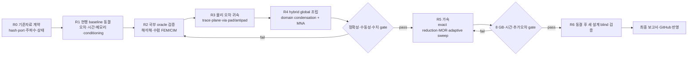

# SPD Decap PI Evaluator v0.22.0 — Evaluation Algorithm Research

이 디렉터리는 Evaluation PI 계산 알고리즘의 장기 연구를 위한 **단일 재시작 지점(single restart point)** 이다. 연구 세션이 바뀌거나 대화 문맥이 압축되어도 이 문서에서 다시 시작한다.

기준 소스는 `bb361687c0bf976d5d04faf26bc243bcf3d52006`이며, 연구 문서는 `codex/evaluation-algorithm-research` 브랜치의 별도 worktree에 둔다. 원본 프로그램의 표시 버전은 **SPD Decap PI Evaluator v0.22.0**이다. 사용자가 명시적으로 구현을 승인하기 전까지 제품 코드는 수정하지 않는다.

## 변하지 않는 연구 목적

1. PowerSI 결과에 근접하는 정확성을 최우선으로 확보한다.
2. 정확성 판정을 통과한 물리 모델에 한해서 계산량·메모리·주파수 sweep을 최적화한다.
3. 목표 장비인 i9-12900H/8 GB 노트북에서 peak RSS와 wall time을 측정해 검증한다.
4. 특정 네 개 파일에 맞춘 보정값이 아니라, 새로운 설계에도 설명력과 재현성이 있는 알고리즘을 선택한다.
5. 최종 알고리즘, 실패한 대안, 검증 결과, 한계를 보고서로 남기고 마지막 단계에서 GitHub에 반영한다.

정확성 우선순위는 바뀌지 않는다. 속도 향상이 기준 PowerSI 상관성, 수동성, 상호성, 보존 법칙 또는 수치 신뢰성을 훼손하면 채택하지 않는다.

표기 규칙은 고정한다. `P1`–`P4`는 네 개의 **dataset pair**, `R0`–`R7`은 **research phase**다. 새 문서에서 phase에 `P` prefix를 사용하지 않는다.

## 현재의 핵심 판단

- 현행 결과의 가장 큰 문제는 modal order나 주파수 점 수가 아니라 **물리 모델 형식 오차(model-form error)** 이다.
- 현재의 `passed` 보고서는 runner/구조적 완료를 뜻하며 정확성 승격을 뜻하지 않는다. 보존된 실제 결과에서 loaded rail의 100 kHz–100 MHz 평균 크기 RMS 오차는 16.743 dB, 위상 RMS는 44.28°이다.
- 우선 후보는 실제 artwork를 보존하는 적응형 2.5D 평면 영역 분할과, port/via/pad/antipad/trace/spreading의 국부 교체 보정을 결합한 passive global MNA이다.
- exact graph reduction은 admissible scalar branch에서 물리 근사 전에 적용할 수 있는 1차 축소 후보다. mutual/topology block이 바뀔 때마다 reduced/unreduced parity를 다시 인증한다.
- PRIMA 계열 passive MOR과 adaptive frequency sampling은 물리 모델이 정확성 gate를 통과한 뒤에만 적용한다.
- 현재 full-board SuperLU 경로는 factor 하나만으로 약 10 GiB를 가정하므로 8 GB 장비의 해법이 될 수 없다.
- workstation에서 검증된 substrate ROM을 만들고 laptop에서 scenario update를 수행하는 2-tier 구조가 현재의 현실적 첫 경로다. 다만 이는 사용자의 laptop end-to-end 목표를 폐기하는 것이 아니며, cold compile의 local 실행 가능성도 별도 연구 항목으로 유지한다.
- Pair P2는 Touchstone reference 무결성은 양호하지만 bottom-side untagged PowerSI port가 현행 top-attached IO 계약 밖이라 import가 fail-closed 되었다. 현재는 작은 solver baseline이 아니라 external-port 의미 계약 case다.
- Pair P3/P4는 response 변화가 VQPS에 집중되지만 SPD에 저장된 PowerSI/3DEM 설정도 다르다. solver-state confound를 닫기 전에는 clean controlled perturbation으로 부르지 않는다.
- 새 물리 block은 board curve에 바로 맞추지 않고 canonical coupon에서 scaling, convergence, invariant와 exact-minus-core ownership을 먼저 통과해야 한다.
- N0 exact route reduction은 independent scalar R/L coupon에서 machine-precision parity를 통과했다. 이 인증은 mutual/multiterminal block이나 topology replacement에 자동 전이되지 않는다.
- S1/V1/V2/A1/C1의 기존 kernel은 유용한 부분 invariant를 통과했지만 global correction 승격에는 모두 차단됐다. 특히 A1의 마지막 mesh 변화는 4.73%로 사전 등록한 0.5%/1% gate를 넘는다.
- source parameter는 `explicit`, `absent`, `parser_not_preserved`, `derived_node_link`로 구분한다. P3/P4 trace width 결손, 네 pair의 plating/fill/roughness 결손, P1/P2의 미보존 `NoAntiPadLayers`를 추정으로 숨기지 않는다.

## 세션 시작 절차

새 세션의 첫 작업은 아래 순서로 문서를 읽는 것이다.

1. 이 `README.md`: 목적, 우선순위, 금지사항 확인
2. [`RESEARCH_STATE.md`](RESEARCH_STATE.md): 현재 단계, 결정, 미해결 질문, 다음 행동 확인
3. [`REFERENCE_DATASET.md`](REFERENCE_DATASET.md): 기준 파일 identity, port/frequency 계약, holdout 정책 확인
4. [`SOURCE_PARAMETER_MANIFEST.md`](SOURCE_PARAMETER_MANIFEST.md): source-derived 값, 결손, parser preservation과 owner ID 확인
5. [`P2_EXTERNAL_PORT_SPEC.md`](P2_EXTERNAL_PORT_SPEC.md): P2 exact terminal set와 operator unknown gate 확인
6. [`BASELINE_PROTOCOL.md`](BASELINE_PROTOCOL.md): 단계별 상태, pair P2 차단 조건, 자원/보고 gate 확인
7. [`ALGORITHM_CANDIDATES.md`](ALGORITHM_CANDIDATES.md): 후보 순위와 논문 근거 확인
8. [`LOCAL_ORACLE_PLAN.md`](LOCAL_ORACLE_PLAN.md): canonical 실험, exact-minus-core 계약, ablation 순서 확인
9. [`R2_ORACLE_RESULTS.md`](R2_ORACLE_RESULTS.md): 실제 coupon 판정과 수치 blocker 확인
10. [`ORACLE_REPRODUCTION.md`](ORACLE_REPRODUCTION.md): custom numerical table의 exact 재현 명령 확인
11. [`SESSION_LOG.md`](SESSION_LOG.md)의 가장 최근 항목: 직전 세션의 증거와 중단 지점 확인

그 뒤 `git status`, 현재 branch/HEAD, 원본 파일의 존재와 hash를 확인한다. 이미 확정한 분석을 근거 없이 다시 수행하거나 목표를 재정의하지 않는다.

## 세션 종료 절차

모든 연구 세션은 종료 전에 다음을 수행한다.

1. `RESEARCH_STATE.md`의 날짜, 단계, 확정 결정, 열린 질문, 다음 행동을 갱신한다.
2. `SESSION_LOG.md`에 수행한 명령/실험, 입력 identity, 결과, 실패, 해석, 다음 중단 지점을 append한다.
3. 새 데이터 또는 mapping이 생기면 `REFERENCE_DATASET.md`를 갱신한다.
4. 후보의 순위나 채택/기각 사유가 바뀌면 `ALGORITHM_CANDIDATES.md`를 갱신한다.
5. baseline 상태/자원 gate가 바뀌면 `BASELINE_PROTOCOL.md`, oracle/ownership gate가 바뀌면 `LOCAL_ORACLE_PLAN.md`를 갱신한다.
6. 구조적 pass, reference integrity, 정확성 승격, 성능 승격을 서로 다른 상태로 기록한다.
7. raw SPD/Touchstone, 생성된 대용량 행렬, 민감한 경로는 Git에 추가하지 않는다.

## 연구 흐름

## 역할과 검증 원칙

- 현재 세션의 root agent가 연구 범위, 증거, 문서, 최종 판단의 책임을 가진다.
- Sol은 전체 감독과 고난도 수치/전자기 알고리즘 탐구를 담당한다.
- Terra는 구현 구조, 수치 신뢰성, 테스트/회귀 위험을 검토한다.
- Luna는 대용량 기준자료의 streaming 조사와 반복 가능한 데이터 작업을 담당한다.
- sub-agent의 결론은 source, 실제 파일, 테스트 또는 계산 결과로 root가 검증한 뒤 채택한다.
- PowerSI는 목표 reference이지만 절대적인 수학적 ground truth로 간주하지 않는다. mesh/order convergence와 export 조건도 함께 기록해야 한다.

## 완료 정의

연구 완료는 다음을 모두 만족할 때만 선언한다.

- 동결된 알고리즘과 source-derived parameter 정책이 provisional accuracy gate를 통과한다.
- 네 개 기준 pair에서 전체·설계별·rail별 회귀가 없고, 새로운 다섯 번째 설계에서 blind validation을 통과한다.
- 수동성, 상호성, KCL/charge conservation, conditioning/forward reliability를 통과한다.
- 목표 노트북에서 peak RSS와 wall time을 직접 측정하고 성능 승격 여부를 판정한다.
- 실패한 후보와 한계를 포함한 최종 보고서를 작성한다.
- 사용자의 검토 뒤 GitHub issue/branch/PR 또는 합의된 형태로 보고서와 결과를 반영한다.

현재 상태와 다음 행동은 반드시 [`RESEARCH_STATE.md`](RESEARCH_STATE.md)를 기준으로 한다.
