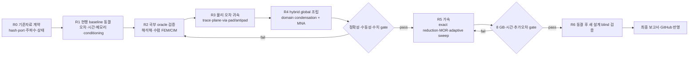

# SPD Decap PI Evaluator v0.22.0 — Evaluation Algorithm Research

> **SPD Decap PI Evaluator v0.22.0 — retry-v10 final documentation
> freeze:** Ten public attempts are immutable. The tenth ran once and exited
> public stage `2`; producer/finalizer/consumer PIDs `54044`/`25200`/`41812`
> exited `0`, exactly two factor certificates/prefixes were retained in order
> `A_background_II`, `A_conductor_II`, factor/resource gates passed, and all
> `205/205` identities were absent after cleanup. Inner/outer monitoring used
> `245`/`664` samples over `34.1760023`/`91.722828 s`; peak working set was
> `511868928`/`495939584`, private bytes `1994665984`/`1993838592`, lifetime
> commit `2322489344`/`2335375360`, with `39` nontruncated outer retries. Host
> availability was about 45 GB, so no 8 GB claim follows. No RHS, solve,
> extension, `Y`, modal response, H4 physics, or PowerSI ran. Three order-only
> claim/guard/resource JSON mismatches made the raw seal non-authoritative.
> Strict classification is `consumed_v2_provisional_invalid_terminal_evidence`,
> `authoritative_terminal_evidence=false`, disposition `null`, exact terminal
> detail `BLOCKED_AV_BS_RESULT_SCHEMA: terminal pre-exit
> normal_pass_outer_evidence_reconciliation_pass mismatch`. M-only
> `785f5e9c0a38ad1851c4ba620f520db9087aaf74` then D-only
> `a139d867bbc727b58f9a7a4cdbad604fc03070cf` leave token absent/next false.
> Retry-v10 changes only strict JSON: strict UTF-8, duplicate/nonfinite reject,
> object root/depth32/16 MiB bounds, ordinal O(n) key/string/field/evidence
> equality, and lowercase SHA-256 hex guards. Schemas, factor math,
> retry/resource policy, and physics boundary are unchanged. Bindings: Python
> `46082123fbf98102f3e5995c32bf65d8d04bb835b9c1305de0150349e75e48c7`,
> runner `f0159061dbd4d1b34881911edfdfb72146a3a23e5cdc75ca8fa4069c08aadb86`
> (`484795` bytes), tests
> `e5496ceb24c33c835b88ce20a3f67f941c8279e0471708a01022238fc211b109`
> (`488591` bytes). Collection `400`; current-byte focused `5/5` in `2.73 s`;
> independent same-byte `5/5` in `2.71 s`. A provisional full attempt reached
> `398 passed, 2 failed in 94.17 s` from two corrected static contract drifts;
> the first successful full exact-document suite then passed `400/400` in
> `93.89 s`, exit `0`, with no failure. This is the **FINAL DOC FREEZE**; any
> separately authorized run would be eleventh.
>
> **Historical retry-v9 final documentation
> freeze:** Nine public `primary-h4-p0r` invocations are immutable. The ninth ran
> once from retry-v8 token-only commit `0597872...`, token ID `0ec78f53...`; the
> public invocation exited `1`. Factor child PID `51184` exited `0` and produced
> `factor_certificates_complete` with exactly two certificates and two prefix
> checkpoints in order `A_background_II`, `A_conductor_II`; both factor cap gates
> passed. No RHS, solve, extension, boundary `Y`, modal response, or physics ran.
> Inner and outer resource gates passed, and the terminal cleanup audit found all
> `182/182` process identities dead. This factor-only resource evidence is not an
> 8 GB fit claim. The published artifact is a finalizer failure
> wrapper, `BLOCKED_AV_BS_RESULT_SCHEMA` / `monitor-ready child_process_id
> mismatch`: offline verifier PID `37248` was incorrectly used instead of the
> resource-bound producer PID `51184`. A raw terminal seal exists, but strict
> `_validate_outer_terminal_evidence` rejects `terminal control marker chronology
> invalid`; three canonical-JSON helper bootstraps mixed Python
> `time.monotonic_ns()`/GetTickCount64 with PowerShell Stopwatch/QPC. The retained
> tombstone-plus-seal classification is therefore
> `consumed_v2_provisional_invalid_terminal_evidence`, not authoritative. M-only
> consumption `b9c1964...` and D-only retirement `c14f630...` leave the token
> absent. Retry-v9 only threads the explicit resource child PID through offline
> validators and changes embedded bootstrap marker timestamps to
> `time.perf_counter_ns()`/QPC; bootstrap SHA-256 is `0c92a0ec...`. Frozen
> Python/runner/tests SHA-256 are `46082123...` / `229aa91b...` / `2106e533...`.
> Collection is `397`; focused exact selection passed `20` with `377` deselected
> in `2.33 s`, independent same-byte selection passed `20` with `377` deselected
> in `2.37 s`, and compatibility selection passed `7` with `390` deselected in
> `0.95 s`. The first full exact-document suite passed `397/397` in `92.95 s`
> with exit `0` and no failure. This is the **FINAL DOC FREEZE**. Schemas,
> strictness,
> retry/max3/cap64, factor order/caps, resource ceilings, and the RHS/solve/physics
> boundary are unchanged. `factor_fit_unproven=true`;
> `next_stage_authorized=false`. Earlier retry-v8 sections are immutable history;
> any separately authorized future public invocation would be tenth. Evidence is in
> [results](T1_AV_BOUNDARY_SCHUR_RESULTS.md) and the
> [reproduction appendix](ORACLE_REPRODUCTION.md).
>
> Every pre-existing retry-v9, ninth-attempt, future-tenth, `397/397`, or
> **FINAL DOC FREEZE** statement later in this file is an immutable historical
> snapshot. Only the retry-v10 block above states current authority.

이 디렉터리는 Evaluation PI 계산 알고리즘의 장기 연구를 위한 **단일 재시작 지점(single restart point)** 이다. 연구 세션이 바뀌거나 대화 문맥이 압축되어도 이 문서에서 다시 시작한다.

기준 소스는 `bb361687c0bf976d5d04faf26bc243bcf3d52006`이며, 연구 문서는 `codex/evaluation-algorithm-research` 브랜치의 별도 worktree에 둔다. 원본 프로그램의 표시 버전은 **SPD Decap PI Evaluator v0.22.0**이다. 사용자가 명시적으로 구현을 승인하기 전까지 제품 코드는 수정하지 않는다.

## 변하지 않는 연구 목적

1. PowerSI 결과에 근접하는 정확성을 최우선으로 확보한다.
2. 정확성 판정을 통과한 물리 모델에 한해서 계산량·메모리·주파수 sweep을 최적화한다.
3. 목표 장비인 i9-12900H/8 GB 노트북에서 peak RSS와 wall time을 측정해 검증한다.
4. 특정 네 개 파일에 맞춘 보정값이 아니라, 새로운 설계에도 설명력과 재현성이 있는 알고리즘을 선택한다.
5. 최종 알고리즘, 실패한 대안, 검증 결과, 한계를 보고서로 남기고 마지막 단계에서 GitHub에 반영한다.

정확성 우선순위는 바뀌지 않는다. 속도 향상이 기준 PowerSI 상관성, 수동성, 상호성, 보존 법칙 또는 수치 신뢰성을 훼손하면 채택하지 않는다.

표기 규칙은 고정한다. `P1`–`P4`는 네 개의 **dataset pair**, `R0`–`R7`은 **research phase**다. 새 문서에서 phase에 `P` prefix를 사용하지 않는다.

## 현재의 핵심 판단

- 현행 결과의 가장 큰 문제는 modal order나 주파수 점 수가 아니라 **물리 모델 형식 오차(model-form error)** 이다.
- 현재의 `passed` 보고서는 runner/구조적 완료를 뜻하며 정확성 승격을 뜻하지 않는다. 보존된 실제 결과에서 loaded rail의 100 kHz–100 MHz 평균 크기 RMS 오차는 16.743 dB, 위상 RMS는 44.28°이다.
- 우선 후보는 실제 artwork를 보존하는 적응형 2.5D 평면 영역 분할과, port/via/pad/antipad/trace/spreading의 국부 교체 보정을 결합한 passive global MNA이다.
- exact graph reduction은 admissible scalar branch에서 물리 근사 전에 적용할 수 있는 1차 축소 후보다. mutual/topology block이 바뀔 때마다 reduced/unreduced parity를 다시 인증한다.
- PRIMA 계열 passive MOR과 adaptive frequency sampling은 물리 모델이 정확성 gate를 통과한 뒤에만 적용한다.
- 현재 full-board SuperLU 경로는 factor 하나만으로 약 10 GiB를 가정하므로 8 GB 장비의 해법이 될 수 없다.
- workstation에서 검증된 substrate ROM을 만들고 laptop에서 scenario update를 수행하는 2-tier 구조가 현재의 현실적 첫 경로다. 다만 이는 사용자의 laptop end-to-end 목표를 폐기하는 것이 아니며, cold compile의 local 실행 가능성도 별도 연구 항목으로 유지한다.
- Pair P2는 Touchstone reference 무결성은 양호하지만 bottom-side untagged PowerSI port가 현행 top-attached IO 계약 밖이라 import가 fail-closed 되었다. 현재는 작은 solver baseline이 아니라 external-port 의미 계약 case다.
- Pair P3/P4는 response 변화가 VQPS에 집중되지만 SPD에 저장된 PowerSI/3DEM 설정도 다르다. solver-state confound를 닫기 전에는 clean controlled perturbation으로 부르지 않는다.
- 새 물리 block은 board curve에 바로 맞추지 않고 canonical coupon에서 scaling, convergence, invariant와 exact-minus-core ownership을 먼저 통과해야 한다.
- N0 exact route reduction은 independent scalar R/L coupon에서 machine-precision parity를 통과했다. 이 인증은 mutual/multiterminal block이나 topology replacement에 자동 전이되지 않는다.
- S1/V1/V2/A1/C1의 기존 kernel은 유용한 부분 invariant를 통과했지만 global correction 승격에는 모두 차단됐다. 특히 A1의 마지막 mesh 변화는 4.73%로 사전 등록한 0.5%/1% gate를 넘는다.
- T1의 lossless Cohn body-fitted `C'`, periodic two-plate smooth-copper identity, 독립 1-D slab FEM과 `C0-A1` 원형 interior DtN gate는 제한 범위에서 통과했다. M0의 lateral-periodic slab과 finite/open rectangle은 다른 경계값 문제이므로 free-space `H2` contour를 periodic `coth`와 직접 비교하지 않는다. 사전 등록했던 `C0-A0` 저주파 `10^6` switch는 작은 원 100 kHz에서 실패했다. 첫 finite/open M1-EQ0 collocation의 power failure `1.585e-4 > 1e-8`은 immutable이다. G1 exterior Galerkin은 structural/q/`r0`/power/terminal gate를 통과했지만 interior `WYs` weighted-reciprocity `1.70%–7.12%`와 100 kHz/1 MHz passivity가 실패해 `passed_exterior_galerkin_only`다. G2 pair screen은 `passed_pair_screen_only`지만, 같은 session의 circle `N=128→256` stage는 100 kHz에서 fail-closed 됐다. q/analytic/mesh와 해당 circle operator의 raw passivity는 통과했지만 N128 cancellation condition `2.91315e-8`, N256 raw `Yw` reciprocity `1.41197e-8`과 cancellation `1.63755e-7`이 모두 `1e-8` gate를 넘었다. 이 circle passivity는 G1의 저주파 passivity failure를 해결한 것이 아니다. 현재 G2 상태는 `BLOCKED_INTERIOR_WEIGHTED_RECIPROCITY_PASSIVITY__G2_PAIR_PASSED_CIRCLE_100KHZ_RECIPROCITY_CANCELLATION_FAIL`; planned G2 2 GHz circle row, G2 N512, G2 EQ0 seed와 G2 terminal/power는 미실행이다. 독립 A–v volume-FEM boundary-Schur의 H0는 pre-factor sparse-pattern preregistration 오류로 차단됐지만 topology-tagged H1 coarse `h`와 H2 refined `h2`가 각각 stage-only gate를 통과했다. 최신 상태는 `passed_AV_BS_h2_stage_only_pending_h4_preregistration`이며 [`T1_AV_BOUNDARY_SCHUR_RESULTS.md`](T1_AV_BOUNDARY_SCHUR_RESULTS.md)가 H0/H1/H2 artifact를 함께 보존한다. h→h2 RMS/max trend는 `0.462796%/0.868015%`지만 trend-only다. fine/convergence/final-circle 값은 `null`, `next_stage_authorized=false`이므로 아직 oracle이 아니다. production SAO의 Hamiltonian Schur/four-operator Calderón은 별도 후속 후보다. h4/withheld, 3-D end audit, 실제 return polygon, absolute/exact-core global operator, PowerSI correlation과 8 GB product status는 계속 차단 상태다.
- **retry-v3까지의 immutable history:** H2-P1은 H1/P0 lineage, token/claim/guard/finalizer/atomic tombstone, native process-tree 900 s guard, signed-M9 trend-only와 독립 modal PDE residual/volume-power certificate를 고정한 뒤 one-use `primary-h2`를 실행했다. artifact SHA-256은 `b890e4af13d97591b3134788984b3657f6f6b046e3043ce0a6f6792fe1ad7f55`이고 local gate가 통과했다. active token은 consumed tombstone SHA-256 `81574c1099bdd140004940b7cb768a20298b153445c1b16b9e21de95011c48c2`, `uses_remaining=0`, `next_stage_authorized=false`다. 별도 H4-P0는 32,001-node topology, 7,424 topology-owned cyclic tags, canonical `K/M/MΓ`와 H4 전용 `256uκ` certificate를 assembly-only로 고정했다. 이어 H4-P0R manifest parent와 factor-only P1 executable/lifecycle 계약을 동결했다. 그러나 세 public fresh-token 시도는 모두 claim/factor 전에 fail-closed됐다. 첫 번째는 root-only strict-mode collection 오류, 두 번째는 pre-ready outer tree-sampling 예외였고, 세 번째는 outer/control ready/start release까지 도달한 뒤 bounded control preflight tree sampling이 default `MaximumAttempts=1`에서 confirmed non-root disappearance를 만나 `TRANSIENT_DESCENDANT_DISAPPEARANCE_RETRY_EXHAUSTED`로 중단됐다. 세 token은 모두 재사용 없이 삭제-only retirement됐으며 세 번째 token retirement commit은 `ba97dd8b274659a649d9a4020193c3ef72572665`다. 당시 frozen/static-audited retry-v3 scope-v2는 six outer-observer contexts와 six control-plane contexts(12 total)에만 `MaximumAttempts=3`을 적용하고 factor sampling은 default `MaximumAttempts=1`을 유지했다. retry-v3 retirement 시점 token은 absent였고 `factor_fit_unproven=true`, `next_stage_authorized=false`이며 factor/RHS/solve/H4 physics는 실행되지 않았다. 이 이력의 prior token은 절대 재사용하지 않는다.
- P1/P2 explicit-ref crop에서 referenced return artwork와 nearby same-net GND via graph는 확인했지만 signal trace와 return conductor를 묶는 signed current/field owner는 없다. 특히 P2 세 TOP trace endpoint는 IN01 GND negative-circle void 중심에 놓이므로, ref 이름이나 가까운 via만으로 source-faithful return을 선언하지 않는다.
- source parameter는 `explicit`, `absent`, `parser_not_preserved`, `derived_node_link`로 구분한다. P3/P4 trace width 결손, 네 pair의 plating/fill/roughness 결손, P1/P2의 미보존 `NoAntiPadLayers`를 추정으로 숨기지 않는다.

## Retry-v4 historical boundary

Earlier retry-v2/retry-v3 sections remain immutable history. Four public
H4-P0R-P1 invocations have now stopped before claim and factor work. The fourth
used token-only commit `9b4854d0cc7ae21e5e9eafc394a9474cb53ea689`, whose sole
parent was clean contract `4d39eab9c464f67e8684e2d539ac3a2b092142a2`.
It ran once from `2026-08-15T13:37:16.0468244Z` to
`2026-08-15T13:37:20.5004777Z`, returned exit `2`, and failed closed during
bounded control preflight. PID `40224` had an exited identity with the expected
positive birth, while the first complete Toolhelp snapshot still contained the
same PID. No claim, factor, RHS, solve, H4 physics, PowerSI result, or 8 GiB fit
result was created. Token ID `4c209c8a4dac49b89c59dd69bf68c4c2`, raw SHA-256
`d3bb3a42c83848678f0b99c0c669fffb5ab02e594cfba31ee9251c8216d05d64`,
was semantically spent and then removed by deletion-only retirement commit
`f1aeeac018a96cbd82341db36efbf5e5a9a55431`. Current token state is absent.

Retry-v4 changes only the PowerShell observer for explicit outer/control
`MaximumAttempts>1` contexts. An `exited` descendant with a positive birth equal
to the bound birth that is still present in the initial complete snapshot may
receive two 25 ms rechecks, for at most three complete snapshots total. If it
becomes absent, the existing confirmed-disappearance event is emitted and the
existing whole-sample retry rules apply. `not_found`/87 plus snapshot presence,
default `MaximumAttempts=1` factor sampling, PID reuse, root loss/reuse, and
identity/query/access/incomplete-snapshot failures remain immediately fatal.
There is no schema or Python change.

Frozen retry-v4 static bindings are Python
`95c9f5c08282105f7934fbea194694fff3ab850daac633619534044721639234`, runner
`7893cd57fd4b1686addd434fa0103d9f3b0e0087f4783f2c82e459661abfb645`, and tests
`18aabcdf7b32c6b013aec65497d31f4d908f3085f53f64cb3791f38a2e79381d`.
Focused tests passed `11/11`; the full no-cache P1 suite passed `322/322` in
`82.01 s`; PowerShell AST was `47,623` tokens with zero errors and Python AST was
clean. This static pass does not authorize a token or factor run:
`next_stage_authorized=false`.

## Frozen retry-v5 boundary

Earlier retry-v2/retry-v3/retry-v4 sections remain immutable history. Five
public H4-P0R-P1 invocations are now preserved. The fifth used token-only commit
`5ba4b69398f526a0fcf640cf1dc4e7197cc7e660`, whose sole parent was clean
retry-v4 contract `099db849564207b636f7431ee2fb52a540a7cb4e`. It ran once from
`2026-08-15T14:33:12.122Z` through `2026-08-15T14:34:23.345Z`, returned exit
`2`, created claim `96d4f060ffa94d4888ffe3e59f550225`, and reached factor-only
child PID `55552`. The child was visible in all `108` successful factor-resource
samples before the monitor stopped on
`NONROOT_DISAPPEARANCE_NOT_CONFIRMED`. The active factor calls had retained the
function default `MaximumAttempts=1`, so the already-approved bounded
same-birth disappearance retry was not active there.

No factor prefix, factor-complete marker, certificate, or monitor release was
created. Thus completed/certified factors are exactly zero, while actual
`splu` entry cannot be recovered from the externally terminated zero-byte
stdout; `factorization_attempted=null` and `factorization_performed=null` are
the only supportable values. RHS, factor solve, H4 physics, PowerSI correlation,
and an 8 GiB result were not performed. Resource ceilings were not approached.
The outer close recorded `27` confirmed disappearances but retained only `16`,
set `tree_sample_retry_events_truncated=true`, failed the mandatory outer gate,
and wrote no terminal seal despite verified cleanup and inner exit `2`.

Token ID `96d4f060ffa94d4888ffe3e59f550225`, original raw SHA-256
`a9cbd954b27685892bf720c777ef57f49830da7970eee9a267d6d87eb5665d00`,
was consumed in commit `46c08d405f530cce0cfbba9d908f8c266a26a002` and removed by
retirement commit `71d3dab442cbdfa6361e4e91de57d8f5b4d1a990`. Current token state
is absent. The zero-byte stdout hash produced a secondary result-schema overlay;
that observation is preserved but its normalization is explicitly deferred.

Retry-v5 is limited to two run-enabling changes: the four active factor tree
samples now pass explicit maximum `3`, and the shared bounded outer/control
retry-event cap is `64` instead of `16`. It does not change the retry predicate,
the two 25 ms settling waits, the maximum three complete snapshots per sample,
the default-one caught-cleanup path, or any fatal root/reuse/query/access/
not-found/incomplete-snapshot rule. No result/resource schema, matrix, factor,
RHS, or physics logic changes.

Frozen retry-v5 bindings are Python
`54aa7da9daa013cec41585ae07757e6c54e8e9d15da7f4f16d4f6546b6fb35aa`, runner
`3888524877f7a90966fb932f7f9fc4c9a48480134eb6295712eaa0ef548416a3`, and tests
`b51498ebe27a0210a09b3a12b26e0146d39c1249906469bcb1add1d2f2443f08`.
Focused tests passed `29/29` in `15.91 s`; the full no-cache P1 suite passed
`324/324` in `82.91 s`; PowerShell AST was `47,631` tokens with zero errors and
Python syntax checks were clean. This static pass authorizes neither a token nor
a physics run: `factor_fit_unproven=true`, `next_stage_authorized=false`.

## Retry-v6 historical boundary

Earlier retry sections remain immutable history. The sixth public
`primary-h4-p0r` invocation used token-only commit
`82775327d79742b6c3111ad33a87fd1a4953ee79`, whose sole parent was clean
retry-v5 contract `bddbf9cb3547ae0385c6e6bbc47424f630cca87e`. It created claim
`a3f49b44dd164da3a0ca1a6dc4c976c3` and launched factor child PID `55380`.
The provisional numerical artifact then failed on
`claimed preflight payload mismatch` before `_factor_one` or `splu`; its direct
child evidence fixes `factorization_attempted=false` and
`factorization_performed=false`. No factor prefix, completed/certified factor,
RHS, solve, H4 physics, or PowerSI work exists.

The outer observer failed independently. Session
`validation-output/av-bs1/outer-observer/session-21f46fec2e314e248cf051e4273b97f0`
closed on attempt-3 `TRANSIENT_DESCENDANT_DISAPPEARANCE_RETRY_EXHAUSTED` for
PID `53404`, stored all `30/30` retry events with
`tree_sample_retry_events_truncated=false`, verified cleanup, and wrote no
terminal seal. The cap-64 correction worked; this was neither truncation nor a
resource ceiling. The emergency outer record conservatively retained null
factor fields because the outer layer lacked trusted inner evidence.

Emergency replacement produced raw record SHA-256
`43bb34b225b6b1d376715615a90b7b6202e10da5a10679484a644b1911c4d1fb`.
It is exact and honest about consumption and lack of authority, but it is not a
strictly valid terminal tombstone: its nested `bindings` omitted
`resource_policy_sha256`. Commit
`06061a234ad7b1b911d7425b7765482bda58a87a` preserves that provisional record;
deletion-only retirement `c001b4498fc750b5955f5118844945c499fce119`
leaves the token absent. The sixth token must never be reused.

Retry-v6 is limited to two corrections: delete the redundant three-line
post-claim preflight comparison in Python, and add the missing nested emergency
`resource_policy_sha256` binding in the runner. It does not change schema, ABI,
the strict validator, retry predicates or limits, factor operations, RHS,
solve, or physics. Frozen candidate SHA-256 bindings are Python
`2373a13f51e2833e416e1ce6326587b9e1c782b5165d99f7002e7dbc4658ebc4`, runner
`852ce8a03b25e33b9eb26ec6f5ce295381dab493b1b26762ddea14be7196000d`, and tests
`f1d0b044cbf53e90dba128ec398ccd8b7a81da8c5137bea202b2852eb3f288af`.
Focused regressions passed `8/8`; the full no-cache `330/330` passed in
`81.83 s`. This candidate authorizes neither a token nor a public run:
`factor_fit_unproven=true`, `next_stage_authorized=false`.

## Retry-v7 historical boundary

The seventh public invocation ran once at token-only commit `4f60bd5...`.
Native `splu` returned for `A_background_II`, yielding attempted/performed
`true/true` and one completed name, but the native/exported equality guard
failed before any certificate or prefix. `A_conductor_II` was not attempted and
the exact native/exported counts were not persisted. Resource/outer/seal
`0f738eb5...` / `0e88d08f...` / `0b2f5623...` bind `174/573` samples, `31`
nontruncated retry events, passing resource gates, complete terminal evidence,
authoritative pass false, and next false. This is not accuracy or 8 GiB proof.

Retry-v7 requires `0 < exported <= native`, checks distinct native/exported
portable-byte formulas and caps both, without changing schema, retry policy,
factor order, or forbidden operations. Consumed/retirement commits
`51e5069...` / `17414cf...` leave the token absent. Frozen
Python/runner/tests SHA-256 are `7a1dba5e...` / `852ce8a0...` / `bd2e3e2c...`;
focused `25/25` and full no-cache `341/341` passed, the latter in `88.40 s`.
No RHS, solve, H4 physics, or PowerSI work ran. See the
[results](T1_AV_BOUNDARY_SCHUR_RESULTS.md) and
[reproduction appendix](ORACLE_REPRODUCTION.md).

## Retry-v8 historical static boundary

The eighth public `primary-h4-p0r` invocation ran once from retry-v7 token-only
commit `66211efbbdb7e0881e6bc051a2c68e25e5f1040e`. Native `splu` returned
for `A_background_II`; attempted/performed are `true/true` and the completed-name
list contains it. Combined non-canonical L/U storage then stopped the certificate
path with zero certificates and zero prefixes. `A_conductor_II`, RHS, solve, and
physics never started. The resource artifact passed, but independent outer/control
monitoring falsely exhausted retries across distinct confirmed-dead helpers.
There is no terminal seal or published result. Seven temporary evidence files
were copied byte-identically into ignored quarantine.

The emergency consumed tombstone is valid but provisional. M-only commit
`8fce704a878a39497408c42e1e63bdfa683b9413` records it, and D-only
retirement `7964464018ae898928f151d707fdc52a850cd935` removes the token.
Retry-v8 records raw L/U storage hashes, raw composite canonical flags (false
when unsorted), and explicit-zero scans before mutation. The pre-sort
`has_sorted_indices` value is a local sort predicate, not a certificate field;
chunked CSC column spans and row-index bounds are validated, nonfinite values
and explicit zeros fail, and every unsorted L/U is sorted in place. Sorted and
canonical format are then rechecked, which rejects duplicates; the canonical
hash helper enforces that format, and finite/zero data is re-scanned without
repeating the span or row-bound scan. There is no schema/field bump, L/U or
whole-factor matrix copy, coalescing, or pruning.

Attempt grouping is local to one `Get-TreeSample` producer call and state resets
per invocation. Within one call, `A,B,A => 1,1,1`; `A,B,B,B => 1,1,2,3`,
with same-identity attempt 3 fatal. Cumulative report history may legitimately
contain adjacent same-identity attempt `1/1` entries separated by a successful
return; report history therefore cannot enforce cross-call adjacency. Only the
close-only suffix, known to come from one call, enforces the exact adjacent-
strong transition.

The cumulative/local cap remains hard at 64 even when diagnostics are null.
Within a call, event 64 is stored and increments the total to 64; that same
64th confirmed retry fails generically with
`TREE_SAMPLE_TOTAL_RETRY_CAP_REACHED` unless simultaneous same-identity attempt
3 takes precedence, and the failing call does not return to its retry loop.
Reused diagnostics in a later cleanup or close call may advance
`confirmed_count` beyond 64 and truncate the stored list, but that evidence is
failed/truncated and can never support a passing sample. Existing max3/cap64
fields and schemas remain unchanged; cleanup-race hardening is deferred.

Frozen current Python/runner/tests SHA-256 are
`c26112b0738224eed4f1401553adf6fc9a3512b37c475f5b52152cab98e6ecff` /
`7e675cc31ab229485719200af8b508dae20bd234bff29428e84628029df2763e` /
`426f83888587dc57b7874a4e8dd47f0965212a0c1d7fabde33e6f3ab2801a2e7`.
Collection is `387`; focused root `23` passed / `363` deselected and
independent `27` passed / `360` deselected. The full exact-document suite passed `387/387` in `94.11 s`. A future
authorized public run would be ninth. Token state is absent, next-stage
authority is false, and factor fit and H4 physics remain unproven.

## Retry-v9 final documentation freeze

The ninth public `primary-h4-p0r` invocation ran exactly once from retry-v8
token-only commit `0597872eeaedd359ce5a3d429748dee2b70ec9a7`, token ID
`0ec78f5300cc4a63923e735e81b7e713`, and exited `1`. Factor producer PID
`51184` exited `0` with `factor_certificates_complete`: exactly two
certificates and two prefix checkpoints were published in the frozen order
`A_background_II`, `A_conductor_II`, and both factor cap gates passed. Inner and
outer resource gates passed, and all `182/182` recorded process identities were
dead at terminal cleanup. No RHS, solve, extension, boundary `Y`, modal
response, or physics ran.

The published artifact is nevertheless the finalizer failure
`BLOCKED_AV_BS_RESULT_SCHEMA` / `monitor-ready child_process_id mismatch`.
Offline validation supplied verifier PID `37248` where strict validation needed
the resource-bound producer PID `51184`. A raw terminal seal exists, but it is
not authoritative: `_validate_outer_terminal_evidence` rejects `terminal
control marker chronology invalid`. Three `canonical_json_hash-*` helper
bootstraps mixed Python `time.monotonic_ns()`/GetTickCount64 with PowerShell
Stopwatch/QPC. The retained tombstone-plus-seal classification is therefore
`consumed_v2_provisional_invalid_terminal_evidence`.

M-only consumption `b9c1964e8a445b2d45487894485dc8453bd002d4` and D-only
retirement `c14f6309e6b84effbc5139ed8dcdcf05d5ea61f1` leave the token
absent. Retry-v9 changes only offline identity threading and the embedded
bootstrap clock: validators receive the explicit resource child PID, marker
timestamps use `time.perf_counter_ns()`/QPC, and bootstrap SHA-256 is
`0c92a0ec8fe67868e222647782cb5eedabffcad77319348f55beaeb0dd745404`.
Schemas, strict gates, retry/max3/cap64 policy, factor order/caps, resource
ceilings, and the RHS/solve/physics boundary remain unchanged.

Frozen Python/runner/tests SHA-256 are
`46082123fbf98102f3e5995c32bf65d8d04bb835b9c1305de0150349e75e48c7`
(`579582` bytes),
`229aa91b04bd89e4af03f9a75c52a0a4819381ec5dfa32a272fe35ac7f1d94f9`
(`443675` bytes), and
`2106e5338158d2f61a63d572b6f452bd54b752f38500a566f573759096f2c36d`
(`458913` bytes). Collection is `397`. Focused exact selection passed `20`
with `377` deselected in `2.33 s`; an independent same-byte selection passed
`20` with `377` deselected in `2.37 s`; compatibility selection passed `7`
with `390` deselected in `0.95 s`. The first full exact-document suite passed
`397/397` in `92.95 s` with exit `0` and no failure. This is the **FINAL DOC
FREEZE**.
`factor_fit_unproven=true`; `next_stage_authorized=false`. Retry-v9 creates no
token; any separately authorized future public invocation would be tenth.

## 세션 시작 절차

새 세션의 첫 작업은 아래 순서로 문서를 읽는 것이다.

1. 이 `README.md`: 목적, 우선순위, 금지사항 확인
2. [`RESEARCH_STATE.md`](RESEARCH_STATE.md): 현재 단계, 결정, 미해결 질문, 다음 행동 확인
3. [`REFERENCE_DATASET.md`](REFERENCE_DATASET.md): 기준 파일 identity, port/frequency 계약, holdout 정책 확인
4. [`SOURCE_PARAMETER_MANIFEST.md`](SOURCE_PARAMETER_MANIFEST.md): source-derived 값, 결손, parser preservation과 owner ID 확인
5. [`P2_EXTERNAL_PORT_SPEC.md`](P2_EXTERNAL_PORT_SPEC.md): P2 exact terminal set와 operator unknown gate 확인
6. [`BASELINE_PROTOCOL.md`](BASELINE_PROTOCOL.md): 단계별 상태, pair P2 차단 조건, 자원/보고 gate 확인
7. [`ALGORITHM_CANDIDATES.md`](ALGORITHM_CANDIDATES.md): 후보 순위와 논문 근거 확인
8. [`LOCAL_ORACLE_PLAN.md`](LOCAL_ORACLE_PLAN.md): canonical 실험, exact-minus-core 계약, ablation 순서 확인
9. [`R2_ORACLE_RESULTS.md`](R2_ORACLE_RESULTS.md): 실제 coupon 판정과 수치 blocker 확인
10. [`T1_TRACE_ORACLE_RESULTS.md`](T1_TRACE_ORACLE_RESULTS.md): trace/return manufactured 결과, source 후보와 global 조립 blocker 확인
11. [`T1_RETURN_CROP_MANIFEST.md`](T1_RETURN_CROP_MANIFEST.md): P1/P2 explicit-ref crop의 실제 artwork, void, nearby return graph와 source-faithful blocker 확인
12. [`T1_M1_REFERENCE_SPEC.md`](T1_M1_REFERENCE_SPEC.md): homogeneous SAO–CIM과 independent A–v FEM의 식, fixture, 수렴·자원 gate 확인
13. [`T1_AV_BOUNDARY_SCHUR_SPEC.md`](T1_AV_BOUNDARY_SCHUR_SPEC.md): AV-BS1 subtraction-free circle reference candidate, frozen mesh/hash, raw gate와 fail-closed 순서 확인
14. [`T1_AV_BOUNDARY_SCHUR_RESULTS.md`](T1_AV_BOUNDARY_SCHUR_RESULTS.md): H0 pre-factor failure, H1 coarse-h와 H2 refined-h2 stage-only artifacts, consumed token과 non-claims 확인
15. [`T1_AV_BOUNDARY_SCHUR_H2_PREREG.md`](T1_AV_BOUNDARY_SCHUR_H2_PREREG.md): H2-P0 refined lineage, assembly certificate, resource preflight와 no-solve 경계 확인
16. [`T1_AV_BOUNDARY_SCHUR_H2_P1_PREREG.md`](T1_AV_BOUNDARY_SCHUR_H2_P1_PREREG.md): H2-P1 실행 전 immutable token-gated single-mesh 계약과 독립 M9 residual/power 증거 확인
17. [`T1_AV_BOUNDARY_SCHUR_H4_P0_PREREG.md`](T1_AV_BOUNDARY_SCHUR_H4_P0_PREREG.md): H4 topology/cyclic lineage/canonical assembly와 dual resource envelope의 no-solve 경계 확인
18. [`T1_AV_BOUNDARY_SCHUR_H4_P0R_PREREG.md`](T1_AV_BOUNDARY_SCHUR_H4_P0R_PREREG.md): factorization-only pilot의 frozen matrix/equilibration/resource/lifecycle 계약과 현재 no-factor 경계 확인
19. [`T1_AV_BOUNDARY_SCHUR_H4_P0R_P1_PREREG.md`](T1_AV_BOUNDARY_SCHUR_H4_P0R_P1_PREREG.md): executable/outer-observer/one-use/seal-v2 계약, 아홉 public attempt와 token retirement, immutable retry-v8 history, 아홉 번째 two-certificate/two-prefix factor/resource pass와 published finalizer PID mismatch, strict chronology-invalid raw seal 및 non-authoritative `consumed_v2_provisional_invalid_terminal_evidence`, frozen retry-v9 Python/runner/tests와 first full exact-document `397/397` in `92.95 s`, exit `0`, no failure 및 FINAL DOC FREEZE, prior token 재사용 없이 corrected no-token contract -> exact-byte/audit -> 별도 승인 -> fresh tenth token-only child 순서 확인
20. [`T1_M1_EQ0_RESULTS.md`](T1_M1_EQ0_RESULTS.md): immutable collocation failure, G1 exterior-only, G2 pair-only pass와 100 kHz circle reciprocity/cancellation failure 확인
21. [`T1_CIRCLE_DTN_RESULTS.md`](T1_CIRCLE_DTN_RESULTS.md): frozen `C0-A0` 실패, selected `C0-A1` circle-only 통과와 withheld/수치 범위 확인
22. [`T1_M0_SLAB_RESULTS.md`](T1_M0_SLAB_RESULTS.md): periodic slab의 independent 1-D FEM pass, withheld 결과와 free-space/periodic boundary mismatch 확인
23. [`ORACLE_REPRODUCTION.md`](ORACLE_REPRODUCTION.md): custom numerical table과 manifest의 exact 재현 명령 확인
24. [`SESSION_LOG.md`](SESSION_LOG.md)의 가장 최근 항목: 직전 세션의 증거와 중단 지점 확인

그 뒤 `git status`, 현재 branch/HEAD, 원본 파일의 존재와 hash를 확인한다. 이미 확정한 분석을 근거 없이 다시 수행하거나 목표를 재정의하지 않는다.

## 세션 종료 절차

모든 연구 세션은 종료 전에 다음을 수행한다.

1. `RESEARCH_STATE.md`의 날짜, 단계, 확정 결정, 열린 질문, 다음 행동을 갱신한다.
2. `SESSION_LOG.md`에 수행한 명령/실험, 입력 identity, 결과, 실패, 해석, 다음 중단 지점을 append한다.
3. 새 데이터 또는 mapping이 생기면 `REFERENCE_DATASET.md`를 갱신한다.
4. 후보의 순위나 채택/기각 사유가 바뀌면 `ALGORITHM_CANDIDATES.md`를 갱신한다.
5. baseline 상태/자원 gate가 바뀌면 `BASELINE_PROTOCOL.md`, oracle/ownership gate가 바뀌면 `LOCAL_ORACLE_PLAN.md`를 갱신한다.
6. 구조적 pass, reference integrity, 정확성 승격, 성능 승격을 서로 다른 상태로 기록한다.
7. raw SPD/Touchstone, 생성된 대용량 행렬, 민감한 경로는 Git에 추가하지 않는다.

## 연구 흐름

## 역할과 검증 원칙

- 현재 세션의 root agent가 연구 범위, 증거, 문서, 최종 판단의 책임을 가진다.
- Sol은 전체 감독과 고난도 수치/전자기 알고리즘 탐구를 담당한다.
- Terra는 구현 구조, 수치 신뢰성, 테스트/회귀 위험을 검토한다.
- Luna는 대용량 기준자료의 streaming 조사와 반복 가능한 데이터 작업을 담당한다.
- sub-agent의 결론은 source, 실제 파일, 테스트 또는 계산 결과로 root가 검증한 뒤 채택한다.
- PowerSI는 목표 reference이지만 절대적인 수학적 ground truth로 간주하지 않는다. mesh/order convergence와 export 조건도 함께 기록해야 한다.

## 완료 정의

연구 완료는 다음을 모두 만족할 때만 선언한다.

- 동결된 알고리즘과 source-derived parameter 정책이 provisional accuracy gate를 통과한다.
- 네 개 기준 pair에서 전체·설계별·rail별 회귀가 없고, 새로운 다섯 번째 설계에서 blind validation을 통과한다.
- 수동성, 상호성, KCL/charge conservation, conditioning/forward reliability를 통과한다.
- 목표 노트북에서 peak RSS와 wall time을 직접 측정하고 성능 승격 여부를 판정한다.
- 실패한 후보와 한계를 포함한 최종 보고서를 작성한다.
- 사용자의 검토 뒤 GitHub issue/branch/PR 또는 합의된 형태로 보고서와 결과를 반영한다.

현재 상태와 다음 행동은 반드시 [`RESEARCH_STATE.md`](RESEARCH_STATE.md)를 기준으로 한다.
