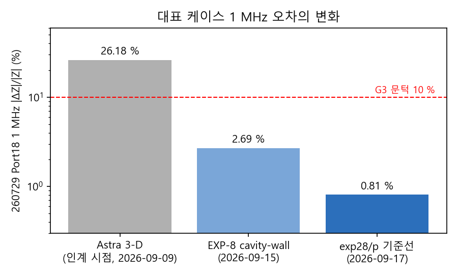
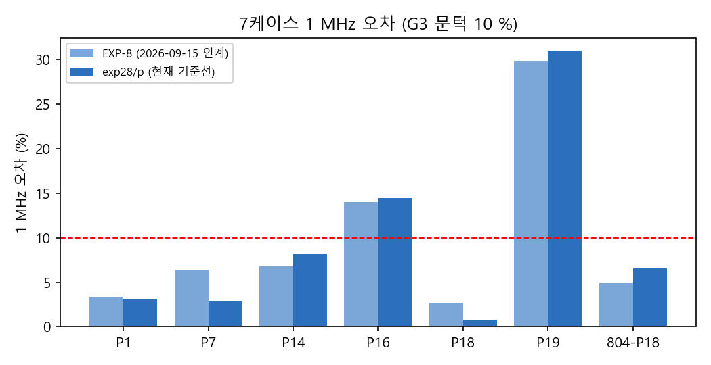
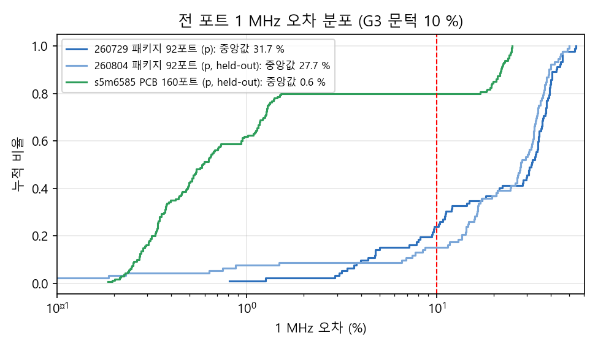
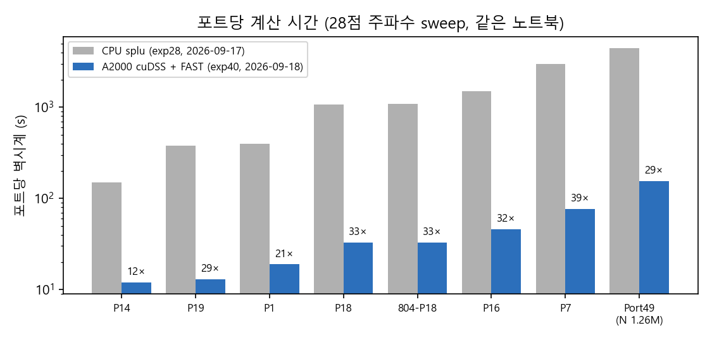

# 진행 정리 — 인계 시점 대비 개선점과 목표 도달 정도 (2026-09-18)

이 문서는 Claude가 연구를 넘겨받은 시점(2026-09-09, Astra 3-D 경로)부터 2026-09-18까지의 변화를 **영수증 수치**로 비교하고, 프로젝트 목표(PowerSI Touchstone과 맞는 경량 PDN 모델을 데스크톱 도구에 넣는 것) 대비 어디까지 왔는지 정리한다. 근거는 `results/expN/`의 JSON 영수증과 각 보고서다. 그래프는 `figures/progress_*.png`.

## 1. 한눈에 보기

| 항목 | 인계 시점 (Astra 3-D, 2026-09-09) | 2026-09-15 인계 (EXP-8) | **현재 (exp28/p + GPU 경로, 2026-09-18)** |
|---|---|---|---|
| 모델 | 3-D 전장(FMM3D 하이브리드), 미지수 378만 | 2-D plane-pair + 회로 하이브리드, cavity-wall 기준면 | 같은 모델 + 평면 C 단위 수정 + 균질화 경계조건 수정(D7) |
| 260729 Port18 1 MHz 오차 | **26.18 %** | **2.69 %** | **0.81 %** |
| 260804 Port18(held-out) | — | 4.89 % | 6.56 % |
| 7케이스 G3(1 MHz < 10 %) PASS | — | 5/7 | 5/7 (P16·P19는 R 결손) |
| 7케이스 G1 / G2 / G4 PASS | — | 4 / 4 / 0 | 2 / 4 / 0 |
| 260729 92포트 G3 PASS, err 중앙값 | — (미실행) | — (미실행) | 22/92, 31.7 % |
| 260804 92포트(held-out) | — | — | 14/92, 27.7 % (포트별 상관 ρ 0.95) |
| s5m6585 PCB 160포트(held-out) | — | — | **128/160, 0.58 %** |
| 계산 자원 | 1점·1포트 2214 s, 24.4 GB, 미수렴(info=1/3) | 포트당 21–601 s(클라우드 2 vCPU), ≤ 2.1 GB | **포트당 12–77 s(노트북, A2000), N 1.26M 포트 155 s** |
| 92포트 sweep | 불가 | 약 10 h(CPU) | **약 23 분**(GPU, 4 병렬) |
| 실험 수·영수증 | — | EXP-1~9 | EXP-1~41, 92/160포트 영수증 세트 8개 |

## 2. 정확도 — 무엇이 좋아졌고 무엇이 남았나

### 2-1. 7케이스 (260729 6포트 + 260804 Port18)

| 케이스 | EXP-8 err 1 MHz | 현재(p) | PASS(G1/G2/G3/G4) EXP-8 → 현재 |
|---|---|---|---|
| P1 | 3.39 % | 3.15 % | T/F/T/F → F/F/T/F |
| P7 | 6.32 % | 2.91 % | T/T/T/F → T/T/T/F |
| P14 | 6.79 % | 8.17 % | F/F/T/F → F/F/T/F |
| P16 | 14.01 % | 14.47 % | F/T/F/F → F/T/F/F |
| P18 | 2.69 % | **0.81 %** | T/T/T/F → T/T/T/F |
| P19 | 29.89 % | 30.89 % | F/F/F/F → F/F/F/F |
| 804-P18 | 4.89 % | 6.56 % | T/T/T/F → F/T/T/F |

- G1(1–100 kHz |ΔRe| ≤ 0.05 mΩ)이 4/7 → 2/7로 줄어든 것은 **결함 수정(EXP-27/28)이 가리고 있던 R 결손을 드러낸 결과**다(D7). 파국 오차(최대 382 %)는 사라졌고, 대형 평면 레일(P18·P7)은 1 % 안으로 들어왔다.
- G4(1–10 MHz 오차 < 20 %, f_res ±10 %)는 전 케이스 FAIL이 그대로다. C·L은 맞는데 f_res가 +5~14 % 편향된 문제(EXP-33/34, D8)로, 설계 무관하게 남아 있다.

### 2-2. 전 포트 일반화 (인계 시점에는 없던 검증)

| 세트 | n | err 1 MHz 중앙값(사분위) | G3 PASS | Re Z_ref/Re Z_model @100 kHz 중앙값 |
|---|---|---|---|---|
| 260729 패키지 (p) | 92 | 31.7 % (10.4–38.0) | 22 (24 %) | 1.46 |
| 260804 패키지 (p, held-out) | 92 | 27.7 % (14.7–34.6) | 14 (15 %) | 1.47 |
| s5m6585 PCB (p, held-out) | 160 | **0.58 % (0.34–1.29)** | **128 (80 %)** | 1.03 |

- **PCB에서는 모델이 맞는다**(EXP-30). 패키지 두 리비전은 같은 R 결손 패턴(참조/모델 1.46–1.47, 포트별 오차 상관 0.95)을 보이므로, 남은 오차는 설계 개별 특성이 아니라 **패키지 급전 구조(충전 microvia 스택·패키지 trace)에 대한 PowerSI 관례와의 차이**로 좁혀졌다(EXP-19/31/41).
- 보유 자료로 시험한 후보(via 길이 정의, via·벽 표피 R, Special Void 채움, 벽 R, via 배럴 면적, 기본폭 trace 등 EXP-11~36)는 모두 "방향은 맞으나 문턱 미달" 또는 "원인 아님"으로 기록됐다. 남은 판별은 PowerSI microvia 모델 정의(도금 두께 0의 의미)의 GUI 확인에 달려 있다.

## 3. 효율 — 노트북에서 실용 가능한 수준으로

| 단계 | 변경 | 효과 (P18 기준) |
|---|---|---|
| EXP-37 | cuDSS(A2000) 인수분해 + assemble 캐시(Y 비트 동일) | 인수분해 38.7 s → 0.1 s/점, assemble 2.15 → 0.13 s/점 |
| EXP-38 | 균질화 창 중복 제거(G 비트 동일) + CG의 CuPy 이식 | 균질화 152 → 3 s |
| EXP-39 | 레이어 단위 래스터 캐시(정확) | 가설 기각, Port49 −7 % |
| EXP-40 | matplotlib 규칙을 재현한 스캔라인 점-포함 판정 | build 400 → 13.8 s(Port49 1129 → 70 s) |
| 합계 | `SPD_PI_SOLVER=cudss SPD_PI_FAST=1` | **포트 벽시계 1074 → 33 s(33배), Port49 4459 → 155 s** |

기본 경로(CPU splu)는 바이트 단위로 불변이며(`smoke_port18.py` 5.83e-12), GPU 경로는 CPU 대비 max |ΔZ|/|Z| ≤ 5.6e-9다. 인계 시점의 Astra 경로는 512 GB 장비를 전제했으나 지금은 이 노트북에서 92포트가 23 분이다.

## 4. 프로젝트 목표 대비 도달 정도

목표(CLAUDE.md): PowerSI와 맞는 경량 모델을 만들어 제품(`src/`)의 layerwise 모델을 대체한다. 게이트 G1–G5(D3).

| 목표 요소 | 상태 | 판단 |
|---|---|---|
| 모델 경로 확정 | 2-D plane-pair + 회로 하이브리드(D2), 기준선 exp28/p(D7) | **완료** |
| 1 MHz 정확도(G3) | PCB 80 %, 패키지 대형 평면 레일 < 10 %, 패키지 전체 15–24 % | **부분** — 패키지 급전 경로 R 관례가 미해결 |
| 저주파 R(G1)·L(G2) | 패키지 2/7·4/7, 92포트 6/92·12/92 | **미달** — 같은 R 결손 원인 |
| 공진(G4) | 전 케이스 FAIL(f_res +5~14 %) | **미달** — 설계 무관 편향, 원인 미확정 |
| 10–100 MHz(G5, 보고만) | 고주파 R 부족 중앙값 0.34(표피 항 포함) | 기록 |
| 재현성·영수증 체계 | 모든 실험 사전 등록 + JSON 영수증 + 보고서, smoke 게이트 | **완료** |
| 계산 효율 | 노트북에서 포트당 수십 초, 92포트 수십 분 | **완료**(제품 통합에 충분) |
| 일반화 검증 | 패키지 2설계 92포트 + PCB 160포트 | **완료**(결과는 위) |
| 제품 통합(§6-8) | 미착수 | **미착수** — 정확도 판정이 끝나야 모드("PowerSI-compatible"/"Physical return") 확정 가능 |

**요약**: 인계 시점의 "동작하지 않는 3-D 경로(26 %, 수렴 실패, 장비 불가)"에서 "노트북에서 수십 초에 도는 2-D 하이브리드(PCB 0.6 %, 패키지 대표 레일 0.8–3 %)"로 왔다. 남은 격차는 두 가지로 좁혀졌고 둘 다 외부 입력이 필요하다: (1) 패키지 급전 경로 R 관례(PowerSI microvia 모델 정의 확인), (2) f_res 편향(1–10 MHz L 배분). 이 둘이 풀리기 전까지는 제품 통합을 "PCB·대형 평면 레일 우선" 범위로 한정하는 것이 현실적이다.

## 5. 근거 위치
- 인계 시점 수치: `DECISIONS.md` D1, `RESEARCH_LOG.md` §5(Astra 26.18 %, 2214 s/점, 24.4 GB).
- EXP-8: `results/exp8/result_*_any.json`. 현재 기준선: `WORK_DIR/exp28/result_*_any_p.json`(요약 `results/exp28/summary15_exp28.json`).
- 92/160포트: `results/exp28`, `results/exp41`(260804), `results/exp30`(PCB).
- 효율: `results/exp37..40` 보고서(같은 세션 단독 대조 표), 벽시계는 `WORK_DIR/exp28` 대 `WORK_DIR/exp40` 영수증.
