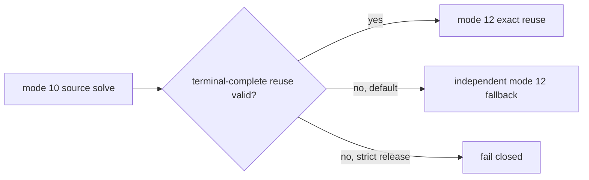

# Gate 2 terminal-complete reuse control

Decision A adds an explicit release-only control flag, `--require-terminal-complete-reuse`.
With the flag, a terminal-complete reuse mismatch fails closed before any independent
mode-12 solve. Without it, the historical development behavior remains unchanged.

Physics and numerical algorithms are unchanged. The raw candidate bundles were not
regenerated; this is a control-plane validation change only. Import provenance remains
bound to the historical benchmark/source inventory, while current correlation provenance
binds the new benchmark hash and commit.
